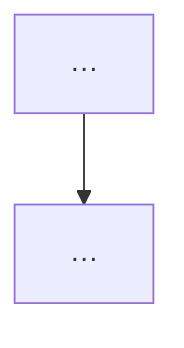

# Bölüm NN — <Konu Başlığı>

> **Bölümün çekirdek tezi:** <Bu mekanizmanın özünü 2-4 cümlede; niceliksel/niteliksel/doz ekseninde nereye düştüğü; önceki/sonraki bölümlerle köprü.>

> **Bu bölüm nasıl okunmalı?** <Opsiyonel okuma rehberi: tıp öğrencisi vs uzman için.>

> 🖼️ **Görseller hakkında not:** Şekiller `assets/` klasöründe SVG, akış diyagramları Mermaid olarak gömülüdür. (Standart not — kopyala.)

---

## Öğrenme hedefleri
Bu bölümü tamamlayan okuyucu:
1. …
2. …
3. … (6–8 madde; ölçülebilir fiillerle: ayırt eder, açıklar, ilişkilendirir, yorumlar)

---

## 1. Kavramsal tanım
<Gerekirse gruplu sözlük tablosu: Kavram | Tanım | Klinik anlamı. Her kritik terim için tanım + benzetme + klinik not.>

## 2. Moleküler mekanizma
<Derin anlatım. En az 1 SVG. Deep-dive kutuları:>
> **🔬 Deep-dive — <başlık>:** <derinlemesine, nüanslı açıklama>

## 3. Varyant tipleri
| Varyant tipi | Tipik moleküler sonuç | Notlar / ilgili bölüm |
|---|---|---|
| … | … | … |

## 4. Klinik fenotipe dönüşüm
<Bölümün "anahtar sorularını" başlıklar hâlinde yanıtla. Mermaid karar akışı eklenebilir.>

## 5. Tanısal testlerle ilişkisi
| Test | Bu mekanizmayı yakalar mı? | Sınırlılığı |
|------|----------------------------|-------------|
| WES | | |
| Short-read WGS | | |
| Long-read WGS | | |
| Array-CGH / SNP array | | |
| MLPA | | |
| RNA-seq | | |
| Methylation array | | |
| Karyotip | | |

> **Bu mekanizmayı hangi test yakalar? (özet):** <1-2 cümle pratik sonuç.>

## 6. Varyant yorumlama açısından önemi (ACMG/ClinGen)
<İlgili kriter(ler): PVS1/PM1/PS3/PP3/CNV HI-TS vb. Mekanizmayla bağ. İlgili karar ağacı (Mermaid).>

> **🟦 Klinikte dikkat — <başlık>:** <pratik uyarı>

## 7. Pediatrik genetikten klinik örnekler
<Somut, kaynaklı genler. Her örnek: kısa fenotip → mekanizma → öğreti. PMID/DOI'li.>

## 8. Sık yapılan hatalar
> **🔴 Sık yapılan hata kutusu**
> 1. …
> 2. …

> **🟦 Klinikte dikkat kutusu**
> - …

## 9. Klinik pratikte karar algoritması

## 10. Kaynaklar
> **Atıf / doğrulama notu:** Bu bölümün bibliyografik verileri PubMed üzerinden doğrulanmıştır; her kaynağın PMID ve DOI'si tek tek teyit edilmiştir. (Metin içinde yazar-yıl, kaynakçada DOI-link kullanılır; "Based on articles retrieved from PubMed" gibi ifadeler cümle başına KONMAZ.)

1. **Yazar ve ark. (Yıl).** Başlık. *Dergi* cilt(sayı):sayfa. **PMID: …** · DOI: [..](https://doi.org/..) — *Kullanım amacı: …*

> **İkincil/destekleyici kaynak notu:** GeneReviews/OMIM/ClinVar/gnomAD yalnız destekleyici bilgi.

---

## ✅ Bölüm öz-denetim tablosu
| Kriter | Durum | Not |
|--------|-------|-----|
| Mekanizma doğru anlatıldı mı? | | |
| Klinik bağlantı kuruldu mu? | | |
| Varyant tipi ile mekanizma ilişkilendirildi mi? | | |
| Pediatrik örnek verildi mi? | | |
| Test seçimi açıklandı mı? | | |
| ACMG/ClinGen bağlantısı doğru mu? | | |
| Kaynaklar PMID/DOI ile verildi mi? | | |
| Spekülatif iddialar işaretlendi mi? | | |
| Kaynak uydurma riski var mı? | | |
| Görsel/şema/algoritma desteği yeterli mi? (≥3 SVG, ≥2 Mermaid) | | |

---

### 🔎 Bölüm sonu kaynak doğrulama komutu (zorunlu)
> "Bu bölümdeki tüm kaynakların PMID/DOI bilgisini kontrol et. PMID veya DOI veremediğin kaynağı çıkar. Kaynağı olmayan iddiayı 'kaynak doğrulaması gerekli' olarak işaretle."
>
> **Bu bölüm için durum:** X/X kaynak PMID+DOI doğrulandı. <işaretlenen iddia varsa belirt.>
