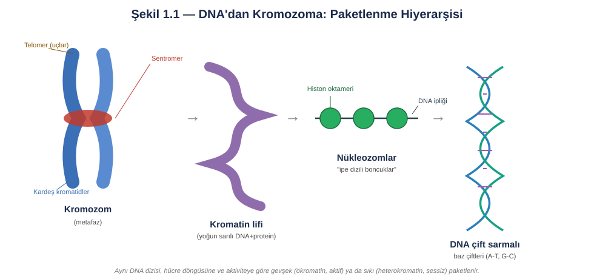
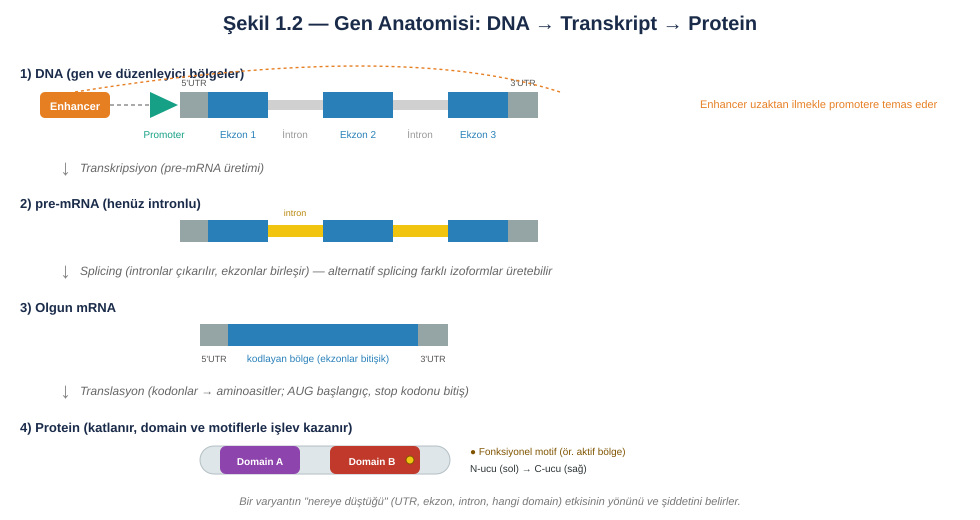
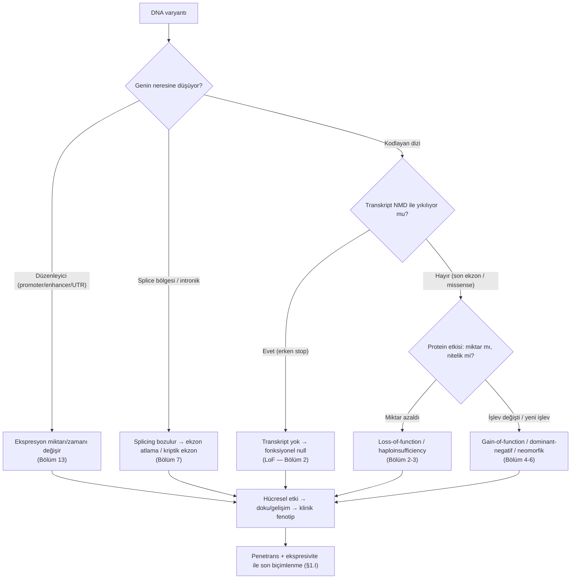
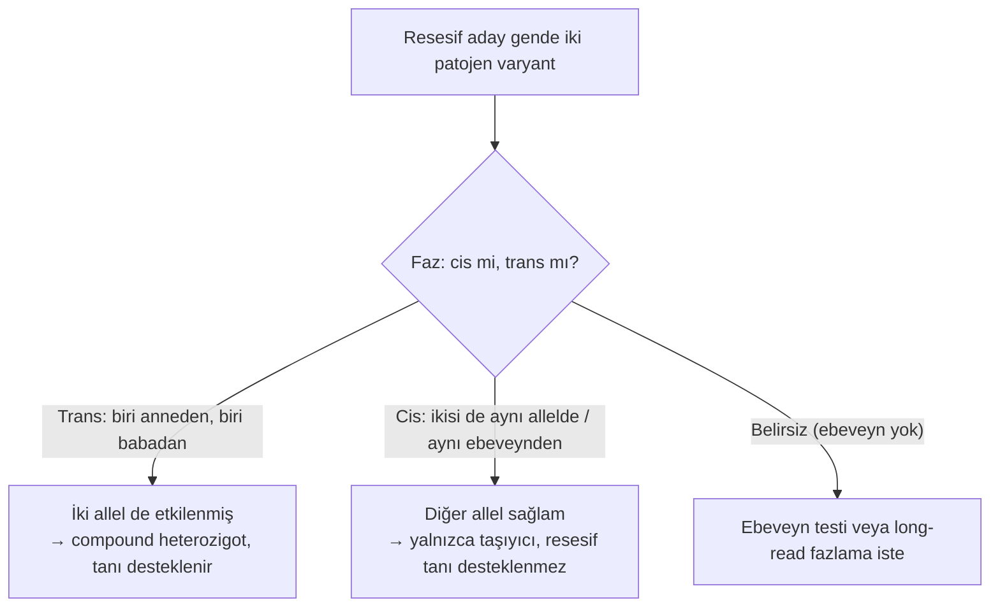
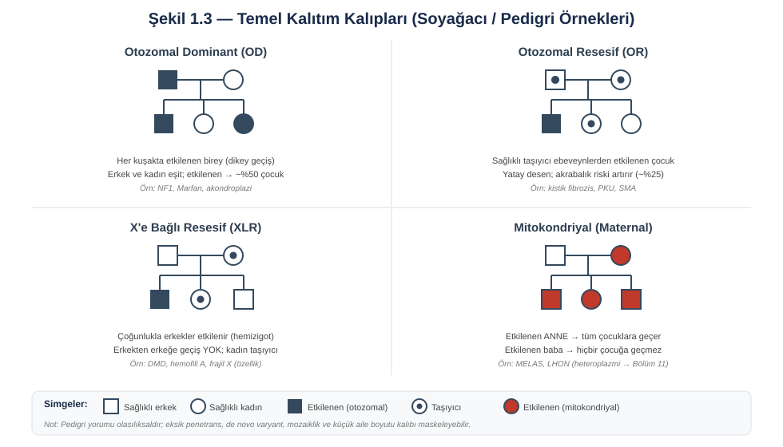
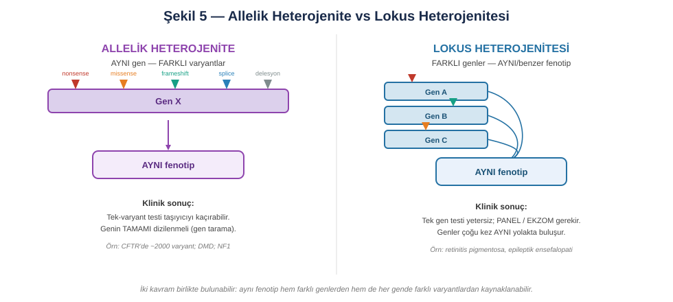
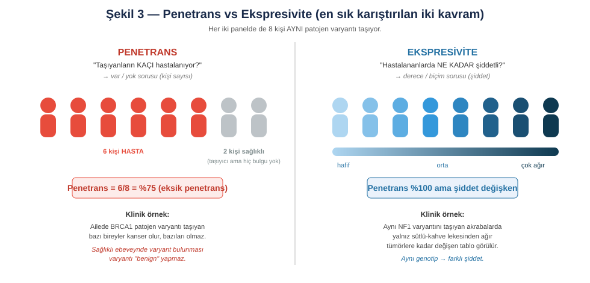
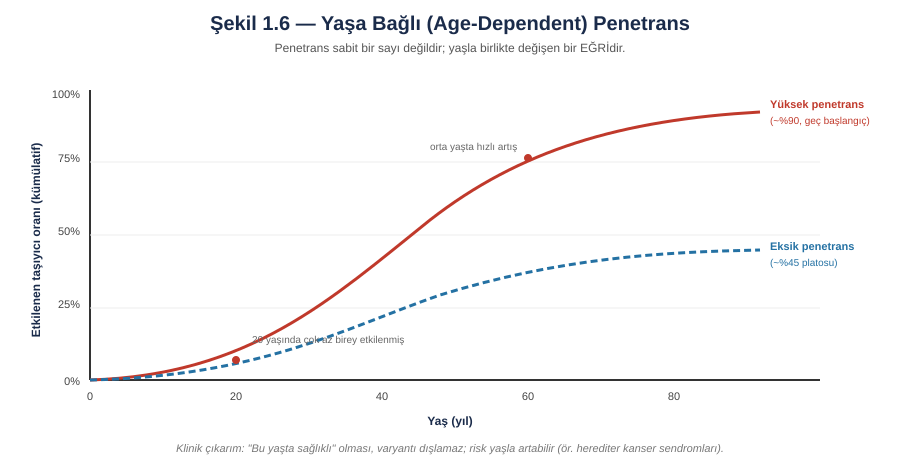
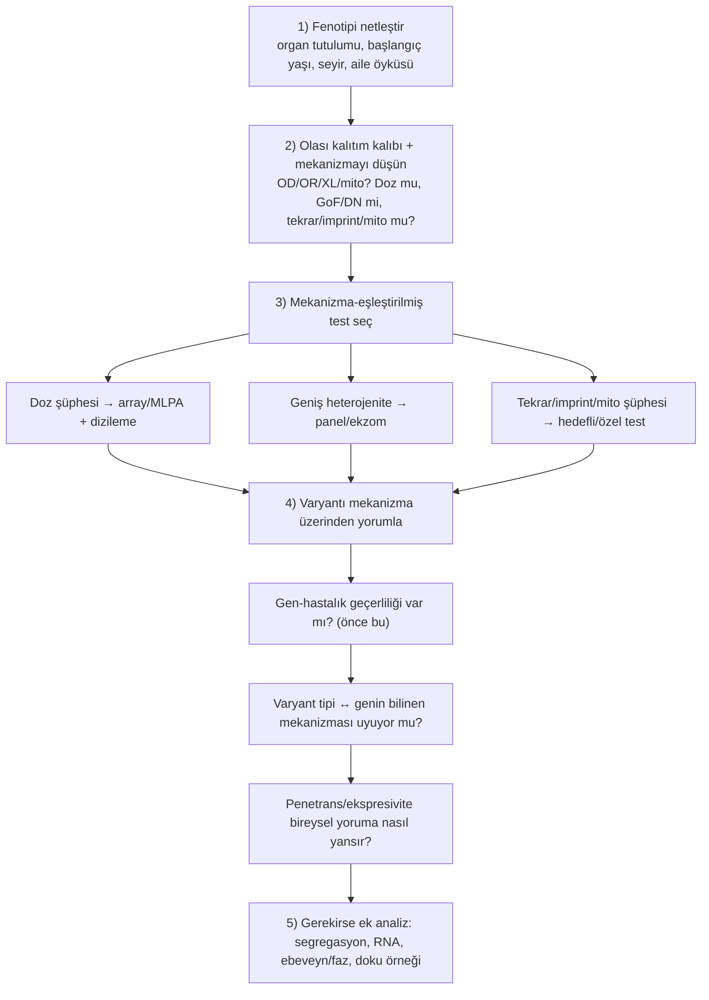

# Bölüm 1 — Genetik Hastalık Mekanizması Nedir?

> **Bölümün çekirdek tezi:** Genetik hastalık, "bir gende varyant bulunması" olayına indirgenemez. Bir varyantın hastalığa yol açıp açmaması; o değişikliğin gen ürününü, hücrenin biyolojisini, dokunun gelişimini ve nihayetinde fizyolojik bir sistemi nasıl etkilediğine bağlıdır. Bu bölüm, kitabın tamamında tekrar tekrar başvuracağımız temel düşünme çerçevesini — yani **varyanttan klinik fenotipe uzanan nedensellik zincirini** — kurar ve bu zinciri konuşurken kullanacağımız kelime dağarcığını, bir ezber listesi olarak değil, birbirine bağlı kavramlar bütünü olarak öğretir.

> **Bu bölüm nasıl okunmalı?** Tıp öğrencisi okuyucu için §1 ve §2, genetik düşünmenin gramerini kurar; bu iki bölüm sırayla okunmalıdır. Klinik genetikle hâlihazırda uğraşan okuyucu doğrudan §6 (varyant yorumu) ve §9 (karar algoritması) ile başlayabilir, gerektikçe kavramlar için geriye dönebilir. Şekiller `assets/` klasöründe SVG, akış diyagramları ise Mermaid bloğu olarak gömülüdür ve GitHub, VS Code (önizleme), Obsidian gibi araçlarda görüntülenir.

---

## Öğrenme hedefleri

Bu bölümü bitiren okuyucu; genetik bilginin DNA'dan kromozoma uzanan fiziksel organizasyonunu ve bunun gen ifadesiyle ilişkisini açıklayabilmeli; bir genin yapısal ögelerini tanıyıp santral dogmanın her basamağında varyantların nasıl "süzüldüğünü" izleyebilmeli; zigotluk, faz, kalıtım kalıpları ve varyant kökeni gibi kavramları klinik kararla ilişkilendirebilmeli; penetrans ile ekspresiviteyi kesin biçimde ayırt edebilmeli; allelik ve lokus heterojenitesini test stratejisine bağlayabilmeli; ve mekanizma bilgisinin varyant yorumlamadaki önceliğini gerekçelendirebilmelidir.

---

## 1. Genetik düşünmenin kavramsal temelleri

Bu bölüm bir sözlük değildir; kavramları, aralarındaki ilişkiyi göstererek, anlatı içinde tanıtır. Her yeni terim ilk geçtiğinde **kalın** yazılır ve cümlenin içinde tanımlanır. Amaç, okuyucunun bölümün sonunda yalnızca terimleri tanıması değil, bunları bir arada düşünebilmesidir.

### 1.A — Hücre, kromozom ve DNA mimarisi: bilgi nasıl paketlenir?

İnsan **genomu**, yani bir hücredeki tüm kalıtsal bilgi, yaklaşık 3,2 milyar **baz çiftinden** (bp) oluşur. Bu bilginin taşıyıcısı, iki ipliği A-T ve G-C eşleşmeleriyle birbirine bağlanan **DNA** çift sarmalıdır. Çift sarmalın zarafeti, bir ipliğin diğeri için şablon görevi görmesinde yatar: hücre bölünürken DNA bu sayede doğru kopyalanır, hasar gördüğünde de sağlam iplik onarım için referans olur. Klinik açıdan bu, replikasyon ve onarım kusurlarının neden hastalık (ve kanser) yapabildiğinin temelidir.

Üç milyar bazlık bu molekül, çapı yalnızca birkaç mikrometre olan çekirdeğe sığabilmek için olağanüstü bir biçimde katlanır. Ancak bu katlanmayı yalnızca bir "sıkıştırma" sorunu gibi düşünmek yanıltıcıdır; paketlenmenin kendisi aktif bir gen düzenleme katmanıdır. DNA'nın temel paketlenme birimi **nükleozomdur**: yaklaşık 147 baz çiftlik DNA, sekiz **histon** proteininden oluşan bir çekirdeğin (oktamer) etrafına sarılır. Mikroskop altında bu yapı "ipe dizili boncukları" andırır. Histonların dışa uzanan kuyrukları kimyasal olarak işaretlenir; bu işaretler (örneğin asetilasyon ya da belirli metilasyonlar) bölgenin gevşek mi yoksa sıkı mı paketleneceğini belirler. Gevşek, transkripsiyona açık bölgeye **ökromatin**, sıkıca paketlenmiş ve büyük ölçüde sessiz bölgeye ise **heterokromatin** denir. Histon ve kromatin düzenleyici genlerdeki bozuklukların geniş bir nörogelişimsel bozukluk grubunun ("kromatinopatiler") temelini oluşturması tesadüf değildir; bu genler hücrenin "okuma planını" yazar.

Boncuk dizisi giderek daha üst düzeyde katlanarak **kromatin** liflerini, onlar da nihayetinde **kromozomları** oluşturur. İnsanda 46 kromozom vardır: 22 çift **otozom** ve bir çift cinsiyet kromozomu (**gonozom**: X ve Y). Her kromozomun bir çifti vardır; biri anneden, biri babadan gelen bu çifte **homolog kromozomlar** denir ve aynı gen adreslerini taşırlar. Hücre bölünmeye hazırlanırken DNA'sını kopyalar ve her kromozom, **sentromer** denen daralma bölgesinden birbirine tutunan iki özdeş **kardeş kromatide** dönüşür. Bölünme sırasında bu kardeş kromatidlerin doğru ayrılması hayatidir; yanlış ayrılma (**nondisjunction**) trizomi gibi sayısal anomalilere yol açar. Kromozomların uçlarındaki **telomerler** ise tekrar dizilerinden oluşan koruyucu başlıklardır; uçların aşınmasını ve kromozomların birbirine yapışmasını engellerler.

Bu mimaride iki adresleme kavramı işimize yarayacaktır. **Lokus**, bir genin ya da dizinin kromozom üzerindeki konumudur (örneğin 17q11.2); kabaca, gen "ev" ise lokus onun "adresi"dir. Bir genin belirli bir sürümüne ise **allel** denir. Diploid bir hücrede her lokusta iki allel bulunur — biri her homolog kromozom üzerinde. Somatik hücrelerimiz iki takım kromozom taşıdıkları için **diploiddir** (2n=46); yumurta ve sperm ise tek takım taşır, yani **haploiddir** (n=23). Döllenmede iki haploid gamet birleşerek diploid zigotu yeniden oluşturur. Tüm bu yapının kuş bakışı görüntüsü olan **karyotip**, kromozomları sayı ve büyük yapı bakımından inceleyerek trizomiler ve dengeli translokasyonlar gibi anomalileri ortaya çıkarır.

> **🔬 Deep-dive — Kromatin neden klinik olarak önemlidir?** Aynı DNA dizisi, paketlenme durumuna göre aktif ya da sessiz olabilir. Bu basit gerçek, klinikte sık karşılaştığımız üç olguyu birden açıklar. Birincisi **dokuya özgü ekspresyon**: her doku kendi kromatin profilini taşıdığı için aynı gen karaciğerde açık, nöronlarda kapalı olabilir. İkincisi **imprinting**: bir genin anneden ve babadan gelen kopyaları farklı işaretlenerek yalnızca biri eksprese edilebilir (Bölüm 10). Üçüncüsü **X-inaktivasyonu**: kadınlarda iki X kromozomundan biri büyük ölçüde heterokromatine çevrilerek susturulur. Yani "genotip aynı ama fenotip farklı" durumlarının önemli bir kısmı, dizide değil bu epigenetik/kromatin katmanında saklıdır.

### 1.B — Genin yapısı ve santral dogma: bilgi nasıl ürüne dönüşür?

Bir varyantın etkisini öngörebilmek için, önce o varyantın genin hangi parçasına düştüğünü anlamak gerekir; çünkü aynı nükleotid değişikliği, bir promoterde, bir ekzonda, bir splice bölgesinde veya bir 3′UTR'de tamamen farklı sonuçlar doğurur. Bu yüzden genin anatomisini ve santral dogmanın akışını adım adım izlemek, klinik genetiğin temel becerilerinden biridir.

Her şey transkripsiyonun başladığı **promoter** ile başlar; promoter, genin "açma anahtarı" gibidir ve RNA polimeraz ile transkripsiyon faktörlerinin bağlandığı bölgedir. Ancak bir genin ne kadar eksprese olacağı yalnızca promoterle belirlenmez. Genden on binlerce baz uzakta, hatta bir intronun içinde yer alabilen **enhancer'lar** (güçlendiriciler), DNA'nın üç boyutlu olarak ilmek yapıp promotere temas etmesiyle ekspresyonu kuvvetlendirir. Buna karşılık **silencer'lar** ifadeyi baskılar, **insulator'lar** (örneğin CTCF bağlanma bölgeleri) ise düzenleyici bölgeleri birbirinden yalıtarak bir enhancer'ın yanlışlıkla komşu bir geni uyarmasını engeller. Bu düzenleyici mimarinin bozulması, kodlayan dizi tamamen sağlamken bile hastalık yapabilir — örneğin bir yapısal varyant bir geni enhancer'ından kopardığında (Bölüm 8, 13).

Transkripsiyon sonucu önce **pre-mRNA** üretilir; bu ham kopya hem proteine çevrilecek **ekzonları** hem de aralarındaki **intronları** içerir. **Splicing** adı verilen işlemle intronlar çıkarılır ve ekzonlar birleştirilir. Burada kritik bir esneklik vardır: hücre, aynı genden farklı ekzon kombinasyonlarını birleştirerek birden çok **izoform** (transkript sürümü) üretebilir; buna **alternatif splicing** denir. Bu nedenle bir varyantı yorumlarken hangi izoforma baktığımız hayati önemdedir — yanlış (klinikle ilgisiz) bir transkripte göre bakıldığında ekzonik ve patojen bir varyant "intronik, önemsiz" gibi görünebilir. Olgun **mRNA**, 5′ ve 3′ uçlarında proteine çevrilmeyen ama stabiliteyi ve translasyon verimini ayarlayan **UTR** bölgeleri taşır.

Translasyon aşamasında mRNA, üçer bazlık **kodonlar** hâlinde okunur; her kodon bir aminoaside (ya da başlangıç/bitiş sinyaline) karşılık gelir. Okuma, **başlangıç kodonundan** (AUG) başlar ve bir **stop kodonunda** biter. Kodonların bu üçerli okunma düzenine **okuma çerçevesi** denir ve son derece kırılgandır: araya giren ya da çıkan bir-iki baz (frameshift), çerçeveyi kaydırarak aşağı akıştaki tüm kodonların anlamını değiştirir ve genellikle erken bir stop kodonu doğurur. Ortaya çıkan **protein** ise düz bir aminoasit zinciri değildir; katlanarak işlevsel bir üç boyutlu yapı kazanır. Bu yapının bağımsız katlanan, belirli bir işi (DNA'ya bağlanma, kinaz aktivitesi gibi) yürüten bölümlerine **domain**, domain içindeki kritik ve evrimsel olarak korunmuş kısa dizilere ise **motif** denir (örneğin bir enzimin aktif bölgesi). Bir motifteki tek bir aminoasidin değişmesi bile proteinin işlevini bütünüyle yok edebilir; bu, ileride varyant yorumunda göreceğimiz "kritik bölge" mantığının (PM1) temelidir.

Tüm bu basamakları tek bir cümlede özetlersek: bir DNA varyantı, ürüne dönüşürken birçok katmandan geçer ve her katmanda "süzülür". Aşağıdaki şema bu süzülme kaskadını ve her dalın kitabın hangi bölümüne bağlandığını gösterir.

### 1.C — Varyasyon, allel ve varyant tipleri

İki insan genomu birbirinden milyonlarca pozisyonda farklıdır; ama bu farkların ezici çoğunluğu zararsızdır. Klinik genetiğin asıl zorluğu da buradadır: devasa bir nötr varyasyon arka planı içinden, hastalığa gerçekten neden olan varyantı ayıklamak. Bu nedenle modern dilde, herhangi bir referans-dışı değişikliğe nötr bir terim olan **varyant** denir; eskiden yaygın olan "mutasyon" sözcüğü artık daha çok yerleşik adlandırmalarda kullanılır, "polimorfizm" ise popülasyonda yaygın (genellikle %1'den sık) ve çoğunlukla zararsız varyantları anlatır. Patojen olup olmama, varyantın bir başka ekseni olarak ayrıca değerlendirilir; bir varyantın yaygın olması onu otomatik olarak benign yapmaz, ama nadir bir hastalık için güçlü bir benign ipucudur. Burada önemli bir uyarı vardır: **referans dizi her zaman "sağlıklı" anlamına gelmez**; referansta da patojen aleller bulunabilir.

Varyantları iki eksende düşünmek pratiktir. Moleküler sonuçlarına göre bir varyant; bir aminoasidi değiştiren **missense**, erken bir stop kodonu yaratan **nonsense**, çerçeveyi kaydıran **frameshift**, kesimi bozan **splice** ya da aminoasidi değiştirmeyen **sinonim (sessiz)** olabilir. Sinonim varyantların "tanım gereği zararsız" sanılması yaygın bir hatadır; bu varyantlar splicing'i bozarak pekâlâ patojen olabilirler. Boyut ve yapı eksenine göre ise varyantlar; tek bazlık **SNV**'lerden, küçük **indel**'lere, büyük bölgeleri kapsayan **kopya sayısı varyantlarına** (CNV; Bölüm 8) ve **tekrar genişlemelerine** (Bölüm 9) uzanan bir yelpaze oluşturur. Bu tiplerin her birinin mekanizması ilgili bölümde derinleştirilecektir; şimdilik akılda tutulması gereken, tek bir varyant tipinin (örneğin nonsense) farklı genlerde farklı şiddette hastalık yapabileceğidir — bunun nedenini Bölüm 2 ayrıntılarıyla açıklar.

### 1.D — Zigotluk ve faz: iki kopyayı birlikte düşünmek

Diploid olduğumuz için her otozomal gende iki allelimiz vardır ve hastalık çoğu zaman tek bir allelin değil, allel kombinasyonunun (genotipin) sonucudur. İki allel de aynıysa kişi o lokus için **homozigot**, farklıysa **heterozigottur**. Erkeklerde X ve Y üzerindeki genlerin tek kopyası bulunur; bu duruma **hemizigot** denir ve X'e bağlı resesif hastalıkların erkeklerde neden daha sık görüldüğünü açıklar. Resesif bir hastalıkta aynı gende iki *farklı* patojen varyant bulunması özel ve sık bir durumdur; buna **compound heterozigotluk** denir.

Compound heterozigotlukta kritik soru, iki varyantın kromozomlar üzerindeki dizilişidir; buna **faz** denir. İki varyant karşıt homolog kromozomlarda yer alıyorsa **trans** konumdadır, aynı kromozom üzerindeyse **cis** konumdadır. Bu ayrım tanısal kararı doğrudan değiştirir: resesif bir hastalık ancak genin *her iki* kopyası da işlevsizse ortaya çıkar. İki patojen varyant *trans* ise her allel ayrı ayrı bozulmuştur ve tanı desteklenir; *cis* ise iki varyant da tek allelde toplanmıştır, diğer allel sağlamdır ve kişi yalnızca taşıyıcıdır. Faz çoğunlukla ebeveyn testiyle çözülür (her varyantın hangi ebeveynden geldiğine bakılır); birbirine yakın varyantlarda okuma temelli ya da long-read fazlama da kullanılabilir.

### 1.E — Varyantın kökeni ve kalıtım kalıpları

Bir varyantın nereden geldiği, hem rekürrens riski hem de yorum açısından belirleyicidir. **Germline** (eşey hücresi) varyantları gametlerde bulunur, döllenmeyle bireyin tüm hücrelerine geçer ve sonraki kuşaklara aktarılabilir. **Somatik** varyantlar ise döllenmeden sonra tek bir hücrede ortaya çıkar ve yalnızca o hücrenin soyunda bulunur; kanserlerin ve birçok mozaik tablonun temelinde bunlar yatar. Çocukta yeni beliren ve ebeveynlerin kanında saptanamayan varyantlara **de novo** denir; bunların tipik rekürrens riski düşüktür, ancak ebeveynin eşey hücrelerinde gizli bir mozaiklik (gonadal mozaiklik) bulunabileceği için risk asla tam olarak sıfır değildir (Bölüm 12). Aynı bireyde genetik olarak farklı hücre popülasyonlarının bir arada bulunmasına ise **mozaiklik** denir ve kendi başına bir bölümü hak edecek kadar önemlidir.

Germline varyantların ailedeki dağılımı, klasik kalıtım kalıplarını oluşturur (Şekil 4). **Otozomal dominant** kalıtımda tek bir patojen allel hastalık için yeterlidir; soyağacında her kuşakta etkilenen bireyler görülür, geçiş dikeydir ve cinsiyetler eşit etkilenir — NF1, Marfan ve akondroplazi tipik örneklerdir. **Otozomal resesif** kalıtımda hastalık için iki patojen allel gerekir; bu nedenle sağlıklı taşıyıcı iki ebeveynden etkilenen bir çocuk doğabilir, desen daha yataydır ve akraba evliliği riski belirgin biçimde artırır (kistik fibroz, PKU, SMA). **X'e bağlı resesif** kalıtımda hemizigot oldukları için çoğunlukla erkekler etkilenir, kadınlar genellikle taşıyıcıdır ve karakteristik biçimde erkekten erkeğe geçiş görülmez (DMD, hemofili A). **X'e bağlı dominant** kalıtımda heterozigot kadınlar da etkilenir; bazı genlerde varyant erkekte erken letal olduğundan ailede tekrarlayan erkek kayıpları/düşükler bir ipucu olabilir. Son olarak **mitokondriyal (maternal)** kalıtımda varyant yalnızca anneden tüm çocuklara geçer, babadan hiçbirine geçmez; heteroplazmi nedeniyle ifade oldukça değişkendir (Bölüm 11).

> **🟦 Klinikte dikkat — Soyağacının "temiz" olması hastalığı dışlamaz.** Aile öyküsünün negatif olması, dominant bir tanıyı dışlamak için yeterli değildir. De novo varyantlar, eksik penetrans, küçük aile boyutu, mozaiklik ve hatalı babalık beklenen kalıbı kolaylıkla maskeleyebilir. "Ailede başka kimse yok" cümlesi, çoğu zaman "varyant de novo ortaya çıkmış olabilir" anlamına gelir.

### 1.F — Genotip ile fenotip arasındaki ilişki neden bulanıktır?

Tıp öğrencilerinin genetiği "tek gen → tek hastalık" şeklinde hatırlama eğilimi, klinikte hızla çöker; çünkü genotip ile fenotip arasındaki ilişki bire bir değildir. Bu bulanıklığın birkaç temel kaynağı vardır ve her biri doğrudan test ve yorum stratejisini etkiler.

İlk kaynak heterojenitedir ve iki biçimi vardır (Şekil 5). **Allelik heterojenitede** aynı gende çok sayıda farklı varyant aynı hastalığa yol açabilir; CFTR'de tanımlanmış binlerce varyant bunun çarpıcı örneğidir. Bunun pratik sonucu nettir: yalnızca tek bir bilinen varyantı arayan bir test, başka bir varyant taşıyan hastayı kaçırır, bu yüzden genin tamamı taranmalıdır. **Lokus heterojenitesinde** ise klinik olarak benzer bir tablo, farklı genlerdeki varyantlardan kaynaklanabilir; retinitis pigmentosa ve epileptik ensefalopatiler onlarca farklı genle ilişkilidir. Bu durumda tek bir gene bakmak yetersizdir ve panel ya da ekzom gerekir. İlginç olan, lokus heterojenitesi gösteren genlerin çoğu zaman aynı biyolojik yolakta buluşmasıdır — yani fenotipin ortaklığı, mekanizmanın ortaklığını yansıtır.

Bulanıklığın bir diğer kaynağı **pleiotropidir**: tek bir gen, görünüşte birbiriyle ilgisiz birçok sistemi aynı anda etkileyebilir, çünkü o gen farklı dokularda ve farklı gelişim dönemlerinde farklı işler görür. Buna ek olarak fenotip, ana hastalık geninden bağımsız başka genlerin — **modifiye edici genlerin** — ve bireyin tüm diğer varyantlarının oluşturduğu **genetik zeminin** etkisiyle yumuşar ya da ağırlaşır. Hastalığın bazen iki gen (**digenik**), birkaç gen (**oligogenik**) ya da çok sayıda küçük etkili varyantın toplamıyla (**poligenik**) ortaya çıkması da bu çerçeveye girer (Bölüm 14); burada sık yapılan hata, ikinci bir varyant bulunduğunda bunu hemen "digenik kalıtım" diye yorumlamaktır — oysa bu, ancak güçlü kanıtla iddia edilebilecek bir sonuçtur. Son olarak, bazı hastalıklarda fenotip kuşaklar boyu giderek erken ve ağır seyreder; **antisipasyon** denen bu olgu tipik olarak tekrar genişlemesi hastalıklarında görülür (Bölüm 9).

Bu kavramlar içinde en sık karıştırılan ikilisi — penetrans ve ekspresivite — ayrı ve ayrıntılı bir ele alışı hak eder; onları §1.I'de işliyoruz.

### 1.G — Gen dozu, ekspresyon ve gelişim zamanlaması

Diploid bir hücrede çoğu gen iki işlevsel kopya hâlinde bulunur ve bazı genler için bu "iki kopya" miktarı kritiktir. Bir genin işlevsel olarak mevcut kopya sayısına **gen dozu** denir. Bazı genlerde tek kopyanın kaybı (yani %50 doz) yeterli ürün sağlayamaz ve hastalık doğurur; bu duruma **haploinsufficiency** (yetersiz doz) denir ve Bölüm 3'ün konusudur. Bazı genlerde ise tam tersine, fazladan bir kopyanın varlığı (duplikasyon) zararlıdır; buna **triplosensitivite** denir (Bölüm 8). Doz duyarlılığı rastgele dağılmaz: tipik olarak transkripsiyon faktörleri, kromatin düzenleyiciler ve gelişim genleri doza duyarlıdır, çünkü bunlar dar bir miktar aralığında çalışan "ana düğmelerdir". İlerleyen sayfalarda göreceğimiz gibi, bu genler popülasyonda işlev kaybına karşı belirgin biçimde "kısıtlı" görünür.

Fenotipin neden belirli organlarla sınırlı kaldığını anlamak için **dokuya özgü ekspresyon** kavramı gereklidir: bir gen yalnızca belirli dokularda aktifse, o gendeki bir bozukluk da öncelikle o dokularda görülür. Bu, aynı zamanda hangi örneğin test edileceğini belirler — örneğin yalnızca kasta eksprese olan bir genin transkript çalışması için kan örneği uygun olmayabilir. Buna **gelişimsel zamanlama** eklenir: bir gen yalnızca embriyonik bir pencerede aktifse, o pencerede oluşan hasar postnatal dönemde geri döndürülemez olabilir; bu, hem tedavi penceresi hem de genetik danışma açısından belirleyicidir. Kadınlarda iki X kromozomundan birinin susturulması (**X-inaktivasyonu**) da bir doz dengeleme mekanizmasıdır; bu susturmanın bir X lehine dengesiz olması (**skewing**), X'e bağlı varyantların kadınlarda neden bazen beklenenden ağır seyrettiğini açıklar (Bölüm 10). Tüm bunların ötesinde, bir genin içinde yer aldığı **yolak** (pathway) içindeki konumu, hangi fenotiplerin ortaya çıkacağını ve hangi genlerle tablo örtüşmesi yaşanacağını belirler; RAS-MAPK yolağındaki farklı genlerin birbirine benzer RASopati fenotipleri yapması bunun klasik örneğidir.

### 1.H — Popülasyon ölçeği ve constraint: bir gen "hata kaldırıyor" mu?

Klinik yorumun en güçlü araçlarından biri, tek bir hastaya değil, on binlerce sağlıklı insana bakmaktan doğar. Mantık sezgiseldir. Bir tiyatroda hangi koltukların önemli olduğunu anlamanın bir yolu, hangi koltukların hiç boş kalmadığına bakmaktır: sürekli dolu olan koltuklar muhtemelen en değerli olanlardır. Genler için de benzer bir akıl yürütme yapabiliriz. Sağlıklı popülasyonlarda her gen için kaç tane işlev kaybına yol açan (loss-of-function, LoF) varyant *gözlediğimizi* sayar ve bunu, genin uzunluğu ve mutasyon hızına göre rastgele *beklediğimiz* sayıyla karşılaştırırız. Eğer bir gende beklenenden çok daha az LoF varyantı görüyorsak, bu varyantları taşıyan bireylerin elendiği anlamına gelir — yani o genin tek bir kopyasını kaybetmek bile zararlıdır. Böyle bir gene "LoF'a **kısıtlı (constrained)**" ya da "**LoF-intoleran**" denir. Bu yaklaşım, gnomAD gibi büyük popülasyon veri tabanlarıyla niceliksel bir bilime dönüşmüştür (Karczewski ve ark., 2020).

Bu sezgiyi pratikte iki metrik taşır. **pLI**, bir genin LoF'a intoleran olma *olasılığını* 0 ile 1 arasında ifade eder; pLI'nin 0,9 ve üzeri olması, o genin işlev kaybından güçlü biçimde kaçındığını, dolayısıyla muhtemelen haploinsufficiency yoluyla dominant hastalık yapan bir gen olduğunu söyler. **LOEUF** ise gözlenen/beklenen LoF oranının güven sınırını veren, daha modern ve sürekli bir ölçüdür; LOEUF değeri *düşükse* gen güçlü biçimde kısıtlıdır. İkili bir eşiğe (pLI ≥ 0,9 gibi) güvenmek yerine sürekli bir değer sunduğu için LOEUF giderek tercih edilir. Buna ek olarak, bir genin tek kopyasının kaybının hastalık yapıp yapmadığına dair uzmanlarca yapılmış değerlendirmeler **haploinsufficiency (HI) skoru** ya da ClinGen dozaj duyarlılığı kararları olarak ayrıca derlenir.

Bu metriklerin neden klinik olarak önemli olduğu, bir LoF varyantıyla karşılaştığımız anda netleşir. Diyelim ki bir hastada bir geni erken sonlandıran bir varyant bulduk. Bu varyantın patojen olup olmadığına karar vermeden önce sorulması gereken ilk soru şudur: *"Bu gen, işlev kaybına duyarlı bir gen mi?"* Eğer gen yüksek pLI / düşük LOEUF ile kısıtlıysa, bu, LoF'un o gen için gerçekten bir hastalık mekanizması olduğuna dair güçlü bir destektir ve birazdan göreceğimiz PVS1 kriterinin uygulanabilirliğini artırır. Tersine, gen LoF'a son derece toleranssa, aynı varyant çok daha şüpheyle karşılanmalıdır. Ancak burada sık yapılan bir hataya düşmemek gerekir: bu metrikler **gen düzeyinde** önceliklendirme araçlarıdır, tek bir varyantın patojenitesini tek başlarına kanıtlamazlar; üstelik resesif hastalık yapan LoF genleri (hastalık için iki kopyanın da kaybı gerektiğinden) popülasyonda "tolerant" görünebilir — bu onları önemsiz yapmaz, yalnızca metriğin dominant doz hastalıkları için daha bilgilendirici olduğunu gösterir.

Son olarak, popülasyon ölçeği bize bir varyantın **allel frekansını** (ve nadir allel için MAF'ı) verir; nadir bir hastalık için bir varyantın popülasyonda yaygın olması güçlü bir benign kanıttır. Bütün bu popülasyon temelli bilgiler, varyantı patojen/olası patojen/belirsiz (VUS)/olası benign/benign şeklinde sınıflandıran ACMG/AMP çerçevesinin temel girdileridir (Richards ve ark., 2015); ancak hiçbir sınıflandırma, ilgili genin gerçekten o hastalığa yol açtığına dair **gen-hastalık geçerliliği** gösterilmeden anlam taşımaz (MacArthur ve ark., 2014). Bu önceliği §6'da ayrıntılandırıyoruz.

### 1.I — Penetrans ve ekspresivite: en sık karıştırılan ikili

Penetrans ve ekspresivite, klinik genetikte en çok karıştırılan iki kavramdır; oysa farkları, doğru soruyu sormakla netleşir. **Penetrans**, "bir genotipi taşıyanların *kaçının* hastalandığı" sorusunun yanıtıdır; özünde bir var/yok sorusudur ve yüzde olarak ifade edilir. **Ekspresivite** ise "hastalananlarda tablonun *ne kadar şiddetli ya da ne biçimde* ortaya çıktığı" sorusunun yanıtıdır; bir derece/biçim sorusudur. Bir varyant taşıyan on kişiden yedisi hastalanıp üçü tamamen sağlıklı kalıyorsa, bu bir penetrans (≈%70) ifadesidir; hastalanan yedi kişiden kimi çok hafif kimi çok ağır seyrediyorsa, bu bir ekspresivite ifadesidir. İki eksen birbirinden bağımsızdır: bir hastalık aynı anda hem eksik penetranslı hem de değişken ekspresiviteli olabilir.

Bu ayrımı somutlaştırmak için üç durumu düşünelim. Eksik penetransta, bir ailede aynı patojen varyantı taşıyan sekiz kişiden altısı hastalanır, ikisi yaşam boyu sağlıklı kalır; penetrans kabaca 6/8'dir ve sağlıklı kalan iki kişi varyantı taşımaya ve çocuklarına aktarmaya devam eder. Bunun en önemli klinik sonucu şudur: sağlıklı bir ebeveynde aynı varyantın bulunması, o varyantı otomatik olarak "benign" yapmaz; bu durum pekâlâ eksik penetransla uyumlu olabilir. Değişken ekspresivitede ise, örneğin aynı NF1 varyantını taşıyan bir ailede herkes etkilenmiştir (yani penetrans yüksektir), ama biri yalnızca birkaç sütlü-kahve lekesi taşırken diğeri çok sayıda nörofibrom ve ciddi komplikasyon yaşar; dolayısıyla "akrabası hafif seyretmişti" demek, eldeki hastanın da hafif olacağını asla garanti etmez. Üçüncü durumda bu ikisi bir aradadır: bir kardiyak iyon kanalı hastalığında bazı taşıyıcılar hiç bulgu vermezken (eksik penetrans), bulgu verenlerin kimi yalnızca hafif bir EKG değişikliği gösterir, kimi ani ölüm riski taşır (değişken ekspresivite).

Penetransla ilgili kritik ve sıkça gözden kaçan bir nokta, onun sabit bir sayı olmadığıdır; çoğu zaman **yaşa bağlı bir eğridir** (Şekil 6). Geç başlangıçlı hastalıklarda — özellikle herediter kanser sendromlarında — genç bir taşıyıcı henüz tamamen sağlıklı olabilir, ancak riski yaşla birlikte artar. Penetrans ayrıca cinsiyete de bağlı olabilir. Bunun pratik karşılığı, presemptomatik taramanın ve genetik danışmanın temelini oluşturur: "bu yaşta sağlıklı olması" bir varyantı dışlamaz. Tüm bu olguların — eksik penetransın ve değişken ekspresivitenin — altında yatan moleküler nedenler arasında allel dozu, diferansiyel allelik ekspresyon, kopya sayısı varyasyonu, cis ya da trans konumdaki modifiye edici varyantlar, yaş, cinsiyet ve epigenetik/çevresel etkenler sayılır (Cooper ve ark., 2013). Aklımızda tutmamız gereken basit pusula şudur: **Penetrans** "var mı?" (Presence), **Ekspresivite** "ne kadar?" (Extent) sorusudur.

---

## 2. Mekanizmaları bir arada düşünmek: zincirin halkaları

Önceki bölümün ortaya koyduğu temel fikir, bir varyantın etkisinin santral dogmanın katmanları boyunca süzülerek fenotipe dönüştüğüydü. Bu süzülmenin sonunda ortaya çıkan tablo, mekanizmanın hangi sınıfa girdiğine göre köklü biçimde değişir ve bu sınıflandırma, kitabın geri kalanının iskeletidir. En temel ayrım, varyantın gen ürününü **niceliksel** olarak mı (miktarı azaltarak) yoksa **niteliksel** olarak mı (işlevini değiştirerek) etkilediğidir.

Niceliksel bozukluğun ucunda **loss-of-function** durur: ürün azalır ya da kaybolur. Bu, genin doz duyarlılığına göre ya resesif bir hastalık (tek sağlam kopya yeterliyken iki kopyanın da kaybı gerekir) ya da dominant bir hastalık (tek kopyanın kaybı bile yeterliyse, yani haploinsufficiency) doğurur — bunlar sırasıyla Bölüm 2 ve 3'ün konusudur. Niteliksel bozukluk tarafında ise ürün vardır, ama yanlış davranır. Eğer mutant ürün aşırı ya da sürekli aktifse buna **gain-of-function** (Bölüm 4); eğer mutant ürün, kompleks içindeki sağlam ürünleri de bozarak işlevi felç ediyorsa **dominant-negatif** (Bölüm 5); eğer ürün tamamen yeni, normalde olmayan bir işlev kazanmışsa **neomorfik** etki (Bölüm 6) söz konusudur. Bunlara ek olarak, ürün tamamen normal olduğu hâlde sırf kopya sayısı arttığı için zararlı olabilir; bu **doz fazlalığı** durumudur (Bölüm 4, 8). Aşağıdaki tablo bu sınıfları, tipik kalıtımlarını ve ilgili bölümleri bir arada özetler — ancak tablonun her satırının arkasındaki mekanizma, kendi bölümünde anlatıyla açılacaktır.

| Mekanizma sınıfı | Özünde ne olur? | Tipik kalıtım | Bölüm |
|------------------|-----------------|---------------|-------|
| Loss-of-function (nicelik ↓) | Ürün azalır/kaybolur | Resesif veya (doz duyarlıysa) dominant | 2 |
| Haploinsufficiency | Tek kopya (%50 doz) yetmez | Dominant | 3 |
| Gain-of-function | Ürün aşırı/sürekli aktif | Dominant | 4 |
| Dominant-negatif | Mutant ürün, sağlam ürünü de bozar | Dominant (sıklıkla ağır) | 5 |
| Neomorfik / antimorfik | Yeni işlev kazanımı / baskılama | Dominant | 6 |
| Doz fazlalığı | Normal ürün ama fazla kopya | Dominant | 4, 8 |

> **🔬 Deep-dive — Rezerv ve eşik kavramı.** Bu kitap boyunca tekrar tekrar karşımıza çıkacak birleştirici bir fikir vardır: hücre, bir genin işlevinin bir kısmını kaybetse bile çoğu zaman fenotip ortaya çıkmaz; hastalık ancak belli bir **eşik** aşıldığında görülür. Eşiğin nerede olduğu; genin doz duyarlılığına, dokunun fonksiyonel rezervine, görevi paylaşan akraba genlerin (paralogların) varlığına ve modifiye edici faktörlere bağlıdır. Bu "rezerv ve eşik" mantığı yalnızca haploinsufficiency'de değil, mitokondriyal hastalıklarda heteroplazmi eşiğinde (Bölüm 11) ve hipomorfik allellerin rezidüel fonksiyonunda (Bölüm 2) da aynen geçerlidir. Mekanizmaları öğrenirken bu ortak iskeleti hatırlamak, her bölümü bağımsız bir ezber olmaktan çıkarır.

---

## 3. Varyant tipleri ve mekanizmaya köprü

Aşağıdaki tablo, §1.C'de anlatı içinde tanıttığımız varyant tiplerini hızlı referans olarak toplar ve her birinin hangi bölümde mekanizma düzeyinde derinleştiğini gösterir. Tablodaki kritik ders, bir önceki bölümde vurguladığımız gibi, **aynı varyant tipinin farklı genlerde farklı sonuç verebileceğidir**; tipin kendisi mekanizmayı tek başına belirlemez.

| Varyant tipi | Tipik moleküler sonuç | Derinleştiği bölüm |
|--------------|------------------------|---------------------|
| Missense | Aminoasit değişimi → LoF/GoF/DN/nötr | 2, 4, 5 |
| Nonsense / frameshift | Erken stop → NMD veya truncated protein | 2 |
| Kanonik splice-site | Ekzon atlama / intron retansiyonu | 7 |
| Start-loss | Translasyon başlangıcının kaybı | 2 |
| İn-frame indel | Domain bütünlüğünün kısmi bozulması | 2, 5 |
| CNV (del/dup/trip) | Gen dozu / regülasyon değişimi | 3, 8 |
| Repeat expansion | Toksik RNA/protein, metilasyon | 9 |
| Noncoding / regülatör | Ekspresyon değişimi, kriptik splicing | 7, 13 |
| Epigenetik / imprinting | Parent-of-origin ekspresyon kaybı | 10 |

---

## 4. Varyanttan klinik fenotipe: süzülmeyi modüle eden faktörler

Bir varyantın klinik tabloya dönüşürken geçtiği süzgeçleri §1 boyunca tek tek tanıdık; burada bunları klinik bir bakışla bir araya getiriyoruz. Bir hastada bir varyant bulduğumuzda, o varyantın fenotipe nasıl yansıyacağını birkaç bağımsız faktör belirler. Heterojenite (hem allelik hem lokus), öncelikle hangi testi seçeceğimizi söyler: allelik heterojenite genin tamamının taranmasını, lokus heterojenitesi ise panel ya da ekzom gerektirir. Penetrans ve onun yaşa bağlı doğası, bir taşıyıcının "şu an sağlıklı" olmasının ne anlama geldiğini yeniden tanımlar; sağlıklı bir taşıyıcı varyantı benign yapmaz. Ekspresivite, aynı varyantın aynı ailede bile farklı şiddette seyredebileceğini hatırlatarak prognoz konuşurken bizi temkinli kılar. Dokuya özgü ekspresyon ve gelişimsel zamanlama, fenotipin neden belirli organlarda yoğunlaştığını ve neden bazı hasarların geri döndürülemez olduğunu açıklar. Son olarak genin yolaktaki konumu, hangi fenotiplerin birlikte görüneceğini ve farklı genlerin neden benzer tablolar yapabildiğini belirler. Bu faktörlerin tümü, tek bir gerçeği farklı yüzlerden gösterir: genotip, fenotipin yalnızca başlangıç noktasıdır.

---

## 5. Tanısal testlerle ilişkisi

Bölüm 1 tek bir mekanizmayı değil, mekanizmaları birbirinden ayırma çerçevesini öğrettiği için, buradaki test tablosu da hangi katmanın hangi testle görüldüğünü özetler. Bu tablodan çıkarılacak ana ders, aşağıdaki kutuda vurgulanan ilkedir: doğru test, beklenen mekanizmaya göre seçilir. Her tekniğin ayrıntıları ilgili mekanizma bölümünde derinleştirilecektir.

| Test | Hangi katmana bakar? | Sınırlılığı |
|------|----------------------|-------------|
| WES | Kodlayan + kanonik splice varyantları; geniş tarama | Derin intronik, regülatör, repeat, bazı CNV ve metilasyonu kaçırır |
| Short-read WGS | Kodlayan + noncoding + birçok CNV/SV | Repeat ve karmaşık SV'de sınırlı |
| Long-read WGS | Yapısal varyant, repeat, faz/haplotip, izoform | Maliyet/erişim; standartizasyon gelişmekte |
| Array-CGH / SNP array | Gen dozu (CNV); SNP array ile UPD | Dengeli düzenleme ve SNV göremez |
| MLPA | Hedeflenmiş ekzon düzeyi del/dup | Yalnız hedef lokus; dizi bilgisi yok |
| RNA-seq | Transkript: splicing, izoform, allelik ekspresyon | İlgili dokuda ekspresyon gerekir |
| Methylation array | Epigenetik (imprinting, episignature) | Dizilim varyantını göstermez |
| Karyotip | Büyük yapısal/sayısal anomali, dengeli translokasyon | Düşük çözünürlük (~5–10 Mb) |

> **🟦 Klinikte dikkat — Tek test her mekanizmayı yakalamaz.** "Ekzom yaptık, negatif çıktı, demek ki genetik değil" çıkarımı sık ve tehlikeli bir hatadır. WES; repeat genişlemelerini, derin intronik varyantları, metilasyon defektlerini ve birçok yapısal varyantı göremez. Klinik şüphe mekanizma düzeyinde formüle edilmeli ve test buna göre seçilmelidir.

---

## 6. Mekanizma bilgisinin varyant yorumundaki önceliği

Varyant yorumlama, sezgisel olarak "varyantı bulup patojen mi değil mi karar vermek" gibi görünür; oysa doğru sıralama tersinedir ve mekanizmayla başlar. Her şeyden önce, ilgili genin gerçekten o hastalığa yol açtığına dair **gen-hastalık geçerliliği** gösterilmelidir; bu adım atlandığında, teknik olarak "patojen görünen" varyantlar yanlış-pozitif nedensellik raporlarına dönüşür ve bu raporlar literatürü ve klinik kararı kirletir (MacArthur ve ark., 2014). Gen-hastalık ilişkisi sağlam kurulduktan sonra, varyantı ACMG/AMP çerçevesinde sınıflandırırız (Richards ve ark., 2015); ama bu çerçevedeki kanıt kriterlerinin hangilerinin uygulanabilir olduğunu yine mekanizma belirler. Örneğin işlev kaybını güçlü biçimde patojen sayan PVS1 kriteri, yalnızca LoF'un o gen için bilinen bir hastalık mekanizması olduğu durumlarda anlamlıdır; mekanizması gain-of-function veya dominant-negatif olan bir gende aynı kriteri uygulamak hatalıdır (Bölüm 2 ve 16). Benzer biçimde, §1.H'de anlattığımız constraint metrikleri (pLI, LOEUF) bir gen düzeyinde "LoF burada beklenen bir mekanizma mı?" sorusuna nicel destek verir (Karczewski ve ark., 2020). Tüm bunların ötesinde akılda tutulması gereken bir gerçek vardır: belirsiz anlamlı bir varyant (**VUS**), mekanizması ve nedenselliği gösterilemediği için bir tanı değildir ve klinik kararın tek dayanağı olamaz (Bölüm 16).

---

## 7. Klinik örneklerle ilkeler

Bu bölüm kavramsal olduğu için örnekleri ilkeleri göstermek amacıyla veriyoruz; spesifik genlerin mekanizmaları sonraki bölümlerde derinleşecektir. Allelik heterojeniteyi somutlaştırmak için, bir nörogelişimsel bozukluk panelinde aynı gende farklı ailelere özgü farklı patojen varyantların görülmesini düşünebiliriz; burada yalnızca bilinen tek bir varyantı arayan bir test, başka bir varyant taşıyan çocuğu kaçırır ve bu da panel ya da ekzom gerekçesini doğurur. Lokus heterojenitesi için, klinik olarak tek bir tabloya benzeyen bir epileptik ensefalopatinin onlarca farklı genle ilişkili olması yeterli bir örnektir; fenotip tek başına genotipi belirlemez. Eksik penetransın klinik tuzağı, bir çocukta saptanan varyantın etkilenmemiş bir ebeveynde de bulunabilmesidir — bu, varyantı benign ilan etmek için yeterli değildir ve segregasyonla mekanizma birlikte değerlendirilmelidir (Cooper ve ark., 2013). Değişken ekspresivite ise, aynı varyantı taşıyan akrabalarda hafiften ağıra uzanan bir tablo yelpazesi olarak karşımıza çıkar ve prognoz verirken bizi dikkatli olmaya zorlar.

---

## 8. Sık yapılan hatalar ve klinik uyarılar

> **🔴 Sık yapılan hata kutusu**
>
> En sık karşılaşılan hata, bir varyantın *bulunmasını* onun *nedensellik kanıtı* sanmaktır; varyant bulmak hipotezin başlangıcıdır, sonucu değildir (MacArthur 2014). İkinci sık hata, mekanizmayı atlayıp doğrudan kanıt kriterlerine geçmektir — örneğin PVS1'i, genin LoF-mekanizmalı olduğunu doğrulamadan uygulamak. Üçüncüsü, sağlıklı bir ebeveynde varyantın bulunmasını otomatik olarak "benign" diye yorumlamaktır; eksik penetrans bu çıkarımı geçersiz kılabilir. Dördüncü ve çok yaygın hata, penetrans ile ekspresiviteyi karıştırmaktır: "taşıyıcıların %30'u hasta" bir penetrans ifadesidir, "hastaların kimi ağır kimi hafif" ise bir ekspresivite ifadesidir. Beşincisi, penetransı sabit bir sayı sanıp yaşa/cinsiyete bağlı olabileceğini unutmaktır. Altıncısı, tek bir testin (özellikle WES'in) her mekanizmayı yakalayacağını varsaymaktır. Yedincisi, klinikle ilgisiz bir transkript üzerinden yorum yaparak ekzonik bir varyantı "intronik/önemsiz" göstermektir. Sonuncusu ise, negatif bir soyağacını dışlayıcı kanıt saymaktır; de novo varyant, mozaiklik ve küçük aile boyutu kalıbı kolaylıkla maskeler.

---

## 9. Klinik pratikte karar algoritması (Bölüm 1 düzeyi)

---

## 10. Kaynaklar

> **Atıf / doğrulama notu:** Bu bölümün bibliyografik verileri PubMed üzerinden doğrulanmıştır; aşağıdaki dört kaynağın da PMID ve DOI bilgisi tek tek teyit edilmiştir. Metin içinde yazar-yıl biçimi kullanılmış, DOI linkleri bu bölümde verilmiştir. §1'deki temel anatomik/terminolojik anlatım tartışmasız ders kitabı bilgisidir ve ek atıf gerektirmez; yorum ve mekanizma içeren ifadeler aşağıdaki hakemli kaynaklara dayanır.

1. **Richards S, Aziz N, Bale S, ve ark. (2015).** Standards and guidelines for the interpretation of sequence variants: a joint consensus recommendation of the ACMG and AMP. *Genetics in Medicine* 17(5):405–424. **PMID: 25741868** · DOI: [10.1038/gim.2015.30](https://doi.org/10.1038/gim.2015.30) — *Varyant sınıflandırma çerçevesi ve VUS kavramı.*
2. **MacArthur DG, Manolio TA, Dimmock DP, ve ark. (2014).** Guidelines for investigating causality of sequence variants in human disease. *Nature* 508(7497):469–476. **PMID: 24759409** · DOI: [10.1038/nature13127](https://doi.org/10.1038/nature13127) — *Gen-hastalık geçerliliği ve nedensellik.*
3. **Karczewski KJ, Francioli LC, Tiao G, ve ark. (2020).** The mutational constraint spectrum quantified from variation in 141,456 humans. *Nature* 581(7809):434–443. **PMID: 32461654** · DOI: [10.1038/s41586-020-2308-7](https://doi.org/10.1038/s41586-020-2308-7) — *Constraint (pLI, LOEUF) ve LoF intoleransı.*
4. **Cooper DN, Krawczak M, Polychronakos C, Tyler-Smith C, Kehrer-Sawatzki H (2013).** Where genotype is not predictive of phenotype: towards an understanding of the molecular basis of reduced penetrance in human inherited disease. *Human Genetics* 132(10):1077–1130. **PMID: 23820649** · DOI: [10.1007/s00439-013-1331-2](https://doi.org/10.1007/s00439-013-1331-2) — *Eksik penetrans ve değişken ekspresivite.*

> **İkincil/destekleyici kaynak notu:** GeneReviews/OMIM/ClinVar/gnomAD yalnızca destekleyici bilgi olarak anılmıştır; mekanizma iddiaları yukarıdaki hakemli kaynaklara dayanır.

---

## ✅ Bölüm öz-denetim tablosu

| Kriter | Durum | Not |
|--------|-------|-----|
| Mekanizma doğru anlatıldı mı? | ✅ | Nicelik/nitelik/doz ayrımı, eşik mantığı, kromatin-epigenetik köprüsü anlatıyla |
| Klinik bağlantı kuruldu mu? | ✅ | Penetrans/ekspresivite/faz/pedigri klinik sonuçlarıyla |
| Varyant tipi ile mekanizma ilişkilendirildi mi? | ✅ | §1.B kaskadı + §2 + Tablo 3 |
| Pediatrik örnek verildi mi? | ⚠️ Kısmi | Kavramsal bölüm; spesifik genler Bölüm 2+ (NF1 örneği var) |
| Test seçimi açıklandı mı? | ✅ | Mekanizma-eşleştirilmiş test mantığı + algoritma |
| ACMG/ClinGen bağlantısı doğru mu? | ✅ | Gen-hastalık geçerliliği/PVS1/constraint/VUS doğru çerçevelendi |
| Kaynaklar PMID/DOI ile verildi mi? | ✅ | 4 kaynak; PMID+DOI doğrulandı |
| Spekülatif iddialar işaretlendi mi? | ✅ | Örnek oranlar (6/8 vb.) temsilî olarak verildi |
| Kaynak uydurma riski var mı? | ✅ Yok | Tüm kaynaklar PubMed metadata ile karşılaştırıldı |
| Anlatı/paragraf üslubu sağlandı mı? | ✅ | Bölüm akıcı paragraflarla; listeler yalnız hızlı-referans tablolarında |
| Görsel/algoritma desteği yeterli mi? | ✅ | 6 SVG + 4 Mermaid |

---

### 🔎 Bölüm sonu kaynak doğrulama
> 4/4 kaynak PMID + DOI ile doğrulandı. "Kaynak doğrulaması gerekli" olarak işaretlenmiş açık bir iddia yoktur. Sayısal örnekler (penetrans için 6/8 gibi) belirli bir çalışmadan değil, kavramı göstermek için temsilî olarak verilmiştir.
