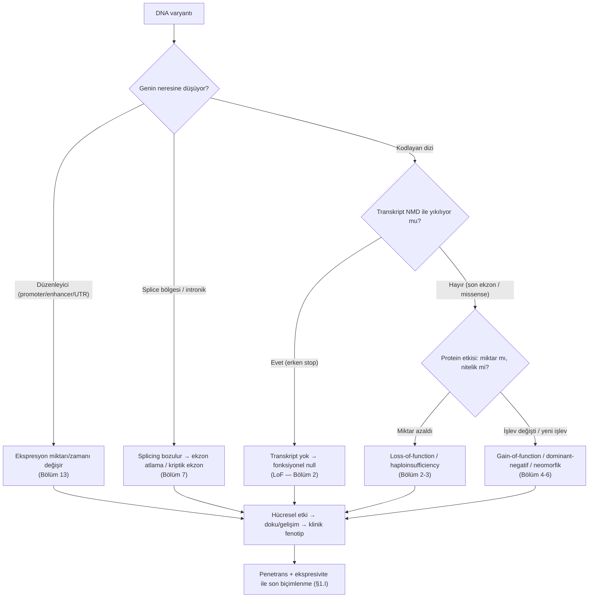
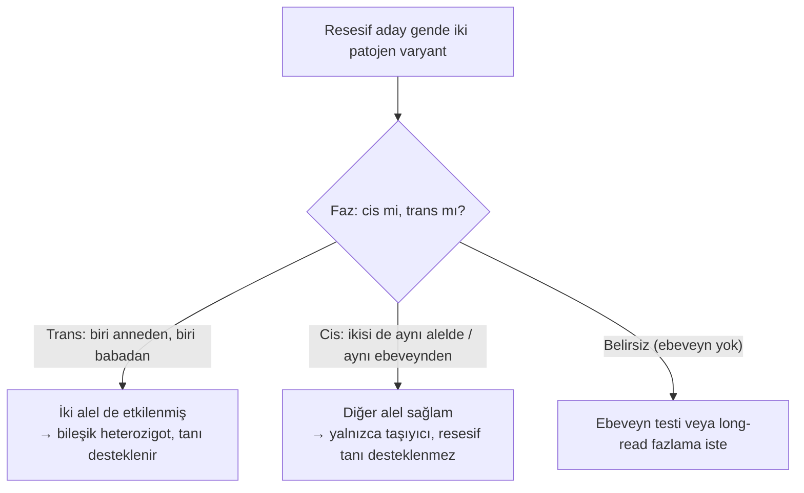
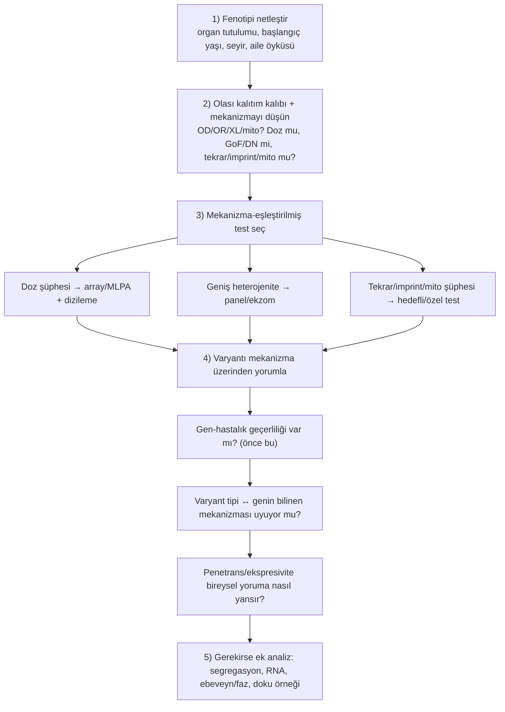

# Bölüm 1 — Genetik Hastalık Mekanizması Nedir?

> **Bölümün çekirdek tezi:** Genetik hastalık, "bir gende varyant bulunması" olayına indirgenemez. Bir varyantın hastalığa yol açıp açmaması; o değişikliğin gen ürününü, hücrenin biyolojisini, dokunun gelişimini ve nihayetinde fizyolojik bir sistemi nasıl etkilediğine bağlıdır. Bu bölüm, kitabın tamamında tekrar tekrar başvuracağımız temel düşünme çerçevesini — yani **varyanttan klinik fenotipe uzanan nedensellik zincirini** — kurar ve bu zinciri konuşurken kullanacağımız kelime dağarcığını, bir ezber listesi olarak değil, birbirine bağlı kavramlar bütünü olarak öğretir.

> **📘 Okuma katmanları.** Bu kitabın birincil hedefi **yandal asistanı ve klinik genomik çalışan hekimdir**; genel pediatrist ve tıp öğrencisi ikincil hedef kitledir. Bölümü kendi katmanınızdan okuyabilirsiniz:
> · **① Temel — tıp öğrencisi:** §1 ve §2'yi sırayla okuyun — genetik düşünmenin grameri buradadır; penetrans ile ekspresivite ayrımını (§1.I) atlamayın.
> · **② Klinik — pediatrist ve klinisyen:** §4 (klinik fenotipe dönüşüm), §5 (test seçimi) ve §9'daki karar algoritması doğrudan poliklinik pratiğine aittir.
> · **③ İleri düzey — yandal asistanı, laboratuvar, varyant yorumlayan:** §6 (varyant yorumu) ile constraint metriklerinin ne söyleyip ne söylemediği ve §8'deki hata listesi; PVS1'in mekanizma kapısı burada kurulur.

---

## Öğrenme hedefleri

Bu bölümü bitiren okuyucu; genetik bilginin DNA'dan kromozoma uzanan fiziksel organizasyonunu ve bunun gen ifadesiyle ilişkisini açıklayabilmeli; bir genin yapısal ögelerini tanıyıp santral dogmanın her basamağında varyantların nasıl "süzüldüğünü" izleyebilmeli; zigotluk, faz, kalıtım kalıpları ve varyant kökeni gibi kavramları klinik kararla ilişkilendirebilmeli; penetrans ile ekspresiviteyi kesin biçimde ayırt edebilmeli; alelik ve lokus heterojenitesini test stratejisine bağlayabilmeli; ve mekanizma bilgisinin varyant yorumlamadaki önceliğini gerekçelendirebilmelidir.

---

## 1. Genetik düşünmenin kavramsal temelleri

Bu bölüm bir sözlük değildir; kavramları, aralarındaki ilişkiyi göstererek, anlatı içinde tanıtır. Her yeni terim ilk geçtiğinde **kalın** yazılır ve cümlenin içinde tanımlanır. Amaç, okuyucunun bölümün sonunda yalnızca terimleri tanıması değil, bunları bir arada düşünebilmesidir.

### 1.A — Hücre, kromozom ve DNA mimarisi: bilgi nasıl paketlenir?

İnsan **genomu**, yani bir hücredeki tüm kalıtsal bilgi, yaklaşık 3,1 milyar **baz çiftinden** (bp) oluşur. Bu bilginin taşıyıcısı, iki ipliği A-T ve G-C eşleşmeleriyle birbirine bağlanan **DNA** çift sarmalıdır. Çift sarmalın zarafeti, bir ipliğin diğeri için şablon görevi görmesinde yatar: hücre bölünürken DNA bu sayede doğru kopyalanır, hasar gördüğünde de sağlam iplik onarım için referans olur. Klinik açıdan bu, replikasyon ve onarım kusurlarının neden hastalık (ve kanser) yapabildiğinin temelidir.

Üç milyar bazlık bu molekül, çapı yalnızca birkaç mikrometre olan çekirdeğe sığabilmek için olağanüstü bir biçimde katlanır. Ancak bu katlanmayı yalnızca bir "sıkıştırma" sorunu gibi düşünmek yanıltıcıdır; paketlenmenin kendisi aktif bir gen düzenleme katmanıdır. DNA'nın temel paketlenme birimi **nükleozomdur**: yaklaşık 147 baz çiftlik DNA, sekiz **histon** proteininden oluşan bir çekirdeğin (oktamer) etrafına sarılır. Mikroskop altında bu yapı "ipe dizili boncukları" andırır. Histonların dışa uzanan kuyrukları kimyasal olarak işaretlenir; bu işaretler (örneğin asetilasyon ya da belirli metilasyonlar) bölgenin gevşek mi yoksa sıkı mı paketleneceğini belirler. Gevşek, transkripsiyona açık bölgeye **ökromatin**, sıkıca paketlenmiş ve büyük ölçüde sessiz bölgeye ise **heterokromatin** denir. Histon ve kromatin düzenleyici genlerdeki bozuklukların geniş bir nörogelişimsel bozukluk grubunun ("kromatinopatiler") temelini oluşturması tesadüf değildir; bu genler hücrenin "okuma planını" yazar.

Boncuk dizisi giderek daha üst düzeyde katlanarak **kromatin** liflerini, onlar da nihayetinde **kromozomları** oluşturur. İnsanda 46 kromozom vardır: 22 çift **otozom** ve bir çift cinsiyet kromozomu (**gonozom**: X ve Y). Her kromozomun bir çifti vardır; biri anneden, biri babadan gelen bu çifte **homolog kromozomlar** denir ve aynı gen adreslerini taşırlar. Hücre bölünmeye hazırlanırken DNA'sını kopyalar ve her kromozom, **sentromer** denen daralma bölgesinden birbirine tutunan iki özdeş **kardeş kromatide** dönüşür. Bölünme sırasında bu kardeş kromatidlerin doğru ayrılması hayatidir; yanlış ayrılma (**nondisjunction**) trizomi gibi sayısal anomalilere yol açar. Kromozomların uçlarındaki **telomerler** ise tekrar dizilerinden oluşan koruyucu başlıklardır; uçların aşınmasını ve kromozomların birbirine yapışmasını engellerler.

Bu mimaride iki adresleme kavramı işimize yarayacaktır. **Lokus**, bir genin ya da dizinin kromozom üzerindeki konumudur (örneğin 17q11.2); kabaca, gen "ev" ise lokus onun "adresi"dir. Bir genin belirli bir sürümüne ise **alel** denir. Diploid bir hücrede her lokusta iki alel bulunur — biri her homolog kromozom üzerinde. Somatik hücrelerimiz iki takım kromozom taşıdıkları için **diploiddir** (2n=46); yumurta ve sperm ise tek takım taşır, yani **haploiddir** (n=23). Döllenmede iki haploid gamet birleşerek diploid zigotu yeniden oluşturur. Tüm bu yapının kuş bakışı görüntüsü olan **karyotip**, kromozomları sayı ve büyük yapı bakımından inceleyerek trizomiler ve dengeli translokasyonlar gibi anomalileri ortaya çıkarır.

> **🔬 Deep-dive — Kromatin neden klinik olarak önemlidir?** Aynı DNA dizisi, paketlenme durumuna göre aktif ya da sessiz olabilir. Bu basit gerçek, klinikte sık karşılaştığımız üç olguyu birden açıklar. Birincisi **dokuya özgü ekspresyon**: her doku kendi kromatin profilini taşıdığı için aynı gen karaciğerde açık, nöronlarda kapalı olabilir. İkincisi **imprinting**: bir genin anneden ve babadan gelen kopyaları farklı işaretlenerek yalnızca biri eksprese edilebilir (Bölüm 10). Üçüncüsü **X-inaktivasyonu**: kadınlarda iki X kromozomundan biri büyük ölçüde heterokromatine çevrilerek susturulur. Yani "genotip aynı ama fenotip farklı" durumlarının önemli bir kısmı, dizide değil bu epigenetik/kromatin katmanında saklıdır.

### 1.B — Genin yapısı ve santral dogma: bilgi nasıl ürüne dönüşür?

Bir varyantın etkisini öngörebilmek için, önce o varyantın genin hangi parçasına düştüğünü anlamak gerekir; çünkü aynı nükleotid değişikliği, bir promoterde, bir ekzonda, bir splice bölgesinde veya bir 3′UTR'de tamamen farklı sonuçlar doğurur. Bu yüzden genin anatomisini ve santral dogmanın akışını adım adım izlemek, klinik genetiğin temel becerilerinden biridir.

Her şey transkripsiyonun başladığı **promoter** ile başlar; promoter, genin "açma anahtarı" gibidir ve RNA polimeraz ile transkripsiyon faktörlerinin bağlandığı bölgedir. Ancak bir genin ne kadar eksprese olacağı yalnızca promoterle belirlenmez. Genden on binlerce baz uzakta, hatta bir intronun içinde yer alabilen **enhancer'lar** (güçlendiriciler), DNA'nın üç boyutlu olarak ilmek yapıp promotere temas etmesiyle ekspresyonu kuvvetlendirir. Buna karşılık **silencer'lar** ifadeyi baskılar, **insulator'lar** (örneğin CTCF bağlanma bölgeleri) ise düzenleyici bölgeleri birbirinden yalıtarak bir enhancer'ın yanlışlıkla komşu bir geni uyarmasını engeller. Bu düzenleyici mimarinin bozulması, kodlayan dizi tamamen sağlamken bile hastalık yapabilir — örneğin bir yapısal varyant bir geni enhancer'ından kopardığında (Bölüm 8, 13).

Transkripsiyon sonucu önce **pre-mRNA** üretilir; bu ham kopya hem proteine çevrilecek **ekzonları** hem de aralarındaki **intronları** içerir. **Splicing** adı verilen işlemle intronlar çıkarılır ve ekzonlar birleştirilir. Burada kritik bir esneklik vardır: hücre, aynı genden farklı ekzon kombinasyonlarını birleştirerek birden çok **izoform** (transkript sürümü) üretebilir; buna **alternatif splicing** denir. Bu nedenle bir varyantı yorumlarken hangi izoforma baktığımız hayati önemdedir — yanlış (klinikle ilgisiz) bir transkripte göre bakıldığında ekzonik ve patojen bir varyant "intronik, önemsiz" gibi görünebilir. Olgun **mRNA**, 5′ ve 3′ uçlarında proteine çevrilmeyen ama stabiliteyi ve translasyon verimini ayarlayan **UTR** bölgeleri taşır.

Translasyon aşamasında mRNA, üçer bazlık **kodonlar** hâlinde okunur; her kodon bir aminoaside (ya da başlangıç/bitiş sinyaline) karşılık gelir. Okuma, **başlangıç kodonundan** (AUG) başlar ve bir **stop kodonunda** biter. Kodonların bu üçerli okunma düzenine **okuma çerçevesi** denir ve son derece kırılgandır: araya giren ya da çıkan bir-iki baz (frameshift), çerçeveyi kaydırarak aşağı akıştaki tüm kodonların anlamını değiştirir ve genellikle erken bir stop kodonu doğurur. Ortaya çıkan **protein** ise düz bir aminoasit zinciri değildir; katlanarak işlevsel bir üç boyutlu yapı kazanır. Bu yapının bağımsız katlanan, belirli bir işi (DNA'ya bağlanma, kinaz aktivitesi gibi) yürüten bölümlerine **domain**, domain içindeki kritik ve evrimsel olarak korunmuş kısa dizilere ise **motif** denir (örneğin bir enzimin aktif bölgesi). Bir motifteki tek bir aminoasidin değişmesi bile proteinin işlevini bütünüyle yok edebilir; bu, ileride varyant yorumunda göreceğimiz "kritik bölge" mantığının (PM1) temelidir.

Tüm bu basamakları tek bir cümlede özetlersek: bir DNA varyantı, ürüne dönüşürken birçok katmandan geçer ve her katmanda "süzülür". Aşağıdaki şema bu süzülme kaskadını ve her dalın kitabın hangi bölümüne bağlandığını gösterir.

**Algoritma 1.1 — DNA varyantından fenotipe: bilgi akışı**

### 1.C — Varyasyon, alel ve varyant tipleri

İki insan genomu birbirinden milyonlarca pozisyonda farklıdır; ama bu farkların ezici çoğunluğu zararsızdır. Klinik genetiğin asıl zorluğu da buradadır: devasa bir nötr varyasyon arka planı içinden, hastalığa gerçekten neden olan varyantı ayıklamak. Bu nedenle modern dilde, herhangi bir referans-dışı değişikliğe nötr bir terim olan **varyant** denir. Eskiden yaygın olan "mutasyon" ve "polimorfizm" sözcükleri, taşıdıkları örtük değer yargısı nedeniyle (biri "bozuk", diğeri "zararsız" çağrışımı yapar) klinik raporlamada terk edilmiş, ACMG/AMP çerçevesi bunların yerine nötr **varyant** terminolojisini önermiştir (Richards ve ark., 2015). "Mutasyon" bugün daha çok yerleşik adlandırmalarda yaşar.

Yine de "polimorfizm" terimini doğru bilmek gerekir, çünkü literatürde karşınıza çıkacaktır ve **yanlış hatırlanmaya çok müsaittir**. Polimorfizm, bir varyantın belirli bir popülasyonda **en az %1 alel frekansına** ulaşmış olmasıdır. Buradaki iki incelik kritiktir: *(1)* ölçülen şey birey sıklığı değil **alel frekansıdır**; klasik tanım, lokustaki daha seyrek alelin — yani **minör alel frekansının (MAF)** — ≥%1 olmasını ister. *(2)* Bu tümüyle **frekans temelli** bir terimdir; klinik anlam taşımaz.

| Alel frekansı (MAF) | Kullanılabilecek ifade |
|---:|---|
| **<%0,1** | Nadir varyant |
| **%0,1 – <%1** | Düşük frekanslı varyant |
| **≥%1** | Polimorfizm |
| **≥%5** | Yaygın (common) varyant |

Alt kategorilerin sınırları kaynağa göre biraz değişebilir; ancak polimorfizmin klasik ve yerleşik eşiği **%1'dir, %5 değildir**.

Buradan kitabın ilk önemli kavram ayrımı doğar: **polimorfizm ≠ benign.** Bir varyantın popülasyonda ≥%1 bulunması onu otomatik olarak zararsız, işlevsiz veya klinik açıdan önemsiz yapmaz. Frekans bir eksendir, patojenite bambaşka bir eksendir ve ayrıca değerlendirilir (benign, olası benign, VUS, olası patojen, patojen). Yaygınlık, nadir bir hastalık bağlamında güçlü bir *benign ipucudur* — ama kanıt hiyerarşisinde bunun yeri tanımlıdır: ACMG/AMP çerçevesinde alel frekansının hastalık için beklenenden yüksek olması **BS1**, genel durumda %5'in üzerinde olması ise tek başına bağımsız benign kanıt sayılan **BA1** ölçütüdür (Richards ve ark., 2015). Yani sık karıştırılan **%5, polimorfizmin tanımı değil, ACMG'nin benign sınıflandırma eşiğidir** — üstelik kurucu (founder) varyantlar ve düşük penetranslı hastalık alelleri için BA1'in istisnaları vardır.

Aynı dikkat, frekansın *karşı* yönü için de geçerlidir. "Yaygın varyant nadir hastalık için benign ipucudur" cümlesi **koşullu** doğrudur; alel frekansı tek başına değil, hastalığın **prevalansı, penetransı, kalıtım biçimi, genetik heterojenitesi** ve varsa **kurucu aleller** ile karşılaştırılarak yorumlanır. Otozomal resesif bir hastalığın aleli heterozigot taşıyıcılarda görece sık olabilir; düşük penetranslı bir risk aleli de yaygın olabilir. Doğru formülasyon şudur: **varyantın, hastalık modeliyle bağdaşmayacak kadar yüksek frekansta olması güçlü benign kanıttır.**

Son bir uyarı — ve bu, yeni başlayanların en sık düştüğü kavramsal tuzaktır: **referans dizi klinik anlamda bir "sağlıklı genom" değildir.** Referans alel, yalnızca kullanılan genom yapısında o pozisyonda bulunan alel demektir; **majör, atasal (ancestral), benign ya da işlevsel olmak zorunda değildir.** İnsan referans genomu tek bir sağlıklı bireyin genomu da değildir: birden çok donörden gelen dizilerin birleştirildiği haploid bir mozaiktir ve her lokusta popülasyondaki en sık aleli temsil etmez.

> **🔬 Deep-dive — Bir hastalık aleli referans dizinin parçası olabilir mi? *Factor V Leiden* örneği.** Olabilir, ve bu yalnızca kuramsal bir olasılık değildir. Tromboz riskini artıran **Factor V Leiden** aleli (*F5* c.1601G>A, p.Arg534Gln; geleneksel adlandırmayla p.Arg506Gln, rs6025) **GRCh37/hg19 referans dizisinin parçasıydı.** Bunun doğrudan bir pratik sonucu vardır: "referanstan farkı bildir" mantığıyla çalışan standart bir varyant çağırma akışı, bu aleli **homozigot** taşıyan bir kişide varyantı hiç raporlamayabilirdi — çünkü kişi referansla aynıydı. GRCh38'de ilgili pozisyon düzeltilmiş ve yaygın, risk taşımayan alel referans hâline getirilmiştir.
>
> Bu örnek üç şeyi aynı anda öğretir: *(1)* referans alel "normal alel" değildir; *(2)* `REF` ve `ALT` etiketleri biyolojik bir özellik değil, **kullanılan genom yapısına bağlı teknik etiketlerdir**; *(3)* aynı alel bir genom sürümünde referans, başka bir sürümde alternatif olabilir. Bir kaydı da eklemek gerekir: Factor V Leiden, yüksek penetranslı klasik bir Mendelci patojen varyant değil, **tromboz riskini artıran, hastalıkla ilişkili bir aleldir** — örneği bu çerçevede okuyun.

Varyantları iki eksende düşünmek pratiktir. Moleküler sonuçlarına göre bir varyant; bir aminoasidi değiştiren **missense**, erken bir stop kodonu yaratan **nonsense**, çerçeveyi kaydıran **frameshift**, kesimi bozan **splice** ya da aminoasidi değiştirmeyen **sinonim (sessiz)** olabilir. Sinonim varyantların "tanım gereği zararsız" sanılması yaygın bir hatadır; bu varyantlar splicing'i bozarak pekâlâ patojen olabilirler. Boyut ve yapı eksenine göre ise varyantlar; tek bazlık **SNV**'lerden, küçük **indel**'lere, büyük bölgeleri kapsayan **kopya sayısı varyantlarına** (CNV; Bölüm 8) ve **tekrar genişlemelerine** (Bölüm 9) uzanan bir yelpaze oluşturur. Bu tiplerin her birinin mekanizması ilgili bölümde derinleştirilecektir; şimdilik akılda tutulması gereken, tek bir varyant tipinin (örneğin nonsense) farklı genlerde farklı şiddette hastalık yapabileceğidir — bunun nedenini Bölüm 2 ayrıntılarıyla açıklar.

### 1.D — Zigotluk ve faz: iki kopyayı birlikte düşünmek

Diploid olduğumuz için her otozomal gende iki alelimiz vardır ve hastalık çoğu zaman tek bir alelin değil, alel kombinasyonunun (genotipin) sonucudur. İki alel de aynıysa kişi o lokus için **homozigot**, farklıysa **heterozigottur**. Erkeklerde X ve Y üzerindeki genlerin tek kopyası bulunur; bu duruma **hemizigot** denir ve X'e bağlı resesif hastalıkların erkeklerde neden daha sık görüldüğünü açıklar. Resesif bir hastalıkta aynı gende iki *farklı* patojen varyant bulunması özel ve sık bir durumdur; buna **bileşik heterozigotluk** denir.

Bileşik heterozigotlukta kritik soru, iki varyantın kromozomlar üzerindeki dizilişidir; buna **faz** denir. İki varyant karşıt homolog kromozomlarda yer alıyorsa **trans** konumdadır, aynı kromozom üzerindeyse **cis** konumdadır. Bu ayrım tanısal kararı doğrudan değiştirir: resesif bir hastalık ancak genin *her iki* kopyası da işlevsizse ortaya çıkar. İki patojen varyant *trans* ise her alel ayrı ayrı bozulmuştur ve tanı desteklenir; *cis* ise iki varyant da tek alelde toplanmıştır, diğer alel sağlamdır ve kişi yalnızca taşıyıcıdır. Faz çoğunlukla ebeveyn testiyle çözülür (her varyantın hangi ebeveynden geldiğine bakılır); birbirine yakın varyantlarda okuma temelli ya da long-read fazlama da kullanılabilir.

**Algoritma 1.2 — Zigotluk ve faz: iki kopyanın durumunun belirlenmesi**

### 1.E — Varyantın kökeni ve başlıca Mendelci/mtDNA kalıtım kalıpları

Bir varyantın nereden geldiği, hem rekürrens riski hem de yorum açısından belirleyicidir. **Germline** (eşey hücresi) varyantları gametlerde bulunur, döllenmeyle bireyin tüm hücrelerine geçer ve sonraki kuşaklara aktarılabilir. **Somatik** varyantlar ise döllenmeden sonra tek bir hücrede ortaya çıkar ve yalnızca o hücrenin soyunda bulunur; kanserlerin ve birçok mozaik tablonun temelinde bunlar yatar. Çocukta yeni beliren ve ebeveynlerin kanında saptanamayan varyantlara *de novo* denir; bunların tipik rekürrens riski düşüktür, ancak ebeveynin eşey hücrelerinde gizli bir mozaiklik (gonadal mozaiklik) bulunabileceği için risk asla tam olarak sıfır değildir. Bu, soyut bir ihtiyat kaydı değildir: klinik analizde *de novo* kabul edilmiş nadir delesyonlar için 100 aileyi duyarlı bir yöntemle tarayan prospektif bir çalışmada, **dört ebeveynde** kanda düşük düzeyli somatik mozaiklik saptanmış ve modellemede, varyantın ebeveyn kanında bulunmasının tekrarlanma riskini yalnızca germ hattıyla sınırlı mozaikliğe göre **belirgin biçimde yükselttiği** gösterilmiştir (Campbell ve ark., 2014). Buradan çıkan pratik sonuç, tek bir yüzdeyi ezberlemek değildir: **"de novo" bir sonuç değil, kullanılan yöntemin duyarlılığında yapılmış bir gözlemdir**; danışmada verilecek risk, ebeveyn örneklerinin hangi yöntemle ve hangi duyarlılıkta incelendiğine bağlıdır (ayrıntı ve sayılar için Bölüm 12). Aynı bireyde genetik olarak farklı hücre popülasyonlarının bir arada bulunmasına ise **mozaiklik** denir ve kendi başına bir bölümü hak edecek kadar önemlidir.

Germline varyantların kuşaklar arasındaki aktarımı, başlıca **Mendelci ve mtDNA kalıtım kalıplarını** oluşturur (Şekil 1.3). Bu kalıpları öğrenirken baştan bir kayıt düşmek gerekir: gerçek soyağaçları, penetrans, değişken ekspresivite, de novo varyantlar ve mozaiklik nedeniyle ders kitabı şemalarından **sapar**. "Dikey" ve "yatay" görünüm tanımlayıcı ipuçlarıdır, kalıtım biçiminin zorunlu özellikleri değil.

**Otozomal dominant** kalıtımda heterozigot bir patojen varyant hastalık fenotipi oluşturmaya yetebilir ve etkilenmiş heterozigot bireyin her çocuğu varyantı **%50** olasılıkla alır. Aktarım olasılığı kız ve erkek çocuklar için eşittir — ancak "cinsiyetler eşit etkilenir" demek yanıltıcıdır: penetrans ve klinik şiddet cinsiyete göre farklılaşabilir. Dikey geçiş sık görülür, ama **her kuşakta etkilenmiş birey bulunması zorunlu değildir**; de novo varyant, eksik penetrans, geç başlangıç, hafif fenotipin gözden kaçması, ebeveyn somatik/gonadal mozaikliği veya küçük aile yapısı bu deseni bozar. NF1 bunun iyi bir örneğidir: olguların yaklaşık yarısı de novo'dur, buna rağmen hastalık otozomal dominanttır. Marfan sendromu ve akondroplazi diğer tipik örneklerdir.

**Otozomal resesif** kalıtımda **aynı gende, genellikle *trans* yerleşimli iki patojen (ya da olası patojen) varyant** gerekir. İki taşıyıcı ebeveynin her gebeliğinde beklenen dağılım şudur: **%25 etkilenmiş, %50 taşıyıcı, %25 iki aile varyantını da taşımayan.** Akrabalık, eşlerin ortak bir atadan gelen aynı nadir resesif aleli taşıma olasılığını artırır (kistik fibrozis, PKU, SMA). Ancak üç kaydı birlikte tutmak gerekir: her otozomal resesif hastalık akrabalıkla ilişkili değildir; akrabalık dominant, X'e bağlı veya mtDNA hastalıklarının temel riskini aynı biçimde artırmaz; ve taşıyıcılık oranının yüksek olduğu topluluklarda resesif bir hastalık soyağacında **psödo-dominant** görünebilir — yani ardışık kuşaklarda ortaya çıkarak dominant kalıtımı taklit edebilir.

**X'e bağlı resesif** kalıtımda erkekler hemizigot oldukları için daha sık ve çoğu kez daha ağır etkilenir; **erkekten erkeğe geçiş görülmez** ve etkilenmiş bir erkek X kromozomunu bütün kızlarına aktarırken hiçbir oğluna aktarmaz (DMD, hemofili A). Buradaki yaygın basitleştirme "kadınlar taşıyıcıdır" ifadesidir; doğrusu **heterozigot kadınların asemptomatik olabileceği gibi değişen derecelerde etkilenebilecekleridir** — çarpık (skewed) X-inaktivasyonu, Turner sendromu ya da X kromozomunun yapısal değişiklikleri bunun bilinen nedenleridir. **X'e bağlı dominant** kalıtımda heterozigot kadınlar da etkilenir; etkilenmiş erkek varyantı bütün kızlarına, hiçbir oğluna aktarır. Bazı — **ama tümü değil** — X'e bağlı dominant hastalıkta hemizigot erkek letalitesi görülür ve ailede tekrarlayan erkek fetal kayıpları bir ipucu olabilir; *IKBKG* ilişkili incontinentia pigmenti klasik örnektir. Bu hastalıklarda bile mozaiklik, 47,XXY karyotipi veya hipomorfik varyantlar erkek yaşamını mümkün kılabilir.

Son olarak **mtDNA ilişkili (maternal) kalıtımda** varyant kadınlar üzerinden aktarılır. Burada iki hassas nokta vardır. Birincisi terimdir: "mitokondriyal hastalık" ile "mtDNA ilişkili hastalık" aynı şey değildir — mitokondriyal hastalıkların büyük bölümü **nükleer** genlerden kaynaklanır ve otozomal dominant, otozomal resesif ya da X'e bağlı kalıtılabilir (Bölüm 11). İkincisi, "varyant anneden tüm çocuklara geçer" ifadesi bir **sonuç eşitliği** izlenimi verir; doğrusu şudur: **patojen mtDNA varyantı taşıyan annenin bütün çocukları varyantı alma açısından risk altındadır, ancak heteroplazmik varyantlarda aktarılan mutant yük ve klinik sonuç kardeşler arasında belirgin biçimde değişir.** Etkilenmiş erkeklerin çocukları klinik danışmada risk altında kabul edilmez. Ayrıca her mtDNA hastalığı ailede maternal desen oluşturmaz: tek büyük mtDNA delesyonlarının çoğu **de novo**'dur.

Bu beş kalıp, insan genetiğindeki aktarım biçimlerinin **tamamı değildir** — yalnızca en sık öğretilenleridir. Kitabın ilerleyen bölümleri klasik şemaya sığmayan kalıtım biçimlerini tek tek açar: ebeveyn kökenine bağlı ifade ve **genomik damgalama** ile **uniparental dizomi** (Bölüm 10), **tekrar genişlemesi ve anticipasyon** (Bölüm 9), **somatik ve germline mozaiklik** (Bölüm 12), ve tek lokusla açıklanamayan **digenik/oligogenik** modeller (Bölüm 14). Y'ye bağlı ve psödootozomal kalıtım ise bu kitabın kapsamı dışındadır; klinikte karşılaşıldığında standart genetik kaynaklara başvurulmalıdır.

> **🟦 Klinikte dikkat — Akrabalığı "var/yok" olarak sormak yetmez.** Türkiye pratiğinde akraba evliliği, danışmanın merkezinde duran bir değişkendir ve tek bir kutucuğa sığmaz. Sorulması gerekenler şunlardır: akrabalığın **derecesi**; pedigride **birden fazla akrabalık halkası** olup olmadığı; aynı köy, aşiret veya kapalı topluluk içindeki **endogami**; toplulukta bilinen **kurucu varyantlar**; ailede benzer çocuk kayıpları ya da açıklanamayan hastalıklar; ve genomik veri varsa **ROH/otozigotluk yükü**. Akrabalığın az konuşulan bir sonucu da şudur: aynı çocukta **birden fazla resesif hastalık** bir arada bulunabilir — tek bir tanı bulmak, aramayı durdurmak için yeterli olmayabilir.
>
> Danışmada verilecek sayı, elinizdeki bilgiye göre değişir. Ailede belirli bir hastalık yoksa, ilk kuzen çiftleri için genel toplumdaki yaklaşık **%2–3'lük** majör konjenital/genetik sorun riskinin kabaca **%4–6'ya** çıktığı ampirik çerçevesi kullanılabilir. Buna karşılık ailede tanımlanmış bir otozomal resesif hastalık varsa ve **her iki eşte aynı varyant gösterilmişse**, ampirik oran değil **hastalığa özgü, her gebelikte %25** risk verilmelidir. İkisini karıştırmak, danışmanın en sık ve en sonuç doğurucu hatalarındandır.

> **🟦 Klinikte dikkat — Soyağacının "temiz" olması hastalığı dışlamaz.** Aile öyküsünün negatif olması, dominant bir tanıyı dışlamak için yeterli değildir. De novo varyantlar, eksik penetrans, küçük aile boyutu, mozaiklik ve hatalı babalık beklenen kalıbı kolaylıkla maskeleyebilir. "Ailede başka kimse yok" cümlesi, çoğu zaman "varyant de novo ortaya çıkmış olabilir" anlamına gelir.

### 1.F — Genotip ile fenotip arasındaki ilişki neden bulanıktır?

Tıp öğrencilerinin genetiği "tek gen → tek hastalık" şeklinde hatırlama eğilimi, klinikte hızla çöker; çünkü genotip ile fenotip arasındaki ilişki bire bir değildir. Bu bulanıklığın birkaç temel kaynağı vardır ve her biri doğrudan test ve yorum stratejisini etkiler.

İlk kaynak heterojenitedir ve iki biçimi vardır (Şekil 1.4). **Alelik heterojenitede** aynı gende çok sayıda farklı varyant aynı hastalığa yol açabilir; CFTR'de tanımlanmış binlerce varyant bunun çarpıcı örneğidir. Bunun pratik sonucu nettir: yalnızca tek bir bilinen varyantı arayan bir test, başka bir varyant taşıyan hastayı kaçırır, bu yüzden genin tamamı taranmalıdır. **Lokus heterojenitesinde** ise klinik olarak benzer bir tablo, farklı genlerdeki varyantlardan kaynaklanabilir; retinitis pigmentosa ve epileptik ensefalopatiler onlarca farklı genle ilişkilidir. Bu durumda tek bir gene bakmak yetersizdir ve panel ya da ekzom gerekir. İlginç olan, lokus heterojenitesi gösteren genlerin çoğu zaman aynı biyolojik yolakta buluşmasıdır — yani fenotipin ortaklığı, mekanizmanın ortaklığını yansıtır.

Bulanıklığın bir diğer kaynağı **pleiotropidir**: tek bir gen, görünüşte birbiriyle ilgisiz birçok sistemi aynı anda etkileyebilir, çünkü o gen farklı dokularda ve farklı gelişim dönemlerinde farklı işler görür. Buna ek olarak fenotip, ana hastalık geninden bağımsız başka genlerin — **modifiye edici genlerin** — ve bireyin tüm diğer varyantlarının oluşturduğu **genetik zeminin** etkisiyle yumuşar ya da ağırlaşır. Hastalığın bazen iki gen (**digenik**), birkaç gen (**oligogenik**) ya da çok sayıda küçük etkili varyantın toplamıyla (**poligenik**) ortaya çıkması da bu çerçeveye girer (Bölüm 14); burada sık yapılan hata, ikinci bir varyant bulunduğunda bunu hemen "digenik kalıtım" diye yorumlamaktır — oysa bu, ancak güçlü kanıtla iddia edilebilecek bir sonuçtur. Son olarak, bazı hastalıklarda fenotip kuşaklar boyu giderek erken ve ağır seyreder; **antisipasyon** denen bu olgu tipik olarak tekrar genişlemesi hastalıklarında görülür (Bölüm 9).

Bu kavramlar içinde en sık karıştırılan ikilisi — penetrans ve ekspresivite — ayrı ve ayrıntılı bir ele alışı hak eder; onları §1.I'de işliyoruz.

### 1.G — Gen dozu, ekspresyon ve gelişim zamanlaması

Diploid bir hücrede çoğu gen iki işlevsel kopya hâlinde bulunur ve bazı genler için bu "iki kopya" miktarı kritiktir. Bir genin işlevsel olarak mevcut kopya sayısına **gen dozu** denir. Bazı genlerde tek kopyanın kaybı (yani %50 doz) yeterli ürün sağlayamaz ve hastalık doğurur; bu duruma **haploinsufficiency** (yetersiz doz) denir ve Bölüm 3'ün konusudur. Bazı genlerde ise tam tersine, fazladan bir kopyanın varlığı (duplikasyon) zararlıdır; buna **triplosensitivite** denir (Bölüm 8). Doz duyarlılığı rastgele dağılmaz: tipik olarak transkripsiyon faktörleri, kromatin düzenleyiciler ve gelişim genleri doza duyarlıdır, çünkü bunlar dar bir miktar aralığında çalışan "ana düğmelerdir". İlerleyen sayfalarda göreceğimiz gibi, bu genler popülasyonda işlev kaybına karşı belirgin biçimde "kısıtlı" görünür.

Fenotipin neden belirli organlarla sınırlı kaldığını anlamak için **dokuya özgü ekspresyon** kavramı gereklidir: bir gen yalnızca belirli dokularda aktifse, o gendeki bir bozukluk da öncelikle o dokularda görülür. Bu, aynı zamanda hangi örneğin test edileceğini belirler — örneğin yalnızca kasta eksprese olan bir genin transkript çalışması için kan örneği uygun olmayabilir. Buna **gelişimsel zamanlama** eklenir: bir gen yalnızca embriyonik bir pencerede aktifse, o pencerede oluşan hasar postnatal dönemde geri döndürülemez olabilir; bu, hem tedavi penceresi hem de genetik danışma açısından belirleyicidir. Kadınlarda iki X kromozomundan birinin susturulması (**X-inaktivasyonu**) da bir doz dengeleme mekanizmasıdır; bu susturmanın bir X lehine dengesiz olması (**skewing**), X'e bağlı varyantların kadınlarda neden bazen beklenenden ağır seyrettiğini açıklar (Bölüm 10). Tüm bunların ötesinde, bir genin içinde yer aldığı **yolak** (pathway) içindeki konumu, hangi fenotiplerin ortaya çıkacağını ve hangi genlerle tablo örtüşmesi yaşanacağını belirler; RAS-MAPK yolağındaki farklı genlerin birbirine benzer RASopati fenotipleri yapması bunun klasik örneğidir.

### 1.H — Popülasyon ölçeği ve constraint: bir gen "hata kaldırıyor" mu?

Klinik yorumun en güçlü araçlarından biri, tek bir hastaya değil, on binlerce sağlıklı insana bakmaktan doğar. Mantık sezgiseldir. Bir tiyatroda hangi koltukların önemli olduğunu anlamanın bir yolu, hangi koltukların hiç boş kalmadığına bakmaktır: sürekli dolu olan koltuklar muhtemelen en değerli olanlardır. Genler için de benzer bir akıl yürütme yapabiliriz. Sağlıklı popülasyonlarda her gen için kaç tane işlev kaybına yol açan (loss-of-function, LoF) varyant *gözlediğimizi* sayar ve bunu, genin uzunluğu ve mutasyon hızına göre rastgele *beklediğimiz* sayıyla karşılaştırırız. Eğer bir gende beklenenden çok daha az LoF varyantı görüyorsak, bu varyantları taşıyan bireylerin elendiği anlamına gelir — yani o genin tek bir kopyasını kaybetmek bile zararlıdır. Böyle bir gene "LoF'a **kısıtlı (constrained)**" ya da "**LoF-intoleran**" denir. Bu yaklaşım, gnomAD gibi büyük popülasyon veri tabanlarıyla niceliksel bir bilime dönüşmüştür (Karczewski ve ark., 2020).

Bu sezgiyi pratikte iki metrik taşır. **pLI**, bir genin LoF'a intoleran olma *olasılığını* 0 ile 1 arasında ifade eder ve ExAC veri kümesiyle tanımlanmıştır (Lek ve ark., 2016); pLI'nin 0,9 ve üzeri olması, o genin işlev kaybından güçlü biçimde kaçındığını, dolayısıyla muhtemelen haploinsufficiency yoluyla dominant hastalık yapan bir gen olduğunu söyler. **LOEUF** ise gözlenen/beklenen LoF oranının güven sınırını veren, daha modern ve sürekli bir ölçüdür; LOEUF değeri *düşükse* gen güçlü biçimde kısıtlıdır. İkili bir eşiğe (pLI ≥ 0,9 gibi) güvenmek yerine sürekli bir değer sunduğu için LOEUF giderek tercih edilir. Buna ek olarak, bir genin tek kopyasının kaybının hastalık yapıp yapmadığına dair uzmanlarca yapılmış değerlendirmeler **haploinsufficiency (HI) skoru** ya da ClinGen dozaj duyarlılığı kararları olarak ayrıca derlenir.

Bu metriklerin neden klinik olarak önemli olduğu, bir LoF varyantıyla karşılaştığımız anda netleşir. Diyelim ki bir hastada bir geni erken sonlandıran bir varyant bulduk. Bu varyantın patojen olup olmadığına karar vermeden önce sorulması gereken ilk soru şudur: *"Bu gen, işlev kaybına duyarlı bir gen mi?"* Gen yüksek pLI / düşük LOEUF ile kısıtlıysa, bu bulgu varyant ve gen önceliklendirmesinde değerlidir. Ancak buradaki en yaygın kavramsal hatadan kaçınmak gerekir: **kısıtlılık, LoF'un o gen–hastalık ilişkisi için hastalık mekanizması olduğunu kanıtlamaz ve PVS1'i doğrudan açmaz.** Metriğin gösterdiği şey daha dardır: genel popülasyonda o gen, **heterozigot** öngörülen LoF varyantlarından beklenenden azını taşımaktadır. Bu, haploinsufficiency ile *biyolojik uyumluluk* sağlar — kanıt değil. Düşük LOEUF, embriyonik/erken yaşam letalitesi, hücresel yaşamsallığın bozulması, üreme başarısının azalması ya da henüz hiçbir hastalıkla ilişkilendirilmemiş güçlü negatif seçilimle de uyumludur.

Doğru sıra şudur: *(1)* gen–hastalık ilişkisi geçerli mi? *(2)* O hastalık için LoF yerleşik mekanizma mı? *(3)* Varyant gerçekten işlevsel null etki yapıyor mu? *(4)* Buna göre hangi PVS1 gücü uygulanabilir? *(5)* Kısıtlılık verisi bu değerlendirmeyle uyumlu mu? **Constraint dördüncü–beşinci basamakta bağlamsal destek verir; ilk üç sorunun yerine geçmez.**

Ters yön de dikkat ister. "Gen LoF'a toleranssa varyant şüphelidir" cümlesi, yüksek LOEUF'un **iki farklı durumu bir arada barındırdığını** gizler: gerçekten heterozigot LoF'a toleranslı genler ile, gen kısa olduğu ya da beklenen LoF sayısı az olduğu için **ölçüm gücü yetersiz** kalan genler. LOEUF üst güven sınırını kullandığı için *düşük* değer oldukça bilgilendiricidir; *yüksek* değer ise her zaman gerçek toleransı kanıtlamaz (Karczewski ve ark., 2020). Dolayısıyla "yüksek LOEUF PVS1'i dışlar" demek yanlıştır; doğrusu şudur: **yüksek LOEUF veya düşük pLI, heterozigot LoF'a karşı güçlü popülasyonel seçilim kanıtı bulunmadığını gösterir — LoF mekanizmasını tek başına reddetmez.**

Son olarak resesif hastalık genleri özel bir dikkat gerektirir. pLI ve LOEUF esas olarak **heterozigot** pLoF varyantlarına karşı seçilimi yakalar; otozomal resesif hastalıklarda heterozigot taşıyıcılar genellikle sağlıklı olduğundan bu genler güçlü kısıtlı görünmeyebilir. Bilinen haploinsufficient genler düşük LOEUF bölgesinde zenginleşirken, otozomal resesif hastalık genleri dağılımın orta bölümlerine yerleşir (Karczewski ve ark., 2020). Bunu "resesif genler tolerant görünür" diye özetlemek eksiktir; daha doğrusu: **resesif hastalık genleri heterozigot LoF'a toleranslı görünebilir, çünkü bu metrikler bialelik inaktivasyona karşı seçilimi yeterince ölçmez.** Gerçek homozigot LoF toleransını değerlendirmek için homozigot pLoF taşıyan bireylerin verisi, otozigot kohortlar ve gen nakavt çalışmaları gibi **başka kanıt türleri** gerekir.

Son olarak, popülasyon ölçeği bize bir varyantın **alel frekansını** (ve nadir alel için MAF'ı) verir; nadir bir hastalık için bir varyantın popülasyonda yaygın olması güçlü bir benign kanıttır. Bütün bu popülasyon temelli bilgiler, varyantı patojen/olası patojen/belirsiz (VUS)/olası benign/benign şeklinde sınıflandıran ACMG/AMP çerçevesinin temel girdileridir (Richards ve ark., 2015); ancak hiçbir sınıflandırma, ilgili genin gerçekten o hastalığa yol açtığına dair **gen-hastalık geçerliliği** gösterilmeden anlam taşımaz (MacArthur ve ark., 2014). Bu önceliği §6'da ayrıntılandırıyoruz.

### 1.I — Penetrans ve ekspresivite: en sık karıştırılan ikili

Penetrans ve ekspresivite, klinik genetikte en çok karıştırılan iki kavramdır; oysa farkları, doğru soruyu sormakla netleşir. **Penetrans**, "bir genotipi taşıyanların *kaçının* hastalandığı" sorusunun yanıtıdır; özünde bir var/yok sorusudur ve yüzde olarak ifade edilir. **Ekspresivite** ise "hastalananlarda tablonun *ne kadar şiddetli ya da ne biçimde* ortaya çıktığı" sorusunun yanıtıdır; bir derece/biçim sorusudur. Bir varyant taşıyan on kişiden yedisi hastalanıp üçü tamamen sağlıklı kalıyorsa, bu bir penetrans (≈%70) ifadesidir; hastalanan yedi kişiden kimi çok hafif kimi çok ağır seyrediyorsa, bu bir ekspresivite ifadesidir. İki eksen birbirinden bağımsızdır: bir hastalık aynı anda hem eksik penetranslı hem de değişken ekspresiviteli olabilir.

Bu ayrımı somutlaştırmak için üç durumu düşünelim. Eksik penetransta, bir ailede aynı patojen varyantı taşıyan sekiz kişiden altısı hastalanır, ikisi yaşam boyu sağlıklı kalır; penetrans kabaca 6/8'dir ve sağlıklı kalan iki kişi varyantı taşımaya ve çocuklarına aktarmaya devam eder. Bunun en önemli klinik sonucu şudur: sağlıklı bir ebeveynde aynı varyantın bulunması, o varyantı otomatik olarak "benign" yapmaz; bu durum pekâlâ eksik penetransla uyumlu olabilir. Değişken ekspresivitede ise, örneğin aynı NF1 varyantını taşıyan bir ailede herkes etkilenmiştir (yani penetrans yüksektir), ama biri yalnızca birkaç sütlü-kahve lekesi taşırken diğeri çok sayıda nörofibrom ve ciddi komplikasyon yaşar; dolayısıyla "akrabası hafif seyretmişti" demek, eldeki hastanın da hafif olacağını asla garanti etmez. Üçüncü durumda bu ikisi bir aradadır: bir kardiyak iyon kanalı hastalığında bazı taşıyıcılar hiç bulgu vermezken (eksik penetrans), bulgu verenlerin kimi yalnızca hafif bir EKG değişikliği gösterir, kimi ani ölüm riski taşır (değişken ekspresivite).

Penetransla ilgili kritik ve sıkça gözden kaçan bir nokta, onun sabit bir sayı olmadığıdır; çoğu zaman **yaşa bağlı bir eğridir** (Şekil 1.6). Geç başlangıçlı hastalıklarda — özellikle herediter kanser sendromlarında — genç bir taşıyıcı henüz tamamen sağlıklı olabilir, ancak riski yaşla birlikte artar. Penetrans ayrıca cinsiyete de bağlı olabilir. Bunun pratik karşılığı, presemptomatik taramanın ve genetik danışmanın temelini oluşturur: "bu yaşta sağlıklı olması" bir varyantı dışlamaz. Tüm bu olguların — eksik penetransın ve değişken ekspresivitenin — altında yatan moleküler nedenler arasında alel dozu, diferansiyel alelik ekspresyon, kopya sayısı varyasyonu, cis ya da trans konumdaki modifiye edici varyantlar, yaş, cinsiyet ve epigenetik/çevresel etkenler sayılır (Cooper ve ark., 2013). Aklımızda tutmamız gereken basit ayrım şudur: **penetrans**, belirli bir genotipi taşıyan bireylerde fenotipin ortaya çıkıp çıkmadığını ve hangi oranda ortaya çıktığını; **ekspresivite** ise fenotip ortaya çıktığında hangi özelliklerle ve ne şiddette görüldüğünü anlatır. Kısa pusula olarak: **Penetrans — ortaya çıkar mı, ne sıklıkta? · Ekspresivite — ortaya çıkarsa nasıl ve ne şiddette?** İki tanımı da dar okumamak gerekir: penetrans yalnız "var/yok" değil bir **olasılıktır**, ekspresivite de yalnız şiddet değil fenotipin **biçimi ve kapsamıdır** — aynı varyant bir bireyde yalnız kardiyak, başka bir bireyde çok sistemli bir tablo verebilir. (İngilizce literatürle çalışanlar için ek bir bellek desteği olarak *penetrance–presence* ve *expressivity–extent* eşleşmesi kullanılabilir; 🏷️ bu baş harf eşleşmesi kitabın kendi anlatım aracıdır, yerleşik bir terminoloji kuralı değildir.)

---

## 2. Mekanizmaları bir arada düşünmek: zincirin halkaları

Önceki bölümün ortaya koyduğu temel fikir, bir varyantın etkisinin santral dogmanın katmanları boyunca süzülerek fenotipe dönüştüğüydü. Bu süzülmenin sonunda ortaya çıkan tablo, mekanizmanın hangi sınıfa girdiğine göre köklü biçimde değişir ve bu sınıflandırma, kitabın geri kalanının iskeletidir. En temel ayrım, varyantın gen ürününü **niceliksel** olarak mı (miktarı azaltarak) yoksa **niteliksel** olarak mı (işlevini değiştirerek) etkilediğidir.

Niceliksel bozukluğun ucunda **loss-of-function** durur: ürün azalır ya da kaybolur. Bu, genin doz duyarlılığına göre ya resesif bir hastalık (tek sağlam kopya yeterliyken iki kopyanın da kaybı gerekir) ya da dominant bir hastalık (tek kopyanın kaybı bile yeterliyse, yani haploinsufficiency) doğurur — bunlar sırasıyla Bölüm 2 ve 3'ün konusudur. Niteliksel bozukluk tarafında ise ürün vardır, ama yanlış davranır. Eğer mutant ürün aşırı ya da sürekli aktifse buna **gain-of-function** (Bölüm 4); eğer mutant ürün, kompleks içindeki sağlam ürünleri de bozarak işlevi felç ediyorsa **dominant-negatif** (Bölüm 5); eğer ürün tamamen yeni, normalde olmayan bir işlev kazanmışsa **neomorfik** etki (Bölüm 6) söz konusudur. Bunlara ek olarak, ürün tamamen normal olduğu hâlde sırf kopya sayısı arttığı için zararlı olabilir; bu **doz fazlalığı** durumudur (Bölüm 4, 8). Aşağıdaki tablo bu sınıfları, tipik kalıtımlarını ve ilgili bölümleri bir arada özetler — ancak tablonun her satırının arkasındaki mekanizma, kendi bölümünde anlatıyla açılacaktır.

**Tablo 1.1 — Mekanizma sınıflarının karşılaştırması**

| Mekanizma sınıfı | Özünde ne olur? | Tipik kalıtım | Bölüm |
|------------------|-----------------|---------------|-------|
| Loss-of-function (nicelik ↓) | Ürün azalır/kaybolur | Resesif veya (doz duyarlıysa) dominant | 2 |
| Haploinsufficiency | Tek kopya (%50 doz) yetmez | Dominant | 3 |
| Gain-of-function | Ürün aşırı/sürekli aktif | Dominant | 4 |
| Dominant-negatif | Mutant ürün, sağlam ürünü de bozar | Dominant (sıklıkla ağır) | 5 |
| Neomorfik / antimorfik | Yeni işlev kazanımı / baskılama | Dominant | 6 |
| Doz fazlalığı | Normal ürün ama fazla kopya | Dominant | 4, 8 |

> **🏷️ Pedagojik sentez — Tamponlama, rezerv ve eşik.** Bu kitapta "tamponlama, rezerv ve eşik" başlığı altında kullanacağımız çerçeve, **literatürde bu adla yerleşmiş bağımsız bir hastalık modeli değildir**; farklı genetik mekanizmalardaki ortak nicel mantığı görünür kılmak için kurulmuş pedagojik bir sentezdir. Bunu baştan söylemek gerekir, çünkü aşağıdaki dört kavramın her biri literatürde ayrı ayrı tanımlıdır; onları tek çatı altında toplayan biziz.
>
> Fikir şudur: bir hücre, doku ya da fizyolojik sistem, gen işlevindeki kısmi azalmayı belirli bir düzeye kadar tolere edebilir. Bu toleransın kaynağı üç ayrı şeydir ve karıştırılmamalıdır. **Rezidüel işlev**, mutant alelin ya da genotipin koruduğu işlev miktarıdır (bir hipomorfik alelin sağladığı %15 aktivite gibi). **Fonksiyonel rezerv**, sistemin normal gereksinimin üzerindeki kullanılabilir kapasitesidir (böbreğin ya da karaciğerin klinik bulgu vermeden kaybedebileceği kapasite gibi). **Tamponlama** ise gen dozundaki değişikliğe rağmen sistem çıktısını koruyan aktif veya pasif mekanizmalardır: geri bildirim döngüleri, alternatif yolaklar, genetik modifiye ediciler ve — koşulu sağlanıyorsa — paraloglar. Buradaki koşul önemlidir: bir paralogun **varlığı** tek başına telafi anlamına gelmez; paralog farklı dokuda, farklı gelişim döneminde ifade ediliyorsa ya da kayıptan sonra yukarı düzenlenmiyorsa tamponlama sağlamaz. Aranan şey, **ilgili dokuda ve dönemde işlevsel olarak örtüşen** bir paralog ya da yolaktır. Klinik bulgu, bu üç kaynağın toplamı ilgili biyolojik çıktıyı **kritik işlev aralığının** altına düşürdüğünde ortaya çıkar.
>
> "Eşik" sözcüğü de dikkatli kullanılmalıdır: bu, keskin ve sabit bir açma-kapama noktası değil, **ilgili klinik özelliğin ortaya çıkma olasılığının belirgin biçimde arttığı kritik işlev aralığıdır.** Geçiş çoğu zaman sigmoiddir; eşik varyanta, dokuya, gelişim dönemine ve hangi klinik bulgudan söz ettiğimize göre değişir — aynı bireyde iki farklı bulgunun iki farklı eşiği olabilir. Eşiğin yakınındaki bireylerde küçük genetik, çevresel veya stokastik farklar penetrans ve ekspresiviteyi belirler.
>
> Bu ortak mantık kitabın farklı bölümlerinde farklı biyolojik biçimlerde karşımıza çıkar: haploinsufficiency'de tek sağlam alelin sağladığı ürün yetersiz kalabilir (Bölüm 3); hipomorfik genotiplerde fenotipi kalan enzim aktivitesi belirleyebilir (Bölüm 2); heteroplazmik mtDNA hastalıklarında mutant yük, yabanıl tip mtDNA kapasitesi ve dokunun enerji gereksinimi birlikte biyokimyasal eşiğin aşılmasına yol açar (Bölüm 11). **Bunlar aynı moleküler mekanizma değildir** — bu yüzden "aynı mantık aynen geçerlidir" demiyoruz; hepsi *ortak bir nicel yapıyı paylaşır*: sistem bir bozulma yükünü belirli bir noktaya kadar tamponlar, o nokta geçildiğinde fenotip görünür olur. Mekanizmaları öğrenirken bu iskeleti hatırlamak, her bölümü bağımsız bir ezber olmaktan çıkarır.
>
> 🏷️ *Bu başlık kitabın pedagojik sentezidir. Doz duyarlılığı, genetik tamponlama, fonksiyonel rezerv, hipomorfik rezidüel işlev ve heteroplazmi eşiği literatürde ayrı ayrı tanımlanmış kavramlardır ve her biri kendi bölümünde kaynaklıdır; burada tek bir üst çerçeve altında birleştirilmişlerdir. Kitabın ilerleyen bölümlerinde buna "kitabın rezerv–eşik sentezi" diye gönderme yapılacaktır — yerleşik bir modelmiş izlenimi vermemek için yeni bir kısaltma üretilmemiştir.*

---

## 3. Varyant tipleri ve mekanizmaya köprü

Aşağıdaki tablo, §1.C'de anlatı içinde tanıttığımız varyant tiplerini hızlı referans olarak toplar ve her birinin hangi bölümde mekanizma düzeyinde derinleştiğini gösterir. Tablodaki kritik ders, bir önceki bölümde vurguladığımız gibi, **aynı varyant tipinin farklı genlerde farklı sonuç verebileceğidir**; tipin kendisi mekanizmayı tek başına belirlemez.

**Tablo 1.2 — Varyant tipleri ve mekanizmaya köprüleri**

| Varyant tipi | Tipik moleküler sonuç | Derinleştiği bölüm |
|--------------|------------------------|---------------------|
| Missense | Aminoasit değişimi → LoF/GoF/DN/nötr | 2, 4, 5 |
| Nonsense / frameshift | Erken stop → NMD veya truncated protein | 2 |
| Kanonik splice-site | Ekzon atlama / intron retansiyonu | 7 |
| Start-loss | Translasyon başlangıcının kaybı | 2 |
| İn-frame indel | Domain bütünlüğünün kısmi bozulması | 2, 5 |
| CNV (del/dup/trip) | Gen dozu / regülasyon değişimi | 3, 8 |
| Repeat expansion | Toksik RNA/protein, metilasyon | 9 |
| Noncoding / regülatör | Ekspresyon değişimi, kriptik splicing | 7, 13 |
| Epigenetik / imprinting | Parent-of-origin ekspresyon kaybı | 10 |

---

## 4. Varyanttan klinik fenotipe: süzülmeyi modüle eden faktörler

Bir varyantın klinik tabloya dönüşürken geçtiği süzgeçleri §1 boyunca tek tek tanıdık; burada bunları klinik bir bakışla bir araya getiriyoruz. Bir hastada bir varyant bulduğumuzda, o varyantın fenotipe nasıl yansıyacağını birkaç bağımsız faktör belirler. Heterojenite (hem alelik hem lokus), öncelikle hangi testi seçeceğimizi söyler: alelik heterojenite genin tamamının taranmasını, lokus heterojenitesi ise panel ya da ekzom gerektirir. Penetrans ve onun yaşa bağlı doğası, bir taşıyıcının "şu an sağlıklı" olmasının ne anlama geldiğini yeniden tanımlar; sağlıklı bir taşıyıcı varyantı benign yapmaz. Ekspresivite, aynı varyantın aynı ailede bile farklı şiddette seyredebileceğini hatırlatarak prognoz konuşurken bizi temkinli kılar. Dokuya özgü ekspresyon ve gelişimsel zamanlama, fenotipin neden belirli organlarda yoğunlaştığını ve neden bazı hasarların geri döndürülemez olduğunu açıklar. Son olarak genin yolaktaki konumu, hangi fenotiplerin birlikte görüneceğini ve farklı genlerin neden benzer tablolar yapabildiğini belirler. Bu faktörlerin tümü, tek bir gerçeği farklı yüzlerden gösterir: genotip, fenotipin yalnızca başlangıç noktasıdır.

---

## 5. Tanısal testlerle ilişkisi

Bölüm 1 tek bir mekanizmayı değil, mekanizmaları birbirinden ayırma çerçevesini öğrettiği için, buradaki test tablosu da hangi katmanın hangi testle görüldüğünü özetler. Bu tablodan çıkarılacak ana ders, aşağıdaki kutuda vurgulanan ilkedir: doğru test, beklenen mekanizmaya göre seçilir. Her tekniğin ayrıntıları ilgili mekanizma bölümünde derinleştirilecektir.

**Tablo 1.3 — Tanısal testlerin baktığı katmanlar ve sınırlılıkları**

| Test | Hangi katmana bakar? | Sınırlılığı |
|------|----------------------|-------------|
| WES | Kodlayan + kanonik splice varyantları; geniş tarama | Derin intronik, regülatör, repeat, bazı CNV ve metilasyonu kaçırır |
| Short-read WGS | Kodlayan + noncoding + birçok CNV/SV | Repeat ve karmaşık SV'de sınırlı |
| Long-read WGS | Yapısal varyant, repeat, faz/haplotip, izoform | Maliyet/erişim; standartizasyon gelişmekte |
| Array-CGH / SNP array | Gen dozu (CNV); SNP array ile UPD | Dengeli düzenleme ve SNV göremez |
| MLPA | Hedeflenmiş ekzon düzeyi del/dup | Yalnız hedef lokus; dizi bilgisi yok |
| RNA-seq | Transkript: splicing, izoform, alelik ekspresyon | İlgili dokuda ekspresyon gerekir |
| Methylation array | Epigenetik (imprinting, episignature) | Dizilim varyantını göstermez |
| Karyotip | Büyük yapısal/sayısal anomali, dengeli translokasyon | Düşük çözünürlük: rutin bantlamada ~5–10 Mb; yüksek çözünürlüklü bantlamayla 3–5 Mb'lik dengesizlikler ancak seçilmiş olgularda görülebilir |

> **🟦 Klinikte dikkat — Tek test her mekanizmayı yakalamaz.** "Ekzom yaptık, negatif çıktı, demek ki genetik değil" çıkarımı sık ve tehlikeli bir hatadır. WES; repeat genişlemelerini, derin intronik varyantları, metilasyon defektlerini ve birçok yapısal varyantı göremez. Klinik şüphe mekanizma düzeyinde formüle edilmeli ve test buna göre seçilmelidir.

---

## 6. Mekanizma bilgisinin varyant yorumundaki önceliği

Varyant yorumlama, sezgisel olarak "varyantı bulup patojen mi değil mi karar vermek" gibi görünür; oysa doğru sıralama tersinedir ve mekanizmayla başlar. Her şeyden önce, ilgili genin gerçekten o hastalığa yol açtığına dair **gen-hastalık geçerliliği** gösterilmelidir; bu adım atlandığında, teknik olarak "patojen görünen" varyantlar yanlış-pozitif nedensellik raporlarına dönüşür ve bu raporlar literatürü ve klinik kararı kirletir (MacArthur ve ark., 2014). Gen-hastalık ilişkisi sağlam kurulduktan sonra, varyantı ACMG/AMP çerçevesinde sınıflandırırız (Richards ve ark., 2015); ama bu çerçevedeki kanıt kriterlerinin hangilerinin uygulanabilir olduğunu yine mekanizma belirler. Örneğin işlev kaybını güçlü biçimde patojen sayan PVS1 kriteri, yalnızca LoF'un o gen için bilinen bir hastalık mekanizması olduğu durumlarda anlamlıdır; mekanizması gain-of-function veya dominant-negatif olan bir gende aynı kriteri uygulamak hatalıdır. Bu koşul, ClinGen Sıra Varyant Yorumlama (SVI) çalışma grubunun PVS1 iyileştirmesinde açıkça formüle edilmiştir (Abou Tayoun ve ark., 2018); ayrıntısı Bölüm 2 ve 16'dadır. Benzer biçimde, §1.H'de anlattığımız constraint metrikleri bir gen düzeyinde "LoF burada beklenen bir mekanizma mı?" sorusuna nicel destek verir (pLI: Lek ve ark., 2016; LOEUF: Karczewski ve ark., 2020). Tüm bunların ötesinde akılda tutulması gereken bir gerçek vardır: belirsiz anlamlı bir varyant (**VUS**), mekanizması ve nedenselliği gösterilemediği için bir tanı değildir ve klinik kararın tek dayanağı olamaz (Bölüm 16).

---

## 7. Klinik örneklerle ilkeler

Bu bölüm kavramsal olduğu için örnekleri ilkeleri göstermek amacıyla veriyoruz; spesifik genlerin mekanizmaları sonraki bölümlerde derinleşecektir. Alelik heterojeniteyi somutlaştırmak için, bir nörogelişimsel bozukluk panelinde aynı gende farklı ailelere özgü farklı patojen varyantların görülmesini düşünebiliriz; burada yalnızca bilinen tek bir varyantı arayan bir test, başka bir varyant taşıyan çocuğu kaçırır ve bu da panel ya da ekzom gerekçesini doğurur. Lokus heterojenitesi için, klinik olarak tek bir tabloya benzeyen bir epileptik ensefalopatinin onlarca farklı genle ilişkili olması yeterli bir örnektir; fenotip tek başına genotipi belirlemez. Eksik penetransın klinik tuzağı, bir çocukta saptanan varyantın etkilenmemiş bir ebeveynde de bulunabilmesidir — bu, varyantı benign ilan etmek için yeterli değildir ve segregasyonla mekanizma birlikte değerlendirilmelidir (Cooper ve ark., 2013). Değişken ekspresivite ise, aynı varyantı taşıyan akrabalarda hafiften ağıra uzanan bir tablo yelpazesi olarak karşımıza çıkar ve prognoz verirken bizi dikkatli olmaya zorlar.

---

## 8. Sık yapılan hatalar ve klinik uyarılar

> **🔴 Sık yapılan hata kutusu**
>
> En sık karşılaşılan hata, bir varyantın *bulunmasını* onun *nedensellik kanıtı* sanmaktır; varyant bulmak hipotezin başlangıcıdır, sonucu değildir (MacArthur 2014). İkinci sık hata, mekanizmayı atlayıp doğrudan kanıt kriterlerine geçmektir — örneğin PVS1'i, genin LoF-mekanizmalı olduğunu doğrulamadan uygulamak. Üçüncüsü, sağlıklı bir ebeveynde varyantın bulunmasını otomatik olarak "benign" diye yorumlamaktır; eksik penetrans bu çıkarımı geçersiz kılabilir. Dördüncü ve çok yaygın hata, penetrans ile ekspresiviteyi karıştırmaktır: "taşıyıcıların %30'u hasta" bir penetrans ifadesidir, "hastaların kimi ağır kimi hafif" ise bir ekspresivite ifadesidir. Beşincisi, penetransı sabit bir sayı sanıp yaşa/cinsiyete bağlı olabileceğini unutmaktır. Altıncısı, tek bir testin (özellikle WES'in) her mekanizmayı yakalayacağını varsaymaktır. Yedincisi, klinikle ilgisiz bir transkript üzerinden yorum yaparak ekzonik bir varyantı "intronik/önemsiz" göstermektir. Sonuncusu ise, negatif bir soyağacını dışlayıcı kanıt saymaktır; de novo varyant, mozaiklik ve küçük aile boyutu kalıbı kolaylıkla maskeler.

---

## 9. Klinik pratikte karar algoritması (Bölüm 1 düzeyi)

**Algoritma 1.3 — Mekanizma odaklı tanısal yaklaşım**

---

## 10. Kaynaklar

> **Atıf / doğrulama notu:** Bu bölümün bibliyografik verileri PubMed üzerinden doğrulanmıştır; aşağıdaki altı kaynağın da PMID ve DOI bilgisi tek tek teyit edilmiştir (son tur: 27.07.2026). Metin içinde yazar-yıl biçimi kullanılmış, DOI linkleri bu bölümde verilmiştir. §1'deki temel anatomik/terminolojik anlatım tartışmasız ders kitabı bilgisidir ve ek atıf gerektirmez; yorum ve mekanizma içeren ifadeler aşağıdaki hakemli kaynaklara dayanır.

1. **Richards S, Aziz N, Bale S, ve ark. (2015).** Standards and guidelines for the interpretation of sequence variants: a joint consensus recommendation of the American College of Medical Genetics and Genomics and the Association for Molecular Pathology. *Genetics in Medicine* 17(5):405–424. **PMID: 25741868** · DOI: [10.1038/gim.2015.30](https://doi.org/10.1038/gim.2015.30) — *Varyant sınıflandırma çerçevesi ve VUS kavramı.*
2. **MacArthur DG, Manolio TA, Dimmock DP, ve ark. (2014).** Guidelines for investigating causality of sequence variants in human disease. *Nature* 508(7497):469–476. **PMID: 24759409** · DOI: [10.1038/nature13127](https://doi.org/10.1038/nature13127) — *Gen-hastalık geçerliliği ve nedensellik.*
3. **Karczewski KJ, Francioli LC, Tiao G, ve ark. (2020).** The mutational constraint spectrum quantified from variation in 141,456 humans. *Nature* 581(7809):434–443. **PMID: 32461654** · DOI: [10.1038/s41586-020-2308-7](https://doi.org/10.1038/s41586-020-2308-7) — *Constraint (pLI, LOEUF) ve LoF intoleransı.*
4. **Cooper DN, Krawczak M, Polychronakos C, Tyler-Smith C, Kehrer-Sawatzki H (2013).** Where genotype is not predictive of phenotype: towards an understanding of the molecular basis of reduced penetrance in human inherited disease. *Human Genetics* 132(10):1077–1130. **PMID: 23820649** · DOI: [10.1007/s00439-013-1331-2](https://doi.org/10.1007/s00439-013-1331-2) — *Eksik penetrans ve değişken ekspresivite.*
5. **Lek M, Karczewski KJ, Minikel EV, ve ark. (2016).** Analysis of protein-coding genetic variation in 60,706 humans. *Nature* 536(7616):285–291. **PMID: 27535533** · DOI: [10.1038/nature19057](https://doi.org/10.1038/nature19057) — *ExAC; pLI metriğinin tanımlandığı çalışma.*
6. **Abou Tayoun AN, Pesaran T, DiStefano MT, ve ark. (2018).** Recommendations for interpreting the loss of function PVS1 ACMG/AMP variant criterion. *Human Mutation* 39(11):1517–1524. **PMID: 30192042** · DOI: [10.1002/humu.23626](https://doi.org/10.1002/humu.23626) — *PVS1'in ön koşulu: LoF, o gen için gerçekten hastalık mekanizması mı?*
7. **Campbell IM, Yuan B, Robberecht C, ve ark. (2014).** Parental somatic mosaicism is underrecognized and influences recurrence risk of genomic disorders. *American Journal of Human Genetics* 95(2):173–182. **PMID: 25087610** · DOI: [10.1016/j.ajhg.2014.07.003](https://doi.org/10.1016/j.ajhg.2014.07.003) — *§1.E: "De novo" varyantlarda tekrarlanma riskinin neden sıfır olmadığı; 100 ailelik prospektif taramada dört ebeveynde kanda düşük düzeyli somatik mozaiklik. Kaynak kütüğünden yeniden kullanılmıştır.*

> **İkincil/destekleyici kaynak notu:** GeneReviews/OMIM/ClinVar/gnomAD yalnızca destekleyici bilgi olarak anılmıştır; mekanizma iddiaları yukarıdaki hakemli kaynaklara dayanır.

---

## ✅ Bölüm öz-denetim tablosu

**Tablo 1.4 — Bölüm 1 öz-denetim tablosu**

| Kriter | Durum | Not |
|--------|-------|-----|
| Mekanizma doğru anlatıldı mı? | ✅ | Nicelik/nitelik/doz ayrımı, eşik mantığı, kromatin-epigenetik köprüsü anlatıyla |
| Klinik bağlantı kuruldu mu? | ✅ | Penetrans/ekspresivite/faz/pedigri klinik sonuçlarıyla |
| Varyant tipi ile mekanizma ilişkilendirildi mi? | ✅ | §1.B kaskadı + §2 + Tablo 3 |
| Pediatrik örnek verildi mi? | ⚠️ Kısmi | Kavramsal bölüm; spesifik genler Bölüm 2+ (NF1 örneği var) |
| Test seçimi açıklandı mı? | ✅ | Mekanizma-eşleştirilmiş test mantığı + algoritma |
| ACMG/ClinGen bağlantısı doğru mu? | ✅ | Gen-hastalık geçerliliği/PVS1/constraint/VUS doğru çerçevelendi |
| Kaynaklar PMID/DOI ile verildi mi? | ✅ | 7 kaynak; PMID+DOI doğrulandı (2'si doğrulama turunda, 1'i uzman turunda eklendi: Lek 2016, Abou Tayoun 2018, Campbell 2014) |
| Spekülatif iddialar işaretlendi mi? | ✅ | Örnek oranlar (6/8 vb.) temsilî; özgün çerçeveler 🏷️ ile etiketlendi |
| Kaynak uydurma riski var mı? | ✅ Yok | Tüm kaynaklar PubMed metadata ile karşılaştırıldı |
| Anlatı/paragraf üslubu sağlandı mı? | ✅ | Bölüm akıcı paragraflarla; listeler yalnız hızlı-referans tablolarında |
| Görsel/algoritma desteği yeterli mi? | ✅ | 6 SVG + 3 Mermaid |

---

### 🔎 Bölüm sonu kaynak doğrulama
> 7/7 kaynak PMID + DOI ile doğrulandı. "Kaynak doğrulaması gerekli" olarak işaretlenmiş açık bir iddia yoktur. Sayısal örnekler (penetrans için 6/8 gibi) belirli bir çalışmadan değil, kavramı göstermek için temsilî olarak verilmiştir — uzman değerlendirmesinde bu kullanımın öğretici olduğu teyit edilmiştir. Bölüm, 27.07.2026 tarihli doğrulama turundan geçmiştir (bkz. `Dogrulama_Kutugu.md`).
>
> **Uzman değerlendirmesi turu (29.07.2026):** §1.C'deki **polimorfizm** tanımı hassaslaştırıldı — ölçülen şeyin birey sıklığı değil **minör alel frekansı (MAF)** olduğu, klasik eşiğin **≥%1** olduğu, frekans kademelerinin (nadir <%0,1 · düşük frekanslı %0,1–<%1 · polimorfizm ≥%1 · yaygın ≥%5) ve en önemlisi **polimorfizm ≠ benign** ayrımının altı çizildi. Sık karıştırılan **%5**'in polimorfizm tanımı değil ACMG **BA1** eşiği olduğu (BS1/BA1 ayrımı ve kurucu varyant istisnalarıyla birlikte) eklendi. §1.E'de "de novo risk sıfır değildir" ifadesi, uzman onayıyla **sayısal bir dayanağa** bağlandı (Campbell ve ark., 2014).
>
> **C1 (§1.E — kalıtım kalıpları).** Bölüm yeniden yazıldı; uzman dört mutlaklığı işaretledi: *"her kuşakta görülür"* (de novo, eksik penetrans, geç başlangıç, mozaiklik ve küçük aile bunu bozar — NF1'in yaklaşık yarısı de novo'dur), *"cinsiyetler eşit etkilenir"* (doğrusu: **aktarım olasılığı** eşittir; penetrans ve şiddet farklılaşabilir), *"kadınlar genellikle taşıyıcıdır"* (heterozigot kadınlar çarpık X-inaktivasyonu, Turner sendromu veya X yapısal değişikliğiyle **semptomatik olabilir**) ve *"varyant anneden tüm çocuklara geçer"* (doğrusu: tüm çocuklar **risk altındadır**, ama mutant yük ve klinik sonuç değişir). Ayrıca: otozomal resesif tanımı "aynı gende, genellikle *trans* yerleşimli iki P/LP varyant" olarak kesinleştirildi ve %25/%50/%25 dağılımı eklendi; **psödo-dominant** görünüm uyarısı kondu; X'e bağlı dominantta erkek letalitesinin **tüm** hastalıkların özelliği olmadığı (*IKBKG*/incontinentia pigmenti örneği, mozaiklik ve 47,XXY istisnalarıyla) yazıldı; "mitokondriyal hastalık" ile "**mtDNA ilişkili hastalık**" ayrımı yapıldı ve tek büyük mtDNA delesyonlarının çoğunun de novo olduğu eklendi. Başlık, kapsamı doğru yansıtsın diye **"başlıca Mendelci/mtDNA kalıtım kalıpları"** olarak değiştirildi ve kitabın diğer kalıtım biçimlerini hangi bölümlerde ele aldığı gösterildi. Türkiye bağlamı için akrabalığın "var/yok" sorusuna indirgenemeyeceğini anlatan bir 🟦 kutusu eklendi (akrabalık derecesi, çoklu halka, endogami, kurucu varyant, ROH yükü, aynı çocukta birden fazla resesif hastalık) ve danışmadaki kritik ayrım yazıldı: **ampirik ilk-kuzen çerçevesi (%2–3 → %4–6) ile hastalığa özgü %25 risk birbirine karıştırılmamalıdır.**
>
> **C2 (§1.C — referans dizi).** Uyarı korunmuş ve güçlendirilmiştir: referans alel **majör, atasal, benign ya da işlevsel olmak zorunda değildir**; insan referans genomu tek bir sağlıklı bireyin genomu değil, çok donörlü haploid bir mozaiktir. Uzmanın önerdiği somut örnek eklendi: tromboz riskini artıran **Factor V Leiden** aleli **GRCh37/hg19 referansının parçasıydı** ve GRCh38'de düzeltildi — dolayısıyla "referanstan farkı bildir" mantığı bu aleli homozigot taşıyan bir kişide varyantı raporlamayabilirdi. `REF`/`ALT` etiketlerinin biyolojik değil **genom yapısına bağlı teknik** etiketler olduğu vurgulandı. ⚠️ Bu örnek **uzman beyanı düzeyinde** çapalanmıştır; PubMed künyesiyle ayrıca doğrulanmamıştır. Ayrıca "yaygınlık nadir hastalıkta benign ipucudur" cümlesi koşullandırıldı: doğru ölçüt, frekansın **hastalık modeliyle bağdaşmayacak kadar yüksek** olmasıdır.
>
> **C3 (§1.H — constraint).** ⚠️ Uzman, "yüksek pLI/düşük LOEUF … PVS1'in uygulanabilirliğini artırır" cümlesini **teknik olarak hatalı** buldu. Kısıtlılık, gen–hastalık çiftinde LoF mekanizmasını kanıtlamaz ve PVS1'i açmaz; yalnızca heterozigot pLoF'a karşı seçilim gösterir ve haploinsufficiency ile *biyolojik uyumluluk* sağlar. Metne beş basamaklı doğru sıra (gen–hastalık geçerliliği → mekanizma → varyantın null etkisi → PVS1 gücü → constraint uyumu) eklendi. Ters yön de düzeltildi: **yüksek LOEUF PVS1'i dışlamaz**, çünkü bu grup gerçekten toleranslı genlerle **ölçüm gücü yetersiz** genleri bir arada barındırır. Resesif genlerle ilgili mevcut açıklama doğru bulundu, ancak "tolerant görünür" ifadesi *"bu metrikler bialelik inaktivasyona karşı seçilimi yeterince ölçmez"* biçiminde kesinleştirildi ve gerçek homozigot LoF toleransı için gereken kanıt türleri (homozigot pLoF bireyler, otozigot kohortlar, nakavt verisi) eklendi.
