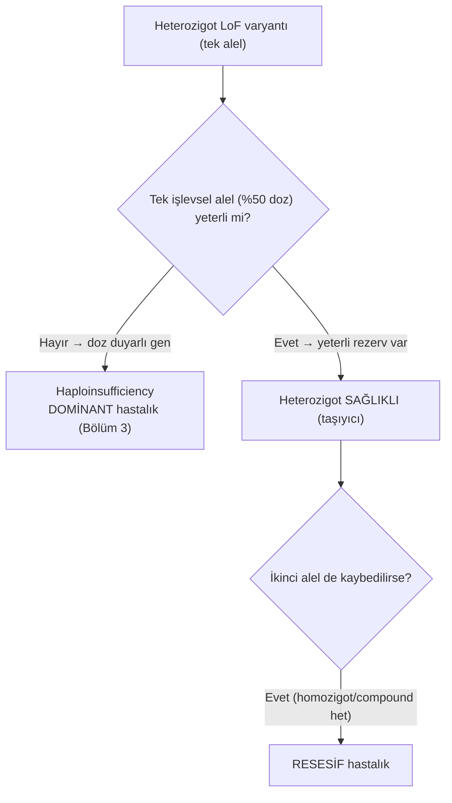
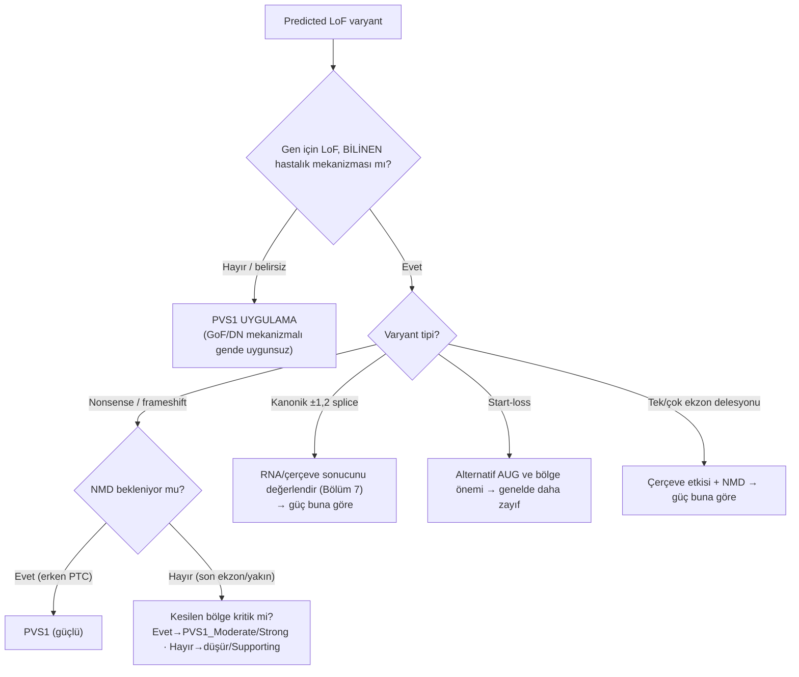
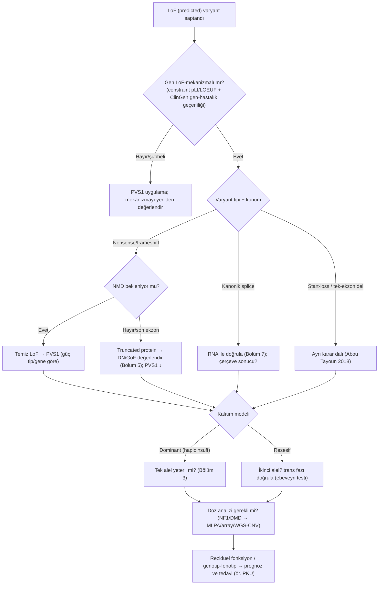

# Bölüm 2 — Loss-of-Function (İşlev Kaybı) Mekanizmaları

> **Bölümün çekirdek tezi:** Loss-of-function (LoF), genin işlevsel ürününün **niceliksel olarak azalması veya kaybolması**dır. Ancak "varyant LoF yapar" demek tek başına ne patojeniteyi, ne kalıtım modelini, ne de fenotip ağırlığını belirler. Bunları üç eksen belirler: *(1)* transkript **NMD'ye girer mi**, *(2)* gen LoF'a ne kadar **duyarlı** (doz/haploinsufficiency), *(3)* etkilenen **domain ve rezidüel fonksiyon** ne kadar. Bu üç eksen, aynı varyant tipinin neden bir gende ağır resesif, başka gende hafif veya dominant hastalık yaptığını açıklar.

> **📘 Okuma katmanları.** Bu kitabın birincil hedefi **yandal asistanı ve klinik genomik çalışan hekimdir**; genel pediatrist ve tıp öğrencisi ikincil hedef kitledir. Bölümü kendi katmanınızdan okuyabilirsiniz:
> · **① Temel — tıp öğrencisi:** §1–§2: işlev kaybı nedir ve NMD nerede devreye girer (Şekil 2.1). Bu iki başlık kitabın geri kalanının zeminidir.
> · **② Klinik — pediatrist ve klinisyen:** §4 (fenotipe dönüşüm) ve §5 (test seçimi); "kesici varyant bulundu" cümlesinin klinik karşılığı.
> · **③ İleri düzey — yandal asistanı, laboratuvar, varyant yorumlayan:** §6: PVS1 karar ağacı, son ekzon / NMD kaçışı ve "kesici varyant = gerçek null değildir" ayrımı.

Bu bölüm, Bölüm 1'deki **niceliksel vs niteliksel bozukluk** ayrımının "niceliksel" kolunu derinleştirir. Niteliksel kol (GoF, dominant-negatif, neomorfik) Bölüm 4–6'da; doz hastalıklarının özel hâli haploinsufficiency Bölüm 3'te işlenir.

---

## Öğrenme hedefleri

Bu bölümü tamamlayan okuyucu:
1. LoF'a giden tüm moleküler yolları (null, nonsense, frameshift, kanonik splice, start-loss, ekzon/tam gen delesyonu, promoter/enhancer kaybı) ayırt edebilir.
2. NMD ve NMD-escape mekaniğini, PTC konumuyla ilişkilendirerek klinik sonuca bağlayabilir.
3. Okuma çerçevesi kuralını (in-frame vs out-of-frame) Duchenne ve Becker örneğiyle açıklayabilir.
4. "LoF her zaman patojen midir?" sorusunu constraint metrikleri (pLI, LOEUF) ve gen-hastalık mekanizması üzerinden yanıtlayabilir.
5. Aynı gendeki LoF'un neden bazen dominant (haploinsufficiency) bazen resesif olduğunu gerekçelendirebilir.
6. Hipomorfik alel ve rezidüel fonksiyon kavramını genotip-fenotip korelasyonuyla (PKU) bağlayabilir.
7. PVS1 kriterini ClinGen SVI karar ağacına göre, gücünü doğru ayarlayarak uygulayabilir.

---

## 1. Kavramsal tanım

**Tablo 2.1 — İşlev kaybının temel kavramları**

| Kavram | Tanım | Klinik anlamı |
|--------|-------|---------------|
| **Loss-of-function (LoF)** | Gen ürününün **miktarını veya biyolojik aktivitesini** kısmen ya da tamamen azaltan işlevsel sonuç | Mekanizmanın yönü "azalma"dır; klinik sonuç alelik gereksinime, doz duyarlılığına ve kalan işleve bağlıdır |
| **Null (amorfik) alel** | İlgili biyolojik bağlamda **işlevsel katkısı sıfır** olan alel; RNA/protein hiç oluşmayabilir ya da oluşan ürün tümüyle işlevsiz olabilir | Moleküler işlev kaybının **tam kayıp ucu** — ancak mutlaka en ağır klinik fenotip demek değildir |
| **Hipomorfik alel** | Yabanıl tipe göre azalmış ama **sıfır olmayan** işlev | Rezidüel işlev sıklıkla daha hafif, geç başlangıçlı veya tam olmayan fenotiple ilişkilidir |
| **Rezidüel işlev** | Mutant alelin ya da genotipin, belirli bir biyolojik bağlamda **koruduğu** işlev düzeyi | Genotip–fenotip korelasyonunun ana belirleyicilerinden; dokuya, izoforma ve kullanılan teste göre değişebilir |
| **Nonsense-mediated decay (NMD)** | Belirli koşulları karşılayan PTC içeren transkriptlerin **düzeyini azaltan** RNA gözetim mekanizması | Mutant transkript ve kesilmiş protein miktarını azaltır; **"transkript tümüyle yok" sonucu otomatik çıkarılamaz** |
| **NMD'den kaçış** | PTC içeren transkriptin yeterince yıkılmaması ve translasyona devam edebilmesi | Kesilmiş protein oluşur; sonuç null, hipomorfik, dominant-negatif, GoF veya neomorfik olabilir (Bölüm 4, 5) |
| **Kesilmiş (truncated) protein** | Normal C-terminal dizisinin bir bölümünü kaybetmiş, erken sonlanmış protein | İşlevsiz, kısmen işlevli, kararsız, dominant-negatif ya da toksik olabilir |
| **Haploinsufficiency** | Tek işlevsel alelin ürettiği gen ürününün **normal fenotipi sürdürmeye yetmemesi** | Heterozigot LoF dominant hastalık yapabilir; gerçek doz zorunlu olarak tam %50 değildir (Bölüm 3) |
| **Resesif LoF mekanizması** | Hastalık için **iki alelin birleşik işlevinin** hastalık eşiğinin altına düşmesi | İkisinin de tam null olması şart değildir: null/null, null/hipomorf ve hipomorf/hipomorf genotipler hastalık yapabilir |
| **Bileşik heterozigot** | Aynı gende iki farklı varyantın karşı homologlarda (*trans*) bulunması | Bir **genotip tanımıdır**; varyantların patojen olduğunu kendiliğinden göstermez — her ikisi ayrıca değerlendirilmelidir |
| **LoF intoleransı (pLoF constraint)** | Referans popülasyonda bir genin, beklenene göre **heterozigot** öngörülen LoF varyantlarından arınmış olması | "Bu gen heterozigot LoF'a karşı negatif seçilim gösteriyor mu?" sorusunu yanıtlar — LoF'un o hastalık için mekanizma olduğunu kanıtlamaz (Bölüm 1 §1.H) |

Tablodaki üç terim, kitabın geri kalanında sürekli karşınıza çıkacağı için baştan netleştirilmelidir.

**"LoF" iki ayrı düzeyde kullanılır ve bunları karıştırmak yorumlama hatasının en sık kaynağıdır.** Birincisi **varyant etkisidir**: varyant, ürünün miktarını ya da aktivitesini azaltır. İkincisi **hastalık mekanizmasıdır**: azalmış gen işlevi *o hastalığa* neden olur. Bir varyant laboratuvar deneyinde işlevi azaltabilir, ama ilgili gen–hastalık ilişkisinde LoF yerleşik mekanizma olmayabilir. Dahası, "kesici" görünen bir nonsense veya frameshift varyantı NMD'den kaçarak dominant-negatif ya da bambaşka bir anormal ürün etkisi üretebilir (Bölüm 4, 5). Bu yüzden mekanizma dili, **azalmış ürün düzeyi**, **değişmiş ürün dizisi** ve **aşağı akım işlevsel sonuç** kavramlarını birbirinden ayırmalıdır.

**Null alel, "hiç ürün üretmeyen alel" demek değildir.** Belirleyici olan üretim değil, **işlevsel katkının sıfır olmasıdır**. Alt tipleri ayırmak yararlıdır: *RNA-null* (anlamlı transkript oluşmaz), *protein-null* (protein oluşmaz), *işlevsel null* (protein oluşur ama aktivitesi sıfırdır). Üçü de aynı genetik davranışı gösterir. Buna bağlı ikinci bir düzeltme: null alel, moleküler işlev kaybının **en uç noktasıdır**, ama **klinik olarak en ağır fenotip anlamına gelmez** — dominant-negatif ya da toksik işlev kazanımı varyantları null alelden daha ağır tablolar yapabilir (Bölüm 5'teki OI örneği bunun en açık kanıtıdır).

**Hipomorfi de yalnızca "az protein" demek değildir.** Azalma birden çok yoldan olabilir: daha az RNA/protein üretimi, normal miktarda ama düşük aktiviteli protein, azalmış kararlılık, hücre içi yerleşim kusuru ya da proteinin yalnızca *bazı* işlevlerinin kaybı. Tanımlayıcı ölçüt şudur: işlevsel etki yabanıl tipten düşük, null alelden yüksektir.

---

## 2. Moleküler mekanizma

### 2.1. LoF'a giden yollar — fonksiyon nerede kaybedilir?

İşlevsel ürün, santral dogmanın herhangi bir basamağında kaybedilebilir. Bunları "yukarıdan aşağıya" izlemek tanısal düşünmeyi kolaylaştırır:

1. **Transkript hiç/yetersiz üretilir** → *promoter/enhancer kaybı, tam gen delesyonu.* (Bu varyantlar WES'te çoğu kez görünmez; Bölüm 8, 13.)
2. **Transkript yanlış işlenir** → *kanonik splice-site varyantı* → ekzon atlama veya intron retansiyonu (Bölüm 7).
3. **Transkript yıkılır** → *nonsense/frameshift* → PTC → NMD → fonksiyonel null.
4. **Protein başlatılamaz** → *start-loss* (AUG kaybı) → translasyon başlamaz veya aşağı akıştaki alternatif AUG kullanılır (belirsizlik).
5. **Protein kısalır/bozulur** → *NMD'den kaçan PTC* → truncated protein; *in-frame indel* → domain bozulması; *destabilize edici missense* → katlanamayan/yıkılan protein (fonksiyonel null'a eşdeğer olabilir).

> **🔬 Deep-dive — Missense de "LoF" olabilir.** LoF yalnızca truncating varyantların işi değildir. Protein katlanmasını/stabilitesini bozan bir missense, hücrede hızla yıkılan bir ürün oluşturarak **fonksiyonel null** gibi davranabilir (ör. birçok metabolik enzim varyantı). Bu nedenle "LoF mekanizması" gen düzeyinde bir özelliktir; varyant tipi tek başına mekanizmayı garanti etmez.

### 2.2. NMD: LoF mekanizmasının kalbi

NMD, erken sonlanma kodonu (PTC) taşıyan transkriptleri yıkan bir mRNA gözetim sistemidir; bu transkriptlerin yıkılmaması, dominant-negatif veya gain-of-function etkilerle hücreye toksik olabilen anormal proteinlerin sentezine yol açabilir ve NMD bilgisi çeşitli genetik hastalıklarda genotip–fenotip korelasyonunu anlamak için gereklidir (Khajavi, Inoue, Lupski, 2006, *Eur J Hum Genet*; [DOI](https://doi.org/10.1038/sj.ejhg.5201649)).

**Pozisyon kuralı.** ClinGen'in PVS1 uygulama önerisi bu kuralı normatif biçimde şöyle tanımlar: **NMD'nin gerçekleşmediği öngörülen iki konum vardır — PTC'nin *son (3′-en uçtaki) ekzonda* bulunması ve *sondan bir önceki ekzonun 3′ ucundaki son 50 nükleotid içinde* bulunması** (Abou Tayoun ve ark., 2018). Bu iki konumun dışındaki erken sonlanmalarda transkript genellikle NMD'ye uğrar ve sonuç fonksiyonel bir null'dur; bu iki konumda ise transkript korunur, **kısalmış (truncated) protein üretilir** ve mekanizma artık basit bir doz kaybı olmaktan çıkar (Şekil 2.1).

> **🔬 Deep-dive — "50 nükleotid kuralı" bir eşik değil, bir öngörüdür.** Kuralın kendisi sağlamdır, ama üç noktada dikkatli kullanılmalıdır. **Birincisi**, kural PTC'nin *hangi transkriptte* bulunduğuna bağlıdır; klinik olarak ilgili izoform seçilmezse konum yanlış hesaplanır. **İkincisi**, NMD'den kaçmak "zararsız" demek değildir — asıl soru, kaybedilen C-terminal bölgenin işlevsel olarak kritik olup olmadığıdır. ClinGen'in verdiği örnek öğreticidir: *PTEN*'in son kodlayan ekzonundaki erken sonlanmalar NMD'den kaçar, ama 375. kodonun yukarısında kalanlar PEST motiflerini içeren C-terminal alanı bozduğu için yine de güçlü kanıt (PVS1_Strong) düzeyinde değerlendirilir (Abou Tayoun ve ark., 2018). **Üçüncüsü ve en önemlisi**, NMD'den kaçan bir transkriptin ürettiği anormal protein hücre için toksik olabilir; bu, dominant-negatif veya işlev kazanımı etkilerine kapı açar (Khajavi ve ark., 2006) — yani "NMD'den kaçtı" bulgusu mekanizmayı hafifletmez, **mekanizmayı değiştirir** (Bölüm 4, 5). Öngörü ile gerçeği ayırt etmenin tek yolu **RNA düzeyinde doğrulamadır**.

Bu ayrım klinik olarak belirleyicidir, çünkü:
- **NMD (+):** Transkript yok → "temiz" LoF → fenotip haploinsufficiency (dominant gende) veya resesif LoF mantığıyla; toksik protein riski düşük.
- **NMD (−) / escape:** Truncated protein üretilir → işlevsiz, yarı-işlevsel **veya dominant-negatif/toksik** olabilir → mekanizma sınıfı kayabilir (Bölüm 5) ve PVS1 gücü düşer (§6).

> **🔬 Deep-dive — NMD verimliliği mutlak değildir.** NMD'nin etkinliği transkripte, hücre tipine ve fizyolojik duruma göre değişir; bazı transkriptler kısmen kaçar. Bu nedenle *in silico* "NMD bekleniyor" tahmini, mümkünse **RNA çalışmasıyla** (alel-spesifik ekspresyon) doğrulanmalıdır.

### 2.3. Okuma çerçevesi (reading-frame) kuralı

DMD lokusundaki kısmi delesyonlarda okuma çerçevesini **bozan** (out-of-frame) delesyonlar truncated/anormal protein ile ağır **Duchenne** fenotipine; çerçeveyi **koruyan** (in-frame) delesyonlar ise daha kısa ama yarı-işlevsel protein ile daha hafif **Becker** fenotipine yol açar; aynı mekanizma splice mutasyonlarına da uygulanır (Monaco ve ark., 1988, *Genomics*; [DOI](https://doi.org/10.1016/0888-7543(88)90113-9)).

Bu "okuma çerçevesi hipotezi" LoF biyolojisinin klasik örneğidir ve iki dersi birden verir: *(1)* aynı tip varyant (delesyon) bile **çerçeve etkisine** göre farklı şiddet yapar; *(2)* mekanizma bilgisi tedaviye dönüşür — **ekzon-atlama (exon-skipping)** tedavileri, out-of-frame bir transkripti yeniden in-frame'e çevirerek Duchenne'i Becker-benzeri daha hafif bir tabloya kaydırmayı amaçlar.

---

## 3. Varyant tipleri ve beklenen LoF sonucu

**Tablo 2.2 — Varyant tipleri ve beklenen işlev kaybı sonuçları**

| Varyant tipi | Tipik moleküler sonuç | NMD beklentisi | Notlar |
|--------------|------------------------|----------------|--------|
| **Nonsense (stop-gain)** | PTC | Erken → NMD; son ekzon → kaçış | Kaçışta truncated protein |
| **Frameshift (indel)** | Çerçeve kayması → downstream PTC | Çoğunlukla NMD | Son ekzonda kaçabilir |
| **Kanonik ±1,2 splice** | Ekzon atlama / intron retansiyonu | Sonuç çerçeveye bağlı | RNA ile doğrulama ideal (Bölüm 7) |
| **Start-loss** | Translasyon başlamaz / alternatif AUG | NMD dışı | Belirsizlik; fonksiyonel kanıt yardımcı |
| **Büyük/tam gen delesyonu** | Alel tümüyle yok | — | Saf doz kaybı (array/MLPA) |
| **Tek/çok ekzon delesyonu** | Çerçeveye bağlı LoF | — | DMD'de çerçeve kuralı belirleyici |
| **Promoter/enhancer kaybı** | Transkripsiyon azalır/durur | — | WES kaçırır (Bölüm 13) |
| **İn-frame indel** | Domain bütünlüğü bozulur | NMD dışı | LoF veya DN olabilir |
| **Destabilize missense** | Katlanma/stabilite kaybı | NMD dışı | Fonksiyonel null'a eşdeğer olabilir |

---

## 4. Klinik fenotipe dönüşüm — bölümün anahtar soruları

### 4.1. Bir LoF varyantı her zaman patojen midir? → **Hayır.**

LoF tahmini (pLoF), patojenite ile eşanlamlı **değildir**. Patojenite için en az şu koşullar gerekir:
- **Gen, LoF'a duyarlı olmalı** (LoF gerçekten o gen için hastalık mekanizması olmalı).
- **Varyant gerçekten null etki yapmalı** (NMD, son ekzon, doku-özgü ekspresyon, alternatif transkriptler dikkate alınmalı).
- **Kalıtım modeli uymalı** (dominant haploinsufficiency mi yoksa resesif mi? Tek alel mi, iki alel mi?).

> **🔬 Deep-dive — Sağlıklı insanlarda da LoF vardır.** Tipik bir insan genomu çok sayıda predicted-LoF varyantı taşır ve genler inaktivasyona tolerans açısından geniş bir spektrumda yer alır; LoF'a **kısıtlı (constrained)** genler hastalıkla ilişki için zenginleşmiştir (Karczewski ve ark., 2020, *Nature*; [DOI](https://doi.org/10.1038/s41586-020-2308-7)). Yani "bir LoF varyantı bulundu" demek, ilgili genin LoF-intoleran olduğu gösterilmeden patojenite anlamına gelmez.

### 4.2. LoF intoleransı ve constraint metrikleri (pLI, LOEUF, HI)

Bu metriklerin ikisi de aynı mantığın nicel karşılığıdır: bir gende sağlıklı popülasyonda *beklenenden az* LoF varyantı görülüyorsa, o varyantları taşıyanlar elenmiş demektir. **pLI**, ExAC veri kümesiyle tanımlanmış ikili bir olasılık ölçüsüdür (Lek ve ark., 2016, *Nature*; [DOI](https://doi.org/10.1038/nature19057)); **LOEUF** ise gnomAD ile getirilen, sürekli ve güven aralığına dayanan ardılıdır ve yazarlarca pLI yerine tercih edilmesi önerilir (Karczewski ve ark., 2020, *Nature*; [DOI](https://doi.org/10.1038/s41586-020-2308-7)).

**Tablo 2.3 — İşlev kaybı intoleransı metrikleri ve yorum yönü**

| Metrik | Ne ölçer? | Yorum yönü |
|--------|-----------|-----------|
| **pLI** | Genin LoF'a intolerans olasılığı (0–1) | pLI ≥ 0,9 → haploinsufficiency/dominant LoF için güçlü ipucu |
| **LOEUF** | Gözlenen/beklenen pLoF üst güven sınırı | Düşük LOEUF → LoF intoleran gen |
| **HI skoru / ClinGen dozaj** | Tek kopya kaybının patojenitesi | CNV yorumuna bağlanır (Bölüm 3, 8) |

> ⚠️ Bu metrikler **gen düzeyinde** önceliklendirme aracıdır; tek bir varyantın patojenitesini tek başına kanıtlamaz. Ayrıca **resesif LoF genleri** (her iki alel gerekir) genellikle "intoleran" görünmez — metriklerin doğru yorumlanması için kritik bir nokta.

### 4.3. Aynı gendeki LoF neden bazen dominant, bazen resesif?

**Algoritma 2.1 — Aynı gendeki işlev kaybı neden farklı ağırlıkta hastalık yapar?**

Karar, genin **doz duyarlılığı** ve **fonksiyonel rezervi** ile belirlenir. Doz duyarlı genler (transkripsiyon faktörleri, kromatin düzenleyiciler, gelişim genleri) tipik olarak haploinsufficiency → dominant; yüksek rezervli genler (birçok metabolik enzim) resesif davranır. Constraint metrikleri bu ayrımda yön gösterir.

Enzimlerin neden bu kadar sık "rezervli" davrandığının klasik açıklaması metabolik kontrol kuramından gelir: bir enzim izole çalışmaz, substrat ve ürünleri üzerinden komşu enzimlere kinetik olarak bağlıdır; bir yolağın akısı üzerindeki kontrol çok sayıda enzime dağıldığı için tek bir enzimin duyarlılık katsayısı küçüktür. Bu nedenle heterozigotta beklenen %50'lik aktivite düşüşü çoğu zaman akıya — dolayısıyla fenotipe — yansımaz ve varyant "resesif" görünür; başka bir deyişle enzimlerdeki güvenlik payı, seçilimle sonradan kazanılmış bir özellik değil, enzim ağının kinetik yapısının doğal sonucudur (Kacser & Burns, 1981, *Genetics*; [DOI](https://doi.org/10.1093/genetics/97.3-4.639)). Doz duyarlı genlerin dominant davranması ise bu kuralın istisnası değil, aynı çerçevenin öbür ucudur: kontrol katsayısı yüksek olan (dar bir miktar aralığında çalışan) genlerde %50 doz gerçekten yetmez.

### 4.4. NMD olur / olmazsa klinik sonuç (özet)

**Tablo 2.4 — NMD olması ve olmaması durumunda klinik sonuçlar**

| | **NMD (+)** | **NMD (−) / escape** |
|---|------------|----------------------|
| Ürün | Transkript yıkılır → ürün yok | Truncated protein üretilir |
| Mekanizma | Temiz LoF (haploinsuff/resesif) | LoF **veya** dominant-negatif/toksik |
| Şiddet eğilimi | Genin doz mantığına uyar | Bazen beklenenden ağır |
| PVS1 gücü | Tam (gen uygunsa) | Düşürülür |

### 4.5. C-terminal truncation neden bazen hafif, bazen ağır?

- **Hafif olabilir:** Kesilen C-terminal bölge işlevsel olarak az önemliyse, protein büyük ölçüde işlevini korur (yarı-işlevsel) → hafif fenotip.
- **Ağır olabilir:** C-terminal kritik bir domain (dimerizasyon, lokalizasyon sinyali, düzenleyici bölge) içeriyorsa **veya** truncated protein dominant-negatif etki gösteriyorsa (NMD'den kaçtığı için üretilir), fenotip beklenenden ağır olur.

> "Son ekzon = her zaman hafif/benign" varsayımı bu nedenle **yanlıştır** (Şekil 2.1B).

### 4.6. Rezidüel fonksiyon ve alelik spektrum

Resesif LoF hastalıklarında fenotip ağırlığı, kalan işlevle ters orantılı bir **spektrum** oluşturur (Şekil 2.3). Bileşik heterozigotlarda pratik kural: **fenotipi genellikle daha hafif (rezidüel işlevi daha yüksek) alel belirler** — "daha iyi alel kazanır". Bu, PKU'da klasik PKU → hafif PKU → hafif hiperfenilalaninemi spektrumunun temelidir (§7.4).

---

## 5. Tanısal testlerle ilişkisi

**Tablo 2.5 — İşlev kaybı mekanizmasını hangi test yakalar?**

| Test | Bu mekanizmayı yakalar mı? | Sınırlılığı |
|------|----------------------------|-------------|
| **WES** | ✅ Nonsense, frameshift, kanonik splice, start-loss, missense | Promoter/enhancer kaybı, derin intronik LoF, bazı ekzon delesyonlarını (kapsama bağlı) kaçırır |
| **Short-read WGS** | ✅ Yukarıdakiler + birçok CNV/ekzon delesyonu + regülatör | Karmaşık SV ve tekrar bölgelerinde sınırlı |
| **Long-read WGS** | ✅ Büyük del/kompleks SV, faz (trans/cis) | Maliyet/erişim; standartizasyon gelişmekte |
| **Array-CGH / SNP array** | ✅ Tam/büyük gen delesyonu; SNP array UPD | Tek ekzon altı çözünürlük ve SNV göremez |
| **MLPA** | ✅ Ekzon düzeyi del/dup (DMD, NF1) | Yalnız hedef lokus; dizi bilgisi yok |
| **RNA-seq** | ✅ NMD'yi (alel dengesizliği), splice etkisini gösterir | İlgili dokuda ekspresyon ve uygun örnek gerekir |
| **Methylation array** | ⚠️ Doğrudan değil | LoF'u göstermez (Bölüm 10) |
| **Karyotip** | ⚠️ Yalnız çok büyük delesyonlar | Çözünürlük düşük |

> **Bu mekanizmayı hangi test yakalar? (özet):** Nokta LoF varyantları → **WES/WGS**; ekzon düzeyi delesyon/duplikasyon → **MLPA veya array/WGS**; NMD ve splice sonucu → **RNA-seq** doğrular. DMD/NF1 gibi delesyon-duplikasyon ağırlıklı genlerde dizileme + doz testi **birlikte** gereklidir; yalnız dizileme yapmak büyük delesyonu kaçırır.

---

## 6. Varyant yorumlama açısından önemi (ACMG/ClinGen — PVS1)

ACMG/AMP çerçevesi predicted LoF için güçlü patojenik kriter PVS1'i tanımlar (Richards ve ark., 2015, *Genet Med*; [DOI](https://doi.org/10.1038/gim.2015.30)); ancak orijinal kılavuz LoF tiplerinin ayrımını ve güç derecelendirmesini ayrıntılandırmamıştı. ClinGen SVI çalışma grubu, PVS1'i **varyant tipi, konumu, NMD beklentisi ve genin LoF mekanizması** üzerinden karar ağacına bağlayan ve gücü (PVS1 → Strong → Moderate → Supporting) ayarlayan ayrıntılı öneriler yayımlamıştır (Abou Tayoun ve ark., 2018, *Hum Mutat*; [DOI](https://doi.org/10.1002/humu.23626)).

**PVS1 karar ağacı (ClinGen SVI mantığının basitleştirilmiş özeti):**

**Algoritma 2.2 — Öngörülen işlev kaybı varyantında PVS1 akışı**

Mekanizmadan doğan kontroller (özet):
- **Gen LoF-mekanizmalı mı?** PVS1 yalnız bu genlerde tam güçle.
- **NMD beklentisi var mı?** Son ekzon kaçışı → güç düşer.
- **Kesilen bölgenin önemi:** Truncation klinik açıdan önemli/biofonksiyonel bir domaini çıkarıyor mu?
- **Alelik heterojenite uyarısı:** CFTR gibi genlerde binlerce varyantın yalnız bir kısmı hastalık nedenidir; tahmini LoF dahi klinik+fonksiyonel kanıtla desteklenmelidir (Sosnay ve ark., 2013, *Nat Genet*; [DOI](https://doi.org/10.1038/ng.2745)).

> **🟦 Klinikte dikkat — PVS1 otomatik değildir:** "Çok güçlü" bir kriter olan PVS1'in mekanizma kontrolü yapılmadan uygulanması, yanlış-patojen sınıflamanın en sık kaynaklarından biridir. Önce gen-hastalık geçerliliği ve LoF mekanizması; sonra varyant tipi/konum.

---

## 7. Pediatrik genetikten klinik örnekler

### 7.1. NF1 — haploinsufficiency ile dominant LoF
NF1 (nörofibromin) bir tümör baskılayıcıdır; heterozigot LoF varyantları (nonsense, frameshift, splice, tam gen/ekzon delesyonu) tek alel kaybıyla **dominant** nörofibromatozis tip 1'e yol açar. *Öğreti:* hem nokta LoF hem büyük delesyonlar aynı gende hastalık yapar → tanıda **dizileme + doz analizi (MLPA/array)** birlikte. (Haploinsufficiency → Bölüm 3; tümör baskılayıcı "ikinci vuruş" → Bölüm 16.)

### 7.2. DMD — çerçeve kuralı ile Duchenne vs Becker
Distrofin geninde out-of-frame delesyonlar truncated protein ile ağır **Duchenne**'e; in-frame delesyonlar yarı-işlevsel protein ile daha hafif **Becker**'e yol açar (Monaco ve ark., 1988; [DOI](https://doi.org/10.1016/0888-7543(88)90113-9)). *Öğreti:* aynı gen, aynı "delesyon" tipi — fakat **çerçeve etkisi** fenotip ağırlığını belirler (Şekil 2.2); ekzon-atlama tedavilerinin mantıksal temeli budur.

### 7.3. CFTR — resesif LoF ve alelik heterojenite
Kistik fibrozis, CFTR'de **iki** patojen alel gerektiren resesif bir hastalıktır; gende yaklaşık iki bin varyant tanımlıdır ama yalnız bir kısmı hastalık nedenidir. Bunu ölçen çalışma, 39.696 kistik fibrozisli bireyin genotip ve fenotip verisini birleştirmiş; alel frekansı ≥%0,01 olan 159 varyantı hem klinik ağırlık hem işlevsel sonuç açısından değerlendirmiş ve bunların 127'sinin (%80) her iki ölçütü de karşıladığını göstermiştir — kalan 32 varyantın 12'si nötr sayılabilmiş, 20'si belirsiz kalmıştır (Sosnay ve ark., 2013; [DOI](https://doi.org/10.1038/ng.2745)). *Öğreti:* heterozigot taşıyıcı sağlıklıdır; tanı için **trans faz** ve alel patojenitesi gösterilmelidir.

### 7.4. PKU/PAH — hipomorfik aleller ve rezidüel fonksiyon
Fenilketonüri, PAH genindeki varyantlarla oluşan resesif bir aminoasit metabolizması hastalığıdır; genotipler rezidüel enzim aktivitesini yansıtan bir spektrumda (klasik PKU → hafif PKU → hafif hiperfenilalaninemi) dağılır ve büyük genotip veritabanları fenotip ile BH4 yanıtını öngörmeyi mümkün kılar (Hillert ve ark., 2020, *Am J Hum Genet*; [DOI](https://doi.org/10.1016/j.ajhg.2020.06.006)). *Öğreti:* **rezidüel fonksiyon = fenotip ağırlığının motoru**; bileşik heterozigotlarda fenotipi genellikle daha hafif alel belirler (Şekil 2.3).

---

## 8. Sık yapılan hatalar

> **🔴 Sık yapılan hata kutusu**
>
> 1. **"pLoF = patojen" varsaymak.** Gen LoF-duyarlı mı, NMD oluyor mu, kalıtım uyuyor mu kontrol edilmeli.
> 2. **Son-ekzon nonsense'i otomatik "hafif/benign" saymak.** NMD kaçışı → truncated protein → DN/GoF riski.
> 3. **PVS1'i mekanizma kontrolü yapmadan uygulamak.** GoF/DN gende PVS1 uygunsuz (Abou Tayoun 2018).
> 4. **pLI/LOEUF'u resesif genlerde yanlış yorumlamak.** Resesif LoF genleri "tolerant" görünebilir.
> 5. **Sadece dizileme yapıp ekzon delesyonunu kaçırmak.** NF1/DMD'de MLPA/array eklenmeli.
> 6. **Resesif tanıda fazı doğrulamamak.** İki varyantın trans olduğu (ebeveyn testi) gösterilmeli.
> 7. **Çerçeve etkisini ihmal etmek.** İn-frame vs out-of-frame fenotipi kökten değiştirir.
> 8. **Missense'i "LoF olamaz" sanmak.** Destabilize missense fonksiyonel null olabilir.

---

## 9. Klinik pratikte karar algoritması

**Algoritma 2.3 — İşlev kaybı varyantı saptandığında klinik karar akışı**

---

## 10. Kaynaklar

> **Atıf / doğrulama notu:** Bu bölümün bibliyografik verileri PubMed üzerinden alınmış ve doğrulanmıştır; her kaynağın PMID **ve** DOI'si bu oturumda tek tek teyit edilmiştir. Metin içinde yazar-yıl, kaynakçada DOI-link kullanılmıştır.

1. **Richards S, Aziz N, Bale S, ve ark. (2015).** Standards and guidelines for the interpretation of sequence variants: a joint consensus recommendation of the American College of Medical Genetics and Genomics and the Association for Molecular Pathology. *Genetics in Medicine* 17(5):405–424. **PMID: 25741868** · DOI: [10.1038/gim.2015.30](https://doi.org/10.1038/gim.2015.30) — *Guideline / PVS1 dahil kanıt çerçevesi.*
2. **Abou Tayoun AN, Pesaran T, DiStefano MT, ve ark. (2018).** Recommendations for interpreting the loss of function PVS1 ACMG/AMP variant criterion. *Human Mutation* 39(11):1517–1524. **PMID: 30192042** · DOI: [10.1002/humu.23626](https://doi.org/10.1002/humu.23626) — *Guideline / PVS1 karar ağacı ve güç derecelendirmesi.*
3. **Khajavi M, Inoue K, Lupski JR (2006).** Nonsense-mediated mRNA decay modulates clinical outcome of genetic disease. *European Journal of Human Genetics* 14(10):1074–1081. **PMID: 16757948** · DOI: [10.1038/sj.ejhg.5201649](https://doi.org/10.1038/sj.ejhg.5201649) — *Mekanizma/review; NMD ve genotip-fenotip, NMD-escape toksisitesi.*
4. **Monaco AP, Bertelson CJ, Liechti-Gallati S, Moser H, Kunkel LM (1988).** An explanation for the phenotypic differences between patients bearing partial deletions of the DMD locus. *Genomics* 2(1):90–95. **PMID: 3384440** · DOI: [10.1016/0888-7543(88)90113-9](https://doi.org/10.1016/0888-7543(88)90113-9) — *Landmark mekanistik; okuma çerçevesi hipotezi (Duchenne vs Becker).*
5. **Sosnay PR, Siklosi KR, Van Goor F, ve ark. (2013).** Defining the disease liability of variants in the cystic fibrosis transmembrane conductance regulator gene. *Nature Genetics* 45(10):1160–1167. **PMID: 23974870** · DOI: [10.1038/ng.2745](https://doi.org/10.1038/ng.2745) — *Klinik örnek / alelik heterojenite, LoF varyantlarının kanıtla doğrulanması (CFTR).*
6. **Hillert A, Anikster Y, Belanger-Quintana A, ve ark. (2020).** The Genetic Landscape and Epidemiology of Phenylketonuria. *American Journal of Human Genetics* 107(2):234–250. **PMID: 32668217** · DOI: [10.1016/j.ajhg.2020.06.006](https://doi.org/10.1016/j.ajhg.2020.06.006) — *Klinik örnek / hipomorfik alel, rezidüel fonksiyon, genotip-fenotip (PAH).*
7. **Karczewski KJ, Francioli LC, Tiao G, ve ark. (2020).** The mutational constraint spectrum quantified from variation in 141,456 humans. *Nature* 581(7809):434–443. **PMID: 32461654** · DOI: [10.1038/s41586-020-2308-7](https://doi.org/10.1038/s41586-020-2308-7) — *Mekanizma/metodoloji; LoF intoleransı, LOEUF.*
8. **Lek M, Karczewski KJ, Minikel EV, ve ark. (2016).** Analysis of protein-coding genetic variation in 60,706 humans. *Nature* 536(7616):285–291. **PMID: 27535533** · DOI: [10.1038/nature19057](https://doi.org/10.1038/nature19057) — *ExAC; pLI metriğinin tanımlandığı çalışma.*
9. **Kacser H, Burns JA (1981).** The molecular basis of dominance. *Genetics* 97(3–4):639–666. **PMID: 7297851** · DOI: [10.1093/genetics/97.3-4.639](https://doi.org/10.1093/genetics/97.3-4.639) — *Landmark kuram: enzim ağının kinetik yapısı, akı kontrol/duyarlılık katsayısı ve resesifliğin kaynağı.*

> **İkincil/destekleyici kaynak notu:** GeneReviews/OMIM/ClinVar/gnomAD yalnız destekleyici bilgi olarak anılmıştır.

---

## ✅ Bölüm öz-denetim tablosu

**Tablo 2.6 — Bölüm 2 öz-denetim tablosu**

| Kriter | Durum | Not |
|--------|-------|-----|
| Mekanizma doğru anlatıldı mı? | ✅ | LoF yolları, NMD, çerçeve kuralı, rezidüel fonksiyon, missense-LoF |
| Klinik bağlantı kuruldu mu? | ✅ | NF1, DMD, CFTR, PKU ile dominant/resesif/hipomorf eksenleri |
| Varyant tipi ile mekanizma ilişkilendirildi mi? | ✅ | Tablo 3 + NMD/çerçeve/PVS1 karar ağaçları |
| Pediatrik örnek verildi mi? | ✅ | 4 pediatrik gen, kaynaklı |
| Test seçimi açıklandı mı? | ✅ | WES/WGS + MLPA/array + RNA-seq, doz analizi vurgusu |
| ACMG/ClinGen bağlantısı doğru mu? | ✅ | PVS1 + SVI güç derecelendirmesi (Abou Tayoun 2018) |
| Kaynaklar PMID/DOI ile verildi mi? | ✅ | 9 kaynak; PMID+DOI doğrulandı (2'si doğrulama turunda eklendi: Lek 2016, Kacser & Burns 1981) |
| Spekülatif iddialar işaretlendi mi? | ✅ | NMD "~50 nt" kuralı basitleştirme olarak işaretlendi |
| Kaynak uydurma riski var mı? | ✅ Yok | Tüm kaynaklar PubMed metadata ile karşılaştırıldı |
| Görsel/şema/algoritma desteği yeterli mi? | ✅ | 3 SVG (NMD, çerçeve, spektrum) + 3 Mermaid (dominant/resesif, PVS1, karar algoritması) |

---

### 🔎 Bölüm sonu kaynak doğrulama komutu (zorunlu)
> "Bu bölümdeki her kaynağın **türüne uygun kalıcı kimliğini** kontrol et: hakemli makalede PMID + DOI; kılavuz/uzman panel spesifikasyonunda kurum + sürüm + tarih + kalıcı bağlantı; veri tabanında veri sürümü + sorgu tarihi. Kimliği doğrulanamayan kaynağı çıkar. Kaynağı olmayan spesifik iddiayı 'kaynak doğrulaması gerekli' olarak işaretle. Kitabın kendi pedagojik çerçevesini doğrulamaya çalışma — 🏷️ ile etiketle." *(Politika 01.08.2026 uzman turunda güncellendi: eski 'PMID veya DOI veremediğin kaynağı çıkar' kuralı HGVS, ClinGen/CSpec, gnomAD sürüm notları gibi PMID'siz ama yetkili kaynakları dışlıyordu.)*
>
> **Bu bölüm için durum:** 9/9 kaynak PMID+DOI doğrulandı. Bölüm, 27.07.2026 tarihli iddia-düzeyi doğrulama turundan geçmiştir (bkz. `Dogrulama_Kutugu.md`).
>
> **Uzman değerlendirmesi turu (29.07.2026):** NMD pozisyon kuralı, uzman talebi üzerine "öğretici basitleştirme" etiketinden çıkarılıp **kaynağına bağlandı**. Kural artık ClinGen SVI'nin normatif tanımıyla veriliyor — NMD'nin gerçekleşmediği öngörülen iki konum: PTC'nin **son ekzonda** ya da **sondan bir önceki ekzonun 3′ ucundaki son 50 nükleotid** içinde bulunması (Abou Tayoun ve ark., 2018; belgenin ilgili cümlesi tam metinden birebir teyit edilmiştir). İstisnalar da kaynaklı olarak eklendi: izoform seçiminin konumu değiştirmesi, NMD'den kaçmanın "zararsız" anlamına gelmemesi (*PTEN* 375. kodon örneği, aynı kaynak) ve NMD'den kaçan transkriptin ürettiği anormal proteinin dominant-negatif veya işlev kazanımı etkisi yaratabilmesi (Khajavi ve ark., 2006). Ayrıca §4.5'teki "son ekzon = hafif değildir" uyarısı uzman tarafından **ileri bir turda yeniden ele alınmak üzere açık bırakılmıştır.**
>
> **C4 (§1 — kavram tablosu) yeniden yazılmıştır.** Uzman dört satırı yanıltıcı buldu. *(1)* **Null alel** "hiç ürün üretmeyen alel" değil, **işlevsel katkısı sıfır** olan aleldir; alt tipleri (RNA-null, protein-null, işlevsel null) metne eklendi. Ayrıca "en şiddetli LoF ucu" ifadesi **"moleküler işlev kaybının tam kayıp ucu"** olarak düzeltildi — null alel klinik olarak en ağır fenotip anlamına gelmez (DN ve toksik GoF daha ağır olabilir). *(2)* **NMD** satırındaki "transkript yok → gerçek null" eşitliği kaldırıldı: NMD transkript düzeyini **azaltır**, dokuya ve PTC konumuna göre etkinliği değişir; gerçek null sonucu deneysel kanıt olmadan kesinleştirilemez. *(3)* **LoF intoleransı** satırının klinik karşılığı "bu gende LoF beklenen mekanizma mı?" idi; bu soruyu constraint yanıtlamaz — satır "heterozigot pLoF'a karşı negatif seçilim" olarak düzeltildi (Bölüm 1 §1.H ile aynı gerekçe). *(4)* **Resesif LoF** ve **haploinsufficiency** satırları, iki alelin *birleşik işlevinin* eşik altına düşmesi ve gerçek dozun zorunlu olarak %50 olmaması biçiminde hassaslaştırıldı; **bileşik heterozigot** ise bir **genotip tanımı** olduğu, patojeniteyi kendiliğinden göstermediği belirtilerek yeniden yazıldı. Tablodan sonra üç kavram (LoF'un varyant etkisi ↔ hastalık mekanizması ayrımı; null alelin alt tipleri; hipomorfinin yalnız "az protein" olmadığı) anlatı içinde açıldı.
>
> **Kitap geneli terminoloji standardizasyonu (C4'ten doğdu).** Uzman "alel" yazımının metin boyunca kullanılmasını istedi. Denetimde kitabın **zaten tutarsız** olduğu görüldü: 270 "allel" ve 199 "alel". Tüm bölümler ve arka madde **"alel"** yazımına çevrildi (265 değişiklik); İngilizce kullanımlar korundu (*variant allele fraction/frequency*, *non-allelic homologous recombination*, *Triallelic inheritance* — makale başlığı). Ayrıca "compound heterozigot" → **"bileşik heterozigot"** (3 bölüm) ve sözlük ile Bölüm 6'da kalan **"Müller" → "Muller"** düzeltmesi yapıldı (H.J. Muller; 27.07.2026 turunda başlatılan düzeltmenin tamamlanması).
