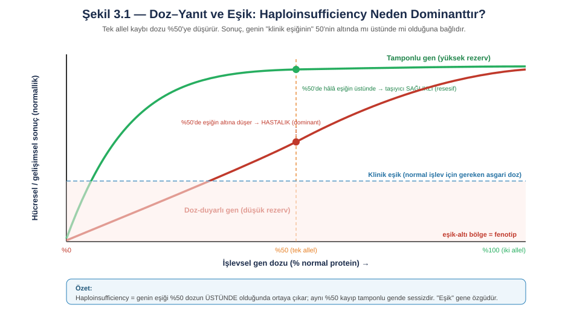
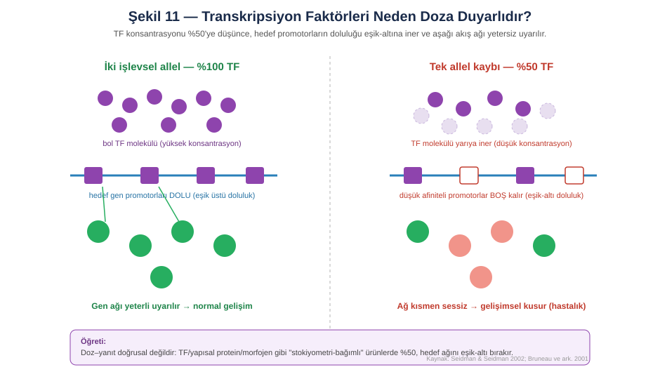
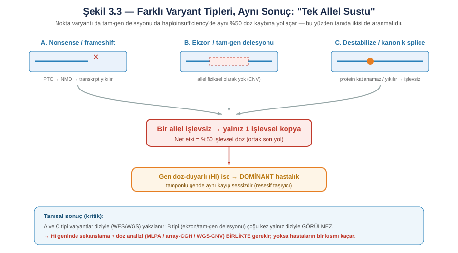
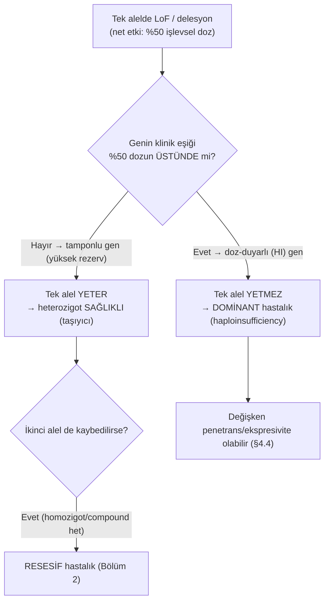
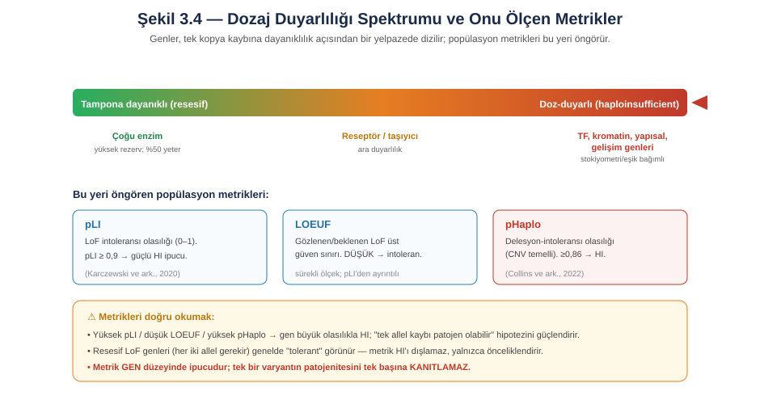
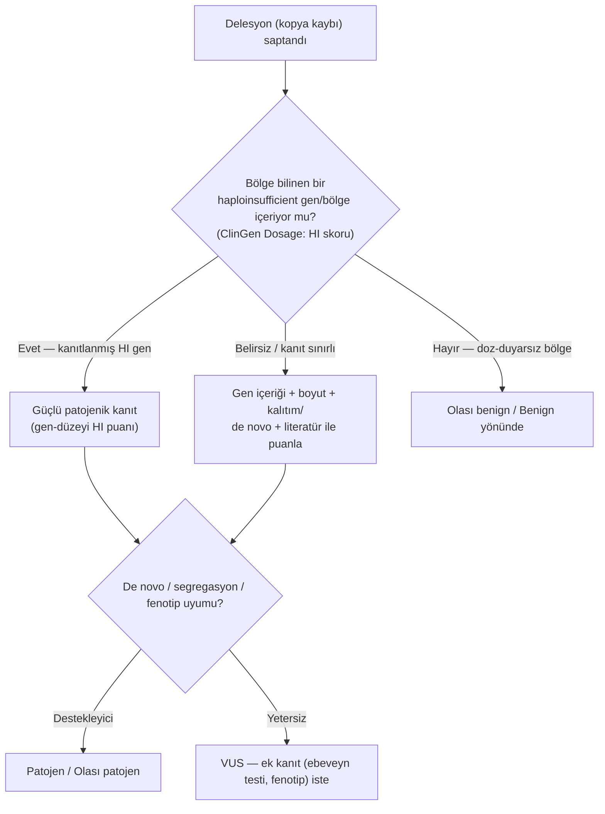
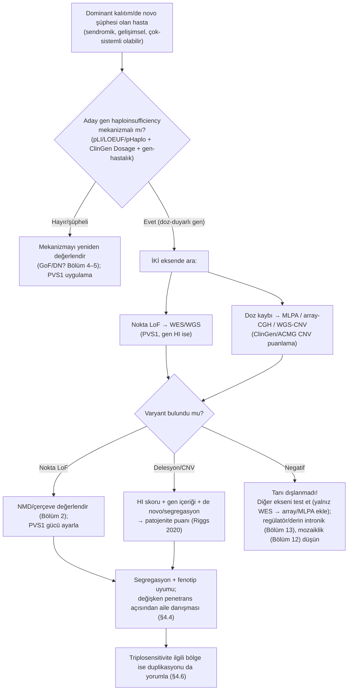

# Bölüm 3 — Haploinsufficiency (Yetersiz Doz)

> **Bölümün çekirdek tezi:** Haploinsufficiency, tek işlevsel alelin sağladığı **%50 gen dozunun, normal işlev için yetmediği** durumdur. Bölüm 2'de gördüğümüz işlev kaybının (LoF) özel ve klinik olarak en sık karşılaşılan dominant hâlidir: kaybın *kendisi* niceliksel olarak aynı kalır (bir alel sustu), ama **fenotip, genin "doz duyarlılığına" (eşiğine) bağlıdır**. Aynı %50 kayıp doza duyarlı bir gende ağır gelişimsel hastalık yaparken, tamponlu bir gende tamamen sessiz kalır. Bu bölüm, "neden bazı genlerde yarım yetmez?" sorusunu doz–yanıt eğrisi, eşik ve stokiyometri üzerinden kurar; oradan dominant kalıtıma, değişken penetransa, tanıda **dizileme + doz analizinin birlikteliği** zorunluluğuna ve ACMG/ClinGen'in dozaj (CNV) yorumlamasına bağlar.

> **Bu bölüm nasıl okunmalı?** Tıp öğrencisi için omurga şudur: *bir alel yeterli mi?* sorusunun cevabı gene göre değişir (§2, Şekil 3.1). Uzman okuyucu §6'da ClinGen dozaj puanlaması ve PVS1'in haploinsufficiency'ye özgü uygulanışına, §7'de pediatrik HI genlerine yoğunlaşabilir. Bölüm 2 (LoF) önce okunmalıdır; haploinsufficiency onun "dominant doz" koludur.

> 🖼️ **Görseller hakkında not:** Şekiller `assets/` klasöründe SVG, akış diyagramları Mermaid olarak gömülüdür.

---

## Öğrenme hedefleri

Bu bölümü tamamlayan okuyucu:
1. Haploinsufficiency'yi doz–yanıt eğrisi ve **klinik eşik** kavramıyla tanımlayabilir ve neden dominant kalıtıma yol açtığını açıklayabilir.
2. Hangi gen sınıflarının (transkripsiyon faktörleri, kromatin düzenleyiciler, yapısal/stokiyometrik kompleks üyeleri, morfojen yolağı bileşenleri) ve **hangi koşullarda** doza duyarlı olduğunu gerekçelendirebilir; sınıf üyeliğinin tek başına doz duyarlılığını göstermediğini bilir.
3. Farklı varyant tiplerinin (nonsense/frameshift, kanonik splice, destabilize missense, tek-ekzon ve **tam gen delesyonu/CNV**) aynı "%50 doz" son yoluna nasıl yakınsadığını gösterebilir.
4. Haploinsufficiency'de **eşik modelinin** eksik penetrans ve değişken ekspresiviteyi nasıl açıkladığını (eşiğe yakınlık, modifiye ediciler, stokastik gürültü) yorumlar; HI'ın kendiliğinden eksik penetrans anlamına gelmediğini bilir.
5. Bir genin doz duyarlılığını öngören popülasyon metriklerini (pLI, LOEUF, pHaplo, HI-indeksi) doğru yorumlayabilir ve sınırlarını bilir.
6. Tanıda neden **dizileme + doz analizinin (MLPA/array/WGS-CNV) birlikte** gerektiğini ve yalnız dizilemenin neyi kaçırdığını açıklayabilir.
7. PVS1'i haploinsufficiency mekanizmalı genlerde doğru uygular; ClinGen/ACMG **CNV dozaj puanlama** çerçevesini (Riggs ve ark., 2020) tanır.
8. Triplosensitivity (kopya artışına duyarlılık) kavramını haploinsufficiency'nin ayna görüntüsü olarak ayırt edebilir.

---

## 1. Kavramsal tanım

Haploinsufficiency'yi anlamanın en sezgisel yolu bir soru sormaktır: *Bir genin iki kopyasından biri tamamen susarsa, kalan tek kopya (yani normalin %50'si) hücrenin/organizmanın ihtiyacını karşılamaya yeter mi?* Çoğu gen için cevap **evet**'tir — bu genler "tamponludur", %50 üretim hâlâ eşiğin üstündedir ve heterozigot birey sağlıklı bir **taşıyıcı** olur (resesif kalıtımın temeli, Bölüm 2). Bir azınlık gen için ise cevap **hayır**'dır: %50 doz, normal işlev için gereken asgari miktarın altına düşer ve heterozigot birey hastalanır. İşte bu ikinci duruma **haploinsufficiency (haplo = tek, insufficiency = yetersizlik; "tek kopya yetmezliği")** denir ve **dominant** kalıtımın en sık moleküler nedenlerinden biridir.

Buradaki kritik kavramsal kayma şudur: haploinsufficiency bir **varyant tipi değil, bir gen özelliğidir**. "Bu varyant haploinsufficiency yapar" demek aslında "bu varyant genin bir alelini susturur **ve** bu gen doza duyarlı olduğu için tek alel yetmez" demenin kısaltmasıdır. Aynı null varyant, doza duyarlı olmayan bir gende sadece sessiz bir taşıyıcılık yaratırdı. Dolayısıyla mekanizmayı belirleyen iki ayrı bileşeni hep birlikte düşünmek gerekir: *(1)* varyant gerçekten bir aleli işlevsiz bırakıyor mu (LoF kanıtı, Bölüm 2), ve *(2)* gen bu kayba duyarlı mı (doz/eşik kanıtı, bu bölüm).

Aşağıdaki tablo, bölüm boyunca kullanacağımız kavramları akış içinde tanımlanmadan önce bir arada görmek içindir; her biri ilerideki paragraflarda benzetme ve klinik notla derinleştirilecektir.

**Tablo 3.1 — Yetersiz dozun temel kavramları**

| Kavram | Tanım | Klinik anlamı |
|--------|-------|---------------|
| **Haploinsufficiency (HI)** | Tek işlevsel alelin (%50 doz) normal işlev için yetmemesi | Heterozigot LoF → **dominant** hastalık |
| **Gen dozu** | Hücredeki işlevsel gen ürünü miktarı (≈ alel sayısı × ifade) | HI'da belirleyici değişken |
| **Klinik eşik** | Normal işlev için gereken asgari doz | Gene özgü; eşik %50'nin üstündeyse HI |
| **Doz–yanıt eğrisi** | Doz ile fenotipik sonuç arasındaki ilişki | Doğrusal değildir; eşik/plato içerir |
| **Doz duyarlılığı (dosage sensitivity)** | Genin kopya sayısı değişimine fenotipik duyarlılığı | HI (kayba) + triplosensitivity (artışa) |
| **Tampon / fonksiyonel rezerv** | %50 dozun hâlâ eşiğin üstünde kalmasını sağlayan pay | Yüksekse → resesif; düşükse → HI |
| **Triplosensitivity (TS)** | Fazladan kopyaya (duplikasyon) duyarlılık | HI'ın ayna görüntüsü; CNV yorumunda ayrı eksen |
| **pLI / LOEUF** | Popülasyondan türetilen LoF-intolerans metrikleri | HI hipotezini güçlendirir/zayıflatır |
| **pHaplo / HI-indeksi** | Delesyon/HI intoleransı olasılık skorları | CNV yorumuna doğrudan girdi |
| **Stokiyometri** | Kompleks alt birimlerinin sabit oran zorunluluğu | Oran bozulması → HI'ın bir alt mekanizması |

---

## 2. Moleküler mekanizma

### 2.1. Neden "yarım" bazen yetmez? Doz, eşik ve doğrusal olmayan yanıt

Sezgimiz genellikle doğrusaldır: "%50 protein → %50 işlev → hafif etki" diye düşünmeye eğilimliyiz. Biyoloji çoğu zaman bizi bu sezgiden kurtarır, çünkü gen dozu ile **fenotipik sonuç** arasındaki ilişki nadiren düz bir çizgidir. Birçok sistem, geniş bir doz aralığında neredeyse sabit (platolu) çalışır: enzimler genelde substrat doygunluğu ve metabolik yedekle çalıştığı için aktivite %50'ye inse bile akı (flux) büyük ölçüde korunur. Bunun kuramsal gerekçesi metabolik kontrol analizinde verilmiştir: bir yolağın akısı üzerindeki kontrol çok sayıda enzime dağılır, tek bir enzimin duyarlılık katsayısı küçüktür ve heterozigottaki %50'lik aktivite düşüşü çoğu zaman ölçülebilir bir akı değişikliği yaratmaz — resesifliğin yaygınlığı, seçilimle kazanılmış bir "güvenlik payı" değil, enzim ağının kinetik yapısının doğrudan sonucudur (Kacser & Burns, 1981, *Genetics*; [DOI](https://doi.org/10.1093/genetics/97.3-4.639)). Bu tür genlerde doz–yanıt eğrisi erken yükselip platoya oturur; **klinik eşik %50 dozun altında** kalır ve tek alel kaybı sessizdir (Şekil 3.1'daki yeşil eğri). Buna karşılık bazı genlerde sistemin işleyişi tam da o ürünün konsantrasyonuna **keskin biçimde bağlıdır**; eğri neredeyse doğrusaldır veya eşiğe yakın diktir, ve %50 doz eğriyi **eşik bandının altına** sokar (kırmızı eğri). İşte haploinsufficiency, bir genin klinik eşiğinin %50 dozun **üstünde** kaldığı bu ikinci senaryodur.

Bu çerçeve, Bölüm 2'deki "doz duyarlı genler → dominant; rezervli genler → resesif" ayrımını niceliksel bir resme oturtur. Vurgulanması gereken nokta, eğrinin **şeklinin gene özgü** olmasıdır: aynı %50 fiziksel kayıp, eğrinin dikliğine ve eşiğin yerine göre felç edici veya tamamen önemsiz olabilir. Bu yüzden "varyant %50 kayıp yapıyor" bilgisi tek başına fenotip hakkında hiçbir şey söylemez; o kayıp **hangi gende** oldu sorusu belirleyicidir.

> **🔬 Deep-dive — Eşik neden gene özgüdür?** Bir genin doz–yanıt eğrisinin şeklini, ürününün hücredeki **işlevsel mimarisi** belirler. Geri besleme ile kendini düzenleyen (otoregüle) bir sistem dozu tamponlayabilir; oysa bir kompleksin sınırlayıcı alt birimi, bir morfojen gradyanının kaynağı veya bir transkripsiyonel ağın ana düğümü olan bir ürün, konsantrasyonu doğrudan çıktıya çevirir. Bu nedenle "doz duyarlılığı" rastgele dağılmaz; aşağıda göreceğimiz gibi belirli **gen sınıflarında** kümelenir.

### 2.2. Doza duyarlılık hangi gen sınıflarında, neden kümelenir?

Haploinsufficiency'nin en güçlü öngörücüsü, genin **ne iş yaptığıdır**. Doza duyarlılık birkaç işlevsel sınıfta belirgin biçimde toplanır ve her birinin "neden yarım yetmez" gerekçesi farklıdır.

**Transkripsiyon faktörleri (TF) ve kromatin düzenleyiciler.** Bunlar haploinsufficiency'nin klasik örnekleridir. Bir TF, hedef gen promotör/enhancer'larına **konsantrasyon-bağımlı** olarak bağlanır: bol olduğunda yüksek ve düşük afiniteli bağlanma bölgelerinin tümünü doldurur ve aşağı akış ağını eşik üstü uyarır; konsantrasyon yarıya inince özellikle **düşük afiniteli** bölgeler boş kalır ve ağın bir kısmı sessizleşir (Şekil 3.2). Seidman ve Seidman, bu durumu "yarım somun bazen yetmez" (*when half a loaf is not enough*) başlıklı bir değerlendirme yazısında kavramsallaştırmış; birçok transkripsiyon faktörünün yarı-normal düzeyinin "basitçe yetmediğini" vurgulamış ve **30'dan fazla insan sendromunun** TF haploinsufficiency'sinden kaynaklandığını belirtmiştir (*TBX5*/Holt-Oram, *NKX2-1*, *FOXC2*, *PAX3*, *TBX1* örnekleriyle) (Seidman ve Seidman, 2002).

Bu mekanizmanın klasik deneysel kanıtı TBX5'tir: Holt-Oram sendromunun fare modelinde **Tbx5 haploinsufficiency'si**, *ANF* ve *connexin 40* gibi hedef genlerin transkripsiyonunu belirgin biçilde azaltarak kalp ve ön ekstremite anomalilerine yol açar; yani %50 TF, hedef ağını yetersiz uyarmaktadır (Bruneau ve ark., 2001, *Cell*; [DOI](https://doi.org/10.1016/s0092-8674(01)00493-7)). Bu çalışma, "TF dozu → hedef gen ifadesi → fenotip" zincirini doğrudan göstererek haploinsufficiency mekanizmasının moleküler kanıtını sunar.

**Stokiyometrik kompleks üyeleri.** Bazı proteinler hücrede tek başına değil, sabit oranlarda bir araya gelen çok-alt-birimli komplekslerde iş görür (ribozom, spliceozom, kohesin, bazı yapısal kompleksler). Bir alt birimin dozu azaldığında ne olur? Cevabı koşullu vermek gerekir: **o alt birim kompleks oluşumunu sınırlıyorsa**, azalma tam monte edilmiş kompleks sayısını düşürebilir ve diğer alt birimlerle **stokiyometrik dengesizlik** yaratabilir. Komplekse katılacak partner bulamayan üyeler "yetim alt birim" (*orphan subunit*) olarak kalır; bunlar çoğunlukla hücresel kalite kontrol yolaklarıyla yıkılır — nitekim eşleşmemiş alt birimlerin hızlandırılmış yıkımının stokiyometrik dengesizliği büyük ölçüde tamponlayabildiği gösterilmiştir. Ancak bazı bağlamlarda birikme, agregasyon veya proteotoksik stres ortaya çıkabilir. Dikkat edilecek bir ayrıntı da şudur: ortaya çıkan "serbest" ürün çoğunlukla azalan proteinin kendisi değil, **onunla birleşecek partneri bulamayan diğer kompleks üyeleridir**.

**Gen dengesi hipotezi** (*gene balance hypothesis*), kompleks üyelerinin neden doza duyarlı genler arasında zenginleştiğini açıklar: dengesizlik etkilerinin, makromoleküler komplekslerin, etkileşim ağının ve sinyal yolaklarının üyeleri arasındaki **göreli dozların ve stokiyometrinin** bozulmasından kaynaklandığı öne sürülür (Birchler ve Veitia, 2012). ⚠️ Hipotezin kullanım sınırını baştan koymak gerekir: **"kompleks üyesi olmak" haploinsufficient olmayı gerektirmez.** Bazı alt birimler fazlasıyla üretilir, bazıları sınırlayıcı değildir, bazıları paraloglarla telafi edilir, bazıları protein düzeyinde doz kompansasyonuna uğrar ve bazıları yalnızca belirli doku ya da gelişim dönemlerinde sınırlayıcı hâle gelir. Hipotez, gen düzeyinde **biyolojik açıklama ve önceliklendirme** sağlar; tek başına bir gen–hastalık mekanizmasını ya da varyant patojenitesini kanıtlamaz.

**Morfojenler ve sinyal bileşenleri.** Gelişim sırasında yerel bir kaynaktan salgılanan morfojen, dokuda uzamsal bir **aktivite gradyanı** oluşturur; farklı konumlardaki hücreler farklı sinyal düzeylerine maruz kalır ve belirli yanıt eşikleri aşıldığında farklı hedef gen programları ile hücre kaderleri ortaya çıkar. Gradyanın kaynağındaki üretim azalırsa gradyanın genliği ya da erişim mesafesi değişebilir, eşiklerin aşıldığı alanlar kayabilir ve hücre kaderi sınırları yer değiştirebilir. İnsanda heterozigot *SHH* varyantlarının holoprozensefaliye yol açması, gelişimsel sinyal miktarının klinik olarak doz duyarlı **olabileceğini** gösteren iyi bir örnektir.

Bu anlatının iki noktada aşırı basitleştirilmemesi gerekir. **Birincisi, "eşik" sabit bir ekstrasellüler ligand konsantrasyonu değildir.** Hücre yalnız anlık konsantrasyonu değil, sinyalin **süresini, zaman-integralini, önceki hücresel durumu ve gen düzenleyici ağın konfigürasyonunu** birlikte yorumlar; düşük düzeyde uzun süreli bir sinyal ile yüksek düzeyde kısa süreli bir sinyal benzer toplam yanıt üretebilir. Ventral nöral tüpte SHH'ye verilen yanıt da "yüksek–orta–düşük konsantrasyon" ile değil, sinyalin düzeyi ve süresinin *PAX6–OLIG2–NKX2.2* gibi karşılıklı baskılayıcı transkripsiyon faktörü ağlarınca yorumlanmasıyla açıklanır. Dolayısıyla eşik, ligandın dış konsantrasyonu değil, hücrenin aşağı akım ağında ulaştığı **etkin yanıt eşiğidir**.

**İkincisi, "heterozigot LoF → %50 ligand → %50 gradyan" zinciri kurulamaz.** Gerçek sonucu ligandın işlenmesi, salgılanması, ekstrasellüler taşınması, reseptör düzeyi, yolak içi geri bildirimler (SHH'de *PTCH1* ve *GLI* aracılı olanlar gibi) ve doku büyümesi birlikte belirler. Nitekim aynı ailede aynı *SHH* varyantı, ağır malformasyondan klinik olarak fark edilmeyen taşıyıcılığa uzanan bir yelpaze üretebilir — bu, fenotipin basit bir "%50 sinyal" modeline indirgenemeyeceğinin doğrudan kanıtıdır.

⚠️ Buradan çıkan ders, gen sınıfı genellemesinin sınırıdır: **"morfojenler doza duyarlı gen sınıfıdır" demek yanlıştır**; bütün morfojen genleri haploinsufficient değildir. Doğrusu şudur: *gelişimsel morfojenleri ve yolak bileşenlerini kodlayan genler, sinyal düzeyinin hücre kaderi eşiklerine yakın olduğu bağlamlarda doz duyarlılığı gösterebilir.*

**Tümör baskılayıcılar.** Bazı tümör baskılayıcılar için tek alelin kaybı (haploinsufficiency) hücresel koruma eşiğini düşürerek, klasik "iki vuruş" beklenmeden de hastalığa/predispozisyona katkı verir (NF1 örneği, Bölüm 2 §7.1; ayrıntı Bölüm 15).

> **🔬 Deep-dive — Haploinsufficient genler popülasyonda "iz bırakır".** Haploinsufficiency'ye yatkın genler, evrimsel ve genomik olarak ayırt edici özellikler taşır: ortalama olarak daha uzundurlar, kodlayan dizileri ve promotörleri daha korunmuştur, **erken gelişimde** daha yüksek ifade edilirler, daha doku-özgüdürler ve olasılıksal **işlevsel etkileşim ağında** daha çok etkileşim ortağına sahip ve diğer HI genlere ağ içinde daha yakın konumdadırlar (Huang ve ark., 2010, *PLoS Genet*; [DOI](https://doi.org/10.1371/journal.pgen.1001154)). Bu özellikler, hangi genlerin haploinsufficiency riski taşıdığını **önceden** tahmin etmemize olanak tanır ve §4.5'teki popülasyon metriklerinin temelini oluşturur.

### 2.3. Farklı varyantlar, tek ortak son yol: "bir alel sustu"

Haploinsufficiency mekanizmasının tanısal açıdan en önemli özelliği, **çok farklı varyant tipinin aynı niceliksel sonuca** — bir alelin işlevsizleşmesi, yani %50 doz — yakınsamasıdır. Bir nonsense/frameshift varyantı NMD ile transkripti yıkabilir; kanonik bir splice varyantı işlevsiz transkript üretebilir; destabilize edici bir missense protein katlanmasını bozup ürünü fonksiyonel null'a çevirebilir; ve — bu bölüm için kritik olan — **tek ekzonluk veya tüm geni kapsayan bir delesyon (CNV)** aleli fiziksel olarak ortadan kaldırabilir. Hücre açısından sonuç hepsinde aynıdır: geriye tek işlevsel kopya kalır (Şekil 3.3).

Bu yakınsamanın doğrudan tanısal sonucu şudur: bir haploinsufficiency gende hastalık ararken **hem nokta varyantlarına (dizileme) hem de doz kayıplarına (delesyon/CNV)** bakmak zorunludur. Yalnız dizileme yapmak, aleli silen büyük delesyonları sistematik olarak kaçırır ve hastaların bir kısmı tanısız kalır (ayrıntı §5). Bu, haploinsufficiency'nin Bölüm 8'deki CNV/yapısal varyant konusuyla en sıkı bağlandığı noktadır.

---

## 3. Varyant tipleri

Aşağıdaki tablo, haploinsufficiency'ye yol açabilen varyant tiplerini ve her birinin "tek aleli nasıl sustur­duğunu" özetler. Dikkat edilmesi gereken nokta, listenin Bölüm 2'deki LoF tablosuyla büyük ölçüde örtüşmesi, ancak buraya **doz kaybı yapan yapısal varyantların** (delesyon/CNV) eklenmesi ve hepsinin **dominant** sonuç bağlamında değerlendirilmesidir.

**Tablo 3.2 — Varyant tipleri ve tek alelin susturulma yolları**

| Varyant tipi | Tek aleli nasıl susturur? | Tanısal yakalama | Notlar / ilgili bölüm |
|--------------|----------------------------|------------------|------------------------|
| **Nonsense / frameshift** | PTC → NMD → transkript yok | Dizileme (WES/WGS) | NMD kaçışında DN riski (Bölüm 2, 5) |
| **Kanonik ±1,2 splice** | Ekzon atlama/intron retansiyonu → işlevsiz transkript | Dizileme; RNA ile doğrula | Çerçeve sonucuna bağlı (Bölüm 7) |
| **Destabilize / katlanmayı bozan missense** | Protein yıkılır → fonksiyonel null | Dizileme | Fonksiyonel kanıt yardımcı |
| **Start-loss** | Translasyon başlamaz | Dizileme | Genelde daha zayıf kanıt (Bölüm 2) |
| **Tek/çok ekzon delesyonu** | Alel kısmen/işlevsiz | **MLPA / array / WGS-CNV** | Dizileme tek başına kaçırabilir |
| **Tüm gen delesyonu** | Alel fiziksel olarak yok | **Array-CGH / MLPA / WGS-CNV** | Saf doz kaybı; klasik HI |
| **Bitişik gen delesyonu (contiguous)** | HI gen + komşu genler birlikte silinir | Array / WGS-CNV | "Contiguous gene syndrome"; ek fenotipler |
| **Promoter / enhancer kaybı** | Transkripsiyon azalır → düşük doz | WGS / hedefli; çoğu kez kaçar | Noncoding HI (Bölüm 13) |
| **Translokasyon / inversiyon (geni bölen)** | Geni keser → bir alel işlevsiz | Karyotip/WGS; dengeli ise array kaçırır | Yapısal (Bölüm 8) |

> **🧠 Hatırlatıcı:** Haploinsufficiency'de varyant tipini değil, **"kaç işlevsel kopya kaldı?"** sorusunu sorun. Cevap "bir" ve gen doza duyarlıysa → dominant hastalık. Bu yüzden nokta varyantı ile tam gen delesyonu **klinik olarak eşdeğerdir** ve ikisi de aranmalıdır.

---

## 4. Klinik fenotipe dönüşüm — bölümün anahtar soruları

### 4.1. Haploinsufficiency neden dominanttır?

Cevap doğrudan §2.1'deki eşik mantığından çıkar: doza duyarlı bir gende **tek** patojen alel bile dozu eşik-altına indirmeye yeter; ikinci alelin de kaybedilmesine gerek yoktur. Bu yüzden heterozigot birey hastadır → kalıtım **otozomal dominant**tir (ya da X'e bağlı gende ona uygun desende). Bunu Bölüm 2'deki resesif LoF mantığıyla yan yana koymak öğreticidir: aynı tip null varyant, tamponlu bir gende ancak homozigot/bileşik heterozigot olunca hastalık yaparken (resesif), doza duyarlı bir gende tek kopyada hastalık yapar (dominant). Aradaki tek fark genin doz–yanıt eğrisidir.

### 4.2. Aynı varyant tipi neden bir gende dominant, başka gende sessiz?

**Algoritma 3.1 — Tek alel kaybının doz eşiğine etkisi**

Bu ağacın pratik dersi: kalıtım modeli varyanttan değil, **genin doz duyarlılığından** doğar. Bu yüzden bir varyantı yorumlarken önce "bu gen haploinsufficiency mekanizmalı mı?" sorusu sorulmalı (§4.5 metrikleri ve ClinGen gen-hastalık geçerliliği), sonra varyantın gerçekten LoF/delesyon olup olmadığı değerlendirilmelidir.

### 4.3. Haploinsufficiency fenotipleri neden sıklıkla gelişimsel ve çok-sistemlidir?

Doza duyarlı genlerin büyük kısmı transkripsiyon faktörleri, kromatin düzenleyiciler ve gelişim sinyal genleri olduğundan (§2.2), haploinsufficiency fenotipleri tipik olarak **gelişimsel** (doğuştan anomaliler, nörogelişimsel bozukluk, dismorfi) ve genellikle **çok-sistemlidir** — çünkü bu genler erken gelişimde birçok dokuda ve gen ağında merkezi rol oynar (Huang ve ark., 2010; [DOI](https://doi.org/10.1371/journal.pgen.1001154)). Pratikte bu, "izole olmayan, sendromik, çoklu konjenital anomali/gelişim geriliği" tablolarında haploinsufficiency mekanizmasının (ve dolayısıyla CNV/delesyon araştırmasının) yüksek öncelikli olması demektir.

### 4.4. Haploinsufficiency neden değişken penetrans ve ekspresivite gösterir?

Haploinsufficiency, Bölüm 1'de tanıtılan **eksik penetrans ve değişken ekspresivite** kavramlarının açıklanmasında **eşik modelinin özellikle yararlı olduğu** mekanizmalardan biridir. Modelin özü şudur: bir haploinsufficient genotipin ürettiği biyolojik çıktı **hastalık eşiğine yakın bir dağılım** gösteriyorsa, küçük genetik, çevresel ya da stokastik farklar bireyin — ya da belirli bir klinik bulgunun — eşiğin hangi tarafında kalacağını belirleyebilir. Bu çerçevede penetrans, o biyolojik çıktının olasılık dağılımının **eşiği aşan bölümüdür**.

Eşiğin hangi tarafına düşüleceğini belirleyen etkenler bilinmektedir: ikinci (sağlam) alelin *cis*-düzenleyici özellikleri ve alel-spesifik ifadesi, aynı yolaktaki **modifiye edici** varyantlar, epigenetik ve gelişimsel durum, çevresel etkiler, transkripsiyonel patlamalar ve hücre kaderi kararlarındaki **stokastik değişkenlik**, ve dokular arasındaki kompansasyon kapasitesi. Genetik olarak özdeş model organizmalarda, denetlenen çevre koşullarında bile farklı penetrans görülmesi, stokastik süreçlerin eşik çevresinde tek başına fenotip üretebildiğini gösterir; insanda ise bu üç kaynak (genetik arka plan, çevre, stokastisite) çoğunlukla birlikte etkili olduğu için katkıları ayırmak güçtür.

İki aşırı basitleştirmeden kaçınmak gerekir. **Birincisi: haploinsufficiency, eksik penetrans demek değildir.** Bazı HI hastalıkları son derece yüksek penetranslıdır — tek sağlam alelin sağladığı işlev, ilgili fenotip eşiğinin belirgin biçimde altında kalıyorsa neredeyse bütün taşıyıcılarda bulgu ortaya çıkar. Doğru ilişki şudur: *HI + eşik çevresinde seyreden işlevsel çıktı → eksik penetransa yatkınlık.* **İkincisi: "doz tam eşiğin kıyısına düşer" ifadesi de basittir.** Heterozigot bir null varyant protein miktarını her zaman tam %50 yapmaz; sağlam alel yukarı düzenlenebilir, bireyler arasında farklı düzeyde ifade edilebilir, dokuya göre farklı kompanse edilebilir ve protein yarı ömrü ile ağ geri bildirimleri doğrusal olmayan sonuçlar üretebilir. Ayrıca eşik çoğu zaman **gen ürününün miktarında değil, aşağı akımdaki bir transkripsiyonel ağda ya da hücresel süreçte** bulunur: *TBX5* modellerinde azaltılmış dozun kardiyak gen düzenleyici ağları ve farklı kardiyomiyosit alt popülasyonlarını **eşit olmayan** biçimde etkilediği gösterilmiştir.

Bütün bunlar, aynı ailede aynı HI varyantını taşıyan bireylerin neden farklı şiddette etkilenebildiğini açıklar (örn. Holt-Oram'da aile içi değişkenlik; Bruneau ve ark., 2001; [DOI](https://doi.org/10.1016/s0092-8674(01)00493-7)).

### 4.5. Bir genin haploinsufficient olduğunu nasıl anlarız? Popülasyon metrikleri

Bir varyantı yorumlamadan önce genin doza duyarlı olup olmadığını bilmek isteriz. Bunun en güçlü yolu **popülasyon ölçeğinde kısıtlılık (constraint)** analizidir: eğer bir genin işlev kaybı tolere edilemiyorsa, o gendeki LoF varyantları sağlıklı popülasyonda **beklenenden az** görülür (seçilime uğramışlardır). Bu mantığı niceleyen iki metrik vardır. **pLI** (LoF-intolerans olasılığı; ≥0,9 güçlü ipucu) ExAC veri kümesiyle tanımlanmıştır (Lek ve ark., 2016); daha sürekli ve ayrıntılı olan **LOEUF** (gözlenen/beklenen LoF üst güven sınırı; düşük → intoleran) ise gnomAD ile getirilmiş ve yazarlarca pLI yerine tercih edilmesi önerilmiştir (Karczewski ve ark., 2020).

Bu nokta-varyant temelli metriklere ek olarak, doğrudan **delesyon (kopya kaybı) intoleransını** ölçen skorlar geliştirilmiştir. Yaklaşık bir milyon bireyin nadir CNV'lerini birleştiren bir meta-analiz, her otozomal gen için **pHaplo** (delesyona/haploinsufficiency'ye duyarlılık olasılığı; ≥0,86 → HI) ve **pTriplo** (duplikasyona/triplosensitivity'ye duyarlılık; ≥0,94) skorlarını üreterek genom çapında bir **dozaj duyarlılığı haritası** sunmuştur (Collins ve ark., 2022, *Cell*; [DOI](https://doi.org/10.1016/j.cell.2022.06.036)). Daha eski ama hâlâ kullanılan **HI-indeksi** ise genlerin genomik/evrimsel/ağ özelliklerinden HI olasılığını tahmin eder (Huang ve ark., 2010; [DOI](https://doi.org/10.1371/journal.pgen.1001154)).

> **🟦 Klinikte dikkat — metrikler "gen düzeyinde ipucu"dur, varyant kanıtı değil:** Yüksek pLI / düşük LOEUF / yüksek pHaplo, "bu gende tek alel kaybı patojen *olabilir*" hipotezini güçlendirir; ama **tek bir varyantın** patojenitesini tek başına kanıtlamaz. Ayrıca **resesif** LoF genleri (her iki alel gerekir) çoğu kez "tolerant" görünür — metriğin düşük olması haploinsufficiency'yi dışlamaz, yalnızca önceliklendirir. Metrikler küçük genlerde (az beklenen varyant) güvenilirliğini yitirir. Aynı temkin küreli veri tabanları için de geçerlidir: **ClinGen Dozaj Haritası'nda bir genin bulunmaması, o genin doza duyarlı olmadığı anlamına gelmez** — yalnızca henüz küre edilmediğini gösterir. Nitekim haploinsufficiency'nin ders kitabı örneği olan *PAX6*'nın ClinGen **gen** dozaj listesinde kaydı yoktur; doz duyarlılığı birincil literatürle sağlam biçimde gösterilmiştir (§7.1).

### 4.6. Haploinsufficiency'nin ayna görüntüsü: triplosensitivity

Doz duyarlılığı çift yönlüdür. Bazı genler için sorun **eksik** değil **fazla** dozdur: ekstra bir kopya (duplikasyon → %150 doz) da fenotipe yol açar. Buna **triplosensitivity** denir ve haploinsufficiency'nin ayna görüntüsüdür (Collins ve ark., 2022; [DOI](https://doi.org/10.1016/j.cell.2022.06.036)). Klasik örnek *PMP22*'dir: tek kopya kaybı (delesyon) ile herediter basınç-duyarlı nöropati (HNPP), tek kopya kazancı (duplikasyon) ile ise Charcot-Marie-Tooth tip 1A ortaya çıkar — aynı genin hem eksik hem fazla dozu hastalık yapar. Bu, CNV yorumlamasında delesyon (HI) ve duplikasyon (TS) eksenlerinin **ayrı ayrı** değerlendirilmesi gerektiğinin temelidir (§6).

> **🟦 Klinikte dikkat — ClinGen dozaj skorları gen ve BÖLGE olmak üzere iki ayrı listede tutulur:** *PMP22* bunun en öğretici örneğidir. ClinGen'in **gen** listesinde *PMP22* için haploinsufficiency skoru 3'tür (yeterli kanıt), ancak triplosensitivity skoru **0**'dır ("kanıt yok"). Duplikasyonun patojenitesi gen düzeyinde değil, **bölge** düzeyinde küre edilmiştir: `ISCA-37436 — 17p12 recurrent (HNPP/CMT1A) region (includes PMP22)`, HI = 3 **ve** TS = 3. Yalnız gen listesine bakan bir okuyucu "duplikasyon kanıtlanmamış" sonucuna varır — yani tam da bu bölümün uyardığı hatayı yapar. **Kural:** tekrarlayan CNV bölgelerinde (17p12, 11p13, 15q11-q13, 22q11.2 gibi) mutlaka **bölge kaydına** bakılmalıdır.

---

## 5. Tanısal testlerle ilişkisi

Haploinsufficiency'nin tanısal "imzası", §2.3'te gördüğümüz gibi, hastalığa yol açan varyantların hem **nokta düzeyinde** hem **doz/kopya düzeyinde** olabilmesidir. Bu yüzden test seçimi tek bir yöntemle bitmez; tablo, her yöntemin haploinsufficiency'nin hangi varyant tipini yakaladığını ve neyi kaçırdığını gösterir.

**Tablo 3.3 — Yetersiz doz mekanizmasını hangi test yakalar?**

| Test | Bu mekanizmayı yakalar mı? | Sınırlılığı |
|------|----------------------------|-------------|
| **WES** | ✅ Nokta LoF (nonsense, frameshift, kanonik splice, destabilize missense) | **Tam/tek-ekzon delesyonlarını ve regülatör kayıplarını** çoğu kez kaçırır; CNV duyarlılığı kapsama bağlı |
| **Short-read WGS** | ✅ Nokta LoF + birçok ekzon/gen delesyonu (CNV) + bazı regülatör | Karmaşık/tekrarlı SV bölgelerinde sınırlı; CNV çağrısı analiz hattına bağlı |
| **Long-read WGS** | ✅ Büyük del, dengeli/karmaşık SV, geni bölen yeniden düzenlenmeler, faz | Maliyet/erişim; standardizasyon gelişmekte |
| **Array-CGH / SNP array** | ✅ **Tam/büyük gen delesyonu** (HI'ın klasik testi); SNP array UPD/AOH | Tek nokta varyantını ve eşik altı küçük delesyonu göremez |
| **MLPA** | ✅ **Hedef gende ekzon düzeyi del/dup** (örn. PAX6, NF1, çoğu HI gen panelinde) | Yalnız hedef lokus; dizi/nokta varyantı vermez |
| **RNA-seq** | ✅ Alel dengesizliği (NMD), splice etkisini gösterir → "%50 doz"u doğrular | İlgili dokuda ekspresyon ve uygun örnek gerekir |
| **Methylation array** | ⚠️ Doğrudan değil | HI'ı göstermez (imprinting/epigenetik için, Bölüm 10) |
| **Karyotip** | ⚠️ Yalnız çok büyük delesyon/dengeli yeniden düzenleme | Çözünürlük düşük; gen düzeyi delesyonu kaçırır |

> **Bu mekanizmayı hangi test yakalar? (özet):** Haploinsufficiency'de belirleyici soru "kaç test isteneceği" değil, **iki varyant sınıfının da kapsanıp kapsanmadığıdır**: nokta LoF varyantları (dizileme ile) ve aleli silen doz kayıpları (kopya sayısı analizi ile). Günümüzde yeterli kapsama ve doğrulanmış bir CNV çağırma hattı olan **WES/WGS, çoğu olguda her iki sınıfı tek analizde** karşılayabilir; bu durumda ayrıca array veya MLPA istemek gerekmez. Buna karşılık kullanılan platform CNV'yi güvenilir biçimde çağıramıyorsa ya da ilgili bölge kötü kapsanıyorsa, doz analizi (**MLPA / array-CGH / WGS-CNV**) ayrıca planlanmalıdır. Bunun **basamaklı mı yoksa eş zamanlı mı** yapılacağı tek bir kurala bağlanamaz; laboratuvarın yöntem yetkinliği, ülke ve geri ödeme koşulları, maliyet-etkinlik ve fenotipin aciliyeti birlikte belirler. Değişmeyen ilke şudur: **CNV'si değerlendirilmemiş bir dizileme sonucu, HI gende negatif olsa bile tanıyı dışlamaz** (Şekil 3.3'deki "tanısal sonuç" kutusu).

---

## 6. Varyant yorumlama açısından önemi (ACMG/ClinGen)

Haploinsufficiency, varyant yorumlamasında **iki ayrı çerçeveyi** birden devreye sokar: nokta varyantları için ACMG/AMP dizi-varyantı kuralları (özellikle PVS1), kopya-sayısı varyantları için ise ACMG/ClinGen **CNV dozaj puanlama** standardı.

**Nokta varyantları ve PVS1.** ACMG/AMP çerçevesi, predicted LoF varyantları için güçlü patojenik kriter PVS1'i tanımlar (Richards ve ark., 2015, *Genet Med*; [DOI](https://doi.org/10.1038/gim.2015.30)). Ancak PVS1'in uygulanabilmesi için **ön koşul, LoF'un o gen için bilinen hastalık mekanizması olmasıdır** — yani genin haploinsufficient olması (Bölüm 2 §6). Burada §4.5'teki metrikler ve ClinGen dozaj/gen-hastalık geçerliliği verileri devreye girer: gen HI değilse (örn. mekanizma gain-of-function veya dominant-negatifse) PVS1 uygulanmaz. Dolayısıyla haploinsufficiency, PVS1'in "kapısını açan" mekanizmadır.

**Kopya-sayısı varyantları (CNV) ve dozaj puanlama.** Haploinsufficiency'nin en doğrudan yorumlandığı yer CNV'lerdir, çünkü bir delesyon zaten "doz kaybı"nın kendisidir. ACMG ve ClinGen, anayasal (constitutional) CNV'lerin yorumu için **niceliksel, kanıta dayalı bir puanlama** çerçevesi yayımlamıştır; bu çerçeve delesyonları, kapsadıkları bölgenin/genlerin **kanıtlanmış haploinsufficiency** durumuna (ClinGen Dosage Sensitivity Map'teki HI skoru), gen içeriğine, kalıtım/de novo durumuna ve literatür kanıtına göre puanlayıp beş kademeli sınıflamaya (patojen → olası patojen → VUS → olası benign → benign) bağlar (Riggs ve ark., 2020, *Genet Med*; [DOI](https://doi.org/10.1038/s41436-019-0686-8)). Kritik bir kavramsal yenilik, bu çerçevenin **kanıt temelli sınıflamayı**, varyantın belirli bir bireydeki klinik anlamından ("uncoupling") ayırmasıdır.

**Algoritma 3.2 — Delesyon saptandığında dozaj değerlendirmesi**

> **🟦 Klinikte dikkat — delesyon büyüklüğü ≠ patojenite:** Bir delesyonun klinik önemi boyutuyla değil, **içerdiği genin doz duyarlılığıyla** belirlenir. Küçük ama tek bir kanıtlanmış HI geni silen delesyon patojenken, daha büyük ama doz-duyarsız genler içeren bir delesyon benign olabilir (Riggs ve ark., 2020). Bu, yalnızca kavramsal bir tercih değildir: gen düzeyi HI skorlarının patojen ve benign delesyonları, **delesyon boyutundan ya da silinen gen sayısından daha iyi ayırt ettiği** doğrudan gösterilmiştir (Huang ve ark., 2010). Puanlamada "kaç gen silindi" değil, "**hangi** gen silindi" sorusu önceliklidir.

> **🟦 Klinikte dikkat — duplikasyonu otomatik benign sayma:** Triplosensitivity (§4.6) nedeniyle bazı bölgelerde duplikasyon da patojendir. CNV yorumunda delesyon (HI) ve duplikasyon (TS) için **ayrı** dozaj skorları kullanılır; "duplikasyon zararsızdır" varsayımı PMP22/CMT1A gibi örneklerde yanlıştır.

---

## 7. Pediatrik genetikten klinik örnekler

### 7.1. PAX6 — aniridi: bir transkripsiyon faktörü HI prototipi
PAX6, göz gelişiminin "ana düzenleyici" transkripsiyon faktörüdür ve **doza duyarlı** bir gendir. Tanımlanan 500'den fazla varyantın büyük çoğunluğu PAX6 **haploinsufficiency'sine** yol açar ve heterozigot varyantlar otozomal dominant **aniridi** (irisin kısmi/tam yokluğu), foveal hipoplazi, nistagmus, katarakt ve keratopati ile sonuçlanır; nokta varyantlarının yanı sıra delesyonlar ve regülatör (enhancer) varyantları da hastalık yapar (Lima Cunha ve ark., 2019, *Genes*; [DOI](https://doi.org/10.3390/genes10121050)). *Öğreti:* tek bir TF'nin %50 dozu göz gelişimi için yetmez; ve aynı gende nokta varyantı, delesyon ve noncoding regülatör kayıp aynı HI sonucuna yakınsadığı için tanısal planın **hem dizi hem doz hem de regülatör düzeyini kapsaması** gerekir — bunun tek bir analizle mi (CNV çağırabilen WES/WGS) yoksa ek testle mi sağlanacağı laboratuvarın yöntem yetkinliğine bağlıdır (§5).

### 7.2. TBX5 — Holt-Oram sendromu: HI'ın deneysel kanıtı
TBX5 haploinsufficiency'si, kalp (septal defektler, ileti bozuklukları) ve ön ekstremite (radial ray) anomalileriyle giden otozomal dominant Holt-Oram sendromuna yol açar. Fare modeli, %50 Tbx5 dozunun *ANF* ve *connexin 40* gibi hedef genleri yetersiz uyardığını doğrudan göstererek "TF dozu → hedef ifade → fenotip" zincirini kanıtlamıştır (Bruneau ve ark., 2001; [DOI](https://doi.org/10.1016/s0092-8674(01)00493-7)). *Öğreti:* haploinsufficiency soyut bir kavram değil, hedef gen ifadesinde ölçülebilen niceliksel bir yetersizliktir; aile içi değişken ekspresivite de eşiğe yakınlıkla açıklanır (§4.4).

### 7.3. NF1 — dominant tümör baskılayıcı haploinsufficiency'si
Nörofibromin (NF1) bir tümör baskılayıcıdır; heterozigot LoF varyantları (nonsense, frameshift, splice) ve **tam gen/ekzon delesyonları** tek alel kaybıyla dominant nörofibromatozis tip 1'e yol açar (Bölüm 2 §7.1). *Öğreti:* hem nokta varyantları hem büyük delesyonlar aynı gende hastalık yaptığından tanısal planın **dizi varyantlarının yanı sıra doz kayıplarını da kapsaması** gerekir; bu, CNV çağırabilen bir dizileme hattıyla tek analizde sağlanabileceği gibi ayrı bir MLPA/array ile de sağlanabilir (§5). Ayrıca tümörlerde ikinci alelin somatik kaybı (LOH) "ikinci vuruş" mantığını ekler (Bölüm 15).

### 7.4. Bitişik gen (contiguous gene) delesyonları: WAGR örneği
11p13 bölgesinde PAX6 ile komşu WT1 genini birlikte kapsayan delesyonlar, izole anirididen farklı olarak **WAGR sendromuna** (Wilms tümörü, Aniridi, Genitoüriner anomaliler, gelişimsel/zihinsel Gerilik) yol açar (Lima Cunha ve ark., 2019; [DOI](https://doi.org/10.3390/genes10121050)). *Öğreti:* delesyonun **boyutu ve içeriği** fenotipi belirler — tek genin HI'ı bir tabloyu, komşu HI genlerin birlikte kaybı daha geniş bir sendromu üretir. Bu, aniridili bir çocukta delesyonun WT1'i içerip içermediğini belirlemenin (Wilms tümörü tarama kararı için) neden hayati olduğunu gösterir; ve neden array/MLPA'nın izole nokta-dizilemesine üstün olduğunu vurgular.

---

## 8. Sık yapılan hatalar

> **🔴 Sık yapılan hata kutusu**
>
> 1. **"%50 doz → hafif etki" sanmak.** Doz–yanıt doğrusal değildir; doza duyarlı gende %50 eşik-altıdır → ağır fenotip (Şekil 3.1).
> 2. **Haploinsufficiency'yi varyant tipi sanmak.** O bir **gen** özelliğidir; aynı null varyant tamponlu gende sessizdir.
> 3. **Yalnız dizileme yapıp delesyonu kaçırmak.** HI gende tam/ekzon delesyonu sıktır; MLPA/array/WGS-CNV eklenmeli (Şekil 3.3).
> 4. **PVS1'i HI olmayan gende uygulamak.** Gain-of-function/dominant-negatif mekanizmalı gende LoF beklentisi yanlıştır.
> 5. **Delesyonu boyutuyla yorumlamak.** Önemli olan hangi (HI) genin silindiğidir, kaç gen silindiği değil (Riggs ve ark., 2020).
> 6. **Duplikasyonu otomatik benign saymak.** Triplosensitif bölgelerde duplikasyon da patojendir (PMP22/CMT1A).
> 7. **Eksik penetransı "yanlış tanı" sanmak.** HI'da eşiğe yakınlık + modifiye ediciler değişkenliğe yol açar (§4.4).
> 8. **pLI/LOEUF'u resesif genlerde yanlış okumak.** Resesif HI genleri "tolerant" görünebilir; metrik HI'ı dışlamaz.
> 9. **Aniridide WT1 durumunu sorgulamamak.** Bitişik gen delesyonu (WAGR) Wilms tümörü riski taşır; delesyon sınırları belirlenmeli.

---

## 9. Klinik pratikte karar algoritması

**Algoritma 3.3 — Yetersiz doz şüphesinde klinik karar akışı**

---

## 10. Kaynaklar

> **Atıf / doğrulama notu:** Bu bölümün bibliyografik verileri PubMed üzerinden alınmış ve doğrulanmıştır; her kaynağın PMID **ve** DOI'si bu oturumda tek tek teyit edilmiştir. Metin içinde yazar-yıl, kaynakçada DOI-link kullanılmıştır.

1. **Seidman JG, Seidman C (2002).** Transcription factor haploinsufficiency: when half a loaf is not enough. *Journal of Clinical Investigation* 109(4):451–455. **PMID: 11854316** · DOI: [10.1172/JCI15043](https://doi.org/10.1172/JCI15043) — *Landmark/kavramsal: TF haploinsufficiency'sinin doz-eşik temeli.*
2. **Bruneau BG, Nemer G, Schmitt JP, ve ark. (2001).** A murine model of Holt-Oram syndrome defines roles of the T-box transcription factor Tbx5 in cardiogenesis and disease. *Cell* 106(6):709–721. **PMID: 11572777** · DOI: [10.1016/s0092-8674(01)00493-7](https://doi.org/10.1016/s0092-8674(01)00493-7) — *Mekanizma/klinik: TBX5 HI deneysel kanıtı, hedef gen ifadesi, Holt-Oram.*
3. **Huang N, Lee I, Marcotte EM, Hurles ME (2010).** Characterising and predicting haploinsufficiency in the human genome. *PLoS Genetics* 6(10):e1001154. **PMID: 20976243** · DOI: [10.1371/journal.pgen.1001154](https://doi.org/10.1371/journal.pgen.1001154) — *Metodoloji: HI genlerinin genomik/ağ özellikleri ve HI öngörüsü (HI-indeksi).*
4. **Lek M, Karczewski KJ, Minikel EV, ve ark. (2016).** Analysis of protein-coding genetic variation in 60,706 humans. *Nature* 536(7616):285–291. **PMID: 27535533** · DOI: [10.1038/nature19057](https://doi.org/10.1038/nature19057) — *Metodoloji: ExAC; pLI metriğinin tanımlandığı çalışma.*
5. **Birchler JA, Veitia RA (2012).** Gene balance hypothesis: connecting issues of dosage sensitivity across biological disciplines. *Proceedings of the National Academy of Sciences USA* 109(37):14746–14753. **PMID: 22908297** · DOI: [10.1073/pnas.1207726109](https://doi.org/10.1073/pnas.1207726109) — *Kavramsal: gen dengesi hipotezi; stokiyometrik dengesizlik ve doz duyarlılığı.*
6. **Karczewski KJ, Francioli LC, Tiao G, ve ark. (2020).** The mutational constraint spectrum quantified from variation in 141,456 humans. *Nature* 581(7809):434–443. **PMID: 32461654** · DOI: [10.1038/s41586-020-2308-7](https://doi.org/10.1038/s41586-020-2308-7) — *Metodoloji: LoF-intoleransı, pLI/LOEUF (constraint).*
7. **Collins RL, Glessner JT, Porcu E, ve ark. (2022).** A cross-disorder dosage sensitivity map of the human genome. *Cell* 185(16):3041–3055.e25. **PMID: 35917817** · DOI: [10.1016/j.cell.2022.06.036](https://doi.org/10.1016/j.cell.2022.06.036) — *Metodoloji: genom çapında dozaj duyarlılığı haritası, pHaplo/pTriplo.*
8. **Riggs ER, Andersen EF, Cherry AM, ve ark. (2020).** Technical standards for the interpretation and reporting of constitutional copy-number variants: a joint consensus recommendation of the American College of Medical Genetics and Genomics (ACMG) and the Clinical Genome Resource (ClinGen). *Genetics in Medicine* 22(2):245–257. **PMID: 31690835** · DOI: [10.1038/s41436-019-0686-8](https://doi.org/10.1038/s41436-019-0686-8) — *Guideline: CNV/dozaj puanlama (HI/TS), beş kademeli sınıflama.*
9. **Richards S, Aziz N, Bale S, ve ark. (2015).** Standards and guidelines for the interpretation of sequence variants: a joint consensus recommendation of the American College of Medical Genetics and Genomics and the Association for Molecular Pathology. *Genetics in Medicine* 17(5):405–424. **PMID: 25741868** · DOI: [10.1038/gim.2015.30](https://doi.org/10.1038/gim.2015.30) — *Guideline: ACMG/AMP dizi varyantı çerçevesi, PVS1.*
10. **Lima Cunha D, Arno G, Corton M, Moosajee M (2019).** The Spectrum of PAX6 Mutations and Genotype-Phenotype Correlations in the Eye. *Genes (Basel)* 10(12):1050. **PMID: 31861090** · DOI: [10.3390/genes10121050](https://doi.org/10.3390/genes10121050) — *Klinik örnek: PAX6 HI, aniridi, genotip-fenotip, regülatör/CNV varyantları, WAGR.*
11. **Kacser H, Burns JA (1981).** The molecular basis of dominance. *Genetics* 97(3–4):639–666. **PMID: 7297851** · DOI: [10.1093/genetics/97.3-4.639](https://doi.org/10.1093/genetics/97.3-4.639) — *Landmark kuram: akı kontrolünün enzim ağına dağılması; %50 dozun neden çoğu enzimde fenotipe yansımadığı (resesifliğin kaynağı).*

> **İkincil/destekleyici kaynak notu:** ClinGen Dosage Sensitivity Map, GeneReviews, OMIM, ClinVar ve gnomAD yalnızca destekleyici/ikincil bilgi olarak anılmıştır; ana mekanizma iddiaları yukarıdaki birincil kaynaklara dayanır.

---

## ✅ Bölüm öz-denetim tablosu

**Tablo 3.4 — Bölüm 3 öz-denetim tablosu**

| Kriter | Durum | Not |
|--------|-------|-----|
| Mekanizma doğru anlatıldı mı? | ✅ | Doz-yanıt/eşik, gen sınıfları, stokiyometri, varyant yakınsaması |
| Klinik bağlantı kuruldu mu? | ✅ | Dominant kalıtım, gelişimsel/çok-sistemli fenotip, değişken penetrans |
| Varyant tipi ile mekanizma ilişkilendirildi mi? | ✅ | Tablo 3 + Şekil 3.3 (nokta vs delesyon → ortak %50 son yol) |
| Pediatrik örnek verildi mi? | ✅ | PAX6/aniridi, TBX5/Holt-Oram, NF1, WAGR (kaynaklı) |
| Test seçimi açıklandı mı? | ✅ | Dizileme + doz analizi (MLPA/array/WGS-CNV) birlikteliği vurgulandı |
| ACMG/ClinGen bağlantısı doğru mu? | ✅ | PVS1 (gen HI önkoşulu) + ClinGen/ACMG CNV puanlama (Riggs 2020) |
| Kaynaklar PMID/DOI ile verildi mi? | ✅ | 11 kaynak; PMID+DOI doğrulandı (3'ü doğrulama turunda eklendi: Lek 2016, Birchler & Veitia 2012, Kacser & Burns 1981) |
| Spekülatif iddialar işaretlendi mi? | ✅ | Metrik eşikleri (pLI≥0,9; pHaplo≥0,86) literatür değerleri; metrik sınırları işaretlendi |
| Kaynak uydurma riski var mı? | ✅ Yok | Tüm kaynaklar PubMed metadata ile karşılaştırıldı |
| Görsel/şema/algoritma desteği yeterli mi? | ✅ | 4 SVG (doz-eşik, TF doz, varyant yakınsaması, dozaj spektrumu) + 3 Mermaid (dominant/resesif, CNV puanlama, karar algoritması) |

---

### 🔎 Bölüm sonu kaynak doğrulama komutu (zorunlu)
> "Bu bölümdeki tüm kaynakların PMID/DOI bilgisini kontrol et. PMID veya DOI veremediğin kaynağı çıkar. Kaynağı olmayan iddiayı 'kaynak doğrulaması gerekli' olarak işaretle."
>
> **Bu bölüm için durum:** 11/11 kaynak PMID+DOI doğrulandı. **Ayrıca bu bölüm, kitabın iddia-düzeyi doğrulama turundan geçen ilk bölümdür** (27.07.2026): 19 iddia; T2 çalışma bulguları kaynak özet/tam metniyle, T3 gen/bölge dozaj iddiaları ClinGen Dozaj Haritası'nın indirilmiş gen ve bölge listeleriyle karşılaştırıldı. Olgusal yanlış bulunmadı; altı iyileştirme uygulandı (bkz. `Dogrulama_Kutugu.md`). Metrik eşik değerleri (pLI ≥0,9; LOEUF düşük; pHaplo ≥0,86) ilgili kaynaklardaki temsilî kesim değerleridir ve laboratuvar/bağlama göre uygulanmalıdır.
>
> **Uzman değerlendirmesi turu (29.07.2026):** Üç pasaj hassaslaştırıldı. **C5 (§2.2, stokiyometri):** "Bir alt birimin dozu yarıya inerse kompleksin montajı bozulur" ifadesi koşullandırıldı (*"o alt birim kompleks oluşumunu sınırlıyorsa"*); "serbest, yanlış katlanmış kalıntılar" yerine **yetim alt birim (orphan subunit)** kavramı ve bunların çoğunlukla kalite kontrol yolaklarıyla yıkıldığı — dolayısıyla hücrenin stokiyometriyi büyük ölçüde **tamponlayabildiği** — yazıldı; ayrıca serbest kalanın azalan protein değil **partnerini bulamayan diğer üyeler** olduğu belirtildi. Hipotezin sınırı eklendi: **"kompleks üyesi olmak haploinsufficient olmayı gerektirmez."** *(Adlandırma — "gen dengesi hipotezi" ve Birchler & Veitia 2012 künyesi — 27.07 turunda düzeltilmişti.)* **C6 (§2.2, morfojenler):** Anlatı doğru bulundu ama iki aşırı basitleştirme giderildi: *(a)* "eşik" sabit bir ligand konsantrasyonu değil, hücrenin **sinyal şiddeti + süresi + zaman-integrali + önceki durum + gen düzenleyici ağ** bileşiminden ulaştığı **etkin yanıt eşiğidir** (SHH/*PAX6–OLIG2–NKX2.2* örneğiyle); *(b)* "heterozigot LoF → %50 ligand → %50 gradyan" zinciri kurulamaz (işlenme, salgılanma, taşınma, reseptör düzeyi, *PTCH1*/*GLI* geri bildirimleri, doku büyümesi araya girer; aynı ailede aynı *SHH* varyantının ağır malformasyondan sessiz taşıyıcılığa uzanması bunun kanıtıdır). Sonuç olarak **"morfojenler doza duyarlı gen sınıfıdır" genellemesi kaldırıldı** ve öğrenme hedefi de buna göre düzeltildi. **C7 (§4.4, penetrans):** Eşik-yakınlığı modeli doğru bulundu, ancak evrensel tek mekanizma gibi sunulması düzeltildi. Eklenenler: penetransın **biyolojik çıktının olasılık dağılımının eşiği aşan bölümü** olarak tanımlanması; özdeş genotipli model organizmalarda bile stokastisitenin tek başına fenotip üretebilmesi; ve iki açık düzeltme — **HI kendiliğinden eksik penetrans demek değildir** (bazı HI hastalıkları çok yüksek penetranslıdır) ve **heterozigot null her zaman tam %50 protein bırakmaz** (sağlam alelin yukarı düzenlenmesi, dokuya göre kompansasyon, doğrusal olmayan ağ etkileri). Eşiğin çoğu zaman gen ürünü miktarında değil **aşağı akım ağda** bulunduğu, *TBX5* modellerinde dozun kardiyak gen ağlarını ve kardiyomiyosit alt popülasyonlarını **eşit olmayan** biçimde etkilemesiyle örneklendi.
