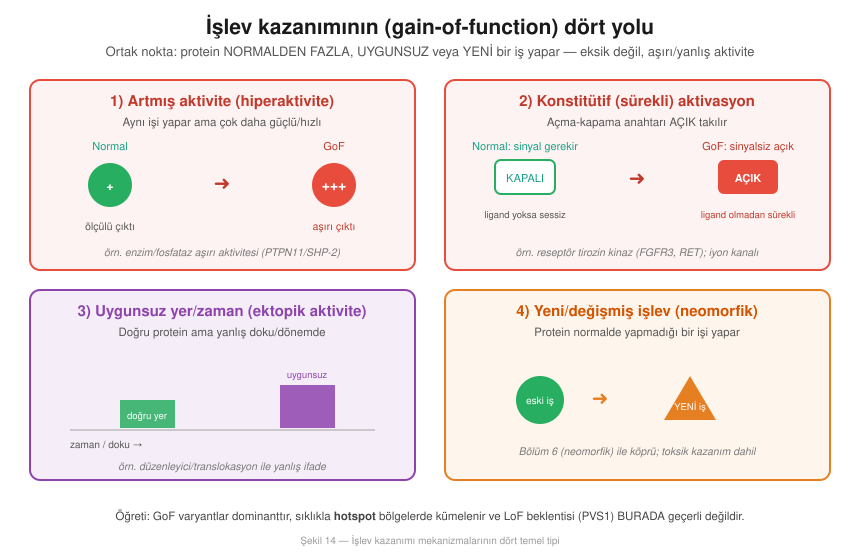
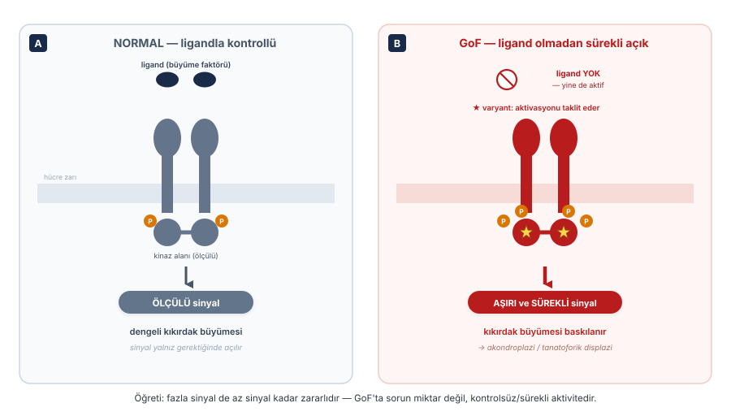
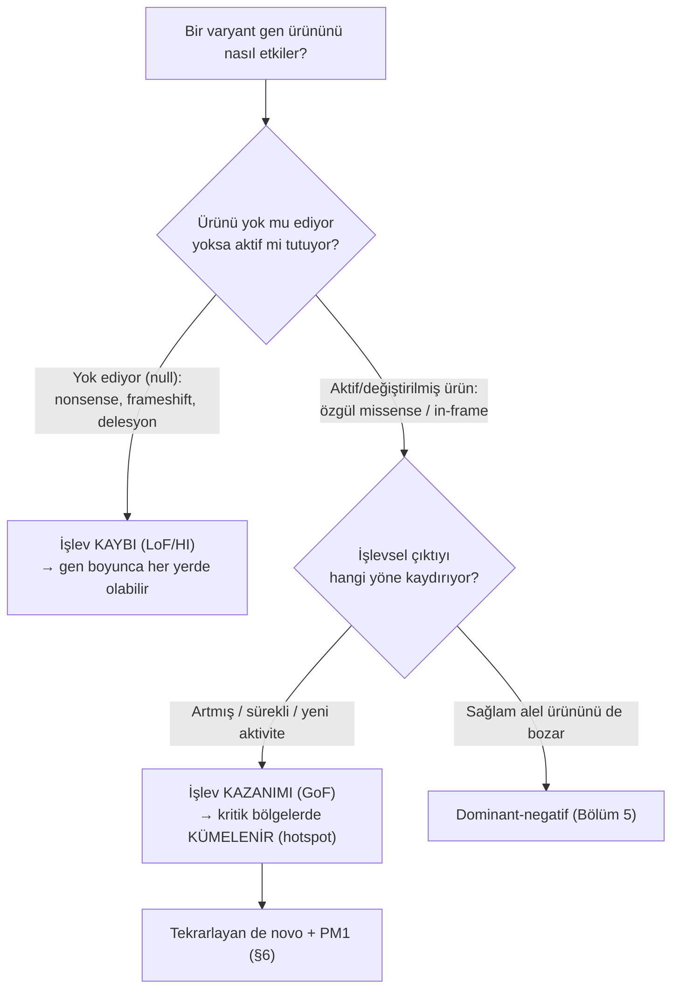
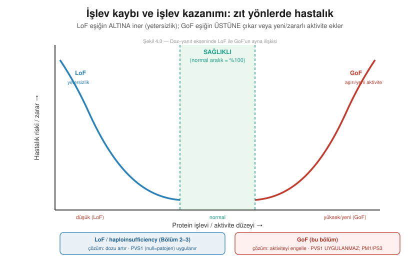
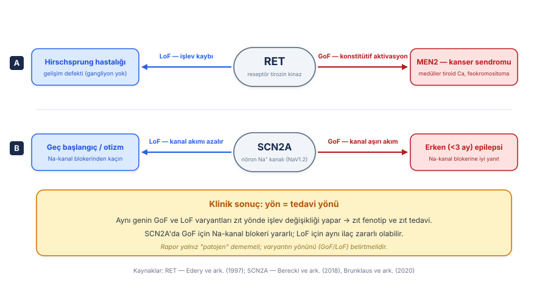
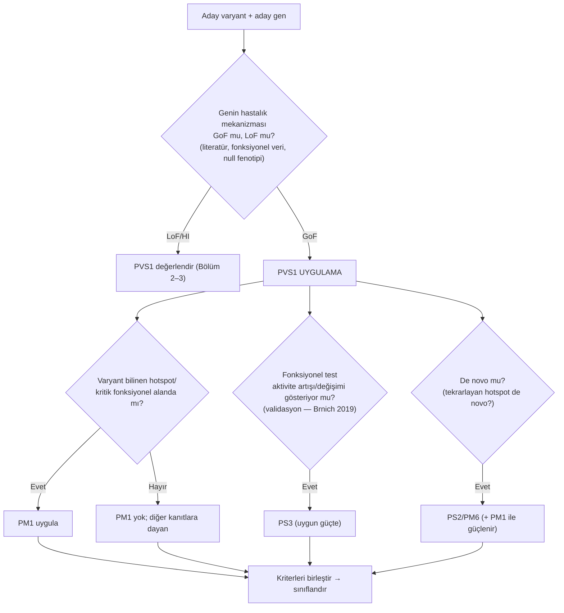
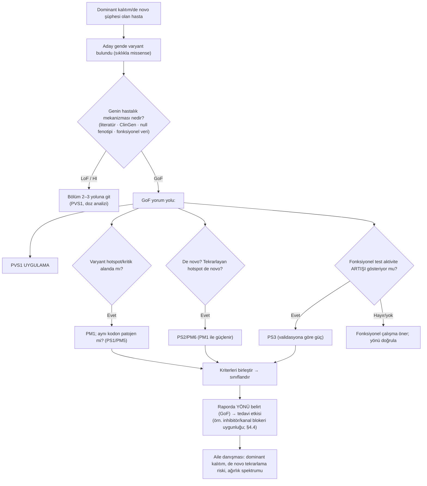

# Bölüm 4 — Gain-of-Function (İşlev Kazanımı)

> **Bölümün çekirdek tezi:** Gain-of-function (GoF, "işlev kazanımı"), bir varyantın gen ürününe **eksiltmek yerine fazlalık** katmasıdır: protein normalden daha aktif, yanlış zamanda/yerde aktif, sürekli (konstitütif) açık ya da tamamen yeni/zararlı bir iş yapar hâle gelir. Bölüm 2–3'te işlediğimiz işlev kaybının (LoF/haploinsufficiency) tam **ayna görüntüsüdür**: orada sorun "yeterince yok"tu, burada sorun "fazlası/yanlışı var". Tek bir patojen alelin ürünü kendi başına zarar verdiği için GoF tipik olarak **dominanttır** ve bu, bölümün en kritik klinik sonucunu doğurur: GoF mekanizmalı bir gende **işlev kaybını patojenite kanıtı sayan kurallar (PVS1) uygulanamaz**, çünkü hastalığı yapan null değil, *aşırı/yeni* aktivitedir. Bu bölüm GoF'u doz–yanıt ekseninde LoF'un karşısına koyar; oradan dominant kalıtıma, **hotspot (sıcak nokta)** kümelenmesine, "aynı gen → zıt yön → zıt tedavi" olgusuna ve ACMG/ClinGen'in fonksiyonel kanıt (PS3) ile hotspot (PM1) kriterlerine bağlar.

> **Bu bölüm nasıl okunmalı?** Tıp öğrencisi için omurga şudur: *bir varyant her zaman bir şeyi "bozmaz" — bazen bir şeyi "fazla yaptırır".* Bu ayrımı Şekil 4.3 (LoF vs GoF doz–yanıt) ve Şekil 4.4 (aynı gen, iki yön) üzerinden kurun. Uzman okuyucu §6'da GoF gende PVS1'in neden uygulanmadığına, PM1/PS3'ün rolüne ve §7'deki RET/SCN2A "yön belirler tedaviyi" örneklerine yoğunlaşabilir. Bölüm 2 (LoF) ve Bölüm 3 (haploinsufficiency) önce okunmalıdır; GoF onların kavramsal zıttıdır. Bölüm 5 (dominant-negatif) ve Bölüm 6 (neomorfik) bu bölümün doğrudan devamıdır.

> 🖼️ **Görseller hakkında not:** Şekiller `assets/` klasöründe SVG, akış diyagramları Mermaid olarak gömülüdür.

---

## Öğrenme hedefleri

Bu bölümü tamamlayan okuyucu:
1. Gain-of-function'ı işlev kaybının ayna görüntüsü olarak tanımlayabilir ve neden tipik olarak **dominant** kalıtıma yol açtığını açıklayabilir.
2. GoF'un dört temel alt-tipini (artmış aktivite, konstitütif/sürekli aktivasyon, ektopik/uygunsuz aktivite, yeni "neomorfik" işlev) örnekleyerek ayırt edebilir.
3. GoF varyantlarının neden genelde **missense ve in-frame** olduğunu ve gen boyunca rastgele dağılmak yerine **hotspot** bölgelerde kümelendiğini gerekçelendirebilir.
4. Doz–yanıt eğrisinde GoF ile LoF'un zıt yönlerde hastalık ürettiğini ve bunun tedavi (aktiviteyi artır vs engelle) için anlamını açıklayabilir.
5. "Aynı gen → farklı varyant yönü → farklı hastalık/tedavi" olgusunu RET (MEN2 vs Hirschsprung) ve SCN2A (erken epilepsi vs geç/OSB) örnekleriyle çözümleyebilir.
6. GoF mekanizmalı bir gende neden **PVS1 uygulanmadığını**, buna karşılık **PM1 (hotspot)**, **PS3 (fonksiyonel kanıt)** ve **PS2 (de novo)** kriterlerinin öne çıktığını açıklayabilir.
7. GoF'u tanıda neden öncelikle **dizilemenin (WES/WGS)** yakaladığını, doz/CNV testlerinin (kopya kazancı dışında) sınırlı kaldığını açıklayabilir.
8. Pediatrik genetikten somut GoF örneklerini (FGFR3/akondroplazi, PTPN11/Noonan, RET/MEN2, SCN2A/epilepsi) mekanizma–fenotip–test–yorum zinciriyle ilişkilendirebilir.

---

## 1. Kavramsal tanım

İşlev kazanımını anlamanın en doğrudan yolu, onu önceki iki bölümün tersi olarak konumlandırmaktır. Bölüm 2–3'te varyantların gen ürününü **azalttığı** durumları (bir alelin susması, %50 doz, yetersizlik) inceledik. Gain-of-function bunun **karşıtıdır**: varyant, ürünü ortadan kaldırmak yerine ona bir şey **ekler** — daha çok aktivite, daha uzun süreli aktivite, yanlış yerde aktivite veya bambaşka bir aktivite. Sezgisel bir benzetmeyle: LoF, bir lambanın ampulünün patlaması (ışık yok); GoF ise lamba düğmesinin **açık konumda kırılıp takılı kalması** (ışık hiç sönmüyor) ya da lambanın aniden ısıtıcı gibi davranmaya başlamasıdır (yeni, beklenmedik iş). Her iki arıza da sistemi bozar, ama tamamen farklı yollarla ve farklı çözümlerle.

Buradaki kritik kavramsal nokta şudur: GoF bir **varyantın net etkisidir**, bir varyant tipi değil. "Missense varyant" demek bir şey söylemez; o missense varyant proteini destabilize edip **işlev kaybına** (Bölüm 2) yol açabileceği gibi, proteini sürekli aktif hâle getirip **işlev kazanımına** da yol açabilir. Belirleyici olan, varyantın gen ürününün **işlevsel çıktısını hangi yöne** kaydırdığıdır. Bu yüzden bir varyantı yorumlarken sorulacak soru "bu varyant proteini bozar mı?" değil, "bu varyant proteinin işlevini **artırır mı, azaltır mı, değiştirir mi**?" olmalıdır.

GoF'un en önemli klinik imzası **dominant kalıtımdır** ve bunun mantığı doğrudandır: eğer tek bir patojen alelin ürettiği protein kendi başına zararlı bir iş yapıyorsa, ikinci (sağlam) alelin varlığı bu zararı engelleyemez — sağlam alel "fazla/yanlış aktiviteyi" geri alamaz. Bu yüzden heterozigot birey hastadır. Bunu Bölüm 3'teki haploinsufficiency ile yan yana koymak öğreticidir: her ikisi de dominanttır, ama haploinsufficiency'de dominanlığın nedeni *yetersizlik* (kalan tek kopya yetmez), GoF'ta ise *zararlı fazlalık* (bir kopyanın ürünü aktif olarak zarar verir). Wilkie (1994), dominant varyantların moleküler temellerini sınıflandıran klasik çerçevesinde tam olarak bu ayrımı yapar ve "artmış/konstitütif protein aktivitesi", "ektopik ifade" ve "yeni protein işlevi"ni dominanlığın ayrı mekanizmaları olarak listeler (Wilkie, 1994, *J Med Genet*; [DOI](https://doi.org/10.1136/jmg.31.2.89)).

Aşağıdaki tablo, bölüm boyunca akış içinde derinleştireceğimiz kavramları bir arada görmek içindir; her biri ilerideki paragraflarda benzetme ve klinik notla açılacaktır.

**Tablo 4.1 — İşlev kazanımının temel kavramları**

| Kavram | Tanım | Klinik anlamı |
|--------|-------|---------------|
| **Gain-of-function (GoF)** | Varyantın ürüne artmış/uygunsuz/yeni aktivite kazandırması | Tipik olarak **dominant** hastalık |
| **Konstitütif aktivasyon** | Sinyal/ligand olmadan sürekli "açık" kalma | Reseptör/kinaz/kanal GoF'unun en sık biçimi |
| **Hiperaktivite** | Aynı işin normalden çok daha güçlü yapılması | Enzim/fosfataz aşırı aktivitesi (örn. SHP-2) |
| **Ektopik / heterokronik aktivite** | Yanlış doku veya yanlış gelişim döneminde aktivite | Düzenleyici/yapısal varyantlarla |
| **Neomorfik işlev** | Ürünün normalde yapmadığı yeni bir iş yapması | Bölüm 6 ile köprü; toksik kazanım dahil |
| **Hotspot (sıcak nokta)** | GoF varyantların gen üzerinde kümelendiği belirli kodon(lar) | PM1 kriterinin temeli; tekrarlayan de novo |
| **Varyantın yönü** | Etkinin artış (GoF) mı azalış (LoF) mı olduğu | Tanıyı **ve** tedaviyi belirler |
| **Tekrarlayan de novo** | Aynı kodonun bağımsız ailelerde yeniden mutasyonu | Güçlü GoF/patojenite ipucu (PS2 + PM1) |

---

## 2. Moleküler mekanizma

### 2.1. İşlev kazanımının dört yolu

Gain-of-function tek bir moleküler olay değil, ortak bir sonuca ("fazla/yanlış aktivite") yakınsayan birkaç farklı mekanizmanın şemsiye adıdır. Bunları dört temel başlıkta toplamak, hem mekanizmayı hem de ileride göreceğimiz varyant tipi–fenotip ilişkisini düzenler (Şekil 4.1).

**Artmış aktivite (hiperaktivite).** En basit GoF biçimidir: protein normalde yaptığı işi yapmaya devam eder, ama çok daha güçlü veya hızlı. Bir enzim katalitik hızını artırır, bir fosfataz/kinaz substratını daha yoğun işler, bir bağlanma daha sıkı hâle gelir. Burada nitelik değil **nicelik** değişir — fazla mesai yapan bir motor gibi. Noonan sendromundaki PTPN11/SHP-2 fosfatazının aşırı aktivitesi bu kategorinin klasik örneğidir (§7.2).

**Konstitütif (sürekli) aktivasyon.** GoF'un belki en sık karşılaşılan biçimidir ve özellikle **anahtar gibi çalışan** proteinlerde görülür: reseptörler, kinazlar, iyon kanalları, G-proteinleri. Normalde bu proteinler bir sinyal (ligand bağlanması, voltaj değişimi) geldiğinde "açılır", sinyal kalkınca "kapanır". GoF varyant, bu anahtarı **açık konumda kilitler**: protein, hiçbir sinyal olmadan sürekli aktif kalır. Bu mekanizma §2.2'de FGFR3 üzerinden ayrıntılandırılacaktır.

**Ektopik / heterokronik (uygunsuz yer–zaman) aktivite.** Burada proteinin kendisi normaldir, ama **yanlış dokuda veya yanlış gelişim döneminde** ifade edilir/aktiftir. Doğru oyuncu, yanlış sahnede. Bu genellikle düzenleyici bölge varyantları, translokasyonlar veya promotör değişiklikleriyle olur (ayrıntı Bölüm 13). Gelişim sırasında bir genin yanlış zamanda açılması, eşik-bağımlı hücre kaderi kararlarını bozabilir.

**Yeni / değişmiş işlev (neomorfik).** En radikal biçimdir: protein artık eski işini değil, **tamamen yeni bir işi** yapar — sağlıklı hücrede hiç olmayan bir aktivite kazanır. Toksik kazanım (örneğin yanlış katlanmış proteinin agregasyonu, anormal bir substrata etki) bu başlığa girer. Neomorfik mekanizma kendi başına o kadar önemlidir ki Bölüm 6'da ayrıca işlenecektir; burada GoF spektrumunun en uç ucu olarak konumlandırıyoruz.

> **🔬 Deep-dive — GoF, LoF ve dominant-negatifi birbirinden nasıl ayırırız?** Üçü de sıklıkla missense varyantlarla ortaya çıkar ve karıştırılabilir, ama net etkileri farklıdır. **LoF**: ürün azalır/işlevsizleşir (eksiklik). **GoF**: ürün artmış/yeni aktivite kazanır (zararlı fazlalık), ve önemlisi *sağlam alelin ürününe ihtiyaç duymadan* tek başına zarar verir. **Dominant-negatif (Bölüm 5)**: varyant ürün *sağlam alelin ürününü de* sabote eder (örneğin onunla kompleks oluşturup zehirler) — yani LoF'un dominant bir alt türüdür ama GoF'tan farklı olarak "yeni/fazla aktivite" değil, "sağlamı bozma" söz konusudur. Pratik ayraç: bir gen delesyonu (tam null) hastalığı *kopyalıyorsa* mekanizma LoF/haploinsufficiency'dir; delesyon **sağlıklıysa veya farklı/daha hafif fenotip yapıyorsa**, hastalık büyük olasılıkla GoF veya dominant-negatiftir (çünkü hastalık "yokluktan" değil, "varyant ürünün varlığından" doğar). Bu test, mekanizma çıkarımının en güçlü araçlarından biridir.

### 2.2. Konstitütif aktivasyon: bir reseptörün "açık" takılması

Konstitütif aktivasyonu somutlaştırmak için reseptör tirozin kinazları (RTK) ele almak öğreticidir, çünkü bunlar GoF'un en iyi karakterize edilmiş örneklerini sunar. Normal bir RTK, hücre zarında oturur; dış ortamdan bir **ligand** (büyüme faktörü) gelip bağlanınca iki reseptör eşleşir (dimerleşir), iç kısımdaki kinaz alanları birbirini fosforilleyerek aktifleşir ve hücre içine kontrollü bir büyüme/farklılaşma sinyali gönderir. Sinyal, ligand varlığına bağlıdır — yani **gerektiğinde, geçici olarak** açılır (Şekil 4.2, sol).

GoF varyant bu kontrolü bozar. FGFR3 (fibroblast büyüme faktörü reseptörü 3) bunun ders kitabı örneğidir. FGFR3'ün kinaz alanındaki belirli varyantlar (örneğin tanatoforik displazi tip II'deki Lys650Glu), reseptörü **ligand olmadan sürekli aktif** hâle getirir. Webster ve Donoghue (1996), bu aktivasyon-halkası varyantının FGFR3 kinaz aktivitesini yabanıl tipin yaklaşık **100 katına** çıkardığını ve bunun ligand bağlanmasıyla normalde tetiklenen konformasyon değişikliğini taklit ettiğini doğrudan göstermiştir (Webster &amp; Donoghue, 1996, *Mol Cell Biol*; [DOI](https://doi.org/10.1128/MCB.16.8.4081)). Bu, GoF'un soyut bir kavram değil, deneyde **ölçülebilen aşırı aktivite** olduğunu kanıtlar.

Aktivasyonun fenotipe dönüşmesi de öğreticidir. FGFR3 sinyali, kıkırdak büyüme plağındaki kondrositlerin çoğalmasını **frenler**; yani fizyolojik olarak bir "dur" sinyalidir. Sürekli aktif FGFR3, bu freni sonuna kadar basılı tutar: kondrositler erken farklılaşıp döngüden çıkar (STAT1 ve p21 gibi aracılar artar), uzun kemiklerin büyümesi baskılanır ve sonuçta **akondroplazi** (en sık iskelet displazisi) veya daha ağır biçimlerinde tanatoforik displazi ortaya çıkar. Burada kritik kavram, sinyalin **fazlasının da azı kadar zararlı** olmasıdır — fizyolojik bir frenin sürekli basılı kalması, hiç olmaması kadar patolojiktir.

> **🔬 Deep-dive — Neden GoF varyantlar belirli kodonlarda (hotspot) kümelenir?** İşlev kaybı gen boyunca *herhangi bir yerde* oluşabilir; bir proteini bozmanın binlerce yolu vardır (her nonsense, her frameshift, çoğu kanonik splice varyantı işe yarar — Bölüm 2). Oysa işlev *kazandırmak* çok daha kısıtlı bir iştir: proteini "sürekli açık" veya "aşırı aktif" yapan değişiklikler, yalnızca işlevsel açıdan kritik birkaç bölgede (aktivasyon halkası, otoinhibisyon arayüzü, kanal kapısı, dimerleşme yüzeyi) gerçekleşebilir. Bu yüzden GoF varyantları sıklıkla **aynı kodon(lar)da tekrar tekrar** belirir — bunlara hotspot (sıcak nokta) denir. FGFR3 Gly380Arg (akondroplazi), PTPN11'in N-SH2/fosfataz arayüzü, SCN2A Arg1882 bunun örnekleridir. Bu kümelenmenin iki büyük sonucu vardır: (1) aynı varyant bağımsız ailelerde **tekrarlayan de novo** olarak görülür, (2) varyant yorumunda **PM1 (mutasyonel hotspot)** kriterinin uygulanabilmesini sağlar (§6).

### 2.3. Farklı varyantlar, ortak son yol: "fazla/yanlış aktivite"

Tıpkı haploinsufficiency'de farklı varyant tiplerinin "tek alel sustu" sonucuna yakınsaması gibi, GoF'ta da farklı moleküler değişiklikler "ürün fazla/yanlış aktif" sonucuna yakınsar — ama önemli bir farkla. Haploinsufficiency'de neredeyse her türlü inaktive edici varyant işe yarardı; GoF'ta ise yalnızca **çok özgül** değişiklikler işe yarar. Bir missense, proteini sürekli aktif konformasyona kilitleyebilir; nadir bir in-frame küçük delesyon/insersiyon otoinhibitör bir alanı kaldırabilir; bir gen **duplikasyonu** (kopya kazancı) basitçe doz artırarak GoF benzeri etki yaratabilir (triplosensitivity, Bölüm 3); ve düzenleyici/translokasyon varyantları ektopik ifadeyle GoF üretebilir (Bölüm 13). Hücre açısından sonuç hepsinde aynıdır: zararlı bir fazlalık veya yenilik.

Bu yakınsamanın tanısal sonucu şudur: GoF varyantların büyük çoğunluğu **küçük, dizi düzeyinde değişikliklerdir** (özellikle missense) ve bu nedenle başlıca **dizileme (WES/WGS)** ile yakalanır. Bunun istisnası, doz artışıyla GoF etkisi yapan duplikasyonlardır (kopya sayısı testleri gerekir). Bu, GoF'u haploinsufficiency'den tanısal olarak ayıran önemli bir noktadır (§5).

---

## 3. Varyant tipleri

Aşağıdaki tablo, GoF'a yol açabilen varyant tiplerini ve her birinin ürüne "fazla/yanlış aktiviteyi nasıl kazandırdığını" özetler. Dikkat edilecek nokta, bu listenin Bölüm 2–3'teki LoF/HI tablolarının neredeyse **tersi** olmasıdır: orada baskın aktör nonsense/frameshift/delesyon iken, burada baskın aktör **missense** ve nadir **in-frame** değişiklikler ile **duplikasyonlardır**; nonsense/frameshift ise GoF için tipik olarak *beklenmez* (çünkü onlar ürünü yok eder, GoF için aktif ürün gerekir).

> **🔬 Deep-dive — Kuralın istisnası: kesici varyantın işlev kazandırdığı durumlar.** "Kesici varyant = işlev kaybı" denklemi güçlü bir varsayılan kuraldır, ama **mutlak değildir** ve bu istisnayı bilmemek klinikte gerçek hatalara yol açar. İstisnanın koşulu Bölüm 2'de öğrendiğimiz NMD kuralında gizlidir: erken sonlanma kodonu **son ekzonda** veya sondan bir önceki ekzonun son 50 nükleotidinde yer alırsa transkript yıkılmaz, **kısalmış ama var olan bir protein üretilir** (Abou Tayoun ve ark., 2018). Üretilen bu protein zararsız olmak zorunda değildir; NMD'den kaçan transkriptlerin ürünleri hücre için toksik olabilir ve **dominant-negatif ya da işlev kazanımı** etkisi gösterebilir (Khajavi ve ark., 2006).
>
> Bunun en öğretici klinik örneği **Hajdu-Cheney sendromudur.** Hastalarda *NOTCH2*'nin **son ekzonundaki (ekzon 34)** kesici varyantlar bulunur; bu varyantlar proteinin C-ucundaki **PEST alanını** — yani proteinin yıkım sinyalini taşıyan bölgeyi — ortadan kaldırır. Yıkım sinyalini kaybeden NOTCH2, hücrede **kararlı hâlde birikir** ve NOTCH sinyalini artırır; sonuç bir işlev kaybı değil, **işlev kazanımıdır** (Canalis &amp; Zanotti, 2014). Bu mekanizmanın moleküler kanıtı, hasta serilerinde tüm varyantların son ekzonda toplanması ve hepsinin PEST kaybına yol açmasıyla gösterilmiştir; yazarlar bunu doğrudan "aktive edici varyantlar" olarak yorumlar (Zhao ve ark., 2013). Klinik tablo — akroosteoliz, ağır osteoporoz, kraniofasiyal bulgular, wormian kemikler, böbrek kistleri — basit bir haploinsufficiency ile açıklanamaz.
>
> **Pratik sonuç:** Bir gende kesici varyantların **yalnızca son ekzonda kümelendiğini** görüyorsanız, bu bir rastlantı değil **mekanizma ipucudur**. O gende PVS1'i refleks olarak uygulamadan önce sorulması gereken soru şudur: "Bu kesilme geni susturuyor mu, yoksa proteini **denetimsiz mi bırakıyor**?" Cevap ikincisiyse mekanizma GoF'tur ve kanıt çerçevesi tümüyle değişir (Bölüm 16).

**Tablo 4.2 — Varyant tipleri ve ürüne işlev kazandırma yolları**

| Varyant tipi | Ürüne nasıl GoF kazandırır? | Tanısal yakalama | Notlar / ilgili bölüm |
|--------------|------------------------------|------------------|------------------------|
| **Missense (hotspot)** | Sürekli aktif konformasyon / artmış aktivite | Dizileme (WES/WGS) | GoF'un en sık tipi; PM1 + PS3 (§6) |
| **In-frame küçük del/ins** | Otoinhibitör alanın kaybı → aktivasyon | Dizileme | Çerçeveyi korur; nadir ama önemli |
| **Belirli splice (in-frame ekzon atlama)** | İnhibitör ekzonun atlanması → aktif izoform | Dizileme + RNA | Çerçeve korunursa GoF olabilir (Bölüm 7) |
| **Gen/segment duplikasyonu (kopya kazancı)** | Doz artışı → aşırı ürün (triplosensitivity) | **Array / MLPA / WGS-CNV** | PMP22/CMT1A tipi; Bölüm 3, 8 |
| **Düzenleyici / promotör varyantı** | Aşırı veya ektopik ifade | WGS / hedefli; çoğu kaçar | Noncoding GoF (Bölüm 13) |
| **Translokasyon / füzyon** | Konstitütif aktif füzyon proteini / ektopik ifade | Karyotip / WGS / RNA-füzyon | Özellikle somatik onkolojide; Bölüm 8 |
| **Nonsense / frameshift** | *Genelde GoF yapmaz* (ürünü yok eder) | — | İstisna: NMD'den kaçan, kısalmış toksik ürün (DN'ye yakın, Bölüm 5) |

> **🧠 Hatırlatıcı:** GoF'ta varyant tipini değil, **"ürün ne yapıyor?"** sorusunu sorun. Cevap "fazla/sürekli/yeni aktivite" ise ve özellikle varyant bir **hotspot missense** ise GoF'u ciddi düşünün. Tam gen delesyonunun (null) hastalığı kopyalayıp kopyalamadığı, mekanizmayı LoF'tan ayırmanın en pratik testidir (§2.1 deep-dive).

---

## 4. Klinik fenotipe dönüşüm — bölümün anahtar soruları

### 4.1. Gain-of-function neden dominanttır?

Cevap, varyant ürünün **kendi başına zarar veriyor** olmasından çıkar: sürekli aktif bir reseptör, aşırı aktif bir enzim veya yeni/toksik bir protein, ikinci (sağlam) alelin varlığına rağmen zararını sürdürür. Sağlam alel "fazla aktiviteyi geri alamaz" — bu yüzden tek patojen alel hastalık için yeterlidir ve kalıtım **dominanttır** (ya de novo, ya otozomal dominant). Bunu Bölüm 3'teki haploinsufficiency ile karşılaştırmak öğreticidir: her ikisi de dominanttır, ama haploinsufficiency'de dominanlık **yetersizlikten** (kalan kopya yetmez), GoF'ta **zararlı varlıktan** (varyant ürün aktif kötülük yapar) doğar. Bu fark soyut değildir: tedavi stratejisini belirler (§4.4).

### 4.2. GoF varyantları neden missense ve hotspot ağırlıklıdır?

**Algoritma 4.1 — Bir varyant gen ürününü nasıl etkiler?**

Bu ağacın dersi: GoF'un missense/hotspot ağırlığı tesadüf değil, **mekanizmanın doğal sonucudur**. Bir proteini bozmanın sayısız yolu vardır (LoF gen boyunca dağılır), ama bir proteini "sürekli açık" veya "aşırı aktif" yapmak yalnızca birkaç kritik kodonda mümkündür (GoF kümelenir). Bu yüzden bir hastada **belirli bir kodonda tekrarlayan, de novo, missense** bir varyant görmek, GoF mekanizmasının güçlü bir habercisidir.

### 4.3. GoF fenotipleri neden sıklıkla doğuştan ve "fazlalık" temalıdır?

GoF mekanizmalı genlerin büyük kısmı büyüme/sinyal yolaklarında (RTK'lar, RAS-MAPK, iyon kanalları) görev aldığından, fenotipler sıklıkla **aşırı sinyalin** sonuçlarını yansıtır: aşırı veya düzensiz büyüme, kanser yatkınlığı (kontrolsüz proliferasyon), aşırı nöronal uyarılabilirlik (epilepsi), veya gelişim programının erken/yanlış tetiklenmesiyle yapısal anomaliler. RAS-MAPK yolağının GoF'la sürekli uyarıldığı "RASopati"ler (Noonan ve ilişkili sendromlar) bu temanın iyi bir örneğidir: yüz dismorfisi, kalp defektleri, büyüme sorunları ve değişen kanser riski bir arada görülür. Önemli bir nüans: aşırı sinyal bir "dur" sinyalini abartıyorsa fenotip *büyüme baskılanması* yönünde olur. Akondroplazi bunun ders kitabı örneğidir ve sık yanlış anlaşılır: **FGFR3'teki işlev kazanımı varyantı büyümeyi artırmaz.** *FGFR3*, normalde kemik uzamasını **frenleyen** bir sinyaldir; varyant bu freni güçlendirerek büyüme plağı kondrositlerinin **proliferasyonunu ve hipertrofik farklılaşmasını baskılar** — sonuç, uzun kemik büyümesinin azalmasıdır. Yani "fazla sinyal" her zaman "fazla büyüme" demek değildir; belirleyici olan **hangi yolakta** fazlalık olduğu ve **o yolağın normalde ne yaptığıdır**.

### 4.4. Neden GoF'ta "yön" tedaviyi belirler?

GoF'un en pratik klinik sonucu burada ortaya çıkar. LoF'ta tedavi mantığı "eksiği tamamla" (replasman, gen tedavisi, okuma-geçişi) iken, GoF'ta mantık tam tersidir: **aşırı/yeni aktiviteyi engelle**. Sürekli aktif bir kinazı küçük molekül inhibitörüyle bloke etmek, aşırı uyarılan bir iyon kanalını kanal blokeriyle baskılamak GoF için akılcı stratejilerdir. Bu nedenle bir varyantın yalnızca "patojen" olduğunu söylemek yetmez; **GoF mu LoF mu olduğu** raporlanmalıdır, çünkü aynı ilaç bir yönde kurtarıcı, diğer yönde zararlı olabilir. Bunun en çarpıcı örneği SCN2A'dır: GoF varyantlı erken epilepside sodyum kanal blokerleri yararlıdır; oysa LoF varyantlı tabloda **aynı ilaçlar durumu kötüleştirebilir**, çünkü zaten yetersiz olan kanal akımını daha da azaltırlar (Brunklaus ve ark., 2020, *Epilepsia*; [DOI](https://doi.org/10.1111/epi.16438)).

### 4.5. Aynı gen, zıt yönler: GoF ve LoF neden farklı hastalık yapar?

Doz–yanıt ekseni bu olguyu zarif biçimde açıklar (Şekil 4.3): sağlıklı işlev bir orta banttayken, eksiğe doğru kayma (LoF) bir hastalığı, fazlaya/yeniye doğru kayma (GoF) **başka bir hastalığı** üretir. Aynı genin iki yönü, iki ayrı klinik tabloya karşılık gelir.

RET bunun klasik örneğidir: aynı gende konstitütif aktivasyon yapan GoF varyantları **MEN2** (multipl endokrin neoplazi tip 2 — bir kanser sendromu) yaparken, işlev kaybı yapan LoF varyantları **Hirschsprung hastalığı** (enterik sinir sisteminin gelişim defekti) yapar (Edery ve ark., 1997, *BioEssays*; [DOI](https://doi.org/10.1002/bies.950190506)). Aynı reseptörün "iki yüzü": fazlası kanser, eksiği gelişim defekti. SCN2A ise hem yönü hem **tedaviyi** birlikte gösterir. Gelişimsel ve epileptik ensefalopatinin en sık iki tekrarlayan SCN2A varyantı, başlangıç yaşı ve nöbet tipi bakımından birbirinden ayrılır: Arg1882Gln **yaşamın ilk gününde** fokal nöbetlerle başlar, Arg853Gln ise baskın olarak infantil spazmlarla ve **ortanca 8 aylık** yaşta ortaya çıkar. Voltaj-clamp ve dinamik aksiyon potansiyeli clamp çalışmaları bu iki varyantın elektrofizyolojik olarak zıt yönde olduğunu — Arg1882Gln'de işlev kazanımı ve ateşlemede belirgin artış, Arg853Gln'de işlev kaybı ve ateşlemede belirgin azalma — doğrudan göstermiştir (Berecki ve ark., 2018, *PNAS*; [DOI](https://doi.org/10.1073/pnas.1800077115)). SCN2A işlev kaybının daha geniş nörogelişimsel ucu (otizm spektrum bozukluğu ve entelektüel yetersizlik) ise ayrı bir literatüre dayanır (Sanders ve ark., 2018, *Trends Neurosci*; [DOI](https://doi.org/10.1016/j.tins.2018.03.011)).

---

## 5. Tanısal testlerle ilişkisi

GoF'un tanısal "imzası", §2.3'te gördüğümüz gibi, hastalığa yol açan varyantların büyük çoğunlukla **küçük, dizi düzeyinde değişiklikler** (özellikle missense) olmasıdır. Bu, GoF'u haploinsufficiency'den ayırır: orada doz/CNV testleri (delesyon araması) merkezîydi; burada merkez **dizilemededir**. İstisna, doz artışıyla GoF benzeri etki yapan duplikasyonlardır. Aşağıdaki tablo her yöntemin GoF'u yakalama gücünü ve sınırını gösterir.

**Tablo 4.3 — İşlev kazanımı mekanizmasını hangi test yakalar?**

| Test | Bu mekanizmayı yakalar mı? | Sınırlılığı |
|------|----------------------------|-------------|
| **WES** | ✅ GoF missense ve in-frame varyantların çoğu (GoF'un ana tanı yöntemi) | Düzenleyici/derin intronik GoF'u ve bazı kopya kazançlarını kaçırır |
| **Short-read WGS** | ✅ Missense/in-frame + birçok duplikasyon (kopya kazancı) + bazı düzenleyici | Karmaşık SV/füzyon bölgelerinde sınırlı |
| **Long-read WGS** | ✅ Missense + füzyon/translokasyon ile oluşan GoF + faz | Maliyet/erişim; standardizasyon gelişmekte |
| **Array-CGH / SNP array** | ⚠️ Yalnız **kopya kazancı (duplikasyon)** GoF'unu yakalar | Missense/nokta GoF'u (GoF'un çoğu) göremez |
| **MLPA** | ⚠️ Hedef gende **duplikasyon** (doz artışı GoF'u) | Yalnız hedef lokus; nokta varyantı vermez |
| **RNA-seq** | ✅ Füzyon transkriptleri, ektopik/aşırı ifade, in-frame splice GoF'u gösterir | İlgili dokuda ekspresyon ve uygun örnek gerekir |
| **Fonksiyonel test** (*in vitro*) | ✅ Aktivite artışını **doğrudan** ölçer (PS3'ün temeli) | Standardizasyon/validasyon gerekir (Brnich ve ark., 2019) |
| **Karyotip** | ⚠️ Yalnız büyük duplikasyon/translokasyon | Çözünürlük düşük; nokta GoF'u kaçırır |

> **Bu mekanizmayı hangi test yakalar? (özet):** GoF'un büyük çoğunluğu **dizileme (WES/WGS)** ile yakalanan missense/in-frame varyantlardır; haploinsufficiency'nin tersine burada **doz/delesyon analizi merkezî değildir** — istisna, GoF benzeri etki yapan **duplikasyonlar** (array/MLPA/WGS-CNV) ve füzyon/ektopik ifade (RNA-seq) durumlarıdır. Varyantın *yönünü* (GoF mu LoF mu) ayırt etmek için sıklıkla **fonksiyonel test** gerekir; bu, hem tanı hem tedavi için kritiktir (§4.4).

---

## 6. Varyant yorumlama açısından önemi (ACMG/ClinGen)

Gain-of-function, ACMG/AMP varyant yorumlamasında **özel bir dikkat** gerektirir, çünkü çerçevenin en güçlü kriterlerinden biri olan PVS1 burada **uygulanamaz** ve yerini başka kriterler alır.

**PVS1 neden uygulanmaz?** PVS1 (çok güçlü patojenik), "öngörülen işlev kaybı (null) varyantı, o gen için bilinen hastalık mekanizması işlev kaybı olduğunda" uygulanır (Richards ve ark., 2015, *Genet Med*; [DOI](https://doi.org/10.1038/gim.2015.30); Bölüm 2 §6, Bölüm 3 §6). GoF mekanizmalı bir gende ise hastalığı yapan **null değil, aşırı/yeni aktivitedir**; bir null varyant (nonsense, tam delesyon) bu genlerde çoğu kez **hastalık yapmaz** (RET-Hirschsprung gibi farklı/zıt bir fenotip yapabilir veya sessiz kalabilir). Dolayısıyla GoF gende bir LoF varyantı görmek patojenite *lehine* değil; mekanizma uyumsuzluğuna işaret eder. Bu, "mekanizmayı bilmeden varyant yorumlanamaz" ilkesinin en net örneğidir.

**GoF gende öne çıkan kriterler.** PVS1'in yerini şu kriterler alır: **PM1** (varyant, iyi tanımlanmış bir mutasyonel **hotspot** ve/veya kritik fonksiyonel alanda yer alıyor — GoF'un kümelenme özelliği bunu sık uygulanır kılar, §2.2); **PS3** (iyi kurulmuş bir **fonksiyonel test** varyantın aktiviteyi artırdığını/değiştirdiğini gösteriyor); **PS2/PM6** (varyant *de novo*, özellikle tekrarlayan de novo hotspot ise güçlü kanıt); **PS1/PM5** (aynı/benzer kodonda daha önce patojen bildirilmiş varyant). ClinGen SVI'nin PS3/BS3 çerçevesi, fonksiyonel kanıtın nasıl değerlendirileceğini standardize eder ve ilk adımının **"hastalık mekanizmasını tanımlamak"** olduğunu vurgular — yani bir testin GoF'u mu yoksa LoF'u mu ölçtüğü, kanıtın yönünü belirler (Brnich ve ark., 2019, *Genome Med*; [DOI](https://doi.org/10.1186/s13073-019-0690-2)).

**Algoritma 4.2 — İşlev kazanımı şüphesinde kanıt ve kriter seçimi**

> **🟦 Klinikte dikkat — GoF gende null varyantı yanlış yorumlama:** Bir GoF gende nonsense/frameshift/tam delesyon bulduğunuzda, refleks olarak "PVS1, patojen" demeyin. Mekanizma GoF ise bu null varyant hastalığın **nedeni olmayabilir** (hatta farklı bir fenotip yapabilir). Önce "bu genin hastalık mekanizması nedir?" sorusunu yanıtlayın; ClinGen gen-hastalık geçerliliği ve literatür bu adımın temelidir.

> **🟦 Klinikte dikkat — fonksiyonel testin yönü:** PS3 uygularken testin neyi ölçtüğüne dikkat edin. "Anormal işlev" yeterli değil; GoF gende kanıt **aktivite artışını/kazanımını** göstermeli. Aktivite *azalması* gösteren bir test, GoF hipotezini desteklemez — tersine onu zayıflatır (Brnich ve ark., 2019; [DOI](https://doi.org/10.1186/s13073-019-0690-2)).

---

## 7. Pediatrik genetikten klinik örnekler

### 7.1. FGFR3 — akondroplazi: konstitütif aktivasyonun prototipi
Akondroplazi, en sık iskelet displazisidir ve neredeyse tamamı FGFR3 genindeki tek bir tekrarlayan **hotspot** varyantından (Gly380Arg) kaynaklanır. Bu, GoF'un birçok özelliğini bir arada gösterir: tek bir kodonda kümelenme, yüksek de novo oranı (sıklıkla baba yaşı etkisiyle), dominant kalıtım ve konstitütif reseptör aktivasyonu. FGFR3 sinyali büyüme plağı kondrositlerinin çoğalmasını ve hipertrofik farklılaşmasını fizyolojik olarak frenlediğinden, sürekli aktif reseptör bu freni abartır ve uzun kemik büyümesi baskılanır; daha ağır aktivasyon (örn. Lys650Glu) tanatoforik displaziye yol açar — Webster ve Donoghue (1996) bu varyantın kinaz aktivitesini ~100 kat artırdığını göstermiştir ([DOI](https://doi.org/10.1128/MCB.16.8.4081)). *Öğreti:* aynı genin farklı GoF varyantları, aktivasyon şiddetine göre bir **ağırlık spektrumu** (akondroplazi → tanatoforik displazi) oluşturur; ve fenotip "fazla sinyal = fazla büyüme" değil, yolak bağımlıdır (burada fazla sinyal = büyüme *baskılanması*).

### 7.2. PTPN11 — Noonan sendromu: bir fosfatazın hiperaktivitesi
Noonan sendromu (yüz dismorfisi, pulmoner stenoz/hipertrofik kardiyomiyopati, orantılı kısa boy) olgularının yaklaşık yarısı PTPN11 genindeki missense varyantlardan kaynaklanır — geni tanımlayan ilk seride incelenen olguların %50'sinden fazlası bu varyantları taşıyordu. Varyantlar, fosfataz SHP-2'nin N-SH2 ve fosfataz alanlarının **birbiriyle etkileştiği (otoinhibisyonu sağlayan) arayüzde** kümelenir; iki N-SH2 mutantının enerjik yapısal analizi dengenin aktif konformasyon lehine belirgin biçimde kaydığına, yani değişimlerin **gain-of-function** olduğuna işaret etmiştir (Tartaglia ve ark., 2001, *Nat Genet*; [DOI](https://doi.org/10.1038/ng772)). Aşırı SHP-2 aktivitesi RAS-MAPK yolağını fazla uyarır. *Öğreti:* GoF her zaman "sürekli açık reseptör" değildir; burada otoinhibisyonun bozulmasıyla bir enzimin **hiperaktivasyonu** söz konusudur — ve varyantların belirli bir arayüzde kümelenmesi PM1'i uygulanabilir kılar.

### 7.3. RET — MEN2 vs Hirschsprung: bir genin iki yüzü
RET reseptör tirozin kinazı, mekanizma yönünün önemini ders kitabı netliğinde gösterir: **GoF** (konstitütif aktivasyon) varyantları multipl endokrin neoplazi tip 2'ye (medüller tiroid karsinomu, feokromositoma) yol açarken, **LoF** varyantları Hirschsprung hastalığına (kolonun gangliyonsuzluğu) yol açar (Edery ve ark., 1997, *BioEssays*; [DOI](https://doi.org/10.1002/bies.950190506)). *Öğreti:* "RET varyantı" tek başına anlamsızdır; varyantın **yönü** hem hastalığı hem yönetimi belirler (MEN2'de profilaktik tiroidektomi kararı, RET GoF varyantının tipine göre verilir). Bu, GoF/LoF ayrımının soyut değil, doğrudan klinik karar olduğunu gösterir.

### 7.4. SCN2A — yön hem hastalığı hem tedaviyi belirler
SCN2A (nöronal sodyum kanalı NaV1.2) varyantları, GoF/LoF ayrımının **tedaviye** doğrudan yansıdığı en öğretici örnektir. GoF varyantları (örn. Arg1882Gln) kanal akımını artırıp nöronal aşırı uyarılabilirliğe ve yaşamın ilk gününde başlayabilen ağır epilepsiye yol açar; LoF varyantları (örn. Arg853Gln) ise daha geç — ortanca 8 aylık yaşta, ağırlıklı olarak infantil spazmlarla — başlar (Berecki ve ark., 2018, *PNAS*; [DOI](https://doi.org/10.1073/pnas.1800077115)) ve SCN2A işlev kaybı daha geniş biçimde otizm spektrum bozukluğu ile entelektüel yetersizliğin önde gelen nedenlerinden biridir (Sanders ve ark., 2018, *Trends Neurosci*; [DOI](https://doi.org/10.1016/j.tins.2018.03.011)). Klinik sonuç çarpıcıdır: SCN2A/3A/8A'da GoF missense varyantı veya kopya kazancı taşıyan bireyler en sık **erken başlangıçlı** (<3 ay) epilepsiyle gelir ve **sodyum kanal blokerlerine iyi yanıt** verir; bu nedenle erken başlangıçlı olası genetik epilepside bu ilaç sınıfı düşünülmelidir (Brunklaus ve ark., 2020, *Epilepsia*; [DOI](https://doi.org/10.1111/epi.16438)). Buna karşılık işlev kaybı zemininde — özellikle SCN1A/Dravet tablosunda — sodyum kanal blokerlerinin nöbetleri kötüleştirebildiği yerleşik klinik bilgidir; yani aynı ilaç yönüne göre yararlı ya da zararlı olabilir. *Öğreti:* başlangıç yaşı bile mekanizma yönü için ipucu olabilir; ve varyant raporu "patojen" demekle kalmayıp **GoF/LoF yönünü** belirtmelidir.

---

## 8. Sık yapılan hatalar

> **🔴 Sık yapılan hata kutusu**
>
> 1. **GoF gende PVS1 uygulamak.** Hastalığı null değil, aşırı/yeni aktivite yapar; nonsense/delesyon çoğu kez patojen değildir (hatta farklı fenotip).
> 2. **Missense'i otomatik LoF sanmak.** Aynı missense LoF de GoF da yapabilir; belirleyici, işlevsel çıktının **yönüdür**.
> 3. **"Patojen" deyip yön belirtmemek.** GoF/LoF ayrımı tedaviyi değiştirir (SCN2A'da kanal blokeri kararı).
> 4. **GoF'u CNV/delesyon testiyle aramak.** GoF'un çoğu nokta varyantıdır; dizileme gerekir. (İstisna: duplikasyon → kopya kazancı GoF.)
> 5. **Fonksiyonel testin yönünü göz ardı etmek.** PS3 için "anormal işlev" yetmez; GoF'ta **aktivite artışı** gösterilmelidir.
> 6. **Hotspot'u dışlayıcı kanıt sanmak.** Tekrarlayan de novo hotspot, GoF/patojenite *lehine* güçlü kanıttır (PM1+PS2), benignlik değil.
> 7. **"Fazla sinyal = fazla büyüme" varsaymak.** FGFR3'te fazla sinyal büyümeyi *baskılar*; fenotip yolak bağımlıdır.
> 8. **GoF ile dominant-negatifi karıştırmak.** GoF "fazla/yeni aktivite"; dominant-negatif "sağlam alel ürününü bozma"dır (Bölüm 5).

---

## 9. Klinik pratikte karar algoritması

**Algoritma 4.3 — Dominant kalıtım/de novo şüphesinde klinik karar akışı**

---

## 10. Kaynaklar

> **Atıf / doğrulama notu:** Bu bölümün bibliyografik verileri PubMed üzerinden alınmış ve doğrulanmıştır; her kaynağın PMID **ve** DOI'si bu oturumda tek tek teyit edilmiştir. Metin içinde yazar-yıl, kaynakçada DOI-link kullanılmıştır.

1. **Wilkie AOM (1994).** The molecular basis of genetic dominance. *Journal of Medical Genetics* 31(2):89–98. **PMID: 8182727** · DOI: [10.1136/jmg.31.2.89](https://doi.org/10.1136/jmg.31.2.89) — *Landmark/kavramsal: dominant varyant mekanizmalarının (artmış/konstitütif aktivite, ektopik ifade, yeni işlev) sınıflandırması.*
2. **Webster MK, D'Avis PY, Robertson SC, Donoghue DJ (1996).** Profound ligand-independent kinase activation of fibroblast growth factor receptor 3 by the activation loop mutation responsible for a lethal skeletal dysplasia, thanatophoric dysplasia type II. *Molecular and Cellular Biology* 16(8):4081–4087. **PMID: 8754806** · DOI: [10.1128/MCB.16.8.4081](https://doi.org/10.1128/MCB.16.8.4081) — *Mekanizma landmark: FGFR3 konstitütif (ligand-bağımsız) aktivasyonu, ~100 kat aktivite artışı.*
3. **Edery P, Eng C, Munnich A, Lyonnet S (1997).** RET in human development and oncogenesis. *BioEssays* 19(5):389–395. **PMID: 9174404** · DOI: [10.1002/bies.950190506](https://doi.org/10.1002/bies.950190506) — *Mekanizma/klinik: RET'in iki yüzü — GoF (MEN2) vs LoF (Hirschsprung).*
4. **Tartaglia M, Mehler EL, Goldberg R, ve ark. (2001).** Mutations in PTPN11, encoding the protein tyrosine phosphatase SHP-2, cause Noonan syndrome. *Nature Genetics* 29(4):465–468. **PMID: 11704759** · DOI: [10.1038/ng772](https://doi.org/10.1038/ng772) — *Klinik/mekanizma: PTPN11/SHP-2 gain-of-function (hiperaktivasyon), hotspot arayüz; Noonan.*
5. **Berecki G, Howell KB, Deerasooriya YH, ve ark. (2018).** Dynamic action potential clamp predicts functional separation in mild familial and severe de novo forms of *SCN2A* epilepsy. *Proceedings of the National Academy of Sciences USA* 115(24):E5516–E5525. **PMID: 29844171** · DOI: [10.1073/pnas.1800077115](https://doi.org/10.1073/pnas.1800077115) — *Mekanizma/klinik: SCN2A GoF (R1882Q) vs LoF (R853Q) elektrofizyolojik ayrımı.*
6. **Brunklaus A, Du J, Steckler F, ve ark. (2020).** Biological concepts in human sodium channel epilepsies and their relevance in clinical practice. *Epilepsia* 61(3):387–399. **PMID: 32090326** · DOI: [10.1111/epi.16438](https://doi.org/10.1111/epi.16438) — *Klinik: SCN GoF→erken başlangıç + sodyum kanal blokeri yanıtı; yön-tedavi ilişkisi.*
7. **Brnich SE, Abou Tayoun AN, Couch FJ, ve ark. (2019).** Recommendations for application of the functional evidence PS3/BS3 criterion using the ACMG/AMP sequence variant interpretation framework. *Genome Medicine* 12(1):3. **PMID: 31892348** · DOI: [10.1186/s13073-019-0690-2](https://doi.org/10.1186/s13073-019-0690-2) — *Guideline: fonksiyonel kanıt (PS3/BS3) değerlendirmesi; ilk adım "mekanizmayı tanımla".*
8. **Richards S, Aziz N, Bale S, ve ark. (2015).** Standards and guidelines for the interpretation of sequence variants: a joint consensus recommendation of the American College of Medical Genetics and Genomics and the Association for Molecular Pathology. *Genetics in Medicine* 17(5):405–424. **PMID: 25741868** · DOI: [10.1038/gim.2015.30](https://doi.org/10.1038/gim.2015.30) — *Guideline: ACMG/AMP çerçevesi; PVS1'in mekanizma önkoşulu, PM1/PS2/PS3 kriterleri.*
9. **Sanders SJ, Campbell AJ, Cottrell JR, ve ark. (2018).** Progress in Understanding and Treating SCN2A-Mediated Disorders. *Trends in Neurosciences* 41(7):442–456. **PMID: 29691040** · DOI: [10.1016/j.tins.2018.03.011](https://doi.org/10.1016/j.tins.2018.03.011) — *Review: SCN2A işlev kaybının otizm spektrum bozukluğu ve entelektüel yetersizlikle ilişkisi; genotip-fenotip korelasyonu.*
10. **Abou Tayoun AN, Pesaran T, DiStefano MT, ve ark. (2018).** Recommendations for interpreting the loss of function PVS1 ACMG/AMP variant criterion. *Human Mutation* 39(11):1517–1524. **PMID: 30192042** · DOI: [10.1002/humu.23626](https://doi.org/10.1002/humu.23626) — *§3 deep-dive: NMD'nin gerçekleşmediği öngörülen iki konumun (son ekzon ve sondan bir önceki ekzonun son 50 nükleotidi) normatif tanımı — kesici varyantın GoF yapabilmesinin ön koşulu. Kaynak kütüğünden yeniden kullanılmıştır.*
11. **Khajavi M, Inoue K, Lupski JR (2006).** Nonsense-mediated mRNA decay modulates clinical outcome of genetic disease. *European Journal of Human Genetics* 14(10):1074–1081. **PMID: 16757948** · DOI: [10.1038/sj.ejhg.5201649](https://doi.org/10.1038/sj.ejhg.5201649) — *§3 deep-dive: NMD'den kaçan transkriptlerin ürettiği anormal proteinlerin dominant-negatif veya işlev kazanımı etkisiyle hücreye toksik olabilmesi. Kaynak kütüğünden yeniden kullanılmıştır.*
12. **Canalis E, Zanotti S (2014).** Hajdu-Cheney syndrome: a review. *Orphanet Journal of Rare Diseases* 9:200. **PMID: 25491639** · DOI: [10.1186/s13023-014-0200-y](https://doi.org/10.1186/s13023-014-0200-y) — *§3 deep-dive: *NOTCH2* ekzon 34'teki kesici varyantların PEST alanını kaldırarak kararlı bir protein üretmesi ve NOTCH sinyalini artırması — kesici varyantın işlev kazanımı yaptığı klinik örnek.*
13. **Zhao W, Petit E, Gafni RI, ve ark. (2013).** Mutations in NOTCH2 in patients with Hajdu-Cheney syndrome. *Osteoporosis International* 24(8):2275–2281. **PMID: 23389697** · DOI: [10.1007/s00198-013-2298-5](https://doi.org/10.1007/s00198-013-2298-5) — *§3 deep-dive: Dokuz hastanın tamamında son *NOTCH2* ekzonunda kesici varyant; hepsinin PEST (yıkım sinyali) kaybına yol açması ve bunun aktive edici mekanizma olarak yorumlanması.*

> **İkincil/destekleyici kaynak notu:** GeneReviews, OMIM, ClinVar, ClinGen gen-hastalık/dozaj kaynakları ve gnomAD yalnızca destekleyici/ikincil bilgi olarak anılmıştır; ana mekanizma iddiaları yukarıdaki birincil kaynaklara dayanır.

---

## ✅ Bölüm öz-denetim tablosu

**Tablo 4.4 — Bölüm 4 öz-denetim tablosu**

| Kriter | Durum | Not |
|--------|-------|-----|
| Mekanizma doğru anlatıldı mı? | ✅ | Dört GoF tipi, konstitütif aktivasyon, hotspot kümelenmesi, LoF ile ayna ilişkisi |
| Klinik bağlantı kuruldu mu? | ✅ | Dominant kalıtım, "fazlalık" fenotipleri, yön→tedavi, ağırlık spektrumu |
| Varyant tipi ile mekanizma ilişkilendirildi mi? | ✅ | Tablo 3 + §2.3 (missense/in-frame/duplikasyon; nonsense neden beklenmez) |
| Pediatrik örnek verildi mi? | ✅ | FGFR3/akondroplazi, PTPN11/Noonan, RET/MEN2-Hirschsprung, SCN2A (kaynaklı) |
| Test seçimi açıklandı mı? | ✅ | Dizileme merkezî; duplikasyon için CNV; yön için fonksiyonel test |
| ACMG/ClinGen bağlantısı doğru mu? | ✅ | PVS1 uygulanmaz; PM1/PS3/PS2 öne çıkar; Brnich 2019 fonksiyonel kanıt |
| Kaynaklar PMID/DOI ile verildi mi? | ✅ | 13 kaynak; PMID+DOI doğrulandı (Sanders 2018 doğrulama turunda; Abou Tayoun 2018, Khajavi 2006, Canalis 2014, Zhao 2013 uzman turunda eklendi) |
| Spekülatif iddialar işaretlendi mi? | ✅ | Sayısal değerler (~100 kat, <3 ay, ortanca 8 ay) kaynak özetlerinden birebir doğrulandı |
| Kaynak uydurma riski var mı? | ✅ Yok | Tüm kaynaklar PubMed metadata ile karşılaştırıldı |
| Görsel/şema/algoritma desteği yeterli mi? | ✅ | 4 SVG (GoF tipleri, doz-yanıt GoF vs LoF, konstitütif aktivasyon, aynı gen iki yön) + 3 Mermaid (GoF/LoF ayrımı, ACMG yorum, karar algoritması) |

---

### 🔎 Bölüm sonu kaynak doğrulama komutu (zorunlu)
> "Bu bölümdeki her kaynağın **türüne uygun kalıcı kimliğini** kontrol et: hakemli makalede PMID + DOI; kılavuz/uzman panel spesifikasyonunda kurum + sürüm + tarih + kalıcı bağlantı; veri tabanında veri sürümü + sorgu tarihi. Kimliği doğrulanamayan kaynağı çıkar. Kaynağı olmayan spesifik iddiayı 'kaynak doğrulaması gerekli' olarak işaretle. Kitabın kendi pedagojik çerçevesini doğrulamaya çalışma — 🏷️ ile etiketle." *(Politika 01.08.2026 uzman turunda güncellendi: eski 'PMID veya DOI veremediğin kaynağı çıkar' kuralı HGVS, ClinGen/CSpec, gnomAD sürüm notları gibi PMID'siz ama yetkili kaynakları dışlıyordu.)*
>
> **Bu bölüm için durum:** 13/13 kaynak PMID+DOI doğrulandı (Wilkie 1994, Webster &amp; Donoghue 1996, Edery 1997, Tartaglia 2001, Berecki 2018, Brunklaus 2020, Brnich 2019, Richards 2015, Sanders 2018, Abou Tayoun 2018, Khajavi 2006, Canalis &amp; Zanotti 2014, Zhao 2013). Sayısal ifadeler (FGFR3 ~100 kat aktivite artışı; GoF'ta <3 ay başlangıç; SCN2A R853Q'da ortanca 8 ay) ilgili kaynakların özetlerinde birebir doğrulanmıştır ve birey/bağlama göre değişebilir. Bölüm, 27.07.2026 tarihli iddia-düzeyi doğrulama turundan geçmiştir (bkz. `Dogrulama_Kutugu.md`).
>
> **Uzman değerlendirmesi turu (29.07.2026):** *(1)* "Nonsense/frameshift GoF için beklenmez" genellemesi doğru bulunmuş, ancak uzman **istisnanın mutlaka belirtilmesini** istemiştir; §3'e kaynaklı bir deep-dive eklenmiştir — NMD'den kaçan kesici varyantların (son ekzon / son 50 nükleotid kuralı) kararlı ve denetimsiz protein üreterek işlev kazanımı yapabilmesi, klinik örnek olarak *NOTCH2* ekzon 34 kesilmesi ve Hajdu-Cheney sendromu (PEST/yıkım sinyali kaybı → kararlı NOTCH2 → artmış sinyal). *(2)* Akondroplazi anlatımı uzman düzeltmesiyle hassaslaştırılmıştır: FGFR3 işlev kazanımı büyümeyi artırmaz; normalde kemik uzamasını frenleyen sinyali güçlendirerek büyüme plağı kondrositlerinin **proliferasyonunu ve hipertrofik farklılaşmasını** baskılar.
