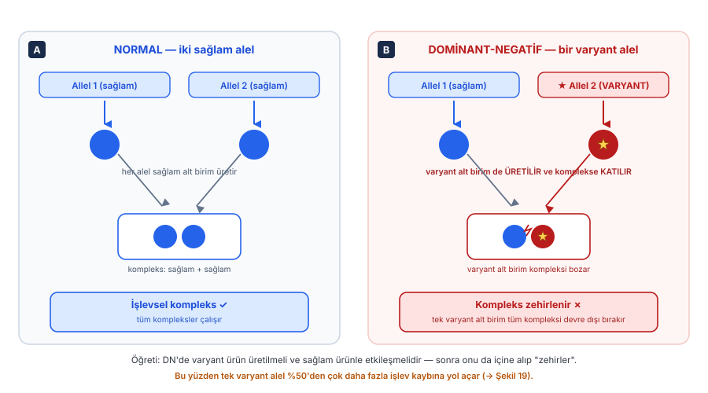
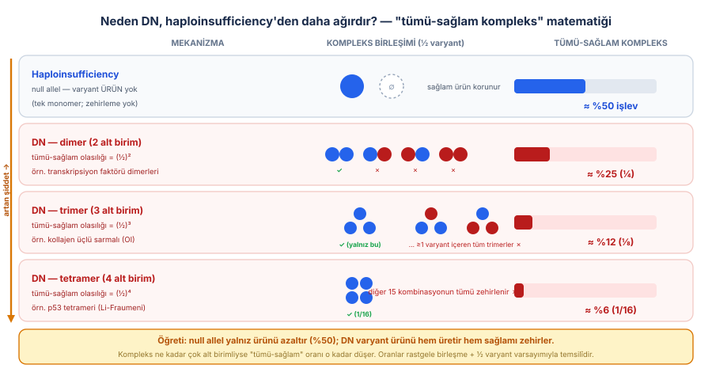
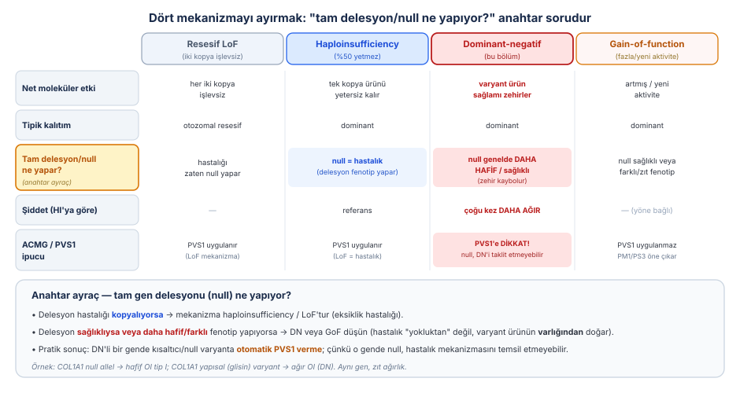
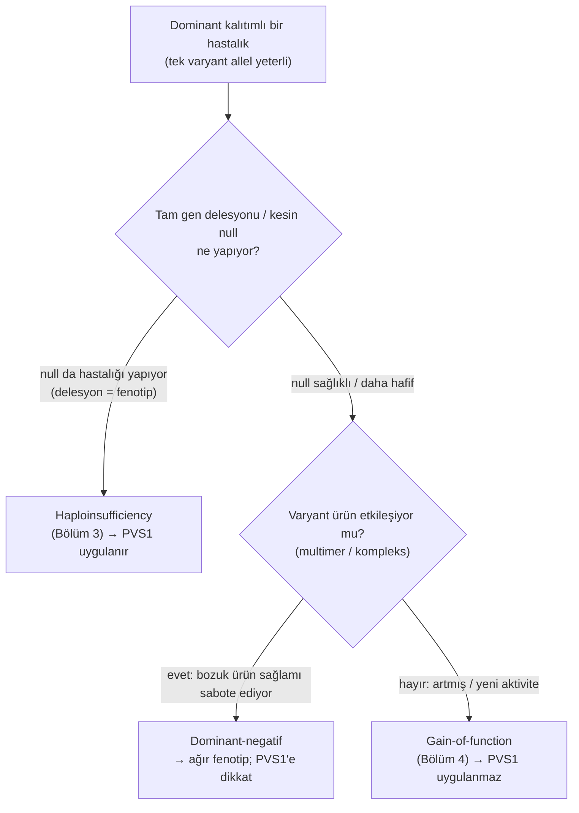
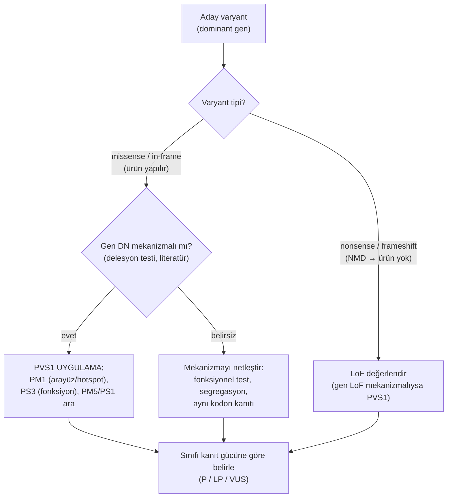
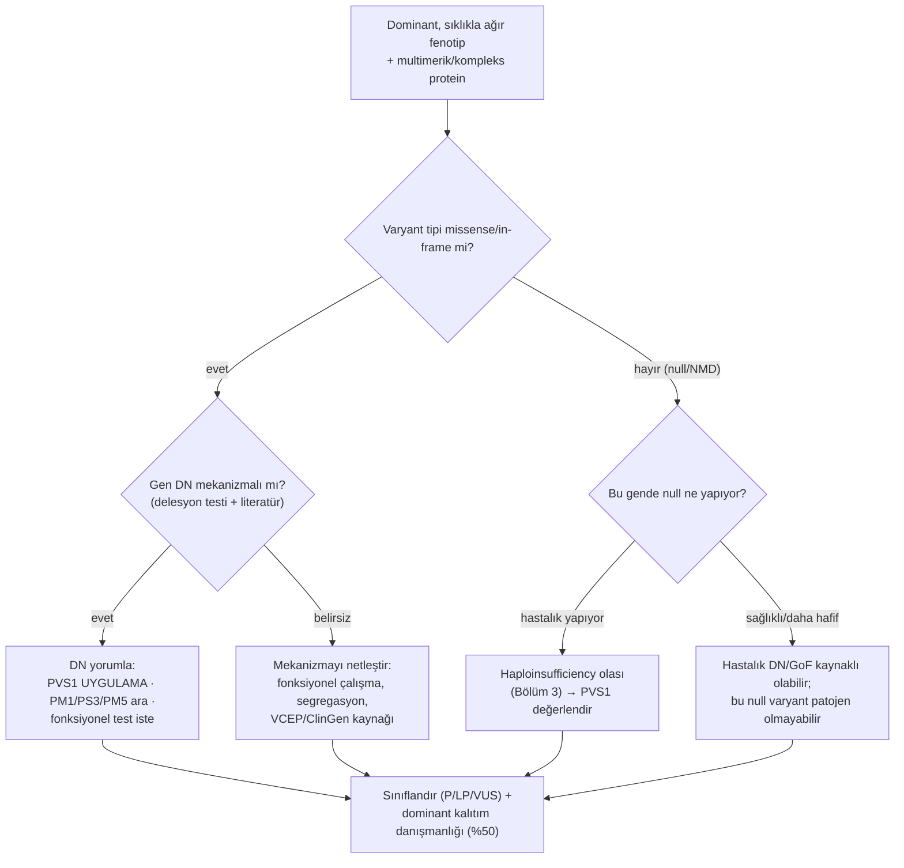

# Bölüm 5 — Dominant-Negatif (Baskın-Olumsuz Etki)

> **Bölümün çekirdek tezi:** Dominant-negatif (DN, "baskın-olumsuz"), bir varyant allelin ürettiği **bozuk ürünün, sağlam allelin ürettiği normal ürünü de işlevsiz bırakması**dır. Burada sorun ne basit bir eksiklik (Bölüm 2–3, LoF/haploinsufficiency) ne de zararlı bir fazlalıktır (Bölüm 4, GoF): varyant ürün üretilir, ortamda kalır ve normal ürünle **etkileşip onu sabote eder** — bir tür "moleküler zehirlenme". Bu yüzden DN, işlev kaybının dominant bir alt türüdür, ama haploinsufficiency'den **çok daha ağırdır**: tek varyant allel işlevi %50'ye değil, çoğu kez %25, %12 hatta daha aşağıya indirir. DN'in en güçlü ayırt edici imzası şudur: o gende **tam delesyon/null genellikle daha hafif (hatta sağlıklı) bir tablo yaparken, varyant ürün üreten missense/in-frame değişiklikler ağır hastalık yapar**. Bu "delesyon testi" hem mekanizmayı çözer hem de doğrudan varyant yorumunu (PVS1'in neden dikkatli kullanılması gerektiğini) belirler.

> **Bu bölüm nasıl okunmalı?** Tıp öğrencisi için omurga tek cümledir: *bazı varyantlar yalnız kendi kopyalarını değil, sağlam kopyanın ürününü de bozar.* Bu sezgiyi Şekil 5.1 (zehirli alt birim) ve Şekil 5.2 (multimer matematiği) üzerinden kurun; "neden %50 değil de %25/%12?" sorusunu bu iki şekil yanıtlar. Uzman okuyucu §6'da DN gende PVS1'in tuzaklarına, §7'de kollajen (OI) ve p53 (Li-Fraumeni) örneklerine, §9'daki "delesyon ne yapıyor?" karar akışına yoğunlaşabilir. Bölüm 2 (LoF), 3 (haploinsufficiency) ve 4 (GoF) önce okunmalıdır; DN bu üçünün kavşağında durur.

> 🖼️ **Görseller hakkında not:** Şekiller `assets/` klasöründe SVG, akış diyagramları Mermaid olarak gömülüdür.

---

## Öğrenme hedefleri

Bu bölümü tamamlayan okuyucu:
1. Dominant-negatif etkiyi, "varyant ürünün sağlam ürünü de işlevsizleştirmesi" olarak tanımlayabilir ve onu LoF, haploinsufficiency ve GoF'tan ayırt edebilir.
2. DN'in neden tipik olarak **multimerik / etkileşen** proteinlerde (kollajen, transkripsiyon faktörü dimerleri/tetramerleri, iyon kanalları, yapısal ağlar) görüldüğünü açıklayabilir.
3. "Multimer matematiği" ile DN'in haploinsufficiency'den neden daha ağır olduğunu nicel olarak gerekçelendirebilir (tümü-sağlam kompleks oranının (½)ⁿ ile düşmesi).
4. DN varyantlarının neden çoğunlukla **missense / in-frame** olduğunu ve bir DN gende **tam delesyon/null'un neden daha hafif** olabileceğini açıklayabilir.
5. "Tam gen delesyonu hastalığı kopyalıyor mu?" sorusunu mekanizma çıkarımının anahtar aracı olarak kullanabilir.
6. DN mekanizmalı bir gende **PVS1'in neden otomatik uygulanamayacağını** ve buna karşılık PM1, PS3, PM5/PS1 gibi kriterlerin rolünü açıklayabilir.
7. DN'in tanıda neden öncelikle **dizilemeyle (WES/WGS)** yakalandığını ve fonksiyonel testlerin (PS3) neden özellikle değerli olduğunu açıklayabilir.
8. Pediatrik genetikten somut DN örneklerini (COL1A1/COL1A2 ve osteogenesis imperfecta, TP53 ve Li-Fraumeni) mekanizma–fenotip–test–yorum zinciriyle ilişkilendirebilir.

---

## 1. Kavramsal tanım

Dominant-negatif etkiyi anlamanın en doğrudan yolu, onu önceki üç bölümle yan yana koymaktır. Bölüm 2'de bir varyantın ürünü **işlevsizleştirdiğini** (loss-of-function), Bölüm 3'te tek sağlam kopyanın **yetersiz kaldığını** (haploinsufficiency), Bölüm 4'te ise varyantın ürüne **zararlı bir fazlalık/yenilik** kattığını (gain-of-function) gördük. Dominant-negatif bunların hiçbirine tam oturmaz ve aslında en sinsi olanıdır: varyant allelin ürettiği bozuk protein **yok olmaz, kaybolmaz, sessizleşmez** — tam tersine üretilir, hücrede kalır ve sağlam allelin ürettiği normal proteinle **fiziksel olarak etkileşip onu da işlevsiz hale getirir**. Yani tek bir bozuk kopya, kendi payına düşen %50'yi kaybettirmekle kalmaz, kalan sağlam %50'yi de "zehirler".

Sezgisel bir benzetme yardımcı olur. Bir kürek takımında (multimerik bir protein gibi) herkesin aynı ritimde çekmesi gerekir. Haploinsufficiency, küreklerden birinin **kayıp** olmasıdır: takım eksik ama kalanlar uyum içinde, sadece daha yavaş. Dominant-negatif ise küreklerden birinin **ters yönde çekmesi**dir: bu tek kürekçi yalnız kendi katkısını eksiltmez, takımın tümünün ritmini bozar, tekneyi durdurur. İşte DN'in özü budur — bozuk parça pasif değil, **aktif olarak bozucudur**.

Bu kavramı moleküler biyolojiye kazandıran klasik kaynak Herskowitz'in (1987) *Nature* makalesidir. Herskowitz, aşırı ifade edildiğinde yabanıl-tip genin etkinliğini bozan mutant polipeptitleri "dominant negative" olarak adlandırmış ve bu davranışın doğal olarak da (örneğin bazı onkogenlerde) ortaya çıkabileceğini öngörmüştür (Herskowitz, 1987, *Nature*; [DOI](https://doi.org/10.1038/329219a0)). Wilkie (1994) ise dominant hastalık mekanizmalarını sınıflandıran çerçevesinde dominant-negatifi, "artmış/yeni aktivite" (GoF) ve "haploinsufficiency"den ayrı, kendi başına bir kategori olarak listeler: burada mutant ürün, yabanıl-tip ürünün işlevine **antagonistik** biçimde karışır (Wilkie, 1994, *J Med Genet*; [DOI](https://doi.org/10.1136/jmg.31.2.89)).

Buradaki kritik kavramsal nokta, GoF'ta olduğu gibi, DN'in de bir **varyant tipi değil, varyantın net etkisi** olmasıdır. Aynı missense varyant bir proteinde basit LoF (destabilizasyon → yıkım) yaparken, multimer oluşturan başka bir proteinde DN (bozuk ama hâlâ kompleksе katılabilen ürün) yapabilir. Belirleyici olan iki koşuldur: (1) varyant ürün **üretilmeli ve hücrede kalmalı** (yani genellikle missense ya da in-frame, NMD'ye uğramayan bir değişiklik), ve (2) bu ürün, sağlam ürünle **etkileşebilmeli** (çoğu kez aynı kompleksin parçası olarak). Bu iki koşul DN'in neden belirli protein sınıflarında yoğunlaştığını da açıklar — buna §2'de döneceğiz.

Aşağıdaki tablo bölüm boyunca açacağımız kavramları bir arada görmek içindir; her biri ilerideki paragraflarda benzetme ve klinik notla derinleştirilecektir.

**Tablo 5.1 — Dominant-negatif etkinin temel kavramları**

| Kavram | Tanım | Klinik anlamı |
|--------|-------|---------------|
| **Dominant-negatif (DN)** | Varyant ürünün, sağlam ürünü de işlevsizleştirmesi | Tipik olarak **dominant** ve haploinsufficiency'den **daha ağır** |
| **Zehirli alt birim (poison subunit)** | Komplekse katılıp onu bozan mutant alt birim | Multimerik proteinlerin DN'inin temeli |
| **Multimer matematiği** | "Tümü-sağlam kompleks" oranının (½)ⁿ ile düşmesi | n (alt birim sayısı) arttıkça şiddet artar |
| **Delesyon/null testi** | Tam gen kaybının fenotipini DN ile karşılaştırma | Mekanizma çıkarımının en güçlü aracı |
| **Antimorfik** | DN'in klasik genetik terimi (Müller); yabanıl-tipe karşı çalışan allel | Bölüm 6 ile köprü (neomorfik/antimorfik) |
| **Protein arayüzü (interface)** | Alt birimlerin birbirine değdiği yüzey | DN varyantlar burada kümelenir (PM1 zemini) |
| **Hipomorfik vs DN ayrımı** | Az çalışan ürün mü, sağlamı bozan ürün mü? | Şiddet ve kalıtım kalıbını belirler |

---

## 2. Moleküler mekanizma

### 2.1. Zehirli alt birim: varyant ürün sağlamı nasıl "zehirler"?

Dominant-negatif etkinin kalbinde basit bir gerçek yatar: hücredeki birçok protein **tek başına değil, kompleks halinde** çalışır. İki özdeş zincir bir dimer oluşturur (birçok transkripsiyon faktörü), üç zincir bir üçlü sarmal örer (kollajen), dört alt birim bir tetramer kurar (p53), ya da çok sayıda alt birim bir kanal/iskelet ağı oluşturur. Bu komplekslerin işlevi, **tüm alt birimlerinin sağlam olmasına** bağlıdır. İşte DN tam buraya saldırır (Şekil 5.1).

Normal bir heterozigotta her iki allel de sağlam alt birim üretir; bunlar birleşir ve oluşan komplekslerin hepsi çalışır (Şekil 5.1, sol). Dominant-negatif bir varyantta ise tablo değişir: sağlam allel hâlâ normal alt birim üretir, ama varyant allel de **üretimi durdurmaz** — bozuk ama komplekse katılabilen bir alt birim yapar. Bu varyant alt birim, sağlam alt birimlerle rastgele birleşir ve içine girdiği **her kompleksi bozar** (Şekil 5.1, sağ). Dolayısıyla yalnız varyant alt birimden oluşan kompleksler değil, **bir tane bile varyant alt birim içeren karışık kompleksler de** işlevsiz kalır. Sağlam ürünün varlığı bu zararı geri alamaz; çünkü sorun "yeterince sağlam ürün yok" değil, "sağlam ürün bozuk ortağı tarafından ele geçiriliyor"dur.

> **🔬 Deep-dive — DN'in iki ön koşulu ve neden bazı genlerde olur, bazılarında olmaz?** Bir varyantın DN etki yapabilmesi için iki şart gerekir. **Birincisi, varyant ürün üretilmeli ve stabil kalmalıdır.** Erken stop kodonu yapan, NMD ile yıkılan ya da proteini tümüyle yok eden varyantlar DN yapamaz — ortada zehirleyecek bir ürün kalmaz; bunlar saf LoF/haploinsufficiency yapar. Bu yüzden DN varyantlar tipik olarak **missense veya in-frame** (küçük in-frame delesyon/insersiyon) değişikliklerdir: ürün yapılır, komplekse girebilecek kadar "normal" görünür, ama işlevi bozuktur. **İkincisi, ürün sağlam ürünle fiziksel olarak etkileşmelidir** — yani protein multimerik olmalı veya bir kompleksin/ağın parçası olmalıdır. Tek başına (monomer olarak) çalışan ve başka kopyalarla etkileşmeyen bir enzimde DN beklenmez; orada bir bozuk kopya yalnız kendi payını kaybettirir (haploinsufficiency). Gerasimavicius, Livesey ve Marsh (2022), patojenik missense varyantların yapısal etkilerini mekanizmaya göre çözümlediklerinde tam bu beklentiyi doğrulamıştır: DN varyantlar **protein–protein arayüzlerinde belirgin biçimde zenginleşir** ve LoF varyantlardan farklı olarak protein kararlılığını çok daha az bozarlar — yani "katlanmayı yıkıp ürünü yok eden" değil, "ürünü ayakta tutup etkileşimi/işlevi sabote eden" değişikliklerdir (Gerasimavicius ve ark., 2022, *Nat Commun*; [DOI](https://doi.org/10.1038/s41467-022-31686-6)).

### 2.2. Multimer matematiği: DN neden haploinsufficiency'den ağırdır?

DN'in en öğretici yanı, ağırlığının basit bir olasılık hesabıyla açıklanabilmesidir (Şekil 5.2). Diyelim ki varyant ve sağlam alt birimler hücrede eşit oranda (her biri ½) üretiliyor ve rastgele birleşiyor. Bir kompleksin **tümüyle sağlam** olma olasılığı, içindeki her alt birimin sağlam olma olasılıklarının çarpımıdır: alt birim sayısı n ise bu olasılık (½)ⁿ'dir.

Bu hesabı mekanizmalar arasında karşılaştırınca DN'in ağırlığı somutlaşır. **Haploinsufficiency'de** (null allel) varyant ürün hiç üretilmez; ortada zehirleyecek bir şey yoktur, sağlam allelin ürünü korunur ve işlev yaklaşık **%50** kalır. **DN dimerde** (n=2) tümü-sağlam kompleks oranı (½)² = **¼ (~%25)**; geri kalan ¾ kompleks en az bir varyant alt birim içerdiği için zehirlenir. **DN trimerde** (n=3, örneğin kollajen) oran (½)³ = **⅛ (~%12)**; **DN tetramerde** (n=4, örneğin p53) (½)⁴ = **1/16 (~%6)**. Yani aynı "tek varyant allel" durumu, protein ne kadar çok alt birimliyse o kadar az sağlam kompleks bırakır. Buradaki ders nettir: DN, haploinsufficiency'nin "yarı doz" tablosunu çok aşan, çoğu kez **ağır** bir fenotipe yol açar — çünkü bozuk ürün yalnız eksiltmez, kalanı da harcar.

> **🔬 Deep-dive — Kollajenin "¾ bozuk" kuralı ve neden delesyon daha hafif?** Tip I kollajenin klasik örneği bu matematiği klinikte gösterir. Kollajen molekülü bir üçlü sarmaldır; her sarmalın düzgün örülmesi için üç zincirin de kusursuz olması ve özellikle sarmal boyunca her üçüncü konumdaki **glisinlerin** korunması gerekir (glisin, sarmalın iç eksenine sığabilen tek küçük amino asittir). *COL1A1* veya *COL1A2*'de bir glisini başka bir amino asitle değiştiren missense varyant, bozuk ama yine de sarmala katılmaya çalışan bir zincir üretir; bu zincir sarmalın katlanmasını yavaşlatır, aşırı modifikasyona ve yıkıma yol açar ve içine girdiği molekülü bozar — klasik bir "protein suicide" / zehirli alt birim örneği. Sonuçta sentezlenen kollajen moleküllerinin yaklaşık **¾'ü en az bir bozuk zincir** içerdiği için anormaldir. Buna karşılık, *COL1A1*'in bir kopyasını tümüyle susturan **null allel**, hiç bozuk zincir üretmez: hücre yalnızca **daha az ama normal** kollajen yapar (haploinsufficiency). İşte bu yüzden null allel **hafif osteogenesis imperfecta tip I** yaparken, glisin substitüsyonları **ağır (tip II–IV)** OI yapar (Forlino &amp; Marini, 2000, *Mol Genet Metab*; [DOI](https://doi.org/10.1006/mgme.2000.3039)). Aynı gen, iki farklı mekanizma, zıt ağırlık — ve bu, mekanizma çıkarımının en güçlü doğal deneyidir.

### 2.3. Antimorfik terimi ve Bölüm 6 ile köprü

Klasik genetikte (Müller'in allel sınıflaması) dominant-negatif etkiye **antimorfik** allel denir: yabanıl-tip allelin işlevine *karşı* (anti) çalışan allel. Bu terimi burada anıyoruz çünkü Bölüm 6'da neomorfik (yeni işlev) ve antimorfik alleller bir arada ele alınacaktır. Pratikte "dominant-negatif" (moleküler/klinik literatür) ve "antimorfik" (klasik genetik) çoğu zaman eşanlamlı kullanılır; bu kitapta yerleşik kullanım gereği **dominant-negatif** terimini tercih ediyoruz.

---

## 3. Varyant tipleri

Dominant-negatif etki, varyant ürünün **üretilip komplekse katılmasını** gerektirdiği için belirli varyant tipleriyle güçlü bir ilişki gösterir. Aşağıdaki tablo bu ilişkiyi düzenler; önemli olan, aynı varyant tipinin farklı genlerde farklı mekanizmalara yol açabileceğini akılda tutmaktır.

**Tablo 5.2 — Varyant tipleri ve dominant-negatif açısından sonuçları**

| Varyant tipi | DN açısından tipik sonuç | Notlar / ilgili bölüm |
|---|---|---|
| **Missense** | DN'in en sık nedeni; ürün yapılır, komplekse girer, işlevi bozar | Aynı varyant başka gende LoF (Bölüm 2) veya GoF (Bölüm 4) olabilir |
| **In-frame delesyon/insersiyon** | Çoğu kez DN; kısalmış ama hâlâ etkileşen ürün | Okuma çerçevesi korunur → ürün stabil |
| **Glisin substitüsyonu (kollajen)** | Klasik DN; üçlü sarmalı bozan zehirli zincir | §2.2, §7.1 (OI) |
| **Nonsense / frameshift (NMD'ye uğrayan)** | Genelde DN **yapmaz** → haploinsufficiency/LoF | Ürün yıkılır; zehirleyecek bir şey kalmaz (Bölüm 2) |
| **Son ekzonda nonsense (NMD kaçışı)** | Ürün yapılırsa DN olabilir | NMD kaçışı kritik (bkz. Bölüm 2, Şekil 2.1) |
| **Tam gen delesyonu / null** | DN **değil**; haploinsufficiency veya sessiz | "Delesyon testi"nin temeli (§4, §6) |

Bu tablonun pratik özeti şudur: bir gende **ağır fenotip missense/in-frame varyantlarla**, hafif fenotip ise **null/delesyonla** ilişkiliyse, bu desen güçlü biçimde dominant-negatif (veya bazı durumlarda GoF) mekanizmaya işaret eder. Tersine, hem null hem missense varyantlar **benzer ve null'la uyumlu** fenotip yapıyorsa, mekanizma büyük olasılıkla haploinsufficiency'dir.

---

## 4. Klinik fenotipe dönüşüm

Bu bölümün anahtar soruları üç tanedir; her birini sırayla yanıtlayalım.

**Soru 1 — DN neden dominant kalıtım gösterir?** Çünkü hastalık için tek bir varyant allel yeterlidir: o allelin ürünü, sağlam allelin ürününü de etkisizleştirdiği için heterozigot birey hastadır. Bu yönüyle DN, haploinsufficiency ve GoF ile aynı klinik sonucu (dominantlık) paylaşır; ama Bölüm 4'te vurguladığımız gibi dominantlığın *nedeni* farklıdır: haploinsufficiency'de yetersizlik, GoF'ta zararlı fazlalık, DN'de ise **sağlamın sabote edilmesi**.

**Soru 2 — DN neden çoğu kez daha ağır seyreder?** §2.2'deki multimer matematiği nedeniyle. Haploinsufficiency işlevi ~%50'ye indirirken, DN onu kompleks büyüklüğüne göre %25'e, %12'ye veya daha aşağıya çeker. Bunun en çarpıcı klinik kanıtı, **aynı gende** null ve DN varyantların ürettiği şiddet farkıdır (OI'da tip I vs tip II–IV). Bu nedenle, bir genin hastalık spektrumunda hem çok hafif (null) hem çok ağır (missense) uçların bulunması, klinisyene mekanizma hakkında doğrudan bilgi verir.

**Soru 3 — DN'i klinikte/molekülde nasıl tanırız?** En güçlü ipucu **delesyon/null testidir**: o gendeki tam gen delesyonları (veya kesin null alleller) ne yapıyor? Eğer null taşıyıcıları **sağlıklıysa veya çok daha hafif** etkileniyorsa, hastalığı yapan "yokluk" değil, varyant ürünün **varlığıdır** — bu DN (veya GoF) lehinedir. Eğer null da hastalığı yapıyorsa mekanizma haploinsufficiency'dir. Bu mantık, dört mekanizmayı tek bir çerçevede ayırmamızı sağlar (Şekil 5.3).

Aşağıdaki Mermaid akışı, eldeki ipuçlarından mekanizmaya nasıl gidileceğini özetler.

**Algoritma 5.1 — Dominant hastalıkta mekanizma ayrımı: yetersiz doz mu, dominant-negatif mi?**

---

## 5. Tanısal testlerle ilişkisi

Dominant-negatif varyantların çoğu **missense veya küçük in-frame** değişiklikler olduğu için, onları yakalamanın ana yolu **dizi (sekans) temelli** testlerdir. Doz/kopya-sayısı temelli testler (array, MLPA) DN'i kaçırır; çünkü DN varyantlar kopya sayısını değiştirmez (gen iki kopyadadır, biri sadece "bozuk ürün" yapar). İlginç biçimde, bir gen için **tam delesyonun yokluğu ama missense varyantın varlığı** zaten mekanizma hakkında ipucudur (§4).

**Tablo 5.3 — Dominant-negatif mekanizmayı hangi test yakalar?**

| Test | Bu mekanizmayı yakalar mı? | Sınırlılığı |
|------|----------------------------|-------------|
| **WES** | ✅ Evet — missense/in-frame varyantları iyi yakalar | Derin intronik/regülatör DN dışı; arayüz varyantının *etkisini* yorum gerektirir |
| **Short-read WGS** | ✅ Evet — kodlayan + sınır bölgeleri | Yorum yükü WES'e benzer; fonksiyonel etki ayrıca gösterilmeli |
| **Long-read WGS** | ✅ Evet; ayrıca faz/allel ayrımı | Maliyet/erişim; küçük missense için WES'e ek üstünlük sınırlı |
| **Array-CGH / SNP array** | ❌ Hayır — DN varyant kopya sayısını değiştirmez | Yalnız büyük delesyon/duplikasyonu görür (DN değil) |
| **MLPA** | ❌ Hayır (DN için) | Doz testidir; tek nükleotid/missense DN'i göremez |
| **RNA-seq** | ⚠️ Kısmen — varyant ürünün **ifade edildiğini** ve NMD'den kaçtığını gösterir | DN etkiyi *kanıtlamaz*; ürünün varlığını destekler |
| **Methylation array** | ❌ Hayır | İlgisiz mekanizma |
| **Karyotip** | ❌ Hayır | Çözünürlük yetersiz; DN nokta düzeyinde |

> **Bu mekanizmayı hangi test yakalar? (özet):** DN'i **dizileme (WES/WGS)** yakalar; doz/yapısal testler (array, MLPA, karyotip) göremez. Varyantın *DN etki yaptığını* göstermek için ise dizilemenin ötesinde **fonksiyonel kanıt** (RNA düzeyinde ürünün varlığı + hücresel/biyokimyasal işlev testi) gerekir; bu, ACMG'de PS3 kriterinin neden DN'de özellikle değerli olduğunu açıklar (§6).

---

## 6. Varyant yorumlama açısından önemi (ACMG/ClinGen)

Dominant-negatif mekanizma, ACMG/AMP çerçevesinde (Richards ve ark., 2015, *Genet Med*; [DOI](https://doi.org/10.1038/gim.2015.30)) en sık **PVS1** kriteri çevresinde sorun çıkarır. PVS1 ("çok güçlü" patojenite kanıtı), bir varyantın **işlev kaybına** yol açtığı ve **işlev kaybının o gen için bilinen hastalık mekanizması olduğu** durumlarda uygulanır. ClinGen Sıra Varyant Yorumlama (SVI) çalışma grubunun PVS1 iyileştirmesi tam da bu ikinci koşulu vurgular: PVS1 kullanmadan önce, **o gende LoF'un gerçekten hastalık mekanizması olduğundan emin olunmalıdır** (Abou Tayoun ve ark., 2018, *Hum Mutat*; [DOI](https://doi.org/10.1002/humu.23626)).

DN gende bu noktada iki ayrı tuzak doğar. **Birinci tuzak:** DN gende hastalık mekanizması genellikle saf LoF *değildir* — hastalık, ürünün yokluğundan değil, bozuk ürünün varlığından doğar. Bu yüzden o gende bir **null varyanta otomatik PVS1 vermek yanıltıcı olabilir**: çünkü null, o gende ya hastalık yapmaz ya da farklı (daha hafif) bir tablo yapar (kollajen örneğindeki gibi). **İkinci tuzak:** asıl patojen DN varyantlar çoğu kez **missense**'tir ve bunlar PVS1 kapsamına girmez; üstelik Gerasimavicius ve ark.'nın (2022) gösterdiği gibi, çoğu hesaplamalı varyant-etki tahmin aracı **DN/non-LoF varyantlarda zayıf performans** gösterir — yani DN missense varyantlar "iyi huylu" gibi görünüp gözden kaçabilir ([DOI](https://doi.org/10.1038/s41467-022-31686-6)). Bu iki tuzak birlikte, DN genlerde varyant yorumunu mekanizma bilgisine bağımlı kılar.

Pratikte DN gende öne çıkan kriterler şunlardır: **PM1** (varyant, bilinen bir fonksiyonel/arayüz "hotspot"ında — DN varyantlar protein arayüzlerinde kümelendiği için bu kriter sık devreye girer), **PS3/BS3** (fonksiyonel çalışmanın DN etkiyi gösterip göstermediği — DN'de altın değerdedir), **PM5/PS1** (aynı kodonda/aynı amino asit değişiminde daha önce patojen bildirilmiş varyant; özellikle kollajen glisin konumlarında güçlüdür) ve uygun olduğunda **PS2/PM6** (de novo). Aşağıdaki akış, DN şüphesinde varyant yorumunun nasıl ilerleyeceğini özetler.

**Algoritma 5.2 — Dominant gende dominant-negatif kanıtının değerlendirilmesi**

> **🟦 Klinikte dikkat — "Kısaltıcı varyant her zaman en kötü" değildir:** Sezgi, protein üretimini erken durduran (nonsense/frameshift) varyantların missense'ten daha ağır olacağını söyler. DN genlerde bu **tersine dönebilir**: kısaltıcı/null varyant ürünü yok ettiği için *zehirleyemez* ve daha hafif (haploinsufficiency) tablo yapabilirken, ürünü ayakta tutan **missense** varyant kompleksi zehirleyip **daha ağır** hastalık yapabilir. Bu yüzden DN gende varyant tipinden şiddete doğrudan atlamayın; mekanizmayı sorun.

---

## 7. Pediatrik genetikten klinik örnekler

### 7.1. COL1A1 / COL1A2 ve osteogenesis imperfecta — DN'in ders kitabı örneği

Osteogenesis imperfecta (OI, "kırılgan kemik hastalığı"), dominant-negatif mekanizmanın en saf ve öğretici klinik örneğidir. *COL1A1* ve *COL1A2* genleri, tip I kollajenin α1 ve α2 zincirlerini kodlar; bu zincirler bir üçlü sarmal örerek kemik, deri ve bağ dokusunun ana yapısal proteinini oluşturur. Forlino ve Marini (2000), OI'yi açıkça "bir dominant-negatif bağ dokusu hastalığı" olarak tanımlar ve genotip-fenotip ilişkisinin özünü şöyle özetler: **niceliksel kusurlar** (örneğin null *COL1A1* allelleri) **hafif** formla (tip I), **niteliksel/yapısal kusurlar** (glisin substitüsyonları, ekzon atlanması, in-frame delesyonlar) **daha ağır** formlarla (tip II–IV) ilişkilidir (Forlino &amp; Marini, 2000, *Mol Genet Metab*; [DOI](https://doi.org/10.1006/mgme.2000.3039)).

Mekanizma §2.2'de açıkladığımız zehirli alt birim mantığının tam karşılığıdır: glisin substitüsyonu yapan bir zincir üçlü sarmala katılır ama onu bozar; sentezlenen kollajenin yaklaşık ¾'ü anormal hale gelir → ağır kemik kırılganlığı. Buna karşılık bir *COL1A1* kopyasını tümüyle susturan null allel yalnız kollajen miktarını ~yarıya indirir (haploinsufficiency) → görece hafif tip I OI. Buradaki öğreti çok yönlüdür: aynı gen, varyant tipine göre hem hafif (null) hem ölümcül (perinatal letal tip II) hastalık yapabilir; ve bu da bize tek bir gende mekanizmanın varyanta göre değişebileceğini gösterir.

> **🔴 Sık yapılan hata kutusu**
> 1. OI'da bir *COL1A1* nonsense/frameshift (null) varyantını gördüğünde "ürünü yok ediyor, demek ki en ağır form" diye düşünmek. Tersine — null genellikle **hafif tip I** ile ilişkilidir; ağır formlar glisin substitüsyonlarındadır.
> 2. Glisin dışı bir missense'i otomatik "iyi huylu" saymak. Kollajende glisin konumları kritik olsa da, başka kritik kalıntılar da DN yapabilir; kararı mekanizma ve kanıtla ver.

### 7.2. TP53 ve Li-Fraumeni sendromu — tetramer DN

İkinci örnek, mekanizmanın kanser yatkınlığına nasıl taşındığını gösterir. p53 tümör baskılayıcı proteini bir **tetramer** olarak çalışır; DNA'ya bağlanıp hedef genleri aktive etmesi için dört alt biriminin de doğru biçimde bir araya gelmesi gerekir. Li-Fraumeni sendromunda (kalıtsal çok-kanserli yatkınlık) görülen *TP53* missense varyantlarının önemli bir kısmı **dominant-negatif** davranır: mutant p53 alt birimi, sağlam alt birimlerle aynı tetramere katılıp kompleksin işlevini (DNA bağlanma / transkripsiyon aktivasyonu) bozar. Kamada ve ark. (2025), p53 tetramerleşme alanındaki Arg337 varyantlarını (R337C, R337H) inceleyerek bu DN benzeri etkiyi doğrudan göstermiştir: mutant, yabanıl-tiple hetero-tetramer oluşturduğunda transkripsiyon aktivitesi %50'den fazla azalabilmektedir — yani tek bir varyant alt birim, kompleksin işlevini orantısız biçimde düşürür (Kamada ve ark., 2025, *Chembiochem*; [DOI](https://doi.org/10.1002/cbic.202500330)).

Bu örnek iki açıdan öğreticidir. Birincisi, multimer matematiğini (n=4 → tümü-sağlam tetramer oranı yaklaşık 1/16) somut bir tümör baskılayıcıda gösterir. İkincisi, DN'in yalnız "yapısal" hastalıklara (kollajen gibi) özgü olmadığını, **kanser yatkınlığı** gibi farklı klinik alanlara da uzandığını ortaya koyar — mekanizma evrenseldir, fenotip gene/dokuya bağlıdır.

> **🧠 Hatırlatıcı:** DN'i aramak için iyi bir refleks — *"Bu protein yalnız mı çalışır, takım hâlinde mi?"* Takım hâlinde çalışan (multimerik/kompleks) bir proteinde ağır, dominant, missense-ağırlıklı bir hastalık görüyorsanız, dominant-negatifi listenizin başına koyun.

### 7.3. Diğer örnekler ve bir uyarı

Dominant-negatif etki birçok protein sınıfında görülür: iyon kanalları (kanal alt birimleri hetero-tetramer kurar; bir bozuk alt birim akımı orantısız azaltabilir), bağ dokusu proteinleri ve bazı transkripsiyon faktörü/yapısal protein aileleri. Ancak burada bir uyarı gerekir: bir genin hastalık mekanizması bazen tartışmalıdır veya varyanta göre değişir (örneğin bazı genlerde hem haploinsufficiency hem DN varyantlar bildirilmiştir). Bu yüzden mekanizmayı **gen düzeyinde sabit bir etiket** gibi değil, **kanıtla desteklenen bir çıkarım** olarak ele almak gerekir. ⚠️ Belirli bir gen-spesifik DN iddiası için her zaman güncel, gen-spesifik (tercihen VCEP/ClinGen) kaynak doğrulaması yapılmalıdır.

---

## 8. Sık yapılan hatalar

> **🔴 Sık yapılan hata kutusu**
> 1. **DN'i haploinsufficiency ile karıştırmak.** İkisi de dominanttır ama DN, sağlam ürünü de zehirlediği için tipik olarak daha ağırdır. "%50 doz" mantığı DN'de geçerli değildir.
> 2. **DN gende null varyanta otomatik PVS1 vermek.** O gende null, hastalık mekanizmasını temsil etmeyebilir (hatta hafif/sessiz olabilir). PVS1'den önce "bu gende LoF gerçekten hastalık mekanizması mı?" sorusunu yanıtlayın.
> 3. **DN missense'i "kararsız/iyi huylu" varsaymak.** Tahmin araçları DN varyantlarda zayıftır; arayüz konumu (PM1), fonksiyonel kanıt (PS3) ve aynı kodon kanıtı (PM5/PS1) olmadan hızlı "benign" kararı vermeyin.
> 4. **Kısaltıcı = en ağır" sanmak.** DN gende bunun tersi olabilir (bkz. OI: null → hafif, glisin missense → ağır).

> **🟦 Klinikte dikkat kutusu**
> - Dominant, ağır, **missense-ağırlıklı** ve **multimerik/kompleks** bir protein → dominant-negatifi erken düşün.
> - Aile içinde aynı varyantın çok değişken ağırlıkta seyrettiği DN tablolarında, modifiye edici etkiler ve doku-spesifik kompleks oranları rol oynayabilir (penetrans/ekspresivite, Bölüm 1).
> - Genetik danışmada DN hastalıklar genellikle **dominant** kalıtım riski (%50 aktarım) taşır; ancak de novo DN varyantlar da sıktır (özellikle ağır/letal formlarda).

---

## 9. Klinik pratikte karar algoritması

**Algoritma 5.3 — Dominant-negatif şüphesinde klinik karar akışı**

---

## 10. Kaynaklar

> **Atıf / doğrulama notu:** Bu bölümün bibliyografik verileri PubMed üzerinden doğrulanmıştır; her kaynağın PMID ve DOI'si tek tek teyit edilmiştir. Metin içinde yazar-yıl, kaynakçada DOI-link kullanılmıştır.

1. **Herskowitz I (1987).** Functional inactivation of genes by dominant negative mutations. *Nature* 329(6136):219–222. **PMID: 2442619** · DOI: [10.1038/329219a0](https://doi.org/10.1038/329219a0) — *Kullanım amacı: Dominant-negatif kavramının landmark tanımı (mutant ürün yabanıl-tip işlevini bozar).*
2. **Wilkie AOM (1994).** The molecular basis of genetic dominance. *Journal of Medical Genetics* 31(2):89–98. **PMID: 8182727** · DOI: [10.1136/jmg.31.2.89](https://doi.org/10.1136/jmg.31.2.89) — *Kullanım amacı: Dominant mekanizmaların sınıflaması; DN'in haploinsufficiency ve GoF'tan ayrı kategori olarak konumlandırılması.*
3. **Gerasimavicius L, Livesey BJ, Marsh JA (2022).** Loss-of-function, gain-of-function and dominant-negative mutations have profoundly different effects on protein structure. *Nature Communications* 13(1):3895. **PMID: 35794153** · DOI: [10.1038/s41467-022-31686-6](https://doi.org/10.1038/s41467-022-31686-6) — *Kullanım amacı: DN varyantların protein arayüzlerinde kümelenmesi, kararlılığı az bozması ve tahmin araçlarının DN'de zayıf kalması (metodoloji + yorum).*
4. **Forlino A, Marini JC (2000).** Osteogenesis imperfecta: prospects for molecular therapeutics. *Molecular Genetics and Metabolism* 71(1-2):225–232. **PMID: 11001814** · DOI: [10.1006/mgme.2000.3039](https://doi.org/10.1006/mgme.2000.3039) — *Kullanım amacı: OI'nin dominant-negatif hastalık olarak tanımı; null (hafif tip I) vs yapısal/glisin (ağır tip II–IV) genotip-fenotip ilişkisi.*
5. **Kamada R, Sakaguchi S, Kanno M, ve ark. (2025).** Dominant-Negative Effects of p53 R337 Variants in Li-Fraumeni Syndrome: Impact on Tetramer Formation and Transcriptional Activity. *ChemBioChem* 26(22):e202500330. **PMID: 40704418** · DOI: [10.1002/cbic.202500330](https://doi.org/10.1002/cbic.202500330) — *Kullanım amacı: TP53 tetramer DN örneği; hetero-tetramerde işlev kaybının orantısızlığı.*
6. **Richards S, Aziz N, Bale S, ve ark. (2015).** Standards and guidelines for the interpretation of sequence variants: a joint consensus recommendation of the American College of Medical Genetics and Genomics and the Association for Molecular Pathology. *Genetics in Medicine* 17(5):405–424. **PMID: 25741868** · DOI: [10.1038/gim.2015.30](https://doi.org/10.1038/gim.2015.30) — *Kullanım amacı: ACMG/AMP kriter çerçevesi; PVS1/PM1/PS3/PM5'in DN bağlamı.*
7. **Abou Tayoun AN, Pesaran T, DiStefano MT, ve ark. (2018).** Recommendations for interpreting the loss of function PVS1 ACMG/AMP variant criterion. *Human Mutation* 39(11):1517–1524. **PMID: 30192042** · DOI: [10.1002/humu.23626](https://doi.org/10.1002/humu.23626) — *Kullanım amacı: PVS1 uygulanmadan önce "LoF gerçekten hastalık mekanizması mı?" koşulu — DN gende PVS1 tuzağının temeli.*

> **İkincil/destekleyici kaynak notu:** GeneReviews/OMIM/ClinVar/gnomAD ve gen-spesifik VCEP belgeleri yalnız destekleyici bilgi olarak kullanılmalıdır; gen-spesifik DN iddiaları güncel birincil/uzman-paneli kaynakla teyit edilmelidir.

---

## ✅ Bölüm öz-denetim tablosu

**Tablo 5.4 — Bölüm 5 öz-denetim tablosu**

| Kriter | Durum | Not |
|--------|-------|-----|
| Mekanizma doğru anlatıldı mı? | ✅ | Zehirli alt birim + multimer matematiği (Şekil 5.1–19) |
| Klinik bağlantı kuruldu mu? | ✅ | OI (kollajen) ve Li-Fraumeni (p53) |
| Varyant tipi ile mekanizma ilişkilendirildi mi? | ✅ | §3 tablo + null/missense ayrımı |
| Pediatrik örnek verildi mi? | ✅ | COL1A1/COL1A2 (OI), TP53 (LFS) |
| Test seçimi açıklandı mı? | ✅ | §5; dizileme yakalar, doz testleri kaçırır |
| ACMG/ClinGen bağlantısı doğru mu? | ✅ | PVS1 tuzağı (Abou Tayoun), PM1/PS3/PM5 |
| Kaynaklar PMID/DOI ile verildi mi? | ✅ | 7/7 |
| Spekülatif iddialar işaretlendi mi? | ✅ | §7.3 gen-spesifik uyarı; oranlar "temsilî" |
| Kaynak uydurma riski var mı? | ✅ Yok | Tümü PubMed MCP ile doğrulandı |
| Görsel/şema/algoritma desteği yeterli mi? (≥3 SVG, ≥2 Mermaid) | ✅ | 3 SVG (18–20) + 3 Mermaid |

---

### 🔎 Bölüm sonu kaynak doğrulama komutu (zorunlu)
> "Bu bölümdeki tüm kaynakların PMID/DOI bilgisini kontrol et. PMID veya DOI veremediğin kaynağı çıkar. Kaynağı olmayan iddiayı 'kaynak doğrulaması gerekli' olarak işaretle."
>
> **Bu bölüm için durum:** 7/7 kaynak PMID+DOI doğrulandı (PubMed MCP ile). İşaretlenen iddialar: multimer oranları "temsilî" (rastgele birleşme + ½ varyant varsayımı); gen-spesifik DN etiketleri için VCEP/ClinGen teyidi önerilir (§7.3).
