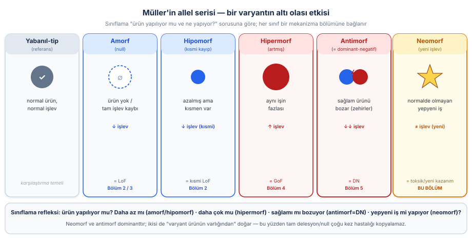
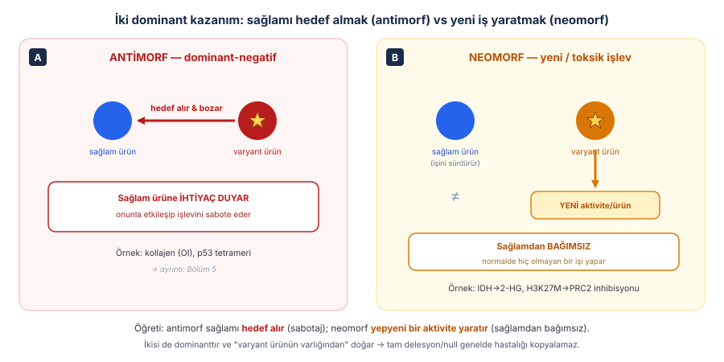
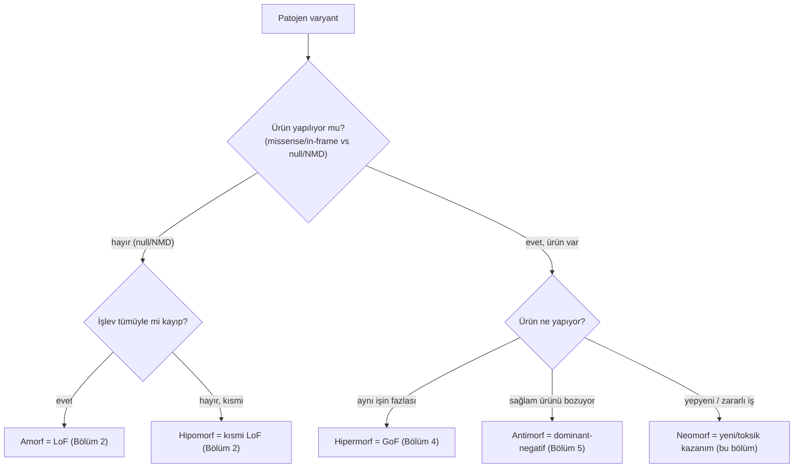
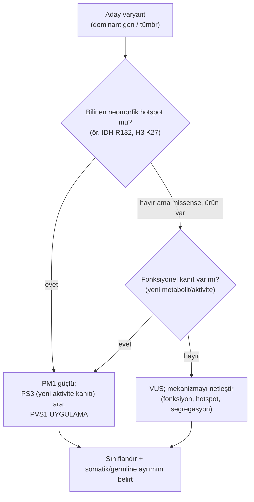
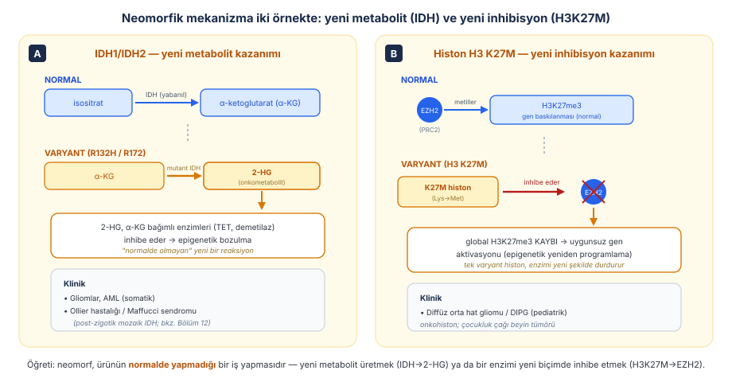
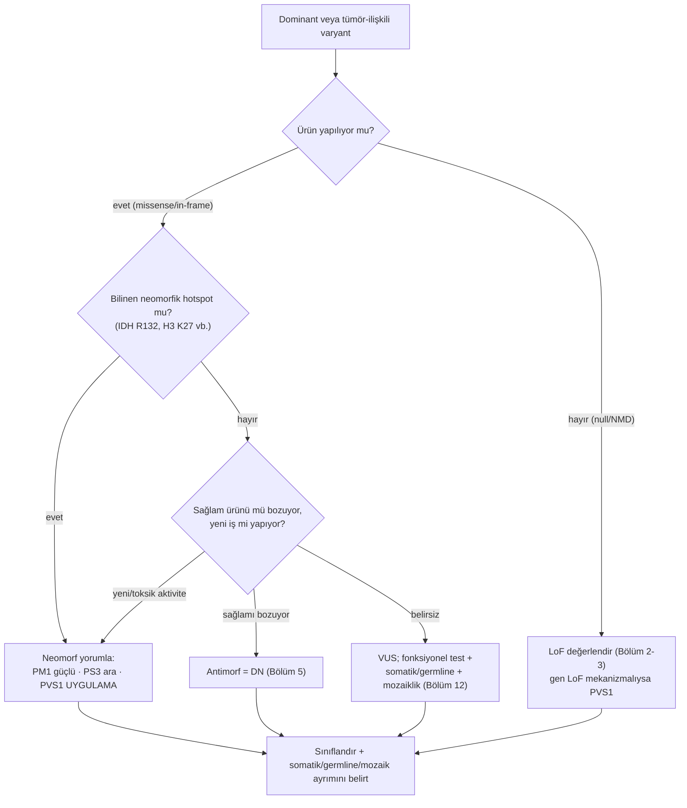

# Bölüm 6 — Neomorfik Aleller: Yeni İşlev Kazanımı

> **Bölümün çekirdek tezi:** Bu bölüm, mekanizma bölümlerini birleştiren **Muller'in klasik alel serisini** tamamlar. Bir varyant gen ürününü altı yoldan biriyle değiştirebilir: ürünü yok eder (**amorf** = null/LoF), azaltır (**hipomorf** = kısmi LoF), aynı işin fazlasını yaptırır (**hipermorf** = GoF), sağlam ürünü sabote eder (**antimorf** = dominant-negatif) veya ona **normalde hiç yapmadığı yepyeni bir iş** kazandırır (**neomorf**). İlk üçünü Bölüm 2–4'te, antimorfu (DN) Bölüm 5'te işledik; bu bölüm bu çerçeveyi tamamlar ve özellikle **neomorfik** etkiye odaklanır. Neomorfizmin özü, GoF'un en radikal ucudur: protein artık eski işini "daha çok" yapmaz, **bambaşka** bir aktivite kazanır — yeni bir metabolit üretir (IDH → 2-hidroksiglutarat), bir enzimi yeni biçimde inhibe eder (histon H3 K27M → PRC2) veya toksik bir ürüne dönüşür. Hem neomorf hem antimorf **dominanttır** ve ikisi de "varyant ürünün varlığından" doğduğu için, ikisinde de **tam delesyon/null çoğu kez hastalığı kopyalamaz** — bu da varyant yorumunun (PVS1'in uygulanmaması) ortak sonucudur. Bir adlandırma notu: **antimorf, dominant-negatif etkinin Muller serisindeki tarihsel adıdır** ve ayrı bir modern mekanizma değildir; bu yüzden mekanizmanın kendisi Bölüm 5'te işlenir ve burada yalnızca seriyi tamamlayan konumuyla anılır. Bu bölümün asıl konusu **neomorfizmdir**.

> **📘 Okuma katmanları.** Bu kitabın birincil hedefi **yandal asistanı ve klinik genomik çalışan hekimdir**; genel pediatrist ve tıp öğrencisi ikincil hedef kitledir. Bölümü kendi katmanınızdan okuyabilirsiniz:
> · **① Temel — tıp öğrencisi:** Şekil 6.1 (Muller alel serisi): altı sınıfı tek haritada görün ve her birini bir mekanizma bölümüne bağlayın.
> · **② Klinik — pediatrist ve klinisyen:** §7: IDH/Ollier-Maffucci ve H3 K27M/DIPG — neomorfizmin pediatrik karşılıkları.
> · **③ İleri düzey — yandal asistanı, laboratuvar, varyant yorumlayan:** §2.2–§6: neomorfizmin moleküler ayrıntısı ve neomorfik varyantların ACMG yorumu (PM1 hotspot, PS3).

> 🖼️ **Görseller hakkında not:** Şekiller `assets/` klasöründe SVG, akış diyagramları Mermaid olarak gömülüdür.

---

## Öğrenme hedefleri

Bu bölümü tamamlayan okuyucu:
1. Muller'in alel serisini (amorf, hipomorf, hipermorf, antimorf, neomorf) tanımlayabilir ve her sınıfı bir moleküler mekanizmaya/bölüme bağlayabilir.
2. Neomorfik etkiyi "ürünün normalde yapmadığı yeni bir işlev kazanması" olarak tanımlayabilir ve onu basit hipermorf (artmış aktivite) GoF'tan ayırt edebilir.
3. Neomorf ile antimorf (DN) arasındaki temel farkı açıklayabilir: neomorf sağlamdan bağımsız yeni bir aktivite yaratır; antimorf sağlam ürünü hedef alıp bozar.
4. Toksik kazanımı (toxic gain-of-function; agregasyon, onkometabolit, anormal etkileşim) neomorfik spektrumun bir parçası olarak konumlandırabilir.
5. IDH1/IDH2 neomorfik mekanizmasını (α-KG → 2-HG onkometaboliti → epigenetik bozulma) ve klinik karşılıklarını (gliom; Ollier/Maffucci mozaikliği) açıklayabilir.
6. Histon H3 K27M "onkohiston" mekanizmasını (PRC2/EZH2 inhibisyonu → H3K27me3 kaybı) ve pediatrik diffüz orta hat gliomu ile ilişkisini açıklayabilir.
7. Neomorfik/antimorfik mekanizmalı genlerde **PVS1'in neden uygulanmadığını**, buna karşılık PM1 (hotspot) ve PS3 (fonksiyonel kanıt) kriterlerinin neden öne çıktığını gerekçelendirebilir.
8. Neomorfik varyantların neden **dizilemeyle** yakalandığını ve neden tekrarlayan, hotspot-yoğun missense desenleri gösterdiğini açıklayabilir.

---

## 1. Kavramsal tanım

Önceki dört bölümde varyantların gen ürününü farklı yönlerde değiştirdiğini gördük. Bu bölüm, o parçaları **Muller'in alel serisi** denen klasik bir çerçevede birleştirir. 1930'larda Hermann Joseph Muller, bir varyant alelin yabanıl-tipe göre işlevini niteliğe göre sınıflandırmış ve bugün hâlâ kullandığımız terimleri ortaya koymuştur: **amorf** (işlev tümüyle kayıp), **hipomorf** (işlev azalmış), **hipermorf** (işlev artmış), **antimorf** (yabanıl-tip işlevine *karşı* çalışan) ve **neomorf** (yepyeni bir işlev kazanan). Wilkie (1994), dominant hastalıkların moleküler temellerini incelerken bu çerçeveyi modern genetik diline taşır ve "artmış/yeni protein işlevi" ile "dominant-negatif (antimorfik)" etkiyi ayrı dominant mekanizmalar olarak konumlandırır (Wilkie, 1994, *J Med Genet*; [DOI](https://doi.org/10.1136/jmg.31.2.89)).

Bu seriyi tek bir haritada görmek, kitabın o ana kadarki tüm mekanizmalarını birbirine bağlar (Şekil 6.1). Soldaki yabanıl-tip referanstan başlayarak sağa doğru: amorf ve hipomorf **işlev kaybı** ucundadır (Bölüm 2–3); hipermorf **işlev kazanımı** (Bölüm 4); antimorf **sağlamı sabote etme** (Bölüm 5, dominant-negatif); ve neomorf **yeni işlev** ucunda durur (bu bölüm).

Bu bölümün asıl yeni kavramı **neomorf**tur, çünkü antimorfu (dominant-negatif) Bölüm 5'te ayrıntılı işledik. Neomorfik etkinin tanımı kritik bir incelik taşır: bu, "aynı işin fazlası" (hipermorf) değil, **niteliksel olarak yeni** bir aktivitedir. Sezgisel benzetmeyle: hipermorf, bir motorun fazla mesai yapmasıdır (aynı iş, daha çok); neomorf ise motorun aniden **bambaşka bir cihaza** dönüşüp, sistemde hiç olmaması gereken bir çıktı üretmesidir. Bu ayrım sadece akademik değildir; aşağıda göreceğimiz gibi, neomorfik varyantların tipik olarak **belirli kodonlarda tekrar tekrar** (hotspot) ortaya çıkması ve **fonksiyonel testlerle** doğrulanması, doğrudan bu "yeni aktivite" özelliğinden kaynaklanır.

Aşağıdaki tablo, bölüm boyunca açacağımız kavramları bir arada gösterir.

**Tablo 6.1 — Neomorfik ve antimorfik alellerin temel kavramları**

| Kavram | Tanım | Klinik anlamı |
|--------|-------|---------------|
| **Muller alel serisi** | Varyant etkisinin altı sınıfı (amorf→neomorf) | Tüm mekanizma bölümlerini birleştiren çerçeve |
| **Neomorf** | Ürünün normalde yapmadığı yeni bir işlev kazanması | Dominant; tekrarlayan hotspot missense; PS3 değerli |
| **Antimorf** | Yabanıl-tip işlevine karşı çalışan (= dominant-negatif) | Dominant; ağır; sağlamı sabote eder (Bölüm 5) |
| **Toksik kazanım (toxic GoF)** | Ürünün zararlı yeni bir özellik kazanması (agregasyon, onkometabolit) | Neomorfik spektrumun parçası |
| **Onkometabolit** | Normalde olmayan, tümör destekleyici metabolit (ör. 2-HG) | IDH neomorfizminin ürünü |
| **Onkohiston** | Histon varyantı; epigenetik makineyi neomorfik şekilde bozar | H3 K27M; pediatrik gliom |
| **Hotspot (sıcak nokta)** | Neomorfik varyantların kümelendiği belirli kodon(lar) | PM1 kriterinin temeli (IDH R132, H3 K27) |

---

## 2. Moleküler mekanizma

### 2.1. Neomorf ile antimorfu ayırmak

Bu iki dominant kazanım sıklıkla karıştırılır, çünkü ikisi de "varyant ürünün zararlı varlığı" ile çalışır. Ama mekanizmaları temelden farklıdır (Şekil 6.2). **Antimorf (dominant-negatif)**, sağlam ürüne *ihtiyaç duyar*: varyant ürün, normal ürünle fiziksel olarak etkileşip onu sabote eder (Bölüm 5'teki zehirli alt birim). **Neomorf** ise sağlamdan *bağımsızdır*: varyant ürün, normal ürünü hedef almak yerine, hücrede daha önce hiç olmayan **yeni bir aktivite** başlatır. Sağlam alelin ürünü kendi işini yapmaya devam edebilir; sorun, sağlamın bozulması değil, **fazladan zararlı bir işlevin ortaya çıkmasıdır**.

> **🔬 Deep-dive — Neomorf, hipermorf ve "toksik kazanım" arasındaki bulanık sınır.** Pratikte bu kategoriler keskin çizgilerle ayrılmaz; bir spektrum oluştururlar. **Hipermorf** en hafif uçtur: aynı işlevin nicel artışı (örneğin Bölüm 4'teki FGFR3'ün ligandsız sürekli aktivasyonu — yine de "FGFR3 sinyali", sadece kontrolsüz). **Neomorf** niteliksel yeniliktir: IDH artık izositratı işlemez, bambaşka bir reaksiyonu (α-KG → 2-HG) katalize eder. **Toksik kazanım (toxic gain-of-function)** ise neomorfizmin sık görülen bir alt biçimidir: ürün, normalde olmayan zararlı bir fiziksel özellik kazanır — yanlış katlanıp **agregat** oluşturması (poliglutamin hastalıklarında mutant proteinler; ayrıntı Bölüm 9, repeat expansion) ya da anormal bir bağlanma yapması gibi. Bu kitapta bu üçlüyü ayrı etiketler olarak değil, "işlev kazanımı" şemsiyesinin (Bölüm 4) giderek radikalleşen uçları olarak ele alıyoruz; klinik/yorum açısından önemli olan ortak sonuçtur: hepsi dominanttır ve hiçbiri basit LoF değildir.

### 2.2. Neden tekrarlayan hotspot missense?

Neomorfik varyantların — ve birçok dominant-negatif missense varyantın — çarpıcı bir ortak özelliği vardır: gen boyunca rastgele dağılmak yerine **belirli kodonlarda, işlevsel motiflerde, protein etkileşim yüzeylerinde veya üç boyutlu yapısal kümelerde** yoğunlaşırlar. Bunun nedeni doğrudan mekanizmadan gelir. Bir proteinin işlevini bozmanın çok sayıda yolu vardır — herhangi bir kritik kalıntıyı bozan herhangi bir LoF varyant işe yarar. Buna karşılık ona **belirli bir yeni aktivite, yeni bir substrat özgüllüğü veya patolojik bir etkileşim** kazandırabilecek değişiklikler çoğu zaman **sınırlı sayıdaki kalıntıda** mümkündür.

Klasik örnekler bunu somutlaştırır. Neomorfik D-2-hidroksiglutarat üretimine yol açan değişiklikler *IDH1*'de **p.Arg132**, *IDH2*'de **p.Arg140** ve **p.Arg172** kodonlarında toplanır. Bir diğer örnek **H3 K27M onkohiston** varyantıdır; bu değişiklik en sık **H3-3A** tarafından kodlanan H3.3 proteininde, daha seyrek olarak **H3C2, H3C3 veya H3C11** tarafından kodlanan H3.1 proteinlerinde görülür. Burada bir adlandırma inceliği vardır ve rapor okurken karışıklık yaratır: literatürde yerleşik "K27M" adı olgun proteindeki numaralandırmaya dayanır; **HGVS terminolojisinde aynı değişiklik p.Lys28Met olarak gösterilir.**

Bu kümelenme deseni hem mekanizmanın bir sonucudur hem de varyant yorumunda güçlü bir araçtır (PM1 kriteri; §6). Gerasimavicius ve arkadaşları, dominant-negatif ve işlev kazanımı varyantlarının işlev kaybı varyantlarına göre üç boyutlu protein yapısında **daha fazla kümelendiğini** ve standart varyant etki tahmin araçlarının bu mekanizmaları **daha düşük başarıyla** saptadığını göstermiştir (Gerasimavicius ve ark., 2022, *Nat Commun*; [DOI](https://doi.org/10.1038/s41467-022-31686-6)) — bu da hotspot bilgisinin değerini artırır. Yine de sınırı baştan koymak gerekir: **hotspot ya da üç boyutlu kümelenme tek başına patojeniteyi kanıtlamaz.** PM1 yalnızca, ilgili **gen–hastalık mekanizması için doğrulanmış** bir hotspot ya da kritik işlevsel bölge tanımlanmışsa uygulanmalıdır.

---

## 3. Varyant tipleri

Neomorfik etki, varyant ürünün üretilip yeni bir aktivite kazanmasını gerektirdiği için —tıpkı DN gibi— belirli varyant tipleriyle güçlü ilişki gösterir.

**Tablo 6.2 — Varyant tipleri ve neomorfik sonuçları**

| Varyant tipi | Neomorf açısından tipik sonuç | Notlar / ilgili bölüm |
|---|---|---|
| **Missense (hotspot)** | Neomorfun en sık nedeni; belirli kodonda yeni aktivite | IDH R132, H3 K27M; PM1 zemini |
| **In-frame değişiklik** | Bazen neomorf/toksik; ürün korunur | Okuma çerçevesi sürdüğü için ürün yapılır |
| **Repeat expansion (poliQ)** | Toksik kazanım (agregasyon) | Ayrıntı Bölüm 9 |
| **Füzyon/translokasyon** | Neomorfik füzyon proteini (yeni kimera işlev) | Onkogenez; somatik (Bölüm 8/13 ile ilişkili) |
| **Nonsense / frameshift (NMD)** | Genelde neomorf **yapmaz** → LoF | Ürün yıkılır; yeni aktivite oluşmaz (Bölüm 2) |
| **Tam gen delesyonu / null** | Neomorf **değil**; LoF veya sessiz | "Delesyon testi"nin temeli (§4) |

Bu tablonun pratik özeti şudur: neomorfik bir gende patojen varyantlar **belirli kodonlarda yoğunlaşan missense** desenleri çizerken, aynı gende **null/delesyon ya hastalık yapmaz ya da farklı (LoF) bir tablo** yapar. Bu desen, mekanizma çıkarımının en güçlü işaretlerinden biridir.

---

## 4. Klinik fenotipe dönüşüm

Bölümün anahtar sorularını sırayla yanıtlayalım.

**Soru 1 — Neomorf neden dominanttır?** Çünkü hastalık, sağlam alelin yetersizliğinden değil, varyant alelin ürettiği **fazladan zararlı aktiviteden** doğar. Tek bir varyant alel bu yeni aktiviteyi başlatmaya yeter; ikinci sağlam alelin varlığı onu durduramaz. Bu, GoF ve DN ile paylaşılan dominant kalıtım sonucudur — ama nedeni farklıdır (Şekil 6.1'deki birleştirici çerçeve).

**Soru 2 — Neomorfu klinik/molekülde nasıl tanırız?** Üç işaret birlikte güçlü ipucu verir: (a) varyantların **belirli hotspot kodonlarda tekrar tekrar** görülmesi, (b) o gende **tam delesyon/null'un farklı veya hiç fenotip yapmaması** (delesyon testi), ve (c) **fonksiyonel bir testin yeni aktiviteyi göstermesi** (örneğin tümörde 2-HG birikimi, ya da H3K27me3 kaybı). Bu üçlü, neomorfu hem haploinsufficiency'den hem de basit hipermorf GoF'tan ayırır.

**Soru 3 — Neomorf nerede karşımıza çıkar?** Klasik olarak **kanser/tümör biyolojisinde** (IDH onkometaboliti, H3 onkohistonu), nörodejenerasyonda (toksik agregasyon; Bölüm 9) ve gelişimsel bozukluklarda. Pediatrik genetikte özellikle **mozaik neomorfik** tablolar (Ollier/Maffucci) ve **pediatrik beyin tümörleri** (DIPG) öne çıkar.

Aşağıdaki Mermaid akışı, Muller serisini bir karar ağacına dönüştürerek mekanizma sınıflandırmasını özetler.

**Algoritma 6.1 — Patojen varyantın Muller alel serisindeki yeri**

---

## 5. Tanısal testlerle ilişkisi

Neomorfik varyantlar tipik olarak **missense** (sıklıkla hotspot) değişiklikler olduğu için, onları yakalamanın ana yolu **dizi temelli** testlerdir; doz/kopya-sayısı testleri (array, MLPA) neomorfu göremez. Önemli bir nüans: pediatrik neomorfik tabloların önemli kısmı **somatik/mozaik** olabilir (Ollier/Maffucci, tümörler); bu durumda varyant kandan değil **etkilenen dokudan** (tümör/lezyon) ve yeterli derinlikte dizilemeyle aranmalıdır (mozaiklik ayrıntısı Bölüm 12).

**Tablo 6.3 — Neomorfik mekanizmayı hangi test yakalar?**

| Test | Bu mekanizmayı yakalar mı? | Sınırlılığı |
|------|----------------------------|-------------|
| **WES** | ✅ Evet — hotspot missense'i iyi yakalar | Düşük düzey mozaikliği kaçırabilir; etki yorumu gerektirir |
| **Short-read WGS** | ✅ Evet — kodlayan + füzyon/yapısal | Mozaik için derinlik; etki ayrıca gösterilmeli |
| **Long-read WGS** | ✅ Evet; füzyon/yapısal neomorfu da çözer | Maliyet/erişim |
| **Array-CGH / SNP array** | ❌ Hayır (nokta neomorf için) | Yalnız büyük kopya değişimini görür |
| **MLPA** | ❌ Hayır | Doz testi; missense neomorfu göremez |
| **RNA-seq** | ⚠️ Kısmen — füzyon transkriptini ve ifade değişimini gösterir | Metabolik/epigenetik neomorf etkiyi doğrudan kanıtlamaz |
| **Methylation array** | ⚠️ Dolaylı — IDH/H3 etkisinin epigenetik imzasını yakalayabilir | Tümör sınıflamasında; tanısal bağlam gerektirir |
| **Karyotip** | ❌ Hayır (nokta neomorf) | Yalnız büyük yapısal/füzyonu görebilir |

> **Bu mekanizmayı hangi test yakalar? (özet):** Neomorfik varyantı **dizileme (WES/WGS)** yakalar; mozaik/somatik tablolarda **doğru dokudan ve yeterli derinlikte** çalışmak şarttır. Varyantın *neomorfik etki yaptığını* göstermek için fonksiyonel/biyobelirteç kanıtı (ör. 2-HG düzeyi, H3K27me3 kaybı, metilasyon imzası) değerlidir — bu, PS3 kriterinin neomorfta neden öne çıktığını açıklar.

---

## 6. Varyant yorumlama açısından önemi (ACMG/ClinGen)

Neomorfik (ve antimorfik) mekanizma, ACMG/AMP çerçevesinde (Richards ve ark., 2015, *Genet Med*; [DOI](https://doi.org/10.1038/gim.2015.30)) tıpkı GoF'ta olduğu gibi **PVS1'in uygulanmaması** sonucunu doğurur. PVS1 işlev kaybı kanıtıdır; oysa neomorfik gende hastalık işlev kaybından değil, **yeni/zararlı aktiviteden** doğar. Bir neomorfik gende kısaltıcı/null varyant, hastalığı temsil etmediği gibi çoğu kez patojen bile değildir. Bunun yerine öne çıkan kriterler şunlardır.

**PM1 (mutasyonel hotspot / kritik fonksiyonel bölge).** Neomorfik varyantların en güçlü yorum aracıdır, çünkü §2.2'de açıkladığımız gibi neomorf belirli kodonlarda tekrar eder. *IDH1* p.Arg132 veya histon H3'ün K27 (HGVS: p.Lys28) konumu gibi yerleşik bir hotspotta yer alan bir varyant, PM1 için güçlü zemin oluşturur. Ancak kriterin koşulu unutulmamalıdır: PM1, yalnızca **ilgili gen–hastalık mekanizması için doğrulanmış** bir hotspot veya kritik işlevsel bölge tanımlıysa uygulanır; kümelenmenin kendisi tek başına patojenite kanıtı değildir (§2.2). **PS3 (fonksiyonel kanıt).** Neomorfik etkinin doğrudan gösterilmesi (yeni metabolit, epigenetik imza, yeni enzimatik aktivite) altın değerdedir. **PM5/PS1.** Aynı kodonda daha önce patojen bildirilmiş bir değişikliğin varlığı, hotspot mantığını güçlendirir. **PS2/PM6 (de novo)**, özellikle germline neomorfik gelişimsel tablolarda destekleyicidir.

> **🟦 Klinikte dikkat — Somatik vs germline ve "patojen ama kalıtsal değil":** Bu bölümün birçok neomorfik örneği (IDH gliom/AML, H3K27M DIPG) **somatik**tir — yani tümör dokusunda kazanılmıştır, kalıtsal değildir. Bir tümör panelinde IDH1 R132H bulmak, hastanın çocuklarına aktarım riski anlamına gelmez. Buna karşılık Ollier/Maffucci, **post-zigotik mozaik** germline-benzeri bir tablodur (Bölüm 12). Raporlarken somatik/mozaik/germline ayrımını netleştirmek, yanlış kalıtım danışmasını önler.

Aşağıdaki akış, neomorf şüphesinde varyant yorumunu özetler.

**Algoritma 6.2 — Neomorfik varyantta kanıt ve kriter seçimi**

---

## 7. Pediatrik genetikten klinik örnekler

### 7.1. IDH1/IDH2 ve onkometabolit 2-HG — neomorfik enzimin ders kitabı örneği

İzositrat dehidrogenaz (IDH), normalde izositratı α-ketoglutarata (α-KG) çeviren bir metabolik enzimdir. IDH1 (Arg132) ve IDH2 (Arg172/Arg140) hotspot varyantları, bu enzime **yepyeni bir reaksiyon** kazandırır. Dang ve ark. (2009), kanserle ilişkili IDH1 mutasyonlarının enzimin yabanıl işlevini (izositrat → α-KG) kaybetmekle kalmayıp, α-KG'yi **NADPH-bağımlı biçimde R(−)-2-hidroksiglutarata (2-HG)** indirgeyen yeni bir aktivite kazandığını göstermiştir; bu "onkometabolit" IDH1 mutasyonu taşıyan malign gliomlarda belirgin biçimde birikir (Dang ve ark., 2009, *Nature*; [DOI](https://doi.org/10.1038/nature08617)). Yazarların mekanizma çıkarımının çıkış noktası da tam olarak bu kitabın "delesyon/null testi" mantığıdır: tümörlerde genin **yalnızca tek kopyası** mutanttır — basit bir işlev kaybı beklenseydi bu tek kopya yetmezdi. Mekanizmanın güzelliği, tam olarak neomorfizmin tanımına oturmasıdır: tek bir kopya mutanttır (yani basit LoF beklenmez), ve mutant enzim **normalde hiç olmayan bir ürün** yapar. Biriken 2-HG, α-KG'ye bağımlı dioksijenazları (DNA/histon demetilazları, TET enzimleri) inhibe ederek hücrenin epigenetik düzenini bozar — neomorfik bir metabolik değişikliğin epigenetik sonuçlara nasıl dönüştüğünün net bir örneğidir (Şekil 6.3, A).

Pediatrik bağlantı, bu somatik mekanizmanın **mozaik** bir tabloya taşınmasıyla kurulur. Amary ve ark. (2011), Ollier hastalığı ve Maffucci sendromu (çoklu enkondrom ± hemanjiyomlarla giden iskelet displazileri) olan **40 bireyin 37'sinde** en az bir tümörde *IDH1* veya *IDH2* mutasyonu saptamıştır; bunların %65'i R132C değişimidir. Mozaiklik kanıtı iki gözlemden gelir: birden çok tümörü incelenen 19 bireyin 18'inde **tüm tümörler aynı** *IDH1* Arg132 mutasyonunu paylaşıyordu ve 12 kişinin 2'sinde **tümör dışı dokuda** düşük düzeyde mutant DNA gösterilebildi. Tümörlerdeki 2-HG düzeyleri IDH mutasyonuyla güçlü korelasyon gösteriyordu. Yazarların kendi ifadesiyle bu bulgular, mutasyonların bu sendromlarda **erken post-zigotik olaylar** olduğu modeliyle *uyumludur* (Amary ve ark., 2011, *Nat Genet*; [DOI](https://doi.org/10.1038/ng.994)). Yani aynı neomorfik varyant, döllenme sonrası erken bir hücrede ortaya çıktığında mozaik bir gelişimsel sendrom oluşturur — neomorfizm ile mozaikliğin (Bölüm 12) kesiştiği öğretici bir nokta.

### 7.2. Histon H3 K27M ("onkohiston") — pediatrik beyin tümörünün neomorfik motoru

İkinci örnek, neomorfizmin epigenetik makineye doğrudan saldırabildiğini gösterir. Histon H3'ün 27. lizininin (K27) trimetilasyonu (H3K27me3), PRC2 kompleksi (katalitik alt birimi EZH2) tarafından yapılır ve gen baskılanmasının temel epigenetik işaretidir. Pediatrik diffüz orta hat gliomlarında (DIPG dahil) sık görülen **H3 K27M** varyantı, 27. lizini metiyonine çevirir. Lewis ve ark. (2013), bu K→M değişiminin sıradan bir işlev kaybı olmadığını, **kazanılmış bir inhibitör işlev** olduğunu göstermiştir: K27M histonu PRC2'nin EZH2 alt birimine bağlanıp enzimi inhibe eder ve sonuçta hücre genelinde H3K27me3 düzeyleri belirgin biçimde düşer (Lewis ve ark., 2013, *Science*; [DOI](https://doi.org/10.1126/science.1232245)). Tek bir varyant histon, tüm genomun epigenetik durumunu yeniden programlayacak kadar etkilidir (Şekil 6.3, B).

Bu örnek üç açıdan öğreticidir. Birincisi, neomorfizmin "yeni aktivite" tanımına oturur: K27M, normalde olmayan bir iş yapar — bir metiltransferazı yeni bir biçimde durdurur. İkincisi, mekanizmanın **pediatrik onkogenez**teki merkezî rolünü gösterir; H3K27M, bugün diffüz orta hat gliomlarının tanımlayıcı moleküler belirtecidir ve "onkohiston" kavramının prototipidir. Üçüncüsü — ve genellenebilirlik açısından en önemlisi — aynı çalışma, metillenen **başka** lizinlerde (H3K9, H3K36) yapılan lizin→metiyonin değişimlerinin de ilgili SET-domain enzimlerini inhibe ederek o işarete özgü metilasyonu düşürdüğünü göstermiştir. Yani "K→M ikamesi" tek bir hastalığa özgü bir tuhaflık değil, epigenetik durumu değiştirebilecek **genel bir neomorfik strateji** olabilir.

> **🧠 Hatırlatıcı:** Neomorfu yakalamak için iyi bir refleks — *"Bu varyant ürünü bozuyor mu, yoksa ona normalde olmayan yeni bir iş mi yaptırıyor?"* Belirli bir kodonda tekrar tekrar görülen, delesyonla aynı fenotipi yapmayan ve fonksiyonel testte "yeni bir çıktı" gösteren bir missense → neomorfu düşünün.

### 7.3. Toksik kazanım ve bir uyarı

Bu noktada sık karıştırılan iki terimi ayırmak gerekir: **neomorfik etki** ile **toksik işlev kazanımı eş anlamlı değildir.** Neomorfi, mutant ürünün yabanıl tipte bulunmayan **niteliksel olarak yeni** bir işlev, etkileşim, hücre içi yerleşim ya da ifade paterni kazanmasını tanımlar — yani *işlevde neyin değiştiğini* söyler. Toksik kazanım ise mutant ürünün varlığının hücreye **zarar verdiğini** tanımlar — yani *bu değişikliğin patolojik sonucunu* söyler. İkisi büyük ölçüde örtüşür ama biri diğerini kapsamaz: yeni bir agregasyon eğilimi, anormal kendiliğinden birleşme, yeni bir partnere bağlanma ya da yeni bir hücresel bölmede birikme kazanılmışsa mekanizma **neomorfik toksik GoF**'tur; buna karşılık normal bir enzimatik veya sinyal işlevinin aşırı aktivitesi zarar veriyorsa bu **hipermorfik toksik GoF**'tur.

"Varyant ürünün zararlı varlığı" ifadesi de sezgisel olarak yararlıdır, ama toksik kazanıma özgü değildir: dominant-negatif etki, toksik RNA kazanımı, RAN translasyonuyla oluşan toksik peptitler ve partner/kofaktör sekestrasyonu da mutant ürünün varlığını gerektirir. Bu nedenle doğru karşıtlık şudur: **basit LoF'ta sorun işlevsel ürünün eksikliğidir; ürün-bağımlı toksik mekanizmalarda ise mutant ürünün oluşması ve zararlı bir moleküler özellik göstermesi patogenezin zorunlu parçasıdır.** "Ürün varsa neomorfiktir" denemez — dominant-negatif varyantta da ürün gereklidir, ama o ürün yeni bir bağımsız işlev kazanmak yerine yabanıl-tip işlevi **engeller**.

⚠️ **"Dolayısıyla dominanttır" çıkarımı da otomatik değildir.** Ürün-bağımlı toksik mekanizmalar **sıklıkla** dominant fenotip yapar, çünkü tek mutant alelin ürettiği ürün toksisite eşiğini aşabilir; ancak dominans, mutant ürünün miktarına, toksisite eşiğine, dokuya ve hücrenin tamponlama kapasitesine bağlıdır — moleküler mekanizmanın kendiliğinden bir sonucu değildir.

Toksik kazanımın en bilinen biçimleri **tekrar genişlemesi** hastalıklarında görülür ve Bölüm 9'da ayrıntılı işlenir; burada iki kaydı düşmek gerekir. **Birincisi, "mutant protein yanlış katlanır → agregat oluşur → hücre ölür" düz zinciri fazla basittir.** Genişlemiş poliglutamin dizisi taşıyan huntingtin; çözünür monomerik ve oligomerik türler, proteolitik fragmanlar, anormal protein etkileşimleri, proteostaz–transkripsiyon–hücresel taşıma bozuklukları ve farklı büyüklüklerde agregat/inklüzyonlar üretebilir. Büyük inklüzyonların **her zaman doğrudan toksik olmadığı**, hatta bazı deneylerde yaygın çözünür mutant huntingtin düzeyini azaltarak hücre sağkalımıyla ilişkilendiği gösterilmiştir. Yani agregasyon eğilimi mekanizmanın parçasıdır, ama **görünür agregatlar tek toksik tür değildir.** Daha güvenli ifade şudur: kodlanan CAG/polyQ genişlemelerinde mutant protein yeni konformasyonel ve etkileşimsel özellikler kazanır; çözünür oligomerler, anormal etkileşimler ve proteostaz bozukluğu **birlikte** toksik işlev kazanımı oluşturur.

**İkincisi, "tekrar genişlemesi hastalıkları" tek bir mekanizmaya indirgenemez** — bu grup mekanizma bakımından heterojendir: *HTT* ve bazı ataksilerde **toksik polyQ protein kazanımı**; DM1'de genişlemiş **CUG RNA aracılı toksik kazanım** ve MBNL gibi RNA bağlayıcı proteinlerin sekestrasyonu; *FMR1* tam mutasyonunda ise **metilasyon ve transkripsiyonel susturma yoluyla işlev kaybı** söz konusudur. Bazı hastalıklarda RNA toksisitesi, RAN translasyonu ve LoF birlikte katkı verir (Bölüm 9).

⚠️ Belirli bir genin neomorfik/toksik mekanizma yaptığı iddiası, her zaman güncel ve gen-spesifik (tercihen VCEP/ClinGen) kaynakla doğrulanmalıdır; bazı genlerde mekanizma varyanta veya bağlama göre değişir.

---

## 8. Sık yapılan hatalar

> **🔴 Sık yapılan hata kutusu**
> 1. **Neomorfu basit hipermorf GoF ile karıştırmak.** Hipermorf = aynı işin fazlası; neomorf = yepyeni bir iş. Ayrım, tedavi hedefini bile değiştirebilir (yeni aktiviteyi inhibe etmek vs aşırı sinyali kısmak).
> 2. **Neomorfik/onkohiston/onkometabolit varyantları otomatik kalıtsal sanmak.** Birçoğu **somatik**tir; aktarım riski yoktur. Somatik/mozaik/germline ayrımını netleştirin.
> 3. **Neomorfik gende null varyanta PVS1 vermek.** Hastalık LoF'tan doğmadığı için null genelde patojen değildir; PVS1 uygulanmaz.
> 4. **Hotspot dışı missense'i "hızlıca patojen" saymak.** Hotspot (PM1) güçlü bir araçtır ama tek başına yetmez; fonksiyonel kanıt (PS3) ve bağlam gerekir.

> **🟦 Klinikte dikkat kutusu**
> - Belirli kodonlarda tekrar eden missense + delesyonun farklı/sessiz olması → neomorf/GoF düşün.
> - Pediatrik beyin tümörü/iskelet displazisi bağlamında IDH ve H3 varyantlarını ve bunların mozaik/somatik doğasını aklınızda tutun.
> - Neomorfik germline gelişimsel tablolarda de novo varyantlar sıktır; aile öyküsünün olmaması tanıyı dışlamaz.

---

## 9. Klinik pratikte karar algoritması

**Algoritma 6.3 — Dominant veya tümör ilişkili varyantta karar akışı**

---

## 10. Kaynaklar

> **Atıf / doğrulama notu:** Bu bölümün bibliyografik verileri PubMed üzerinden doğrulanmıştır; her kaynağın PMID ve DOI'si tek tek teyit edilmiştir. Metin içinde yazar-yıl, kaynakçada DOI-link kullanılmıştır.

1. **Wilkie AOM (1994).** The molecular basis of genetic dominance. *Journal of Medical Genetics* 31(2):89–98. **PMID: 8182727** · DOI: [10.1136/jmg.31.2.89](https://doi.org/10.1136/jmg.31.2.89) — *Kullanım amacı: Muller alel serisinin modern çerçevesi; neomorf/antimorf/hipermorfun dominant mekanizma olarak konumlandırılması.*
2. **Herskowitz I (1987).** Functional inactivation of genes by dominant negative mutations. *Nature* 329(6136):219–222. **PMID: 2442619** · DOI: [10.1038/329219a0](https://doi.org/10.1038/329219a0) — *Kullanım amacı: Antimorfik (dominant-negatif) etkinin kavramsal temeli; neomorf ile karşıtlık.*
3. **Dang L, White DW, Gross S, ve ark. (2009).** Cancer-associated IDH1 mutations produce 2-hydroxyglutarate. *Nature* 462(7274):739–744. **PMID: 19935646** · DOI: [10.1038/nature08617](https://doi.org/10.1038/nature08617) — *Kullanım amacı: Neomorfik enzim landmark'ı; IDH1 R132 → 2-HG onkometaboliti (basit LoF değil).*
4. **Lewis PW, Muller MM, Koletsky MS, ve ark. (2013).** Inhibition of PRC2 activity by a gain-of-function H3 mutation found in pediatric glioblastoma. *Science* 340(6134):857–861. **PMID: 23539183** · DOI: [10.1126/science.1232245](https://doi.org/10.1126/science.1232245) — *Kullanım amacı: Onkohiston H3 K27M'nin neomorfik (PRC2/EZH2 inhibisyonu) mekanizması; pediatrik gliom.*
5. **Amary MF, Damato S, Halai D, ve ark. (2011).** Ollier disease and Maffucci syndrome are caused by somatic mosaic mutations of IDH1 and IDH2. *Nature Genetics* 43(12):1262–1265. **PMID: 22057236** · DOI: [10.1038/ng.994](https://doi.org/10.1038/ng.994) — *Kullanım amacı: Neomorfik IDH varyantlarının mozaik germline tablosu (Ollier/Maffucci); neomorf–mozaiklik kesişimi.*
6. **Gerasimavicius L, Livesey BJ, Marsh JA (2022).** Loss-of-function, gain-of-function and dominant-negative mutations have profoundly different effects on protein structure. *Nature Communications* 13(1):3895. **PMID: 35794153** · DOI: [10.1038/s41467-022-31686-6](https://doi.org/10.1038/s41467-022-31686-6) — *Kullanım amacı: LoF dışı (DN/GoF/neomorf) varyantların 3B kümelenmesi ve tahmin araçlarının zayıflığı; hotspot/PM1 gerekçesi.*
7. **Richards S, Aziz N, Bale S, ve ark. (2015).** Standards and guidelines for the interpretation of sequence variants: a joint consensus recommendation of the American College of Medical Genetics and Genomics and the Association for Molecular Pathology. *Genetics in Medicine* 17(5):405–424. **PMID: 25741868** · DOI: [10.1038/gim.2015.30](https://doi.org/10.1038/gim.2015.30) — *Kullanım amacı: ACMG kriter çerçevesi; neomorfta PVS1'in uygulanmaması, PM1/PS3'ün öne çıkması.*

> **İkincil/destekleyici kaynak notu:** GeneReviews/OMIM/ClinVar/gnomAD ve gen-spesifik VCEP belgeleri yalnız destekleyicidir; gen-spesifik neomorfik/toksik mekanizma iddiaları güncel birincil/uzman-paneli kaynakla teyit edilmelidir.

---

## ✅ Bölüm öz-denetim tablosu

**Tablo 6.4 — Bölüm 6 öz-denetim tablosu**

| Kriter | Durum | Not |
|--------|-------|-----|
| Mekanizma doğru anlatıldı mı? | ✅ | Muller serisi + neomorf/antimorf ayrımı (Şekil 6.1–22) |
| Klinik bağlantı kuruldu mu? | ✅ | IDH (gliom/Ollier/Maffucci), H3K27M (DIPG) |
| Varyant tipi ile mekanizma ilişkilendirildi mi? | ✅ | §3 tablo + hotspot missense mantığı |
| Pediatrik örnek verildi mi? | ✅ | Ollier/Maffucci (mozaik IDH), DIPG (H3K27M) |
| Test seçimi açıklandı mı? | ✅ | §5; dizileme + doku/derinlik (mozaik) |
| ACMG/ClinGen bağlantısı doğru mu? | ✅ | PVS1 uygulanmaz; PM1/PS3 öne çıkar |
| Kaynaklar PMID/DOI ile verildi mi? | ✅ | 7/7 |
| Spekülatif iddialar işaretlendi mi? | ✅ | §7.3 gen-spesifik/VCEP uyarısı |
| Kaynak uydurma riski var mı? | ✅ Yok | Tümü PubMed MCP ile doğrulandı |
| Görsel/şema/algoritma desteği yeterli mi? (≥3 SVG, ≥2 Mermaid) | ✅ | 3 SVG (21–23) + 3 Mermaid |

---

### 🔎 Bölüm sonu kaynak doğrulama komutu (zorunlu)
> "Bu bölümdeki her kaynağın **türüne uygun kalıcı kimliğini** kontrol et: hakemli makalede PMID + DOI; kılavuz/uzman panel spesifikasyonunda kurum + sürüm + tarih + kalıcı bağlantı; veri tabanında veri sürümü + sorgu tarihi. Kimliği doğrulanamayan kaynağı çıkar. Kaynağı olmayan spesifik iddiayı 'kaynak doğrulaması gerekli' olarak işaretle. Kitabın kendi pedagojik çerçevesini doğrulamaya çalışma — 🏷️ ile etiketle." *(Politika 01.08.2026 uzman turunda güncellendi: eski 'PMID veya DOI veremediğin kaynağı çıkar' kuralı HGVS, ClinGen/CSpec, gnomAD sürüm notları gibi PMID'siz ama yetkili kaynakları dışlıyordu.)*
>
> **Bu bölüm için durum:** 7/7 kaynak PMID+DOI doğrulandı (PubMed MCP ile). İşaretlenen iddia: gen-spesifik neomorfik/toksik mekanizma etiketleri için VCEP/ClinGen teyidi önerilir (§7.3); toksik kazanım/agregasyon ayrıntısı Bölüm 9'a bırakılmıştır. Bölüm, 27.07.2026 tarihli iddia-düzeyi doğrulama turundan geçmiştir: Ollier/Maffucci oranları kaynağın bildirdiği ham sayılarla değiştirilmiş, alel serisinin adı **Muller** (H.J. Muller) olarak düzeltilmiştir (bkz. `Dogrulama_Kutugu.md`).
>
> **C10 (§7.3 — toksik kazanım).** Uzman, toksik kazanımın neomorfizmle "aynı spektrumun iki ucu" gibi sunulmasını **kavramsal olarak hatalı** buldu. Ayrım metne yazıldı: **neomorfi işlevde neyin değiştiğini**, **toksik kazanım bu değişikliğin patolojik sonucunu** tanımlar; ikisi örtüşür ama biri diğerini kapsamaz (yeni agregasyon/etkileşim/lokalizasyon → *neomorfik* toksik GoF; normal işlevin aşırı aktivitesi → *hipermorfik* toksik GoF). "Varyant ürünün zararlı varlığı" ifadesinin toksik kazanıma özgü olmadığı (DN, toksik RNA, RAN peptitleri, sekestrasyon da ürün gerektirir) belirtilerek doğru karşıtlık kuruldu. **"Dolayısıyla dominanttır" çıkarımı kaldırıldı**: dominans mutant ürün miktarına, toksisite eşiğine, dokuya ve tamponlama kapasitesine bağlıdır. PolyQ anlatısındaki "yanlış katlanır → agregat → hücre ölür" düz zinciri düzeltildi; **görünür inklüzyonların tek toksik tür olmadığı** ve bazı deneylerde çözünür mutant düzeyini azaltarak sağkalımla ilişkilendiği eklendi. Son olarak "tekrar genişlemesi hastalıkları" genellemesi kırıldı: *HTT*/ataksiler (toksik polyQ protein), DM1 (CUG RNA toksisitesi + MBNL sekestrasyonu) ve *FMR1* tam mutasyonu (metilasyon → susturma → **LoF**) ayrı mekanizmalar olarak gösterildi.
>
> **Uzman değerlendirmesi turu (29.07.2026):** §2.2 hotspot pasajı uzman metniyle yeniden yazılmıştır. *(1)* Kümelenme yalnız "belirli kodonlar" değil; **işlevsel motifler, protein etkileşim yüzeyleri ve üç boyutlu yapısal kümeler** olarak genişletilmiştir. *(2)* *IDH2* kodonları **p.Arg140 ve p.Arg172** olarak; *IDH1* **p.Arg132** olarak yazılmıştır. *(3)* H3 K27M için **gen adları eklenmiştir**: en sık *H3-3A* (H3.3), daha seyrek *H3C2, H3C3, H3C11* (H3.1). *(4)* Adlandırma inceliği eklenmiştir: yerleşik "K27M" adı olgun protein numaralandırmasına dayanır, **HGVS'de p.Lys28Met**'tir. *(5)* En önemlisi, **hotspot ya da 3B kümelenmenin tek başına patojenite kanıtı olmadığı** ve PM1'in yalnızca ilgili gen–hastalık mekanizması için doğrulanmış hotspot/kritik bölge varsa uygulanabileceği hem §2.2'ye hem §6'daki PM1 paragrafına yazılmıştır.
