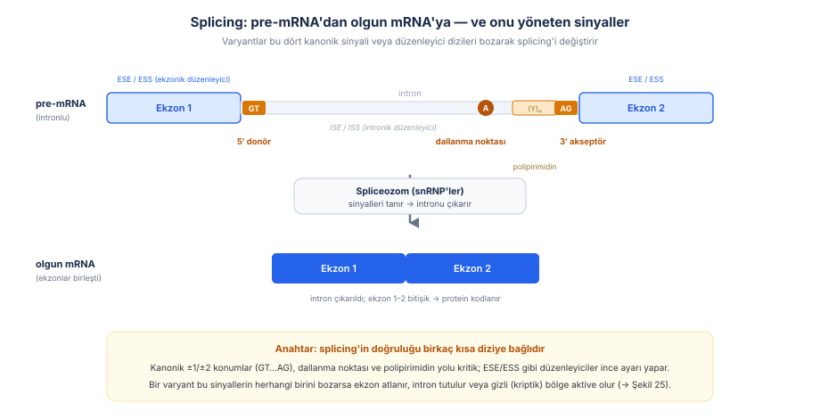
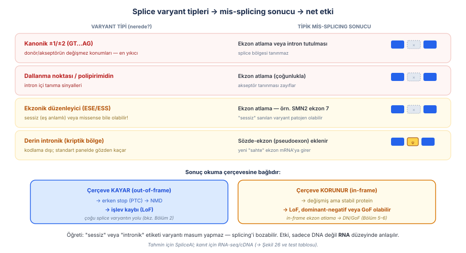
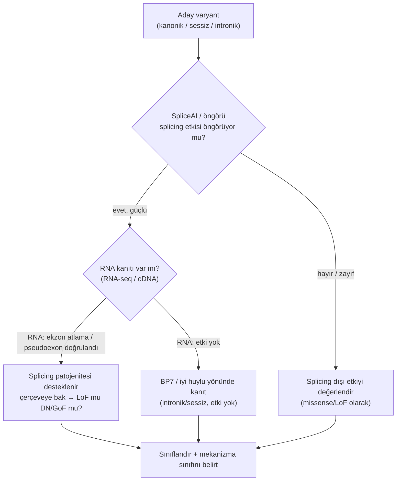
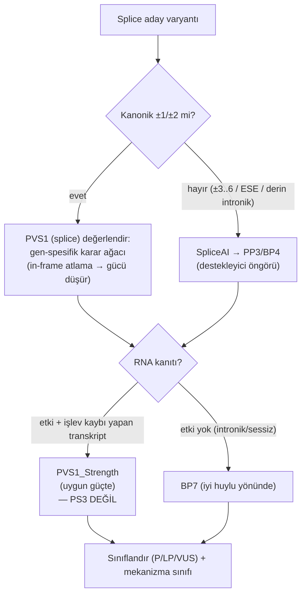
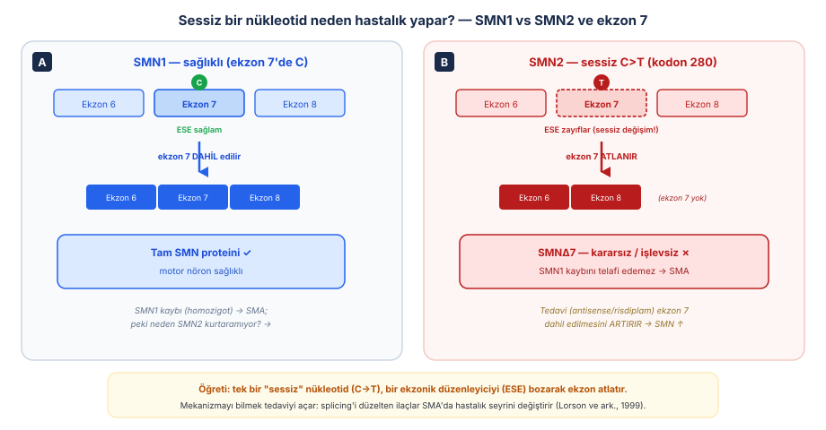
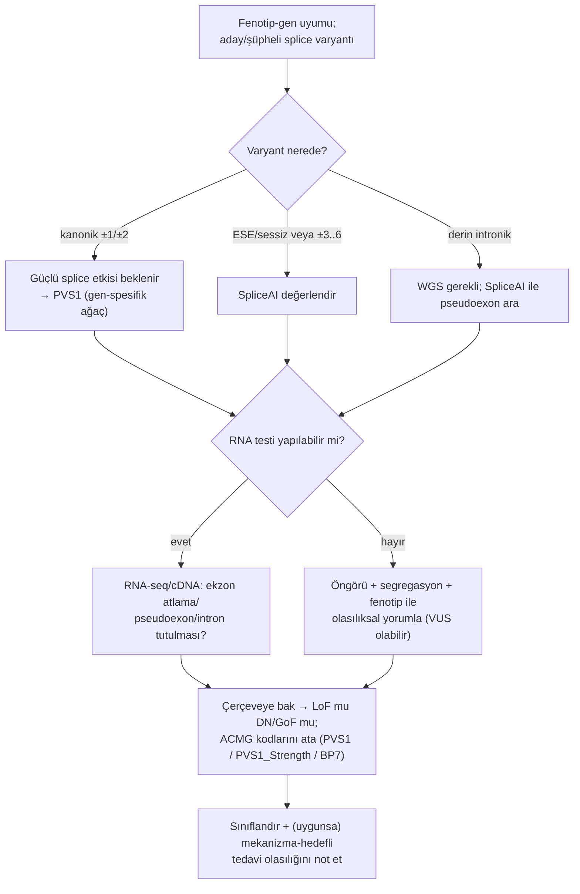

# Bölüm 7 — Splicing (Kırpılma) Varyantları

> **Bölümün çekirdek tezi:** Bir genin kodlayan bilgisi ekzonlara bölünmüştür; aradaki intronların çıkarılıp ekzonların doğru sırayla birleştirilmesi (**splicing/kırpılma**), spliceozom tarafından birkaç kısa "tanıma dizisi" üzerinden yürütülür: 5′ donör (*donor*, GT), 3′ akseptör (*acceptor*, AG), dallanma noktası (*branchpoint*) ve polipirimidin yolu, artı ekzon/intron içindeki düzenleyici diziler (ESE/ESS/ISE/ISS). Bu sinyallerden herhangi birini bozan bir varyant — **kanonik ±1/±2 konumdaki klasik splice varyantından**, bir ekzondaki **"sessiz" (eş anlamlı) değişime** ya da hiçbir proteini değiştirmeyen **derin intronik** bir nükleotide kadar — splicing'i saptırarak ekzon atlamasına, intron tutulmasına veya gizli (**kriptik splice bölgesi**, *cryptic splice site*) bölgelerin/sözde-ekzonların aktive olmasına yol açar. Sonuç çoğu kez okuma çerçevesini kaydırıp erken stop + NMD ile **işlev kaybı** üretir; ama çerçeve korunursa **dominant-negatif veya işlev kazanımı** da olabilir. Bu yüzden splicing, kitabın daha önceki tüm mekanizmalarını (LoF, DN, GoF) tek bir DNA katmanından besleyebilen, "varyantın nerede olduğu kadar RNA'ya ne yaptığı önemlidir" dersinin en saf örneğidir.

> **📘 Okuma katmanları.** Bu kitabın birincil hedefi **yandal asistanı ve klinik genomik çalışan hekimdir**; genel pediatrist ve tıp öğrencisi ikincil hedef kitledir. Bölümü kendi katmanınızdan okuyabilirsiniz:
> · **① Temel — tıp öğrencisi:** Şekil 7.1 ile splicing'in birkaç kısa sinyale bağlı olduğunu görün; Şekil 7.3 (SMN1/SMN2) "sessiz varyant masumdur" sezgisini tek başına yıkar.
> · **② Klinik — pediatrist ve klinisyen:** §4–§5: RNA analizi ne zaman istenir, hangi doku gerekir, negatif sonuç neyi dışlar.
> · **③ İleri düzey — yandal asistanı, laboratuvar, varyant yorumlayan:** §6: ClinGen SVI splice çerçevesi — RNA kanıtının PS3 ile değil **PVS1_Strength** ile kodlanması ve BP7'nin koşulları.

> 🖼️ **Görseller hakkında not:** Şekiller `assets/` klasöründe SVG, akış diyagramları Mermaid olarak gömülüdür.

---

## Öğrenme hedefleri

Bu bölümü tamamlayan okuyucu:
1. Splicing'in temel mekanizmasını ve kanonik sinyalleri (5′ donör GT, 3′ akseptör AG, dallanma noktası, polipirimidin yolu) ile düzenleyici dizileri (ESE/ESS/ISE/ISS) tanımlayabilir.
2. Splice varyantlarını yerine göre sınıflandırabilir: kanonik ±1/±2, dallanma/polipirimidin, ekzonik düzenleyici (sessiz dahil), derin intronik.
3. Mis-splicing sonuçlarını (ekzon atlama, intron tutulması, kriptik bölge aktivasyonu, sözde-ekzon eklenmesi) ve bunların okuma çerçevesine göre LoF mu yoksa DN/GoF mu ürettiğini açıklayabilir.
4. "Sessiz" (eş anlamlı) ve "derin intronik" varyantların neden patojen olabileceğini, SMN2 ekzon 7 örneğiyle gerekçelendirebilir.
5. Splice varyantını yakalamada **dizilemenin** rolünü ve etkisini kanıtlamada **RNA-seq/cDNA'nın** vazgeçilmezliğini açıklayabilir.
6. SpliceAI gibi öngörü araçlarının gücünü ve sınırını, in-siliko kanıtın (PP3/BP4) ve RNA kanıtının (PVS1_Strength / BP7) yerini açıklayabilir; RNA-splicing kanıtının neden PS3 ile kodlanmadığını gerekçelendirebilir.
7. Kanonik ±1/±2 splice varyantlarında **PVS1**'in nasıl ve hangi koşullarla uygulandığını (ClinGen SVI splice yaklaşımı) açıklayabilir.
8. Pediatrik genetikten splice örneklerini (SMN1/SMN2 ve SMA; NF1, CFTR, DMD ekzon atlama) mekanizma–fenotip–test–yorum zinciriyle ilişkilendirebilir.

---

## 1. Kavramsal tanım

İnsan genlerinin büyük kısmı parçalıdır: kodlayan **ekzonlar**, aralarına serpiştirilmiş kodlamayan **intronlar** ile bölünmüştür. Olgun bir mRNA elde etmek için hücre, pre-mRNA'dan intronları kesip çıkarmalı ve ekzonları doğru sırayla, **tek bir nükleotid kaymadan** birbirine eklemelidir. Bu işleme **splicing** (Türkçe "kırpılma" veya yaygın kullanımıyla "splicing") denir ve onu yürüten makine **spliceozom**dur — küçük nükleer RNP'lerden (snRNP) oluşan, dinamik bir moleküler montaj hattı.

Splicing'in olağanüstü doğruluğu birkaç **kısa tanıma dizisine** dayanır (Şekil 7.1). Her intronun başında neredeyse değişmez bir **5′ donör bölgesi** (çoğunlukla GT dinükleotidi), sonunda bir **3′ akseptör bölgesi** (AG) bulunur; intronun 3′ ucuna yakın bir **dallanma noktası** (bir adenin) ve onu izleyen **polipirimidin yolu**, akseptörün tanınmasını sağlar. Bunlara ek olarak ekzon ve intronların içinde, spliceozomu "buraya/şuraya" diye yönlendiren **düzenleyici diziler** vardır: ekzonik kırpılma güçlendiricileri/susturucuları (ESE/ESS) ve intronik karşılıkları (ISE/ISS).

Buradaki kritik kavramsal nokta şudur: **bu sinyaller çok kısa olduğu için, bir tek nükleotidlik değişim bile splicing'i bozabilir** — ve bu nükleotid proteini hiç değiştirmiyor (sessiz/eş anlamlı) ya da kodlayan bölgenin tamamen dışında (derin intronik) olabilir. Yani klasik "varyant proteini nasıl değiştirir?" sorusu burada yetersizdir; doğru soru "varyant **mRNA'nın nasıl monte edildiğini** değiştirir mi?"dir. Scotti ve Swanson (2016), splicing mekanizmasını ve mis-splicing'in giderek büyüyen bir hastalık grubunun temelinde yattığını derleyen kapsamlı bir çalışmada tam bu noktayı vurgular: spliceozom ve çok sayıda kırpılma faktörünün oluşturduğu bu karmaşıklık, splicing'i dizi polimorfizmlerine ve zararlı varyantlara özellikle **duyarlı** kılar (Scotti &amp; Swanson, 2016, *Nat Rev Genet*; [DOI](https://doi.org/10.1038/nrg.2015.3)).

Aşağıdaki tablo bölüm boyunca açacağımız kavramları bir arada gösterir.

**Tablo 7.1 — Splicing mekanizmasının temel kavramları**

| Kavram | Tanım | Klinik anlamı |
|--------|-------|---------------|
| **Kanonik splice bölgesi** | İntron başı GT / sonu AG; ±1/±2 konumlar | En öngörülebilir patojen splice varyantları; PVS1 zemini |
| **Dallanma noktası / polipirimidin** | 3′ akseptörün tanınmasını sağlayan intronik diziler | Bozulması ekzon atlamaya yol açar |
| **ESE / ESS** | Ekzonik kırpılma güçlendirici/susturucu | "Sessiz"/missense varyant splicing'i bozabilir (SMN2) |
| **Ekzon atlama (exon skipping)** | Bir ekzonun olgun mRNA'ya alınmaması | Çerçeveye göre LoF veya DN/GoF |
| **İntron tutulması** | İntronun çıkarılamayıp mRNA'da kalması | Genellikle PTC → NMD → LoF |
| **Kriptik bölge / sözde-ekzon** | Gizli bir splice bölgesinin aktive olması; sahte ekzon eklenmesi | Derin intronik varyantların yolu; SpliceAI ile yakalanır |
| **SpliceAI** | Diziye dayalı splice öngörü aracı (derin öğrenme) | İn-siliko kanıt (PP3/BP4); RNA ile doğrulanmalı |

---

## 2. Moleküler mekanizma

### 2.1. Bir sinyal bozulunca ne olur?

Splice varyantlarının ortak teması, spliceozomun bir ekzon-intron sınırını **yanlış okumasıdır**. Bunun birkaç tipik sonucu vardır (Şekil 7.2). En sık görülen, varyantın bulunduğu ekzonun **atlanmasıdır** (exon skipping): spliceozom o ekzonu tanıyamaz ve onu intronun bir parçasıymış gibi çıkarır. İkinci sık sonuç **intron tutulmasıdır** (intron retention): donör/akseptör tanınmazsa intron çıkarılamaz ve olgun mRNA'da kalır. Üçüncüsü, varyantın yeni bir **kriptik (gizli) splice bölgesi** oluşturması veya var olan birini güçlendirmesidir; bu, ekzonun bir kısmının kesilmesine ya da intronik bir parçanın eklenmesine yol açar. Özellikle **derin intronik** varyantlar, intronun ortasında uyuyan bir bölgeyi uyandırarak **sözde-ekzon (pseudoexon)** eklenmesine neden olabilir — kodlayan diziyi hiç değiştirmeyen bir varyantın nasıl hastalık yaptığının çarpıcı örneği.

> **🔬 Deep-dive — Aynı mis-splicing, zıt mekanizmalar: çerçeve her şeyi belirler.** Bir ekzonun atlanması ya da bir intronun tutulması, sonuçta okuma çerçevesini ya korur ya kaydırır — ve mekanizma sınıfı buna bağlıdır. **Çerçeve kayarsa** (atlanan/eklenen baz sayısı 3'ün katı değilse), aşağı akışta erken bir stop kodonu (PTC) oluşur; bu transkript çoğunlukla **NMD ile yıkılır** ve sonuç saf **işlev kaybıdır** (Bölüm 2'deki mekanizmanın bir splice versiyonu) (Khajavi, Inoue, Lupski, 2006, *Eur J Hum Genet*; [DOI](https://doi.org/10.1038/sj.ejhg.5201649)). **Çerçeve korunursa** (in-frame ekzon atlama), kısalmış ama stabil bir protein üretilir; bu ürün multimer oluşturup sağlamı zehirliyorsa **dominant-negatif** (Bölüm 5), yeni/aşırı bir aktivite kazanıyorsa **işlev kazanımı** (Bölüm 4–6) olabilir. Bu yüzden bir splice varyantını gördüğünüzde refleks, "RNA'ya ne olur **ve** çerçeve ne olur?" diye sormaktır — şiddet ve mekanizma sınıfı bu iki yanıttan çıkar. İlginç bir terapötik sonuç: bazı hastalıklarda (Duchenne MD) tedavi, **bilerek bir ekzonu atlatarak** out-of-frame bir transkripti in-frame'e çevirmeyi hedefler (ekzon atlama tedavisi) — yani mekanizmayı tersine çevirir.

### 2.2. "Sessiz" ve "intronik" varyantların aldatıcılığı

Splicing'in en önemli klinik dersi, varyant sınıflamasındaki iki yaygın yanılgıyı yıkmasıdır. Eş anlamlı (sessiz) bir varyant, amino asidi değiştirmediği için "iyi huylu" sanılır; oysa bir **ESE'yi bozarsa** ekzon atlamaya yol açıp ağır hastalık yapabilir. Benzer biçimde, kodlayan bölgenin çok uzağındaki **derin intronik** bir varyant "ilgisiz" sanılır; oysa bir **sözde-ekzon** yaratabilir. Jaganathan ve ark. (2019), diziden splicing'i öngören derin öğrenme modeli SpliceAI ile bu sınıfın boyutunu nicelleştirmiştir: sessiz ve intronik "splice-değiştirici" varyantlar RNA-seq'te yüksek oranda doğrulanır, popülasyonda güçlü biçimde elenir (zararlıdır) ve nadir genetik hastalıkların patojen varyantlarının tahminen **%9–11'ini** bu hafife alınan sınıf oluşturur (Jaganathan ve ark., 2019, *Cell*; [DOI](https://doi.org/10.1016/j.cell.2018.12.015)). Bu, "sadece kodlayan ekzonlara bakmak" stratejisinin neden hastaların önemli bir kısmını kaçırdığını açıklar.

---

## 3. Varyant tipleri

Splice varyantlarını okurken **iki ayrı basamağı** karıştırmamak gerekir. Birinci basamak, varyantın konumundan **hangi RNA sonucunun** doğabileceğidir. İkinci basamak, o RNA sonucunun **protein düzeyinde ne anlama geldiğidir**. Aşağıdaki iki tablo bu iki basamağı ayrı ayrı verir; birleştirildiğinde yorum hatası kaçınılmaz olur.

**Tablo 7.2 — Varyantın konumuna göre olası splicing sonuçları**

| Varyant konumu / mekanizması | Olası splicing sonuçları | Klinik yorum notu |
|---|---|---|
| **Kanonik bölge — donör `+1/+2`, akseptör `−2/−1`** | Tam veya kısmi ekzon atlama; tam/kısmi intron tutulması; kriptik donör ya da akseptör kullanımı; intronik dizinin bir kısmının ekzona eklenmesi; birden çok anormal transkriptin bir arada oluşması | LoF mekanizması ve öngörülen transkript sonucu uygunsa PVS1 karar ağacı uygulanır — **kanonik konum tek başına otomatik PVS1 değildir** (§6) |
| **Uzatılmış donör bölgesi (özellikle `+3…+6`)** | Doğal donörün zayıflaması → ekzon atlama, intron tutulması veya kriptik donör kullanımı | Kalibre edilmiş öngörü aracı gerekir; RNA analizi burada özellikle sınıflandırıcı olabilir |
| **Uzatılmış akseptör bölgesi (`−3`, polipirimidin traktı, AG-dışlama bölgesi)** | Ekzon atlama, intron tutulması, yeni ya da kriptik akseptör kullanımı | ⚠️ Donor tarafıyla simetrik bir "`−3…−6`" modeli **kullanılamaz**; akseptör tanınması daha geniş bir intronik bağlama dayanır |
| **Dallanma noktası (branchpoint)** | Ekzon atlama, tam/kısmi intron tutulması, alternatif branchpoint kullanımı, kriptik akseptör aktivasyonu | Bir intronda **birden çok** branchpoint bulunabilir; tahmin belirsizliği yüksektir, kritiklik varyant bazında doğrulanmalıdır |
| **Ekzonik düzenleyici eleman (ESE/ESS) veya yeni splice bölgesi oluşumu** | Ekzon tanınmasının **azalması ya da artması**; tam/kısmi ekzon atlama; intron tutulması | Varyant sinonim ya da missense olabilir; **protein etkisi ile splice etkisi ayrı ayrı** değerlendirilmelidir |
| **Derin intronik** | Pseudoekzon (sözde-ekzon) inklüzyonu, kriptik splice bölgesi aktivasyonu, kısmi/tam intron tutulması, doğal ekzonun atlanması | WES ve hedefli paneller yakalama tasarımına bağlı olarak kaçırır; WGS + öngörü aracı **adayı bulur**, patojen RNA sonucu tercihen ilgili dokuda RNA analiziyle doğrulanır |

Tabloyu okurken üç noktaya dikkat edin. **Birincisi, konum sonucu belirlemez.** Kanonik bir splice varyantı sıklıkla ekzon atlamaya yol açar, ama RNA sonucu varyantın konumundan tek başına kestirilemez — yukarıdaki altı sonucun herhangi biri ortaya çıkabilir. **İkincisi, ESE ve ESS zıt yönde çalışır**: bir ESE'nin bozulması ekzon tanınmasını azaltıp atlamayı artırırken, bir ESS'nin bozulması baskıyı kaldırıp **inklüzyonu artırabilir**; ikisini tek bir "ekzon atlama" satırına indirgemek yanlıştır. **Üçüncüsü, öngörü aracı sonucu değil adayı verir**: bir SpliceAI skoru hangi anormal transkriptin oluşacağını ya da anormal transkriptin oranını göstermez.

> **🔬 Deep-dive — *SMN2* ekzon 7 örneği neyi gösterir, neyi göstermez?** *SMN1* ile *SMN2* arasındaki ekzon 7'deki `C>T` farkı, translasyon açısından **sinonimdir** ve ekzon 7'nin inklüzyonunu azaltır; mekanizma ESE kaybı ve/veya ESS oluşumu modelleriyle açıklanır. Bu, dizilim değiştirmeden splicing bozulabileceğinin en öğretici örneğidir. Ancak örneği doğru çerçevelemek gerekir: bu, bir hastada saptanmış klasik bir "patojen sinonim varyant" değil, **paralog-spesifik alternatif splicing düzenlenmesi** örneğidir. Terminoloji notu: bu tür değişiklikler için "sessiz patojen" ifadesi yerine **splice-değiştirici sinonim varyant** demek daha doğrudur — "sessiz" sözcüğü tam da yanlış olan şeyi ima eder.

**Tablo 7.3 — Anormal transkriptin protein düzeyindeki sonucu**

| RNA sonucu | Olası moleküler sonuç |
|---|---|
| **Çerçeve dışı (out-of-frame)** | PTC oluşabilir → NMD; ya da NMD'den kaçan kesilmiş protein, hipomorfik etki, nadiren DN/GoF |
| **Çerçeve içi (in-frame) ekzon/dizi kaybı** | LoF, hipomorfik etki, DN, GoF **veya klinik olarak önemsiz** sonuç |
| **Çerçeve içi intronik ekleme** | Yeni amino asitler; protein kararsızlığı, domain bozukluğu ya da yeni işlev |
| **Normal transkriptin kısmen korunması** | Etki, anormal/normal transkript **oranına** bağlıdır; hipomorfik fenotip olasıdır |

⚠️ Bu ikinci tablonun en sık ihlal edilen kuralı şudur: **çerçeve içi sonuç otomatik olarak DN/GoF demek değildir.** İşlevsel bir domainin kaybı ya da protein kararsızlığı nedeniyle çerçeve içi bir delesyon pekâlâ basit LoF da üretebilir. Aynı biçimde çerçeve dışı sonuç da otomatik "tam null" değildir — NMD'den kaçış, kesilmiş proteinin kaderi ve kalan normal transkript oranı birlikte değerlendirilmelidir (Bölüm 2 §2).

---

## 4. Klinik fenotipe dönüşüm

Bölümün anahtar sorularını yanıtlayalım.

**Soru 1 — Splice varyantı hangi kalıtım/şiddeti yapar?** Buna tek bir yanıt yoktur; çünkü splice varyantı genin *hangi mekanizmaya* sürüklendiğine göre resesif LoF'tan dominant DN/GoF'a kadar her tabloyu üretebilir. Çoğu splice varyantı (özellikle çerçeve kaydıran kanonik olanlar) NMD üzerinden LoF yapar ve genin LoF-hastalık kalıbını izler (resesif veya haploinsufficiency). In-frame ekzon atlama ise dominant tablolar doğurabilir.

**Soru 2 — "Sessiz/intronik" bir varyant nasıl hastalık yapar?** ESE bozarak (sessiz) veya sözde-ekzon yaratarak (derin intronik). SMN1/SMN2 bunun ders kitabı örneğidir (§7.1).

**Soru 3 — Splicing etkisini nasıl kanıtlarız?** Öngörü (SpliceAI) bir *hipotez* verir; kanıt **RNA düzeyindedir** (RNA-seq veya hedefe yönelik cDNA/RT-PCR), çünkü yalnızca RNA, ekzonun gerçekten atlanıp atlanmadığını gösterir. Bu, §5 ve §6'nın merkezindeki ayrımdır.

Aşağıdaki Mermaid akışı, bir aday splice varyantından yoruma giden yolu özetler.

**Algoritma 7.1 — Splice varyantının transkript sonucuna göre sınıflanması**

---

## 5. Tanısal testlerle ilişkisi

Splice varyantlarında temel ayrım nettir: **DNA testleri varyantı bulur, ama splicing etkisini RNA gösterir.** Kanonik splice varyantları WES/WGS ile yakalanır; ancak **derin intronik** varyantlar yalnız WGS ile görülür (WES intronları kapsamaz). Burada bir basamak daha vardır: kısa okuma WGS intronları kapsasa da, tekrar bakımından zengin bölgelerdeki, yapısal olaylara gömülü veya karmaşık splice-bozucu lezyonları kaçırabilir; bu durumlarda **uzun okuma WGS** hem varyantı hem de onun bulunduğu haplotipi daha güvenilir gösterir. Etkinin *kanıtı* için ise RNA-seq veya hedefe yönelik cDNA/RT-PCR gerekir — bu, splice yorumunda RNA kanıtının (PVS1_Strength / BP7) neden bu kadar değerli olduğunu açıklar (§6).

**Tablo 7.4 — Splicing kusurlarını hangi test yakalar?**

| Test | Bu mekanizmayı yakalar mı? | Sınırlılığı |
|------|----------------------------|-------------|
| **WES** | ⚠️ Kısmen — kanonik/ekzon-yakını splice varyantlarını yakalar | Derin intronik varyantları kaçırır; etkiyi göstermez |
| **Short-read WGS** | ✅ Evet — derin intronik dahil DNA varyantını bulur | Splicing etkisini *kanıtlamaz* (RNA gerekir) |
| **Long-read WGS** | ✅ Evet; ayrıca izoform/faz çözümü | Maliyet/erişim |
| **Array-CGH / SNP array** | ❌ Hayır (nokta splice varyantı için) | Yalnız büyük kopya değişimi |
| **MLPA** | ❌ Hayır | Doz testi |
| **RNA-seq** | ✅✅ Etkiyi gösterir — ekzon atlama/pseudoexon/intron tutulması | Doğru doku/ifade gerekir; alel-spesifik analiz zor olabilir |
| **Methylation array** | ❌ Hayır | İlgisiz |
| **Karyotip** | ❌ Hayır | Çözünürlük yetersiz |

> **Bu mekanizmayı hangi test yakalar? (özet):** DNA varyantını **WGS (derin intronik dahil) / WES (kanonik)** bulur; splicing etkisini **RNA-seq / cDNA** kanıtlar. Pratikte güçlü SpliceAI öngörüsü olan bir varyant, mümkünse RNA düzeyinde doğrulanmalıdır — özellikle sessiz/derin intronik adaylarda.

---

## 6. Varyant yorumlama açısından önemi (ACMG/ClinGen)

Splice varyantları, ACMG/AMP çerçevesinde (Richards ve ark., 2015, *Genet Med*; [DOI](https://doi.org/10.1038/gim.2015.30)) **altı ayrı kriterle** ilişkilidir: PVS1, PS3, PP3, BS3, BP4 ve BP7. Bunların nasıl uygulanacağı uzun süre belirsizdi; ClinGen Sıra Varyant Yorumlama (SVI) Splice Alt Grubu bunu standardize etmiştir (Walker ve ark., 2023, *Am J Hum Genet*; [DOI](https://doi.org/10.1016/j.ajhg.2023.06.002)).

**PVS1 (splice) ve RNA kanıtının kodu.** Kanonik ±1/±2 splice varyantları "çok güçlü" kanıt adayıdır, ama otomatik değildir: öngörülen sonucun **gerçekten işlev kaybı** yapıp yapmadığı (örneğin in-frame ekzon atlama NMD'den kaçabilir ve PVS1 gücü düşebilir) gen-spesifik bir **PVS1 karar ağacıyla** değerlendirilmelidir; bu yaklaşım Abou Tayoun ve ark.'nın (2018) PVS1 iyileştirmesiyle uyumludur (*Hum Mutat*; [DOI](https://doi.org/10.1002/humu.23626)). Burada çoğu okuyucunun sezgisine ters gelen ve kolayca yanlış uygulanan bir nokta vardır: **RNA testinden gelen splicing kanıtı PS3 ile kodlanmaz.** Walker ve ark., bir RNA çalışması varyantın işlev kaybına yol açan transkript(ler) ürettiğini deneysel olarak gösteriyorsa, bunun **PVS1_Strength** kodunun yeniden amaçlanmasıyla (uygun güç düzeyinde) yakalanmasını önerir. **PS3/BS3 ise yalnızca**, RNA-splicing testlerinin doğrudan ölçmediği işlevsel etkiyi ölçen **iyi kurulmuş testler** için ayrılmıştır — örneğin ortaya çıkan proteinin enzimatik/hücresel işlevini gösteren bir çalışma. Kısacası: "ekzon atlandı" bir **splicing** kanıtıdır (PVS1_Strength), "protein çalışmıyor" bir **işlev** kanıtıdır (PS3). **PP3/BP4 (öngörü).** SpliceAI gibi kalibre edilmiş araçların öngörüsü, *destekleyici* in-siliko kanıt olarak kullanılır — tek başına tanı koydurmaz. **BP7 (etkisizlik kanıtı).** **İntronik veya sessiz** bir varyantın RNA düzeyinde **hiçbir splicing etkisi yapmadığı** gösterilirse bu, iyi huyluluk yönünde kanıt olarak BP7 ile kodlanır. **PS1.** Bilinen bir patojen varyantla **aynı öngörülen RNA-splicing etkisini** paylaşan bir varyant için PS1 uygulanabilir.

> **🟦 Klinikte dikkat — Öngörü ≠ kanıt:** SpliceAI'nin yüksek skoru güçlü bir *işarettir*, ama bir varyantın gerçekten ekzon atlattığını ancak **RNA görür**. Mümkünse (özellikle VUS'larda ve sessiz/derin intronik adaylarda) RNA testi isteyin; tersine, RNA'da etki yokluğu da değerli bir iyi huyluluk kanıtıdır (BP7). Öngörü aracını "kanıt" gibi raporlamayın.

Aşağıdaki akış, splice varyant yorumunu özetler.

**Algoritma 7.2 — Splice aday varyantında kriter seçimi**

---

## 7. Pediatrik genetikten klinik örnekler

### 7.1. SMN1 / SMN2 ve spinal müsküler atrofi — "sessiz" varyantın ders kitabı örneği

Spinal müsküler atrofi (SMA), splicing biyolojisinin pediatrik genetikteki en öğretici ve klinik açıdan en dönüştürücü örneğidir. SMA, *SMN1* geninin homozigot kaybından doğar; ancak çoğu insanda neredeyse özdeş bir kopya geni, *SMN2*, vardır. İlginç soru şudur: *SMN2* aynı proteini kodladığı hâlde neden *SMN1* kaybını telafi edemez? Lorson ve ark. (1999), yanıtın bir **splicing farkı** olduğunu göstermiştir. İki gen arasında yalnızca **beş nükleotid** farklıdır; yazarlar bu beş farkı tek tek minigen düzeneklerine taşıyarak hangisinin ekzon 7'nin alternatif kırpılmasını belirlediğini aramış ve yanıtı bulmuşlardır: ekzon 7'deki, proteini hiç değiştirmeyen **sessiz (eş anlamlı) C→T geçişi** (kodon 280) ekzon 7 atlanması için **gerekli ve yeterlidir**. Değişim bir **ekzonik kırpılma güçlendiricisinin (ESE) etkinliğini zayıflatır** ve ekzon 7 büyük ölçüde atlanır (Lorson ve ark., 1999, *PNAS*; [DOI](https://doi.org/10.1073/pnas.96.11.6307)). Ekzon 7'siz ürün (SMNΔ7) kararsız ve işlevsizdir; bu yüzden *SMN2*, yalnızca az miktarda tam-uzunlukta SMN üretebilir ve *SMN1* kaybını tam kapatamaz (Şekil 7.3).

Bu örneğin iki büyük dersi vardır. **Birincisi kavramsaldır:** "sessiz" bir nükleotid, amino asidi hiç değiştirmeden, bir düzenleyici diziyi bozarak ağır bir hastalığın belirleyicisi olabilir — varyant yorumunda eş anlamlı değişimleri otomatik iyi huylu saymanın tehlikesi. **İkincisi terapötiktir:** mekanizmayı bilmek tedaviyi açar. SMA, ekzon 7'nin atlanmasından kaynaklandığına göre, ekzon 7'nin **dahil edilmesini artıran** moleküller (antisens oligonükleotid ve küçük-molekül splicing düzenleyiciler) hastalık seyrini değiştirebilir — nitekim bu sınıf ilaçlar SMA tedavisini kökten dönüştürmüştür. Splice mekanizmasını anlamak, burada doğrudan klinik faydaya dönüşür.

### 7.2. NF1, CFTR ve DMD — splicing'in klinik genişliği

Splice varyantları birçok pediatrik gende belirgindir. **NF1** (nörofibromatozis tip 1), patojen varyantlarının önemli bir kısmının splicing'i bozduğu klasik bir örnektir; bu, NF1 tanısında RNA temelli analizin neden değerli olduğunu açıklar. **CFTR**'de (kistik fibrozis) hem kanonik splice varyantları hem de intronik düzenleyici diziler (örneğin intron 9'daki polipirimidin/poli-T uzunluğu) ekzon dahilini etkileyerek hastalık ağırlığını değiştirir — splicing'in "ya hep ya hiç" değil, **nicel** bir süreç olabileceğinin örneği. **DMD**'de (Duchenne ve Becker) ise splicing hem hastalık nedeni hem de tedavi aracıdır: Bölüm 2'de gördüğümüz okuma çerçevesi kuralı uyarınca, **terapötik ekzon atlama** out-of-frame bir transkripti in-frame'e çevirerek ağır Duchenne'i daha hafif Becker benzeri bir tabloya kaydırmayı hedefler. Bu üç örnek, splicing'in yalnız bir "varyant tipi" değil, tanı ve tedaviyi birlikte şekillendiren bir mekanizma ekseni olduğunu gösterir.

> **🧠 Hatırlatıcı:** Bir varyant "sessiz", "intronik" ya da "splice bölgesine yakın" diye etiketlendiyse refleksiniz *"SpliceAI ne diyor, RNA ne gösteriyor?"* olmalı. Splicing, kodlayan diziye bakarak göremeyeceğiniz patojeniteyi saklayabilir.

---

## 8. Sık yapılan hatalar

> **🔴 Sık yapılan hata kutusu**
> 1. **Eş anlamlı (sessiz) varyantı otomatik iyi huylu saymak.** ESE bozabilir → ekzon atlama (SMN2). Sessizlik masumiyet değildir.
> 2. **İntronik varyantı "ilgisiz" görmek.** Derin intronik varyant sözde-ekzon yaratabilir; nadir hastalık varyantlarının ~%9–11'i bu sınıftandır.
> 3. **SpliceAI öngörüsünü kanıt sanmak.** Öngörü hipotezdir; etkiyi RNA gösterir. Yüksek skoru "patojen kanıtı" gibi raporlamayın.
> 4. **RNA-splicing bulgusunu PS3 ile kodlamak.** ClinGen SVI, RNA'nın gösterdiği işlev-kaybı transkripti için **PVS1_Strength**'i önerir; PS3/BS3 yalnızca RNA-splicing testlerinin ölçmediği işlevsel etkiyi ölçen iyi kurulmuş testler içindir (Walker 2023).
> 5. **Kanonik ±1/±2'ye otomatik tam PVS1 vermek.** In-frame ekzon atlama NMD'den kaçabilir; gen-spesifik PVS1 karar ağacını uygulayın.
> 6. **Yalnız WES'e güvenip derin intronik varyantı aramamak.** Klinik şüphe güçlüyse WGS + RNA düşünün.

> **🟦 Klinikte dikkat kutusu**
> - Fenotip-gen uyumu güçlü ama "varyant yok" çıkan olgularda **splice/derin intronik** varyantları ve **RNA analizini** düşünün.
> - Splice varyantının şiddeti çerçeveye bağlıdır: out-of-frame → LoF; in-frame → DN/GoF olabilir.
> - Mekanizma bazen tedaviyi belirler (SMA'da ekzon dahili artırma; DMD'de ekzon atlama).

---

## 9. Klinik pratikte karar algoritması

**Algoritma 7.3 — Splice şüphesinde klinik karar akışı**

---

## 10. Kaynaklar

> **Atıf / doğrulama notu:** Bu bölümün bibliyografik verileri PubMed üzerinden doğrulanmıştır; her kaynağın PMID ve DOI'si tek tek teyit edilmiştir. Metin içinde yazar-yıl, kaynakçada DOI-link kullanılmıştır.

1. **Scotti MM, Swanson MS (2016).** RNA mis-splicing in disease. *Nature Reviews Genetics* 17(1):19–32. **PMID: 26593421** · DOI: [10.1038/nrg.2015.3](https://doi.org/10.1038/nrg.2015.3) — *Kullanım amacı: Splicing mekanizması ve mis-splicing hastalıklarının landmark derlemesi; sinyallerin varyantlara duyarlılığı.*
2. **Jaganathan K, Kyriazopoulou Panagiotopoulou S, McRae JF, ve ark. (2019).** Predicting Splicing from Primary Sequence with Deep Learning. *Cell* 176(3):535–548.e24. **PMID: 30661751** · DOI: [10.1016/j.cell.2018.12.015](https://doi.org/10.1016/j.cell.2018.12.015) — *Kullanım amacı: SpliceAI; sessiz/derin intronik kriptik splice varyantlarının öngörüsü ve patojen varyantların ~%9–11'ini oluşturması.*
3. **Walker LC, de la Hoya M, Wiggins GAR, ve ark. (2023).** Using the ACMG/AMP framework to capture evidence related to predicted and observed impact on splicing: Recommendations from the ClinGen SVI Splicing Subgroup. *American Journal of Human Genetics* 110(7):1046–1067. **PMID: 37352859** · DOI: [10.1016/j.ajhg.2023.06.002](https://doi.org/10.1016/j.ajhg.2023.06.002) — *Kullanım amacı: Splice varyantlarında ACMG kodlarının (PVS1/PS3/PP3/BP4/BP7/PS1) uygulanması; RNA kanıtının ağırlıklandırılması.*
4. **Lorson CL, Hahnen E, Androphy EJ, Wirth B (1999).** A single nucleotide in the SMN gene regulates splicing and is responsible for spinal muscular atrophy. *Proceedings of the National Academy of Sciences USA* 96(11):6307–6311. **PMID: 10339583** · DOI: [10.1073/pnas.96.11.6307](https://doi.org/10.1073/pnas.96.11.6307) — *Kullanım amacı: SMN2 ekzon 7 sessiz C>T → ESE zayıflaması → ekzon atlama → SMA; splice-değiştirici sinonim varyant kavramı ve mekanizma-hedefli tedavi temeli.*
5. **Abou Tayoun AN, Pesaran T, DiStefano MT, ve ark. (2018).** Recommendations for interpreting the loss of function PVS1 ACMG/AMP variant criterion. *Human Mutation* 39(11):1517–1524. **PMID: 30192042** · DOI: [10.1002/humu.23626](https://doi.org/10.1002/humu.23626) — *Kullanım amacı: Kanonik splice varyantlarında PVS1'in koşullu uygulanması (karar ağacı).*
6. **Richards S, Aziz N, Bale S, ve ark. (2015).** Standards and guidelines for the interpretation of sequence variants: a joint consensus recommendation of the American College of Medical Genetics and Genomics and the Association for Molecular Pathology. *Genetics in Medicine* 17(5):405–424. **PMID: 25741868** · DOI: [10.1038/gim.2015.30](https://doi.org/10.1038/gim.2015.30) — *Kullanım amacı: ACMG kriter çerçevesi; splice ile ilişkili altı kod.*
7. **Khajavi M, Inoue K, Lupski JR (2006).** Nonsense-mediated mRNA decay modulates clinical outcome of genetic disease. *European Journal of Human Genetics* 14(10):1074–1081. **PMID: 16757948** · DOI: [10.1038/sj.ejhg.5201649](https://doi.org/10.1038/sj.ejhg.5201649) — *Kullanım amacı: Çerçeve kaydıran splice sonuçlarının NMD ile LoF'a dönüşmesi.*

> **İkincil/destekleyici kaynak notu:** GeneReviews/OMIM/ClinVar/gnomAD ve gen-spesifik VCEP belgeleri yalnız destekleyicidir; gen-spesifik splice mekanizması ve PVS1 karar ağaçları güncel uzman-paneli kaynaklarıyla teyit edilmelidir.

---

## ✅ Bölüm öz-denetim tablosu

**Tablo 7.5 — Bölüm 7 öz-denetim tablosu**

| Kriter | Durum | Not |
|--------|-------|-----|
| Mekanizma doğru anlatıldı mı? | ✅ | Splice sinyalleri + mis-splicing sonuçları (Şekil 7.1–25) |
| Klinik bağlantı kuruldu mu? | ✅ | SMA (SMN1/SMN2), NF1, CFTR, DMD |
| Varyant tipi ile mekanizma ilişkilendirildi mi? | ✅ | §3 tablo + çerçeve→LoF/DN/GoF |
| Pediatrik örnek verildi mi? | ✅ | SMN1/SMN2 (SMA), DMD ekzon atlama |
| Test seçimi açıklandı mı? | ✅ | §5; DNA bulur, RNA kanıtlar; derin intronik→WGS |
| ACMG/ClinGen bağlantısı doğru mu? | ✅ | ClinGen SVI splice (Walker 2023); PVS1/PVS1_Strength/BP7 ayrımı doğrulama turunda düzeltildi |
| Kaynaklar PMID/DOI ile verildi mi? | ✅ | 7/7 |
| Spekülatif iddialar işaretlendi mi? | ✅ | Gen-spesifik PVS1/mekanizma için VCEP teyidi notu |
| Kaynak uydurma riski var mı? | ✅ Yok | Tümü PubMed MCP ile doğrulandı |
| Görsel/şema/algoritma desteği yeterli mi? (≥3 SVG, ≥2 Mermaid) | ✅ | 3 SVG (24–26) + 3 Mermaid |

---

### 🔎 Bölüm sonu kaynak doğrulama komutu (zorunlu)
> "Bu bölümdeki her kaynağın **türüne uygun kalıcı kimliğini** kontrol et: hakemli makalede PMID + DOI; kılavuz/uzman panel spesifikasyonunda kurum + sürüm + tarih + kalıcı bağlantı; veri tabanında veri sürümü + sorgu tarihi. Kimliği doğrulanamayan kaynağı çıkar. Kaynağı olmayan spesifik iddiayı 'kaynak doğrulaması gerekli' olarak işaretle. Kitabın kendi pedagojik çerçevesini doğrulamaya çalışma — 🏷️ ile etiketle." *(Politika 01.08.2026 uzman turunda güncellendi: eski 'PMID veya DOI veremediğin kaynağı çıkar' kuralı HGVS, ClinGen/CSpec, gnomAD sürüm notları gibi PMID'siz ama yetkili kaynakları dışlıyordu.)*
>
> **Bu bölüm için durum:** 7/7 kaynak PMID+DOI doğrulandı (PubMed MCP ile). İşaretlenen iddia: gen-spesifik PVS1 karar ağaçları ve mekanizma etiketleri için güncel VCEP/ClinGen teyidi önerilir (§6, §7.2). Bölüm, 27.07.2026 tarihli iddia-düzeyi doğrulama turundan geçmiştir; turda **RNA-splicing kanıtının kodlanması** (PS3 değil PVS1_Strength) Walker ve ark. 2023 özetiyle karşılaştırılarak düzeltilmiştir (bkz. `Dogrulama_Kutugu.md`).
>
> **Uzman değerlendirmesi turu (29.07.2026) — §3 varyant tipi tablosu yeniden kuruldu.** Uzman, tablonun **hiçbir satırının mevcut biçimiyle güvenli olmadığını** belirtti; altı düzeltme yapıldı. *(1)* "Kanonik ±1/±2" kısaltması **donör `+1/+2` ve akseptör `−2/−1`** olarak ayrıldı ve olası RNA sonuçları altıya çıkarıldı (tam/kısmi ekzon atlama, tam/kısmi intron tutulması, kriptik donör/akseptör kullanımı, intronik dizinin ekzona eklenmesi, birden çok anormal transkript) — **konum sonucu belirlemez**. *(2)* "Splice bölgesi ±3…±6" satırı **hatalıydı**: bu aralık donör tarafı için anlamlıdır, akseptör tarafı simetrik değildir (`−3`, polipirimidin traktı, AG-dışlama bölgesi ve daha geniş intronik bağlam); satır ikiye ayrıldı. *(3)* **ESE ile ESS aynı yönde gösteriliyordu** — oysa ESE bozulması ekzon atlamayı artırırken **ESS bozulması inklüzyonu artırır**; satır iki yönlü yazıldı. *(4)* Dallanma noktası satırı genişletildi (alternatif branchpoint kullanımı, kriptik akseptör aktivasyonu; bir intronda birden çok branchpoint bulunabilir). *(5)* Derin intronik satırı yalnız pseudoekzonla sınırlıydı; kriptik bölge aktivasyonu, kısmi/tam intron tutulması ve doğal ekzon atlaması eklendi, ayrıca **öngörü aracının sonucu değil adayı verdiği** yazıldı. *(6)* "Çerçeveye etki" satırı bu tablodan **çıkarıldı** — çünkü çerçeve, varyantın *yeri* değil oluşan RNA ürününün protein düzeyindeki *sonucudur*; ayrı bir **Tablo 7.3** olarak kuruldu ve "in-frame → DN/GoF" kestirmesi düzeltildi (çerçeve içi kayıp basit LoF da yapabilir; çerçeve dışı sonuç da otomatik tam null değildir). Ayrıca *SMN2* örneği bir deep-dive'a taşınarak **paralog-spesifik alternatif splicing düzenlenmesi** olduğu netleştirildi ve **"sessiz patojen" terimi terk edilip "splice-değiştirici sinonim varyant"** kullanıldı. Tablo numaraları buna göre kaydırıldı (eski 7.3 → 7.4, eski 7.4 → 7.5).
