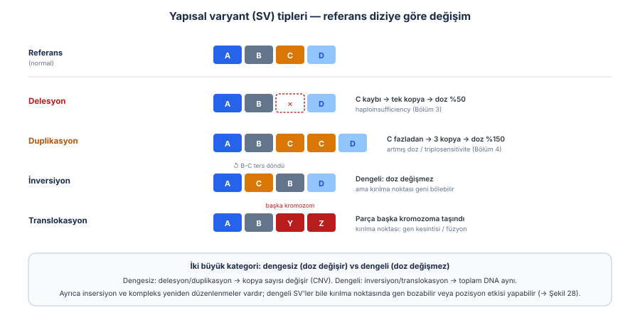
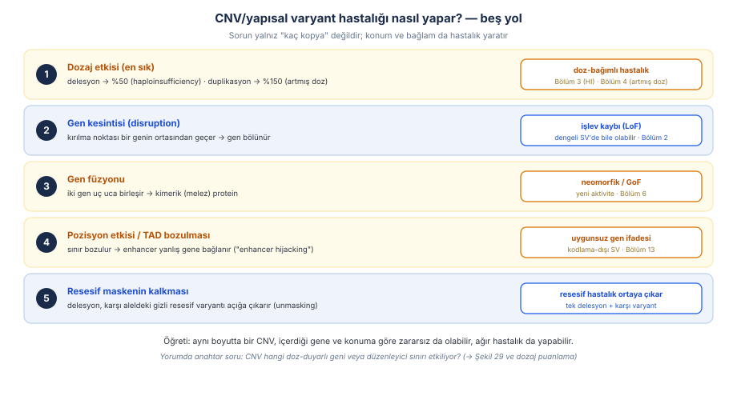
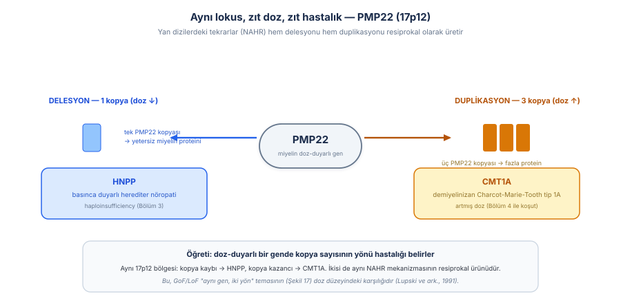
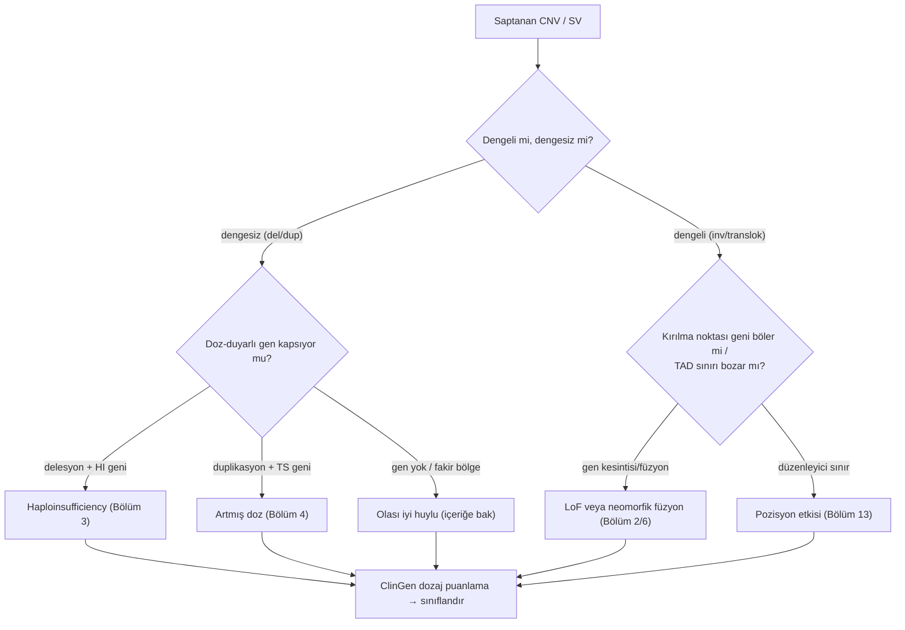
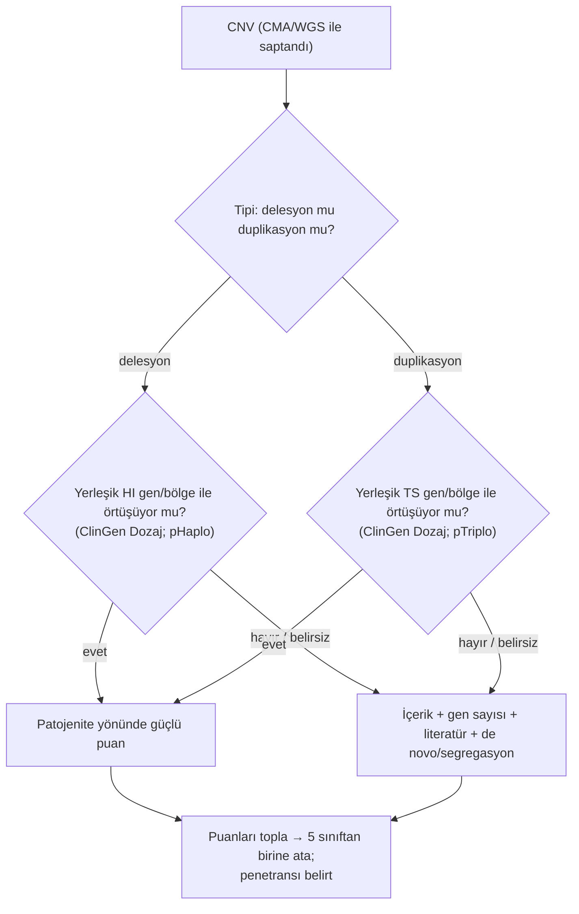
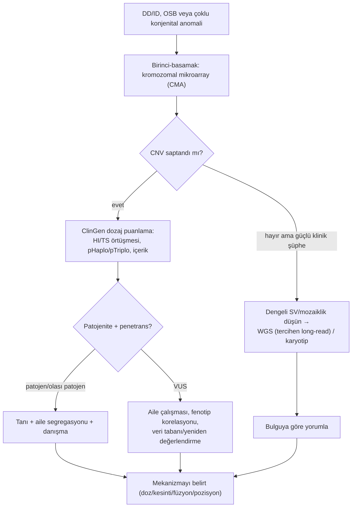

# Bölüm 8 — CNV ve Yapısal Varyantlar

> **Bölümün çekirdek tezi:** Şimdiye kadar tek nükleotid düzeyindeki varyantları işledik; bu bölüm ölçeği büyütür. **Yapısal varyantlar (SV)** — delesyon, duplikasyon, inversiyon, translokasyon, insersiyon ve kompleks yeniden düzenlenmeler — kilobazlardan megabazlara uzanan DNA parçalarını etkiler; bunların **kopya sayısını değiştirenleri** (delesyon/duplikasyon) **kopya sayısı varyantı (CNV)** olarak adlandırılır. CNV/SV'ler hastalığı tek bir yoldan değil, **beş ayrı yoldan** yapar: doz değişimi (delesyon→haploinsufficiency, duplikasyon→artmış doz), kırılma noktasının bir geni bölmesi, gen füzyonu, **pozisyon etkisi/TAD bozulması** (enhancer'ın yanlış gene bağlanması) ve karşı alleldeki resesif varyantın maskesinin kalkması. Bu yüzden CNV yorumunun anahtarı boyut değil, **hangi doz-duyarlı geni veya düzenleyici sınırı etkilediğidir** — aynı büyüklükte bir CNV zararsız da olabilir, ölümcül de. Bu bölüm, kitabın doz (Bölüm 3–4), neomorfik füzyon (Bölüm 6) ve düzenleyici (Bölüm 13) iplikçiklerini genomik ölçekte birleştirir ve tanıda **kromozomal mikroarray (CMA)** ile **ClinGen dozaj puanlamasını** merkeze koyar.

> **Bu bölüm nasıl okunmalı?** Tıp öğrencisi için omurga üç şekildir: Şekil 27 (SV tipleri — dengeli vs dengesiz), Şekil 28 (CNV'nin beş hastalık yolu) ve Şekil 29 (PMP22: aynı lokus, zıt doz, zıt hastalık). "CNV = sadece kaç kopya" sezgisini Şekil 28'in 2–5. yolları (kesinti, füzyon, pozisyon etkisi, maske kalkması) genişletir. Uzman okuyucu §5'te CMA'nın birinci-basamak rolüne ve §6'da ClinGen/ACMG dozaj puanlamasına (HI/TS, pHaplo/pTriplo) yoğunlaşabilir. Bölüm 3 (haploinsufficiency) ve Bölüm 4 (artmış doz) bu bölümün doz zeminidir; pozisyon etkisi Bölüm 13'e köprüdür.

> 🖼️ **Görseller hakkında not:** Şekiller `assets/` klasöründe SVG, akış diyagramları Mermaid olarak gömülüdür.

---

## Öğrenme hedefleri

Bu bölümü tamamlayan okuyucu:
1. Yapısal varyant tiplerini (delesyon, duplikasyon, inversiyon, translokasyon, insersiyon, kompleks) ve dengeli/dengesiz ayrımını tanımlayabilir.
2. CNV'lerin nasıl oluştuğunu (NAHR/tekrar dizileri, replikasyon temelli FoSTeS/MMBIR) ana hatlarıyla açıklayabilir.
3. CNV/SV'lerin hastalık yapma yollarını (doz, gen kesintisi, füzyon, pozisyon etkisi/TAD, resesif maskenin kalkması) örnekleyerek ayırt edebilir.
4. Delesyonun haploinsufficiency, duplikasyonun artmış doz üzerinden hastalık yaptığını ve PMP22 örneğinde resiprokal doz–hastalık ilişkisini açıklayabilir.
5. Pozisyon etkisi/TAD bozulmasının kodlamayan bir SV'yi nasıl patojen kıldığını gerekçelendirebilir.
6. CNV tanısında **kromozomal mikroarray (CMA)** ile karyotipin yerini, getiri farkını ve sınırlarını (dengeli/mozaik) açıklayabilir.
7. CNV yorumunda **ClinGen/ACMG dozaj puanlamasını** (haploinsufficiency/triplosensitivite; pHaplo/pTriplo) ana hatlarıyla uygulayabilir.
8. Pediatrik genetikten CNV örneklerini (CMT1A/HNPP, mikrodelesyon/mikroduplikasyon sendromları) mekanizma–fenotip–test–yorum zinciriyle ilişkilendirebilir.

---

## 1. Kavramsal tanım

Genetik varyasyonun büyük bir kısmı tek nükleotid değişimleri değil, **DNA segmentlerinin yapısal yeniden düzenlenmeleridir**. Bir parçanın kaybı (**delesyon**), fazladan kopyalanması (**duplikasyon**), ters çevrilmesi (**inversiyon**), başka bir konuma taşınması (**translokasyon**) ya da araya yeni dizi girmesi (**insersiyon**) — bunların hepsi yapısal varyanttır (Şekil 27). Bunlardan kopya sayısını değiştirenler (delesyon ve duplikasyon) **kopya sayısı varyantı (CNV)** olarak adlandırılır. Önemli bir kavramsal ayrım, **dengesiz** (kopya sayısı değişir: delesyon/duplikasyon) ve **dengeli** (toplam DNA aynı kalır: inversiyon/translokasyon) varyantlar arasındadır — ama dengeli bir varyant bile, kırılma noktası bir genin ortasından geçerse ya da düzenleyici bir sınırı bozarsa hastalık yapabilir.

CNV'lerin keşfi, insan genetik varyasyonuna bakışımızı değiştirmiştir. Stankiewicz ve Lupski (2010), mikroarray ve dizileme teknolojilerinin submikroskopik CNV'leri ortaya çıkardığını ve bunların — toplam nükleotid sayısı bakımından SNP'leri bile aşacak biçimde — insan çeşitliliğinin ve giderek artan sayıda hastalığın temelinde yattığını özetler; bu tür CNV-aracılı durumlar **genomik bozukluklar (genomic disorders)** olarak adlandırılır (Stankiewicz &amp; Lupski, 2010, *Annu Rev Med*; [DOI](https://doi.org/10.1146/annurev-med-100708-204735)). Buradaki kritik kavramsal nokta şudur: CNV'nin patojenitesi **boyutuyla değil içeriğiyle** belirlenir — büyük ama gen-fakir bir delesyon zararsız olabilirken, küçük ama doz-duyarlı bir geni kapsayan bir delesyon ağır hastalık yapabilir.

Aşağıdaki tablo bölüm boyunca açacağımız kavramları bir arada gösterir.

| Kavram | Tanım | Klinik anlamı |
|--------|-------|---------------|
| **CNV** | Kopya sayısını değiştiren varyant (delesyon/duplikasyon) | Doz değişimi → HI veya artmış doz |
| **Dengesiz vs dengeli SV** | Kopya değişir / değişmez | Dengeli SV bile kırılma noktasında zarar verebilir |
| **Genomik bozukluk** | Tekrarlayan CNV'lerin yol açtığı sendrom | Mikrodelesyon/mikroduplikasyon sendromları |
| **NAHR** | Tekrar dizileri arası yanlış rekombinasyon | Tekrarlayan (recurrent) CNV'lerin ana mekanizması |
| **Triplosensitivite (TS)** | Fazladan kopyaya duyarlılık | Duplikasyonun patojen olabilmesi |
| **Pozisyon etkisi / TAD** | Düzenleyici mimarinin bozulması | Kodlamayan SV'lerin patojenitesi (Bölüm 13) |
| **CMA** | Kromozomal mikroarray (CNV testi) | DD/ID/MCA'da birinci-basamak test |

---

## 2. Moleküler mekanizma

### 2.1. CNV'ler nasıl oluşur?

CNV'lerin oluşumunda iki büyük mekanizma sınıfı vardır. **Rekombinasyon temelli** mekanizmaların başında **NAHR (non-allelic homologous recombination)** gelir: genomda birbirine çok benzeyen **tekrar dizileri** (düşük-kopya tekrarlar/segmental duplikasyonlar) yan yana bulunduğunda, hücre menyoz sırasında bunları yanlışlıkla hizalayıp aralarındaki bölgeyi ya siler ya da çoğaltır. NAHR'nin en öğretici özelliği **resiprokal** olmasıdır: aynı tekrar çifti hem delesyon hem de duplikasyon üretir — bu yüzden belirli bölgelerde tekrarlayan (recurrent), aynı sınırlara sahip CNV'ler görülür. **Replikasyon temelli** mekanizmalar (FoSTeS/MMBIR), DNA replikasyon çatalının duraklayıp yanlış bir şablona atlamasıyla daha karmaşık, tekrarlamayan (non-recurrent) yeniden düzenlenmeleri açıklar (Stankiewicz &amp; Lupski, 2010; [DOI](https://doi.org/10.1146/annurev-med-100708-204735)). Bu mekanizma bilgisi kliniktir: tekrarlayan mikrodelesyon sendromları (örneğin 17p12, 22q11.2) NAHR ile açıklanır ve bu, neden belirli bölgelerin "sıcak nokta" olduğunu gösterir.

### 2.2. CNV/SV hastalığı nasıl yapar? — beş yol

Bir CNV'nin patojen olup olmadığını anlamanın anahtarı, onun hangi **mekanizma yoluyla** etki ettiğini sormaktır (Şekil 28).

**Birinci ve en sık yol dozajdır.** Doz-duyarlı bir geni kapsayan **delesyon** o genin dozunu %50'ye indirir (haploinsufficiency, Bölüm 3); **duplikasyon** ise %150'ye çıkarır (artmış doz/triplosensitivite, Bölüm 4). **İkinci yol gen kesintisidir:** bir kırılma noktası bir genin ortasından geçerse geni bölerek işlevsizleştirir — ve bu, kopya sayısını hiç değiştirmeyen **dengeli** bir translokasyon/inversiyonda bile olabilir. **Üçüncü yol gen füzyonudur:** iki gen uç uca birleşip kimerik (melez) bir protein oluşturur; bu, normalde olmayan yeni bir aktivite (neomorfik/GoF, Bölüm 6) taşıyabilir — özellikle kanser biyolojisinde sıktır. **Dördüncü yol pozisyon etkisidir** (§2.3). **Beşinci yol resesif maskenin kalkmasıdır:** bir delesyon, karşı alleldeki gizli bir resesif varyantı "açığa çıkarır" (unmasking) ve tek bir delesyon, beklenmedik bir resesif hastalığa yol açar.

> **🔬 Deep-dive — Aynı CNV neden bir kişide hastalık yaparken diğerinde yapmaz?** CNV yorumunun en zor yanı **değişken penetrans ve ekspresivitedir** (Bölüm 1). Bazı tekrarlayan CNV'ler (örneğin 16p11.2) "duyarlılık" CNV'leridir: hastalık riskini artırır ama tek başına belirleyici değildir; sağlıklı taşıyıcılarda da bulunabilir. Bunun nedenleri arasında genetik arka plan, ikinci bir "vuruş" (two-hit modeli), ve doz-duyarlılığın kişiden kişiye eşik farkı sayılabilir. Bu yüzden bir CNV raporu "patojen/iyi huylu" ikiliğine her zaman sığmaz; "patojenite **ve** penetrans" birlikte düşünülmelidir. Pratik sonuç: bir duyarlılık CNV'si bulunduğunda aile çalışması (segregasyon) ve fenotip korelasyonu kritik hale gelir.

### 2.3. Pozisyon etkisi ve TAD bozulması

CNV/SV'lerin en ince yolu, hiçbir geni silmeden veya çoğaltmadan, genlerin **düzenleyici mimarisini** bozmaktır. Genom, **topolojik ilişkili alanlara (TAD)** bölünmüştür; bu alanların sınırları (CTCF-ilişkili), enhancer'ların yalnız "kendi" genleriyle temas etmesini sağlar. Lupiáñez ve ark. (2015), bir TAD sınırını bozan delesyon, inversiyon veya duplikasyonların bu yalıtımı kaldırarak bir enhancer kümesinin **yanlış bir geni uygunsuz biçimde aktive etmesine** ("enhancer hijacking") yol açtığını ve bunun insan ekstremite malformasyonlarına neden olduğunu göstermiştir; üstelik bu etki yalnız varyant bir **CTCF sınırını** bozduğunda ortaya çıkar (Lupiáñez ve ark., 2015, *Cell*; [DOI](https://doi.org/10.1016/j.cell.2015.04.004)). Bu çalışma, kodlamayan bölgelerdeki yapısal varyantların patojenitesini öngörmek için somut bir ölçüt sunar ve splicing (Bölüm 7) ile birlikte "varyant bir proteini değiştirmeden de hastalık yapabilir" dersini pekiştirir (ayrıntı Bölüm 13).

---

## 3. Varyant tipleri

| SV tipi | Doz etkisi | Tipik hastalık yolu |
|---|---|---|
| **Delesyon** | ↓ (kopya kaybı) | Haploinsufficiency; resesif maske kalkması; gen kesintisi |
| **Duplikasyon** | ↑ (kopya kazancı) | Artmış doz/triplosensitivite; bazen kesinti |
| **İnversiyon (dengeli)** | yok | Kırılma noktası gen kesintisi; pozisyon etkisi |
| **Translokasyon (dengeli)** | yok | Gen kesintisi; gen füzyonu; pozisyon etkisi |
| **İnsersiyon** | ↑ (eklenen dizi) | Gen kesintisi; düzenleyici bozulma |
| **Kompleks yeniden düzenlenme** | değişken | Birden çok yol birlikte |

Pratik özet: **dengesiz** varyantlarda (delesyon/duplikasyon) ilk düşünülecek yol **dozdur**; **dengeli** varyantlarda (inversiyon/translokasyon) ise doz normaldir, bu yüzden mekanizma **kırılma noktası** (gen kesintisi/füzyon) veya **pozisyon etkisidir**. Her iki durumda da soru aynıdır: bu varyant hangi doz-duyarlı geni veya düzenleyici sınırı etkiliyor?

---

## 4. Klinik fenotipe dönüşüm

Bölümün anahtar sorularını yanıtlayalım.

**Soru 1 — Bir CNV'nin patojen olup olmadığını ne belirler?** Boyutu değil, **içeriği**: kapsadığı genlerin doz duyarlılığı (haploinsufficiency/triplosensitivite), bilinen bir genomik bozukluk bölgesiyle örtüşüp örtüşmediği ve düzenleyici sınırları bozup bozmadığı. ClinGen dozaj puanlaması tam bunu sistematize eder (§6).

**Soru 2 — Delesyon mu duplikasyon mu daha ağır?** Gene bağlıdır; tek bir kural yoktur. PMP22 (Şekil 29) bunun klasik örneğidir: aynı 17p12 bölgesinin **delesyonu HNPP** (basınca duyarlı nöropati, haploinsufficiency), **duplikasyonu CMT1A** (demiyelinizan nöropati, artmış doz) yapar — aynı lokus, zıt doz, zıt hastalık.

PMP22 örneği, Bölüm 4'teki "aynı gen, iki yön" temasının (RET, SCN2A) doz düzeyindeki karşılığıdır: orada varyantın *yönü* (GoF/LoF), burada kopya sayısının *yönü* (kayıp/kazanç) zıt fenotipler üretir. Lupski ve ark. (1991), CMT1A'nın 17p'deki bir **duplikasyondan** kaynaklandığını gösteren landmark çalışmada, doz değişiminin tek başına bir Mendel hastalığı yapabileceğini kanıtlamıştır (Lupski ve ark., 1991, *Cell*; [DOI](https://doi.org/10.1016/0092-8674(91)90613-4)).

**Soru 3 — CNV neden değişken seyreder?** Penetrans/ekspresivite farkları, duyarlılık CNV'leri ve ikinci-vuruş etkileri nedeniyle (§2.2 deep-dive). Bu yüzden aile çalışması ve fenotip korelasyonu yorumun ayrılmaz parçasıdır.

Aşağıdaki Mermaid, bir CNV'nin mekanizmasına nasıl gidileceğini özetler.

---

## 5. Tanısal testlerle ilişkisi

CNV/SV'lerde test seçimi, varyantın **tipine ve boyutuna** göre değişir. Kopya-sayısı değişimleri için altın standart **kromozomal mikroarray (CMA)**'dır. Miller ve ark. (2010), gelişimsel gerilik/zihinsel yetersizlik, otizm spektrum bozukluğu veya çoklu konjenital anomalisi olan bireylerde CMA'nın tanısal getirisinin (%15–20) karyotipinkinden (~%3) çok daha yüksek olduğunu göstererek CMA'yı **birinci-basamak test** olarak önermiştir; karyotip ise yalnız belirgin kromozomal sendromlar, dengeli yeniden düzenlenme aile öyküsü veya tekrarlayan düşük öyküsü için saklanmalıdır (Miller ve ark., 2010, *Am J Hum Genet*; [DOI](https://doi.org/10.1016/j.ajhg.2010.04.006)). Önemli sınır: CMA **dengeli** yeniden düzenlenmeleri (translokasyon/inversiyon) ve düşük düzey mozaikliği göremez.

| Test | Bu mekanizmayı yakalar mı? | Sınırlılığı |
|------|----------------------------|-------------|
| **WES** | ⚠️ Kısmen — ekzonik CNV'ler çağrılabilir | Çözünürlük/duyarlılık sınırlı; dengeli SV'yi göremez |
| **Short-read WGS** | ✅ Evet — CNV + dengeli SV (kırılma noktası) | Tekrar bölgelerinde kırılma noktası çözümü zor |
| **Long-read WGS** | ✅✅ En iyi — kırılma noktaları, tekrarlar, kompleks SV | Maliyet/erişim |
| **Array-CGH / SNP array (CMA)** | ✅✅ Dengesiz CNV için altın standart; SNP array UPD/AOH de gösterir | Dengeli SV ve düşük mozaikliği göremez |
| **MLPA** | ✅ Hedefe yönelik (tek gen/ekzon doz) | Yalnız test edilen bölgeye bakar |
| **RNA-seq** | ⚠️ Dolaylı — füzyon transkriptini/ifade değişimini gösterir | Doz/CNV'yi doğrudan ölçmez |
| **Methylation array** | ⚠️ Dolaylı — imprinting bölgesi CNV etkisini yansıtabilir | Özel bağlam (Bölüm 10) |
| **Karyotip** | ✅ Büyük (>5–10 Mb) ve dengeli yeniden düzenlenme | Submikroskopik CNV'yi kaçırır |

> **Bu mekanizmayı hangi test yakalar? (özet):** Dengesiz CNV'leri **CMA (array)** birinci-basamak olarak yakalar; **dengeli** yeniden düzenlenmeler ve kırılma noktası çözümü için **WGS (tercihen long-read)** veya karyotip gerekir. Hedefe yönelik doz sorusu için **MLPA** kullanılır.

---

## 6. Varyant yorumlama açısından önemi (ACMG/ClinGen)

CNV yorumu, dizi varyantlarından ayrı bir çerçeve kullanır: **ClinGen/ACMG teknik standartları** (Riggs ve ark., 2020, *Genet Med*; [DOI](https://doi.org/10.1038/s41436-019-0686-8)). Bu sistem, bir CNV'yi puanlayarak (kanıt kategorilerine sayısal ağırlık vererek) beş sınıfa ayırır: patojen, olası patojen, VUS, olası iyi huylu, iyi huylu. Puanlamanın kalbinde **dozaj duyarlılığı** vardır: CNV, **haploinsufficiency (HI)** veya **triplosensitivite (TS)** açısından yerleşik bir gen/bölgeyle örtüşüyor mu? ClinGen Dozaj Haritası, genleri ve bölgeleri HI ve TS kanıt düzeylerine göre derecelendirir; delesyon yorumunda HI skoru, duplikasyon yorumunda TS skoru belirleyicidir.

Bu puanlamayı popülasyon-ölçekli metrikler tamamlar. Collins ve ark. (2022), büyük popülasyon verisinden her gen için **pHaplo** (haploinsufficiency olasılığı) ve **pTriplo** (triplosensitivite olasılığı) skorlarını türeterek, bir genin doz kaybına mı yoksa kazancına mı duyarlı olduğunu nicel olarak öngörmüştür (Collins ve ark., 2022, *Cell*; [DOI](https://doi.org/10.1016/j.cell.2022.06.036)). Bu metrikler, özellikle yeni/literatürde az tanımlı CNV'lerin yorumunda destekleyici kanıt sağlar.

> **🟦 Klinikte dikkat — Boyut değil içerik; ve penetransı unutma:** Bir CNV'yi raporlarken refleksiniz "kaç Mb?" değil, "hangi doz-duyarlı geni/bölgeyi kapsıyor ve HI/TS kanıtı ne?" olmalı. Ayrıca duyarlılık CNV'lerinde (örn. 16p11.2) "patojen" etiketi tek başına yetmez; **penetrans ve aile segregasyonu** rapora yansıtılmalıdır. Gen-fakir büyük bir CNV iyi huylu olabilirken, küçük ama HI bir geni silen CNV patojendir.

Aşağıdaki akış CNV yorumunu özetler.

---

## 7. Pediatrik genetikten klinik örnekler

### 7.1. PMP22 (17p12): CMT1A ve HNPP — doz yönünün ders kitabı örneği

CMT1A/HNPP ikilisi, doz-duyarlılığın en saf klinik gösterimidir (§4, Şekil 29). 17p12'deki *PMP22* genini kapsayan ~1.4 Mb'lik bölge, yan dizilerindeki tekrarlar (CMT1A-REP) nedeniyle NAHR için bir sıcak noktadır ve bu mekanizma **resiprokal** olarak hem duplikasyon hem delesyon üretir. **Duplikasyon** (üç *PMP22* kopyası) fazla miyelin proteinine ve **CMT1A**'ya (demiyelinizan periferik nöropati) yol açar; **delesyon** (tek kopya) yetersiz proteine ve **HNPP**'ye (basınç paralizilerine yatkın herediter nöropati) yol açar (Lupski ve ark., 1991; [DOI](https://doi.org/10.1016/0092-8674(91)90613-4)). Bu örneğin dersi: bir gen doza duyarlıysa, kopya sayısının yönü doğrudan farklı hastalıklara çevrilir — ve bu, NAHR mekanizmasının neden bu iki hastalığı "ikiz" yaptığını açıklar.

### 7.2. Mikrodelesyon / mikroduplikasyon sendromları — genomik bozukluklar

Pediatrik genetikte CNV'lerin büyük kısmı **tekrarlayan mikrodelesyon/mikroduplikasyon sendromları** olarak karşımıza çıkar. Bunlar belirli genomik "sıcak noktalardaki" NAHR ürünleridir ve her biri tanınabilir bir fenotip kümesi (gelişimsel gerilik, dismorfi, konjenital anomaliler, nöropsikiyatrik özellikler) taşır. Örnekler arasında 22q11.2 delesyonu (DiGeorge/velokardiyofasiyal), 7q11.23 delesyonu (Williams), 17p11.2 delesyon/duplikasyonu (Smith-Magenis/Potocki-Lupski — resiprokal) ve 16p11.2 (değişken penetranslı duyarlılık CNV'si) sayılabilir. 15q11-q13 bölgesi ise CNV ile imprinting'in kesiştiği özel bir durumdur (Prader-Willi/Angelman) ve Bölüm 10'da ayrıca işlenecektir. Bu sendromların ortak dersi, **aynı bölgenin tekrarlayan CNV'sinin öngörülebilir bir klinik tablo** yaratmasıdır — bu da CMA'nın neden yüksek tanısal getiri sağladığını açıklar.

> **🧠 Hatırlatıcı:** Açıklanamayan gelişimsel gerilik/ID, OSB veya çoklu konjenital anomali → refleks **CMA (birinci-basamak)**. Bir CNV bulunduğunda ise refleks "boyut değil, hangi doz-duyarlı gen/bölge ve HI/TS kanıtı?" + penetrans/segregasyon.

---

## 8. Sık yapılan hatalar

> **🔴 Sık yapılan hata kutusu**
> 1. **CNV'yi boyutuna göre yorumlamak.** Büyük ama gen-fakir CNV iyi huylu, küçük ama HI geni silen CNV patojen olabilir. İçeriğe bakın.
> 2. **Duplikasyonu otomatik "delesyondan hafif" saymak.** PMP22'de duplikasyon (CMT1A) belirgin hastalık yapar; triplosensitiviteyi unutmayın.
> 3. **Dengeli SV'yi "zararsız" saymak.** Kırılma noktası bir geni bölebilir veya TAD sınırını bozabilir (pozisyon etkisi).
> 4. **CMA negatif diye dengeli/mozaik varyantı dışlamak.** CMA dengeli yeniden düzenlenmeleri ve düşük mozaikliği göremez; klinik şüphede WGS/karyotip düşünün.
> 5. **Duyarlılık CNV'sini kesin tanı gibi raporlamak.** Penetransı ve aile segregasyonunu belirtin.

> **🟦 Klinikte dikkat kutusu**
> - DD/ID/MCA'da birinci-basamak test CMA'dır (karyotip değil).
> - Kodlamayan bölgedeki büyük SV'ler pozisyon etkisi (TAD) yapabilir; "gen içermiyor" demek "zararsız" demek değildir.
> - Yorumda ClinGen dozaj puanlaması + pHaplo/pTriplo + penetrans birlikte değerlendirilir.

---

## 9. Klinik pratikte karar algoritması

---

## 10. Kaynaklar

> **Atıf / doğrulama notu:** Bu bölümün bibliyografik verileri PubMed üzerinden doğrulanmıştır; her kaynağın PMID ve DOI'si tek tek teyit edilmiştir. Metin içinde yazar-yıl, kaynakçada DOI-link kullanılmıştır.

1. **Stankiewicz P, Lupski JR (2010).** Structural variation in the human genome and its role in disease. *Annu Rev Med* 61:437-455. **PMID: 20059347** · DOI: [10.1146/annurev-med-100708-204735](https://doi.org/10.1146/annurev-med-100708-204735) — *Kullanım amacı: SV/CNV landmark derlemesi; genomik bozukluklar; NAHR ve replikasyon temelli (FoSTeS) oluşum mekanizmaları.*
2. **Lupski JR, de Oca-Luna RM, Slaugenhaupt S, ve ark. (1991).** DNA duplication associated with Charcot-Marie-Tooth disease type 1A. *Cell* 66(2):219-232. **PMID: 1677316** · DOI: [10.1016/0092-8674(91)90613-4](https://doi.org/10.1016/0092-8674(91)90613-4) — *Kullanım amacı: Landmark dozaj CNV; 17p duplikasyonu → CMT1A; doz değişiminin Mendel hastalığı yapması.*
3. **Lupiáñez DG, Kraft K, Heinrich V, ve ark. (2015).** Disruptions of topological chromatin domains cause pathogenic rewiring of gene-enhancer interactions. *Cell* 161(5):1012-1025. **PMID: 25959774** · DOI: [10.1016/j.cell.2015.04.004](https://doi.org/10.1016/j.cell.2015.04.004) — *Kullanım amacı: TAD bozulması/pozisyon etkisi; enhancer hijacking; kodlamayan SV patojenitesi (Bölüm 13 köprüsü).*
4. **Miller DT, Adam MP, Aradhya S, ve ark. (2010).** Consensus statement: chromosomal microarray is a first-tier clinical diagnostic test for individuals with developmental disabilities or congenital anomalies. *Am J Hum Genet* 86(5):749-764. **PMID: 20466091** · DOI: [10.1016/j.ajhg.2010.04.006](https://doi.org/10.1016/j.ajhg.2010.04.006) — *Kullanım amacı: CMA birinci-basamak test; getiri (%15–20 vs ~%3); dengeli/mozaik sınırları.*
5. **Riggs ER, Andersen EF, Cherry AM, ve ark. (2020).** Technical standards for the interpretation and reporting of constitutional copy-number variants (ACMG/ClinGen). *Genet Med* 22(2):245-257. **PMID: 31690835** · DOI: [10.1038/s41436-019-0686-8](https://doi.org/10.1038/s41436-019-0686-8) — *Kullanım amacı: CNV dozaj puanlaması (HI/TS); CNV sınıflandırma çerçevesi.*
6. **Collins RL, Glessner JT, Porcu E, ve ark. (2022).** A cross-disorder dosage sensitivity map of the human genome. *Cell* 185(16):3041-3055. **PMID: 35917817** · DOI: [10.1016/j.cell.2022.06.036](https://doi.org/10.1016/j.cell.2022.06.036) — *Kullanım amacı: pHaplo/pTriplo dozaj duyarlılığı metrikleri; CNV yorumunda destekleyici kanıt.*

> **İkincil/destekleyici kaynak notu:** GeneReviews/OMIM/ClinVar/DECIPHER/ClinGen Dozaj Haritası yalnız destekleyicidir; gen/bölge-spesifik HI/TS ve penetrans iddiaları güncel ClinGen/VCEP kaynaklarıyla teyit edilmelidir.

---

## ✅ Bölüm öz-denetim tablosu
| Kriter | Durum | Not |
|--------|-------|-----|
| Mekanizma doğru anlatıldı mı? | ✅ | SV tipleri + 5 hastalık yolu + NAHR/TAD (Şekil 27–28) |
| Klinik bağlantı kuruldu mu? | ✅ | CMT1A/HNPP, mikrodelesyon sendromları |
| Varyant tipi ile mekanizma ilişkilendirildi mi? | ✅ | §3 tablo + dengeli/dengesiz |
| Pediatrik örnek verildi mi? | ✅ | PMP22 (CMT1A/HNPP), 22q11/Williams/SMS |
| Test seçimi açıklandı mı? | ✅ | §5; CMA birinci-basamak; dengeli→WGS/karyotip |
| ACMG/ClinGen bağlantısı doğru mu? | ✅ | Riggs 2020 dozaj puanlama; pHaplo/pTriplo |
| Kaynaklar PMID/DOI ile verildi mi? | ✅ | 6/6 |
| Spekülatif iddialar işaretlendi mi? | ✅ | Penetrans/duyarlılık CNV nüansı; VCEP teyit notu |
| Kaynak uydurma riski var mı? | ✅ Yok | Tümü PubMed MCP ile doğrulandı |
| Görsel/şema/algoritma desteği yeterli mi? (≥3 SVG, ≥2 Mermaid) | ✅ | 3 SVG (27–29) + 3 Mermaid |

---

### 🔎 Bölüm sonu kaynak doğrulama komutu (zorunlu)
> "Bu bölümdeki tüm kaynakların PMID/DOI bilgisini kontrol et. PMID veya DOI veremediğin kaynağı çıkar. Kaynağı olmayan iddiayı 'kaynak doğrulaması gerekli' olarak işaretle."
>
> **Bu bölüm için durum:** 6/6 kaynak PMID+DOI doğrulandı (PubMed MCP ile). İşaretlenen iddia: gen/bölge-spesifik HI/TS, penetrans ve sendrom sınırları için güncel ClinGen Dozaj Haritası/VCEP teyidi önerilir (§6, §7.2).
