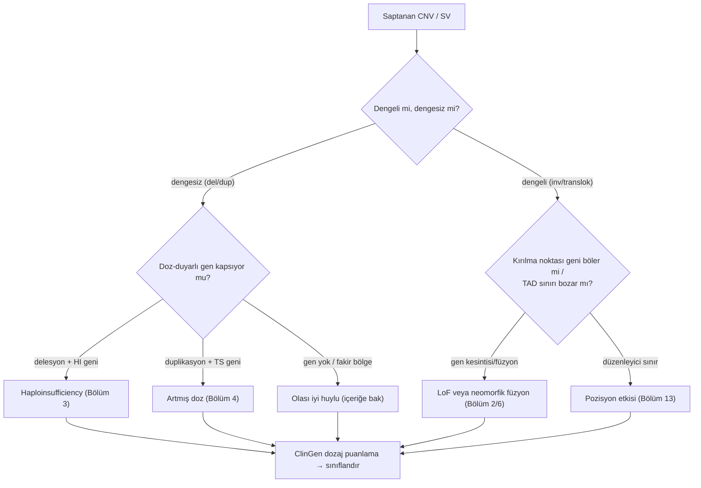
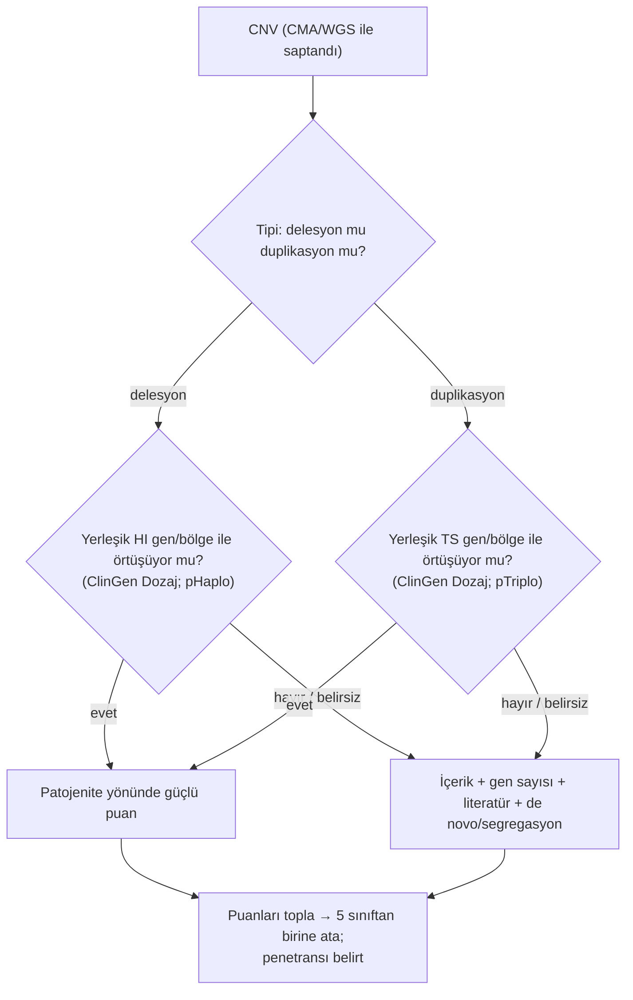
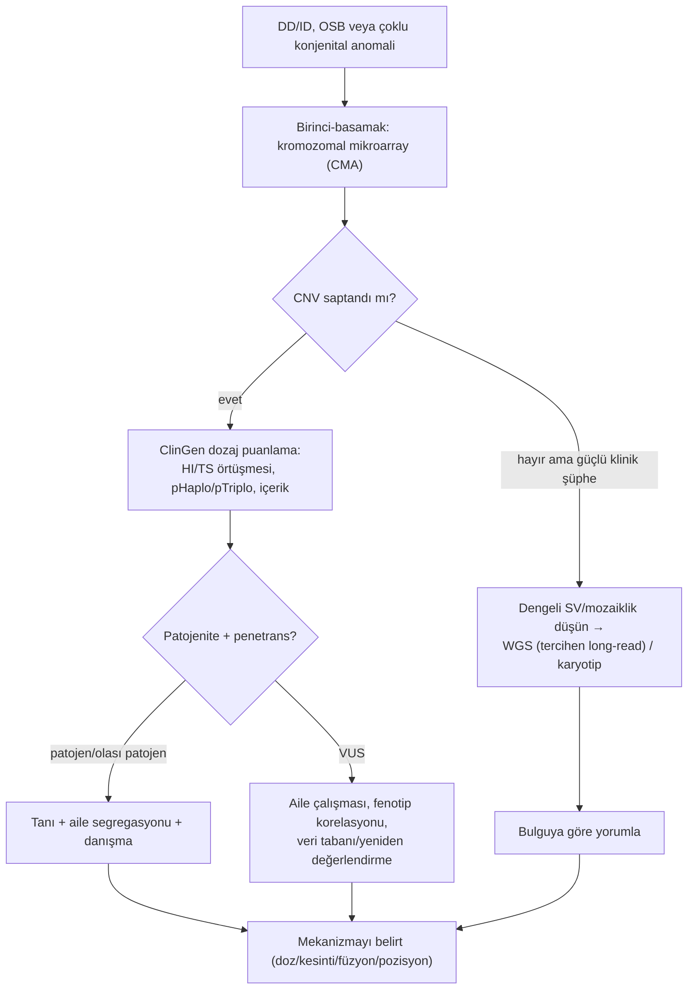

# Bölüm 8 — CNV ve Yapısal Varyantlar

> **Bölümün çekirdek tezi:** Şimdiye kadar tek nükleotid düzeyindeki varyantları işledik; bu bölüm ölçeği büyütür. **Yapısal varyantlar (SV)** — delesyon, duplikasyon, inversiyon, translokasyon, insersiyon ve kompleks yeniden düzenlenmeler — kilobazlardan megabazlara uzanan DNA parçalarını etkiler; bunların **kopya sayısını değiştirenleri** (delesyon/duplikasyon) **kopya sayısı varyantı (CNV)** olarak adlandırılır. CNV/SV'ler hastalığı tek bir yoldan değil, **beş ayrı yoldan** yapar: doz değişimi (delesyon→haploinsufficiency, duplikasyon→artmış doz), kırılma noktasının bir geni bölmesi, gen füzyonu, **pozisyon etkisi/TAD bozulması** (enhancer'ın yanlış gene bağlanması) ve karşı aleldeki resesif varyantın maskesinin kalkması. Bu yüzden CNV yorumunun anahtarı boyut değil, **hangi doz-duyarlı geni veya düzenleyici sınırı etkilediğidir** — aynı büyüklükte bir CNV zararsız da olabilir, ölümcül de. Bu bölüm, kitabın doz (Bölüm 3–4), neomorfik füzyon (Bölüm 6) ve düzenleyici (Bölüm 13) iplikçiklerini genomik ölçekte birleştirir ve tanıda **kromozomal mikroarray (CMA)** ile **ClinGen dozaj puanlamasını** merkeze koyar.

> **📘 Okuma katmanları.** Bu kitabın birincil hedefi **yandal asistanı ve klinik genomik çalışan hekimdir**; genel pediatrist ve tıp öğrencisi ikincil hedef kitledir. Bölümü kendi katmanınızdan okuyabilirsiniz:
> · **① Temel — tıp öğrencisi:** Üç şekil yeter: 8.1 (SV tipleri), 8.2 (CNV'nin beş hastalık yolu) ve 8.3 (PMP22 — aynı lokus, zıt doz, zıt hastalık).
> · **② Klinik — pediatrist ve klinisyen:** §5: kromozomal mikroarrayin birinci basamak rolü ve raporda dışlanan mozaiklik düzeyi.
> · **③ İleri düzey — yandal asistanı, laboratuvar, varyant yorumlayan:** §6: ClinGen/ACMG dozaj puanlaması (HI/TS, pHaplo/pTriplo) ve puanların sınıfa çevrilmesi.

> 🖼️ **Görseller hakkında not:** Şekiller `assets/` klasöründe SVG, akış diyagramları Mermaid olarak gömülüdür.

---

## Öğrenme hedefleri

Bu bölümü tamamlayan okuyucu:
1. Yapısal varyant tiplerini (delesyon, duplikasyon, inversiyon, translokasyon, insersiyon, kompleks) ve dengeli/dengesiz ayrımını tanımlayabilir.
2. CNV'lerin nasıl oluştuğunu (NAHR/tekrar dizileri, replikasyon temelli FoSTeS/MMBIR) ana hatlarıyla açıklayabilir.
3. CNV/SV'lerin hastalık yapma yollarını (doz, gen kesintisi, füzyon, pozisyon etkisi/TAD, resesif maskenin kalkması) örnekleyerek ayırt edebilir.
4. Delesyonun haploinsufficiency, duplikasyonun artmış doz üzerinden hastalık yaptığını ve PMP22 örneğinde resiprokal doz–hastalık ilişkisini açıklayabilir.
5. Pozisyon etkisi/TAD bozulmasının kodlamayan bir SV'yi nasıl patojen kıldığını gerekçelendirebilir.
6. CNV tanısında **kromozomal mikroarray (CMA)** ile karyotipin yerini, getiri farkını ve sınırlarını (dengeli/mozaik) açıklayabilir.
7. CNV yorumunda **ClinGen/ACMG dozaj puanlamasını** (haploinsufficiency/triplosensitivite; pHaplo/pTriplo) ana hatlarıyla uygulayabilir.
8. Pediatrik genetikten CNV örneklerini (CMT1A/HNPP, mikrodelesyon/mikroduplikasyon sendromları) mekanizma–fenotip–test–yorum zinciriyle ilişkilendirebilir.

---

## 1. Kavramsal tanım

Genetik varyasyonun büyük bir kısmı tek nükleotid değişimleri değil, **DNA segmentlerinin yapısal yeniden düzenlenmeleridir**. Bir parçanın kaybı (**delesyon**), fazladan kopyalanması (**duplikasyon**), ters çevrilmesi (**inversiyon**), başka bir konuma taşınması (**translokasyon**) ya da araya yeni dizi girmesi (**insersiyon**) — bunların hepsi yapısal varyanttır (Şekil 8.1). Bunlardan kopya sayısını değiştirenler (delesyon ve duplikasyon) **kopya sayısı varyantı (CNV)** olarak adlandırılır. Önemli bir kavramsal ayrım, **dengesiz** (kopya sayısı değişir: delesyon/duplikasyon) ve **dengeli** (toplam DNA aynı kalır: inversiyon/translokasyon) varyantlar arasındadır — ama dengeli bir varyant bile, kırılma noktası bir genin ortasından geçerse ya da düzenleyici bir sınırı bozarsa hastalık yapabilir.

CNV'lerin keşfi, insan genetik varyasyonuna bakışımızı değiştirmiştir. Stankiewicz ve Lupski (2010), mikroarray ve dizileme teknolojilerinin submikroskopik CNV'leri ortaya çıkardığını ve bunların — toplam nükleotid sayısı bakımından SNP'leri aşacak ve onlardan daha sık ortaya çıkacak biçimde — insan evriminin, bireyler arası çeşitliliğin ve giderek artan sayıda özelliğin/hastalık yatkınlığının temelinde yattığını özetler; bu tür CNV-aracılı durumlar **genomik bozukluklar (genomic disorders)** olarak adlandırılır (Stankiewicz &amp; Lupski, 2010, *Annu Rev Med*; [DOI](https://doi.org/10.1146/annurev-med-100708-204735)). Buradaki kritik kavramsal nokta şudur: CNV'nin patojenitesi **boyutuyla değil içeriğiyle** belirlenir — büyük ama gen-fakir bir delesyon zararsız olabilirken, küçük ama doz-duyarlı bir geni kapsayan bir delesyon ağır hastalık yapabilir.

Aşağıdaki tablo bölüm boyunca açacağımız kavramları bir arada gösterir.

**Tablo 8.1 — Yapısal varyantların temel kavramları**

| Kavram | Tanım | Klinik anlamı |
|--------|-------|---------------|
| **CNV** | Kopya sayısını değiştiren varyant (delesyon/duplikasyon) | Doz değişimi → HI veya artmış doz |
| **Dengesiz vs dengeli SV** | Kopya değişir / değişmez | Dengeli SV bile kırılma noktasında zarar verebilir |
| **Genomik bozukluk** | Tekrarlayan CNV'lerin yol açtığı sendrom | Mikrodelesyon/mikroduplikasyon sendromları |
| **NAHR** | Tekrar dizileri arası yanlış rekombinasyon | Tekrarlayan (recurrent) CNV'lerin ana mekanizması |
| **Triplosensitivite (TS)** | Fazladan kopyaya duyarlılık | Duplikasyonun patojen olabilmesi |
| **Pozisyon etkisi / TAD** | Düzenleyici mimarinin bozulması | Kodlamayan SV'lerin patojenitesi (Bölüm 13) |
| **CMA** | Kromozomal mikroarray (CNV testi) | DD/ID/MCA'da birinci-basamak test |

---

## 2. Moleküler mekanizma

### 2.1. CNV'ler nasıl oluşur?

CNV'lerin oluşumunda iki büyük mekanizma sınıfı vardır. **Rekombinasyon temelli** mekanizmaların başında **NAHR (non-allelic homologous recombination)** gelir: genomda birbirine çok benzeyen **tekrar dizileri** (düşük-kopya tekrarlar/segmental duplikasyonlar) yan yana bulunduğunda, hücre menyoz sırasında bunları yanlışlıkla hizalayıp aralarındaki bölgeyi ya siler ya da çoğaltır. NAHR'nin en öğretici özelliği **resiprokal** olmasıdır: aynı tekrar çifti hem delesyon hem de duplikasyon üretir — bu yüzden belirli bölgelerde tekrarlayan (recurrent), aynı sınırlara sahip CNV'ler görülür. **Replikasyon temelli** mekanizmalar (FoSTeS/MMBIR), DNA replikasyon çatalının duraklayıp yanlış bir şablona atlamasıyla daha karmaşık, tekrarlamayan (non-recurrent) yeniden düzenlenmeleri açıklar (Stankiewicz &amp; Lupski, 2010; [DOI](https://doi.org/10.1146/annurev-med-100708-204735)). Bu mekanizma bilgisi kliniktir: tekrarlayan mikrodelesyon sendromları (örneğin 17p12, 22q11.2) NAHR ile açıklanır ve bu, neden belirli bölgelerin hotspot olduğunu gösterir.

### 2.2. CNV/SV hastalığı nasıl yapar? — beş yol

Bir CNV'nin patojen olup olmadığını anlamanın anahtarı, onun hangi **mekanizma yoluyla** etki ettiğini sormaktır (Şekil 8.2).

**Birinci ve en sık yol dozajdır.** Doz-duyarlı bir geni kapsayan **delesyon** o genin dozunu %50'ye indirir (haploinsufficiency, Bölüm 3); **duplikasyon** ise %150'ye çıkarır (artmış doz/triplosensitivite, Bölüm 4). **İkinci yol gen kesintisidir:** bir kırılma noktası bir genin ortasından geçerse geni bölerek işlevsizleştirir — ve bu, kopya sayısını hiç değiştirmeyen **dengeli** bir translokasyon/inversiyonda bile olabilir. **Üçüncü yol gen füzyonudur:** iki gen uç uca birleşip kimerik (melez) bir protein oluşturur; bu, normalde olmayan yeni bir aktivite (neomorfik/GoF, Bölüm 6) taşıyabilir — özellikle kanser biyolojisinde sıktır. **Dördüncü yol pozisyon etkisidir** (§2.3). **Beşinci yol resesif maskenin kalkmasıdır:** bir delesyon, karşı aleldeki gizli bir resesif varyantı "açığa çıkarır" (unmasking) ve tek bir delesyon, beklenmedik bir resesif hastalığa yol açar.

> **🔬 Deep-dive — Aynı CNV neden bir kişide hastalık yaparken diğerinde yapmaz?** CNV yorumunun en zor yanı **değişken penetrans ve ekspresivitedir** (Bölüm 1). Bazı tekrarlayan CNV'ler (örneğin 16p11.2) "duyarlılık" CNV'leridir: hastalık riskini artırır ama tek başına belirleyici değildir; sağlıklı taşıyıcılarda da bulunabilir. Bunun nedenleri arasında genetik arka plan, ikinci bir "vuruş" (two-hit modeli), ve doz-duyarlılığın kişiden kişiye eşik farkı sayılabilir. Bu yüzden bir CNV raporu "patojen/iyi huylu" ikiliğine her zaman sığmaz; "patojenite **ve** penetrans" birlikte düşünülmelidir. Pratik sonuç: bir duyarlılık CNV'si bulunduğunda aile çalışması (segregasyon) ve fenotip korelasyonu kritik hale gelir.

### 2.3. Pozisyon etkisi ve TAD bozulması

CNV/SV'lerin en ince yolu, hiçbir geni silmeden veya çoğaltmadan, genlerin **düzenleyici mimarisini** bozmaktır. Genom, **topolojik ilişkili alanlara (TAD)** bölünmüştür; bu alanların sınırları (CTCF-ilişkili), enhancer'ların yalnız "kendi" genleriyle temas etmesini sağlar. Lupiáñez ve ark. (2015), bir TAD sınırını bozan delesyon, inversiyon veya duplikasyonların bu yalıtımı kaldırarak bir enhancer kümesinin **yanlış bir geni uygunsuz biçimde aktive etmesine** ("enhancer hijacking") yol açtığını ve bunun insanda birbirinden farklı ekstremite malformasyonlarına neden olduğunu göstermiştir. Çalışma tek bir lokusta — TAD'ler boyunca uzanan *WNT6/IHH/EPHA4/PAX3* bölgesinde — yapılmış, hasta varyantlarına karşılık gelen yeniden düzenlenmeler CRISPR/Cas ile farede yeniden üretilmiş ve hem fare ekstremite dokusunda hem hasta kaynaklı fibroblastlarda promotör–kodlamayan DNA arasında **ektopik etkileşimler** gösterilmiştir: normalde *Epha4* ile ilişkili olan bir ekstremite enhancer kümesi, TAD sınırlarına göre yer değiştirince lokustaki **başka bir geni** ektopik olarak çalıştırmıştır. Kritik nokta şudur: bu yeniden kablolanma **yalnızca varyant CTCF-ilişkili bir sınır alanını bozduğunda** ortaya çıkmıştır (Lupiáñez ve ark., 2015, *Cell*; [DOI](https://doi.org/10.1016/j.cell.2015.04.004)). Bu çalışma, kodlamayan bölgelerdeki yapısal varyantların patojenitesini öngörmek için somut bir ölçüt sunar ve splicing (Bölüm 7) ile birlikte "varyant bir proteini değiştirmeden de hastalık yapabilir" dersini pekiştirir (ayrıntı Bölüm 13).

---

## 3. Varyant tipleri

**Tablo 8.2 — Yapısal varyant tipleri, doz etkisi ve hastalık yolları**

| SV tipi | Doz etkisi | Tipik hastalık yolu |
|---|---|---|
| **Delesyon** | ↓ (kopya kaybı) | Haploinsufficiency; resesif maske kalkması; gen kesintisi |
| **Duplikasyon** | ↑ (kopya kazancı) | Artmış doz/triplosensitivite; bazen kesinti |
| **İnversiyon (dengeli)** | yok | Kırılma noktası gen kesintisi; pozisyon etkisi |
| **Translokasyon (dengeli)** | yok | Gen kesintisi; gen füzyonu; pozisyon etkisi |
| **İnsersiyon** | ↑ (eklenen dizi) | Gen kesintisi; düzenleyici bozulma |
| **Kompleks yeniden düzenlenme** | değişken | Birden çok yol birlikte |

Pratik özet: **dengesiz** varyantlarda (delesyon/duplikasyon) ilk düşünülecek yol **dozdur**; **dengeli** varyantlarda (inversiyon/translokasyon) ise doz normaldir, bu yüzden mekanizma **kırılma noktası** (gen kesintisi/füzyon) veya **pozisyon etkisidir**. Her iki durumda da soru aynıdır: bu varyant hangi doz-duyarlı geni veya düzenleyici sınırı etkiliyor?

---

## 4. Klinik fenotipe dönüşüm

Bölümün anahtar sorularını yanıtlayalım.

**Soru 1 — Bir CNV'nin patojen olup olmadığını ne belirler?** Boyutu değil, **içeriği**: kapsadığı genlerin doz duyarlılığı (haploinsufficiency/triplosensitivite), bilinen bir genomik bozukluk bölgesiyle örtüşüp örtüşmediği ve düzenleyici sınırları bozup bozmadığı. ClinGen dozaj puanlaması tam bunu sistematize eder (§6).

**Soru 2 — Delesyon mu duplikasyon mu daha ağır?** Gene bağlıdır; tek bir kural yoktur. PMP22 (Şekil 8.3) bunun klasik örneğidir: aynı 17p12 bölgesinin **delesyonu HNPP** (basınca duyarlı nöropati, haploinsufficiency), **duplikasyonu CMT1A** (demiyelinizan nöropati, artmış doz) yapar — aynı lokus, zıt doz, zıt hastalık.

PMP22 örneği, Bölüm 4'teki "aynı gen, iki yön" temasının (RET, SCN2A) doz düzeyindeki karşılığıdır: orada varyantın *yönü* (GoF/LoF), burada kopya sayısının *yönü* (kayıp/kazanç) zıt fenotipler üretir. Lupski ve ark. (1991), CMT1A'nın 17p'deki bir **duplikasyondan** kaynaklandığını gösteren landmark çalışmada, doz değişiminin tek başına bir Mendel hastalığı yapabileceğini kanıtlamıştır (Lupski ve ark., 1991, *Cell*; [DOI](https://doi.org/10.1016/0092-8674(91)90613-4)).

**Soru 3 — CNV neden değişken seyreder?** Penetrans/ekspresivite farkları, duyarlılık CNV'leri ve ikinci-vuruş etkileri nedeniyle (§2.2 deep-dive). Bu yüzden aile çalışması ve fenotip korelasyonu yorumun ayrılmaz parçasıdır.

Aşağıdaki Mermaid, bir CNV'nin mekanizmasına nasıl gidileceğini özetler.

**Algoritma 8.1 — Saptanan yapısal varyantın hastalık yolunun belirlenmesi**

---

## 5. Tanısal testlerle ilişkisi

CNV/SV'lerde test seçimi, varyantın **tipine ve boyutuna** göre değişir. Kopya-sayısı değişimleri için altın standart **kromozomal mikroarray (CMA)**'dır. Miller ve ark. (2010), 33 çalışmayı ve CMA ile test edilmiş **21.698 hastayı** kapsayan bir derlemeye dayanarak, gelişimsel gerilik/zihinsel yetersizlik, otizm spektrum bozukluğu veya çoklu konjenital anomalisi olan bireylerde CMA'nın tanısal getirisinin **%15–20** olduğunu, G-bantlı karyotipin getirisinin ise **yaklaşık %3** düzeyinde kaldığını göstermiştir. Bu %3'lük rakamın nasıl hesaplandığı önemlidir: **Down sendromu ve diğer klinik olarak tanınabilen kromozomal sendromlar dışlanarak** verilmiştir — yani karyotipin "zaten klinikle tanınan" olguları yakalaması bu karşılaştırmaya dâhil edilmemiştir. Aradaki farkın kaynağı, CMA'nın submikroskopik delesyon ve duplikasyonlara çok daha duyarlı olmasıdır. Bu nedenle CMA **birinci-basamak sitogenetik test** olarak önerilir (Miller ve ark., 2010, *Am J Hum Genet*; [DOI](https://doi.org/10.1016/j.ajhg.2010.04.006)). Kromozom analizinin bugünkü yeri ise bundan daha dar ve daha keskin biçimde tanımlanmıştır; hangi klinik soruların hâlâ kromozom analizi gerektirdiğini §5.1'de ayrıntılı olarak ele alıyoruz. Önemli sınır: CMA **gerçekten dengeli** yeniden düzenlenmeleri (translokasyon/inversiyon) ve **düşük düzey mozaikliği** göremez. Yine de bu sınırı orantılı görmek gerekir: aynı derleme, bu iki durumun bu hasta grubunda anormal fenotipin görece seyrek nedeni olduğunu (**<%1**) belirtir — yani CMA'yı birinci basamağa taşıyan gerekçeyi ortadan kaldırmaz, yalnızca negatif bir CMA'dan sonra klinik şüphe sürüyorsa ne aranacağını söyler.

**Tablo 8.3 — CNV ve yapısal varyantları hangi test yakalar?**

| Test | Bu mekanizmayı yakalar mı? | Sınırlılığı |
|------|----------------------------|-------------|
| **WES** | ⚠️ Kısmen — ekzonik CNV'ler çağrılabilir | Çözünürlük/duyarlılık sınırlı; dengeli SV'yi göremez |
| **Short-read WGS** | ✅ Evet — CNV + dengeli SV (kırılma noktası) | Tekrar bölgelerinde kırılma noktası çözümü zor |
| **Long-read WGS** | ✅✅ En iyi — kırılma noktaları, tekrarlar, kompleks SV | Maliyet/erişim |
| **Array-CGH / SNP array (CMA)** | ✅✅ Dengesiz CNV için altın standart; SNP array UPD/AOH de gösterir | Dengeli SV ve düşük mozaikliği göremez |
| **MLPA** | ✅ Hedefe yönelik (tek gen/ekzon doz) | Yalnız test edilen bölgeye bakar |
| **RNA-seq** | ⚠️ Dolaylı — füzyon transkriptini/ifade değişimini gösterir | Doz/CNV'yi doğrudan ölçmez |
| **Methylation array** | ⚠️ Dolaylı — imprinting bölgesi CNV etkisini yansıtabilir | Özel bağlam (Bölüm 10) |
| **Karyotip** | ✅ Büyük (>5–10 Mb) ve dengeli yeniden düzenlenme | Submikroskopik CNV'yi kaçırır |

> **Bu mekanizmayı hangi test yakalar? (özet):** Dengesiz CNV'leri **CMA (array)** birinci-basamak olarak yakalar; **dengeli** yeniden düzenlenmeler ve kırılma noktası çözümü için **WGS (tercihen long-read)** veya karyotip gerekir. Hedefe yönelik doz sorusu için **MLPA** kullanılır.

### 5.1 Kromozom analizi bugün nerede duruyor?

Mikroarray ve dizileme yaygınlaştıkça kromozom analizinin istem sıklığı belirgin biçimde azaldı; ancak test menüsünden çıkmadı, **endikasyonu daralıp keskinleşti.** Bu daralmayı doğru okumak, kitabın bu bölümünde öğrettiğimiz mekanizma mantığının doğrudan bir uzantısıdır: CMA bize bir bölgenin **kaç kopya** olduğunu söyler, o kopyaların **nerede durduğunu** söylemez. Fazladan bir 21q materyalinin serbest bir trizomi olarak mı yoksa bir Robertsonian translokasyona bağlı olarak mı bulunduğu, kopya sayısı bakımından aynı, tekrarlanma riski bakımından tamamen farklıdır. Kromozom analizinin bugünkü asıl işi budur: **dengesizliğin fiziksel mimarisini göstermek ve dengeli yeniden düzenlenmeleri yakalamak.**

#### Terminoloji: "karyotip" ile "kromozom analizi" eş anlamlı değildir

Güncel laboratuvar terminolojisi, uzun süre birbirinin yerine kullanılan iki işlemi ayırır (ACGS, 2024). **Karyotip analizi (karyotype analysis, KA)**, bireyin metafaz kromozomlarının **tamamının** incelenmesidir; her kromozomun homoloğuyla bant bant karşılaştırılmasını içerir. **Hedefli kromozom analizi (targeted chromosome analysis, TCA)** ise incelemeyi yalnızca belirli kromozomlarla veya beklenen anomaliyle sınırlar. **Kromozom analizi** ikisini birden kapsayan üst terimdir. Bu ayrım akademik bir incelik değildir: eskiden "karyotip endikasyonu" diye öğretilen durumların önemli bir kısmı bugün TCA olarak yürütülmektedir; örneğin seks kromozomu anöploidisi şüphesinde tüm kromozom takımını taramak yerine hedefli analiz yeterli olabilmektedir. İstem yazarken hangi sorunun sorulduğunun belirtilmesi, laboratuvarın doğru işlemi seçmesini sağlar.

#### Hangi klinik sorular kromozom analizi gerektirir?

Birinci ve en net grup, **başka bir yöntemle saptanmış bir bulgunun sitogenetik olarak karakterize edilmesidir.** CMA, WGS veya QF-PCR bir dengesizlik gösterdiğinde, bunun derivatif kromozom mu, ring kromozom mu, marker (ESAC) mı, yoksa kompleks bir yeniden düzenlenme mi olduğunu belirlemek yorumu ve aktarım riskini değiştirir. Özellikle **kazanımlarda** fazladan materyalin nereye yerleştiğini görmek çoğu zaman karyotip gerektirir (ACGS, 2024).

İkinci grup, **anöploidi saptandıktan sonra altta yatan yapısal bir yeniden düzenlenmenin dışlanmasıdır.** Klinik olarak tanınan bir trizomi olgusunda bile, serbest trizomi ile translokasyon trizomisinin ayrımı ailenin tekrarlanma riskini kökten değiştirir; bu ayrım hızlı anöploidi testiyle değil kromozom analiziyle yapılır. Dolayısıyla "Down sendromu düşünüyorum, doğrudan karyotip isteyeyim" refleksi güncel test mimarisini tam yansıtmaz: hızlı anöploidi testi tanıyı hızlandırır, kromozom analizi **mekanizmayı ve rekürrens riskini** belirler.

Üçüncü grup **ailede bilinen bir yeniden düzenlenmedir** — dengeli translokasyon taşıyıcılığı, inversiyon, Robertsonian translokasyon, marker veya ring kromozom. Burada probandda saptanmış yapısal bir anomalinin ebeveynlerde araştırılması, aile içi kaskad tarama ve dengesiz bir bulgunun ebeveynlerden dengeli biçimde taşınıp taşınmadığının gösterilmesi söz konusudur. Beklenen değişiklik tanımlıysa TCA yeterlidir.

Dördüncü grup **mozaisizm şüphesidir**; bu grubun kendine özgü bir tuzağı vardır ve aşağıda ayrıca ele alıyoruz. Beşinci grup **seks kromozomu anöploidisi veya yapısal anomalisidir** — Turner ve Klinefelter sendromları, primer amenore, prematür over yetmezliği, gecikmiş puberte, cinsel gelişim farklılıkları ve `45,X/46,XY` gibi mozaik tablolar. Güncel yaklaşımda bu grup çoğunlukla tam karyotip yerine **TCA** ile karşılanır; ancak fenotip seks kromozomlarına ek olarak otozomal bir yeniden düzenlenmeyi de düşündürüyorsa tam karyotip gerekir. Erkek infertilitesinde Robertsonian translokasyon olasılığı, yalnızca seks kromozomu TCA'sıyla dışlanamaz.

Altıncı grup **infertilitedir**: non-obstrüktif azospermi, ağır oligozoospermi, hipergonadotropik hipogonadizm, prematür over yetmezliği ve primer amenore kromozom analizi açısından öncelikli tablolardır. Yedinci grup **prenatal tanıda anormal bir sonucun karakterizasyonudur**; prenatal örneklerde rutin tam karyotip kullanımı daralmış, kromozom analizi esas olarak anormal QF-PCR veya CMA bulgusunun yapısal karşılığını göstermek, dengesizliğin bir translokasyon veya ring kromozomdan kaynaklanıp kaynaklanmadığını belirlemek ve mozaik bulguyu araştırmak için kullanılır hâle gelmiştir (ACGS, 2024). Ebeveynlerden biri dengeli translokasyon taşıyıcısıysa fetüste öncelikli soru genellikle **dengesiz materyal bulunup bulunmadığıdır**; bu soruyu prenatal CMA yanıtlayabilir. Fetüsün dengeli taşıyıcı olup olmadığını belirlemek rutin olarak gerekli değildir — kırılma noktası bir geni bölüyorsa veya X kromozomu tutulumu gibi özel bir gerekçe varsa ayrıca değerlendirilir.

> **🔴 Sık yapılan hata — tekrarlayan gebelik kaybında refleks ebeveyn karyotipi.** Tekrarlayan düşük, uzun süre otomatik bir "ebeveyn karyotipi" endikasyonu gibi öğretildi. Güncel ölçütler bunu belirgin biçimde daraltmıştır: ebeveyn karyotipi, **üç veya daha fazla** düşük olan ve gebelik materyali uygun olmadığı (yetersiz/başarısız örnek, maternal kontaminasyon, formalin tespiti) için test edilememiş, üstelik önceki kayıpların hiçbirinde başarılı sonuç alınamamış çiftler için; ya da **beş veya daha fazla** gebelik kaybı olup kayıpların hiçbirinde test edilebilir materyal bulunmamış çiftler için tanımlanmıştır. Belge ayrıca ebeveyn karyotipinin **sınırlı bilgi** verdiğini ve en bilgilendirici yolun **sonraki gebelik kaybı materyalinin doğrudan test edilmesi** olduğunu açıkça yazar (NHS England, 2026). Yani gebelik materyali eldeyse öncelik ebeveyn kanı değil, **materyalin kendisidir**; orada da genom çapında karyotip değil, yaygın anöploidi testi ve CMA öne çıkar.

#### Mozaisizm: kaç hücre sayılmalı ve karyotip her zaman doğru araç mı?

Bölüm 12'de mozaikliği ayrıntılı olarak ele alıyoruz; burada yalnızca sitogenetik tarafını netleştirelim, çünkü kitapta iki kez sorduğumuz "yeterli sayıda hücre sayıldı mı?" sorusunun sayısal karşılığı buradadır. Standart bir analiz üç hücrenin değerlendirilmesiyle yapılır. **30 hücrelik** bir mozaisizm taraması (3 analiz + 27 sayım), %10 ve üzerindeki mozaikliği **%95 güvenle** dışlar; **60 hücrelik** genişletilmiş tarama (3 analiz + 57 sayım) ise eşiği **%5**'e indirir (ACGS, 2024; istatistiksel temel: Hook, 1977, *Am J Hum Genet*). Rutin analiz sırasında beklenmedik bir hücre görülürse sayının 30'a çıkarılması, klinik tablo mozaikliği kuvvetle düşündürüyorsa 60'a çıkarılması önerilir. Raporda "mozaiklik dışlandı" demek yeterli değildir; **hangi düzeyin hangi güvenle dışlandığı** yazılmalıdır.

Buradaki asıl ders ise sayı değil, araç seçimidir: **mozaisizm şüphesinde refleks olarak karyotip seçilmez.** SNP-array, daha heterojen bir hücre popülasyonundan hazırlanan DNA üzerinde çalıştığı, azınlık hücre hattına yüksek duyarlılık gösterdiği ve B-alel frekansı profiliyle destekleyici kanıt sunduğu için bazı olgularda **daha uygun ilk test** olabilir (ACGS, 2024). Dokuya özgü mozaiklik düşünülüyorsa — Pallister–Killian sendromundaki `+i(12p)` klasik örnektir — kan yerine fibroblast, bukkal hücre veya ilgili dokunun incelenmesi gerekir (Bölüm 12 §5).

> **🟦 Klinikte dikkat — kısa karar kuralı.** **Kromozom analizi (KA/TCA) düşünün:** dengeli veya büyük yapısal bir yeniden düzenlenme aranıyorsa; anomalinin fiziksel mimarisi gerekiyorsa; ailede bilinen translokasyon/inversiyon varsa; mozaik hücre hattının aranması ve hücre sayımı gerekiyorsa; seks kromozomu anöploidisi/yapısal bozukluğu düşünülüyorsa; CMA, WGS veya QF-PCR bulgusunun sitogenetik karşılığı gerekiyorsa. **Tek başına ilk test olarak seçmeyin:** nonspesifik gelişimsel gecikme/entelektüel yetersizlik, izole otizm, belirli bir kromozomal fenotip göstermeyen çoklu konjenital anomali, submikroskopik delesyon/duplikasyon şüphesi, tek gen hastalığı şüphesi ve gebelik kaybı materyalinin genom çapında değerlendirilmesi. Bu tablolarda klinik soruya göre CMA, hızlı anöploidi testi, panel, WES veya WGS daha uygundur. Kromozom analizinin güncel alanı **kromozomun sayısal veya fiziksel yapısını hücresel düzeyde göstermektir**; nonspesifik sendrom taraması değildir.

---

## 6. Varyant yorumlama açısından önemi (ACMG/ClinGen)

CNV yorumu, dizi varyantlarından ayrı bir çerçeve kullanır: **ClinGen/ACMG teknik standartları** (Riggs ve ark., 2020, *Genet Med*; [DOI](https://doi.org/10.1038/s41436-019-0686-8)). Bu sistem, bir CNV'yi puanlayarak (kanıt kategorilerine sayısal ağırlık vererek) beş sınıfa ayırır: patojen, olası patojen, VUS, olası iyi huylu, iyi huylu. Puanlamanın kalbinde **dozaj duyarlılığı** vardır: CNV, **haploinsufficiency (HI)** veya **triplosensitivite (TS)** açısından yerleşik bir gen/bölgeyle örtüşüyor mu? ClinGen Dozaj Haritası, genleri ve bölgeleri HI ve TS kanıt düzeylerine göre derecelendirir; delesyon yorumunda HI skoru, duplikasyon yorumunda TS skoru belirleyicidir.

Bu puanlamayı popülasyon-ölçekli metrikler tamamlar. Collins ve ark. (2022), büyük popülasyon verisinden her gen için **pHaplo** (haploinsufficiency olasılığı) ve **pTriplo** (triplosensitivite olasılığı) skorlarını türeterek, bir genin doz kaybına mı yoksa kazancına mı duyarlı olduğunu nicel olarak öngörmüştür (Collins ve ark., 2022, *Cell*; [DOI](https://doi.org/10.1016/j.cell.2022.06.036)). Bu metrikler, özellikle yeni/literatürde az tanımlı CNV'lerin yorumunda destekleyici kanıt sağlar.

> **🟦 Klinikte dikkat — Boyut değil içerik; ve penetransı unutma:** Bir CNV'yi raporlarken refleksiniz "kaç Mb?" değil, "hangi doz-duyarlı geni/bölgeyi kapsıyor ve HI/TS kanıtı ne?" olmalı. Ayrıca duyarlılık CNV'lerinde (örn. 16p11.2) "patojen" etiketi tek başına yetmez; **penetrans ve aile segregasyonu** rapora yansıtılmalıdır. Gen-fakir büyük bir CNV iyi huylu olabilirken, küçük ama HI bir geni silen CNV patojendir.

Aşağıdaki akış CNV yorumunu özetler.

**Algoritma 8.2 — CNV puanlama ve raporlama akışı**

---

## 7. Pediatrik genetikten klinik örnekler

### 7.1. PMP22 (17p12): CMT1A ve HNPP — doz yönünün ders kitabı örneği

CMT1A/HNPP ikilisi, doz-duyarlılığın en saf klinik gösterimidir (§4, Şekil 8.3). Lupski ve ark. (1991), CMT1A'yı 17p'de bir aralığa haritaladıktan sonra bu bölgede hastalıkla **tam bağlantılı bir duplikasyon** bulmuş; duplikasyonu polimorfik bir lokusta üç alel görülmesi, RFLP alellerindeki doz farkı ve iki-renkli FISH ile göstermiştir — yani bir Mendel hastalığının nedeni ilk kez doğrudan **gen dozu değişimi** olarak ortaya konmuştur (Lupski ve ark., 1991, *Cell*; [DOI](https://doi.org/10.1016/0092-8674(91)90613-4)). Sonraki çalışmalar tabloyu tamamlamıştır: söz konusu bölge *PMP22* genini kapsayan yaklaşık **1,4 Mb**'lik bir segmenttir ve yan dizilerindeki tekrarlar (**CMT1A-REP**) arasındaki eşit olmayan krossing-over, NAHR için bir hotspot oluşturur. Mekanizma **resiprokal** olduğu için aynı tekrar çifti hem duplikasyonu hem delesyonu üretir: **duplikasyon** (üç *PMP22* kopyası) → **CMT1A** (demiyelinizan periferik nöropati); **delesyon** (tek kopya) → **HNPP** (basınç paralizilerine yatkın herediter nöropati). Bu örneğin dersi: bir gen doza duyarlıysa, kopya sayısının yönü doğrudan farklı hastalıklara çevrilir — ve NAHR mekanizması bu iki hastalığı neden "ikiz" yaptığını açıklar.

### 7.2. Mikrodelesyon / mikroduplikasyon sendromları — genomik bozukluklar

Pediatrik genetikte CNV'lerin büyük kısmı **tekrarlayan mikrodelesyon/mikroduplikasyon sendromları** olarak karşımıza çıkar. Bunlar belirli genomik hotspot bölgelerindeki NAHR ürünleridir ve her biri tanınabilir bir fenotip kümesi (gelişimsel gerilik, dismorfi, konjenital anomaliler, nöropsikiyatrik özellikler) taşır. Örnekler arasında 22q11.2 delesyonu (DiGeorge/velokardiyofasiyal), 7q11.23 delesyonu (Williams), 17p11.2 delesyon/duplikasyonu (Smith-Magenis/Potocki-Lupski — resiprokal) ve 16p11.2 (değişken penetranslı duyarlılık CNV'si) sayılabilir. 15q11-q13 bölgesi ise CNV ile imprinting'in kesiştiği özel bir durumdur (Prader-Willi/Angelman) ve Bölüm 10'da ayrıca işlenecektir. Bu sendromların ortak dersi, **aynı bölgenin tekrarlayan CNV'sinin öngörülebilir bir klinik tablo** yaratmasıdır — bu da CMA'nın neden yüksek tanısal getiri sağladığını açıklar.

> **🧠 Hatırlatıcı:** Açıklanamayan gelişimsel gerilik/ID, OSB veya çoklu konjenital anomali → refleks **CMA (birinci-basamak)**. Bir CNV bulunduğunda ise refleks "boyut değil, hangi doz-duyarlı gen/bölge ve HI/TS kanıtı?" + penetrans/segregasyon.

---

## 8. Sık yapılan hatalar

> **🔴 Sık yapılan hata kutusu**
> 1. **CNV'yi boyutuna göre yorumlamak.** Büyük ama gen-fakir CNV iyi huylu, küçük ama HI geni silen CNV patojen olabilir. İçeriğe bakın.
> 2. **Duplikasyonu otomatik "delesyondan hafif" saymak.** PMP22'de duplikasyon (CMT1A) belirgin hastalık yapar; triplosensitiviteyi unutmayın.
> 3. **Dengeli SV'yi "zararsız" saymak.** Kırılma noktası bir geni bölebilir veya TAD sınırını bozabilir (pozisyon etkisi).
> 4. **CMA negatif diye dengeli/mozaik varyantı dışlamak.** CMA dengeli yeniden düzenlenmeleri ve düşük mozaikliği göremez; klinik şüphede WGS/karyotip düşünün. (Ancak bunu abartmayın: bu iki durum bu hasta grubunda anormal fenotipi yine de tam olarak açıklamayabilir — CMA'yı birinci basamaktan indirmenin gerekçesi değildir.)
> 5. **Duyarlılık CNV'sini kesin tanı gibi raporlamak.** Penetransı ve aile segregasyonunu belirtin.

> **🟦 Klinikte dikkat kutusu**
> - DD/ID/MCA'da birinci-basamak test CMA'dır (karyotip değil).
> - Kodlamayan bölgedeki büyük SV'ler pozisyon etkisi (TAD) yapabilir; "gen içermiyor" demek "zararsız" demek değildir.
> - Yorumda ClinGen dozaj puanlaması + pHaplo/pTriplo + penetrans birlikte değerlendirilir.

---

## 9. Klinik pratikte karar algoritması

**Algoritma 8.3 — Gelişimsel gerilik ve çoklu anomalide test akışı**

---

## 10. Kaynaklar

> **Atıf / doğrulama notu:** Bu bölümün bibliyografik verileri PubMed üzerinden doğrulanmıştır; her kaynağın PMID ve DOI'si tek tek teyit edilmiştir. Metin içinde yazar-yıl, kaynakçada DOI-link kullanılmıştır.

1. **Stankiewicz P, Lupski JR (2010).** Structural variation in the human genome and its role in disease. *Annual Review of Medicine* 61:437–455. **PMID: 20059347** · DOI: [10.1146/annurev-med-100708-204735](https://doi.org/10.1146/annurev-med-100708-204735) — *Kullanım amacı: SV/CNV landmark derlemesi; genomik bozukluklar; NAHR ve replikasyon temelli (FoSTeS) oluşum mekanizmaları.*
2. **Lupski JR, de Oca-Luna RM, Slaugenhaupt S, ve ark. (1991).** DNA duplication associated with Charcot-Marie-Tooth disease type 1A. *Cell* 66(2):219–232. **PMID: 1677316** · DOI: [10.1016/0092-8674(91)90613-4](https://doi.org/10.1016/0092-8674(91)90613-4) — *Kullanım amacı: Landmark dozaj CNV; 17p duplikasyonu → CMT1A; doz değişiminin Mendel hastalığı yapması.*
3. **Lupiáñez DG, Kraft K, Heinrich V, ve ark. (2015).** Disruptions of topological chromatin domains cause pathogenic rewiring of gene-enhancer interactions. *Cell* 161(5):1012–1025. **PMID: 25959774** · DOI: [10.1016/j.cell.2015.04.004](https://doi.org/10.1016/j.cell.2015.04.004) — *Kullanım amacı: TAD bozulması/pozisyon etkisi; enhancer hijacking; kodlamayan SV patojenitesi (Bölüm 13 köprüsü).*
4. **Miller DT, Adam MP, Aradhya S, ve ark. (2010).** Consensus statement: chromosomal microarray is a first-tier clinical diagnostic test for individuals with developmental disabilities or congenital anomalies. *American Journal of Human Genetics* 86(5):749–764. **PMID: 20466091** · DOI: [10.1016/j.ajhg.2010.04.006](https://doi.org/10.1016/j.ajhg.2010.04.006) — *Kullanım amacı: CMA birinci-basamak test; getiri (%15–20 vs ~%3); dengeli/mozaik sınırları.*
5. **Riggs ER, Andersen EF, Cherry AM, ve ark. (2020).** Technical standards for the interpretation and reporting of constitutional copy-number variants: a joint consensus recommendation of the American College of Medical Genetics and Genomics (ACMG) and the Clinical Genome Resource (ClinGen). *Genetics in Medicine* 22(2):245–257. **PMID: 31690835** · DOI: [10.1038/s41436-019-0686-8](https://doi.org/10.1038/s41436-019-0686-8) — *Kullanım amacı: CNV dozaj puanlaması (HI/TS); CNV sınıflandırma çerçevesi.*
6. **Collins RL, Glessner JT, Porcu E, ve ark. (2022).** A cross-disorder dosage sensitivity map of the human genome. *Cell* 185(16):3041–3055.e25. **PMID: 35917817** · DOI: [10.1016/j.cell.2022.06.036](https://doi.org/10.1016/j.cell.2022.06.036) — *Kullanım amacı: pHaplo/pTriplo dozaj duyarlılığı metrikleri; CNV yorumunda destekleyici kanıt.*
7. **Hook EB (1977).** Exclusion of chromosomal mosaicism: tables of 90%, 95% and 99% confidence limits and comments on use. *American Journal of Human Genetics* 29(1):94–97. **PMID: 835578** · Tam metin: [PMC1685228](https://www.ncbi.nlm.nih.gov/pmc/articles/PMC1685228/) — *Kullanım amacı (§5.1): Mozaikliğin dışlanmasında hücre sayısı–güven düzeyi ilişkisinin istatistiksel temeli; 30 ve 60 hücrelik taramaların dayanağı. (1977 tarihli olduğu için DOI atanmamıştır.)*

> **Kılavuz belgeleri (§5.1).** Aşağıdaki iki belge PubMed'de indekslenmiş makaleler değil, **normatif laboratuvar/hizmet kılavuzlarıdır**; kitapta yalnızca kromozom analizinin güncel endikasyon çerçevesi için kullanılmışlardır. Sürüm numaraları ve tarihleri, belgelerin güncellenebilir olması nedeniyle açıkça verilmiştir.
>
> - **Association for Clinical Genomic Science (ACGS) (2024).** *ACGS Best Practice Guidelines for Constitutional Karyotype Analysis and Targeted Chromosome Analysis*, v1.0; öneriler ACGS Kalite Alt Komitesi tarafından 20.08.2024'te onaylanmıştır. [Belge (PDF)](https://www.acgs.uk.com/media/12611/acgs-best-practice-guidelines-for-constitutional-karyotype-analysis-and-targeted-chromosome-analysis-v10.pdf) — *Kullanım amacı: KA/TCA terminolojik ayrımı; TCA endikasyonları; mozaisizm taramasında hücre sayıları; SNP-array'in alternatif birinci-basamak mozaiklik testi olarak konumu; prenatal kromozom analizinin daralan yeri.*
> - **NHS England (2026).** *National Genomic Test Directory — Testing Criteria for Rare and Inherited Disease*, v9.1; 20 Mayıs 2026. [Belge (PDF)](https://www.england.nhs.uk/wp-content/uploads/2018/08/rare-and-inherited-disease-eligibility-criteria-v9.1.pdf) — *Kullanım amacı: Kromozom analizinin klinik endikasyona göre tanımlanması; tekrarlayan gebelik kaybında ebeveyn karyotipi ölçütleri (üç/beş kayıp koşulu) ve gebelik materyalinin önceliği; açıklanamayan infertilitede karyotip endikasyonu.* ⚠️ Bu belge **İngiltere ulusal hizmet çerçevesidir**; endikasyon mantığı aktarılabilir, ancak geri ödeme ve test menüsü ülkeye göre değişir.

> **İkincil/destekleyici kaynak notu:** GeneReviews/OMIM/ClinVar/DECIPHER/ClinGen Dozaj Haritası yalnız destekleyicidir; gen/bölge-spesifik HI/TS ve penetrans iddiaları güncel ClinGen/VCEP kaynaklarıyla teyit edilmelidir.

---

## ✅ Bölüm öz-denetim tablosu

**Tablo 8.4 — Bölüm 8 öz-denetim tablosu**

| Kriter | Durum | Not |
|--------|-------|-----|
| Mekanizma doğru anlatıldı mı? | ✅ | SV tipleri + 5 hastalık yolu + NAHR/TAD (Şekil 8.1–28) |
| Klinik bağlantı kuruldu mu? | ✅ | CMT1A/HNPP, mikrodelesyon sendromları |
| Varyant tipi ile mekanizma ilişkilendirildi mi? | ✅ | §3 tablo + dengeli/dengesiz |
| Pediatrik örnek verildi mi? | ✅ | PMP22 (CMT1A/HNPP), 22q11/Williams/SMS |
| Test seçimi açıklandı mı? | ✅ | §5; CMA birinci-basamak; dengeli→WGS/karyotip |
| ACMG/ClinGen bağlantısı doğru mu? | ✅ | Riggs 2020 dozaj puanlama; pHaplo/pTriplo |
| Kaynaklar PMID/DOI ile verildi mi? | ✅ | 7/7 PubMed kaynağı (Hook 1977 DOI'siz; PMID + PMC linki) + 2 kılavuz belgesi (ACGS 2024, NHS England v9.1 — sürüm/tarihli URL) |
| Spekülatif iddialar işaretlendi mi? | ✅ | Penetrans/duyarlılık CNV nüansı; VCEP teyit notu |
| Kaynak uydurma riski var mı? | ✅ Yok | Tümü PubMed MCP ile doğrulandı |
| Görsel/şema/algoritma desteği yeterli mi? (≥3 SVG, ≥2 Mermaid) | ✅ | 3 SVG (27–29) + 3 Mermaid |

---

### 🔎 Bölüm sonu kaynak doğrulama komutu (zorunlu)
> "Bu bölümdeki her kaynağın **türüne uygun kalıcı kimliğini** kontrol et: hakemli makalede PMID + DOI; kılavuz/uzman panel spesifikasyonunda kurum + sürüm + tarih + kalıcı bağlantı; veri tabanında veri sürümü + sorgu tarihi. Kimliği doğrulanamayan kaynağı çıkar. Kaynağı olmayan spesifik iddiayı 'kaynak doğrulaması gerekli' olarak işaretle. Kitabın kendi pedagojik çerçevesini doğrulamaya çalışma — 🏷️ ile etiketle." *(Politika 01.08.2026 uzman turunda güncellendi: eski 'PMID veya DOI veremediğin kaynağı çıkar' kuralı HGVS, ClinGen/CSpec, gnomAD sürüm notları gibi PMID'siz ama yetkili kaynakları dışlıyordu.)*
>
> **Bu bölüm için durum:** 6/6 kaynak PMID+DOI doğrulandı (PubMed MCP ile). İşaretlenen iddia: gen/bölge-spesifik HI/TS, penetrans ve sendrom sınırları için güncel ClinGen Dozaj Haritası/VCEP teyidi önerilir (§6, §7.2). Bölüm, 27.07.2026 tarihli iddia-düzeyi doğrulama turundan geçmiştir; turda CMA getiri karşılaştırmasının koşulu (Down sendromu ve tanınabilir sendromların dışlanması) ve dengeli/mozaik sınırın büyüklüğü (<%1) kaynak özetinden eklenmiş, *PMP22* bölgesine ait 1,4 Mb/CMT1A-REP bilgisi Lupski 1991'e yüklenmek yerine sonraki literatüre ve ders kitabı çapraz kontrolüne dayandırılmıştır (bkz. `Dogrulama_Kutugu.md`).
>
> **Uzman değerlendirmesi turu (29.07.2026):** §5.1 (kromozom analizinin güncel yeri) uzman geri bildirimi üzerine eklenmiştir. Bu alt bölümün dayandığı iki kılavuz belgesi (ACGS 2024, NHS England Test Directory v9.1) `curl` ile indirilmiş ve alıntılanan her ölçüt — KA/TCA tanımları, TCA endikasyon listesi, 30/60 hücre eşikleri, tekrarlayan gebelik kaybında üç/beş kayıp koşulu — belge metniyle **birebir eşleştirilmiştir**. Hook 1977 künyesi PubMed'den doğrulanmıştır (PMID 835578). Ayrıca dengeli/mozaik sınırın büyüklüğü için verilen **<%1** oranı, uzman kararıyla **§8'deki hata kutusundan çıkarılmış**, §5 gövde paragrafında ise kaynağı ve hesaplanma koşuluyla birlikte **korunmuştur**. Gerekçe: gövdede oran, kaynağı ve sınırlarıyla tartışılan bir veridir; hata kutusunda ise kestirme bir kural gibi okunuyordu.
