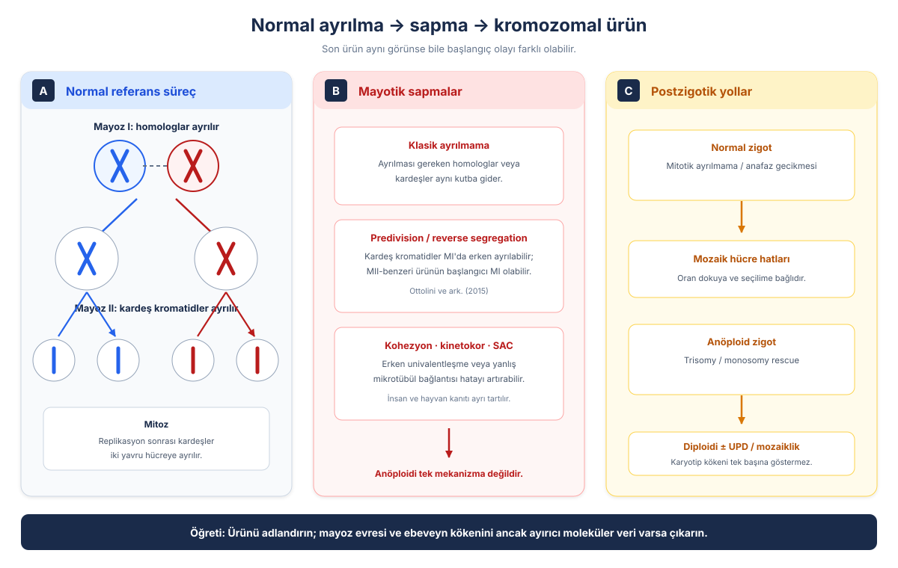
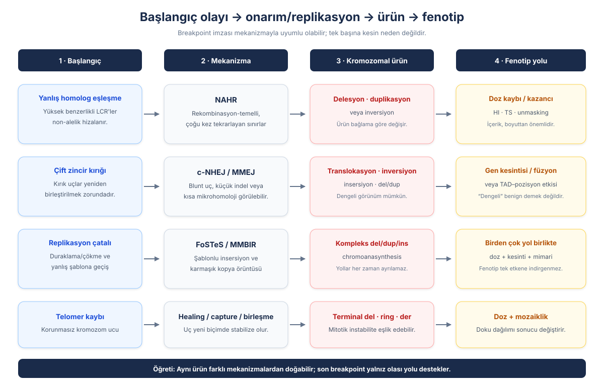
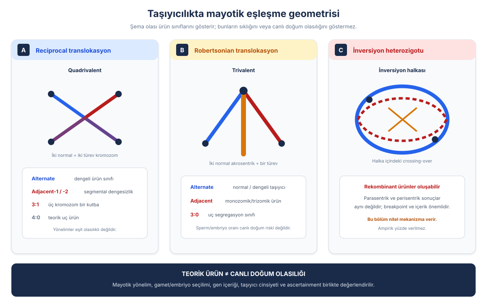
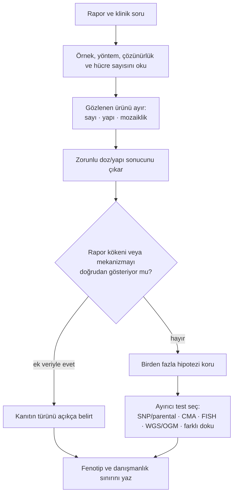
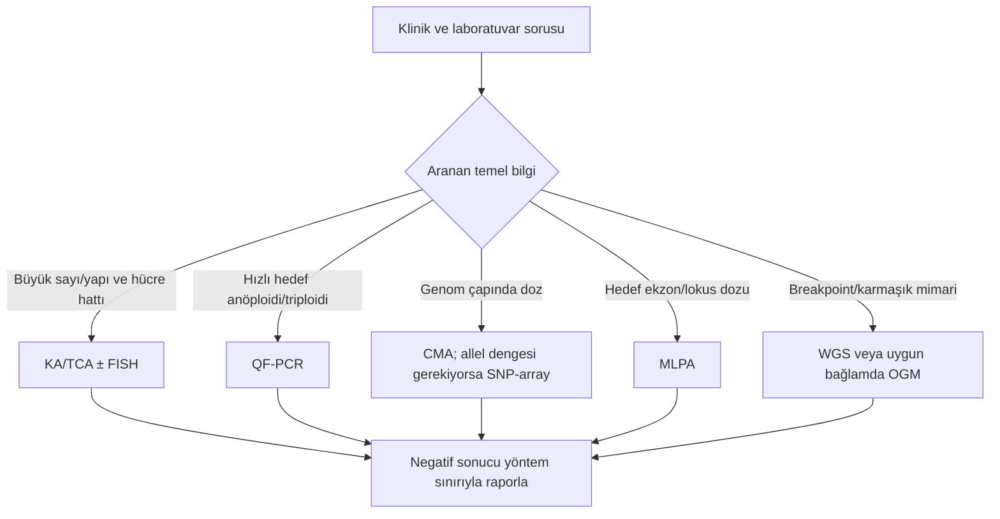
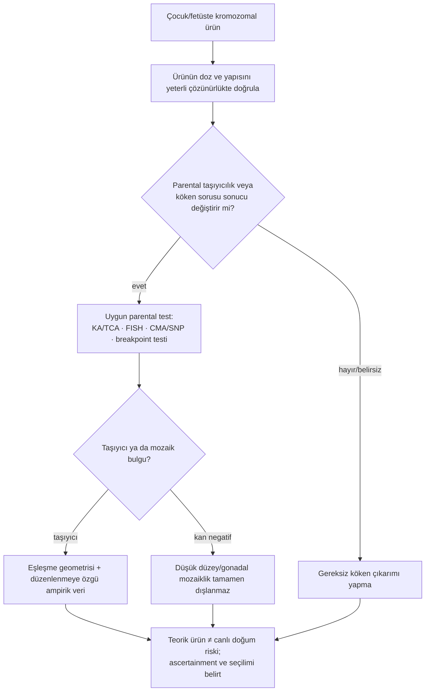

# Bölüm 8 — Sayısal ve Yapısal Kromozom Anomalileri: Oluşum, Sonuç ve Raporun Geriye Doğru Okunması

> **Bölümün çekirdek tezi:** Bir kromozom raporu oluşum olayının filmi değil, olaydan sonra kalan **ürünün yöntemle görülebilen fotoğrafıdır**. Doğru yorum; önce normal mayoz ve mitozu kurmayı, sonra hatanın nerede oluşabileceğini, hangi kromozomal ürünü yarattığını, doz ve mimariyi nasıl değiştirdiğini ve kullanılan testin neyi görebildiğini birlikte düşünmeyi gerektirir. Bu nedenle rapordan mekanizmaya geri dönüş kesin bir denklem değil, ek moleküler ve ebeveyn verileriyle daraltılan olasılıksal bir çıkarımdır.

> **📘 Okuma katmanları.** Kitabın birincil hedefi **tıbbi genetik ve çocuk genetiği hekimleri, klinik genomik/varyant yorumlama uzmanları, tıbbi biyoloji uzmanları ve moleküler tanı laboratuvarı ekipleridir**; pediatri hekimleri, genetik danışmanlık ekipleri ve ileri düzey tıp öğrencileri ikincil hedef kitledir. Bölümü kendi katmanınızdan okuyabilirsiniz:
> · **① Temel — tıp öğrencisi:** §1–3 ve Şekil 8.1–8.2 ile normal ayrılma → hata → ürün zincirini kurun.
> · **② Klinik — pediatrist ve klinisyen:** §4–5 ile ürünün fenotipe ve test sonucuna nasıl dönüştüğünü izleyin.
> · **③ İleri düzey — genetik uzmanı, laboratuvar, varyant yorumlayan:** §6–9 ile ISCN raporunu geriye doğru okuyun; ebeveyn taşıyıcılığı ve yineleme riskinin sınırlarını değerlendirin.

> 🖼️ **Görseller hakkında not:** Şekiller `assets/` klasöründe SVG, akış diyagramları Mermaid olarak gömülüdür.

---

## Öğrenme hedefleri

Bu bölümü tamamlayan okuyucu:

1. Sayısal–yapısal ve dengeli–dengesiz–görünürde dengeli ayrımlarını doğru kullanabilir.
2. Normal mayoz I, mayoz II ve mitozda hangi kromozomal birimin ayrıldığını açıklayabilir.
3. Anöploidinin klasik ayrılmama dışında rekombinasyon, kohezyon, predivision, reverse segregation ve postzigotik yollarla oluşabileceğini ayırt edebilir.
4. Triploidi ile diandri/diginiyi, yapısal yeniden düzenlenmelerle DSB/onarım ve replikasyon mekanizmalarını ilişkilendirebilir.
5. Bir kromozomal ürünü doz, gen kesintisi, füzyon, TAD, unmasking, imprinting ve mozaiklik üzerinden fenotipe bağlayabilir.
6. KA/TCA, QF-PCR, FISH, CMA/SNP-array, MLPA, WGS ve OGM'nin yanıtladığı soruları ve kör noktalarını karşılaştırabilir.
7. Bir ISCN sonucunu adım adım okuyup sonucun söylediği ile söylemediğini ayırabilir.
8. Reciprocal/Robertsonian translokasyon ve inversiyon taşıyıcılığında teorik segregasyon ürünlerini canlı doğum riskiyle karıştırmadan açıklayabilir.

---

## 1. Kavramsal tanım

Kromozom anomalileri iki ayrı eksende sınıflandırılır. **Sayısal anomali**, tam kromozom ya da tam kromozom takımının sayısını değiştirir: anöploidi bir veya birkaç kromozomun eksik/fazla olması; poliploidi ise bütün haploid takımın çoğalmasıdır. **Yapısal anomali**, kromozom parçasının kaybı, kazanımı, yön değiştirmesi, başka yere taşınması veya karmaşık biçimde yeniden bağlanmasıdır. Bu iki eksen örtüşebilir: örneğin yapısal bir ebeveyn düzenlenmesi, gamette sayısal değil fakat segmental olarak dengesiz bir ürün doğurabilir (ISCN 2024, s.35–74).

İkinci eksen **denge**dir. **Dengesiz** ürün, genomik materyalde kayıp veya kazanç taşır. **Dengeli** ürün, kullanılan sitogenetik yöntemin çözünürlüğünde net kayıp/kazanç göstermeyen yeniden düzenlenmedir. Buradaki “dengeli”, yalnız gözlenen kopya dengesini anlatır; benignlik, gen işlevinin korunması, kırılma noktasında baz düzeyinde kayıpsızlık veya düzenleyici mimarinin bozulmadığı anlamına gelmez. Fenotipli ve seçilmiş “dengeli” olgularda nükleotid çözünürlüklü dizileme, klasik karyotipin göremediği gen kesintilerini, küçük dengesizlikleri ve daha karmaşık yapıları ortaya koymuştur; bu kohortlardaki oranlar sağlıklı taşıyıcıların genel riskine çevrilemez (Redin ve ark., 2017; Ordulu ve ark., 2016).

**Görünürde dengeli** ifadesi bu nedenle yararlıdır: ürün karyotipte dengeli görünür, fakat moleküler çözünürlük henüz sonucu doğrulamamıştır. “Dengeli” raporunu klinik son nokta değil, çözünürlüğü belirtilmesi gereken bir gözlem olarak okumak gerekir.

**Tablo 8.1 — Bölümün temel kavramları**

| Kavram | Ne anlatır? | Ne anlatmaz? |
|---|---|---|
| **Anöploidi** | Bir veya birkaç kromozomun sayısal kayıp/kazancı | Hatanın mutlaka klasik ayrılmama olduğunu |
| **Poliploidi** | Tam haploid takım sayısının artması | Ebeveyn kökenini tek başına |
| **Yapısal anomali** | Kromozom segmentlerinin yeniden düzenlenmesi | Ürünün zorunlu olarak dengesiz olduğunu |
| **Dengeli** | Yöntemin çözünürlüğünde net doz kaybı/kazancı görülmemesi | Benignliği veya moleküler olarak kayıpsızlığı |
| **Mozaik** | Tek zigottan gelişen bireyde iki ya da daha fazla kromozomal hücre hattı | Hatanın tam zamanını veya tüm dokulardaki oranını |
| **ISCN sonucu** | Örnek, yöntem ve gözlenen ürünün standart gösterimi | Oluşum mekanizmasının tek ve kesin açıklamasını |

### 1.1. Normal referans süreç: mayoz I, mayoz II ve mitoz

Mekanizma çıkarımı için önce ayrılması gereken birimin ne olduğunu sabitlemek gerekir. **Mayoz I'de** homolog kromozomlar birbirinden ayrılır; kardeş kromatidler sentromerde birlikte kalır ve aynı kutba yönelir. **Mayoz II'de** kardeş kromatidler ayrılır. **Mitozda** da replikasyonla oluşmuş kardeş kromatidler iki yavru hücreye dağıtılır. Bu ayrım basit görünür, fakat bir sonucun “MI hatası” veya “MII hatası” diye yorumlanabilmesi ancak polimorfik belirteçler, rekombinasyon örüntüsü ve çoğu zaman ebeveyn örnekleri gibi karyotipin taşımadığı bilgilerle mümkündür (Ottolini ve ark., 2015; Conlin ve ark., 2010).

> **🏷️ Pedagojik sentez — “film ve fotoğraf” ayrımı.** Bu bölümde kullanılan “normal süreç → hata → ürün → rapor → geriye çıkarım” zinciri kitabın pedagojik sentezidir; literatürde bu adla yerleşik bir sınıflandırma değildir. Zincirin her biyolojik bileşeni kaynaklıdır.

## 2. Moleküler mekanizma

### 2.1. Anöploidi yalnız klasik ayrılmama değildir

Klasik **ayrılmama (nondisjunction)**, ayrılması gereken homologların veya kardeş kromatidlerin aynı kutba gitmesidir. Ancak “anöploidi = nondisjunction” eşitliği bilimsel olarak eksiktir. Rekombinasyonun yokluğu ya da konumunun elverişsizliği, yaşla artan sentromerik kohezyon kaybı, bivalentlerin zamanından önce univalentlere ayrılması, kardeş kromatidlerin MI'da erken ayrılması (**premature separation of sister chromatids, PSSC/predivision**) ve **reverse segregation** farklı başlangıç yollarıdır. Reverse segregation'da iki homologun kardeş kromatidleri MI'da ayrılır; MII'de ise kardeş olmayan kromatidler birbirinden ayrılır. İnsan oosit–embriyo eşleşmelerinde bu örüntü doğrudan gösterilmiş; bazı MII-benzeri sonuçların aslında MI'da başlayan bir olayın devamı olduğu anlaşılmıştır (Ottolini ve ark., 2015). Fare oositindeki canlı görüntüleme ve sınırlı insan gözlemleri, bivalentlerin erken ayrılmasının predivision için zemin oluşturduğunu destekler; hayvan bulguları doğrudan insan sıklığı olarak kullanılamaz (Sakakibara ve ark., 2015).

Kinetokor–mikrotübül bağlantıları ve **iğ ipliği kontrol noktası (spindle-assembly checkpoint, SAC)** bu sürecin kalite kontrolüdür. İnsan oositlerinde kohezyon kaybıyla kinetokordaki BUBR1 azalması arasında ilişki bulunmuştur; bu, yaşla ilişkili anöploidiye katkı veren bir hat olmakla birlikte tek ve evrensel neden değildir (Lagirand-Cantaloube ve ark., 2017). Yaşlı fare oositlerinde kusurlu kinetokor–mikrotübül bağlantıları gösterilmiş; özellikle bir kinetokorun iki kutba birden bağlandığı **merotelik** bağlantının SAC'den kaçabileceği vurgulanmıştır (Shomper ve ark., 2014). İnsan gözlemsel ve fare deneysel kanıtları aynı düzeyde sunulmamalıdır.

**Tablo 8.2 — Sayısal anomalilere giden başlıca yollar**

| Başlangıç olayı | Hücresel sonuç | Son üründen tek başına çıkarılabilir mi? |
|---|---|---|
| Homologların klasik ayrılmaması | MI kökenli disomik/nulizomik ürünler | Hayır; ebeveyn belirteçleri gerekir |
| Kardeş kromatidlerin ayrılmaması | MII veya mitotik hata örüntüsü | Hayır; karyotip evreyi göstermez |
| Rekombinasyon örüntüsü kusuru | Bivalent kararsızlığı ve yanlış yönelim | Hayır |
| Kohezyon kaybı / predivision | Kardeşlerin MI'da erken ayrılması | Hayır |
| Reverse segregation | MI'da kardeşlerin, MII'de kardeş olmayanların ayrılması | Genotipleme ve rekombinasyon haritasıyla desteklenir |
| Kinetokor/SAC kusuru | Yanlış bağlantının düzeltilmemesi | Son üründen kesinleştirilemez |
| Postzigotik mitotik hata / anafaz gecikmesi | Mozaik anöploidi veya kromozom kaybı | Doku, hücre hattı ve SNP örüntüsü gerekir |

### 2.2. Postzigotik anöploidi, rescue, mozaiklik ve UPD köprüsü

Anöploidi döllenmeden önce oluşmak zorunda değildir. Normal bir zigotta mitotik ayrılmama veya **anafaz gecikmesi** bir kromozomun yavru çekirdeğe yetişememesine ve mozaik hücre hatlarına yol açabilir. Tersine, anöploid bir zigotta fazla kromozomun kaybı (**trisomy rescue**) ya da tek kromozomun kopyalanması (**monosomy rescue**) sayıyı diploidiye döndürebilir. Sayı düzelirken iki homologun aynı ebeveynden kalması **uniparental dizomiye (UPD)** yol açabilir. UPD kopya-nötrdür; standart karyotipte görünmez. SNP örüntüsü, haplotip ve ebeveyn verisi, mozaik anöploidi ile UPD'nin mayotik/mitotik kökenini daraltabilir (Conlin ve ark., 2010; Eggermann, 2020).

Bu köprü klinik olarak iki nedenle önemlidir. Birincisi, imprintli bir bölgede iki kopyanın aynı ebeveynden gelmesi doz sayısı normal olsa bile hastalık yapabilir. İkincisi, izodizomi resesif bir varyantı homozigotlaştırabilir. Bununla birlikte yalnız “heterodizomi” veya “izodizomi” sözcüğünden hatanın evresi kesinleştirilmez; rekombinasyon ve postzigotik olaylar basit şemaları karmaşıklaştırabilir (Bölüm 10).

### 2.3. Triploidi ve diğer poliploidiler

**Triploidi**, iki yerine üç haploid kromozom takımı bulunmasıdır. Ek takım paternal kökenliyse **diandri**, maternal kökenliyse **digini** denir. Diandri çoğunlukla iki spermin katılımı veya diploid sperm; digini çoğunlukla diploid oosit yollarıyla ilişkilidir. Ancak köken sıklıkları örneklemin gebelik haftasına ve seçilme biçimine duyarlıdır; tek bir genel yüzde doğru değildir (Zaragoza ve ark., 2000).

Paternal kökenli triploidiler daha büyük/kistik plasenta ve parsiyel molar değişikliklerle, maternal kökenliler küçük plasenta ve belirgin büyüme kısıtlılığıyla ilişkilendirilebilir. Bu ayrım ileri gebeliklerde daha belirgindir; birinci trimester kayıplarında embriyo görünümü ebeveyn kökenini güvenilir biçimde ayırmayabilir (McFadden ve Robinson, 2006). Fenotipten köken tayini yapılmaz; moleküler köken analizi gerekir.

### 2.4. Yapısal yeniden düzenlenme: kırık, yanlış eşleşme ve replikasyon

Yapısal ürünler iki geniş başlangıçtan doğar: DNA çift zincir kırıklarının (**DSB**) yanlış onarılması ve replikasyon çatalının yanlış şablona geçmesi. Telomer kaybı, kromozom ucunu korunmasız bir DSB gibi bırakabilir; uçlar birleşebilir, yeni telomer kazanabilir veya başka bir kromozomdan telomer yakalayabilir. Son ürün delesyon, disentrik/ring yapı, translokasyon veya daha karmaşık bir düzenlenme olabilir (Burssed ve ark., 2022; Gardner ve Amor, 2018, s.258–266).

**Tablo 8.3 — Yapısal yeniden düzenlenme mekanizmaları ve yorum sınırları**

| Mekanizma | Tipik biyolojik bağlam | Üründe görülebilen eğilim | Kesinlik sınırı |
|---|---|---|---|
| **NAHR** | Yüksek benzerlikli non-alelik tekrarlar arasında yanlış rekombinasyon | Tekrarlayan, benzer sınırlı delesyon/duplikasyon veya inversiyon | Tekrar mimarisi güçlü destek verir; ürün yine bağlamla yorumlanır |
| **c-NHEJ** | DSB uçlarının az/hiç homoloji olmadan birleştirilmesi | Küçük kayıp/kazanım, blunt uç veya kısa mikrohomoloji | c-NHEJ de mikrohomoloji gösterebilir |
| **MMEJ/alt-EJ** | Uçların kısa mikrohomolojiyle hizalanması | Breakpoint çevresinde mikrohomoloji ve kayıp | Mikrohomoloji tek başına MMEJ kanıtı değildir |
| **FoSTeS/MMBIR** | Replikasyon çatalı durması/çökmesi ve şablon değişimi | Şablonlu insersiyon, yön değişimi, kopya kazanımı ve kompleks yapı | Salt breakpoint dizisiyle FoSTeS ve MMBIR her zaman ayrılamaz |
| **Telomer kaybı–healing/capture** | Korunmasız kromozom ucu | Terminal delesyon, ring veya türev kromozom | Son ürün başlangıç olayını tek başına kesinleştirmez |

NAHR, uzun ve yüksek benzerlikli **düşük-kopyalı tekrarlar (low-copy repeats, LCR)** arasında gerçekleştiği için benzer kırılma aralıklarına sahip **tekrarlayan** ürünler oluşturabilir. c-NHEJ, MMEJ ve replikasyon-temelli yollar ise daha heterojen breakpointler doğurabilir. Fakat yeniden düzenlenmeden geriye bakarken yalnız son bağlantı noktası görülür. c-NHEJ de kısa mikrohomoloji üretebilir; bu nedenle breakpointte mikrohomoloji bulunması tek başına MMEJ veya replikasyon-temelli mekanizma kanıtı değildir. Aynı şekilde FoSTeS ile MMBIR bazı olgularda salt breakpoint dizisinden kesin ayrılamaz (Burssed ve ark., 2022; Hastings ve ark., 2009; Liu ve ark., 2011).

### 2.5. Chromothripsis, chromoanasynthesis ve kompleks ürünler

**Chromothripsis**, sınırlı kromozomal bölgede çok sayıda kırılma ve parçaların tek ya da az sayıda kriz olayıyla yeniden birleştirilmesi modeli olarak tanımlanmıştır. Kırılmaların kümelenmesi, bağlantı yönlerinin karmaşıklığı ve sınırlı kopya durumları arasında salınım bu modele destek verir; ilk kurucu veri kanser genomlarından gelmiştir ve konstitüsyonel olgular için bağımsız bağlam gerekir (Stephens ve ark., 2011).

**Chromoanasynthesis**, konstitüsyonel kompleks yeniden düzenlenmelerde tanımlanan, replikasyon-temelli şablon değişimleriyle kopya kazanımları, duplikasyon/triplikasyonlar ve şablonlu insersiyonlar üreten örüntüdür (Liu ve ark., 2011). Bu adlar gözlenen örüntüyü açıklayan mekanizma modelleridir; tek bir mikrodizi profili veya tek breakpoint ayrıntısı mutlak kanıt sayılmaz. “Chromothripsis'te duplikasyon bulunmaz” gibi katı bir kural kullanılmamalıdır; kopya-durumu örüntüsü yöntem ve olay bağlamına göre değerlendirilir.

## 3. Kromozomal ürünler

Mekanizma ile ürün aynı şey değildir. Aynı ürün farklı başlangıç yollarından doğabilir; aynı başlangıç yolu da farklı ürünler oluşturabilir. Klinik rapor önce ürünü adlandırır.

**Tablo 8.4 — Başlıca kromozomal ürünler ve ilk yorum sorusu**

| Ürün | Temel tanım | İlk yorum sorusu |
|---|---|---|
| **Monozomi / trizomi** | Bir kromozomun bir veya üç kopyası | Tam mı mozaik mi; serbest mi türev yapıya bağlı mı? |
| **Triploidi/poliploidi** | Tam kromozom takımının artması | Köken ve oluşum yolu moleküler olarak belirlendi mi? |
| **Delesyon** | Segment kaybı | Hangi gen/bölge ve hangi alel kaybedildi? |
| **Duplikasyon** | Segment kazanımı | Kopyanın konumu ve yönü biliniyor mu? |
| **Reciprocal translokasyon** | İki kromozom arasında segment değişimi | Gerçekten dengeli mi; breakpoint neyi kesiyor? |
| **Robertsonian translokasyon** | Akrosentrik kromozomların uzun kollarının birleşmesi | Serbest trizomi ile türev kaynaklı trizomi ayrıldı mı? |
| **İnversiyon** | Segmentin aynı kromozomda ters yönlenmesi | Breakpoint/gen etkisi ve rekombinant ürün olasılığı nedir? |
| **İnsersiyon** | Bir segmentin başka konuma yerleşmesi | Donör bölgede kayıp ve yerleşim yönü çözüldü mü? |
| **Ring kromozom** | İki ucun birleşmesiyle halka yapı | Terminal kayıp, ring instabilitesi ve mozaiklik var mı? |
| **İzokromozom / idic** | Bir kolun iki kopyası, diğer kolun kaybı; disentrik varyant olabilir | Doz, sentromer etkinliği ve mozaiklik nedir? |
| **Marker kromozom** | Kökeni klasik bantlamayla tam tanımlanamayan ek yapı | Köken, euchromatin içeriği ve UPD eşliği nedir? |
| **Recombinant kromozom** | Ebeveyn inversiyonu/yeniden düzenlenmesinden doğan dengesiz ürün | Hangi segment duplike, hangisi delesedir? |
| **Kompleks yeniden düzenlenme** | En az birkaç breakpoint ve birden fazla bağlantı | Kopya sayısı ile bağlantı mimarisi birlikte çözüldü mü? |

Delesyon ve duplikasyon doz değişimini doğrudan gösterir; translokasyon, inversiyon ve insersiyon ise karyotipte dengeli görünebilir. Ring, izokromozom/idic ve marker kromozomlarda mitotik instabilite ve farklı hücre hatları tabloyu değiştirebilir. Ürünün adı, fenotipi tek başına belirlemez; içerik ve yöntem çözünürlüğü gerekir (ISCN 2024, s.40–74; Gardner ve Amor, 2018, s.69–228).

## 4. Kromozomal üründen fenotipe

**Tablo 8.5 — Kromozomal ürünü fenotipe bağlayan yollar**

| Yol | Biyolojik sonuç | Yorumda gereken veri |
|---|---|---|
| **Doz kaybı/kazancı** | Haploinsufficiency veya triplosensitivite | Gen/bölge doz duyarlılığı, CNV sınırları |
| **Gen kesintisi** | Transkript/protein kaybı veya anormal ürün | Nükleotid düzeyinde breakpoint, ilgili transkript |
| **Gen füzyonu** | Yeni/ektopik füzyon ürünü | Yön, okuma çerçevesi, RNA/protein kanıtı |
| **TAD/pozisyon etkisi** | Enhancer–gen eşleşmesinin değişmesi | Kırılma noktası, düzenleyici mimari, uygun doku |
| **Unmasking** | Karşı aleldeki resesif varyantın açığa çıkması | Kalan alelin dizilenmesi ve faz bilgisi |
| **Imprinting/UPD** | Ebeveyn-kökenine bağlı ifade bozukluğu | Metilasyon, SNP/haplotip ve parental örnek |
| **Mozaiklik** | Hücre hattı oranı ve doku dağılımına bağlı şiddet | Yeterli hücre/okuma, uygun doku, yöntem sınırı |

Doz etkisi yalnız CNV büyüklüğüyle ölçülmez. ClinGen/ACMG çerçevesi; genomik içerik, gen/bölge doz duyarlılığı, olgu-kontrol verisi, literatür ve kalıtım kanıtını birlikte tartar (Riggs ve ark., 2020). Genom çapında pHaplo/pTriplo haritaları doz duyarlılığı için destekleyici bir önceliklendirme sağlar; klinik sınıflama tek başına model skoruna bırakılamaz (Collins ve ark., 2022).

Bir yeniden düzenlenme net kopya kaybı/kazancı olmadan da hastalık yapabilir. Kırılma noktası bir geni kesebilir; iki genin parçalarını işlevsel bir füzyonda birleştirebilir veya üç boyutlu genom sınırlarını değiştirebilir. Lupiáñez ve arkadaşları, TAD sınırı bozulmasının normal enhancer–promoter ilişkilerini yeniden kablolayıp ektopik gen ifadesi ve ekstremite malformasyonu oluşturabildiğini insan olguları ve yeniden mühendislikli fare modellerinde göstermiştir (Lupiáñez ve ark., 2015). Bu mekanizma güçlü fakat doku/bağlam bağımlıdır; her TAD sınırı kırığı otomatik olarak patojen sayılmaz.

Mozaiklikte fenotip yalnız kan örneğindeki oranla açıklanamaz. Hatanın gelişimsel zamanı, etkilenen hücre soyları, anormal hattın seçilimi ve incelenen doku önemlidir. “Kanda düşük/negatif” sonucu ilgili dokuda aynı oranı garanti etmez (Campbell ve ark., 2014; Liu ve ark., 2020; Bölüm 12).

## 5. Test ve rapordaki görünüm

Test seçimi “en gelişmiş yöntem hangisi?” sorusu değil, **hangi bilinmeyeni çözmek istiyoruz?** sorusudur. Hiçbir yöntem bütün sayısal ve yapısal anomalileri aynı duyarlılık ve çözünürlükte göstermez. Aşağıdaki tabloda **KA** kromozom analizini, **TCA** hedefli kromozom analizini, **QF-PCR** kantitatif floresan PCR'ı, **FISH** floresan in situ hibridizasyonu, **CMA** kromozomal mikrodiziyi ve **OGM** optik genom haritalamayı ifade eder (ISCN 2024, s.96–189; ACGS KA/TCA v1.0, 2024).

**Tablo 8.6 — Kromozom testlerinin yanıtladığı sorular ve temel kör noktaları**

| Test | En iyi yanıtladığı soru | Temel sınır |
|---|---|---|
| **KA (kromozom analizi)** | Büyük sayısal/yapısal değişiklik ve hücre hattı mimarisi nedir? | Submikroskopik CNV ve baz düzeyi breakpoint; sınırlı hücre örneklemi |
| **TCA** | Bilinen/hedefli kromozomal yapı bu örnekte var mı? | Genom çapında tarama değildir |
| **QF-PCR** | Hedeflenen yaygın anöploidiler/triploidi için allel dozu nedir? | Hedef dışı kromozomlar ve yapısal mimariyi dışlamaz |
| **FISH** | Belirli lokus/kromozom hücrede nerede ve kaç sinyal veriyor? | Probla sınırlıdır; negatif sonuç prob dışını dışlamaz |
| **CMA/array-CGH** | Genom çapında kopya kaybı/kazancı var mı? | Dengeli SV'yi, yön/konumu ve bazı düşük mozaikleri göstermez |
| **SNP-array** | Kopya sayısına ek olarak allel dengesi/AOH/UPD ipucu var mı? | Heterodizomik UPD ve düşük düzey/karmaşık olaylar kaçabilir; parental doğrulama gerekebilir |
| **MLPA** | Seçilmiş ekzon/lokuslarda göreli doz değişikliği var mı? | Hedefe yöneliktir; konum, yön ve genom çapını göstermez |
| **Short-read WGS** | CNV ve birçok breakpointi read-depth/read-pair/split-read ile çözebilir mi? | Tekrarlar, sentromer/telomer ve bazı dengeli/karmaşık olaylar; pipeline'a bağımlılık |
| **OGM** | Büyük dengeli/dengesiz SV mimarisi genom çapında nedir? | Centromerik/Robertsonian yapılar, bazı LCR breakpointleri ve düşük mozaiklik; sekans düzeyi vermez |

CMA için tarihsel “birinci basamak” kanıtı, açıklanamayan DD/ID/ASD/MCA olgularında ve tanınabilir kromozom sendromları dışlanmış kohortlarda elde edilmiştir; tüm klinik sorulara evrensel test sırası olarak genellenemez (Miller ve ark., 2010). MLPA hedef-prob temelli göreli doz ölçer ve genom çapında tarama değildir (Schouten ve ark., 2002). OGM'nin çok merkezli validasyonu yüksek uyum göstermiştir; ancak çalışma Robertsonian/sentromerik dengeli translokasyonları, büyük düşük-kopya tekrarları içindeki bazı breakpointleri ve düşük düzey mozaikleri dışlamıştır. Bu nedenle “karyotipin evrensel yerine geçer” sonucu kurulamaz (Iqbal ve ark., 2023).

QF-PCR yaygın anöploidiler ve triploidi için hızlı, hedefli bir testtir. Allel örüntüsü maternal hücre kontaminasyonu veya mozaiklik için ipucu verebilir; normal sonuç genom çapındaki diğer anomalileri veya yapısal düzenlenmeyi dışlamaz (ACGS QF-PCR v4, 2018). Short-read WGS'de read-depth, read-pair ve split-read sinyalleri farklı SV sınıflarını tamamlar; yalnız read-depth kullanan bir iş akışı dengeli olayları kaçırabilir. Tekrar bölgeleri ve referans kör noktaları sürer (ACGS WGS-SV Guidance, iç sürüm 2026 v0.1; dosya adı v1.2 — sürüm uyuşmazlığı aşağıda belirtilmiştir).

Karyotipte “mozaiklik saptanmadı” ifadesi sayılan hücre sayısıyla sınırlıdır. Binom temelli klasik çerçevede 30 hücrenin incelenmesi yaklaşık %10 ve üzerindeki bir hattı, 60 hücrenin incelenmesi yaklaşık %5 ve üzerindeki bir hattı %95 güven düzeyinde dışlamaya yöneliktir (Hook, 1977; ACGS KA/TCA v1.0, 2024). Bu eşikler incelenen örnek içindir; düşük düzeyi, kültür seçilimini, gonadal mozaikliği veya başka dokudaki bir hattı tümüyle dışlamaz.

### 5.1. ISCN raporunu adım adım okuma

ISCN, mekanizma kitabı değil, standart nomenklatür sistemidir. ISCN 2024'te mayotik kromozom bölümü çıkarılmıştır; bu nedenle örnekler ürünün nasıl yazıldığını doğrular, nasıl oluştuğunu değil (ISCN 2024, s.3).

Bir raporu şu sırayla okuyun:

1. **Örnek ve yöntem:** prenatal/postnatal, kültürlü/kültürsüz örnek; karyotip, FISH, array veya dizileme mi?
2. **Çözünürlük ve örnekleme:** bant çözünürlüğü, prob kapsamı, array koordinat sistemi, hücre/koloni sayısı ve mozaik oranı nedir?
3. **Toplam sayı ve seks kromozomu bileşimi:** ilk iki alan gözlenen hücre hattının temelini verir.
4. **Anomali bileşenleri:** kayıp/kazanç, türev kromozom, yeniden düzenlenme tipi ve breakpointler sırayla çözülür.
5. **Mozaik hücre hatları:** köşeli parantez içindeki sayılar incelenen hücre sayısını gösterir; oran tüm dokuların oranı değildir.
6. **Köken ekleri:** `mat`, `pat`, `inh` gibi ekler yalnız köken başka bir incelemeyle biliniyorsa okunur; karyotipten köken üretilmez.
7. **Yöntemin söylemediği:** doz, yön, parental köken, mayoz evresi veya nükleotid düzeyi çözülmemişse açık soru olarak bırakılır.

**Tablo 8.7 — ISCN 2024 ana metninden doğrulanmış rapor örnekleri**

| ISCN örneği | Güvenle söylenebilen | Tek başına söylenemeyen |
|---|---|---|
| `45,X` (s.38) | 45 kromozom ve tek X gözlenmiştir | Hatanın ebeveyn kökeni/evresi ve tüm dokulardaki durum |
| `47,XXX` (s.38) | Üç X içeren 47 kromozomlu ürün | MI mı MII mi, maternal mı paternal mı |
| `47,XYY` (s.38) | İki Y içeren 47 kromozomlu ürün | Oluşum zamanının kesinliği |
| `47,XX,+21` (s.40) | Serbest görünen ek 21 içeren dişi karyotipi | Ebeveyn kökeni veya nondisjunction evresi |
| `45,X[13]/46,XY[17]` (s.39) | İncelenen hücrelerde iki hat ve sayımları | Diğer dokuların oranı ve embriyonik başlangıç olayı |
| `46,XX,del(4)(p15.2)` (s.48) | 4p15.2'den başlayan görünür delesyon | Baz düzeyi sınırlar, gen içeriğinin tümü ve köken |
| `46,XX,dup(1)(p34p31)` (s.56) | 1p segment duplikasyonu | Ek kopyanın moleküler yönü/konumu çözülmediyse bunlar |
| `46,XX,i(17)(q10)` (s.61) | 17q izokromozomu olarak raporlanan ürün | Centromer etkinliğinin ve mozaikliğin tüm ayrıntısı |
| `46,XX,r(20)(p13q13.3)` (s.65) | 20'nin p13 ve q13.3 uçlarıyla ilişkili ring | Uçlardaki mikrokayıp ve ring instabilitesinin derecesi |
| `46,XX,rec(2)dup(2p)inv(2)(p21q31)dmat` (s.45) | Maternal inversiyonla ilişkili rekombinant 2 ve 2p duplikasyonu | Canlı doğum olasılığı veya ailenin kişisel riski |
| `46,XX,+21,der(21;21)(q10;q10)` (s.71) | 21;21 türeviyle ilişkili kromozom 21 fazlalığı | Türevin kesin biyolojik oluşum yolu ve parental köken |

## 6. Rapordan geriye doğru mekanizma, ebeveyn incelemesi ve yineleme

### 6.1. Üründen olası mekanizmaya geriye gitmek

> **🏷️ Pedagojik sentez — hipotez daraltma.** Raporu geriye doğru okumada önce gerçek gözlem ayrılır; ardından ürünün zorunlu doz sonucu çıkarılır; sonra birden fazla olası mekanizma sıralanır ve bunları ayıracak test belirlenir. Bu sıra kitabın kaynaklı bileşenlerden kurduğu yorum çerçevesidir.

**Tablo 8.8 — Gözlemden mekanizmaya kanıt basamakları**

| Gözlem | Makul hipotezler | Ayırıcı ek veri |
|---|---|---|
| Serbest trizomi | Mayotik ayrılma hatası; postzigotik mitotik hata | SNP/haplotip, parental örnek, mozaik dağılımı |
| Mozaik trizomi/diploidi | Trisomy rescue; normal zigotta mitotik hata | Allel örüntüsü, UPD analizi, çoklu doku |
| Terminal delesyon | DSB + telomer healing/capture; ring/türev çözülmesi | FISH, WGS/uzun okuma, parental inceleme |
| Tekrarlayan aynı sınırlı CNV | LCR-aracılı NAHR | Referans tekrar mimarisi ve breakpoint aralığı |
| Non-recurrent kompleks CNV | NHEJ/MMEJ veya replikasyon-temelli olay | Nükleotid breakpointleri; yine de kesinlik sınırlı |
| Görünürde dengeli translokasyon | Basit reciprocal olay; kriptik komplekslik | CMA + breakpoint çözünürlüklü WGS/OGM |
| Marker kromozom | Farklı kromozomal kökenler; rescue eşliği | Centromer/lokus FISH, CMA/SNP-array, parental örnek |

Karyotip tek başına parental kökeni veya mayoz evresini göstermez. SNP-array örüntüsü ve ebeveyn genotipleri bazı olaylarda mayotik/mitotik kökeni ve UPD'yi ayırabilir; bu bilgi ayrıca üretilmelidir (Conlin ve ark., 2010). Breakpointte mikrohomoloji bulunması da tek bir onarım yolunu kesinleştirmez. Sonuç dili “kanıtlar X ile uyumludur” biçiminde olmalı; “X mekanizması kanıtlandı” ancak gerçekten ayırıcı veri varsa kullanılmalıdır.

### 6.2. Ebeveyn taşıyıcılığı ve mayotik eşleşme geometrisi

Reciprocal translokasyon taşıyıcısında iki normal ve iki türev kromozom mayozda homolog bölgelerini eşlemek için **quadrivalent** oluşturabilir. **Alternate** ayrılma, iki normal veya iki türev kromozomu aynı kutba göndererek genellikle dengeli ürünler oluşturur. **Adjacent-1** homolog olmayan sentromerleri, **adjacent-2** homolog sentromerleri aynı kutba taşır ve segmental dengesizlik üretir. **3:1** ayrılmada üç kromozom bir kutba, biri diğerine gider; **4:0** teorik olarak mümkündür. Bunlar olası ürün sınıflarıdır, eşit olasılıklı sonuçlar değildir (Trunca ve ark., 2022; Tonyan ve ark., 2024).

Robertsonian translokasyonda ilgili akrosentrik kromozomlar **trivalent** oluşturur; alternate, adjacent ve 3:0 benzeri ürünler görülebilir. İnsan sperm çalışmalarında taşıyıcılar ve düzenlenmeler arasında belirgin değişkenlik vardır; gamet oranları gebelik veya canlı doğum oranına doğrudan çevrilemez (Pylyp ve ark., 2013).

İnversiyon heterozigotunda homolog bölgelerin eşleşmesi bir **inversiyon halkası** oluşturabilir. Parasentrik inversiyon bölgesindeki crossing-over disentrik ve asentrik rekombinant yapılarla; perisentrik inversiyondaki crossing-over ise karşılıklı segmental delesyon/duplikasyon taşıyan rekombinantlarla sonuçlanabilir. Bu bölümde inversiyon halkası nitel mekanizma düzeyinde anlatılmaktadır; düzenlenmeye özgü ikinci bağımsız birincil tam metin bulunmadığından ampirik ürün veya yineleme yüzdesi verilmez (ISCN 2024, s.45; Gardner ve Amor, 2018, s.177–200).

Dengeli bir parental insersiyon, mayozda insere segmentin eksik veya fazla olduğu ürünlere yol açabilir; ring, marker, izokromozom/idic ve kompleks yapılar ise mitotik instabilite, kriptik doz değişimi veya parental mozaiklik nedeniyle kendilerine özgü inceleme gerektirir. Bu yapılarda önce çocuğun ürününün moleküler içeriği ve bağlantı mimarisi çözülmeli, ardından parental test aynı yapıyı gösterecek yöntemle seçilmelidir (ISCN 2024, s.54–66; Gardner ve Amor, 2018, s.158–228).

### 6.3. Yineleme riski neden sabit bir Mendel oranı değildir?

Teorik segregasyon şeması “hangi gametler mümkün?” sorusunu yanıtlar; “hangi sonuç hangi sıklıkta canlı doğar?” sorusunu yanıtlamaz. Mayotik yönelim; kromozomların büyüklüğü, sentromer konumu, değiştirilen segmentlerin uzunluğu ve krossing-over ve kiyazma düzeninden etkilenir. Sonraki aşamalarda gametin döllenme başarısı, embriyonun implantasyonu, dengesiz materyalin gen içeriği ve gebelik boyunca seçilim devreye girer. Taşıyıcı cinsiyeti ve ailenin çalışmaya hangi nedenle dahil edildiği (**ascertainment**) de ampirik tahmini değiştirir (Trunca ve ark., 2022).

Preimplantasyon embriyolarında gözlenen ürün dağılımı bile canlı doğum riski değildir; blastosiste ulaşana kadar seçilim bazı ürünleri azaltır (Tonyan ve ark., 2024). Bu nedenle kitapta genel/geçersiz “translokasyon riski” yüzdesi verilmeyecektir. Ampirik bir sayı ancak aynı düzenlenme veya doğrulanmış model, taşıyıcı cinsiyeti, aile öyküsü ve sonlanım tanımıyla birlikte kullanılabilir; model çıktısının sahte kesinliği danışmanlıkta açıkça belirtilmelidir.

Normal ebeveyn kanı, düşük düzey somatik veya gonadal mozaikliği tamamen dışlamaz. Junction-özgül duyarlı yöntemler, rutin incelemede de novo kabul edilen CNV'lerin bazı ebeveyn kanlarında düşük düzey mozaiklik göstermiş; aynı bireyin farklı dokularında farklı varyant alel oranları bulunmuştur (Campbell ve ark., 2014; Liu ve ark., 2020). Bu bulgular gonadal oranı doğrudan ölçmez; yalnız tek kan örneğinin tüm hücre soylarını temsil etmediğini gösterir. İki kardeşte aynı düzenlenmenin ve normal parental kanın bulunduğu tekil bir olgu, gonadal mozaiklik ile gizli dengeli ebeveyn düzenlenmesini ayıramadığı için kesin gonadal kanıt sayılmaz (Rahman ve ark., 2019).

## 7. Çözümlü rapor örnekleri

### 7.1. `47,XX,+21`: ürün açık, evre ve köken açık değil — ISCN 2024, s.40

**Gözlem:** Serbest görünen bir ek kromozom 21 vardır. **Doz sonucu:** 21 üzerindeki materyal artmıştır. **Makul yollar:** maternal/paternal mayotik hata veya daha nadir postzigotik olay. **Raporun söylemediği:** MI–MII ayrımı ve parental köken. **Ek inceleme:** bu sorular klinik olarak gerekiyorsa parental SNP/haplotip analizi. “Trizomi görüldü, dolayısıyla maternal MI nondisjunction” denemez.

### 7.2. `45,X[13]/46,XY[17]`: sayı, incelenen hücrelerin dağılımıdır — ISCN 2024, s.39

**Gözlem:** 30 hücrenin 13'ünde 45,X, 17'sinde 46,XY hat görülmüştür. **Makul yollar:** postzigotik kromozom kaybı, daha karmaşık erken embriyonik olay veya şimerizm dahil farklı hipotezler. **Raporun söylemediği:** gonad, deri ve diğer dokulardaki oran; olayın kesin zamanı. **Ek inceleme:** fenotipe uygun doku ve hedefli/moleküler test. Hücre sayısı bütün vücudun yüzdesi değildir.

### 7.3. `46,XX,del(4)(p15.2)`: görünür kayıp, moleküler sınır değildir — ISCN 2024, s.48

**Gözlem:** 4p15.2 düzeyinden başlayan görünür delesyon. **Doz sonucu:** distal 4p materyalinde kayıp beklenir. **Raporun söylemediği:** baz düzeyi breakpoint, küçük ek dengesizlik, kalan aleldeki varyantlar ve köken. **Ek inceleme:** CMA/WGS ile sınır ve içerik; gerektiğinde parental çalışma. Karyotip bandı kesin genom koordinatı değildir.

### 7.4. `46,XX,dup(1)(p34p31)`: kopya kazanımı, mimariyi tam çözmez — ISCN 2024, s.56

**Gözlem:** 1p34–p31 arasında duplikasyon olarak raporlanan ürün. **Doz sonucu:** ilgili segmentte kazanım. **Raporun söylemediği:** ek kopyanın tam koordinatı, yönü ve başka yere insere olup olmadığı. **Ek inceleme:** CMA doz sınırını; WGS/OGM bağlantı ve konumu çözebilir. Aynı doz profilinin farklı mimarileri olabilir.

### 7.5. `46,XX,i(17)(q10)`: bir kol kazanılırken diğeri kaybolabilir — ISCN 2024, s.61

**Gözlem:** 17q izokromozomu. **Doz sonucu:** ürünün hücredeki diğer 17 ile birlikte değerlendirilmesine bağlı olarak q kolu artışı ve p kolu kaybı doğabilir. **Raporun söylemediği:** sentromer etkinliği, düşük düzey ek hücre hatları ve moleküler breakpoint. **Ek inceleme:** FISH/CMA ve yeterli hücre sayımı.

### 7.6. `46,XX,r(20)(p13q13.3)`: ring adı, uç kaybının miktarını vermez — ISCN 2024, s.65

**Gözlem:** 20p13 ve 20q13.3 uçlarıyla ilişkili ring kromozom. **Makul sonuçlar:** terminal kayıp, ring instabilitesi ve ikincil mozaik hücre hatları. **Raporun söylemediği:** mikrokayıpların tam boyutu ve dokular arası dağılım. **Ek inceleme:** CMA/WGS ve fenotipe göre farklı doku. Ring fenotipi yalnız ring varlığıyla değil içerik ve instabiliteyle belirlenir.

### 7.7. `46,XX,rec(2)dup(2p)inv(2)(p21q31)dmat`: köken bilgisi ek testten gelir — ISCN 2024, s.45

**Gözlem:** Maternal inversiyonla ilişkili rekombinant kromozom 2 ve 2p duplikasyonu. Buradaki `mat`, ebeveyn incelemesiyle edinilmiş köken bilgisidir; karyotip şekline bakılarak üretilmemiştir. **Danışmanlık:** inversiyon halkası teorik ürünleri anlatabilir; fakat bu tek rapor canlı doğum olasılığını veya sonraki gebeliğin yüzdesini vermez.

### 7.8. `46,XX,+21,der(21;21)(q10;q10)`: aynı fenotip, farklı aile sorusu — ISCN 2024, s.71

**Gözlem:** 21;21 türeviyle ilişkili 21 materyali fazlalığı. **Klinik sonuç:** serbest trizomi 21'e benzer doz artışı olabilir. **Aile sorusu:** türevin de novo mu parental mı olduğu ve biyolojik yapısı yineleme değerlendirmesini kökten değiştirir. **Ek inceleme:** parental kromozom çalışması ve gerektiğinde moleküler köken analizi. Görünümden parental köken veya oluşum mekanizması kesinleştirilmez.

## 8. Sık yapılan hatalar

> **🔴 Sık yapılan hata kutusu**
> 1. **Her anöploidiyi nondisjunction saymak.** Predivision, reverse segregation, kohezyon/kinetokor kusuru ve postzigotik yolları dışlar.
> 2. **Karyotipten ebeveyn kökeni veya mayoz evresi okumak.** Bu bilgiler SNP/haplotip ve parental örnek gibi ek veriler gerektirir.
> 3. **“Dengeli”yi benign veya moleküler olarak kayıpsız kabul etmek.** Gen kesintisi, kriptik dengesizlik, komplekslik ve TAD etkisi olabilir.
> 4. **Breakpoint mikrohomolojisini kesin mekanizma kanıtı saymak.** c-NHEJ dahil birden fazla yol mikrohomoloji bırakabilir.
> 5. **FoSTeS ile MMBIR'ı her olguda ayırmaya çalışmak.** Salt breakpoint dizisi çoğu kez yeterli değildir.
> 6. **Teorik gamet ürünlerini canlı doğum olasılığı gibi sunmak.** Mayozdan canlı doğuma kadar çok katmanlı seçilim vardır.
> 7. **Genel bir translokasyon/inversiyon yineleme yüzdesi vermek.** Risk, düzenlenme ve aile bağlamına özgüdür; doğrulanmış ampirik veri yoksa yüzde verilmez.
> 8. **Normal ebeveyn kanıyla düşük düzey veya gonadal mozaikliği tamamen dışlamak.** Yöntem duyarlılığı ve doku örneklemi sınırlıdır.
> 9. **Negatif testi “kromozomal anomali yok” diye çevirmek.** Her negatif sonuç yalnız kullanılan yöntemin kapsadığı sınıf ve duyarlılık için negatiftir.
> 10. **ISCN nomenklatürünü mekanizma açıklaması sanmak.** ISCN gözlemi standartlaştırır; mekanizma için ayrı kanıt gerekir.

## 9. Klinik pratikte karar algoritmaları

**Algoritma 8.1 — Kromozom raporunun geriye doğru okunması**

**Algoritma 8.2 — Klinik soruya göre test seçimi**

**Algoritma 8.3 — Ebeveyn incelemesi ve yineleme çerçevesi**

## 10. Kaynaklar

> **Atıf / doğrulama notu:** Hakemli kaynakların bibliyografik verileri 03.08.2026 tarihinde PubMed E-utilities üzerinden doğrulanmış; bilimsel iddialar özetlerden değil resmî PMC tam metinlerinden kontrol edilmiştir. Normatif belgeler kurum, sürüm, tarih ve resmî bağlantıyla tanımlanmıştır. ISCN örnekleri yalnız ISCN 2024 ana metninden ve belirtilen sayfalardan alınmıştır.

1. **Ottolini CS, Newnham L, Capalbo A, ve ark. (2015).** Genome-wide maps of recombination and chromosome segregation in human oocytes and embryos show selection for maternal recombination rates. *Nature Genetics* 47(7):727–735. **PMID: 25985139** · DOI: [10.1038/ng.3306](https://doi.org/10.1038/ng.3306) — *İnsan oosit/embriyosunda rekombinasyon, predivision ve reverse segregation.*
2. **Sakakibara Y, Hashimoto S, Nakaoka Y, ve ark. (2015).** Bivalent separation into univalents precedes age-related meiosis I errors in oocytes. *Nature Communications* 6:7550. **PMID: 26130582** · DOI: [10.1038/ncomms8550](https://doi.org/10.1038/ncomms8550) — *Bivalent–univalent geçişi ve predivision; tür/örnek sınırıyla.*
3. **Lagirand-Cantaloube J, Ciabrini C, Charrasse S, ve ark. (2017).** Loss of centromere cohesion in aneuploid human oocytes correlates with decreased kinetochore localization of the SAC proteins BUB1 and BUBR1. *Scientific Reports* 7:44001. **PMID: 28287092** · DOI: [10.1038/srep44001](https://doi.org/10.1038/srep44001) — *İnsan oositinde kohezyon ve SAC ilişkisi.*
4. **Shomper M, Lappa C, FitzHarris G (2014).** Kinetochore microtubule establishment is defective in oocytes from aged mice. *Cell Cycle* 13(7):1171–1179. **PMID: 24553117** · DOI: [10.4161/cc.28046](https://doi.org/10.4161/cc.28046) — *Kinetokor–mikrotübül bağlantısı ve merotelik bağlanma; hayvan mekanizma hattı.*
5. **Conlin LK, Thiel BD, Bonnemann CG, ve ark. (2010).** Mechanisms of mosaicism, chimerism and uniparental disomy identified by single nucleotide polymorphism array analysis. *Human Molecular Genetics* 19(7):1263–1275. **PMID: 20053666** · DOI: [10.1093/hmg/ddq003](https://doi.org/10.1093/hmg/ddq003) — *Mozaiklik, rescue, UPD ve SNP-array ile köken çıkarımı.*
6. **Eggermann T (2020).** Prenatal detection of uniparental disomies: intended and incidental finding in the era of next generation genomics. *Genes* 11(12):1454. **PMID: 33287348** · DOI: [10.3390/genes11121454](https://doi.org/10.3390/genes11121454) — *UPD oluşum yolları ve kopya-nötr sınır.*
7. **Zaragoza MV, Surti U, Redline RW, ve ark. (2000).** Parental origin and phenotype of triploidy in spontaneous abortions. *American Journal of Human Genetics* 66(6):1807–1820. **PMID: 10801385** · DOI: [10.1086/302951](https://doi.org/10.1086/302951) — *Triploidide parental köken ve ascertainment.*
8. **McFadden DE, Robinson WP (2006).** Phenotype of triploid embryos. *Journal of Medical Genetics* 43(7):609–612. **PMID: 16236813** · DOI: [10.1136/jmg.2005.037747](https://doi.org/10.1136/jmg.2005.037747) — *Triploidi fenotipinin gebelik evresine bağlı yorumu.*
9. **Burssed B, Zamariolli M, Bellucco FT, Melaragno MI (2022).** Mechanisms of structural chromosomal rearrangement formation. *Molecular Cytogenetics* 15(1):23. **PMID: 35701783** · DOI: [10.1186/s13039-022-00600-6](https://doi.org/10.1186/s13039-022-00600-6) — *DSB, NAHR, NHEJ/MMEJ, FoSTeS/MMBIR ve yorum sınırları.*
10. **Hastings PJ, Ira G, Lupski JR (2009).** A microhomology-mediated break-induced replication model for the origin of human copy number variation. *PLoS Genetics* 5(1):e1000327. **PMID: 19180184** · DOI: [10.1371/journal.pgen.1000327](https://doi.org/10.1371/journal.pgen.1000327) — *MMBIR mekanistik modeli.*
11. **Stephens PJ, Greenman CD, Fu B, ve ark. (2011).** Massive genomic rearrangement acquired in a single catastrophic event during cancer development. *Cell* 144(1):27–40. **PMID: 21215367** · DOI: [10.1016/j.cell.2010.11.055](https://doi.org/10.1016/j.cell.2010.11.055) — *Chromothripsis kurucu çalışması; kanser bağlamı.*
12. **Liu P, Erez A, Nagamani SCS, ve ark. (2011).** Chromosome catastrophes involve replication mechanisms generating complex genomic rearrangements. *Cell* 146(6):889–903. **PMID: 21925314** · DOI: [10.1016/j.cell.2011.07.042](https://doi.org/10.1016/j.cell.2011.07.042) — *Konstitüsyonel chromoanasynthesis ve replikasyon-temelli kompleks ürünler.*
13. **Redin C, Brand H, Collins RL, ve ark. (2017).** The genomic landscape of balanced cytogenetic abnormalities associated with human congenital anomalies. *Nature Genetics* 49(1):36–45. **PMID: 27841880** · DOI: [10.1038/ng.3720](https://doi.org/10.1038/ng.3720) — *Fenotipli görünürde dengeli olgularda breakpoint ve kriptik komplekslik.*
14. **Ordulu Z, Kammin T, Brand H, ve ark. (2016).** Structural chromosomal rearrangements require nucleotide-level resolution: lessons from next-generation sequencing in prenatal diagnosis. *American Journal of Human Genetics* 99(5):1015–1033. **PMID: 27745839** · DOI: [10.1016/j.ajhg.2016.08.022](https://doi.org/10.1016/j.ajhg.2016.08.022) — *Prenatal görünürde dengeli düzenlenmeler ve breakpoint çözünürlüğü.*
15. **Lupiáñez DG, Kraft K, Heinrich V, ve ark. (2015).** Disruptions of topological chromatin domains cause pathogenic rewiring of gene-enhancer interactions. *Cell* 161(5):1012–1025. **PMID: 25959774** · DOI: [10.1016/j.cell.2015.04.004](https://doi.org/10.1016/j.cell.2015.04.004) — *TAD/pozisyon etkisi ve enhancer–gen yeniden kablolanması.*
16. **Miller DT, Adam MP, Aradhya S, ve ark. (2010).** Consensus statement: chromosomal microarray is a first-tier clinical diagnostic test for individuals with developmental disabilities or congenital anomalies. *American Journal of Human Genetics* 86(5):749–764. **PMID: 20466091** · DOI: [10.1016/j.ajhg.2010.04.006](https://doi.org/10.1016/j.ajhg.2010.04.006) — *CMA'nın seçilmiş klinik bağlamdaki rolü ve sınırları.*
17. **Riggs ER, Andersen EF, Cherry AM, ve ark. (2020).** Technical standards for the interpretation and reporting of constitutional copy-number variants. *Genetics in Medicine* 22(2):245–257. **PMID: 31690835** · DOI: [10.1038/s41436-019-0686-8](https://doi.org/10.1038/s41436-019-0686-8) — *ACMG–ClinGen konstitüsyonel CNV yorum standardı.*
18. **Collins RL, Glessner JT, Porcu E, ve ark. (2022).** A cross-disorder dosage sensitivity map of the human genome. *Cell* 185(16):3041–3055.e25. **PMID: 35917817** · DOI: [10.1016/j.cell.2022.06.036](https://doi.org/10.1016/j.cell.2022.06.036) — *pHaplo/pTriplo doz duyarlılığı haritası.*
19. **Schouten JP, McElgunn CJ, Waaijer R, ve ark. (2002).** Relative quantification of 40 nucleic acid sequences by multiplex ligation-dependent probe amplification. *Nucleic Acids Research* 30(12):e57. **PMID: 12060695** · DOI: [10.1093/nar/gnf056](https://doi.org/10.1093/nar/gnf056) — *MLPA'nın hedef-prob temelli göreli doz yöntemi.*
20. **Iqbal MA, Broeckel U, Levy B, ve ark. (2023).** Multisite assessment of optical genome mapping for analysis of structural variants in constitutional postnatal cases. *Journal of Molecular Diagnostics* 25(3):175–188. **PMID: 36828597** · DOI: [10.1016/j.jmoldx.2022.12.005](https://doi.org/10.1016/j.jmoldx.2022.12.005) — *OGM validasyonu ve dışlama sınırları.*
21. **Trunca C, Mendell NR, Schilit SLP (2022).** Reproductive risk estimation calculator for balanced translocation carriers. *Current Protocols* 2(12):e633. **PMID: 36571718** · DOI: [10.1002/cpz1.633](https://doi.org/10.1002/cpz1.633) — *Düzenlenmeye özgü risk değişkenleri ve sahte kesinlik sınırı.*
22. **Tonyan ZN, Puppo IL, Saifitdinova AF, Vavilova TV (2024).** Assessment of quadrivalent characteristics influencing chromosome segregation by analyzing human preimplantation embryos from reciprocal translocation carriers. *Comparative Cytogenetics* 18:1–13. **PMID: 38298496** · DOI: [10.3897/compcytogen.18.115070](https://doi.org/10.3897/compcytogen.18.115070) — *Quadrivalent segregasyonu ve embriyo evresinde seçilim.*
23. **Pylyp LY, Zukin VD, Bilko NM (2013).** Chromosomal segregation in sperm of Robertsonian translocation carriers. *Journal of Assisted Reproduction and Genetics* 30(9):1141–1145. **PMID: 23893157** · DOI: [10.1007/s10815-013-0067-1](https://doi.org/10.1007/s10815-013-0067-1) — *Robertsonian taşıyıcılarda sperm segregasyonu ve değişkenlik.*
24. **Campbell IM, Yuan B, Robberecht C, ve ark. (2014).** Parental somatic mosaicism is underrecognized and influences recurrence risk of genomic disorders. *American Journal of Human Genetics* 95(2):173–182. **PMID: 25087610** · DOI: [10.1016/j.ajhg.2014.07.003](https://doi.org/10.1016/j.ajhg.2014.07.003) — *Rutin incelemede kaçabilen parental düşük düzey mozaiklik.*
25. **Liu Q, Karolak JA, Grochowski CM, ve ark. (2020).** Parental somatic mosaicism for CNV deletions: a need for more sensitive and precise detection methods in clinical diagnostics settings. *Genomics* 112(5):2937–2941. **PMID: 32387503** · DOI: [10.1016/j.ygeno.2020.05.003](https://doi.org/10.1016/j.ygeno.2020.05.003) — *Çoklu doku ve düşük düzey parental CNV mozaikliği.*
26. **Rahman MM, Uddin KF, Al Jezawi NK, ve ark. (2019).** Gonadal mosaicism of large terminal de novo duplication and deletion in siblings with variable intellectual disability phenotypes. *Molecular Genetics & Genomic Medicine* 7(10):e00954. **PMID: 31475484** · DOI: [10.1002/mgg3.954](https://doi.org/10.1002/mgg3.954) — *Normal parental kanda alternatiflerin dışlanamadığı kardeş olgusu; kesin gonadal kanıt olarak kullanılmamıştır.*
27. **Hook EB (1977).** Exclusion of chromosomal mosaicism: tables of 90%, 95% and 99% confidence limits and comments on use. *American Journal of Human Genetics* 29(1):94–97. **PMID: 835578** · [PMC1685228](https://pmc.ncbi.nlm.nih.gov/articles/PMC1685228/) — *Hücre sayımıyla mozaikliğin dışlanmasının istatistiksel temeli; DOI yoktur.*

> **Normatif ve destekleyici tam metinler**
>
> - **Hastings RJ, Moore S, Chia N, eds. (2024).** *ISCN 2024: An International System for Human Cytogenomic Nomenclature*. Cytogenet Genome Res 164(suppl 1):1–224. DOI: [10.1159/000538512](https://doi.org/10.1159/000538512) — *Yalnız nomenklatür ve ana metinden doğrulanmış örnekler.*
> - **Association for Clinical Genomic Science (2024).** *Constitutional Karyotype Analysis and Targeted Chromosome Analysis*, v1.0. [Resmî PDF](https://www.acgs.uk.com/media/12611/acgs-best-practice-guidelines-for-constitutional-karyotype-analysis-and-targeted-chromosome-analysis-v10.pdf).
> - **Association for Clinical Genomic Science (2018).** *QF-PCR Best Practice Guidelines*, v4; onay 26.11.2018. [Resmî PDF](https://www.acgs.uk.com/media/11402/qf-pcr-bpg-2018.pdf).
> - **Association for Clinical Genomic Science (2026).** *Guidance for the Analysis of Structural Variants from WGS Data*. [Resmî PDF](https://www.acgs.uk.com/media/12946/guidelines-for-cnv-and-sv-analysis-from-wgs-data-final-v12.pdf). ⚠️ Dosya adı `v1.2`, belgenin iç sürüm geçmişi `2026 v0.1, 1 Mayıs 2026` göstermektedir; sürüm uyuşmazlığı nedeniyle metinde iki bilgi birlikte korunmuştur.
> - **Gardner RJM, Amor DJ (2018).** *Gardner and Sutherland's Chromosome Abnormalities and Genetic Counseling*, 5. baskı. Oxford University Press. — *T4 çapraz kontrol; bağımsız birincil kanıt değildir.*

---

## ✅ Bölüm öz-denetim tablosu

**Tablo 8.9 — Bölüm 8 öz-denetim tablosu**

| Kriter | Durum | Not |
|---|---|---|
| Sayısal ve yapısal kapsam birlikte kuruldu mu? | ✅ | Normal süreçten ürün ve rapora uzanan tek omurga |
| “Her anöploidi nondisjunction değildir” sınırı korundu mu? | ✅ | Rekombinasyon, kohezyon, predivision, reverse segregation, kinetokor/SAC ve postzigotik yollar |
| Dengeli/görünürde dengeli nüansı korundu mu? | ✅ | Gen kesintisi, kriptik dengesizlik, TAD ve seçilmiş kohort uyarısı |
| ISCN örnekleri ana metinden doğrulandı mı? | ✅ | 11 örnek; ISCN 2024 basılı sayfalarıyla |
| Testlerin sorusu ve kör noktası açık mı? | ✅ | KA/TCA, QF-PCR, FISH, CMA/SNP, MLPA, WGS, OGM |
| Mekanizma çıkarımı olasılıksal mı yazıldı? | ✅ | Karyotipten köken/evre ve mikrohomolojiden kesin mekanizma üretilmedi |
| Ebeveyn taşıyıcılığı anlatıldı mı? | ✅ | Quadrivalent, trivalent, alternate/adjacent/3:1 ve inversiyon halkası |
| Teorik ürünler canlı doğum riskiyle ayrıldı mı? | ✅ | Genel yüzde verilmedi; seçilim/ascertainment yazıldı |
| Parental kan ve mozaiklik sınırı korundu mu? | ✅ | Düşük düzey/doku farkı; gonadal mozaiklik kesinleştirilmedi |
| Görsel/algoritma desteği yeterli mi? | ✅ | 3 SVG + 3 Mermaid |

### 🔎 Bölüm sonu kaynak doğrulama komutu (zorunlu)

> “Bu bölümdeki her kaynağın türüne uygun kalıcı kimliğini kontrol et: hakemli makalede PMID + DOI; kılavuz/spesifikasyonda kurum + sürüm + tarih + kalıcı bağlantı; veri tabanında sürüm + sorgu tarihi. Kaynağın ana metninin iddiayı gerçekten desteklediğini ayrıca doğrula. Doğrulanamayan spesifik iddiayı çıkar veya `⚠️ kaynak doğrulaması gerekli` olarak işaretle. Kitabın pedagojik sentezini 🏷️ ile ayır.”
>
> **Bu bölüm için durum:** 27 PubMed kaydının kimliği programatik olarak doğrulandı; bilimsel iddialar resmî tam metinlerden kontrol edildi. ISCN 2024 ve Gardner & Amor 5e sayfa düzeyinde tarandı. İnversiyon halkasına özgü ikinci bağımsız birincil tam metin erişimi bulunmadığından bu alt başlık nitel mekanizma düzeyinde ve yüzdesiz tutuldu. ACGS WGS belgesindeki dosya adı–iç sürüm uyuşmazlığı açıkça işaretlendi.
