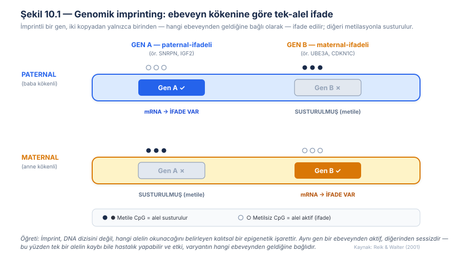
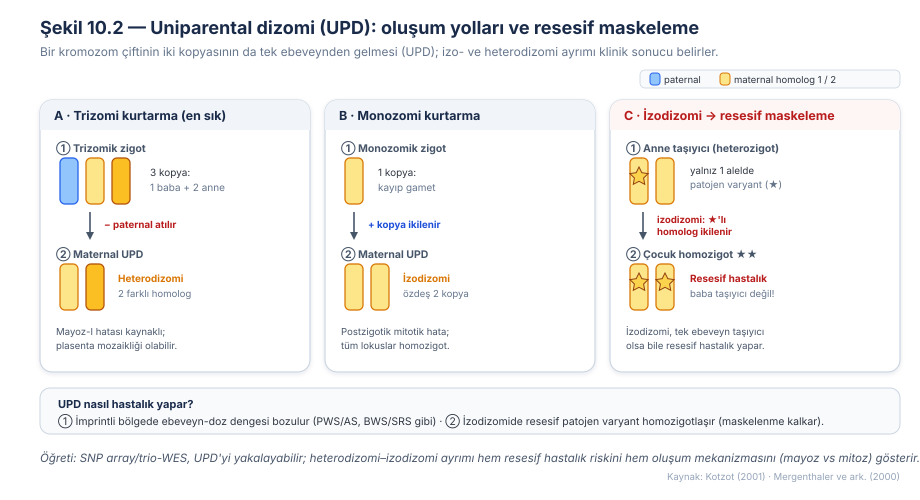
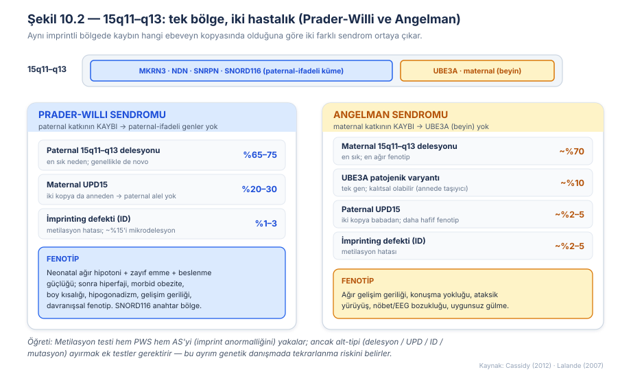
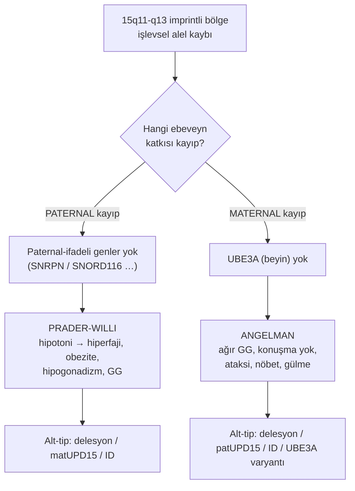
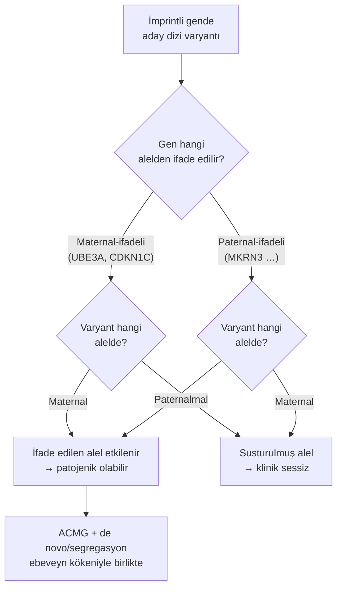
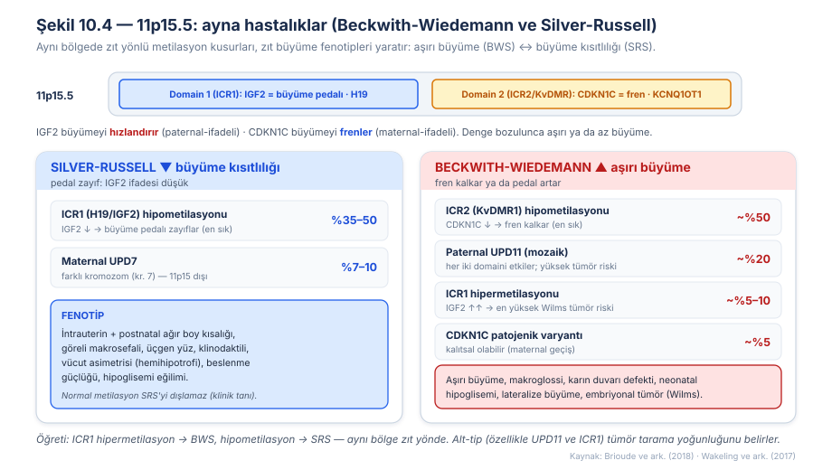
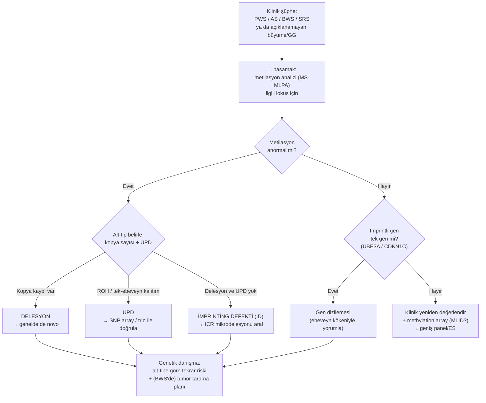

# Bölüm 10 — İmprinting, Uniparental Dizomi ve Epigenetik Mekanizmalar

> **Bölümün çekirdek tezi:** Genomik imprinting, bir genin iki alelinden yalnızca birinin — hangi ebeveynden geldiğine bağlı olarak — ifade edildiği epigenetik bir olgudur; bu nedenle imprintli lokuslarda hastalık, DNA dizisinin kendisinden çok **hangi ebeveyn kopyasının işlevsel olduğuna** bağlıdır. Bu bölüm, imprinting kontrol bölgelerindeki (ICR) metilasyonun tek-alel ifadeyi nasıl kurduğunu; delesyon, uniparental dizomi (UPD), imprinting defekti ve nokta varyantının aynı bölgede nasıl **aynı son yola** yakınsadığını; ve tek bir bölgedeki zıt yönlü epigenetik kusurların (15q11-q13'te Prader-Willi ↔ Angelman, 11p15.5'te Beckwith-Wiedemann ↔ Silver-Russell) neden zıt hastalıklar yarattığını gösterir. Önceki bölümlerdeki doz (Bölüm 3), toksik kazanım (Bölüm 6) ve metilasyon-susturma (Bölüm 9, FMR1) mekanizmalarını, "ebeveyn kökeni" ekseniyle birleştirir.

> **📘 Okuma katmanları.** Bu kitabın birincil hedefi **yandal asistanı ve klinik genomik çalışan hekimdir**; genel pediatrist ve tıp öğrencisi ikincil hedef kitledir. Bölümü kendi katmanınızdan okuyabilirsiniz:
> · **① Temel — tıp öğrencisi:** Şekil 10.1'deki damgalama sezgisi kurulmadan klinik tablolar ezber kalır; doğrusal okuyun.
> · **② Klinik — pediatrist ve klinisyen:** "Kavramsal tanım → klinik fenotipe dönüşüm → tanısal testler → karar algoritması" hattı.
> · **③ İleri düzey — yandal asistanı, laboratuvar, varyant yorumlayan:** 15q11-q13 ve 11p15.5 alt-tip tabloları, UPD oluşum mekanizmaları (Şekil 10.2), metilasyon sonucunun yorumu ve tümör tarama notları.

> 🖼️ **Görseller hakkında not:** Şekil 10.1–10.4 `assets/` klasöründe SVG olarak bulunur. Mermaid diyagramları metin içine gömülüdür.

---

## Öğrenme hedefleri

Bu bölümü tamamlayan okuyucu:
1. Genomik imprinting'i "ebeveyn kökenine bağlı tek-alel ifade" olarak tanımlar ve klasik Mendel kalıtımından ayıran özelliklerini açıklar.
2. İmprinting kontrol bölgesi (ICR) / diferansiyel metile bölge (DMR) kavramını ve metilasyonun alel susturmadaki rolünü açıklar.
3. Bir imprintli lokusta hastalığa götüren dört yolu (delesyon, UPD, imprinting defekti, nokta varyantı) sıralar ve bunların ortak son yolda nasıl birleştiğini yorumlar.
4. Uniparental dizominin oluşum mekanizmalarını (trizomi kurtarma, monozomi kurtarma, gamet komplementasyonu ve **postzigotik mitotik olaylar**) ve izodizomi–heterodizomi ayrımının klinik önemini açıklar; genomik paternden mekanizmaya geçişin **olasılıklı** olduğunu bilir.
5. İzodizominin resesif bir varyantı nasıl "maskeden çıkararak" hastalık yapabildiğini örnekle açıklar.
6. Prader-Willi ve Angelman sendromlarını ebeveyn kökeni, moleküler alt-tip ve fenotip açısından karşılaştırır; her alt-tipin tekrarlanma riskini yorumlar.
7. Beckwith-Wiedemann ve Silver-Russell sendromlarını 11p15.5'teki zıt metilasyon kusurları ("ayna hastalıklar") üzerinden açıklar ve tümör tarama gereğini alt-tiple ilişkilendirir.
8. İmprinting/UPD bozukluklarında uygun tanısal test dizisini (metilasyon analizi → alt-tip belirleme) seçer ve standart WES/karyotipin sınırlılığını bilir.
9. İmprintli genlerde varyant yorumlamada ebeveyn kökeninin (alelik faz) ACMG kriterlerini nasıl değiştirdiğini açıklar.

---

## 1. Kavramsal tanım

Mendel genetiğinin sessiz varsayımlarından biri, bir genin iki kopyasının — anneden ve babadan gelenin — işlevsel olarak eşdeğer olduğudur. Otozomal resesif bir hastalıkta hangi alelin anneden, hangisinin babadan geldiği önemli değildir; önemli olan kaç sağlam kopyanın kaldığıdır. **Genomik imprinting**, memelilerde bu varsayımı bozan bir istisnadır: bazı genler, kaç kopya olduğuna değil, **kopyanın hangi ebeveynden geldiğine** göre açılıp kapanır. İmprintli bir gen için "iki sağlam alel" ifadesi yanıltıcıdır; çünkü o genin yalnızca bir aleli — diyelim ki paternal olanı — zaten baştan susturulmuştur ve hücre işlevsel olarak tek alele bağımlıdır (Reik ve Walter, 2001).

Bu tek-alel ifadenin kaynağı DNA dizisi değil, **epigenetik bir işaret**tir. Epigenetik, diziyi değiştirmeden gen ifadesini kalıtsal biçimde ayarlayan mekanizmaların (başta **DNA metilasyonu**, ayrıca histon modifikasyonları ve kromatin yapısı) genel adıdır. İmprintli genlerde bu işaret, ebeveynin eşey hücrelerinde (spermatogenez/oogenez sırasında) "damgalanır": babadan gelecek kromozom bir kalıp, anneden gelecek kromozom başka bir kalıp taşır. Döllenmeden sonra embriyo bu ebeveyn-spesifik işaretleri korur, böylece hücre her lokusta hangi kopyanın "babadan" hangisinin "anneden" geldiğini adeta hatırlar. Bu yüzden imprint, kalıtsal ama tersinir bir "not"tur: her nesilde eşey hücrelerinde silinip ebeveynin cinsiyetine göre yeniden yazılır.

Bu bilgiyi somutlaştırmak için üç terimi baştan netleştirelim. **Diferansiyel metile bölge (DMR)**, iki ebeveyn kopyasının farklı metilasyon durumunda olduğu — biri metile, diğeri metilsiz — genomik bölgedir; alel ayrımının fiziksel taşıyıcısıdır. Bir DMR, bir gen kümesinin ifadesini merkezî olarak yönetiyorsa ona **imprinting kontrol bölgesi (ICR)** denir; ICR'deki metilasyon durumu, komşu genlerin hangi alelden okunacağını belirleyen bir "ana şalter" gibidir. Son olarak **imprinting defekti (ID)**, dizi normal olduğu hâlde bu metilasyon işaretinin yanlış kurulması (epimutasyon) durumudur — yani şalterin yanlış konumda takılıp kalmasıdır.

İmprinting neden evrimleşti? En yaygın açıklama **ebeveyn çatışması (conflict) hipotezi**dir: paternal genom, anne kaynaklarını mevcut yavruya maksimum aktarmaya (büyümeyi hızlandırmaya), maternal genom ise kaynakları birden çok yavru arasında korumaya (büyümeyi frenlemeye) "eğilimlidir". Bu yüzden paternal-ifadeli imprintli genler tipik olarak fetal büyümeyi **artırır** (ör. *IGF2*), maternal-ifadeli olanlar **kısıtlar** (ör. *CDKN1C*, *H19*) (Reik ve Walter, 2001). Bu asimetri, bu bölümde göreceğimiz büyüme bozukluklarının (Beckwith-Wiedemann aşırı büyüme ↔ Silver-Russell büyüme kısıtlılığı) neden imprintli lokuslarda yoğunlaştığını doğrudan açıklar.

**Tablo 10.1 — İmprinting ve uniparental dizominin temel kavramları**

| Kavram | Tanım | Klinik anlamı |
|---|---|---|
| Genomik imprinting | Ebeveyn kökenine bağlı tek-alel gen ifadesi | Tek alelin kaybı bile hastalık yapabilir; etki ebeveyn kökenine bağlıdır |
| DMR (diferansiyel metile bölge) | İki ebeveyn kopyasının farklı metile olduğu bölge | Metilasyon testinin hedefi; alel ayrımının taşıyıcısı |
| ICR (imprinting kontrol bölgesi) | Bir gen kümesini yöneten merkezî DMR | Buradaki kusur birden çok genin ifadesini birden bozar |
| İmprinting defekti (ID) / epimutasyon | Dizi normalken metilasyon işaretinin hatalı olması | Metilasyon anormal, ama delesyon/UPD yok; tekrarlanma riski farklı |
| Uniparental dizomi (UPD) | Bir kromozom çiftinin iki kopyasının da tek ebeveynden gelmesi | İmprint dengesizliği ± resesif varyantın homozigotlaşması |

---

## 2. Moleküler mekanizma

### 2.1 İmprint nasıl kurulur ve okunur?

İmprintin kalbinde **CpG dinükleotidlerinin metilasyonu** yatar. Bir DMR üzerinde, ebeveynlerden birinin kopyasındaki CpG'ler yoğun biçimde metillenir (sitozine metil grubu eklenir), diğerininki metilsiz kalır. Metilasyon çoğu zaman ilgili aleli **susturur**: ya doğrudan promotörü kapatarak ya da izolatör/enhancer erişimini değiştirerek. Şekil 10.1'de gösterildiği gibi, imprintli bir gen için sonuç, bir ebeveynden "sesli" (ifade edilen), diğerinden "sessiz" (metile, susturulmuş) bir alel çiftidir. Kritik nokta şudur: hücre için işlevsel doz zaten **tek alelden** gelmektedir; bu tek işlevsel kopyayı da kaybederseniz, geriye hiç işlevsel ürün kalmaz.

Metilasyonun aleli her zaman **doğrudan** susturmadığını vurgulamak gerekir; kimi ICR'ler bir **izolatör (insulator)** üzerinden çalışır. Bunun ders kitabı örneği, bu bölümün ilerleyen kısmında Beckwith-Wiedemann ve Silver-Russell sendromları bağlamında ayrıntılandıracağımız 11p15.5'teki *IGF2/H19* bölgesidir (güncel klinik terminolojide **IC1** ya da *H19/IGF2:IG-DMR*).

**Maternal alelde** IC1 metilsizdir; CTCF proteini yalnızca bu metilsiz alele bağlanır ve aşağı akımdaki ortak enhancer'ların *IGF2* promotörleriyle etkileşmesini sınırlar. Sonuç: maternal alelde *H19* ifade edilir, *IGF2* baskılanır. Buradaki "izolatör"ü basit bir duvar gibi düşünmemek gerekir; güncel modelde CTCF, enhancer–promotör temaslarını sınırlar, **alele özgü kromatin ilmekleri** oluşturur ve kohezin ile birlikte üç boyutlu genom mimarisini düzenler. Yani izolatör, doğrusal bir engelden çok **alele özgü bir kromatin organizasyonudur**.

**Paternal alelde** IC1 metillidir; CTCF bağlanamaz, izolatör işlevi kurulamaz ve enhancer'lar *IGF2* promotörleriyle etkileşebilir. Ancak burada iki inceliği kaydetmek gerekir. **Birincisi, metilasyon *IGF2*'yi doğrudan açmaz** — CTCF bağlanmasını ve izolatör işlevini ortadan kaldırarak enhancer–*IGF2* etkileşimine **izin verir**. **İkincisi, paternal *H19*'un susması yalnızca "izolatörün kurulamamasının" pasif sonucu değildir**: paternal alelde *H19* promotörü ve çevresi gelişim sırasında metilasyon ve baskılayıcı kromatin kazanır; bu nedenle enhancer'lar paternal *H19* promotörünü etkinleştirmez ve bunun yerine *IGF2* ile etkileşir.

Bu nedenle "aynı metilasyon işareti bir geni açar, başka birini kapatır" özeti **sonuç düzeyinde doğrudur, mekanizma düzeyinde sadeleştirmedir.** Daha doğru ifade şudur: IC1 metilasyonu, CTCF-bağımlı izolasyonu **kaldırarak** *IGF2*'nin enhancer'lara erişmesine izin verir ve aynı alelde *H19* lokusu **ayrıca** baskılayıcı bir epigenetik durum kazanır. İmprintin "tek şalter, çift sonuç" mantığı budur — ama şalterin iki sonucu **farklı yollardan** doğar.

> **🔬 Deep-dive — Antisens transkript ile susturma (UBE3A örneği):** Angelman sendromunun anahtar geni *UBE3A*, beyinde neredeyse yalnızca maternal alelden ifade edilir. Ancak *UBE3A* promotörünün kendisi klasik anlamda metile değildir; susturma dolaylıdır. Paternal alelde, komşu *SNRPN* lokusundan başlayan uzun bir **antisens transkript (*UBE3A-ATS*)** *UBE3A*'nın üzerinden ters yönde okunur ve onu *cis*'te susturur. Maternal alelde ise ICR (SNRPN-DMR) metile olduğu için bu antisens başlatılmaz ve *UBE3A* ifade edilir (Lalande ve Calciano, 2007). Bu, imprintin yalnızca "promotör metilasyonu" olmadığını; noncoding RNA, antisens transkripsiyon ve kromatin döngülerini de kapsayan çok katmanlı bir düzenleme olduğunu gösterir. Klinik yansıması derindir: paternal alelin antisensini susturup *UBE3A*'yı "geri açmayı" hedefleyen antisens-oligonükleotid tedavileri Angelman'da aktif araştırma alanıdır.

### 2.2 Bir imprintli lokusta hastalığa götüren dört yol

İmprinting bozukluklarını anlamanın en pratik yolu, tek bir soruya odaklanmaktır: *"Bu bölgenin işlevsel (ifade edilen) alelini ne yok etti?"* Cevap dört farklı moleküler olaydan biri olabilir, ama hepsi aynı son yola — **ifade edilmesi gereken alelin yokluğuna** — çıkar:

Birincisi, **delesyon**: ifade edilen alelin bulunduğu kromozom parçasının fiziksel kaybı. İkincisi, **uniparental dizomi (UPD)**: her iki kromozom kopyasının da "yanlış" ebeveynden gelmesi, dolayısıyla ifade edilmesi gereken ebeveyn kopyasının hiç bulunmaması. Üçüncüsü, **imprinting defekti (ID)**: dizi ve kopya sayısı normalken metilasyon işaretinin hatalı kurulması, böylece ifade edilmesi gereken alelin epigenetik olarak susturulması. Dördüncüsü, imprintli gen tek bir gense (ör. *UBE3A*, *CDKN1C*), o genin ifade edilen alelindeki **nokta varyantı / küçük indel**. Bu dört yolun ortak paydası, klinik açıdan büyük kolaylık sağlar: **metilasyon-tabanlı bir test**, delesyon, UPD ve ID'nin üçünü birden (hepsi metilasyon paternini bozduğu için) tek seferde yakalar; yalnızca nokta varyantı ayrı bir dizileme gerektirir.

### 2.3 Uniparental dizomi nasıl oluşur?

UPD'yi klinik olarak anlamak için oluşum mekanizmasını bilmek gerekir, çünkü mekanizma hem **hangi lokusların homozigot olduğunu** hem de **tekrarlanma riskini önemli ölçüde etkiler** — ama tek başına *belirlemez*, yalnızca güçlü bir ipucu verir. Şekil 10.2'te gösterilen yollar şunlardır.

En sık yol **trizomi kurtarmadır**: mayoz sırasında ayrılamama (nondisjunction) sonucu dizomik bir gamet oluşur; bu gamet normal bir gametle döllendiğinde trizomik bir zigot ortaya çıkar. Erken mitozlardan birinde fazla kromozomun kaybı, bazı hücrelerde dizomik kromozom sayısını yeniden kurar. Kayıp rastgele olduğu için iki sonuç mümkündür: aynı ebeveynden gelen kopyalardan biri kaybedilirse **biparental dizomi**, diğer ebeveynden gelen tek kopya kaybedilirse **UPD** kalır. ⚠️ Trizomi kurtarma her zaman *tam* değildir: geriye **rezidüel anöploid hücre hattı** ya da **plasentaya sınırlı mozaiklik** kalabilir — bu, özellikle prenatal yorumda klinik önem taşır.

İkinci yol **monozomi kurtarmadır**: tek kalan kromozomun kopyalanmasıyla genellikle **tam izodizomi** oluşur. Üçüncü yol **gamet komplementasyonudur**: dizomik bir gamet ile nullizomik bir gametin birleşmesi; burada postzigotik bir "kurtarma" olayı yoktur, patern dizomik gametin mayotik kökenine bağlıdır. Sıklıkla atlanan **dördüncü yol** ise **postzigotik mitotik mekanizmalardır** (mitotik rekombinasyon, kromozom kaybı ve ardından kopyalanma): bunlar tam ya da segmental izodizomi üretir ve **sıklıkla mozaik** bir patern bırakır — dokuya özgü mozaiklik, segmental imprinting bozukluğu ya da lokal homozigotlaşma bu yolla açıklanır.

**Genomik paterni mekanizmaya çevirirken dikkatli olun.** Klasik öğretim modeli "mayoz I hatası → heterodizomi, mayoz II hatası → izodizomi" der ve temel çerçeve olarak yararlıdır; ancak **mayotik rekombinasyon nedeniyle aynı kromozomda heterodizomik ve izodizomik segmentler bir arada bulunabilir** — yani karma patern kuraldışı değildir. Ayrıca nondisjunction hem mayoz I'de hem mayoz II'de olur; dağılım kromozoma, ebeveyn kökenine ve yaşa göre değişir. Kromozom 7 üzerine yapılan bir derleme bu belirsizliği somutlaştırır: maternal UPD7 olgularında izodizomi (n = 11) ile tam/kısmi heterodizomi (n = 12) **hemen hemen eşit sayıda** bildirilmiş ve olguların yaklaşık **yarısı** postzigotik mitotik segregasyon hatasına bağlanmıştır (Mergenthaler ve ark., 2000) — yani UPD7'de trizomi kurtarma tek yol değildir. ⚠️ Bu çalışmanın mekanizma çıkarımı bugün fazla kesin bulunmaktadır; nitekim geniş klinik trio analizleri **tam izodizominin bile tek bir mekanizmaya özgü olmadığını** göstermektedir.

**Pratik çıkarım:** bir UPD'nin izo mu hetero mu olduğu, oluşum mekanizmasını *olasılıklı* olarak gösterir, kesin belirlemez. Tekrarlanma riski de yalnız UPD paternine değil; **altta yatan nondisjunction olayına, ebeveynde kromozomal yeniden düzenlenme (özellikle Robertsonian translokasyon), marker kromozom varlığına ve mozaikliğe** bağlıdır (Bölüm 8 §5.1).

İkinci yol **monozomi kurtarma**dır: bir kromozomu hiç taşımayan (nullisomik) bir gamet, normal gametle döllenince monozomik zigot oluşur; embriyo tek kopyayı **kopyalayarak** diploidiyi geri kazanır. Sonuç, tek bir homoloğun özdeş iki kopyası, yani **izodizomi**dir. Üçüncü ve en nadir yol **gamet tamamlama**dır: dizomik bir gametin nullisomik bir gametle buluşmasıdır. Kotzot'un derlemesi, segmental ve karmaşık UPD'lerin bu mekanizmalarla (somatik rekombinasyon → izodizomi; trizomi kurtarma → izo + heterodizomi karışımı) nasıl şekillendiğini ayrıntılandırır ve kromozom segregasyonunun sanılandan çok daha karmaşık olduğunu vurgular (Kotzot, 2001).

> **🔬 Deep-dive — UPD neden iki temel yolla hastalık yapar?** UPD'nin iki ayrı patojenik yüzü vardır ve bunları karıştırmamak gerekir. Kritik ayrım şudur: **imprint dengesizliği izodizomiye özgü değildir — hem izo- hem heterodizomi bunu yapar; buna karşılık resesif alelin homozigotlaşması yalnız izodizomik bölgeye özgüdür.**
>
> **(1) İmprint dengesizliği.** UPD imprintli bir kromozomu tutuyorsa, her iki kopyanın tek ebeveynden gelmesi **ebeveyn-kökenine özgü metilasyon ve gen ifade dozunu** bozar. Belirleyici olan **ebeveyn kökenidir**, izo/hetero ayrımı değil — çünkü iki durumda da köken aynıdır. Yönüyle birlikte verilmesi gereken örnekler şunlardır: **maternal UPD15** → Prader-Willi; **paternal UPD15** → Angelman; **maternal UPD7** → Silver-Russell olgularının bir bölümü; **paternal UPD6** → 6q24 ilişkili geçici neonatal diabetes mellitus; **paternal UPD11p15** (çoğunlukla segmental ve mozaik) → Beckwith-Wiedemann spektrumu; **maternal ve paternal UPD14** → sırasıyla Temple ve Kagami-Ogata sendromları. Yalnız sendrom adını vermek yetmez; **hangi ebeveyn kökeni** olduğu yazılmalıdır. ⚠️ İzo/hetero ayrımı imprinting fenotipi için belirleyici olmasa da **oluşum mekanizmasının, resesif varyant riskinin ve laboratuvar sonucunun yorumlanmasında önemlidir.**
>
> **(2) Resesif varyantın homozigotlaşması.** İzodizomide tek bir ebeveyn homoloğunun iki özdeş kopyası bulunduğu için, **o homologdaki aleller homozigot hâle gelir**. Kapsamı doğru belirtmek gerekir: tam kromozom izodizomisinde kromozomun tamamı, segmental ya da karma UPD'de ise yalnızca **izodizomik segment** homozigotlaşır — uzun homozigotluk bölgelerinin (ROH) ekzom, genom veya SNP-array ile saptanabilmesi tam da bu mekanizmaya dayanır. Klinik sonucu şöyle formüle etmek doğrudur: **bir ebeveyn resesif bir hastalık aleli için heterozigotsa ve çocuk, varyantı taşıyan homoloğun izodizomisini edinirse, diğer ebeveyn varyantı hiç taşımadığı hâlde çocuk patojen varyant için homozigot olabilir.** (Dikkat: heterozigot ebeveynin iki farklı homoloğu vardır; homozigotlaşma yalnız *varyantlı* homoloğun iki kopyası geçtiğinde olur.) Bu mekanizma, akraba olmayan ailelerde ve **yalnızca bir ebeveynin taşıyıcı olduğu** durumlarda otozomal resesif hastalık üretebilir — bir çocukta ebeveyn taşıyıcılığıyla açıklanamayan resesif bir tablo görüldüğünde UPD'nin akla gelmesinin nedeni budur.
>
> Heterodizomi iki farklı homolog içerdiği için bu maskeleme etkisini **kendiliğinden** yaratmaz; ancak trizomi kurtarma sonrası mayotik rekombinasyon nedeniyle sıklıkla **parçalı izodizomi segmentleri** barındırır — ve o segmentlerde aynı homozigotlaşma riski geçerlidir.

---

## 3. Varyant tipleri

İmprinting bozukluklarında "varyant" kavramı, önceki bölümlerdeki dizi varyantlarından daha geniştir: dizi değişmeden de (epimutasyon, UPD) hastalık olur. Bu yüzden imprintli bir lokusta karşılaşılan lezyon tiplerini tek bir tabloda toplamak, hem tanısal test seçimini hem de tekrarlanma riskini netleştirir.

**Tablo 10.2 — İmprinting lezyon tipleri ve metilasyon sonuçları**

| Lezyon tipi | Moleküler sonuç | Metilasyon anormal mi? | Notlar / tekrarlanma riski |
|---|---|---|---|
| Delesyon (ifade edilen alel) | İfade edilen kopya fiziksel kayıp | Evet | Genelde de novo; nadiren dengesiz ailevi yeniden düzenlenme → yüksek risk |
| Uniparental dizomi (UPD) | İki kopya tek ebeveynden | Evet | Çoğu de novo/sporadik (düşük tekrar riski); Robertsonian translokasyon varsa risk artar |
| İmprinting defekti (ID) — primer epimutasyon | Metilasyon işareti hatalı, dizi normal | Evet | Sporadik ise düşük risk; **ICR mikrodelesyonu** varsa yüksek (ailevi) risk |
| Nokta varyantı / indel (ifade edilen alel) | Tek imprintli genin işlev kaybı | Hayır (metilasyon normal) | Ebeveyn kökenine bağlı olarak %50'ye varan risk (ör. maternal *UBE3A*, *CDKN1C*) |
| Kopya sayısı artışı (duplikasyon) | İmprintli gen dozunda artış | Değişken | 15q11-q13 maternal duplikasyonu → otizm; doz-yön önemli |

Bu çeşitliliğin pratik özeti şudur: ilk üç satır (delesyon, UPD, ID) metilasyonu bozar ve tek bir metilasyon testiyle birlikte yakalanır; dördüncü satır (nokta varyantı) metilasyonu bozmaz ve ancak dizilemeyle görülür. Beşinci satır (duplikasyon) doz yönünün önemini hatırlatır ve Bölüm 8'deki CNV mantığıyla köprü kurar.

---

## 4. Klinik fenotipe dönüşüm

### 4.1 Anahtar soru: Neden aynı bölge iki farklı hastalık yapar?

İmprinting bozukluklarının klinik kalbini, 15q11-q13 bölgesi çarpıcı biçimde gösterir. Bu bölgede **paternal-ifadeli bir gen kümesi** (*MKRN3*, *NDN*, *SNRPN*, ve özellikle *SNORD116* snoRNA kümesi) ile **maternal-ifadeli tek bir gen** (*UBE3A*, beyinde) yan yana durur. Paternal katkının kaybı — delesyon, maternal UPD veya ID yoluyla — paternal-ifadeli genleri sıfırlar ve **Prader-Willi sendromu (PWS)** ortaya çıkar. Maternal katkının kaybı ise *UBE3A*'yı sıfırlar ve **Angelman sendromu (AS)** ortaya çıkar. Aynı fiziksel bölge, kaybın hangi ebeveyn kopyasında olduğuna göre iki tamamen farklı hastalık üretir (Şekil 10.3).

PWS'nin fenotipi yaşa göre iki evrelidir ve bu evreleri bilmek erken tanı için kritiktir. Yenidoğan ve süt çocukluğunda tablo **ağır hipotoni, zayıf emme, beslenme güçlüğü ve gelişememe** ile hâkimdir; bebek "fazla sakin", beslenmesi zor bir bebektir. Erken çocuklukta ise tablo tam tersine döner: doyma hissinin kaybı (**hiperfaji**), kontrolsüz iştah ve tedavi edilmezse morbid obezite gelişir. Buna boy kısalığı (büyüme hormonu yetersizliği sık), hipogonadizm, hafif-orta zihinsel yetersizlik ve karakteristik davranışsal fenotip eşlik eder. *SNORD116* kümesinin tek başına kaybının PWS'nin çekirdek özelliklerini büyük ölçüde tekrarladığı gösterilmiştir; bu, bölgenin "anahtar" alt-birimidir (Cassidy ve ark., 2012).

Angelman ise nörolojik ağırlıklı, ayrı bir tablodur: **ağır gelişim geriliği ve konuşmanın hemen tümüyle yokluğu**, ataksik/sarsak yürüyüş, epilepsi ve tipik EEG bozuklukları, ve tabloya adını neredeyse veren **uygunsuz, sık gülme atakları ve mutlu görünüm**. AS'nin çekirdek nedeni *UBE3A*'nın beyindeki maternal ifadesinin kaybıdır; bu yüzden AS, imprintli bir gende tek-gen düzeyinde nokta varyantının da (yalnızca **maternal** kopyada) hastalık yapabildiği ender imprinting bozukluklarından biridir (Lalande ve Calciano, 2007).

### 4.2 Alt-tip fenotipi hafifçe değiştirir

Aynı sendrom içinde bile moleküler alt-tip fenotipi renklendirir. PWS'de maternal UPD15 taşıyanlar, delesyon taşıyanlara kıyasla daha yüksek psikoz/otizm spektrumu riski gösterme eğilimindedir; AS'de ise maternal delesyon en ağır tabloyu (daha sık nöbet, mikrosefali, hipopigmentasyon) yaparken, UPD ve ID alt-tipleri görece daha hafiftir. Bu ayrımlar, moleküler tanının yalnızca "hangi hastalık" değil, "hangi seyir ve hangi tekrar riski" sorusunu da yanıtladığını gösterir.

Aşağıdaki Mermaid, 15q11-q13 için "kayıp hangi ebeveynde?" sorusunun klinik sonucu nasıl belirlediğini özetler:

**Algoritma 10.1 — 15q11-q13 alel kaybının alt tipe göre ayrımı**

---

## 5. Tanısal testlerle ilişkisi

İmprinting/UPD bozukluklarının tanısında altın kural, testlerin **iki aşamalı** olmasıdır: önce "imprint anormal mi?" (metilasyon analizi), sonra "hangi alt-tip?" (kopya sayısı + UPD + dizi). Standart bir ekzom veya karyotip, tek başına bu bozuklukların çoğunu **kaçırır**, çünkü metilasyonu ve çoğu UPD'yi doğrudan okumaz.

**Tablo 10.3 — İmprinting bozukluklarını hangi test yakalar?**

| Test | Bu mekanizmayı yakalar mı? | Sınırlılığı |
|------|----------------------------|-------------|
| **WES (ekzom)** | Kısmen — yalnızca imprintli gendeki **nokta varyantını** (ör. *UBE3A*, *CDKN1C*) yakalar | Metilasyonu ve imprint durumunu **okumaz**; UPD'yi ancak trio + ROH analizi ile dolaylı sezer; delesyon/ID'yi kaçırır |
| **Short-read WGS** | Kısmen — nokta varyantı + CNV; trio ile UPD (ROH/kalıtım paterni) | Standart pipeline metilasyonu vermez; imprint defektini doğrudan göstermez |
| **Long-read WGS** | Evet — dizi + CNV + **metilasyonu doğrudan** (nanopore) okuyabilir | Yaygın/rutin değil; maliyet ve yorum standardizasyonu gelişmekte |
| **Array-CGH / SNP array** | SNP array **UPD'yi** (uzun homozigotluk bölgeleri, ROH) ve delesyon/duplikasyonu yakalar | Metilasyonu ve **dengeli** durumları okumaz; izodizomi görülür, heterodizomi (ROH yok) trio olmadan kaçabilir |
| **MLPA (MS-MLPA)** | Evet — **metilasyon + kopya sayısını birlikte** verir; delesyon vs UPD/ID ayrımını sağlar | Nokta varyantını göstermez; ID vs UPD ayrımı için ek test gerekir |
| **RNA-seq** | Dolaylı — alel-spesifik ifade kaybını gösterebilir | Rutin tanısal değil; doku-spesifik ifade (ör. *UBE3A* beyin) sınırlar |
| **Methylation array** | Evet — DMR metilasyonunu ve **çok-lokuslu imprint bozukluğunu (MLID)** tarar | Alt-tipi (delesyon/UPD/ID) tek başına ayırmaz; doğrulama gerekir |
| **Karyotip** | Yalnızca büyük/dengesiz yeniden düzenlenmeleri, Robertsonian translokasyonu | Metilasyon, UPD ve mikrodelesyonları göremez |

> **Bu mekanizmayı hangi test yakalar? (özet):** İlk basamak **metilasyon-duyarlı bir testtir** (PWS/AS ve BWS/SRS için MS-MLPA veya metilasyon-spesifik PCR); bu test delesyon, UPD ve ID'nin üçünü birden yakalar. Metilasyon anormalse alt-tip belirlenir: **kopya sayısı** (delesyon?) MS-MLPA/array ile, **UPD** SNP array veya mikrosatellit/trio analiziyle, **ID** ise ne delesyon ne UPD bulunduğunda dışlamayla konur. İmprintli gen tek gense ve metilasyon normalse, sıra **dizilemeye** (nokta varyantı) gelir.

---

## 6. Varyant yorumlama açısından önemi (ACMG/ClinGen)

İmprinting, ACMG/AMP dizi-varyantı çerçevesine (Bölüm 17'de ayrıntılanacak) iki temel nüans ekler. Birincisi ve en önemlisi **alelik faz / ebeveyn kökenidir**: imprintli bir gende bir varyantın patojenik olup olmaması, hangi ebeveynden geldiğine bağlıdır. *UBE3A*'da patojenik bir varyant yalnızca **maternal** alelde ise Angelman yapar; aynı varyant paternal alelde ise (o alel zaten susturulduğu için) klinik olarak sessiz kalır. Aynı mantık *CDKN1C* (maternal-ifadeli, Beckwith-Wiedemann) ve *MKRN3* gibi paternal-ifadeli genler için ters yönde geçerlidir. Bu nedenle imprintli bir gende varyant sınıflandırırken **segregasyon ve de novo kanıtı ebeveyn kökeniyle birlikte** değerlendirilmelidir; kökeni bilinmeyen bir varyantın penetransı yorumlanamaz.

İkinci nüans, imprinting bozukluklarının büyük bölümünün **dizi varyantı olmayan** (epimutasyon, UPD) lezyonlardan kaynaklanmasıdır. Bu lezyonlar klasik ACMG dizi-kriterlerinin (PVS1, PM1, PP3…) kapsamı dışındadır; bunlar için ClinGen'in **kopya sayısı/dozaj** çerçevesi (Bölüm 8'de işlenen HI/TS puanlaması) ve metilasyon/UPD'ye özgü laboratuvar kriterleri kullanılır. Pratikte bir imprinting bozukluğu raporu, çoğu zaman bir "varyant sınıflandırması"ndan çok bir **metilasyon paterni + alt-tip** tanımıdır.

> **🟦 Klinikte dikkat — ClinGen'in *gen düzeyi* dozaj skorları imprintli lokuslarda yanıltıcıdır.** Bölüm 8'de tanıtılan haploinsufficiency (HI) skorunu imprintli bir gende sorguladığınızda beklediğinizi bulamazsınız: ClinGen gen dozaj listesinde *SNRPN*, *NDN*, *H19* ve *IGF2*'nin HI skoru **0**'dır ("kanıt yok"). Bu, bu genlerin doza duyarlı olmadığı anlamına **gelmez**; anlamı, patojenitenin **gen düzeyinde tek kopya kaybıyla** değil, **bölge ve damgalama düzeyinde** — yani hangi ebeveyn kopyasının kaybedildiğiyle — tanımlanmasıdır. Aynı tuzağın CNV'lerdeki karşılığını Bölüm 3'te *PMP22* üzerinden görmüştük: gen kaydı ile bölge kaydı farklı şeyler söyler. İmprintli bir lokusta refleks, gen skorunun dışına çıkıp **DMR'ye ve metilasyon paternine** bakmaktır (§1'de tanımlanan diferansiyel metile bölge).
>
> **🟦 Klinikte dikkat — De novo ≠ düşük risk (her zaman değil):** İmprinting defektlerinin çoğu sporadik (primer epimutasyon) olup düşük tekrarlanma riski taşır. Ancak ID'lerin bir alt-kümesi, ICR içindeki küçük bir **mikrodelesyondan** kaynaklanır; bu genetik lezyon ebeveynden aktarılabilir ve %50'ye varan tekrarlanma riski yaratır. Bu yüzden "imprinting defekti" tanısı, danışmadan önce **ICR mikrodelesyonu açısından incelenmelidir** — "epigenetik = sporadik" varsayımı tehlikelidir.

Aşağıdaki Mermaid, imprintli bir gende dizi varyantı yorumlanırken ebeveyn kökeninin kararı nasıl yönlendirdiğini gösterir:

**Algoritma 10.2 — İmprintli gende varyant yorumlama akışı**

---

## 7. Pediatrik genetikten klinik örnekler

**Prader-Willi sendromu (15q11-q13, paternal kayıp).** Süt çocukluğunda ağır hipotoni ve beslenme güçlüğüyle başvuran, sonra hiperfaji ve obezite geliştiren bir bebek klasik tablodur. Tanı, ebeveyn-spesifik **DNA metilasyon analiziyle** olguların >%99'unda konur; ancak alt-tipi (delesyon %65–75, maternal UPD15 %20–30, ID %1–3) belirlemek ek test gerektirir ve bu ayrım tekrarlanma riskini değiştirir. Kardeş tekrarlanma riski tipik olarak **%1'in altındadır**, ama belirli alt-tiplerde (ör. ailevi yeniden düzenlenme veya ICR mikrodelesyonu) belirgin biçimde yükselir (Cassidy ve ark., 2012). Öğreti: metilasyon testi tanıyı koyar, alt-tip danışmayı yönlendirir.

**Angelman sendromu (15q11-q13, maternal kayıp).** Konuşması hiç gelişmeyen, ataksik, nöbetli ve sık gülen bir çocuk; EEG'de tipik yüksek-amplitüdlü yavaş dalgalar. Nedenler: maternal delesyon (~%70), *UBE3A* varyantı (~%10, kalıtsal olabilir), paternal UPD15 ve ID (~%2–5'er). Metilasyon normalse bile AS dışlanamaz — *UBE3A* dizilemesi gerekir; bu, imprintli tek-gen varyantının ayrı bir test basamağı olduğunun en iyi örneğidir (Lalande ve Calciano, 2007).

**Beckwith-Wiedemann sendromu (11p15.5, aşırı büyüme).** Makroglossi, karın duvarı defekti (omfalosel), yenidoğan hipoglisemisi, lateralize aşırı büyüme ve **embriyonal tümör** (özellikle Wilms tümörü, hepatoblastom) yatkınlığıyla tanınır. Moleküler alt-tipler tümör riskini doğrudan belirler: en yüksek Wilms tümörü riski **ICR1 hipermetilasyonunda** (*IGF2* ↑↑) görülür; **paternal UPD11** ise moleküler olarak doğrulanmış BWS spektrumu olgularının **%20'ye varan** kısmını oluşturur ve tümör riski bakımından **ikinci sıradaki** alt gruptur — bu nedenle özel izlem gerektirir (Eggermann ve Prawitt, 2022). Buna karşılık ICR2 hipometilasyonu (*CDKN1C* ↓; en sık alt-tip, ~%50) görece düşük tümör riskindedir. Bu yüzden uluslararası konsensüs, tümör tarama yoğunluğunu **moleküler alt-tipe göre** ayarlamayı önerir (Brioude ve ark., 2018). Öğreti: burada moleküler tanı, doğrudan bir kanser-tarama protokolüne dönüşür.

**Silver-Russell sendromu (11p15.5/kr.7, büyüme kısıtlılığı).** BWS'nin ayna görüntüsüdür: intrauterin ve postnatal ağır boy kısalığı, göreli makrosefali, üçgen yüz, vücut asimetrisi ve beslenme güçlüğü. En sık neden ICR1 **hipo**metilasyonudur (*IGF2* ↓; %35–50) — yani BWS'yi yapan ICR1 hipermetilasyonunun tam tersi. İkinci sıklıkta neden **maternal UPD7**'dir (%7–10), ki bu bambaşka bir kromozomdur ve SRS'nin neden "tek lokuslu" düşünülemeyeceğini gösterir. Konsensüs, SRS'nin öncelikle **klinik** bir tanı olduğunu ve normal metilasyonun tanıyı dışlamadığını vurgular (Wakeling ve ark., 2017).

**İmprinting bozukluğu ailesi ve çok-lokuslu bozukluk (MLID).** Yukarıdaki dört tablo, imprintli lokuslardan yalnızca en sıklarıdır; aile geniştir (14q32 Temple/Kagami-Ogata, 6q24 geçici neonatal diabetes, 20q13 *GNAS*/psödohipoparatiroidizm, vb.). Önemli bir kavram, tek bir hastada **birden çok imprintli lokusun eşzamanlı metilasyon bozukluğu** gösterebilmesidir (multilocus imprinting disturbance, MLID); bu, imprintin genom çapında ortak bir "kurma makinesiyle" (ör. *ZFP57*, subkortikal maternal kompleks genleri) yönetildiğini ve tek lokus düşüncesinin yetersiz kaldığını gösterir. Eggermann ve arkadaşları, büyüme kısıtlılığı ile aşırı büyüme fenotiplerinin örtüşen moleküler temellerini, imprintli genlerin bir **ağ** olarak davrandığı çerçevesiyle özetler (Eggermann ve ark., 2021); paternal UPD11'in BWS içindeki özel tümör-riski konumu ise ayrıca vurgulanır (Eggermann ve Prawitt, 2022).

---

## 8. Sık yapılan hatalar ve klinikte dikkat

> **🔴 Sık yapılan hata kutusu**
> 1. **"Ekzom normalse imprinting bozukluğu dışlanır" sanmak.** Standart WES metilasyonu ve çoğu UPD'yi okumaz; PWS/AS/BWS/SRS'yi kaçırır. İmprinting bozukluğu şüphesinde **metilasyon testi** ayrıca istenmelidir.
> 2. **"İki sağlam alel var, o hâlde hastalık olmaz" varsaymak.** İmprintli lokusta işlevsel doz zaten tek alelden gelir; UPD'de "iki kopya" olması normal işlevi garanti etmez.
> 3. **Metilasyon anormalliğini alt-tiple karıştırmak.** "Metilasyon PWS paterni" tanıyı koyar ama delesyon/UPD/ID ayrımını yapmaz; tekrarlanma riskinin konuşulabilmesi için alt-tip belirlenmesi önerilir.
> 4. **İmprinting defektini otomatik "sporadik/düşük risk" saymak.** ID'lerin bir kısmı ailevi ICR mikrodelesyonundan kaynaklanır (%50 risk); danışmadan önce dışlanmalıdır.
> 5. **İzodizomiyi yalnızca imprint sorunu sanmak.** İzodizomi resesif bir varyantı homozigotlaştırarak, ebeveyn taşıyıcılığıyla açıklanamayan resesif hastalık da yapabilir.
> 6. **BWS'de tüm alt-tipleri aynı tümör riskiyle izlemek.** Tarama yoğunluğu moleküler alt-tipe göre ayarlanmalıdır (ICR1 hipermetilasyon / UPD11 en yüksek risk).

> **🟦 Klinikte dikkat kutusu**
> - Yardımcı üreme teknikleri (ART) ile imprinting bozukluklarında (özellikle BWS, ICR2 hipometilasyonu) hafif bir risk artışı bildirilmiştir; öykü alırken sorulmalıdır.
> - Robertsonian translokasyon taşıyıcılığı (özellikle kr. 14 ve 15) UPD riskini artırır; bu kromozomların dengeli translokasyonu saptandığında imprinting bozukluğu açısından uyanık olun.
> - SRS ve PWS'de büyüme hormonu tedavisi fenotipi belirgin biçimde değiştirir; erken moleküler tanı tedavi penceresini açar.

---

## 9. Klinik pratikte karar algoritması

Aşağıdaki algoritma, imprinting/UPD bozukluğu şüphesinde iki aşamalı yaklaşımı (önce metilasyon, sonra alt-tip) ve nokta-varyantı basamağını birleştirir:

**Algoritma 10.3 — İmprinting bozukluğu şüphesinde tanısal akış**

---

## 10. Kaynaklar

> **Atıf / doğrulama notu:** Bu bölümün bibliyografik verileri PubMed üzerinden doğrulanmıştır; her kaynağın PMID ve DOI'si tek tek teyit edilmiştir. Metin içinde yazar-yıl biçimi kullanılmış, DOI linkleri kaynakçada verilmiştir.

1. **Reik W, Walter J. (2001).** Genomic imprinting: parental influence on the genome. *Nature Reviews Genetics* 2(1):21–32. **PMID: 11253064** · DOI: [10.1038/35047554](https://doi.org/10.1038/35047554) — *Kullanım amacı: İmprinting kavramı, epigenetik işaret, ebeveyn-çatışması hipotezi ve büyüme geni asimetrisinin landmark derlemesi.*

2. **Cassidy SB, Schwartz S, Miller JL, Driscoll DJ. (2012).** Prader-Willi syndrome. *Genetics in Medicine* 14(1):10–26. **PMID: 22237428** · DOI: [10.1038/gim.0b013e31822bead0](https://doi.org/10.1038/gim.0b013e31822bead0) — *Kullanım amacı: PWS mekanizması, alt-tip sıklıkları, metilasyon testinin >%99 duyarlılığı ve SNORD116'nın anahtar rolü.*

3. **Lalande M, Calciano MA. (2007).** Molecular epigenetics of Angelman syndrome. *Cellular and Molecular Life Sciences* 64(7-8):947–960. **PMID: 17347796** · DOI: [10.1007/s00018-007-6460-0](https://doi.org/10.1007/s00018-007-6460-0) — *Kullanım amacı: UBE3A'nın maternal ifadesi, antisens transkriptle susturma ve AS moleküler alt-tipleri.*

4. **Brioude F, Kalish JM, Mussa A, ve ark. (2018).** Clinical and molecular diagnosis, screening and management of Beckwith-Wiedemann syndrome: an international consensus statement. *Nature Reviews Endocrinology* 14(4):229–249. **PMID: 29377879** · DOI: [10.1038/nrendo.2017.166](https://doi.org/10.1038/nrendo.2017.166) — *Kullanım amacı: BWS 11p15.5 moleküler alt-tipleri, tümör riski ve alt-tipe göre tarama önerileri (guideline).*

5. **Wakeling EL, Brioude F, Lokulo-Sodipe O, ve ark. (2017).** Diagnosis and management of Silver-Russell syndrome: first international consensus statement. *Nature Reviews Endocrinology* 13(2):105–124. **PMID: 27585961** · DOI: [10.1038/nrendo.2016.138](https://doi.org/10.1038/nrendo.2016.138) — *Kullanım amacı: SRS klinik/moleküler tanı, ICR1 hipometilasyonu ve matUPD7; normal metilasyonun tanıyı dışlamaması (guideline).*

6. **Kotzot D. (2001).** Complex and segmental uniparental disomy (UPD): review and lessons from rare chromosomal complements. *Journal of Medical Genetics* 38(8):497–507. **PMID: 11483637** · DOI: [10.1136/jmg.38.8.497](https://doi.org/10.1136/jmg.38.8.497) — *Kullanım amacı: UPD oluşum mekanizmaları (trizomi/monozomi kurtarma, gamet tamamlama; izo/heterodizomi).*

7. **Mergenthaler S, Wollmann HA, Burger B, ve ark. (2000).** Formation of uniparental disomy 7 delineated from new cases and a UPD7 case after trisomy 7 rescue. *Annales de Génétique* 43(1):15–21. **PMID: 10818216** · DOI: [10.1016/s0003-3995(00)00010-1](https://doi.org/10.1016/s0003-3995(00)00010-1) — *Kullanım amacı: Trizomi kurtarma sonrası UPD; izodizomi (mitotik) vs heterodizomi (mayotik) oranları.*

8. **Eggermann T, Davies JH, Tauber M, ve ark. (2021).** Growth Restriction and Genomic Imprinting-Overlapping Phenotypes Support the Concept of an Imprinting Network. *Genes (Basel)* 12(4):585. **PMID: 33920525** · DOI: [10.3390/genes12040585](https://doi.org/10.3390/genes12040585) — *Kullanım amacı: İmprintli gen ağı, MLID kavramı ve büyüme kısıtlılığı ↔ aşırı büyüme fenotiplerinin ortak temeli.*

9. **Eggermann T, Prawitt D. (2022).** Further understanding of paternal uniparental disomy in Beckwith-Wiedemann syndrome. *Expert Review of Endocrinology & Metabolism* 17(6):513–521. **PMID: 36377076** · DOI: [10.1080/17446651.2022.2144228](https://doi.org/10.1080/17446651.2022.2144228) — *Kullanım amacı: BWS'de paternal (mozaik) UPD11'in oluşumu, tümör riski ve tanısal/klinik izlemdeki özel yeri.*

> **İkincil/destekleyici kaynak notu:** GeneReviews/OMIM/ClinVar/gnomAD ve ilgili laboratuvar protokolleri yalnızca destekleyici bilgi olarak kullanılmıştır; ana mekanizma ve guideline iddiaları yukarıdaki doğrulanmış birincil kaynaklara dayanır.

---

## ✅ Bölüm öz-denetim tablosu

**Tablo 10.4 — Bölüm 10 öz-denetim tablosu**

| Kriter | Durum | Not |
|--------|-------|-----|
| Mekanizma doğru anlatıldı mı? | ✅ | İmprint = ebeveyn-kökenli tek-alel ifade; DMR/ICR metilasyonu; dört yol; UPD oluşumu |
| Klinik bağlantı kuruldu mu? | ✅ | PWS/AS ve BWS/SRS ayna hastalıkları; fenotip evreleri; tümör riski |
| Varyant tipi ile mekanizma ilişkilendirildi mi? | ✅ | Delesyon/UPD/ID/nokta varyantı tablosu; metilasyon-bozan vs bozmayan ayrımı |
| Pediatrik örnek verildi mi? | ✅ | PWS, AS, BWS, SRS + imprinting ailesi/MLID, hepsi kaynaklı |
| Test seçimi açıklandı mı? | ✅ | İki aşamalı: metilasyon → alt-tip; standart test tablosu + WES/karyotip sınırlılığı |
| ACMG/ClinGen bağlantısı doğru mu? | ✅ | Alelik faz/ebeveyn kökeni; epimutasyon/UPD'nin dizi-kriterleri dışı kalması |
| Kaynaklar PMID/DOI ile verildi mi? | ✅ | 9/9 kaynak PubMed'de doğrulandı |
| Spekülatif iddialar işaretlendi mi? | ✅ | ART risk artışı "bildirilmiştir" olarak sınırlı verildi; spekülasyon yok |
| Kaynak uydurma riski var mı? | ✅ Yok | Tüm PMID+DOI bu oturumda MCP ile teyit edildi |
| Görsel/şema/algoritma desteği yeterli mi? (≥3 SVG, ≥2 Mermaid) | ✅ | 4 SVG (10.1–10.4) + 3 Mermaid |

---

### 🔎 Bölüm sonu kaynak doğrulama komutu (zorunlu)
> "Bu bölümdeki her kaynağın **türüne uygun kalıcı kimliğini** kontrol et: hakemli makalede PMID + DOI; kılavuz/uzman panel spesifikasyonunda kurum + sürüm + tarih + kalıcı bağlantı; veri tabanında veri sürümü + sorgu tarihi. Kimliği doğrulanamayan kaynağı çıkar. Kaynağı olmayan spesifik iddiayı 'kaynak doğrulaması gerekli' olarak işaretle. Kitabın kendi pedagojik çerçevesini doğrulamaya çalışma — 🏷️ ile etiketle." *(Politika 01.08.2026 uzman turunda güncellendi: eski 'PMID veya DOI veremediğin kaynağı çıkar' kuralı HGVS, ClinGen/CSpec, gnomAD sürüm notları gibi PMID'siz ama yetkili kaynakları dışlıyordu.)*
>
> **Bu bölüm için durum:** 9/9 kaynak PMID+DOI doğrulandı (PubMed MCP ile bu oturumda teyit edildi). İşaretlenen/çıkarılan iddia yok. Bölüm, 27.07.2026 tarihli iddia-düzeyi doğrulama turundan geçmiştir; turda BWS alt-tiplerinin tümör riski sıralaması kaynağın ifadesine göre düzeltilmiş, UPD7'de izo/heterodizomi dağılımı ham sayılarla verilmiş ve imprintli lokuslarda ClinGen **gen düzeyi** dozaj skorlarının yanıltıcılığına dair uyarı eklenmiştir (bkz. `Dogrulama_Kutugu.md`).
>
> **Uzman değerlendirmesi turu (29.07.2026):** Üç pasaj düzeltildi. **C12 (§2.1 — izolatör):** Mekanizma doğru bulundu, iki incelik eklendi — *(a)* IC1 metilasyonu *IGF2*'yi **doğrudan açmaz**, CTCF bağlanmasını ve izolatör işlevini kaldırarak enhancer erişimine **izin verir**; *(b)* paternal *H19*'un susması izolatör kaybının **pasif sonucu değildir**, promotör ayrıca baskılayıcı epigenetik durum kazanır. Ayrıca "izolatör"ün doğrusal bir duvar değil **alele özgü kromatin organizasyonu** (CTCF + kohezin, kromatin ilmekleri) olduğu yazıldı ve "tek şalter, çift sonuç" özetinin **mekanizma düzeyinde sadeleştirme** olduğu belirtildi. **C13 (§2.3 — UPD'nin iki yüzü):** Başlık **"İzodizomi neden…"den "UPD neden…"e** değiştirildi; çünkü eski başlık imprint dengesizliğini izodizomiye özgüymüş gibi gösteriyordu. Doğru ayrım metne yazıldı: **imprint dengesizliği hem izo- hem heterodizomide olur; homozigotlaşma ise yalnız izodizomik bölgeye özgüdür.** UPD örnekleri **ebeveyn kökeniyle birlikte** listelendi (maternal/paternal UPD15, UPD7, UPD6, UPD11p15, UPD14). Homozigotlaşma cümlesindeki determinizm giderildi (heterozigot ebeveynin iki homoloğu vardır; yalnız *varyantlı* homoloğun iki kopyası geçtiğinde homozigotlaşma olur) ve kapsam belirtildi (tam kromozom vs segmental UPD; ROH saptamasının dayanağı). **C14 (§2.3 — oluşum mekanizmaları):** "Mekanizma belirler" → **"önemli ölçüde etkiler"**; "özellikle mayoz I'de" genellemesi kaldırıldı; teleolojik "embriyo kurtulmaya çalışır" ifadesi düzeltildi. **Dördüncü mekanizma kategorisi (postzigotik mitotik olaylar)** eklendi ve trizomi kurtarmanın tam olmayabileceği (rezidüel anöploid hat, plasentaya sınırlı mozaiklik) yazıldı. "Mayoz I → heterodizomi" kuralının rekombinasyon nedeniyle **karma patern** üretebileceği ve tam izodizominin bile tek bir mekanizmaya özgü olmadığı belirtildi; tekrarlanma riskinin nondisjunction olayı, ebeveyn yeniden düzenlenmesi (Robertsonian), marker kromozom ve mozaikliğe bağlı olduğu eklendi.
