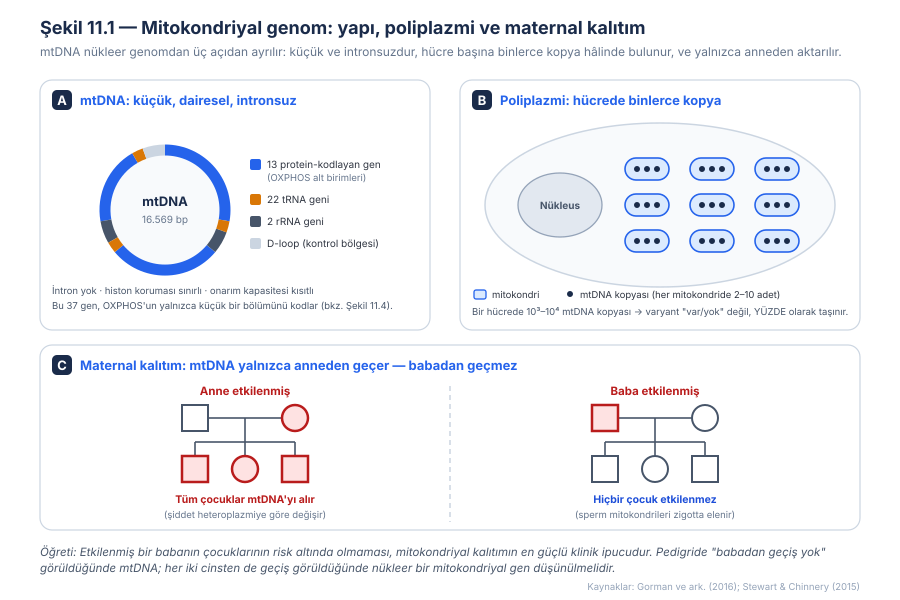
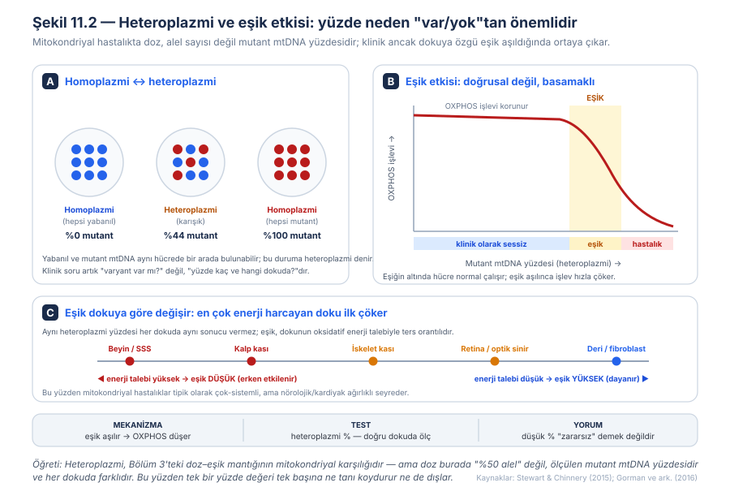
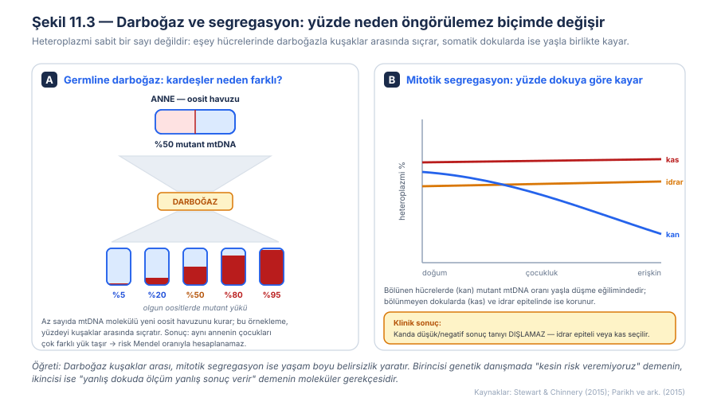
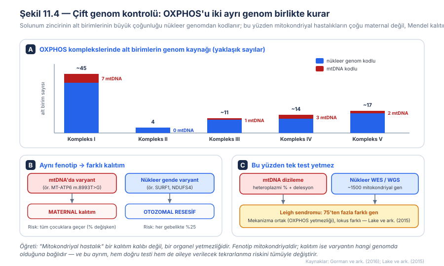
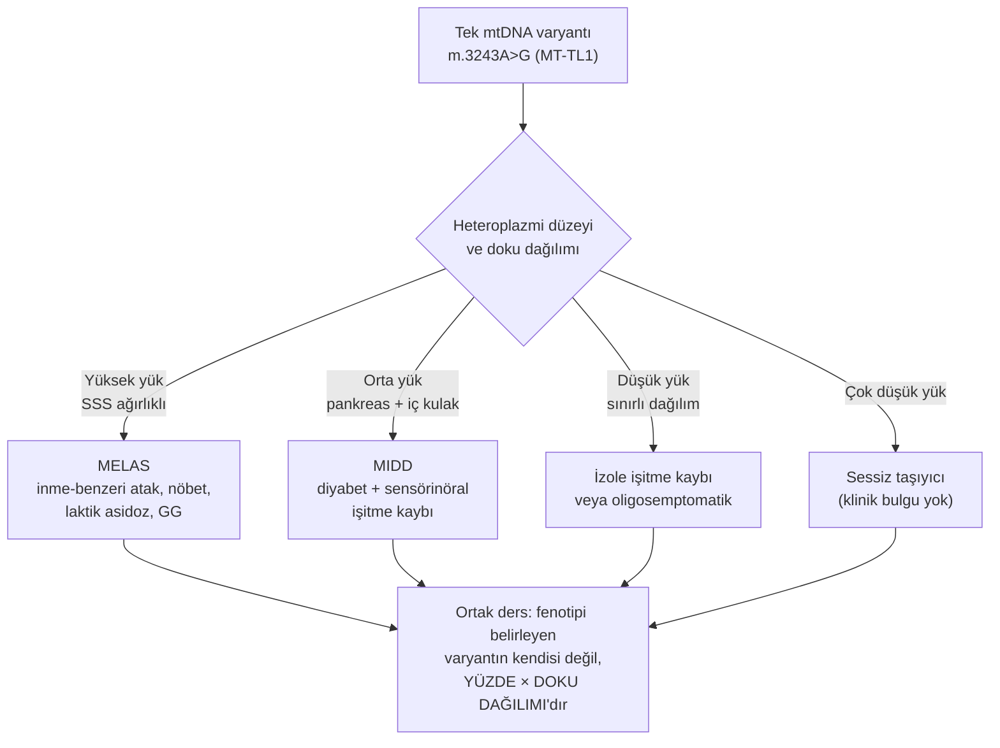
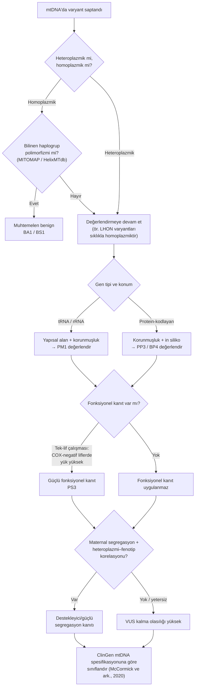
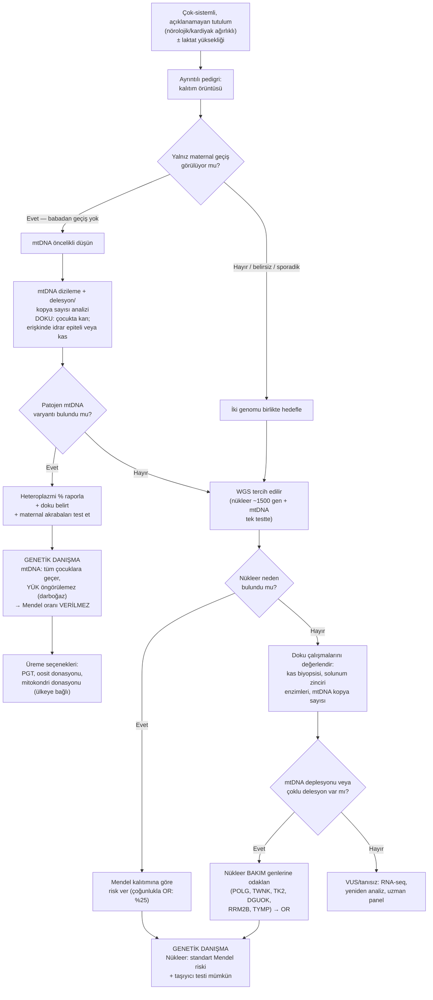

# Bölüm 11 — Mitokondriyal Genetik: Heteroplazmi, Eşik ve Çift Genom

> **Bölümün çekirdek tezi:** Mitokondriyal hastalıklar, tıbbi genetiğin standart kurallarının aynı anda geçersizleştiği tek alandır: hücrede genin iki değil binlerce kopyası vardır, bu yüzden doz "kaç alel" değil **mutant mtDNA yüzdesi (heteroplazmi)** olarak ölçülür; etki doğrusal değil **eşik-bağımlıdır**; kalıtım Mendel değil **maternaldir**; ve yüzde hem kuşaklar arasında (germline darboğaz) hem yaşam boyu (mitotik segregasyon) kayar. Ancak bu bölümün ikinci ve klinik olarak daha sık gözden kaçan tezi şudur: **mitokondriyal hastalıkların çoğu aslında nükleer gen hastalığıdır ve Mendel kurallarıyla kalıtılır.** "Mitokondriyal" sözcüğü bir kalıtım kalıbını değil, bir organel yetmezliğini tanımlar. Bu bölüm, Bölüm 3'te kurulan doz–eşik mantığını sürekli bir değişkene taşır ve Bölüm 10'daki "ebeveyn kökeni" eksenine, ondan tümüyle farklı bir mekanizmayla kurulan ikinci bir ebeveyn asimetrisi ekler.

> **Bu bölüm nasıl okunmalı?** Tıp öğrencileri için doğrusal okuma önerilir; poliplazmi–heteroplazmi–eşik zinciri (Şekil 11.1 ve 11.2) kurulmadan klinik tablolar ve test seçimi ezber kalır. Klinisyenler için "Klinik fenotipe dönüşüm → Tanısal testler → Karar algoritması" hattı önceliklidir; darboğaz ve segregasyon (Şekil 11.3) genetik danışma öncesinde mutlaka okunmalıdır. Varyant yorumlayanlar için 6. başlık (mtDNA'ya özgü ACMG spesifikasyonu) bağımsız olarak kullanılabilir.

> 🖼️ **Görseller hakkında not:** Şekil 11.1–11.4 `assets/` klasöründe SVG olarak bulunur. Mermaid diyagramları metin içine gömülüdür.

---

## Öğrenme hedefleri

Bu bölümü tamamlayan okuyucu:
1. mtDNA'nın yapısal özelliklerini (büyüklük, gen içeriği, intronsuzluk, poliplazmi) sayar ve bunların hastalık mekanizmasına nasıl yansıdığını açıklar.
2. Homoplazmi ve heteroplazmiyi tanımlar; heteroplazminin neden "yüzde" olarak ifade edilmesi gerektiğini gerekçelendirir.
3. Eşik etkisini açıklar ve eşiğin neden dokudan dokuya değiştiğini enerji talebiyle ilişkilendirir.
4. Maternal kalıtımı pedigri üzerinden tanır ve etkilenmiş babanın çocuklarının neden risk taşımadığını açıklar.
5. Germline darboğaz ile mitotik segregasyonu birbirinden ayırır; birincisinin tekrarlanma riskini, ikincisinin doku seçimini neden belirlediğini yorumlar.
6. mtDNA kaynaklı ve nükleer kaynaklı mitokondriyal hastalıkları ayırt eder ve bu ayrımın tekrarlanma riski ile test seçimine etkisini açıklar.
7. Mitokondriyal hastalık şüphesinde uygun tanısal test dizisini ve doku seçimini gerekçelendirerek belirler.
8. mtDNA varyantlarının yorumlanmasında standart ACMG kriterlerinin neden yetersiz kaldığını ve ClinGen mtDNA spesifikasyonunun neleri değiştirdiğini açıklar.
9. Pediatrik mitokondriyal tablolarda (Leigh, MELAS, Pearson/KSS, Alpers) mekanizma–fenotip–test zincirini kurar.

---

## 1. Kavramsal tanım

Bu kitabın buraya kadarki bölümlerinde, bir hastalık mekanizmasını çözümlemek için hep aynı soruyu sorduk: *bu genin iki kopyasından kaçı ve ne kadar işlevsel?* Haploinsufficiency'de bir kopya kaybolmuştu, dominant-negatifte bozuk ürün sağlamını zehirliyordu, imprintingde kopyalardan biri baştan susturulmuştu. Bütün bu senaryoların ortak zemini, genin hücrede **iki kopya** hâlinde bulunmasıydı. Mitokondriyal genetikte bu zemin ortadan kalkar — ve onunla birlikte, alışkın olduğumuz hemen her kural değişir.

Mitokondri, ökaryot hücrenin enerji santralidir: besinlerden gelen elektronları **oksidatif fosforilasyon (OXPHOS)** yoluyla ATP'ye çeviren beş protein kompleksini (Kompleks I–V) iç zarında barındırır. Bu organelin, evrimsel geçmişinin bir kalıntısı olarak **kendi DNA'sı** vardır: 16.569 baz çiftlik, dairesel, intronsuz bir molekül olan **mtDNA**. Bu küçük genom yalnızca 37 gen taşır — 13 protein-kodlayan gen (hepsi OXPHOS alt birimi), 22 tRNA geni ve 2 rRNA geni. Şekil 11.1'de görüleceği gibi, nükleer genomun aksine mtDNA'da intron yoktur, gen aralarındaki boşluk neredeyse sıfırdır ve histon koruması sınırlıdır; bu da mtDNA'yı hem daha yoğun bilgi taşıyan hem de hasara daha açık bir molekül yapar.

Asıl kavramsal kırılma, **kopya sayısında** yatar. Bir hücrede tek bir çekirdek ve dolayısıyla her otozomal genin tam olarak iki kopyası bulunurken, aynı hücrede yüzlerce mitokondri ve her mitokondride birkaç mtDNA molekülü vardır; toplamda bir hücre binlerce mtDNA kopyası taşır. Bu duruma **poliplazmi** denir. Poliplazminin doğrudan sonucu şudur: bir mtDNA varyantı "var" ya da "yok" olarak değil, **hangi oranda bulunduğu** olarak taşınır. Hücredeki bütün mtDNA kopyaları aynıysa buna **homoplazmi**, yabanıl ve mutant moleküller bir arada bulunuyorsa **heteroplazmi** denir. Klinik pratikte bir mtDNA raporu bu yüzden "patojen varyant saptandı" demekle yetinemez; **"%68 heteroplazmi düzeyinde saptandı"** demek zorundadır.

Heteroplazmi bir yüzde olduğu için, mitokondriyal hastalıkta doz artık kesikli değil **sürekli** bir değişkendir. Ancak bu sürekliliğin klinik karşılığı doğrusal değildir. Mutant oranı belli bir sınırın altında kaldığı sürece sağlam kalan mtDNA kopyaları yeterli OXPHOS kapasitesini üretir ve hücre normal çalışır; bu sınır aşıldığında ise işlev hızla çöker. Bu keskin geçişe **eşik etkisi** denir ve mitokondriyal genetiğin en önemli tek kavramıdır (Stewart ve Chinnery, 2015). Bölüm 3'te tanıştığımız doz–eşik eğrisinin burada birebir karşılığını buluyoruz; fark şu ki oradaki doz "%50 protein" iken buradaki doz ölçülebilir bir yüzdedir ve — kritik biçimde — **her dokuda farklıdır.**

Kalıtım da farklıdır. Döllenme sırasında zigotun mitokondrileri neredeyse tümüyle oositten gelir; spermin getirdiği az sayıda mitokondri erken embriyoda etkin biçimde elenir. Sonuç **maternal kalıtım**dır: bir mtDNA varyantı anneden bütün çocuklara geçer, ama etkilenmiş bir babadan hiçbir çocuğa geçmez (Gorman ve ark., 2016). Şekil 11.1C'de gösterilen bu asimetri, pedigriye bakan hekim için en güçlü tek ipucudur. Dikkat edilmesi gereken nokta, bunun Bölüm 10'daki imprintingden tümüyle farklı bir mekanizma olduğudur: imprintingde her iki ebeveyn kopyası da fiziksel olarak vardır ama biri epigenetik olarak susturulmuştur; mitokondriyal kalıtımda ise paternal kopya hiç **aktarılmaz**. İkisi de "ebeveyn kökenine bağlı" tablolar üretir, ama biri epigenetik bir işaretle, diğeri fiziksel bir aktarım kuralıyla.

Son iki kavram, yüzdenin neden sabit olmadığını açıklar. **Germline darboğaz**, oogenez sırasında yeni oosit havuzunun görece az sayıda mtDNA molekülünden kurulmasıdır; bu örnekleme, annenin taşıdığı yüzdeyi çocuklar arasında geniş bir aralığa saçar. **Mitotik segregasyon** ise, hücre bölünmelerinde mtDNA moleküllerinin yavru hücrelere rastgele dağılması sonucu doku heteroplazmisinin yaşam boyu kaymasıdır. Birincisi genetik danışmada neden kesin bir tekrarlanma riski verilemediğini, ikincisi neden yanlış dokuda yapılan ölçümün yanlış sonuç verdiğini açıklar.

Bütün bunların üzerine, klinik olarak en çok gözden kaçan gerçek gelir: **mitokondri iki genomun ortak ürünüdür.** OXPHOS komplekslerinin alt birimlerinin büyük çoğunluğu — ve mtDNA'nın replikasyonu, transkripsiyonu, onarımı için gereken bütün proteinler — nükleer genomdan kodlanır (Almannai ve ark., 2018). Bu yüzden mitokondriyal fenotipli bir hastanın altında yatan varyant pekâlâ nükleer bir gende olabilir; o durumda kalıtım otozomal resesif, otozomal dominant veya X'e bağlı olur ve tekrarlanma riski Mendel oranlarıyla hesaplanır.

**Tablo 11.1 — Mitokondriyal genetiğin temel kavramları**

| Kavram | Tanım | Klinik anlamı |
|---|---|---|
| Poliplazmi | Bir hücrede binlerce mtDNA kopyasının bulunması | Varyant "var/yok" değil, yüzde olarak taşınır |
| Homoplazmi | Tüm mtDNA kopyalarının aynı olması (%0 veya %100 mutant) | Homoplazmik ≠ otomatik patojen; haplogrup polimorfizmleri de homoplazmiktir |
| Heteroplazmi | Yabanıl ve mutant mtDNA'nın bir arada bulunması | Raporda mutlaka yüzde belirtilmeli; doku adı olmadan yüzde anlamsızdır |
| Eşik etkisi | Mutant oran belli sınırı aşınca işlevin hızla çökmesi | Düşük yüzde "zararsız" demek değildir; eşik dokuya göre değişir |
| Maternal kalıtım | mtDNA'nın yalnızca anneden aktarılması | Etkilenmiş babanın çocukları risk taşımaz — en güçlü pedigri ipucu |
| Germline darboğaz | Oosit havuzunun az sayıda mtDNA'dan kurulması | Kardeşler çok farklı yük taşır → kesin tekrarlanma riski verilemez |
| Mitotik segregasyon | Bölünmelerde mtDNA'nın rastgele dağılması | Kanda yüzde yaşla düşebilir → doku seçimi kritik |
| Çift genom kontrolü | OXPHOS'un hem nükleer hem mtDNA genlerince kurulması | Mitokondriyal fenotip ≠ mitokondriyal kalıtım |

---

## 2. Moleküler mekanizma

### 2.1 mtDNA neden bu kadar savunmasız?

mtDNA'nın hastalık üretmeye yatkınlığı, üç yapısal özelliğinin bileşimidir. Birincisi **bilgi yoğunluğudur**: 16.569 bazda 37 gen sıkıştırılmıştır, intron yoktur ve genler arası boşluk neredeyse hiç bulunmaz. Nükleer genomda bir nokta değişikliğinin intronik veya intergenik bir bölgeye düşme olasılığı yüksekken, mtDNA'da rastgele bir değişiklik büyük olasılıkla işlevsel bir diziyi bozar. İkincisi **konumudur**: mtDNA, elektron taşıma zincirinin hemen yanında, reaktif oksijen türlerinin sürekli üretildiği bir mikroçevrede bulunur ve nükleer DNA'yı saran histon paketlemesinden yoksundur. Üçüncüsü **onarım kapasitesinin darlığıdır**; mitokondri bazı DNA onarım yollarına sahiptir ama nükleer genomun onarım repertuvarına kıyasla sınırlıdır.

Bu üçlünün pratik sonucu, mtDNA'nın nükleer genoma göre belirgin biçimde daha yüksek bir varyasyon oranına sahip olmasıdır. Bu yüksek varyasyon, mitokondriyal hastalıkların görece sık olmasının bir nedenidir. Kuzeydoğu İngiltere'de yürütülen kapsamlı bir prevalans çalışmasında, erişkinlerde **mtDNA varyantları** için minimum prevalans **1/5.000** (100.000'de 20) bulunmuş; nükleer kaynaklı olgular da eklendiğinde erişkin mitokondriyal hastalığın toplam prevalansı **yaklaşık 1/4.300**'e ulaşmıştır. Bu rakam, mitokondriyal hastalığı kalıtsal nörolojik bozuklukların en yaygın gruplarından biri hâline getirir (Gorman ve ark., 2015). Aynı yüksek varyasyon, aşağıda göreceğimiz üzere varyant yorumlamayı da zorlaştırır: mtDNA'da çok sayıda **haplogrup polimorfizmi** vardır ve bunlar homoplazmik oldukları hâlde tümüyle zararsızdır.

### 2.2 Poliplazmiden eşiğe: dozun sürekli hâle gelmesi

Mitokondriyal mekanizmanın kalbi, poliplazminin heteroplazmiye, heteroplazminin de eşik etkisine bağlandığı zincirdir. Bir hücrede binlerce mtDNA kopyası bulunduğu için, mutasyona uğramış moleküller sağlamlarla bir arada var olabilir. Hücre, ATP üretimini bu karışık havuzun **toplam** kapasitesinden sağlar. Mutant moleküllerin oranı arttıkça sağlam kapasite azalır; ancak hücrelerin OXPHOS kapasitesinde belirgin bir **rezerv** bulunduğu için, bu azalma uzun süre klinik olarak görünmez kalır. Şekil 11.2'deki eğri bu yüzden düz bir doğru değil, uzun bir plato ve ardından gelen dik bir düşüş biçimindedir.

Eşiğin sayısal değeri varyant tipine ve dokuya göre değişir; nokta varyantları için tipik olarak yüksek oranlar (temsilî olarak %60–90 aralığı), tek büyük delesyonlar için ise daha düşük oranlar bildirilmiştir (Gorman ve ark., 2016). Ancak klinisyen için ezberlenmesi gereken sayı değil, **ilkedir**: eşik, dokunun oksidatif enerji talebiyle ters orantılıdır. Sürekli ve yüksek ATP tüketen dokular — merkezî sinir sistemi, kalp kası, iskelet kası, retina ve optik sinir, böbrek tübülü, iç kulak — düşük eşiklidir ve erken etkilenir. Fibroblast gibi düşük talepli dokular yüksek mutant yüklerini bile tolere edebilir. Mitokondriyal hastalıkların neden neredeyse her zaman **çok sistemli** ama **nörolojik ve kardiyak ağırlıklı** seyrettiğinin cevabı budur.

> **🔬 Deep-dive — Eşik neden bu kadar keskin, ve tRNA varyantları neden farklı davranır?** Eşiğin keskinliği iki ayrı olgunun bileşimidir. Birincisi, yukarıda değinilen rezerv kapasitedir: bir dokuda OXPHOS kapasitesinin belirli bir oranı kaybedilene kadar ATP üretimi korunur, çünkü sistem baştan fazlalıklı çalışır. İkincisi, mitokondriler arası **tamamlayıcılık (complementation)** dır — mitokondriler sürekli olarak birleşir (füzyon) ve ayrılır (fisyon); bu dinamik ağ sayesinde sağlam bir mtDNA'nın ürettiği transkriptler ve proteinler, komşu bozuk genomun eksiğini bir ölçüde kapatabilir. Ancak mutant oran arttıkça tamamlayacak sağlam molekül kalmaz ve sistem aniden çöker. Bu noktada kritik bir ayrım vardır: **protein-kodlayan bir gendeki** varyant yalnızca tek bir alt birimi ve dolayısıyla tek bir kompleksi etkiler (ör. *MT-ND* genleri → Kompleks I). Buna karşılık **tRNA veya rRNA genindeki** bir varyant, mitokondriyal translasyonun tümünü bozar ve 13 proteinin hepsinin sentezini birden aksatır; bu nedenle tRNA varyantları tipik olarak birden çok kompleksi tutan, daha ağır ve daha çok sistemli tablolar yapar. m.3243A>G'nin (*MT-TL1*, bir lösin tRNA'sı) neden MELAS gibi ağır ve çok sistemli bir sendrom üretebildiğinin mekanik açıklaması budur (Goto ve ark., 1990).

### 2.3 Yüzde neden sabit değil: darboğaz ve mitotik segregasyon

Heteroplazmiyi "hastanın bir özelliği" gibi tek bir sayıya indirgemek, mitokondriyal genetikte yapılabilecek en yaygın kavramsal hatadır. Yüzde iki ayrı eksende hareket eder: kuşaklar arasında ve yaşam boyunca.

Kuşaklar arası hareketin nedeni **germline darboğazdır**. Oogenez sırasında, gelişmekte olan oositlerin mtDNA havuzu görece az sayıda kurucu molekülden yeniden kurulur ve ardından hızla çoğaltılır. İstatistiksel olarak bu, küçük örneklemden yapılan bir çekilişe benzer: annenin ortalama %50 mutant yükü, oositler arasında %5 ile %95 arasında değişen yüklere dağılabilir (Stewart ve Chinnery, 2015). Şekil 11.3A'da gösterilen bu saçılma, klinikte doğrudan şu anlama gelir: aynı annenin bir çocuğu ağır etkilenirken diğeri tümüyle sağlıklı olabilir ve **Mendel oranlarına dayalı kesin bir tekrarlanma riski hesaplanamaz.**

Yaşam boyu hareketin nedeni ise **mitotik segregasyondur**. Bir hücre bölündüğünde mtDNA molekülleri yavru hücrelere kesin oranlarla değil, rastgele dağılır. Sürekli bölünen dokularda bu rastgelelik, kuşak kuşak birikerek heteroplazmi oranını kaydırır. Klinik olarak en önemli örneği kandır: birçok mtDNA varyantı için mutant yük, kan hücrelerinde yaşla birlikte **düşme** eğilimindedir; oysa bölünmeyen iskelet kası ve idrar epitel hücrelerinde büyük ölçüde korunur. Şekil 11.3B'deki bu ayrışma, mitokondriyal tanıda doku seçiminin neden teknik bir ayrıntı değil, tanısal doğruluğun kendisi olduğunu gösterir.

> **🔬 Deep-dive — mtDNA neden babadan geçmez, ve "hiç" mi geçmez?** Paternal mtDNA'nın elenmesi tek bir mekanizmaya değil, üst üste binen birkaç güvenceye dayanır. Birincisi basit bir **seyreltme** sorunudur: olgun bir oosit yüz binler mertebesinde mtDNA taşırken, sperm yalnızca birkaç yüz mitokondri getirir; oran baştan binde birler düzeyindedir. İkincisi **etkin yıkımdır**: döllenmeden sonra sperm kaynaklı mitokondriler işaretlenerek otofajik yolaklarla ortadan kaldırılır. Bu iki katmanın birlikte çalışması, insan pedigrilerinde maternal kalıtımın neden istisnasız görünen bir kural gibi davrandığını açıklar. Literatürde çok az sayıda **paternal mtDNA geçişi** bildirimi bulunmakla birlikte, bunlar son derece nadirdir, bir kısmı tartışmalıdır ve klinik danışmanlık pratiğini değiştirmez. ⚠️ Bu istisnaların sıklığı ve mekanizması hâlâ tartışmalıdır; genetik danışmada maternal kalıtım kuralı esas alınmalı, paternal geçiş rutin bir olasılık olarak sunulmamalıdır.

### 2.4 Çift genom: mitokondriyal fenotip ≠ mitokondriyal kalıtım

Şimdiye kadar anlatılan her şey mtDNA içindir. Oysa mitokondrinin işleyişi, ezici çoğunlukla nükleer genomun denetimindedir. Beş OXPHOS kompleksinin toplam alt birimlerinin yalnızca 13'ü mtDNA'dan, geri kalan onlarcası nükleer genomdan kodlanır (Şekil 11.4). Dahası, kompleksleri bir araya getiren montaj faktörleri, kofaktör sentez yolakları, mitokondriyal ribozom bileşenleri, aminoaçil-tRNA sentetazları ve mtDNA'nın kendi replikasyon makinesi — hepsi nükleer genlerdir. Mitokondriyal işleve katkı veren nükleer gen sayısı yaklaşık 1.500 olarak tahmin edilir.

Bunun klinik sonucu belirleyicidir. Kompleks II tümüyle nükleer kodludur; dolayısıyla izole Kompleks II eksikliği hiçbir zaman maternal kalıtılmaz. Kompleks I'in 45 civarındaki alt biriminin yalnızca 7'si mtDNA kaynaklıdır; geri kalanındaki bir varyant otozomal resesif bir hastalık üretir. Aynı klinik tablo — örneğin Leigh sendromu — hem *MT-ATP6*'daki bir mtDNA varyantından hem de *SURF1* gibi bir nükleer genden kaynaklanabilir; ilkinde risk maternaldir ve tüm çocuklara geçer, ikincisinde her gebelikte %25'tir. **Fenotip aynıdır, mekanizmanın son yolu aynıdır, ama kalıtım ve dolayısıyla aileye verilecek risk tümüyle farklıdır.**

Nükleer genin bozulmasının mtDNA üzerinde ikincil, ölçülebilir izler bıraktığı özel bir grup da vardır. mtDNA'nın replikasyonunu ve bakımını üstlenen nükleer genlerdeki (ör. *POLG*, *TWNK*, *TK2*, *DGUOK*, *RRM2B*, *TYMP*) varyantlar, etkilenen dokularda ya mtDNA **kopya sayısının azalmasına (deplesyon)** ya da **çoklu mtDNA delesyonlarının birikmesine** yol açar (Almannai ve ark., 2018). Bu, klinik açıdan çok öğreticidir: laboratuvar bulgusu mtDNA'da görünür (kopya sayısı düşük, çoklu delesyon var), ama **nedensel varyant nükleer gendedir** ve kalıtım resesiftir. mtDNA'da bulgu görmek, mtDNA'da varyant aramaya yönlendirmez; tam tersine nükleer bir bakım genine işaret eder.

---

## 3. Varyant tipleri

Mitokondriyal hastalıklarda "varyant" kategorisi, hangi genomda bulunduğuna ve mtDNA üzerinde doğrudan mı yoksa dolaylı mı etki yaptığına göre ayrışır. Aşağıdaki tablo, bu bölümün klinik omurgasını oluşturur; çünkü satırlardan hangisinde olduğunuz hem testi hem tekrarlanma riskini belirler.

**Tablo 11.2 — Mitokondriyal lezyon tipleri, kalıtım ve tekrarlanma riski**

| Lezyon tipi | Genom | Moleküler sonuç | Kalıtım / tekrarlanma riski | Örnek |
|---|---|---|---|---|
| mtDNA protein-kodlayan nokta varyantı | mtDNA | Tek OXPHOS alt biriminin işlev kaybı; tek kompleks tutulur | Maternal; heteroplazmi bağımlı | *MT-ATP6* m.8993T>G (NARP/Leigh) |
| mtDNA tRNA varyantı | mtDNA | Mitokondriyal translasyon bozulur; birden çok kompleks tutulur | Maternal; heteroplazmi bağımlı | *MT-TL1* m.3243A>G (MELAS/MIDD) |
| mtDNA rRNA varyantı | mtDNA | Mitoribozom işlevi bozulur | Maternal; sıklıkla homoplazmik | *MT-RNR1* m.1555A>G (aminoglikozid duyarlı işitme kaybı) |
| Tek büyük mtDNA delesyonu | mtDNA | Birçok gen birden kaybolur; dokuya göre dağılım | Genellikle **sporadik** (de novo); düşük tekrar riski | Kearns-Sayre, Pearson, CPEO |
| mtDNA deplesyonu (kopya sayısı ↓) | **Nükleer** | Dokuda mtDNA miktarı kritik düzeyin altına iner | Otozomal resesif (%25) | *TK2*, *DGUOK*, *POLG*, *RRM2B* |
| Çoklu mtDNA delesyonu | **Nükleer** | Zamanla biriken sekonder delesyonlar | OR veya OD | *POLG*, *TWNK* |
| Nükleer OXPHOS yapısal/montaj geni | Nükleer | Kompleks kurulamaz veya kararsızdır | Genellikle otozomal resesif | *NDUFS4*, *SURF1* |
| Nükleer mitokondriyal bakım/biyogenez geni | Nükleer | Translasyon, kofaktör veya lipid metabolizması bozulur | Genellikle otozomal resesif; nadiren XL | Mitokondriyal aminoaçil-tRNA sentetazları |

Bu tablonun okunma biçimi şudur: ilk dört satır mtDNA'da doğrudan lezyondur ve **mtDNA dizileme/delesyon analizi** ile yakalanır; son dört satır nükleer genomdadır ve **WES/WGS veya nükleer panel** gerektirir. Beşinci ve altıncı satırlar özellikle sinsidir, çünkü mtDNA üzerinde ölçülebilir bir anormallik (deplesyon veya çoklu delesyon) yaratırlar ama nedensel varyant orada değildir. Ayrıca dördüncü satırın klinik önemi büyüktür: tek büyük mtDNA delesyonları tipik olarak oogenez sırasında *de novo* oluşur; bu nedenle Kearns-Sayre veya Pearson tanısı alan bir çocuğun kardeşleri için tekrarlanma riski, maternal kalıtımlı nokta varyantlarının aksine düşüktür.

---

## 4. Klinik fenotipe dönüşüm

### 4.1 Neden çok sistemli, ve neden özellikle bu dokular?

Mitokondriyal hastalıkların klinik imzası, tek bir organa oturmayan, birbiriyle ilgisiz görünen bulguların bir arada olmasıdır: gelişim geriliği ve nöbetin yanında işitme kaybı, kardiyomiyopati, diyabet, ptozis, retinopati ve böbrek tübülopatisi. Bu dağınıklık rastgele değildir; 2.2'de kurulan eşik–enerji ilişkisinin doğrudan sonucudur. ATP, her hücrenin ortak para birimidir; dolayısıyla OXPHOS yetmezliği ilkece her dokuyu etkileyebilir, ama **önce ve en çok** en yüksek talepli dokuları etkiler. Bu nedenle klinik ipucu, tek bir bulgunun kendisi değil, **açıklanamayan biçimde bir araya gelmiş çok-sistemli bulgu kümesidir.**

Buradan pratik bir kural çıkar: birbirini açıklamayan iki veya daha fazla sistemin — özellikle biri nörolojik veya kardiyakken — birlikte tutulduğu her çocukta mitokondriyal hastalık ayırıcı tanıda yer almalıdır (Parikh ve ark., 2015).

### 4.2 Neden aynı varyant farklı hastalıklar yapar?

Mitokondriyal genetiğin en kafa karıştırıcı gözlemi, tek bir varyantın birbirinden çok farklı klinik tablolar üretebilmesidir. Bunun ders kitabı örneği m.3243A>G'dir. Aynı varyant, yüksek heteroplazmi düzeylerinde çocukluk veya genç erişkinlikte **MELAS** (mitokondriyal ensefalomiyopati, laktik asidoz ve inme-benzeri ataklar) tablosunu yapabilirken, daha düşük düzeylerde yalnızca **maternal kalıtımlı diyabet ve işitme kaybı (MIDD)** olarak; daha da düşük düzeylerde ise izole işitme kaybı veya tümüyle sessiz taşıyıcılık olarak karşımıza çıkar.

Bu spektrumun açıklaması iki değişkenin çarpımıdır: **heteroplazmi düzeyi** ve **dokusal dağılım**. Aynı toplam yüke sahip iki kişide, mutant moleküllerin embriyogenez sırasında hangi doku öncüllerine düştüğü farklıysa, biri ağırlıklı olarak beyin, diğeri ağırlıklı olarak pankreas ve iç kulak tutulumu gösterir. Bu yüzden mitokondriyal hastalıkta genotip–fenotip ilişkisi, önceki bölümlerdeki gibi "varyant → fenotip" biçiminde tek yönlü değil; **varyant × yüzde × doku dağılımı → fenotip** biçiminde üç değişkenlidir.

**Algoritma 11.1 — Aynı mtDNA varyantı neden farklı hastalıklar yapar?**

### 4.3 Neden aynı hastalık farklı genlerden olur?

Önceki sorunun aynadaki görüntüsü de aynı ölçüde önemlidir. **Leigh sendromu** — bebeklik veya erken çocuklukta başlayan, bazal ganglion ve beyin sapında simetrik nekrotizan lezyonlarla giden, psikomotor gerileme, distoni, solunum düzensizliği ve laktik asidozla seyreden ilerleyici bir ensefalopati — tek bir gene değil, 75'ten fazla farklı gene bağlı olarak ortaya çıkabilir (Lake ve ark., 2016). Bu genlerin bir kısmı mtDNA'da (*MT-ATP6*, *MT-ND* genleri), büyük çoğunluğu ise nükleer genomdadır (*SURF1*, *NDUFS4*, *NDUFV1*, *SDHA*, *PDHA1* ve diğerleri).

Bu, Bölüm 1'de tanıştığımız **lokus heterojenitesinin** en uç örneklerinden biridir ve mitokondriyal hastalıkların neden fenotipe dayalı tek-gen testleriyle çözülemediğini açıklar. Klinik tablo "Leigh sendromu" demek, tanıyı bir gene değil, ancak **ortak bir son yola** (OXPHOS yetmezliği) indirgemiş olmaktır. Genetik tanıya ulaşmak, bu son yola çıkan onlarca yoldan hangisinin kullanıldığını bulmayı gerektirir — ve bu, yalnızca geniş kapsamlı genom analiziyle mümkündür.

### 4.4 Ne zaman mitokondriyal hastalıktan şüphelenmeli?

Pratikte şüpheyi tetikleyen bir kırmızı bayrak kümesi vardır. Açıklanamayan çok-sistemli tutulum; nörolojik gerileme (özellikle enfeksiyon veya katabolik stresle tetiklenen); ilerleyici ekstraoküler kas zayıflığı ve ptozis; kardiyomiyopati ile birlikte nörolojik bulgu; sensörinöral işitme kaybı ile diyabetin birlikteliği; MR'da simetrik bazal ganglion lezyonları; kalıcı veya yükselen laktat; ve pedigride maternal geçişi düşündüren örüntü. Bu bulgular tek başlarına özgül değildir; tanısal değeri **birlikteliklerinden** doğar (Parikh ve ark., 2015).

---

## 5. Tanısal testlerle ilişkisi

Mitokondriyal hastalıkta test seçimi iki soruyu birden yanıtlamak zorundadır: **hangi genoma bakılacak** ve **hangi dokuda bakılacak**. Bu ikinci soru, kitabın başka hiçbir bölümünde bu kadar belirleyici değildir; çünkü mitotik segregasyon nedeniyle yanlış doku, gerçekten var olan bir varyantı tümüyle gizleyebilir.

**Tablo 11.3 — Mitokondriyal hastalıkları hangi test yakalar?**

| Test | Bu mekanizmayı yakalar mı? | Sınırlılığı |
|------|----------------------------|-------------|
| **WES** | Kısmen. Nükleer mitokondriyal genleri (~1500) iyi kapsar; mtDNA'yı ise ancak "off-target" okumalarla, değişken ve güvenilmez biçimde kapsar | mtDNA kapsaması standart değildir; heteroplazmi ölçümü güvenilir değildir; büyük mtDNA delesyonlarını ve kopya sayısını değerlendiremez |
| **Short-read WGS** | Evet — hem nükleer genleri hem mtDNA'yı yüksek derinlikte kapsar; heteroplazmi ve kopya sayısı tahmini yapılabilir | Düşük düzeyli heteroplazmi için doğrulama gerekir; NUMT (nükleer mtDNA kopyaları) kaynaklı yanlış pozitiflere dikkat |
| **Long-read WGS** | Evet; büyük mtDNA delesyonlarının sınırlarını ve karmaşık yeniden düzenlenmeleri tanımlamada üstün | Maliyet ve erişim; rutin ilk basamak değil |
| **Array-CGH / SNP array** | Hayır (mtDNA'yı hedeflemez) | Yalnız nükleer CNV'ler için; mitokondriyal tanıda rolü sınırlıdır |
| **MLPA** | Sınırlı. Nükleer gen delesyonları için kullanılabilir | mtDNA heteroplazmisini ölçmek için uygun değildir |
| **RNA-seq** | Dolaylı. Nükleer gendeki splice etkilerini ve ifade kaybını gösterebilir | Doku-spesifik; mtDNA varyantını doğrudan sınıflamaz |
| **Methylation array** | Hayır | mtDNA hastalık mekanizmasında metilasyonun yerleşik tanısal rolü yoktur |
| **Karyotip** | Hayır | Çözünürlük tümüyle yetersiz; mtDNA'yı görmez |
| **(mito-özgü) mtDNA dizileme + delesyon/kopya sayısı analizi** | **Evet — altın standart** | Doğru doku seçilmezse yanlış negatif; yüzde mutlaka raporlanmalı |

> **Bu mekanizmayı hangi test yakalar? (özet):** mtDNA lezyonları için hedefli **mtDNA dizileme + delesyon/kopya sayısı analizi**, doğru dokuda (çocukta kan sıklıkla yeterlidir; erişkinde ve şüphe sürüyorsa idrar epiteli veya kas) yapılmalıdır. Nükleer nedenler için **WES/WGS** gerekir. Pratikte iki genom birlikte değerlendirilmelidir; giderek artan biçimde **WGS**, her ikisini tek testte kapsadığı için tercih edilmektedir.

Klinik pratikte biyokimyasal ve doku bulguları da bu resmi tamamlar. Kanda ve BOS'ta laktat yüksekliği destekleyicidir ama normal laktat tanıyı **dışlamaz**. Kas biyopsisinde modifiye Gomori trikrom boyamasında görülen **"ragged red" lifler** ve sitokrom c oksidaz (COX)-negatif lifler, mitokondriyal patolojinin doku düzeyindeki karşılığıdır; solunum zinciri enzim aktivite ölçümleri hangi kompleksin tutulduğunu gösterir. Ancak genomik yöntemlerin yaygınlaşmasıyla birlikte, invaziv kas biyopsisi artık ilk basamak değil, genetik test sonrası açıklanamayan olgularda başvurulan bir doğrulama aracı hâline gelmiştir (Parikh ve ark., 2015).

> **🟦 Klinikte dikkat — Doku seçimi bir ayrıntı değil, tanının kendisidir:** Erişkin bir hastada kanda m.3243A>G saptanmaması, varyantın yokluğunu göstermez; mitotik segregasyon nedeniyle kan hücrelerinde yük yıllar içinde ölçülemez düzeye inmiş olabilir. Klinik şüphe sürüyorsa **idrar epitel hücreleri** (girişimsel olmayan ve genellikle kandan yüksek verimli) veya **iskelet kası** örneklenmelidir. Aynı biçimde, bir raporda "heteroplazmi %12" ifadesi, hangi dokuda ölçüldüğü belirtilmedikçe yorumlanamaz.

---

## 6. Varyant yorumlama açısından önemi (ACMG/ClinGen)

Bölüm 2'den beri kullandığımız ACMG/AMP çerçevesi (Richards ve ark., 2015), sessiz bir varsayım üzerine kuruludur: varyant ya heterozigot ya homozigot olarak vardır, popülasyon frekansı tek bir sayıdır ve de novo oluşum güçlü bir kanıttır. mtDNA'da bu varsayımların **hiçbiri** olduğu gibi geçerli değildir. Heteroplazmi yüzünden varyant "kısmen" vardır; popülasyon frekansı haplogruplara göre yapılanmıştır; ve maternal kalıtım nedeniyle klasik anlamda de novo kavramı farklı işler.

Bu boşluğu doldurmak için ClinGen Mitokondriyal Hastalık Varyant Kürasyon Uzman Paneli, ACMG/AMP kriterlerinin mtDNA'ya özgü bir **spesifikasyonunu** yayımlamıştır (McCormick ve ark., 2020). Bu spesifikasyonun getirdiği başlıca uyarlamalar, mekanizmayla doğrudan bağlantılıdır.

Birincisi, **popülasyon frekansı kriterleri (BA1/BS1/PM2) yeniden kalibre edilmiştir.** mtDNA'da bir varyantın sık görülmesi, çoğu zaman patojenite yokluğunun değil, o varyantın bir **haplogrup belirteci** olmasının işaretidir. İnsan popülasyonları farklı mtDNA haplogruplarına ayrılır ve her haplogrup, tanımı gereği bir dizi homoplazmik varyantla karakterizedir. Bu nedenle frekans değerlendirmesi, MITOMAP ve HelixMTdb gibi mtDNA-özgü veri tabanları üzerinden ve haplogrup bağlamı gözetilerek yapılmalıdır; genel nükleer frekans eşikleri doğrudan aktarılamaz.

İkincisi, **heteroplazmi–fenotip ilişkisi bağımsız bir kanıt boyutu hâline gelir.** Bir ailede varyantın heteroplazmi düzeyinin klinik ağırlıkla birlikte artması (etkilenmiş bireylerde yüksek, sağlıklı akrabalarda düşük), maternal segregasyonla birleştiğinde güçlü bir destekleyici kanıttır. Buna karşılık heteroplazmik bir varyantın etkilenmemiş bir maternal akrabada düşük düzeyde bulunması, tek başına iyi huyluluk kanıtı **değildir** — çünkü o kişi eşiğin altında kalmış olabilir.

Üçüncüsü, **fonksiyonel kanıt (PS3/BS3) mitokondriye özgü yöntemlerle tanımlanır.** Buradaki en güçlü kanıt tipi, "tek lif" (single-fiber) çalışmalarıdır: kas biyopsisinde COX-negatif liflerde mutant yükünün, COX-pozitif liflere kıyasla anlamlı biçimde yüksek bulunması, varyantın biyokimyasal kusurla nedensel bağını hücre düzeyinde gösterir. Ayrıca sitoplazmik hibrit (cybrid) hücre çalışmaları ve solunum zinciri enzim ölçümleri kullanılır. Bu, Bölüm 4'te değinilen "fonksiyonel kanıtın mekanizmayı tanımlaması gerekir" ilkesinin (Brnich ve ark., 2019) mitokondriyal karşılığıdır.

Dördüncüsü, **kritik bölge kriteri (PM1) mtDNA'nın kendine özgü yapısına göre tanımlanır.** tRNA genlerinde varyantın hangi yapısal alana (akseptör kol, antikodon kolu, D-kolu vb.) düştüğü ve o pozisyonun evrimsel korunmuşluğu, patojenite yönünde ağırlık taşır.

Beşinci ve kolayca gözden kaçan bir fark daha vardır: **mtDNA'da splicing yoktur.** İnsan mtDNA'sı intronsuzdur ve tek bir uzun transkript olarak okunup işlenir. Bunun doğrudan sonucu, Bölüm 7'nin tüm kriter setinin (kanonik ±1/±2 PVS1 mantığı, SpliceAI temelli PP3/BP4, RNA kanıtı için PVS1_Strength, BP7) mtDNA varyantlarına **hiç uygulanamamasıdır**. Uzman paneli spesifikasyonunun çıkış noktasında saydığı özellikler tam olarak bunlardır: maternal kalıtım, heteroplazmi, eşik etkisi, **splicing yokluğu** ve haplogrupların bağlamsal etkisi (McCormick ve ark., 2020).

> **🟦 Klinikte dikkat — "Homoplazmik" patojenite kanıtı değildir:** mtDNA raporlarında en sık yapılan yorum hatası, homoplazmik bir değişikliğin ağırlığından ötürü patojen sayılmasıdır. Oysa her insanın mtDNA'sı, referans diziden onlarca homoplazmik pozisyonda ayrılır; bunlar haplogrup polimorfizmleridir. Tersine, patojen varyantların çoğu heteroplazmiktir. Homoplazmi–heteroplazmi ayrımı bir patojenite göstergesi değil, yalnızca bir **yük** göstergesidir; yorum daima haplogrup bağlamı, korunmuşluk, segregasyon ve fonksiyonel kanıt üzerinden yapılmalıdır.

**Algoritma 11.2 — mtDNA varyantının yorumlanma akışı**

---

## 7. Pediatrik genetikten klinik örnekler

**Leigh sendromu — tek fenotip, iki genom.** Süt çocukluğunda psikomotor gerileme, hipotoni, distoni, beslenme güçlüğü, solunum düzensizliği ve laktik asidozla başvuran bir bebekte, MR'da bazal ganglionlarda ve beyin sapında simetrik T2 hiperintens lezyonlar Leigh sendromunu düşündürür. Moleküler neden mtDNA'daki *MT-ATP6* m.8993T>G olabilir — bu durumda yüksek heteroplazmi düzeyleri Leigh fenotipi, orta düzeyler NARP (nöropati, ataksi, retinitis pigmentoza) fenotipi yapar ve kalıtım maternaldir. Ya da neden *SURF1* gibi bir nükleer montaj genindeki biallelik varyant olabilir; o zaman kalıtım otozomal resesiftir ve tekrarlanma riski %25'tir. Leigh sendromunun 75'ten fazla farklı monogenik nedeni tanımlanmıştır (Lake ve ark., 2016). **Öğreti:** aynı fenotip karşısında "mitokondriyal" demek tanı değildir; hangi genomda olduğunu bilmeden aileye risk verilemez.

**MELAS ve m.3243A>G — yüzdenin fenotipi yazması.** Goto ve arkadaşlarının 1990'da *MT-TL1* (lösin tRNA'sı) genindeki m.3243A>G değişimini MELAS ile ilişkilendirmesi, tRNA varyantlarının mitokondriyal hastalıktaki merkezî rolünü ortaya koyan dönüm noktalarından biridir (Goto ve ark., 1990). Klinik olarak çocuk veya genç erişkinde tekrarlayan inme-benzeri ataklar, nöbetler, migren benzeri baş ağrısı, kusma, boy kısalığı, sensörinöral işitme kaybı ve laktik asidoz görülür; inme-benzeri lezyonlar tipik olarak damar sulama alanlarına uymaz. Aynı varyantın daha düşük yüklerde MIDD tablosuna dönüşmesi, 4.2'de anlatılan yüzde–doku çarpımının en iyi belgelenmiş örneğidir. **Öğreti:** tRNA varyantı tüm mitokondriyal translasyonu bozduğu için tek bir baz değişimi çok sistemli ağır hastalık üretebilir.

**Pearson ve Kearns-Sayre sendromları — tek büyük delesyon.** Holt ve arkadaşlarının 1988'de mitokondriyal miyopatili hastaların kasında büyük mtDNA delesyonlarını göstermesi, mtDNA'nın insan hastalığındaki rolünü kanıtlayan ilk bulgulardandır (Holt ve ark., 1988). Pediatride bu delesyonlar iki uçta karşımıza çıkar: süt çocukluğunda **Pearson sendromu** (sideroblastik anemi, pansitopeni, ekzokrin pankreas yetmezliği) ve daha ileri yaşlarda **Kearns-Sayre sendromu** (20 yaş öncesi başlayan progresif eksternal oftalmoplejı, pigmenter retinopati ve kardiyak ileti bozukluğu). Aynı lezyon tipi, delesyonun doku dağılımına göre kemik iliği ağırlıklı veya kas/göz ağırlıklı bir tablo yapar; Pearson'dan sağ kalan çocuklar zamanla Kearns-Sayre fenotipine kayabilir. **Öğreti:** tek büyük delesyonlar genellikle sporadiktir; bu, kardeş tekrarlanma riskini maternal kalıtımlı nokta varyantlarından ayıran kritik bir bilgidir. Ayrıca KSS'de kardiyak ileti bozukluğu ani ölüm riski taşıdığı için düzenli EKG izlemi zorunludur.

**mtDNA deplesyon sendromları — nükleer nedenin mtDNA'daki gölgesi.** Alpers-Huttenlocher fenotipiyle (dirençli nöbetler, psikomotor gerileme ve karaciğer yetmezliği) başvuran bir çocukta, kas veya karaciğerde mtDNA kopya sayısının belirgin biçimde azalmış bulunması, nedeni mtDNA'da değil **nükleer bakım genlerinde** aramaya yönlendirir. El-Hattab ve Scaglia'nın sınıflamasına göre bu sendromlar fenotipe göre miyopatik (*TK2*), ensefalomiyopatik (*SUCLA2*, *SUCLG1*, *RRM2B*), hepatoserebral (*DGUOK*, *MPV17*, *POLG*, *C10orf2/TWNK*) ve nörogastrointestinal (*TYMP* → MNGIE) gruplara ayrılır ve hepsi otozomal resesif kalıtılır (El-Hattab ve Scaglia, 2013). *POLG* ile ilişkili tablolarda valproatın karaciğer yetmezliğini tetikleyebilmesi, moleküler tanının doğrudan tedaviyi değiştirdiği çarpıcı bir örnektir. **Öğreti:** mtDNA'daki nicel bulgu (deplesyon) nedeni değil, **sonucu** işaret eder; tanı nükleer genomdadır ve risk %25'tir.

**LHON — eşiğin ötesindeki değişkenler.** Wallace ve arkadaşlarının 1988'de Leber herediter optik nöropatiyi bir mtDNA varyantıyla ilişkilendirmesi, insanda bir hastalığın mtDNA'ya bağlandığı ilk gösterimdir (Wallace ve ark., 1988). LHON, genç erişkinlerde genellikle ağrısız, sıralı iki taraflı ağır santral görme kaybıyla seyreder ve tipik "primer" varyantları sıklıkla **homoplazmiktir**. En öğretici yanı, penetransının belirgin biçimde eksik olması ve erkeklerde belirgin biçimde daha yüksek olmasıdır — yani homoplazmik patojen varyantı taşıyan pek çok kişi hiç hastalanmaz. **Öğreti:** heteroplazmi ve eşik, mitokondriyal fenotipi açıklayan yegâne değişkenler değildir; nükleer modifiye ediciler ve çevresel etkenler de belirleyicidir. Bu, Bölüm 1'deki eksik penetrans tartışmasının mitokondriyal karşılığıdır.

---

## 8. Sık yapılan hatalar ve klinikte dikkat

> **🔴 Sık yapılan hata kutusu**
> 1. **"Kanda mtDNA analizi negatif geldi, mitokondriyal hastalık dışlandı."** Mitotik segregasyon nedeniyle kan, özellikle erişkinlerde ve m.3243A>G gibi varyantlarda yanlış negatif verebilir. Şüphe sürüyorsa idrar epiteli veya kas örneklenmelidir.
> 2. **"Ailede maternal geçiş yok, o hâlde mitokondriyal hastalık değil."** Mitokondriyal hastalıkların çoğu nükleer kaynaklıdır ve otozomal resesif kalıtılır; ayrıca tek büyük mtDNA delesyonları tipik olarak sporadiktir. Maternal kalıtımın yokluğu tanıyı dışlamaz.
> 3. **"Heteroplazmi %30, demek ki hafif hastalık olur."** Yüzde–fenotip ilişkisi doku bağımlıdır; kanda %30 olan bir varyant kasta veya beyinde çok daha yüksek olabilir. Tek bir dokudan alınan yüzde, klinik ağırlığın doğrudan ölçüsü değildir.
> 4. **"Laktat normal, mitokondriyal hastalık düşünmedim."** Normal laktat mitokondriyal hastalığı dışlamaz; laktat duyarlı ama özgül olmayan bir destekleyici bulgudur.
> 5. **"WES yaptık, mtDNA da bakılmış olur."** Standart WES mtDNA'yı güvenilir biçimde kapsamaz; heteroplazmi ölçümü ve büyük delesyon saptaması için uygun değildir. mtDNA hedefli analiz veya WGS gerekir.
> 6. **"Homoplazmik varyant, mutlaka patojendir."** Homoplazmik değişikliklerin çoğu haplogrup polimorfizmidir. Homoplazmi bir yük göstergesidir, patojenite kanıtı değildir.
> 7. **"Anneye tekrarlanma riski %50 dedik."** mtDNA varyantı taşıyan bir anneden **tüm** çocuklara varyant geçer; belirsiz olan geçip geçmeyeceği değil, **hangi yükte** geçeceğidir. Bu yüzden risk bir Mendel oranıyla ifade edilemez.
> 8. **"Standart ACMG kriterlerini uyguladık."** mtDNA varyantları için ClinGen'in mtDNA'ya özgü spesifikasyonu kullanılmalıdır (McCormick ve ark., 2020); nükleer frekans eşikleri ve de novo mantığı doğrudan aktarılamaz.

> **🟦 Klinikte dikkat kutusu**
> - Mitokondriyal hastalık şüphesinde **doku seçimi** ve **yüzde raporlaması** birlikte istenmelidir; "mtDNA analizi" tek başına yetersiz bir istemdir.
> - Kearns-Sayre tanısında **kardiyak ileti bozukluğu** açısından düzenli EKG izlemi hayat kurtarıcıdır; pil gereksinimi ortaya çıkabilir.
> - *POLG* ile ilişkili hastalıkta **valproat**, karaciğer yetmezliğini tetikleyebileceği için kaçınılması gereken bir ilaçtır — moleküler tanı doğrudan tedaviyi değiştirir.
> - *MT-RNR1* m.1555A>G taşıyıcılarında **aminoglikozidler** ağır ve kalıcı işitme kaybı yapabilir; aile taraması ve ilaç uyarısı gerekir.
> - mtDNA varyantı taşıyan kadınlara üreme seçenekleri (preimplantasyon genetik tanı, oosit donasyonu, bazı ülkelerde mitokondri donasyonu) **uzman genetik danışma** çerçevesinde sunulmalıdır; her seçeneğin sınırlılıkları ve belirsizlikleri farklıdır (Craven ve ark., 2017).
> - Prenatal tanı mtDNA hastalıklarında sınırlı güvenilirliktedir: koryon villus örneğinde ölçülen heteroplazmi, fetüsün dokularındaki dağılımı ve doğum sonrası klinik ağırlığı güvenle öngörmeyebilir.

---

## 9. Klinik pratikte karar algoritması

**Algoritma 11.3 — Mitokondriyal hastalık şüphesinde tanısal akış**

---

## 10. Kaynaklar

> **Atıf / doğrulama notu:** Bu bölümün bibliyografik verileri PubMed üzerinden doğrulanmıştır; her kaynağın PMID ve DOI'si tek tek teyit edilmiştir. (Metin içinde yazar-yıl, kaynakçada DOI-link kullanılır.)

1. **Gorman GS, Chinnery PF, DiMauro S, ve ark. (2016).** Mitochondrial diseases. *Nature Reviews Disease Primers* 2:16080. **PMID: 27775730** · DOI: [10.1038/nrdp.2016.80](https://doi.org/10.1038/nrdp.2016.80) — *Kullanım amacı: Bölümün ana çerçeve kaynağı; çift genom kontrolü, heteroplazmi, klinik heterojenite, tanı ve üreme seçenekleri.*

2. **Stewart JB, Chinnery PF (2015).** The dynamics of mitochondrial DNA heteroplasmy: implications for human health and disease. *Nature Reviews Genetics* 16(9):530–542. **PMID: 26281784** · DOI: [10.1038/nrg3966](https://doi.org/10.1038/nrg3966) — *Kullanım amacı: Heteroplazmi dinamikleri, eşik etkisi, germline darboğaz ve mitotik segregasyonun mekanistik temeli.*

3. **McCormick EM, Lott MT, Dulik MC, ve ark. (2020).** Specifications of the ACMG/AMP standards and guidelines for mitochondrial DNA variant interpretation. *Human Mutation* 41(12):2028–2057. **PMID: 32906214** · DOI: [10.1002/humu.24107](https://doi.org/10.1002/humu.24107) — *Kullanım amacı: Guideline — mtDNA'ya özgü ACMG/AMP kriter uyarlamaları (frekans/haplogrup, heteroplazmi, PS3 tek-lif, PM1).*

4. **Parikh S, Goldstein A, Koenig MK, ve ark. (2015).** Diagnosis and management of mitochondrial disease: a consensus statement from the Mitochondrial Medicine Society. *Genetics in Medicine* 17(9):689–701. **PMID: 25503498** · DOI: [10.1038/gim.2014.177](https://doi.org/10.1038/gim.2014.177) — *Kullanım amacı: Guideline — tanısal yaklaşım, doku seçimi, biyokimyasal testlerin ve kas biyopsisinin yeri, izlem.*

5. **Lake NJ, Compton AG, Rahman S, Thorburn DR (2016).** Leigh syndrome: One disorder, more than 75 monogenic causes. *Annals of Neurology* 79(2):190–203. **PMID: 26506407** · DOI: [10.1002/ana.24551](https://doi.org/10.1002/ana.24551) — *Kullanım amacı: Klinik örnek/lokus heterojenitesi — tek fenotipin hem mtDNA hem nükleer kökenli 75'ten fazla nedeni.*

6. **Goto Y, Nonaka I, Horai S (1990).** A mutation in the tRNA(Leu)(UUR) gene associated with the MELAS subgroup of mitochondrial encephalomyopathies. *Nature* 348(6302):651–653. **PMID: 2102678** · DOI: [10.1038/348651a0](https://doi.org/10.1038/348651a0) — *Kullanım amacı: Landmark — m.3243A>G'nin MELAS ile ilişkilendirilmesi; tRNA varyantı mekanizması.*

7. **Holt IJ, Harding AE, Morgan-Hughes JA (1988).** Deletions of muscle mitochondrial DNA in patients with mitochondrial myopathies. *Nature* 331(6158):717–719. **PMID: 2830540** · DOI: [10.1038/331717a0](https://doi.org/10.1038/331717a0) — *Kullanım amacı: Landmark — insan hastalığında büyük mtDNA delesyonlarının ilk gösterimi (Pearson/KSS zemini).*

8. **Wallace DC, Singh G, Lott MT, ve ark. (1988).** Mitochondrial DNA mutation associated with Leber's hereditary optic neuropathy. *Science* 242(4884):1427–1430. **PMID: 3201231** · DOI: [10.1126/science.3201231](https://doi.org/10.1126/science.3201231) — *Kullanım amacı: Landmark — bir insan hastalığının mtDNA varyantına bağlandığı ilk çalışma; LHON ve eksik penetrans.*

9. **El-Hattab AW, Scaglia F (2013).** Mitochondrial DNA depletion syndromes: review and updates of genetic basis, manifestations, and therapeutic options. *Neurotherapeutics* 10(2):186–198. **PMID: 23385875** · DOI: [10.1007/s13311-013-0177-6](https://doi.org/10.1007/s13311-013-0177-6) — *Kullanım amacı: Klinik/mekanizma — mtDNA deplesyon sendromlarının nükleer genetik temeli ve fenotipik sınıflaması.*

10. **Almannai M, El-Hattab AW, Scaglia F (2018).** Mitochondrial DNA replication: clinical syndromes. *Essays in Biochemistry* 62(3):297–308. **PMID: 29950321** · DOI: [10.1042/EBC20170101](https://doi.org/10.1042/EBC20170101) — *Kullanım amacı: Mekanizma — mtDNA replikasyonunun nükleer denetimi; deplesyon ve çoklu delesyonun ortak nükleer kökeni.*

11. **Gorman GS, Schaefer AM, Ng Y, ve ark. (2015).** Prevalence of nuclear and mitochondrial DNA mutations related to adult mitochondrial disease. *Annals of Neurology* 77(5):753–759. **PMID: 25652200** · DOI: [10.1002/ana.24362](https://doi.org/10.1002/ana.24362) — *Kullanım amacı: Epidemiyoloji — erişkin mitokondriyal hastalık prevalansı; nükleer ve mtDNA kaynaklı olguların oranı.*

12. **Craven L, Tang MX, Gorman GS, De Sutter P, Heindryckx B (2017).** Novel reproductive technologies to prevent mitochondrial disease. *Human Reproduction Update* 23(5):501–519. **PMID: 28651360** · DOI: [10.1093/humupd/dmx018](https://doi.org/10.1093/humupd/dmx018) — *Kullanım amacı: Klinik yönetim — mtDNA hastalıklarında PGT, oosit donasyonu ve mitokondri donasyonu seçenekleri ve sınırlılıkları.*

13. **Richards S, Aziz N, Bale S, ve ark. (2015).** Standards and guidelines for the interpretation of sequence variants: a joint consensus recommendation of the American College of Medical Genetics and Genomics and the Association for Molecular Pathology. *Genetics in Medicine* 17(5):405–424. **PMID: 25741868** · DOI: [10.1038/gim.2015.30](https://doi.org/10.1038/gim.2015.30) — *Kullanım amacı: Guideline — standart ACMG/AMP çerçevesi; mtDNA spesifikasyonunun uyarladığı temel kriterler. Kaynak kütüğünden yeniden kullanılmıştır.*

14. **Brnich SE, Abou Tayoun AN, Couch FJ, ve ark. (2019).** Recommendations for application of the functional evidence PS3/BS3 criterion using the ACMG/AMP sequence variant interpretation framework. *Genome Medicine* 12(1):3. **PMID: 31892348** · DOI: [10.1186/s13073-019-0690-2](https://doi.org/10.1186/s13073-019-0690-2) — *Kullanım amacı: Guideline — fonksiyonel kanıtın (PS3/BS3) mekanizmayı tanımlaması ilkesi; mtDNA'da tek-lif çalışmalarının dayanağı. Kaynak kütüğünden yeniden kullanılmıştır.*

> **İkincil/destekleyici kaynak notu:** MITOMAP, HelixMTdb, GeneReviews, OMIM ve ClinVar bu bölümde yalnızca destekleyici/başvuru kaynağı olarak anılmıştır; hiçbiri ana mekanizma kaynağı olarak kullanılmamıştır.

---

## ✅ Bölüm öz-denetim tablosu

**Tablo 11.4 — Bölüm 11 öz-denetim tablosu**

| Kriter | Durum | Not |
|--------|-------|-----|
| Mekanizma doğru anlatıldı mı? | ✅ | Poliplazmi → heteroplazmi → eşik → darboğaz/segregasyon → çift genom zinciri kuruldu |
| Klinik bağlantı kuruldu mu? | ✅ | Çok-sistemli tutulumun eşik–enerji talebi temeli; m.3243A>G spektrumu; Leigh lokus heterojenitesi |
| Varyant tipi ile mekanizma ilişkilendirildi mi? | ✅ | 8 satırlık tablo: genom × lezyon tipi × kalıtım × tekrarlanma riski |
| Pediatrik örnek verildi mi? | ✅ | Leigh, MELAS, Pearson/KSS, mtDNA deplesyon sendromları (Alpers), LHON — hepsi kaynaklı |
| Test seçimi açıklandı mı? | ✅ | Standart 8 satırlık tablo + mtDNA-özgü satır; doku seçimi ayrıca vurgulandı |
| ACMG/ClinGen bağlantısı doğru mu? | ✅ | ClinGen mtDNA spesifikasyonu (McCormick 2020): frekans/haplogrup, heteroplazmi, PS3 tek-lif, PM1 |
| Kaynaklar PMID/DOI ile verildi mi? | ✅ | 14/14 kaynak PMID + DOI-link + kullanım amacı ile (12 yeni doğrulama + 2 kütükten yeniden kullanım) |
| Spekülatif iddialar işaretlendi mi? | ✅ | Paternal mtDNA geçişi ⚠️ ile işaretlendi; eşik yüzdeleri "temsilî" olarak verildi |
| Kaynak uydurma riski var mı? | ✅ Yok | Tüm PMID/DOI'ler PubMed MCP ile bu oturumda tek tek doğrulandı |
| Görsel/şema/algoritma desteği yeterli mi? (≥3 SVG, ≥2 Mermaid) | ✅ | **4 SVG + 3 Mermaid**; tüm SVG'ler PNG'ye render edilip gözle denetlendi |

---

### 🔎 Bölüm sonu kaynak doğrulama komutu (zorunlu)
> "Bu bölümdeki tüm kaynakların PMID/DOI bilgisini kontrol et. PMID veya DOI veremediğin kaynağı çıkar. Kaynağı olmayan iddiayı 'kaynak doğrulaması gerekli' olarak işaretle."
>
> **Bu bölüm için durum:** **14/14 kaynak PMID+DOI doğrulandı** (12'si PubMed MCP ile bu bölüm için; 2'si — Richards 2015, Brnich 2019 — Bölüm_00 kaynak kütüğünden yeniden kullanıldı).
>
> **İşaretlenen iddialar:** (1) Paternal mtDNA geçişi bildirimlerinin sıklığı ve mekanizması ⚠️ tartışmalıdır — klinik danışmada esas alınmaz. (2) Eşik yüzdeleri (%60–90) ve hücre başına mtDNA kopya sayısı aralıkları **temsilî** değerlerdir; varyanta ve dokuya göre değişir. (3) Mitokondriyal işleve katkı veren nükleer gen sayısı (~1500) bir **tahmindir**.
>
> Bölüm, 27.07.2026 tarihli iddia-düzeyi doğrulama turundan geçmiştir; turda ClinGen mtDNA spesifikasyonunun **"splicing yokluğu"** gerekçesi eklenmiş, Kompleks II'nin tümüyle nükleer kodlu olduğu ders kitabı çapraz kontrolüyle teyit edilmiştir (bkz. `Dogrulama_Kutugu.md`).
