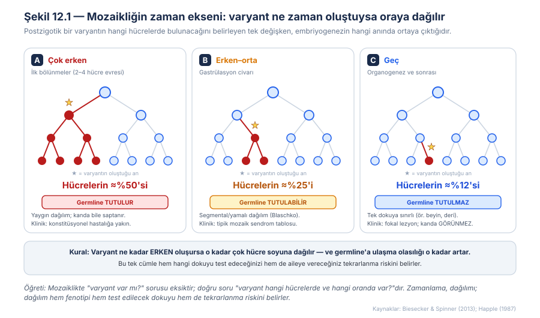
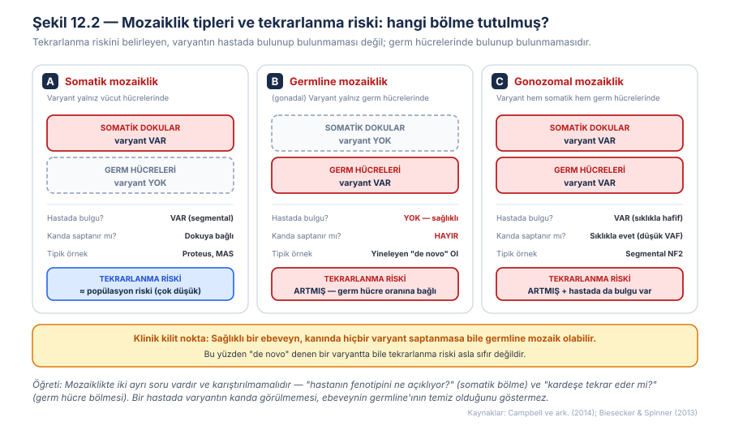
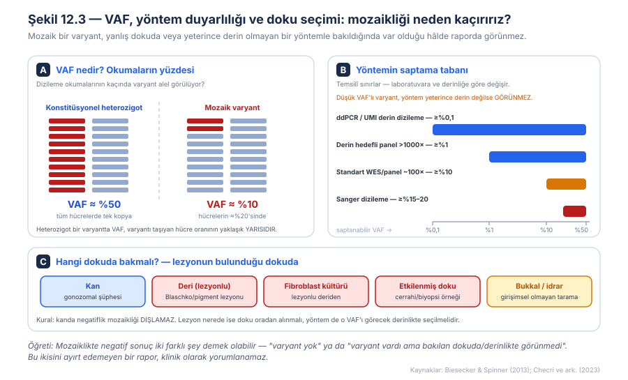
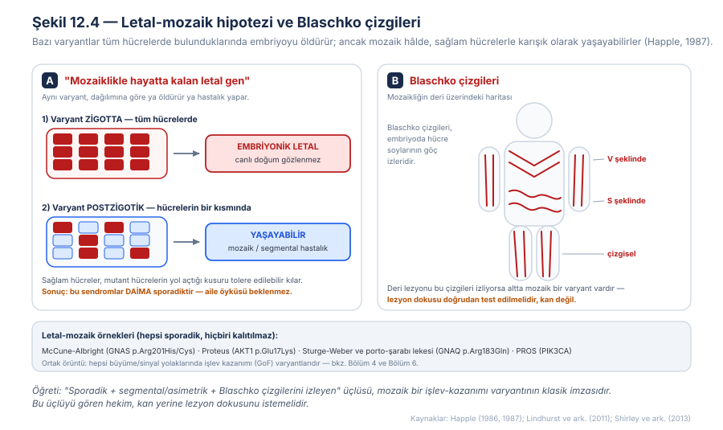
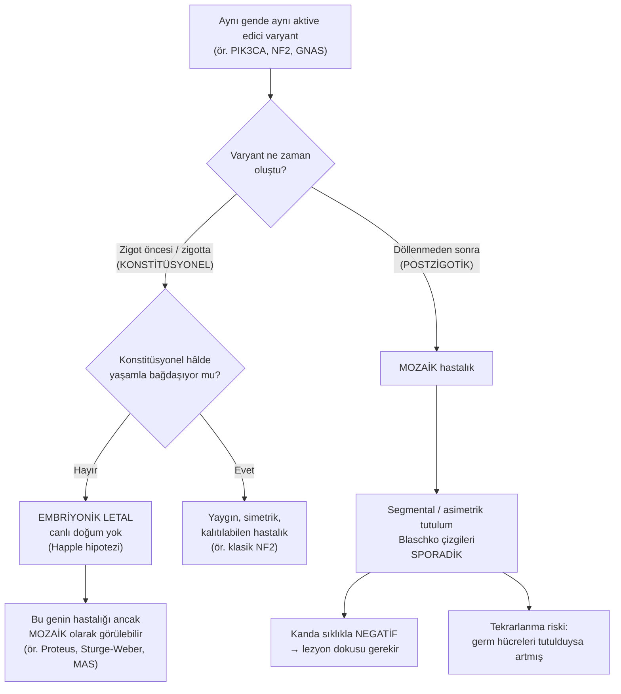
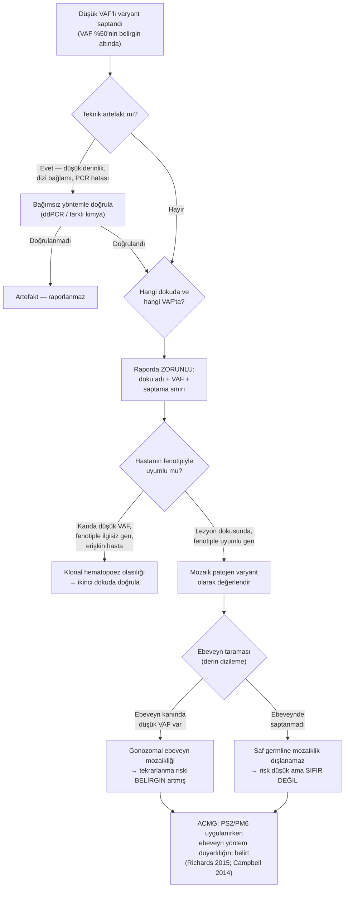
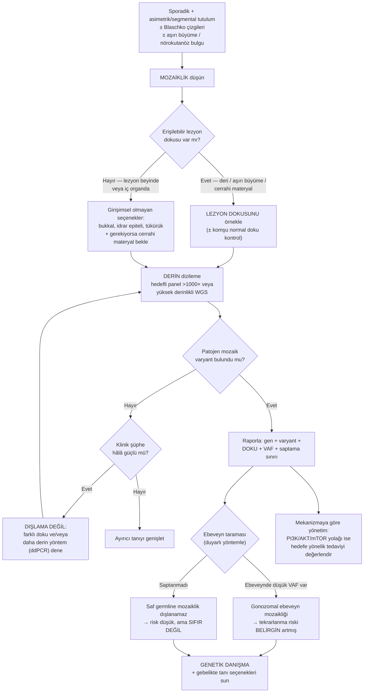

# Bölüm 12 — Mozaiklik: Postzigotik Varyantlar, VAF ve Tekrarlanma Riski

> **Bölümün çekirdek tezi:** Tıbbi genetiğin en sessiz varsayımı, bir kişinin tek bir genomu olduğu ve bu genomun her hücresinde aynı bulunduğudur. **Mozaiklik** bu varsayımı yıkar: döllenmeden *sonra* ortaya çıkan bir varyant, yalnızca kendi soyundan gelen hücrelerde bulunur. Buradan bu bölümün bütün mantığı türer — varyantın **ne zaman** oluştuğu **nerede** bulunacağını belirler; nerede bulunduğu ise aynı anda üç şeyi birden belirler: **fenotipi** (hangi doku etkilenmiş), **hangi dokunun test edileceğini** (kan çoğu zaman yanlış dokudur) ve **tekrarlanma riskini** (germ hücreleri tutulmuş mu?). Mozaiklik, Bölüm 11'deki heteroplazminin nükleer kardeşidir: ikisinde de varyant "var/yok" değil **yüzde** olarak taşınır, ikisinde de doku seçimi tanının kendisidir. Fark şudur: heteroplazmi organel genomundadır ve maternal kalıtılır; mozaiklik nükleer genomdadır ve postzigotiktir.

> **Bu bölüm nasıl okunmalı?** Tıp öğrencileri için doğrusal okuma önerilir; zaman ekseni sezgisi (Şekil 12.1) kurulmadan tekrarlanma riski tabloları ezber kalır. Klinisyenler için "Klinik fenotipe dönüşüm → Tanısal testler → Karar algoritması" hattı önceliklidir. Genetik danışmanlık yapanlar için 2.2 ve Şekil 12.2 bu bölümün en kritik iki sayfasıdır. Varyant yorumlayanlar için 6. başlık (mozaik varyantta de novo kriterleri ve VAF raporlaması) bağımsız kullanılabilir.

> 🖼️ **Görseller hakkında not:** Şekil 12.1–12.4 `assets/` klasöründe SVG olarak bulunur. Mermaid diyagramları metin içine gömülüdür.

---

## Öğrenme hedefleri

Bu bölümü tamamlayan okuyucu:
1. Mozaikliği "tek bireyde, tek zigottan köken alan genetik olarak farklı ≥2 hücre popülasyonu" olarak tanımlar ve kimerizmden ayırır.
2. Postzigotik varyantın oluşum zamanı ile dokusal dağılımı arasındaki ilişkiyi açıklar.
3. Somatik, germline (gonadal) ve gonozomal mozaikliği ayırt eder ve her birinin tekrarlanma riskine etkisini yorumlar.
4. Varyant alel fraksiyonunu (VAF) tanımlar, hücre oranıyla ilişkisini kurar ve bu ilişkinin bozulduğu durumları sayar.
5. Yöntem duyarlılığı (Sanger, WES, derin panel, ddPCR) ile saptanabilir VAF arasındaki bağı kurar ve uygun testi seçer.
6. Mozaiklik şüphesinde doğru dokuyu gerekçelendirerek seçer ve negatif sonucun neden tanıyı dışlamadığını açıklar.
7. Letal-mozaik hipotezini (Happle) açıklar ve bu sendromların neden daima sporadik olduğunu gerekçelendirir.
8. Aynı gendeki varyantın konstitüsyonel ve mozaik hâllerinin neden farklı hastalıklar ürettiğini örneklerle açıklar.
9. Mozaik varyantların ACMG/ClinGen çerçevesinde yorumlanmasında de novo kriterlerinin (PS2/PM6) ve VAF raporlamasının nasıl ele alınması gerektiğini açıklar.

---

## 1. Kavramsal tanım

Bu kitabın önceki on bir bölümü boyunca, bir varyantı tarif ederken hep örtük bir kabulden yola çıktık: varyant **konstitüsyoneldir**, yani zigottan itibaren bireyin bütün hücrelerinde bulunur. Bu kabul, bir tüp kandan yapılan testin bütün vücut hakkında bilgi verdiğini varsaymamızı sağlar — ve klinik genetiğin gündelik pratiği büyük ölçüde bu varsayım üzerine kuruludur. **Mozaiklik**, bu varsayımın geçerli olmadığı durumun adıdır.

Tanım basittir: **mozaiklik, tek bir zigottan köken almış olmasına rağmen genetik olarak birbirinden farklı iki veya daha fazla hücre popülasyonunun aynı bireyde bulunmasıdır.** Buradaki "tek zigottan" ifadesi kritiktir, çünkü mozaikliği **kimerizmden** ayıran şey budur; kimerizmde farklı hücre popülasyonları *farklı* zigotlardan gelir (ör. ikiz-ikiz kan alışverişi, kemik iliği nakli sonrası). Mozaiklikte ise tek bir başlangıç vardır ve farklılık sonradan, **postzigotik** bir olayla ortaya çıkar (Biesecker ve Spinner, 2013).

Bu "sonradan" sözcüğü bölümün anahtarıdır. Döllenmeden sonraki herhangi bir hücre bölünmesinde bir DNA replikasyon hatası oluşabilir; o andan itibaren varyant, yalnızca o hücrenin soyundan gelen hücrelerde bulunur. Dolayısıyla varyantın vücuttaki dağılımı, tümüyle **ne zaman ortaya çıktığına** bağlıdır. İlk bölünmelerde oluşan bir varyant, embriyonun neredeyse yarısını oluşturan bir hücre kütlesine dağılır ve germ hücrelerine de ulaşma olasılığı yüksektir. Organogenez sırasında oluşan bir varyant ise yalnızca tek bir organ veya deri segmentiyle sınırlı kalır. Şekil 12.1 bu ilişkiyi doğrudan gösterir: zaman ekseninde ne kadar geriye gidersek, dağılım o kadar geniştir.

Dağılımın nereye ulaştığı, mozaikliğin klinik sınıflandırmasını doğrudan verir. Varyant yalnızca vücut (soma) hücrelerinde bulunuyorsa buna **somatik mozaiklik** denir; hasta etkilenmiştir ama varyantı çocuklarına aktarmaz. Varyant yalnızca germ hücrelerinde bulunuyorsa buna **germline (gonadal) mozaiklik** denir; bu durumda birey tümüyle **sağlıklıdır** ve hiçbir bulgusu yoktur, ama etkilenmiş çocuk sahibi olabilir — ve bu, klinik genetikte en çok gözden kaçan senaryodur. Her iki bölme de tutulmuşsa buna **gonozomal (germline + somatik) mozaiklik** denir; hastada hem bulgu vardır hem de aktarma riski taşır.

Mozaikliğin ölçüsü, moleküler laboratuvarda **varyant alel fraksiyonu (VAF, variant allele fraction)** olarak raporlanır: dizileme okumalarının yüzde kaçında varyant alelin görüldüğü. Konstitüsyonel heterozigot bir varyantta VAF beklenen olarak %50 civarındadır, çünkü her hücrede iki alelden biri varyanttır. Mozaik bir varyantta ise VAF bunun altındadır — ve kritik biçimde, VAF **varyantı taşıyan hücre oranının yaklaşık yarısıdır**, çünkü taşıyan hücrelerin de yalnızca bir aleli varyanttır. Yani %10 VAF, kabaca hücrelerin %20'sinin varyantı taşıdığı anlamına gelir. Bu basit çarpan, raporları okurken sürekli hatırlanması gereken bir düzeltmedir.

Son olarak iki özel kavram, tabloyu tamamlar. **Letal-mozaik hipotezi**, bazı varyantların konstitüsyonel hâlde embriyoyu öldürdüğünü, ancak mozaik hâlde — sağlam hücrelerle karışık olarak — yaşayabildiğini öne sürer (Happle, 1987); bu hipotez, bir grup sendromun neden istisnasız sporadik olduğunu açıklar. **Revertant mozaiklik** ise ters yöndeki olaydır: konstitüsyonel olarak hastalıklı bir bireyde, bazı hücrelerde ikinci bir olay varyantı düzelterek sağlıklı hücre klonları oluşturur.

> **🧠 Kavram karışıklığı uyarısı — "fonksiyonel mozaiklik":** Kadınlarda X-kromozomu inaktivasyonu sonucu hücrelerin bir kısmında maternal, bir kısmında paternal X'in aktif olması da bazen "mozaiklik" olarak adlandırılır. Ancak bu bir **DNA dizisi farkı değildir**; her hücre aynı iki X'i taşır, yalnızca hangisinin okunduğu farklıdır. Bu bölümün konusu olan mozaiklik ise gerçek bir **dizi/kopya sayısı farkıdır**. İkisini ayırmak için ilkine "fonksiyonel mozaiklik", ikincisine "genetik mozaiklik" demek yerinde olur.

**Tablo 12.1 — Mozaikliğin temel kavramları**

| Kavram | Tanım | Klinik anlamı |
|---|---|---|
| Mozaiklik | Tek zigottan köken alan, genetik olarak farklı ≥2 hücre popülasyonu | Kan tüm vücudu temsil etmeyebilir |
| Kimerizm | *Farklı* zigotlardan gelen hücre popülasyonları | Nakil/ikiz öyküsü sorgulanır; mozaiklikten ayrılır |
| Postzigotik varyant | Döllenmeden sonra oluşan varyant | Dağılım, oluşum zamanına bağlıdır |
| Somatik mozaiklik | Varyant yalnız vücut hücrelerinde | Hastada bulgu var; aktarım riski ≈ popülasyon riski |
| Germline (gonadal) mozaiklik | Varyant yalnız germ hücrelerinde | **Ebeveyn sağlıklıdır**, ama tekrarlanma riski artmıştır |
| Gonozomal mozaiklik | Varyant hem somatik hem germ hücrelerinde | Hem bulgu hem artmış aktarım riski |
| VAF (varyant alel fraksiyonu) | Varyant aleli taşıyan okuma yüzdesi | Mozaikliğin niceliksel ölçüsü; ≈ taşıyan hücre oranının yarısı |
| Letal-mozaik | Konstitüsyonel hâlde letal, mozaik hâlde yaşanabilir varyant | Bu sendromlar **daima** sporadiktir |
| Revertant mozaiklik | Varyantın bir hücre klonunda kendiliğinden düzelmesi | "Sağlıklı yamalar"; doğal gen düzeltmesi |

---

## 2. Moleküler mekanizma

### 2.1 Zamanlama dağılımı, dağılım her şeyi belirler

Postzigotik varyantlar, konstitüsyonel varyantlardan farklı bir mekanizmayla oluşmaz; aynı replikasyon hataları, aynı onarım kusurları söz konusudur. Fark tümüyle **zamanlamadadır** ve bu zamanlamanın sonuçları katlanarak büyür, çünkü embriyogenez bir ağaç yapısıdır: erken bir dalda oluşan değişiklik, o daldan çıkan bütün yapraklara taşınır.

Şekil 12.1'deki üç senaryo bu ağacı somutlaştırır. İki hücreli evrede oluşan bir varyant, hücrelerin yaklaşık yarısına dağılır; kan dâhil hemen her dokuda saptanabilir ve germ hücrelerine ulaşması neredeyse kaçınılmazdır. Böyle bir birey klinik olarak konstitüsyonel bir hastaya çok benzer ve laboratuvarda ancak beklenenden düşük bir VAF ile fark edilir. Gastrülasyon civarında oluşan bir varyant, embriyonik tabakaların bir bölümüne dağılır; sonuç, tipik **segmental veya yamalı** bir tutulumdur ve germ hücrelerinin tutulup tutulmadığı belirsizdir. Organogenez veya sonrasında oluşan bir varyant ise tek bir organa ya da tek bir deri segmentine sınırlı kalır; kanda **hiç görünmez** ve germ hücreleri tutulmaz.

Bu üçlüden çıkan pratik kural, bölümün en çok kullanılacak cümlesidir: **varyant ne kadar erken oluşursa o kadar çok hücre soyuna dağılır ve germline'a ulaşma olasılığı o kadar artar.** Klinikte bu kural iki yönde birden çalışır. İleri yönde: erken bir mozaik varyant beklediğinizden daha yaygın tutulum yapar. Geri yönde — ve tanısal olarak daha yararlı biçimde: yaygın tutulumlu bir hastada varyantı kanda bulma şansınız yüksekken, tek bir deri lezyonuyla sınırlı bir tabloda kan **kesinlikle** yanlış dokudur.

### 2.2 Hangi bölme tutuldu? Tekrarlanma riskinin tek belirleyicisi

Klinik genetikte mozaikliğin en önemli sonucu, tekrarlanma riskini yeniden tanımlamasıdır. Burada birbirine sürekli karıştırılan iki ayrı soru vardır ve bunları ayırmak zorunludur: *"Hastanın fenotipini ne açıklıyor?"* sorusunun cevabı **somatik bölmededir**; *"Kardeşinde tekrar eder mi?"* sorusunun cevabı ise **germ hücresi bölmesindedir**. Şekil 12.2, bu iki bölmenin dört olası kombinasyonundan klinikte anlamlı olan üçünü karşılaştırır.

**Saf somatik mozaiklikte** varyant germ hücrelerine hiç ulaşmamıştır. Hastada bulgu vardır — çoğu zaman segmental, asimetrik bir tutulum — ama çocuklarına aktarma riski pratik olarak popülasyon riskine eşittir. Proteus sendromu ve McCune-Albright sendromu bu grubun ders kitabı örnekleridir; bu tabloların hiçbirinde ailesel geçiş bildirilmemiştir.

**Germline (gonadal) mozaiklik**, klinik olarak en tehlikeli olanıdır, çünkü **görünmezdir**. Varyant yalnızca germ hücrelerinde bulunduğu için ebeveyn tümüyle sağlıklıdır, kanında varyant saptanmaz ve standart ebeveyn testi "negatif" çıkar. Buna dayanarak çocuktaki varyant "de novo" olarak sınıflandırılır ve aileye çok düşük bir tekrarlanma riski bildirilir. Oysa ebeveynin germ hücrelerinin bir kısmı varyantı taşıyorsa, sonraki gebeliklerde aynı varyant yeniden aktarılabilir. Osteogenesis imperfecta, Duchenne kas distrofisi ve Dravet sendromu gibi tablolarda, "de novo" kabul edilen bir varyantın ikinci bir kardeşte yinelemesi klasik olarak bu mekanizmayla açıklanır.

**Gonozomal mozaiklikte** ise varyant hem somatik hem germ hücrelerindedir. Bu bireyler tipik olarak hastalığın **hafif veya segmental** bir formunu taşır — çünkü hücrelerinin yalnızca bir kısmı varyantlıdır — ama çocuklarına konstitüsyonel (dolayısıyla tam ve ağır) formu aktarabilirler. Segmental nörofibromatozis bunun klasik örneğidir: yalnızca bir vücut segmentinde bulgu veren bir ebeveyn, tam yaygın hastalıkla doğan bir çocuğa sahip olabilir.

> **🔬 Deep-dive — "De novo" ne kadar de novo? Ebeveyn mozaikliğinin gerçek sıklığı:** Ebeveyn mozaikliğinin klinikte ne sıklıkta gözden kaçtığını doğrudan ölçen bir çalışma, klinik analizde de novo olarak sınıflandırılmış nadir delesyon CNV'leri taşıyan 100 aileyi, bireye özgü kırılma noktası PCR'ı gibi standart yöntemlerden çok daha duyarlı bir teknikle ileriye dönük olarak taramıştır. Sonuç dikkat çekicidir: bu ailelerin **dördünde**, aktarılan CNV için ebeveyn kanında düşük düzeyli somatik mozaiklik saptanmıştır (Campbell ve ark., 2014). Yazarların geliştirdiği gametogenez modeli, kanda saptanabilen bir mozaikliğin — germline ile sınırlı bir mozaikliğe kıyasla — tekrarlanma riskini belirgin biçimde daha çok yükselttiğini öngörür; ayrıca gametogenezdeki cinsiyet farklılıkları nedeniyle **somatik mozaik taşıyıcı annelerin** oransal olarak daha sık olabileceğini ve bunun bazı beklenmedik X'e bağlı resesif yinelemeleri açıklayabileceğini ileri sürer. Klinik çıkarım nettir: standart yöntemle "ebeveynlerde saptanmadı" ifadesi, mozaikliğin yokluğunu değil, yalnızca **kullanılan yöntemin sınırının altında kaldığını** gösterir. Bu yüzden tekrarlanma riski danışmanlığında "de novo" olgular için bile sıfır risk verilmez; artmış ama tam olarak sayılamayan bir risk bildirilir ve gebelikte tanı seçenekleri sunulur.

### 2.3 VAF: mozaikliğin sayısı ve tuzakları

Mozaikliğin niceliksel dili VAF'tır. Şekil 12.3A'da gösterildiği gibi, konstitüsyonel bir heterozigotta okumaların yaklaşık yarısı varyant alel taşırken, mozaik bir varyantta bu oran çok daha düşüktür. Buradan iki pratik sonuç çıkar.

Birincisi, **VAF ile yöntem duyarlılığı arasındaki bağdır.** Bir yöntem, ancak kendi saptama tabanının üstündeki VAF'ları görebilir. Sanger dizileme kabaca %15–20'nin altındaki mozaikliği güvenilir biçimde göstermez; standart derinlikte bir WES veya panel yaklaşık %10 civarına iner; derin hedefli paneller %1 düzeyine, ddPCR veya benzersiz moleküler etiket (UMI) tabanlı yaklaşımlar ise %0,1 düzeyine kadar duyarlıdır (temsilî sınırlar; laboratuvara ve okuma derinliğine göre değişir). Bunun anlamı şudur: **düşük VAF'lı bir mozaik varyant, yanlış yöntemle bakıldığında var olduğu hâlde raporda görünmez.** Mozaiklik şüphesi varken standart bir teste güvenmek, mikroskobun büyütmesini artırmadan küçük bir yapıyı aramaya benzer.

İkincisi, **VAF'ın hücre oranına çevrilmesindeki incelik**tir. Heterozigot bir nokta varyantı için VAF, taşıyan hücre oranının yaklaşık yarısıdır. Ancak bu basit çarpan her durumda geçerli değildir ve bu, raporları yanlış okumanın sık bir kaynağıdır.

> **🔬 Deep-dive — VAF ne zaman hücre oranının yarısı DEĞİLDİR?** Dört durumda bu dönüşüm bozulur ve her biri klinikte karşımıza çıkar. **(1) Kopya sayısı değişimleri:** Mozaik bir delesyonda varyant "alel" kaybolmuş durumdadır; VAF yerine kopya sayısı oranı (veya alel dengesi) değerlendirilir ve yarıya bölme mantığı geçerli değildir. **(2) X kromozomu ve hemizigotluk:** Erkekte X'teki bir varyant hemizigottur; taşıyan hücrede tek alel vardır ve o alel varyanttır, dolayısıyla VAF doğrudan hücre oranına eşittir — yarıya bölmek yanlış olur. **(3) Homozigot veya bileşik heterozigot bağlam:** İkinci vuruşun eklendiği hücrelerde alel dengesi değişir. **(4) Örnek saflığı:** Bir doku örneği asla tek tip hücreden oluşmaz; lezyonlu deriden alınan bir biyopside lezyon hücreleri örneğin yalnızca %30'unu oluşturuyorsa, ölçülen VAF gerçek klonal yükü olduğundan çok daha düşük gösterir. Bu son madde, cerrahi örneklerde patologla birlikte "lezyon-zengin" bölge seçmenin neden tanısal başarıyı artırdığını açıklar.

Üçüncü ve en sık atlanan konu **doku seçimidir**. Mozaiklikte kan, sıklıkla yanlış dokudur — çünkü kan hücreleri mezodermal bir soydan gelir ve deri, beyin veya iskelet gibi başka soylarda oluşmuş geç bir varyantı hiç taşımaz. Şekil 12.3C'deki basit kural şudur: **lezyon neredeyse doku oradan alınmalıdır.** Blaschko çizgilerini izleyen bir deri lezyonunda lezyonlu deri biyopsisi (veya lezyonlu deriden fibroblast kültürü), aşırı büyüme gösteren bir dokuda cerrahi örnek, beyin lezyonunda ise rezeksiyon materyali doğru örnektir. Bukkal sürüntü ve idrar epiteli, girişimsel olmayan tarama seçenekleri olarak kandan sıklıkla daha bilgilendiricidir.

### 2.4 Letal-mozaik hipotezi: neden bu sendromlar hiç kalıtılmaz?

Klinik genetikte uzun süre açıklanamayan bir gözlem vardı: McCune-Albright, Proteus, Sturge-Weber, Klippel-Trenaunay gibi belirgin ve tekrarlayan klinik tablolar tanımlanmıştı, ama bu sendromların **hiçbirinde** ailesel geçiş gösterilemiyordu. Hepsi sporadikti, hepsinde tutulum asimetrik ve segmentaldi, ve pek çoğunda deri lezyonları **Blaschko çizgilerini** izliyordu.

Happle, bu örüntüyü tek bir hipotezle açıkladı: bu hastalıklara yol açan varyantlar, **konstitüsyonel hâlde embriyo için letaldir**. Zigotta bulundukları takdirde embriyo erken dönemde kaybedilir ve canlı doğum gerçekleşmez. Bu varyantlar ancak **postzigotik olarak, mozaik hâlde** — yani normal hücrelerle iç içe — ortaya çıktıklarında yaşamla bağdaşır (Happle, 1987). McCune-Albright sendromundaki pigmentasyonun Blaschko çizgilerini izlemesi, bu hipotezin ilk somut dayanaklarından biri olmuştur (Happle, 1986). Şekil 12.4 bu mantığı ve Blaschko çizgilerinin ne anlama geldiğini birlikte gösterir.

Bu hipotez, sonraki yıllarda moleküler olarak **doğrulanmıştır**: Proteus sendromunun *AKT1*'deki, Sturge-Weber sendromunun *GNAQ*'daki, McCune-Albright sendromunun *GNAS*'taki mozaik varyantlarla oluştuğu gösterildiğinde, bunların hepsinin somatik olduğu ve hiçbirinin konstitüsyonel formunun bildirilmediği görülmüştür. Buradaki ortak örüntü ayrıca öğreticidir: bu varyantların neredeyse tamamı büyüme ve sinyal yolaklarında **işlev kazanımı (GoF)** varyantlarıdır (Bölüm 4). Konstitüsyonel bir GoF varyantının bütün hücrelerde sürekli sinyal üretmesi gelişimle bağdaşmazken, aynı varyantın hücrelerin bir kısmında bulunması yalnızca o bölgede aşırı büyümeye yol açar.

**Blaschko çizgileri**, bu mozaikliğin deri üzerindeki görünür haritasıdır. Bu çizgiler ne sinir dağılımını ne damar dağılımını ne de dermatomları izler; embriyogenez sırasında deri hücre soylarının **göç yollarını** yansıtırlar. Sırtta V, gövde yanlarında S, ekstremitelerde çizgisel bir örüntü oluştururlar. Klinik değeri doğrudandır: bir deri lezyonu bu çizgileri izliyorsa, altta neredeyse kesinlikle mozaik bir varyant vardır ve test için kan değil, **lezyonlu deri** istenmelidir.

> **🔬 Deep-dive — Revertant mozaiklik: doğanın kendi gen tedavisi.** Mozaiklik her zaman hastalık üretmez; bazen tam tersini yapar. Konstitüsyonel olarak patojen bir varyant taşıyan bir bireyde, tek bir somatik hücrede ikinci bir olay — geri mutasyon, mitotik rekombinasyon, ikinci-site düzeltici bir değişiklik veya ilgili bölgeyi kurtaran bir mekanizma — varyantın etkisini ortadan kaldırabilir. O hücre ve soyundan gelenler **işlevsel olarak normaldir**; eğer bu klon seçici bir avantaja sahipse zamanla genişler. Klinik karşılığı en çarpıcı biçimde bazı epidermolizis bülloza formlarında görülür: hastanın yaygın kırılgan derisi üzerinde, kabarcık oluşturmayan sağlıklı deri "yamaları" belirir. Benzer olaylar bazı kemik iliği yetmezliği sendromlarında ve immün yetmezliklerde de bildirilmiştir ve bu durumlarda revertant klon hematolojik tabloyu beklenenden hafif kılabilir. Tanısal açıdan bunun bir tuzağı vardır: revertant bir dokudan alınan örnek, gerçekte var olan patojen varyantı göstermeyebilir. ⚠️ Revertant mozaikliğin sıklığı hastalıktan hastalığa büyük değişkenlik gösterir ve çoğu için sistematik sıklık verisi sınırlıdır.

---

## 3. Varyant tipleri

Mozaiklik bir varyant *tipi* değil, varyantın **dağılım biçimidir**; bu nedenle önceki bölümlerde gördüğümüz hemen her lezyon tipi mozaik olarak karşımıza çıkabilir. Aşağıdaki tablo, klinikte ayrı ayrı ele alınması gereken mozaik lezyon kategorilerini toplar.

**Tablo 12.2 — Mozaik lezyon tipleri ve saptanma yolları**

| Mozaik lezyon tipi | Tipik mekanizma | Nasıl saptanır | Klinik örnek / not |
|---|---|---|---|
| Mozaik nokta varyantı (SNV) | Postzigotik replikasyon hatası; sıklıkla GoF | Derin hedefli panel, ddPCR; lezyon dokusunda | *AKT1*, *GNAQ*, *GNAS*, *PIK3CA* |
| Mozaik indel | Postzigotik replikasyon/onarım hatası | Derin dizileme (VAF raporlanmalı) | Değişken |
| Mozaik CNV (del/dup) | Postzigotik yanlış eşleşme/rekombinasyon | Array (mozaiklik sınırı ~%20), derin WGS | Ebeveynde düşük düzeyli CNV mozaikliği |
| Mozaik anöploidi | Postzigotik ayrılamama (mitotik) | Karyotip (çok hücre sayımı), array, FISH | Pallister-Killian (mozaik tetrazomi 12p) |
| Segmental/mozaik UPD | Postzigotik mitotik rekombinasyon | SNP array (LOH paterni), metilasyon | **Bölüm 10 köprüsü:** BWS'de mozaik patUPD11 |
| İkinci vuruş (somatik) | Germline heterozigotluk + somatik ikinci olay | Lezyon dokusunda dizileme | FCD tip II; tümör baskılayıcı genler |
| Revertant mozaiklik | Patojen varyantın somatik düzelmesi | Sağlıklı doku klonunda dizileme | Epidermolizis bülloza "sağlıklı yamalar" |
| Klonal hematopoez | Yaşla ilişkili kan kökenli klon genişlemesi | Kanda düşük VAF'lı somatik varyant | **Yorum tuzağı** — hastalıkla ilgisiz olabilir |

Tablonun okunma biçimi şudur. İlk iki satır standart dizi varyantlarıdır ve tek sorun **duyarlılıktır**. Üçüncü ve dördüncü satırlar kopya sayısı/kromozom düzeyindedir; burada VAF mantığı geçerli değildir ve mozaiklik oranı farklı biçimde (hücre sayımı, alel dengesi) hesaplanır — ayrıca klasik karyotipte mozaikliği dışlamak için **yeterli sayıda hücre sayılmış olması** gerekir. Beşinci satır, Bölüm 10'daki uniparental dizomiyle doğrudan köprü kurar: mitotik rekombinasyonla oluşan segmental UPD tipik olarak mozaiktir ve Beckwith-Wiedemann sendromunun paternal UPD11 alt tipinde bu mozaiklik kuraldır. Son satır ise bir yorum tuzağıdır ve 6. başlıkta ayrıca ele alınacaktır.

---

## 4. Klinik fenotipe dönüşüm

### 4.1 Neden asimetrik ve segmental?

Mozaik hastalıkların klinik imzası **asimetridir**. Konstitüsyonel bir hastalıkta tutulum genellikle iki taraflı ve kabaca simetriktir, çünkü varyant her hücrededir. Mozaiklikte ise varyant yalnızca belirli hücre soylarındadır; sonuç, vücudun bir yarısında, tek bir ekstremitede veya deri üzerinde bir "yama"da yoğunlaşan tutulumdur. Aşırı büyüme sendromlarında bu, tek bir parmağın veya tek bir ekstremitenin orantısız büyümesi olarak; nörokutanöz sendromlarda tek taraflı bir porto-şarabı lekesi ve altında aynı taraf leptomeningeal tutulum olarak karşımıza çıkar.

Bu asimetriye üç ek özellik eşlik eder ve dördü birlikte güçlü bir klinik örüntü oluşturur: tutulumun **keskin orta hat sınırı** göstermesi, deri bulgularının **Blaschko çizgilerini** izlemesi ve tablonun **sporadik** olması (aile öyküsü yok). Klinisyen için pratik kural şudur: *sporadik + asimetrik/segmental + Blaschko örüntüsü* üçlüsü görüldüğünde, ayırıcı tanının başında mozaiklik yer almalıdır.

### 4.2 Aynı gen, iki farklı hastalık: konstitüsyonel mü, mozaik mi?

Mozaikliğin en öğretici yanı, aynı gendeki varyantın konstitüsyonel ve mozaik hâllerinin çoğu zaman **birbirinden tümüyle farklı hastalıklar** üretmesidir. Bu, Bölüm 15'te ele alınacak allelik seri kavramının bir başka boyutudur; ama buradaki değişken alelin kendisi değil, **dağılımıdır**.

*PIK3CA* bunun en zengin örneğidir. Bu gendeki aktive edici varyantlar, mozaik olarak ortaya çıktıklarında bir dizi segmental aşırı büyüme tablosuna yol açar; bu tabloların hepsi 2014'teki bir NIH uzlaşı toplantısında **PIK3CA ile ilişkili aşırı büyüme spektrumu (PROS)** başlığı altında toplanmıştır. Bu şemsiye terim, daha önce ayrı sendromlar olarak adlandırılan makrodaktili, fibroadipöz aşırı büyüme, CLOVES sendromu, hemihiperplazi-multipl lipomatozis ve megalensefali ile giden MCAP/DMEG tablolarını kapsar (Keppler-Noreuil ve ark., 2015). Bu klinik çeşitliliğin kaynağı tek bir şeydir: varyantın hangi dokularda ve hangi oranda bulunduğu.

Aynı mantık *NF2* için de geçerlidir. Konstitüsyonel bir *NF2* varyantı klasik, yaygın ve iki taraflı vestibüler schwannomlarla giden nörofibromatozis tip 2 yapar. Aynı varyant postzigotik oluştuğunda ise **segmental (mozaik) NF2** ortaya çıkar: bulgular tek bir vücut bölgesiyle sınırlıdır, başlangıç yaşı daha geçtir, seyir daha hafiftir — ama kanda varyant sıklıkla saptanamaz ve bu hastalar yıllarca tanısız kalabilir.

**Algoritma 12.1 — Aynı varyantın germline ve mozaik hâlleri**

### 4.3 Beyne sınırlı mozaiklik: kanda hiç görünmeyen hastalık

Mozaikliğin doku seçimi sorununu en uç noktaya taşıyan alan, **beyne sınırlı (brain-restricted) mozaikliktir**. Dirençli fokal epilepsili çocuklarda sık bir neden olan **fokal kortikal displazi (FCD) tip II**, mTOR sinyal yolağı genlerindeki somatik varyantlarla ilişkilendirilmiştir. Bu varyantlar embriyonik kortikogenez sırasında oluşur ve yalnızca etkilenen kortikal bölgenin hücrelerinde bulunur; kanda, tükürükte, deride — hiçbir erişilebilir dokuda yoktur (Lee ve ark., 2022).

Bu, klinik olarak rahatsız edici bir sonuca yol açar: genetik nedeni kesin olarak bilinen bir hastalıkta, hastanın kanından yapılan hiçbir test tanı koyduramaz. Moleküler tanı ancak epilepsi cerrahisi sırasında çıkarılan doku üzerinde çalışılarak konulabilir — yani ancak hasta zaten ameliyat olmuşsa. Bu kısıtı aşmaya yönelik yaratıcı yaklaşımlar geliştirilmektedir; örneğin cerrahi öncesi değerlendirmede kullanılan **stereo-EEG elektrotlarına** yapışan eser miktardaki doku üzerinden somatik varyant saptanabildiği gösterilmiş, üç çocuk hastada rezeke edilen dokuda bulunan düşük düzeyli mozaik varyantlar, epileptojenik bölgede veya displazi sınırında yer alan 33 elektrottan 4'ünde de yakalanmıştır (Checri ve ark., 2023). Bu bulgu, mutasyon yükü ile epileptik aktivite arasındaki bağı desteklemekte ve gelecekte cerrahi öncesi moleküler tanı olanağına işaret etmektedir.

> **🔬 Deep-dive — İki vuruş + mozaiklik: germline ve somatik olayın buluşması.** FCD tip II'nin genetiği, mozaikliğin tek başına değil, **germline zeminle birlikte** çalışabildiğini gösterir. Tabloların bir bölümünde mTOR yolağını doğrudan aktive eden varyantlar (kazanç yönünde) tek başına somatiktir. Ancak bir başka bölümünde mekanizma iki aşamalıdır: birey, yolağın baskılayıcı bir bileşeninde (ör. *DEPDC5* gibi GATOR1 kompleksi genlerinde) **germline heterozigot** bir işlev kaybı varyantı taşır; bu tek başına yeterli değildir. Beyinde, gelişim sırasında aynı genin diğer alelinde **somatik ikinci bir vuruş** meydana geldiğinde, o hücrelerde biallelik kayıp oluşur ve mTOR yolağı denetimsiz kalır (Lee ve ark., 2022). Sonuç, germline zeminden kaynaklanan bir yatkınlık üzerine binen fokal bir lezyondur. Bu modelin iki klinik yansıması vardır: birincisi, kanda saptanan bir germline varyant hastalığı **tek başına açıklamaz** ama ailesel risk taşır; ikincisi, tümör baskılayıcı genlerdeki klasik Knudson iki-vuruş mantığı (Bölüm 2) nöro-gelişimsel bir malformasyonda birebir işlemektedir. Mekanizma, mTOR inhibitörleriyle hedefe yönelik tedavi olasılığını da doğrudan gündeme getirir.

### 4.4 Ne zaman mozaiklikten şüphelenmeli?

Şüpheyi tetikleyen kırmızı bayraklar şunlardır: **asimetrik veya segmental** tutulum; deri bulgularının **Blaschko çizgilerini** izlemesi veya keskin orta hat sınırı göstermesi; klinik tablo tanınmış bir sendroma uyarken **aile öyküsünün tümüyle yokluğu**; hastalığın olağandışı biçimde **hafif veya sınırlı** bir formu; klinik tanı güçlüyken standart genetik testin **negatif** gelmesi; ve aynı ailede "de novo" kabul edilen bir varyantın **ikinci bir çocukta yinelemesi** (bu son madde ebeveyn germline mozaikliğine işaret eder).

---

## 5. Tanısal testlerle ilişkisi

Mozaiklikte test seçimi, önceki bölümlerdekinden farklı olarak **üç** soruyu birden yanıtlamak zorundadır: hangi **doku**, hangi **yöntem** (ve hangi derinlik), ve sonuç **nasıl raporlanacak** (VAF belirtilmeli). Bu üçünden biri eksikse test tanısal değildir.

**Tablo 12.3 — Mozaikliği hangi test yakalar?**

| Test | Bu mekanizmayı yakalar mı? | Sınırlılığı |
|------|----------------------------|-------------|
| **WES** | Kısmen. Standart derinlikte (~100×) yaklaşık ≥%10 VAF'ı görür | Düşük düzeyli mozaikliği kaçırır; doğru doku alınmamışsa tümüyle negatif çıkar |
| **Short-read WGS** | Kısmen–iyi. Genom geneli kapsar; derinlik artırılırsa duyarlılık yükselir | Standart 30× derinlikte düşük VAF için yetersiz; mozaik CNV için özel analiz gerekir |
| **Long-read WGS** | Evet, özellikle mozaik yapısal varyantlar ve karmaşık yeniden düzenlenmeler için | Maliyet; düşük VAF için yine yüksek derinlik gerekir |
| **Array-CGH / SNP array** | Mozaik CNV'yi kabaca **≥%20** düzeyinde yakalar; SNP array ayrıca **segmental UPD/LOH**'u gösterir | Düşük düzeyli mozaik CNV'yi kaçırır; dizi varyantını hiç görmez |
| **MLPA** | Sınırlı; doz oranındaki sapmayla yüksek düzeyli mozaik CNV sezilebilir | Nicel çözünürlüğü düşük; düşük mozaiklik için uygun değil |
| **RNA-seq** | Dolaylı. Alel dengesizliğini ve splice etkisini gösterebilir | Doku-spesifik; ifade edilmeyen alelde yanıltıcı; VAF ölçümü için uygun değil |
| **Methylation array** | Dolaylı. Mozaik imprinting bozukluklarında (ör. BWS) metilasyon oranında ara değerler | Dizi varyantını göstermez; ara değerler yorum gerektirir |
| **Karyotip** | Mozaik anöploidiyi yakalar — ancak **yeterli sayıda hücre** sayılmalıdır | Çözünürlük düşük; düşük oranlı mozaikliği dışlamak için yetersiz hücre sayımı sık hatadır |
| **(mozaiğe özgü) Derin hedefli panel / ddPCR / UMI** | **Evet — altın standart**; %1'e, gerekirse %0,1'e iner | Hedeflidir: hangi gene bakılacağını önceden bilmek gerekir |

> **Bu mekanizmayı hangi test yakalar? (özet):** Mozaiklik şüphesinde doğru sıra şudur — **doğru dokuyu** al (lezyon nerede ise oradan; kan çoğu zaman yanlıştır), **yeterince derin** bir yöntem seç (derin hedefli panel veya yüksek derinlikli WGS; aday gen belliyse ddPCR ile doğrula) ve raporda **VAF ile doku adının birlikte** belirtilmesini iste. Klinik tanı güçlü ve ilk test negatifse, bu bir dışlama değil, **yöntem/doku yetersizliği** olarak ele alınmalıdır.

> **🟦 Klinikte dikkat — Negatif raporun iki farklı anlamı vardır:** Mozaiklikte "varyant saptanmadı" ifadesi, ya gerçekten varyant olmadığını ya da varyantın bakılan dokuda/derinlikte görünmediğini gösterir. Bu iki olasılığı ayırt edemeyen bir rapor klinik olarak yorumlanamaz. Bu nedenle mozaiklik şüphesiyle gönderilen örneklerde rapordan üç şey talep edilmelidir: **örneklenen doku**, **ulaşılan okuma derinliği** ve **o derinlikte saptanabilen en düşük VAF**. Bu üçü olmadan negatif sonuç bilgi taşımaz.

---

## 6. Varyant yorumlama açısından önemi (ACMG/ClinGen)

Standart ACMG/AMP çerçevesi (Richards ve ark., 2015), varyantların konstitüsyonel olduğu varsayımı üzerine kuruludur ve mozaiklik bu çerçevenin birkaç kritik noktasını doğrudan etkiler.

En önemli etkilenen kriter **PS2/PM6**, yani de novo oluşum kanıtıdır. Bir varyantın çocukta bulunup her iki ebeveynde bulunmaması, güçlü bir patojenite kanıtı sayılır. Ancak "ebeveynde bulunmaması" ifadesi, gerçekte **"kullanılan yöntemin duyarlılığında ebeveyn kanında saptanmaması"** demektir. Ebeveyn düşük düzeyli somatik veya saf germline mozaik ise, standart Sanger doğrulaması bunu göremez. Bu nedenle de novo kanıtı uygulanırken ebeveyn örneklerinin hangi yöntemle ve hangi duyarlılıkta incelendiği kayda geçirilmeli; klinik olarak kritik durumlarda (özellikle yeni bir gebelik planlanıyorsa) ebeveyn örnekleri **derin dizileme** ile yeniden değerlendirilmelidir (Campbell ve ark., 2014).

İkinci olarak **VAF'ın raporlanması bir zorunluluk hâline gelir.** Konstitüsyonel bir raporda "heterozigot" demek yeterlidir; mozaik bir raporda ise varyantın klinik anlamı doğrudan yüzdeye ve dokuya bağlıdır. Bu, Bölüm 11'de heteroplazmi için kurduğumuz kuralın birebir aynısıdır: **doku adı olmadan yüzde, yüzde olmadan doku adı anlamsızdır.**

Üçüncüsü, **popülasyon frekansı kriterlerinin (PM2/BA1) dikkatli kullanılmasıdır.** Somatik varyantlar germline popülasyon veri tabanlarında (gnomAD gibi) bulunmaz; bu yokluk, patojenite yönünde otomatik bir kanıt olarak fazla ağırlıklandırılmamalıdır. Buna karşılık aynı varyantın somatik kanser veri tabanlarında sık bir "hotspot" olarak görülmesi, mekanizma açısından güçlü bir destekleyici bilgidir — *AKT1* p.Glu17Lys, *GNAQ* p.Arg183Gln ve *PIK3CA* hotspot varyantları bunun tipik örnekleridir.

Dördüncüsü ve ters yöndeki tuzak, **klonal hematopoezdir.** Yaş ilerledikçe, kan kök hücrelerinde biriken somatik varyantlar taşıyan klonlar genişleyebilir. Erişkin bir bireyin kanında düşük VAF'lı bir somatik varyant saptanması, bu varyantın hastanın klinik tablosuyla ilgili olduğu anlamına gelmez; özellikle *DNMT3A*, *TET2*, *ASXL1* gibi genlerdeki düşük düzeyli bulgular yaşla ilişkili klonal hematopoezin işareti olabilir. Bu nedenle kanda saptanan düşük VAF'lı bir varyantın hastalıkla ilişkisi, klinik tabloyla ve mümkünse **ikinci bir dokuyla** doğrulanmadan kurulmamalıdır.

> **🟦 Klinikte dikkat — Ebeveyn taraması yalnızca hasta için değil, aile için yapılır:** Çocukta de novo kabul edilen bir varyant bulunduğunda, ebeveyn örneklerinin duyarlı yöntemle taranması iki nedenle önemlidir. Birincisi, düşük düzeyli ebeveyn mozaikliği saptanırsa tekrarlanma riski belirgin biçimde yükselir ve gebelikte tanı seçenekleri gündeme gelir. İkincisi — ve daha az düşünülen yanı — **saptanmaması bile bilgi verir**: kanda mozaiklik yoksa risk saf germline mozaiklikle sınırlı kalır ve bu, kanda mozaiklik saptanan duruma göre daha düşüktür. Her iki durumda da aileye "risk sıfır" denmez.

**Algoritma 12.2 — Düşük VAF'lı varyantın değerlendirilmesi**

---

## 7. Pediatrik genetikten klinik örnekler

**McCune-Albright sendromu — mozaikliğin ilk moleküler kanıtı.** Poliostotik fibröz displazi, "café-au-lait" lekeleri ve erken puberte ile giden bu sporadik tablo, Happle tarafından 1986'da mozaik bir letal gen hipoteziyle açıklanmış, dayanak olarak deri pigmentasyonunun **Blaschko çizgilerini izlemesi** gösterilmişti (Happle, 1986). Beş yıl sonra Weinstein ve arkadaşları, dört hastanın dokularında Gs-alfa (*GNAS*) geninin 8. ekzonunda aktive edici varyantları — 201. pozisyondaki arjininin histidin veya sisteinle değişmesi — göstererek hipotezi moleküler olarak doğruladı. Kritik gözlem şuydu: **etkilenen hücre oranı dokudan dokuya değişiyordu** ve mutant alel oranı en yüksek olan yerler, anormal hücre çoğalmasının görüldüğü bölgelerdi (Weinstein ve ark., 1991). **Öğreti:** aynı varyantın farklı dokulardaki farklı yükü, tek bir hastadaki organ-organ değişkenliğini açıklar.

**Proteus sendromu — VAF'ın klinikte ne kadar geniş dağıldığının kanıtı.** Asimetrik, ilerleyici ve orantısız aşırı büyümeyle giden Proteus sendromunun, konstitüsyonel hâlde letal olan mozaik bir varyanttan kaynaklandığı uzun süre varsayıldı. Lindhurst ve arkadaşları, hasta dokularından yapılan ekzom dizilemesiyle bu hipotezi kanıtladı: 29 hastanın **26'sında** *AKT1* onkogeninde somatik aktive edici bir varyant (c.49G>A, p.Glu17Lys) saptandı. En öğretici bulgu, mutant alel oranının örnekler arasında **%1 ile yaklaşık %50** arasında değişmesiydi; mutant hücre hatları kontrollere göre artmış AKT fosforilasyonu gösterdi (Lindhurst ve ark., 2011). **Öğreti:** %1'lik bir VAF, standart Sanger dizilemesinin tümüyle kör olduğu bir bölgedir — doğru yöntem seçilmeseydi bu hastaların çoğu "negatif" raporlanacaktı.

**Sturge-Weber sendromu ve porto-şarabı lekesi — tek varyant, iki ağırlık.** Shirley ve arkadaşları, eşleştirilmiş etkilenen/normal doku örneklerinin tüm-genom dizilemesiyle *GNAQ* genindeki somatik c.548G>A (p.Arg183Gln) değişimini tanımladı. Varyant, Sturge-Weber sendromlu bireylerin **%88'inde (23/26)** ve görünüşte izole porto-şarabı lekesi olanların **%92'sinde (12/13)** bulundu; etkilenen dokulardaki mutant alel oranı **%1,0 ile %18,1** arasındaydı (Shirley ve ark., 2013). **Öğreti:** aynı varyant, oluşum zamanına ve dağılımına göre ya yalnızca bir deri lekesi ya da leptomeningeal tutulum, glokom, nöbet ve inmeyle giden tam bir nörokutanöz sendrom yapar. Bu, Şekil 12.1'deki zaman ekseninin klinikte doğrudan gözlemlenmiş hâlidir.

**PIK3CA ile ilişkili aşırı büyüme spektrumu (PROS) — sendrom adlarının mekanizmada birleşmesi.** Makrodaktili, fibroadipöz aşırı büyüme, CLOVES sendromu, hemihiperplazi-multipl lipomatozis ve MCAP/DMEG gibi megalensefali tabloları, tarihsel olarak ayrı sendromlar biçiminde adlandırılmıştı. NIH'de toplanan bir uzlaşı çalıştayı, bunların hepsinin ortak paydasının *PIK3CA*'daki somatik aktive edici varyantlar olduğunu kabul ederek **PROS** şemsiye terimini önerdi ve tanı ile test uygunluk ölçütlerini tanımladı (Keppler-Noreuil ve ark., 2015). **Öğreti:** mozaiklik, fenotipe dayalı sendrom sınıflandırmasını mekanizmaya dayalı bir spektruma dönüştürür; klinik ad çeşitliliği, altta yatan tek bir mekanizmanın dağılım çeşitliliğinden doğar. Bu, aynı zamanda PI3K/mTOR yolağı inhibitörleriyle hedefe yönelik tedavinin önünü açan bir kavramsal birleştirmedir.

**Fokal kortikal displazi tip II — kanın tümüyle yetersiz kaldığı yer.** Dirençli fokal epilepsili çocuklarda, cerrahi olarak çıkarılan displastik korteks dokusunda mTOR yolağı genlerinde düşük düzeyli somatik varyantlar saptanır; bu varyantlar kanda bulunmaz. Bazı olgularda mekanizma iki aşamalıdır: yolağın baskılayıcı bir bileşeninde germline heterozigot kayıp üzerine beyinde somatik ikinci vuruş eklenir (Lee ve ark., 2022). Cerrahi öncesi tanıya ulaşmak için geliştirilen yaklaşımlardan biri, stereo-EEG elektrotlarına yapışan eser dokudan varyant saptamaktır; üç çocukta rezeksiyon dokusunda gösterilen mozaik varyantlar, epileptojenik bölgedeki veya displazi sınırındaki 33 elektrottan 4'ünde de yakalanabilmiştir (Checri ve ark., 2023). **Öğreti:** mozaiklikte "erişilebilir doku" sorunu, bazı hastalıklarda tanının önündeki tek engeldir.

**Ollier hastalığı ve Maffucci sendromu — neomorfizm ile mozaikliğin kesişimi.** Bölüm 6'da tanıştığımız neomorfik *IDH1/IDH2* varyantlarının, çoklu enkondromatozis tablolarında somatik mozaik olarak bulunduğu gösterilmiştir (Amary ve ark., 2011). **Öğreti:** mozaiklik bir mekanizma sınıfı değil, bir dağılım biçimidir; bu yüzden neomorfizm, işlev kazanımı veya işlev kaybı gibi her mekanizmayla birlikte görülebilir.

**Ebeveyn germline mozaikliği — "de novo" varyantın yinelemesi.** Klinik analizde de novo kabul edilen nadir delesyon CNV'leri taşıyan 100 aileyi duyarlı yöntemle tarayan ileriye dönük bir çalışma, dört ailede ebeveyn kanında düşük düzeyli somatik mozaiklik saptamıştır. Aynı çalışmanın gametogenez modellemesi iki noktayı vurgular: ebeveyn **kanında** saptanan bir mozaiklik, yalnızca germline ile sınırlı bir mozaiklikten **belirgin biçimde daha fazla** tekrarlanma riski getirir; ve gametogenezdeki cinsiyet farkları nedeniyle somatik mozaik aktarıcıların oransal olarak daha çoğu **anne**dir — yazarlar bunun, X'e bağlı resesif hastalıklardaki beklenmedik yinelemelerin kayda değer bir kısmını açıklayabileceğini öne sürer (Campbell ve ark., 2014). **Öğreti:** "de novo" bir sınıflandırmadır, bir garanti değildir; genetik danışmada bu ayrımı yapmak, ailenin sonraki gebelik kararlarını doğrudan etkiler.

---

## 8. Sık yapılan hatalar ve klinikte dikkat

> **🔴 Sık yapılan hata kutusu**
> 1. **"Kanda saptanmadı, mozaiklik yok."** Kan, geç oluşmuş veya doku-sınırlı bir mozaik varyantı hiç taşımayabilir. Negatif kan sonucu mozaikliği dışlamaz; lezyonun bulunduğu doku örneklenmelidir.
> 2. **"Standart WES negatif geldi, genetik neden yok."** Standart derinlikte WES yaklaşık %10 VAF'ın altını göremez. Mozaiklik şüphesinde derin hedefli panel veya ddPCR gerekir.
> 3. **"Ebeveynlerde saptanmadı, o hâlde de novo ve tekrar riski yok."** Ebeveyn germline mozaikliği kanda görünmez. "De novo" olgularda bile tekrarlanma riski sıfır değildir.
> 4. **"VAF %8, demek ki hücrelerin %8'i etkilenmiş."** Heterozigot bir varyantta VAF, taşıyan hücre oranının yaklaşık **yarısıdır**; %8 VAF kabaca %16 hücre demektir. Ayrıca örnek saflığı bu oranı daha da bozar.
> 5. **"Raporda varyant var, doku ve yüzde önemli değil."** Mozaik bir raporda doku adı ve VAF, varyantın kendisi kadar bilgi taşır; ikisi olmadan sonuç yorumlanamaz.
> 6. **"Karyotipte mozaiklik görülmedi."** Mozaik anöploidiyi dışlamak için yeterli sayıda hücre sayılmış olmalıdır; standart sayımda düşük oranlı mozaiklik kolayca kaçar.
> 7. **"Erişkinin kanında düşük VAF'lı somatik varyant bulundu, hastalığı bu açıklıyor."** Yaşla ilişkili klonal hematopoez ayırt edilmeden bu bağ kurulmamalıdır; ikinci bir dokuda doğrulama gerekir.
> 8. **"Aile öyküsü yok, o hâlde genetik değil."** Mozaik sendromların çoğu tanımı gereği sporadiktir; aile öyküsünün yokluğu genetik nedeni desteklemez de dışlamaz da.

> **🟦 Klinikte dikkat kutusu**
> - Mozaiklik şüphesiyle test isterken **doku, yöntem ve saptama sınırı** üçlüsünü açıkça belirtin; raporda VAF talep edin.
> - Blaschko çizgilerini izleyen deri lezyonunda örnek **lezyonlu deriden** (biyopsi veya fibroblast kültürü) alınmalıdır; komşu normal deri kontrol olarak yararlıdır.
> - Aşırı büyüme sendromlarında cerrahi sırasında **lezyon-zengin doku** seçimi için patologla birlikte çalışın; seyreltilmiş örnek yanlış negatife yol açar.
> - Ebeveyni "de novo" olarak raporlanmış her ailede, yeni gebelik planı varsa ebeveyn örneklerinin **duyarlı yöntemle yeniden değerlendirilmesi** gündeme getirilmelidir.
> - PROS ve benzeri PI3K/AKT/mTOR yolağı tablolarında moleküler tanı yalnızca sınıflandırma değil, **hedefe yönelik tedavi** kapısıdır; doku örneği bu nedenle de değerlidir.
> - Mozaik BWS şüphesinde metilasyon testindeki **ara değerler** normal olarak yorumlanmamalı; farklı doku (ör. lezyonlu doku, bukkal) ile tekrar değerlendirilmelidir (Bölüm 10 köprüsü).

---

## 9. Klinik pratikte karar algoritması

**Algoritma 12.3 — Mozaiklik şüphesinde tanısal akış**

---

## 10. Kaynaklar

> **Atıf / doğrulama notu:** Bu bölümün bibliyografik verileri PubMed üzerinden doğrulanmıştır; her kaynağın PMID ve DOI'si tek tek teyit edilmiştir. (Metin içinde yazar-yıl, kaynakçada DOI-link kullanılır.)

1. **Biesecker LG, Spinner NB (2013).** A genomic view of mosaicism and human disease. *Nature Reviews Genetics* 14(5):307–320. **PMID: 23594909** · DOI: [10.1038/nrg3424](https://doi.org/10.1038/nrg3424) — *Kullanım amacı: Bölümün ana çerçeve kaynağı; mozaikliğin klinik ve moleküler sınıfları, saptama yöntemleri, sağlıklı bireylerde yaygınlığı.*

2. **Happle R (1987).** Lethal genes surviving by mosaicism: a possible explanation for sporadic birth defects involving the skin. *Journal of the American Academy of Dermatology* 16(4):899–906. **PMID: 3033033** · DOI: [10.1016/s0190-9622(87)80249-9](https://doi.org/10.1016/s0190-9622(87)80249-9) — *Kullanım amacı: Landmark kavram — letal-mozaik hipotezi; sporadik segmental sendromların ortak açıklaması.*

3. **Happle R (1986).** The McCune-Albright syndrome: a lethal gene surviving by mosaicism. *Clinical Genetics* 29(4):321–324. **PMID: 3720010** · DOI: [10.1111/j.1399-0004.1986.tb01261.x](https://doi.org/10.1111/j.1399-0004.1986.tb01261.x) — *Kullanım amacı: Landmark — MAS pigmentasyonunun Blaschko çizgilerini izlemesi; mozaiklik hipotezinin ilk klinik dayanağı.*

4. **Weinstein LS, Shenker A, Gejman PV, ve ark. (1991).** Activating mutations of the stimulatory G protein in the McCune-Albright syndrome. *The New England Journal of Medicine* 325(24):1688–1695. **PMID: 1944469** · DOI: [10.1056/NEJM199112123252403](https://doi.org/10.1056/NEJM199112123252403) — *Kullanım amacı: Landmark moleküler doğrulama — *GNAS* p.Arg201His/Cys; dokular arasında değişen mutant hücre oranı.*

5. **Lindhurst MJ, Sapp JC, Teer JK, ve ark. (2011).** A mosaic activating mutation in AKT1 associated with the Proteus syndrome. *The New England Journal of Medicine* 365(7):611–619. **PMID: 21793738** · DOI: [10.1056/NEJMoa1104017](https://doi.org/10.1056/NEJMoa1104017) — *Kullanım amacı: Klinik/mekanizma — *AKT1* p.Glu17Lys; mutant alel oranının %1–~%50 aralığı; letal-mozaik hipotezinin kanıtı.*

6. **Shirley MD, Tang H, Gallione CJ, ve ark. (2013).** Sturge-Weber syndrome and port-wine stains caused by somatic mutation in GNAQ. *The New England Journal of Medicine* 368(21):1971–1979. **PMID: 23656586** · DOI: [10.1056/NEJMoa1213507](https://doi.org/10.1056/NEJMoa1213507) — *Kullanım amacı: Klinik/mekanizma — *GNAQ* p.Arg183Gln; %1,0–18,1 mutant alel oranı; aynı varyantın iki farklı klinik ağırlığı.*

7. **Keppler-Noreuil KM, Rios JJ, Parker VER, ve ark. (2015).** PIK3CA-related overgrowth spectrum (PROS): diagnostic and testing eligibility criteria, differential diagnosis, and evaluation. *American Journal of Medical Genetics Part A* 167A(2):287–295. **PMID: 25557259** · DOI: [10.1002/ajmg.a.36836](https://doi.org/10.1002/ajmg.a.36836) — *Kullanım amacı: Uzlaşı/guideline — PROS şemsiye terimi; tanı ve test uygunluk ölçütleri; mozaik aşırı büyüme spektrumu.*

8. **Campbell IM, Yuan B, Robberecht C, ve ark. (2014).** Parental somatic mosaicism is underrecognized and influences recurrence risk of genomic disorders. *American Journal of Human Genetics* 95(2):173–182. **PMID: 25087610** · DOI: [10.1016/j.ajhg.2014.07.003](https://doi.org/10.1016/j.ajhg.2014.07.003) — *Kullanım amacı: Metodoloji/danışmanlık — 100 ailede 4 ebeveyn mozaikliği; "de novo" sınıflamasının sınırları; tekrarlanma riski modellemesi.*

9. **Lee WS, Baldassari S, Stephenson SEM, Lockhart PJ, Baulac S, Leventer RJ (2022).** Cortical dysplasia and the mTOR pathway: how the study of human brain tissue has led to insights into epileptogenesis. *International Journal of Molecular Sciences* 23(3):1344. **PMID: 35163267** · DOI: [10.3390/ijms23031344](https://doi.org/10.3390/ijms23031344) — *Kullanım amacı: Mekanizma/klinik — FCD tip II'de beyne sınırlı somatik mozaiklik; germline + somatik iki-vuruş modeli.*

10. **Checri R, Chipaux M, Ferrand-Sorbets S, ve ark. (2023).** Detection of brain somatic mutations in focal cortical dysplasia during epilepsy presurgical workup. *Brain Communications* 5(3):fcad174. **PMID: 37324239** · DOI: [10.1093/braincomms/fcad174](https://doi.org/10.1093/braincomms/fcad174) — *Kullanım amacı: Metodoloji — stereo-EEG elektrotlarından düşük düzeyli mozaik varyant saptanması; erişilebilir doku sorununa çözüm arayışı.*

11. **Amary MF, Damato S, Halai D, ve ark. (2011).** Ollier disease and Maffucci syndrome are caused by somatic mosaic mutations of IDH1 and IDH2. *Nature Genetics* 43(12):1262–1265. **PMID: 22057236** · DOI: [10.1038/ng.994](https://doi.org/10.1038/ng.994) — *Kullanım amacı: Klinik örnek — neomorfizm ile mozaikliğin kesişimi (Bölüm 6 köprüsü). Kaynak kütüğünden yeniden kullanılmıştır.*

12. **Richards S, Aziz N, Bale S, ve ark. (2015).** Standards and guidelines for the interpretation of sequence variants: a joint consensus recommendation of the American College of Medical Genetics and Genomics and the Association for Molecular Pathology. *Genetics in Medicine* 17(5):405–424. **PMID: 25741868** · DOI: [10.1038/gim.2015.30](https://doi.org/10.1038/gim.2015.30) — *Kullanım amacı: Guideline — PS2/PM6 (*de novo*) ve PM2 kriterlerinin mozaiklikte nasıl ele alınacağı. Kaynak kütüğünden yeniden kullanılmıştır.*

> **İkincil/destekleyici kaynak notu:** GeneReviews, OMIM, ClinVar, gnomAD ve COSMIC bu bölümde yalnızca destekleyici/başvuru kaynağı olarak anılmıştır; hiçbiri ana mekanizma kaynağı olarak kullanılmamıştır.

---

## ✅ Bölüm öz-denetim tablosu

**Tablo 12.4 — Bölüm 12 öz-denetim tablosu**

| Kriter | Durum | Not |
|--------|-------|-----|
| Mekanizma doğru anlatıldı mı? | ✅ | Postzigotik zamanlama → dağılım → bölme (somatik/germline/gonozomal) → VAF → letal-mozaik zinciri kuruldu |
| Klinik bağlantı kuruldu mu? | ✅ | Asimetri/segmentalite, Blaschko örüntüsü, sporadiklik; konstitüsyonel vs mozaik aynı gen karşılaştırması |
| Varyant tipi ile mekanizma ilişkilendirildi mi? | ✅ | 8 satırlık mozaik lezyon tablosu (SNV, indel, CNV, anöploidi, segmental UPD, ikinci vuruş, revertant, klonal hematopoez) |
| Pediatrik örnek verildi mi? | ✅ | McCune-Albright, Proteus, Sturge-Weber, PROS, FCD tip II, Ollier/Maffucci, ebeveyn mozaikliği — hepsi kaynaklı |
| Test seçimi açıklandı mı? | ✅ | Standart 8 satırlık tablo + mozaiğe özgü satır; doku/yöntem/saptama sınırı üçlüsü vurgulandı |
| ACMG/ClinGen bağlantısı doğru mu? | ✅ | PS2/PM6 (de novo) duyarlılık kaydı, VAF raporlama zorunluluğu, PM2 dikkati, klonal hematopoez tuzağı |
| Kaynaklar PMID/DOI ile verildi mi? | ✅ | 12/12 kaynak PMID + DOI-link + kullanım amacı ile (10 yeni doğrulama + 2 kütükten yeniden kullanım) |
| Spekülatif iddialar işaretlendi mi? | ✅ | Revertant mozaiklik sıklığı ⚠️ ile işaretlendi; VAF saptama sınırları "temsilî" olarak verildi |
| Kaynak uydurma riski var mı? | ✅ Yok | 10 yeni PMID/DOI bu oturumda PubMed MCP ile tek tek doğrulandı; 2'si daha önce doğrulanmış kütük kaydı |
| Görsel/şema/algoritma desteği yeterli mi? (≥3 SVG, ≥2 Mermaid) | ✅ | **4 SVG + 3 Mermaid**; tüm SVG'ler PNG'ye render edilip gözle denetlendi (2 çakışma bulunup düzeltildi) |

---

### 🔎 Bölüm sonu kaynak doğrulama komutu (zorunlu)
> "Bu bölümdeki tüm kaynakların PMID/DOI bilgisini kontrol et. PMID veya DOI veremediğin kaynağı çıkar. Kaynağı olmayan iddiayı 'kaynak doğrulaması gerekli' olarak işaretle."
>
> **Bu bölüm için durum:** **12/12 kaynak PMID+DOI doğrulandı** (10'u bu oturumda PubMed MCP ile; 2'si Bölüm_00 kaynak kütüğünden yeniden kullanıldı). Bölüm, 27.07.2026 tarihli iddia-düzeyi doğrulama turundan geçmiştir (bkz. `Dogrulama_Kutugu.md`).
>
> **İşaretlenen iddialar:** (1) Revertant mozaikliğin sıklığı ⚠️ hastalıktan hastalığa büyük değişkenlik gösterir; çoğu için sistematik sıklık verisi sınırlıdır. (2) Yöntemlerin VAF saptama tabanları (Sanger ~%15–20, WES ~%10, derin panel ~%1, ddPCR ~%0,1) **temsilî** değerlerdir; laboratuvara, okuma derinliğine ve dizi bağlamına göre değişir. (3) Array ile mozaik CNV saptama eşiği (~%20) **temsilî**dir; platforma ve segment büyüklüğüne bağlıdır.
