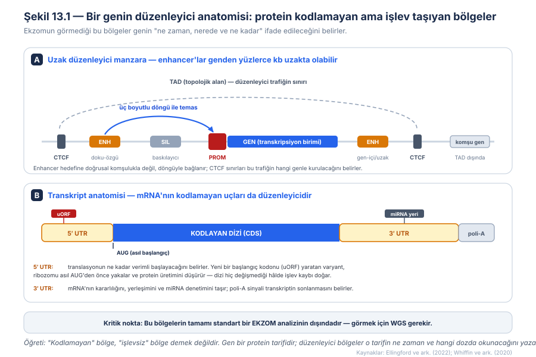
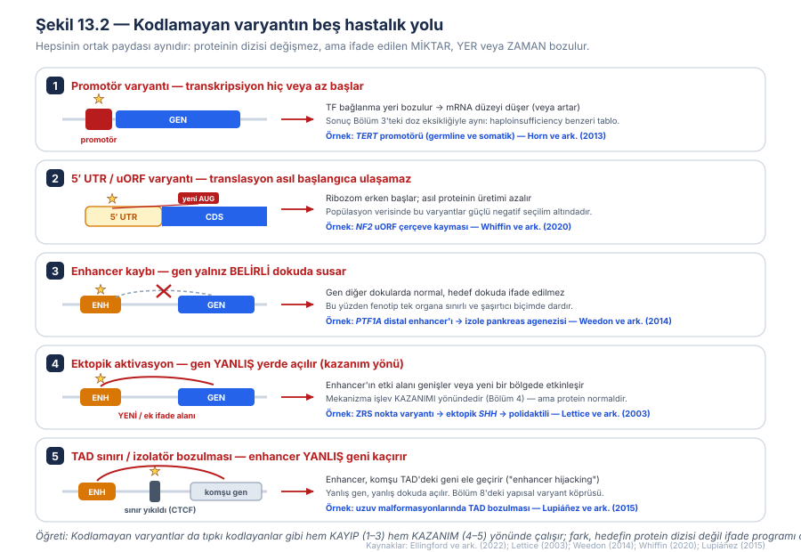
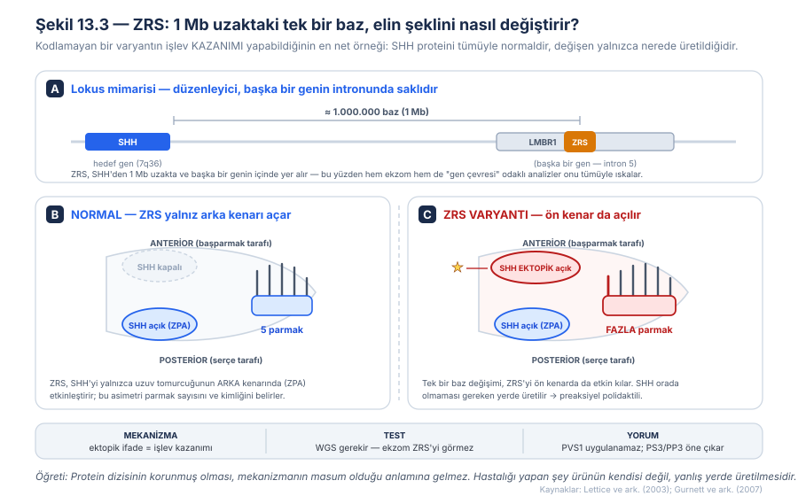
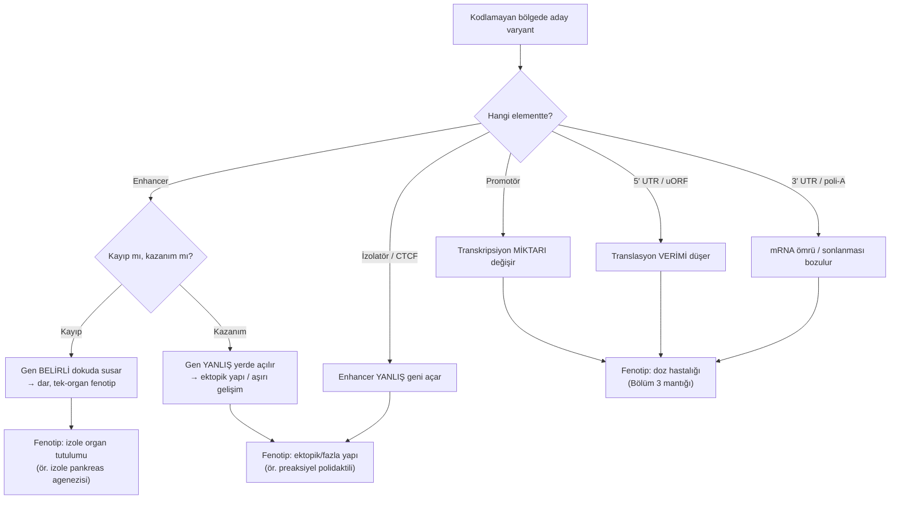
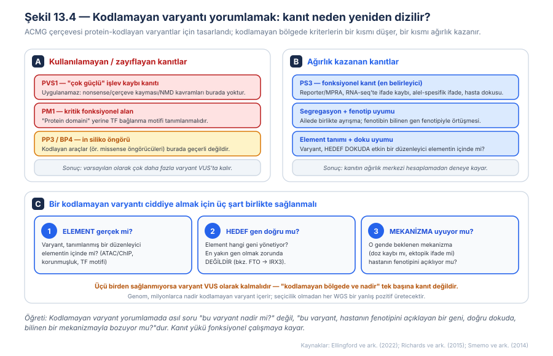
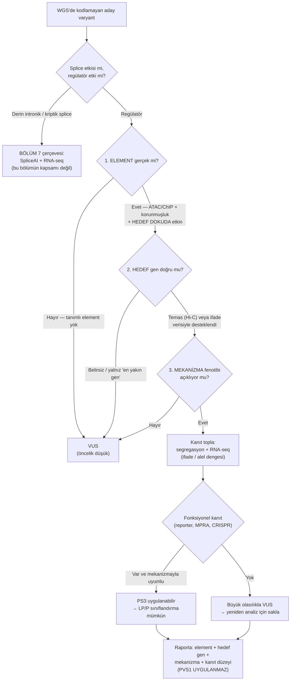
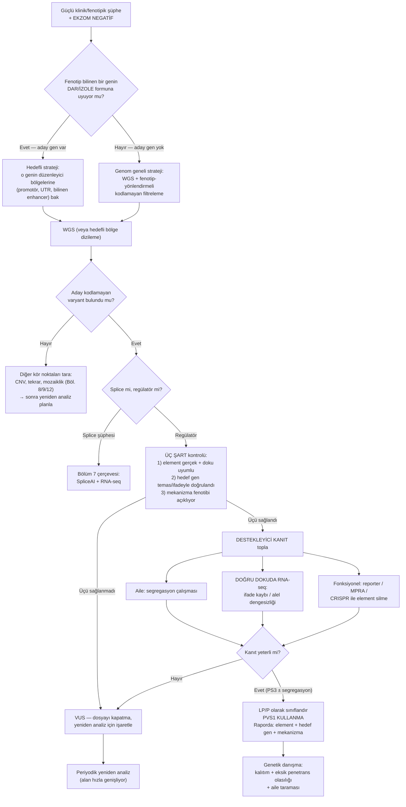

# Bölüm 13 — Kodlamayan (Noncoding) ve Regülatör Varyantlar

> **Bölümün çekirdek tezi:** Genomun protein kodlayan kısmı %2'den azdır; klinik genetiğin neredeyse tamamı ise on yıllardır bu %2'ye bakmıştır. Kodlamayan varyantlar, bu kör noktanın adıdır. Bu bölümün çekirdek iddiası şudur: **kodlamayan bir varyant, proteinin tek bir amino asidini bile değiştirmeden hastalık yapabilir — çünkü hedefi ürünün kendisi değil, ürünün ifade programıdır.** Bir promotör varyantı genin ne kadar üretileceğini, bir enhancer varyantı hangi dokuda üretileceğini, bir 5′UTR varyantı ne kadar verimli çevrileceğini, bir TAD sınırı varyantı ise hangi genin üretileceğini bozar. Buradan üç klinik sonuç doğar: (1) bu varyantları görmek için **ekzom yetmez, WGS gerekir**; (2) fenotip çoğu zaman şaşırtıcı biçimde **dar ve tek organa sınırlıdır**, çünkü etkilenen düzenleyici doku-özgüdür; (3) yorumlamada **PVS1 uygulanamaz** ve kanıtın ağırlık merkezi hesaplamadan **fonksiyonel deneye** kayar. Bölüm 8'de yapısal varyant ölçeğinde gördüğümüz düzenleyici mimariyi (TAD, enhancer hijacking) bu bölüm **tek nükleotid** ölçeğine indirir.

> **Bu bölüm nasıl okunmalı?** Tıp öğrencileri için doğrusal okuma önerilir; düzenleyici anatomi (Şekil 13.1) kurulmadan sonraki hiçbir mekanizma oturmaz. Klinisyenler için "Klinik fenotipe dönüşüm → Tanısal testler → Karar algoritması" hattı önceliklidir. Varyant yorumlayanlar için 6. başlık ve Şekil 13.4 bağımsız olarak kullanılabilir; bu bölümün laboratuvar pratiğine en doğrudan dokunan kısmı orasıdır.

> 🖼️ **Görseller hakkında not:** Şekil 13.1–13.4 `assets/` klasöründe SVG olarak bulunur. Mermaid diyagramları metin içine gömülüdür.

---

## Öğrenme hedefleri

Bu bölümü tamamlayan okuyucu:
1. Genomun düzenleyici anatomisini (promotör, enhancer, silencer, izolatör/CTCF, 5′UTR, 3′UTR, poli-A sinyali) tanımlar ve her birinin işlevini açıklar.
2. "Kodlamayan" ile "işlevsiz"in aynı şey olmadığını gerekçelendirir ve kodlamayan varyantı splice varyantından kavramsal olarak ayırır.
3. Kodlamayan varyantın beş hastalık yolunu (promotör, uORF, enhancer kaybı, ektopik aktivasyon, TAD bozulması) sıralar ve her birini bir örneğe bağlar.
4. Enhancer varyantlarının neden doku-özgü ve dar fenotipler ürettiğini açıklar.
5. uORF (yukarı akış açık okuma çerçevesi) mekanizmasını ve translasyonel işlev kaybını açıklar.
6. Düzenleyici bir varyantın hedef geninin neden en yakın gen olmak zorunda olmadığını örnekle açıklar.
7. Kodlamayan varyant şüphesinde uygun testi (WGS ± RNA-seq ± fonksiyonel çalışma) seçer ve ekzomun sınırlılığını gerekçelendirir.
8. Kodlamayan varyant yorumlamada PVS1'in neden uygulanamadığını, PS3'ün neden ağırlık kazandığını açıklar ve ClinGen/uzman uzlaşı önerilerini uygular.
9. Bir kodlamayan varyantı ciddiye almak için gereken üç şartı (element gerçek mi, hedef gen doğru mu, mekanizma uyuyor mu) bir olguya uygular.

---

## 1. Kavramsal tanım

Klinik genomiğin son yirmi yılı, büyük ölçüde tek bir pratik kısayol üzerine kuruldu: **ekzom dizileme**. Bu kısayolun gerekçesi güçlüydü — bilinen hastalık varyantlarının ezici çoğunluğu protein kodlayan dizilerde toplanıyordu ve genomun yalnızca yaklaşık %1–2'sini oluşturan bu bölgeyi okumak, hem ucuz hem yorumlanabilir bir çözümdü. Ancak bu kısayolun sessiz bir bedeli vardı: **geri kalan %98'in içinde ne olduğuna bakılmıyordu.** Bu bölüm, o %98'in içinde hastalık yapan neyin bulunduğunu anlatır.

Önce bir kavram temizliği yapmak gerekir, çünkü "kodlamayan varyant" ifadesi pratikte iki farklı şeyi karıştırmaya çok müsaittir. Bir varyantın **kodlamayan** olması, protein dizisini doğrudan belirleyen bölgede (ekzonların kodlayan kısmında) bulunmaması demektir. Ancak kodlamayan bölgedeki her varyant **regülatör** değildir. Bölüm 7'de gördüğümüz **derin intronik ve kriptik splice varyantları** teknik olarak kodlamayan bölgededir, ama mekanizmaları düzenleyici değildir: bunlar mRNA'nın **işlenmesini** bozar, ifade programını değil. Bu bölümün konusu olan regülatör varyantlar ise transkripsiyonun **ne zaman, nerede ve ne kadar** olacağını bozar. Ayrım pratik olarak önemlidir çünkü ikisinin kanıt araçları farklıdır: splice etkisi için SpliceAI gibi araçlar ve RNA-seq'te anormal transkript aranırken (Jaganathan ve ark., 2019), regülatör etki için ifade düzeyi, alel dengesi ve reporter çalışmaları aranır.

Peki bu düzenleyici bölgeler tam olarak nedir? Şekil 13.1'de gösterildiği gibi, bir genin işleyişi kendi sınırlarının çok ötesinde bir mimariye yaslanır. **Promotör**, transkripsiyonun fiziksel olarak başladığı, RNA polimeraz ve genel transkripsiyon faktörlerinin toplandığı bölgedir; genin "açma düğmesi"dir. **Enhancer**, bu düğmenin ne kadar kuvvetli ve hangi dokuda basılacağını belirleyen, genden onlarca hatta yüzlerce kilobaz uzakta bulunabilen kısa bir dizidir; hedefine doğrusal komşulukla değil, kromatinin üç boyutlu **döngüsüyle** bağlanır. **Silencer** ters yönde çalışır, baskılar. **İzolatör (insulator)** — tipik olarak **CTCF** proteininin bağlandığı bölgeler — bu düzenleyici trafiğe sınır çizer; hangi enhancer'ın hangi genle konuşabileceğini belirleyen duvarlardır ve Bölüm 8'de tanıştığımız **TAD (topolojik olarak ilişkili alan)** sınırlarını oluştururlar.

Bu liste transkripsiyonla bitmez. Genin ürünü olan mRNA'nın kendisi de kodlamayan uçlar taşır. **5′ UTR (çevrilmeyen bölge)**, ribozomun mRNA'ya bağlanıp asıl başlangıç kodonuna (AUG) doğru taradığı bölgedir; buradaki dizi, translasyonun ne kadar verimli başlayacağını belirler. **3′ UTR**, mRNA'nın ne kadar dayanacağını, hücrenin neresinde bulunacağını ve hangi mikroRNA'ların denetimine gireceğini taşır; sonundaki **poli-A sinyali** transkriptin nerede biteceğini söyler.

Bu mimarinin klinik önemi, tek bir cümlede toplanabilir: **bu bölgelerin hemen tamamı standart bir ekzom analizinin dışındadır.** 5′ ve 3′ UTR'ler bazı ekzom kitlerinde kısmen kapsanır ama güvenilir değildir; promotörler, enhancer'lar ve CTCF bölgeleri ise tümüyle kapsam dışıdır. Dolayısıyla bu bölümdeki mekanizmaların hiçbiri ekzomla dışlanamaz. Kodlamayan varyantların klinik olarak ciddiye alınabilmesi, **tüm genom dizilemesinin (WGS)** yaygınlaşmasıyla mümkün olmuştur (Ellingford ve ark., 2022).

| Kavram | Tanım | Klinik anlamı |
|---|---|---|
| Promotör | Transkripsiyonun başladığı, TF'lerin toplandığı bölge | Varyant → mRNA düzeyi düşer/artar; doz hastalığı doğar |
| Enhancer | Genin hangi dokuda ve ne kadar açılacağını belirleyen uzak dizi | Varyant → **doku-özgü**, dar fenotip; gen diğer dokularda normaldir |
| Silencer | Baskılayıcı düzenleyici element | Kaybı → uygunsuz/artmış ifade |
| İzolatör / CTCF | Düzenleyici trafiğe sınır çizen bölge; TAD sınırı | Kaybı → enhancer yanlış geni açar ("hijacking") |
| 5′ UTR | Ribozomun taradığı, translasyon verimini belirleyen uç | Yeni uORF → protein üretimi düşer (işlev kaybı) |
| uORF | Asıl AUG'den önceki yukarı akış açık okuma çerçevesi | Yaratılması veya durdurucusunun bozulması patojen olabilir |
| 3′ UTR | mRNA kararlılığı, yerleşimi ve miRNA denetimini taşıyan uç | Varyant → transkript miktarı/ömrü değişir |
| TAD | Kromatinin kendi içinde yoğun temas kurduğu alan | Sınırının bozulması → ektopik gen aktivasyonu |

---

## 2. Moleküler mekanizma

### 2.1 Beş yol, tek ortak payda

Kodlamayan varyantların mekanizmalarını akılda tutmanın en pratik yolu, hepsini tek bir soruya indirgemektir: *"Bu varyant, genin ifade programında neyi bozuyor — miktarı mı, yeri mi, yoksa hangi genin ifade edildiğini mi?"* Şekil 13.2'de toplanan beş yol bu sorunun beş farklı cevabıdır ve dikkat çekici biçimde, kitabın önceki bölümlerinde kurduğumuz **kayıp–kazanım** ekseni burada da aynen işler.

**Birinci yol, promotör varyantıdır.** Promotördeki bir transkripsiyon faktörü bağlanma motifi bozulduğunda genin transkripsiyonu azalır; sonuç, protein dizisi tümüyle normal olduğu hâlde **doz eksikliğidir** — yani Bölüm 3'te ayrıntılandırdığımız haploinsufficiency tablosunun bir başka yoldan üretilmiş hâli. Bu yolun ters yönü de vardır: bir varyant, promotörde **yeni bir** TF bağlanma motifi yaratarak ifadeyi artırabilir. Bunun en iyi belgelenmiş örneği *TERT* promotörüdür; melanomaya yatkın bir ailede saptanan germline promotör varyantı, transkripsiyon başlangıcı yakınında Ets/TCF ailesi transkripsiyon faktörleri için yeni bir bağlanma motifi yaratmakta ve reporter deneylerinde transkripsiyonu iki kata varan oranda artırmaktadır (Horn ve ark., 2013).

**İkinci yol, 5′ UTR ve uORF varyantlarıdır.** Ribozom, mRNA'nın 5′ ucundan bağlanıp aşağı doğru tarayarak ilk uygun başlangıç kodonunu arar. Eğer bir varyant asıl AUG'den *önce* yeni bir başlangıç kodonu yaratırsa, ribozomların bir kısmı burada yakalanır ve asıl proteine hiç ulaşamaz; sonuç, translasyon düzeyinde bir **işlev kaybıdır**. Bu mekanizmanın ne kadar yaygın olduğu ancak büyük popülasyon verileriyle görülebilmiştir.

**Üçüncü yol, enhancer kaybıdır** ve klinik olarak en öğretici olanıdır. Bir enhancer tipik olarak **doku-özgüdür**: geni yalnızca belirli bir organda, belirli bir gelişim penceresinde açar. Dolayısıyla o enhancer bozulduğunda gen diğer bütün dokularda normal çalışmaya devam eder ve fenotip tek bir organa sıkışır. Bu, kodlamayan varyantların neden sıklıkla "beklenenden çok daha dar" tablolar yaptığını açıklar.

**Dördüncü yol, ektopik aktivasyondur** ve yönü tersine çevirir. Bir enhancer varyantı, elementi olması gerekenden daha geniş bir alanda veya olmaması gereken bir yerde etkin kılabilir; gen yanlış yerde açılır. Bu mekanizma açıkça bir **işlev kazanımıdır** (Bölüm 4) — ama kazanılan şey proteinin aktivitesi değil, ifade alanıdır.

**Beşinci yol, TAD sınırı bozulmasıdır.** CTCF'nin çizdiği duvar yıkıldığında, bir enhancer komşu alandaki yanlış geni "ele geçirir" (enhancer hijacking); yanlış gen, yanlış dokuda açılır. Bu mekanizma Bölüm 8'de yapısal varyantlar (delesyon, inversiyon, duplikasyon) bağlamında ayrıntılandırılmıştı (Lupiáñez ve ark., 2015); burada vurgulanması gereken, aynı sonucun daha küçük ölçekte, tek bir CTCF motifini bozan varyantlarla da üretilebileceğidir.

> **🔬 Deep-dive — uORF'ler: popülasyon verisi bir mekanizmayı nasıl "keşfeder"?** Yukarı akış açık okuma çerçevelerinin (uORF) hastalık yapabildiği tek tük olgu bildirimlerinden biliniyordu; ancak bunun genel bir mekanizma sınıfı mı yoksa nadir bir merak konusu mu olduğu belirsizdi. Whiffin ve arkadaşları soruyu tersten sordular: *eğer uORF-bozan varyantlar gerçekten zararlıysa, doğal seçilim onları popülasyondan temizliyor olmalı.* 15.708 bireyin tüm-genom verisinde, **yeni bir yukarı akış başlangıç kodonu yaratan** ve **var olan bir uORF'nin durdurma bölgesini bozan** varyantların güçlü negatif seçilim altında olduğunu gösterdiler. Sinyal, işlev kaybına toleranssız (LoF-intolerant) genlerin yukarısında anlamlı biçimde daha güçlüydü; kodlayan diziyle örtüşen uORF yaratan varyantlar ise **kodlayan missense varyantlarla eşdeğer** düzeyde seçilim sinyali gösterdi. Aynı çalışma, nörofibromatozis bağlamında *NF2*'nin yukarısında yeni bir uORF çerçeve kayması varyantı bildirdi (Whiffin ve ark., 2020). Buradaki metodolojik ders, Bölüm 3'te pLI/LOEUF için kurduğumuz mantığın aynısıdır: **popülasyondaki yokluk, işlevin kanıtıdır.** Bir varyant sınıfı sağlıklı insanlarda beklenenden az görülüyorsa, o sınıf zararlıdır — ve bu çıkarım, tek bir hasta görmeden yapılabilir.

### 2.2 Enhancer neden dar fenotip yapar? Bir "ders kitabı" örneği

Enhancer varyantlarının doku-özgülüğünü en net gösteren örnek, izole pankreas agenezisidir. Pankreas gelişiminin ana transkripsiyon faktörü olan *PTF1A*'nın **kodlayan** bölgesindeki biallelik varyantlar, pankreas agenezisine ek olarak ağır serebellar agenezi de içeren, çok daha geniş ve ağır bir sendrom yapar. Oysa yenidoğan diyabetiyle giden **izole** pankreas agenezisi olgularının bir kısmında *PTF1A*'nın kodlayan dizisi tümüyle normaldir.

Weedon ve arkadaşları bu bilmeceyi, insan embriyonik kök hücrelerinden türetilmiş **pankreas öncül hücrelerindeki epigenomik haritayı** kullanarak çözdüler. Tüm-genom verisini bu haritayla filtreleyerek, *PTF1A*'nın yaklaşık 25 kb aşağısında, o güne dek tanımlanmamış ~400 bp'lik bir bölgede on ailede altı farklı resesif varyant saptadılar; bu bölgenin *PTF1A*'nın gelişimsel bir enhancer'ı olarak çalıştığını ve varyantların enhancer aktivitesini ortadan kaldırdığını gösterdiler. Bu varyantlar, izole pankreas agenezisinin **en sık nedeni** olarak bildirilmiştir (Weedon ve ark., 2014).

Buradaki öğreti çift katmanlıdır. Mekanizma açısından: enhancer pankreasa özgü olduğu için kaybı yalnızca pankreası vurur, beyni etkilemez — aynı genin kodlayan varyantı ise proteini her yerde bozduğu için serebellumu da tutar. **Aynı gen, hangi katmanın bozulduğuna göre iki farklı hastalık yapar.** Metodoloji açısından: bu enhancer'ı bulmayı mümkün kılan şey ham dizileme değil, **hastalıkla ilgili doku tipinde** üretilmiş epigenomik açıklamadır. Kodlamayan varyant analizinin neden "hangi dokuda?" sorusuyla başlaması gerektiğini bu örnek kadar iyi anlatan bir başkası yoktur.

### 2.3 Ektopik ifade: kodlamayan varyantın işlev kazanımı

Kodlamayan varyantların yalnızca "ifadeyi azalttığı" yönündeki sezgi yanlıştır. En çarpıcı karşı örnek, *SHH* geninin uzuv enhancer'ı olan **ZRS**'dir (Şekil 13.3).

Normal gelişimde *SHH*, uzuv tomurcuğunun yalnızca **arka (posterior) kenarında**, polarize edici aktivite bölgesi (ZPA) denen dar bir alanda ifade edilir; parmakların sayısı ve kimliği bu asimetrik sinyal gradyanından doğar. Bu asimetriyi kuran şey ZRS adlı bir enhancer'dır — ve bu enhancer, *SHH*'den yaklaşık **1 milyon baz** uzakta, üstelik tümüyle başka bir genin (*LMBR1*) intronunun içinde durur.

Lettice ve arkadaşları, preaksiyel polidaktili ile giden ailelerde bu bölgede nokta varyantları saptadılar ve fare modellerinde bu varyantların *SHH*'yi uzuv tomurcuğunun **ön (anterior) kenarında da ektopik olarak** açtığını gösterdiler; sonuç, fazladan parmaktır (Lettice ve ark., 2003). Sonraki çalışmalar ZRS varyantlarının trifalanjeal başparmak ve preaksiyel polidaktili ailelerinde sık bir neden olduğunu doğrulamış, bazı varyantların Cdx ailesi transkripsiyon faktörü bağlanma yerlerini değiştirdiğini ve varyantın ZRS içindeki konumunun penetrans ile fenotip ağırlığını etkileyebildiğini bildirmiştir (Gurnett ve ark., 2007).

Bu örneğin üç ayrı dersi vardır. **Mekanizma:** SHH proteini tümüyle normaldir; hastalığı yapan tek şey onun yanlış yerde üretilmesidir — bu, tanımı gereği bir işlev kazanımıdır. **Tanı:** ZRS ne *SHH*'nin ekzonlarındadır ne de yakınındadır; bir ekzom analizi onu göremez, hatta "*SHH* çevresine bak" diyen bir hedefli yaklaşım bile 1 Mb uzağı kaçırır. **Yorum:** böyle bir varyant için PVS1 gibi işlev kaybı kriterleri anlamsızdır; kanıt, ifadenin gerçekten yer değiştirdiğini gösteren fonksiyonel veriden gelmek zorundadır.

### 2.4 En yakın gen genellikle yanlış gendir

Kodlamayan varyant analizinde en sık ve en maliyetli varsayım şudur: *"Bu düzenleyici element, en yakın komşusu olan geni yönetiyordur."* Bu varsayım sıklıkla yanlıştır ve yanlışlığının en ünlü kanıtı obezite genetiğinden gelir.

Genom çapında ilişkilendirme çalışmaları, obezite ve tip 2 diyabet riskiyle en güçlü ve en tekrarlanabilir ilişkiyi *FTO* geninin **intronlarındaki** varyantlarda bulmuştu; alan yıllarca bu varyantların *FTO*'nun kendisini etkilediğini varsaydı. Smemo ve arkadaşları, üç boyutlu kromatin temas yöntemleriyle bu bölgenin insan, fare ve zebra balığı genomlarında **megabaz ölçeğinde** uzaklıktaki *IRX3* geninin promotörüyle fiziksel olarak temas ettiğini gösterdiler. İnsan beyin dokusunda obeziteyle ilişkili varyantlar *IRX3* ifadesiyle ilişkiliydi, *FTO* ifadesiyle değil; *Irx3* eksik farelerde vücut ağırlığı %25–30 azalmış, bu azalma ağırlıklı olarak yağ kütlesi kaybından kaynaklanmıştı (Smemo ve ark., 2014).

Yani sinyalin *içinde* bulunduğu gen (*FTO*) ile sinyalin *etkilediği* gen (*IRX3*) farklıdır. Klinik pratikte bunun karşılığı nettir: bir kodlamayan varyant bulunduğunda hedef gen, coğrafi yakınlıkla değil, **temas verisiyle (Hi-C/4C), enhancer–promotör eşleştirmeleriyle ve ifade verisiyle** belirlenmelidir.

---

## 3. Varyant tipleri

Kodlamayan bölgede "varyant tipi", bulunduğu elementle tanımlanır; çünkü mekanizma elementin işlevinden türer. Aşağıdaki tablo bu bölümün klinik omurgasıdır.

| Element / varyant tipi | Moleküler sonuç | Yön | Nasıl gösterilir | Örnek |
|---|---|---|---|---|
| Promotör — TF motifi kaybı | Transkripsiyon azalır | Kayıp (doz) | Reporter, ifade ölçümü, alel-spesifik ifade | β-globin promotör varyantları |
| Promotör — yeni TF motifi | Transkripsiyon artar | **Kazanım** | Reporter; motif analizi | *TERT* promotörü (Horn 2013) |
| 5′ UTR — yeni uORF | Translasyon verimi düşer | Kayıp | Ribozom profilleme, protein düzeyi | *NF2* (Whiffin 2020) |
| 5′ UTR — uORF stop kaybı | Uzamış uORF; asıl ORF baskılanır | Kayıp | Aynı | Popülasyon seçilim verisi |
| 3′ UTR — miRNA bölgesi / kararlılık | mRNA ömrü veya miktarı değişir | Değişken | mRNA yarı ömrü, alel dengesi | Değişken |
| Poli-A sinyali | Transkript sonlanması bozulur | Kayıp | RNA-seq (3′ uç analizi) | Talasemi bildirimleri |
| Enhancer — kayıp/inaktivasyon | Gen **belirli dokuda** ifade edilmez | Kayıp (doku-özgü) | Doku-özgü reporter, epigenomik harita | *PTF1A* enhancer'ı (Weedon 2014) |
| Enhancer — ektopik aktivasyon | Gen **yanlış yerde** açılır | **Kazanım** | İn situ hibridizasyon, model organizma | ZRS/*SHH* (Lettice 2003) |
| İzolatör / CTCF — sınır kaybı | Enhancer komşu geni ele geçirir | Kazanım (ektopik) | Hi-C, ifade profili | TAD bozulmaları (Lupiáñez 2015) |
| Derin intronik — kriptik splice | **Splicing** bozulur (regülatör değil) | Kayıp | RNA-seq, SpliceAI | Bölüm 7 kapsamında |

Tablonun okunma biçimi şudur: ilk altı satır **transkript düzeyinde** (miktar/verim), sonraki üç satır **transkripsiyon programı düzeyinde** (yer/hangi gen) etki eder. Son satır bilinçli olarak eklenmiştir ve bir sınır çizer: derin intronik splice varyantları kodlamayan bölgededir ama bu bölümün mekanizma sınıfına girmez; onların yeri Bölüm 7'dir. Bu ayrımı yapmamak, hem yanlış test istemeye hem yanlış kanıt kriteri uygulamaya yol açar.

---

## 4. Klinik fenotipe dönüşüm

### 4.1 Neden fenotipler bu kadar dar?

Kodlamayan varyantların klinik imzası, çoğu zaman **beklenenden dar** bir fenotiptir. Bir klinisyen, tanıdığı bir genin adını duyduğunda o genin klasik sendromunu bekler; oysa aynı genin bir düzenleyici elementindeki varyant, sendromun yalnızca tek bir bileşenini üretebilir.

Bunun nedeni doğrudan mekanizmadadır. Kodlayan bir varyant proteini **her dokuda** bozar; dolayısıyla o proteinin görev aldığı bütün organlar etkilenir ve tablo geniştir. Düzenleyici bir varyant ise yalnızca o elementin etkin olduğu **dokuda ve gelişim penceresinde** iş görür; diğer dokularda gen normal düzenleyicileriyle sorunsuz çalışmayı sürdürür. *PTF1A* örneği bunun laboratuvar saflığında bir gösterimidir: kodlayan varyant pankreas + serebellum, enhancer varyantı yalnız pankreas.

Bu gözlemin klinik karşılığı bir ipucuna dönüşür: **bilinen bir sendromun "eksik", izole veya olağandışı dar bir formuyla karşılaşıldığında ve kodlayan analiz negatifse, düzenleyici bir varyant düşünülmelidir.**

### 4.2 Aynı lokus, zıt yönler

Kodlamayan varyantların ikinci klinik özelliği, aynı düzenleyici lokusun hem kayıp hem kazanım yönünde hastalık yapabilmesidir. ZRS bunun en temiz örneğidir: bu enhancer'ın **kaybı** (delesyonu) uzuv gelişiminde eksiklik yönünde bozukluklara yol açarken, **aktive edici nokta varyantları** ektopik *SHH* ifadesiyle fazladan parmak üretir. Aynı mantık Bölüm 8'deki *PMP22* örneğini (delesyon → HNPP, duplikasyon → CMT1A) düzenleyici düzeyde tekrarlar.

### 4.3 Kodlamayan varyantlar tanısal boşluğun neresinde?

Klinik olarak güçlü şüphe taşıyan hastaların önemli bir bölümü, ekzom sonrası tanısız kalır. Bu "tanısal boşluğun" bir kısmı henüz keşfedilmemiş genlerden, bir kısmı ekzomun teknik kör noktalarından (bazı CNV'ler, tekrar bölgeleri, mozaiklik — Bölüm 12), bir kısmı da bu bölümün konusu olan düzenleyici varyantlardan kaynaklanır. Kodlamayan varyantların bu boşluktaki payı hastalıktan hastalığa büyük değişkenlik gösterir ve alan hızla gelişmektedir; ⚠️ tek bir genel oran vermek şu aşamada güvenilir değildir. Ancak yönelim nettir: WGS'nin klinik kullanımı yaygınlaştıkça, kodlamayan nedenlerin tanımlanma hızı artmaktadır (Ellingford ve ark., 2022).

---

## 5. Tanısal testlerle ilişkisi

Kodlamayan varyantlarda test seçimi iki aşamalıdır ve bu iki aşamayı karıştırmamak gerekir: önce varyantı **görmek** (dizileme), sonra onun gerçekten işlev bozduğunu **göstermek** (fonksiyonel doğrulama). Standart tanısal testlerin hiçbiri tek başına ikincisini yapamaz.

| Test | Bu mekanizmayı yakalar mı? | Sınırlılığı |
|------|----------------------------|-------------|
| **WES** | **Hayır (temel sınırlılık).** Promotör, enhancer ve CTCF bölgelerini kapsamaz; UTR kapsaması kısmi ve kit-bağımlıdır | Bu bölümdeki mekanizmaların hiçbiri ekzomla dışlanamaz — negatif ekzom "kodlamayan neden yok" demek değildir |
| **Short-read WGS** | **Evet — birinci basamak.** Promotör, UTR, enhancer ve CTCF bölgelerini kapsar | Varyantı görür ama **yorumlamaz**; milyonlarca nadir kodlamayan varyant arasından seçim yapmak filtreleme stratejisi gerektirir |
| **Long-read WGS** | Evet; ayrıca TAD sınırını bozan yapısal varyantları ve karmaşık yeniden düzenlenmeleri çözer | Maliyet ve erişim; kodlamayan yorum sorununu çözmez |
| **Array-CGH / SNP array** | Kısmen — düzenleyici bölgeyi kapsayan büyük delesyon/duplikasyonları yakalar | Tek nükleotid düzeyindeki düzenleyici varyantları göremez |
| **MLPA** | Sınırlı — hedeflenmişse enhancer delesyonunu gösterebilir | Yalnız tasarlanan bölge; dizi varyantını görmez |
| **RNA-seq** | **Evet — kilit destekleyici test.** İfade kaybını, alel dengesizliğini ve anormal transkriptleri gösterir | **Doğru doku** gerekir; düzenleyici doku-özgüyse kanda hiçbir şey görülmez |
| **Methylation array** | Dolaylı — düzenleyici bölgedeki metilasyon değişimini gösterebilir | Dizi varyantını göstermez; nedensellik kurmaz |
| **Karyotip** | Yalnız çok büyük yeniden düzenlenmeleri | Çözünürlük tümüyle yetersiz |
| **(mekanizmaya özgü) Fonksiyonel çalışma** | **Evet — nedenselliğin tek gerçek kanıtı.** Reporter/MPRA, alel-spesifik ifade, CRISPR ile element silme, model organizma | Araştırma ortamı gerektirir; rutin tanısal hizmet değildir |

> **Bu mekanizmayı hangi test yakalar? (özet):** Kodlamayan varyant şüphesinde doğru sıra şudur — **WGS** ile varyantı gör, **doğru dokudan RNA-seq** ile ifade/alel dengesi üzerinden destek ara, ve mümkünse **fonksiyonel bir çalışma** ile nedenselliği göster. Ekzomun negatifliği bu mekanizmaları dışlamaz; aksine, güçlü klinik şüphe varken negatif ekzom tam olarak WGS endikasyonudur.

> **🟦 Klinikte dikkat — RNA-seq'te doku, tıpkı Bölüm 11 ve 12'deki gibi belirleyicidir:** Düzenleyici varyantların çoğu doku-özgü elementlerdedir. Kanda yapılan bir RNA-seq, yalnızca kanda ifade edilen genler ve kanda etkin enhancer'lar hakkında bilgi verir. Pankreasa, retinaya veya beyne özgü bir enhancer varyantı kanda hiçbir iz bırakmaz. Erişilebilir doku yoksa fibroblast kültürü, uyarılmış pluripotent kök hücreden (iPSC) türetilmiş ilgili hücre tipi veya organoid modelleri gündeme gelir.

---

## 6. Varyant yorumlama açısından önemi (ACMG/ClinGen)

Bu bölümün laboratuvar pratiğine en doğrudan dokunan kısmı burasıdır. ACMG/AMP çerçevesi (Richards ve ark., 2015) protein kodlayan varyantlar düşünülerek tasarlanmıştır ve kodlamayan bölgede kriterlerin bir bölümü ya anlamını yitirir ya da yeniden tanımlanmak zorundadır. Bu boşluğu doldurmak üzere, kodlamayan varyant yorumlamada deneyimli klinik ve araştırma bilimcilerinden oluşan bir panel, mevcut kılavuzların bu bağlama nasıl uyarlanacağına dair öneriler yayımlamıştır (Ellingford ve ark., 2022). Şekil 13.4 bu yeniden dizilişi özetler.

**Düşen kriterlerin başında PVS1 gelir.** Bu "çok güçlü" kanıt, nonsense, çerçeve kayması, kanonik splice ve başlangıç kodonu kaybı gibi, **öngörülebilir biçimde null alel üreten** varyant tipleri için tanımlanmıştır ve dayanağı NMD'dir (Bölüm 2). Kodlamayan bir varyantta ne prematür durdurma kodonu vardır ne NMD; dolayısıyla PVS1 **uygulanamaz**. Bu tek başına büyük bir farktır: kodlayan bir LoF varyantı PVS1 + tek bir orta kanıtla patojen sınıfına ulaşabilirken, kodlamayan bir varyant aynı yolu hiç kullanamaz.

**PM1 (kritik fonksiyonel alan) yeniden tanımlanmalıdır.** "Protein domaini" kavramı burada anlamsızdır; karşılığı, varyantın tanımlanmış bir **transkripsiyon faktörü bağlanma motifi** veya evrimsel olarak yüksek korunmuş bir düzenleyici çekirdek içinde bulunmasıdır.

**PP3/BP4 (in siliko öngörü) doğrudan aktarılamaz.** Missense öngörücüleri kodlamayan varyantlar için geçersizdir; bu bağlamda kullanılacak araçlar farklıdır ve genel olarak kodlayan araçlara kıyasla daha az valide edilmiştir — dolayısıyla ağırlıkları da daha temkinli verilmelidir.

Buna karşılık **bazı kanıtlar belirgin biçimde ağırlık kazanır.** Birincisi ve en önemlisi **PS3, yani fonksiyonel kanıttır**: reporter deneyleri (tekil veya MPRA gibi paralel biçimlerde), hasta dokusunda ifade kaybının veya alel-spesifik ifadenin gösterilmesi, elementin CRISPR ile silinmesinin fenotipi tekrarlaması. Bölüm 4'te değindiğimiz "fonksiyonel kanıt önce mekanizmayı tanımlamalıdır" ilkesi (Brnich ve ark., 2019) burada özellikle kritiktir: ölçülen şey, o gen için beklenen mekanizmayla (doz kaybı mı, ektopik ifade mi) tutarlı olmalıdır. İkincisi, **ailede segregasyon ve fenotip uyumu** — kodlayan analiz negatifken bir kodlamayan varyantın aile içinde hastalıkla birlikte ayrışması güçlü bir işarettir. Üçüncüsü, **elementin hedef dokuda etkin olduğunun gösterilmesi**; ATAC-seq, ChIP-seq ve benzeri epigenomik verilerle elementin varlığının ve doku uyumunun belgelenmesi.

> **🟦 Klinikte dikkat — Üç şart birlikte sağlanmalı:** Bir kodlamayan varyantı raporda öne çıkarmadan önce üç soru birlikte yanıtlanmalıdır. **(1) Element gerçek mi?** Varyant, ilgili dokuda etkin olduğu gösterilmiş tanımlı bir düzenleyici elementin içinde mi? **(2) Hedef gen doğru mu?** Elementin yönettiği gen hangisi — en yakın gen olduğu varsayılmadan, temas ve ifade verisiyle belirlendi mi (bkz. *FTO* → *IRX3*)? **(3) Mekanizma uyuyor mu?** O gende beklenen hastalık mekanizması (doz kaybı mı, ektopik ifade mi) hastanın fenotipini açıklıyor mu? Üçü birden sağlanmıyorsa varyant **VUS olarak kalmalıdır.** Bu titizliğin gerekçesi istatistikseldir: her bireyin genomunda milyonlarca kodlamayan varyant, bunların binlercesi nadirdir. "Kodlamayan bölgede ve nadir" ölçütü tek başına kullanılırsa, her WGS analizi kaçınılmaz olarak yanlış pozitif üretir.

---

## 7. Pediatrik genetikten klinik örnekler

**İzole pankreas agenezisi — enhancer'ın doku-özgülüğü.** Yenidoğan döneminde kalıcı diyabet ve ekzokrin pankreas yetmezliğiyle başvuran, ancak nörolojik bulgusu olmayan bir bebekte *PTF1A*'nın kodlayan dizisi normaldir. Weedon ve arkadaşları, pankreas öncül hücrelerindeki epigenomik haritayı kullanarak *PTF1A*'nın ~25 kb aşağısındaki ~400 bp'lik gelişimsel bir enhancer'da on ailede altı farklı resesif varyant tanımladı; bu varyantlar enhancer aktivitesini ortadan kaldırıyordu ve izole pankreas agenezisinin en sık nedeniydi (Weedon ve ark., 2014). **Öğreti:** aynı genin kodlayan varyantı pankreas + serebellum tutulumu yaparken, enhancer varyantı yalnız pankreası tutar — fenotibin darlığı, bozulan katmanın doku-özgülüğünden gelir.

**Preaksiyel polidaktili ve trifalanjeal başparmak — ektopik ifade.** Otozomal dominant geçişli, fazladan veya üç falankslı başparmakla giden ailelerde neden, *SHH*'den 1 Mb uzaktaki ZRS enhancer'ındaki nokta varyantlarıdır. Lettice ve arkadaşları bu elementi tanımlayıp dört ilgisiz ailede varyantların hastalıkla ayrıştığını gösterdi (Lettice ve ark., 2003). Gurnett ve arkadaşları dört Kuzey Amerika ailesinin üçünde ZRS varyantı saptadı; varyantların Cdx ailesi TF bağlanma yerlerini değiştirdiğini bildirdi ve ZRS'nin 5′ ucuna yakın varyant taşıyan büyük bir ailede daha hafif fenotiple birlikte **%82 gibi eksik bir penetrans** gözlemledi (Gurnett ve ark., 2007). **Öğreti:** kodlamayan varyantlar da eksik penetrans ve değişken ekspresivite gösterir (Bölüm 1); üstelik burada element içindeki **konum** fenotibi renklendirir.

**Melanom yatkınlığı — promotörde işlev kazanımı.** Melanoma yatkın bir ailede bağlantı analizi ve yüksek verimli dizileme, *TERT* promotöründe hastalıkla ayrışan bir germline varyant gösterdi; varyant transkripsiyon başlangıcı yakınında Ets/TCF bağlanma motifi yaratıyor ve reporter deneylerinde transkripsiyonu iki kata varan oranda artırıyordu. Aynı çalışma sporadik melanomlarda tekrarlayan somatik promotör varyantları saptadı — metastatik melanom kaynaklı hücre hatlarının 168'inin 125'inde (%74), karşılık gelen metastatik tümör dokularının 53'ünün 45'inde (%85) ve primer melanomların 77'sinin 25'inde (%33) (Horn ve ark., 2013). **Öğreti:** kodlamayan varyantlar hem germline hem somatik olabilir; ve promotör varyantları ifadeyi azaltmakla kalmaz, artırabilir de — bu, Bölüm 4'teki işlev kazanımının transkripsiyonel karşılığıdır.

**Nörofibromatozis tip 2 — 5′UTR'de translasyonel işlev kaybı.** Whiffin ve arkadaşları, 15.708 tüm-genom verisinde uORF-bozan varyantların güçlü negatif seçilim altında olduğunu gösterirken, *NF2*'nin yukarısında yeni bir uORF çerçeve kayması varyantı bildirdiler (Whiffin ve ark., 2020). **Öğreti:** klasik bir tümör baskılayıcı gende, kodlayan dizide hiçbir değişiklik olmadan translasyon düzeyinde işlev kaybı üretilebilir — ve bu varyant sınıfı standart ekzom yorumlamasında rutin olarak gözden kaçar.

**Obezite ve FTO/IRX3 — hedef genin şaşırtması.** Obezite ilişkili varyantlar *FTO* intronlarında bulunmasına rağmen, üç boyutlu temas analizleri bu bölgenin megabaz uzaklıktaki *IRX3* promotörüyle temas ettiğini gösterdi; insan beyninde varyantlar *IRX3* ifadesiyle ilişkiliydi, *FTO* ile değil ve *Irx3* eksik farelerde vücut ağırlığı %25–30 azaldı (Smemo ve ark., 2014). **Öğreti:** bu örnek monogenik değil kompleks hastalıktan gelir; ancak öğrettiği ilke monogenik yorumlamada birebir geçerlidir — **düzenleyici varyantın hedefi, içinde bulunduğu gen olmak zorunda değildir.**

**Uzuv malformasyonlarında TAD bozulması.** Bölüm 8'de ayrıntılandırıldığı gibi, TAD sınırlarını bozan yapısal varyantlar enhancer'ların komşu alandaki genleri ektopik olarak aktive etmesine yol açar ve uzuv malformasyonları üretir (Lupiáñez ve ark., 2015). **Öğreti:** kodlamayan mekanizmalar tek nükleotidden yapısal varyanta uzanan bir ölçek boyunca aynı mantıkla çalışır; ortak payda, bozulanın düzenleyici mimari olmasıdır.

---

## 8. Sık yapılan hatalar ve klinikte dikkat

> **🔴 Sık yapılan hata kutusu**
> 1. **"Ekzom negatif geldi, genetik neden yok."** Ekzom promotörleri, enhancer'ları ve CTCF bölgelerini hiç kapsamaz. Bu bölümdeki mekanizmaların hiçbiri ekzomla dışlanamaz; güçlü klinik şüphede negatif ekzom, WGS endikasyonudur.
> 2. **"Kodlamayan varyant, protein değişmediğine göre zararsızdır."** Değişen protein değil, ifade programıdır — miktar, doku veya hangi genin ifade edildiği.
> 3. **"Bu düzenleyici element, en yakın geni yönetir."** Sıklıkla yanlıştır; *FTO* içindeki varyantlar *IRX3*'ü etkiler. Hedef gen temas ve ifade verisiyle belirlenmelidir.
> 4. **"Kodlamayan varyant nadirse muhtemelen patojendir."** Her genomda binlerce nadir kodlamayan varyant vardır. Nadirlik tek başına kanıt değildir; element + hedef + mekanizma üçlüsü aranmalıdır.
> 5. **"Derin intronik bir varyant buldum, bu bir enhancer varyantıdır."** Derin intronik varyantların büyük kısmı **splice** mekanizmasıyla çalışır (Bölüm 7) ve farklı kanıt araçları gerektirir. İkisini karıştırmak yanlış teste yol açar.
> 6. **"RNA-seq negatif, düzenleyici varyant dışlandı."** Düzenleyici çoğu zaman doku-özgüdür; kandan yapılan RNA-seq pankreas veya retina enhancer'ı hakkında hiçbir şey söylemez.
> 7. **"PVS1 uygulayarak patojen sınıfladım."** PVS1 kodlamayan varyantlarda uygulanamaz — NMD ve prematür durdurma kodonu kavramları burada yoktur.
> 8. **"Kodlayan missense öngörücüsü yüksek skor verdi."** Missense araçları kodlamayan varyantlar için geçersizdir; skorları yorum kanıtı olarak kullanılamaz.

> **🟦 Klinikte dikkat kutusu**
> - Bilinen bir sendromun **izole veya olağandışı dar** bir formunda, kodlayan analiz negatifse düzenleyici varyant düşünülmelidir (ör. izole pankreas agenezisi).
> - WGS istenirken, laboratuvardan yalnız kodlayan filtreleme değil, **fenotipe yönlendirilmiş kodlamayan analiz** talep edilmelidir; aksi hâlde WGS pratikte pahalı bir ekzoma dönüşür.
> - RNA-seq planlanırken **hangi dokunun** ilgili olduğu önceden kararlaştırılmalıdır; gerekiyorsa fibroblast, iPSC türevi hücre veya organoid seçenekleri değerlendirilmelidir.
> - Aile çalışması kodlamayan varyantlarda orantısız değerlidir: segregasyon, fonksiyonel kanıt yokluğunda elde kalan en güçlü klinik kanıttır.
> - ZRS örneğinde olduğu gibi kodlamayan varyantlarda da **eksik penetrans** görülebilir; aile danışmanlığında bu belirsizlik açıkça konuşulmalıdır.
> - Kodlamayan bir varyant VUS olarak kaldığında dosya **kapatılmamalı**, yeniden analiz için işaretlenmelidir; bu alan hızla genişlemektedir ve bugünün VUS'u yarının tanısı olabilir.

---

## 9. Klinik pratikte karar algoritması

---

## 10. Kaynaklar

> **Atıf / doğrulama notu:** Bu bölümün bibliyografik verileri PubMed üzerinden doğrulanmıştır; her kaynağın PMID ve DOI'si tek tek teyit edilmiştir. (Metin içinde yazar-yıl, kaynakçada DOI-link kullanılır.)

1. **Ellingford JM, Ahn JW, Bagnall RD, ve ark. (2022).** Recommendations for clinical interpretation of variants found in non-coding regions of the genome. *Genome Medicine* 14(1):73. **PMID: 35850704** · DOI: [10.1186/s13073-022-01073-3](https://doi.org/10.1186/s13073-022-01073-3) — *Kullanım amacı: Bölümün ana çerçeve/guideline kaynağı; aday düzenleyici element tanımı, kodlamayan mekanizma sınıfları ve ACMG kriterlerinin uyarlanması.*

2. **Whiffin N, Karczewski KJ, Zhang X, ve ark. (2020).** Characterising the loss-of-function impact of 5′ untranslated region variants in 15,708 individuals. *Nature Communications* 11(1):2523. **PMID: 32461616** · DOI: [10.1038/s41467-019-10717-9](https://doi.org/10.1038/s41467-019-10717-9) — *Kullanım amacı: Mekanizma/metodoloji — uORF yaratan ve uORF durdurucusunu bozan varyantların negatif seçilimi; *NF2* uORF örneği.*

3. **Lettice LA, Heaney SJH, Purdie LA, ve ark. (2003).** A long-range Shh enhancer regulates expression in the developing limb and fin and is associated with preaxial polydactyly. *Human Molecular Genetics* 12(14):1725–1735. **PMID: 12837695** · DOI: [10.1093/hmg/ddg180](https://doi.org/10.1093/hmg/ddg180) — *Kullanım amacı: Landmark — ZRS enhancer'ının tanımlanması; 1 Mb uzaktan düzenleme; ektopik SHH ifadesi ve polidaktili.*

4. **Gurnett CA, Bowcock AM, Dietz FR, ve ark. (2007).** Two novel point mutations in the long-range SHH enhancer in three families with triphalangeal thumb and preaxial polydactyly. *American Journal of Medical Genetics Part A* 143A(1):27–32. **PMID: 17152067** · DOI: [10.1002/ajmg.a.31563](https://doi.org/10.1002/ajmg.a.31563) — *Kullanım amacı: Klinik örnek — ZRS varyantlarının ailevi sıklığı; Cdx bağlanma yeri değişimi; eksik penetrans (%82) ve konum–fenotip ilişkisi.*

5. **Weedon MN, Cebola I, Patch AM, ve ark. (2014).** Recessive mutations in a distal PTF1A enhancer cause isolated pancreatic agenesis. *Nature Genetics* 46(1):61–64. **PMID: 24212882** · DOI: [10.1038/ng.2826](https://doi.org/10.1038/ng.2826) — *Kullanım amacı: Klinik/metodoloji — doku-özgü enhancer kaybı; epigenomik açıklamanın WGS yorumunu yönlendirmesi; izole fenotip.*

6. **Horn S, Figl A, Rachakonda PS, ve ark. (2013).** TERT promoter mutations in familial and sporadic melanoma. *Science* 339(6122):959–961. **PMID: 23348503** · DOI: [10.1126/science.1230062](https://doi.org/10.1126/science.1230062) — *Kullanım amacı: Klinik/mekanizma — promotörde işlev kazanımı; germline ve somatik varyantlar; yeni Ets/TCF motifi.*

7. **Smemo S, Tena JJ, Kim KH, ve ark. (2014).** Obesity-associated variants within FTO form long-range functional connections with IRX3. *Nature* 507(7492):371–375. **PMID: 24646999** · DOI: [10.1038/nature13138](https://doi.org/10.1038/nature13138) — *Kullanım amacı: Mekanizma/yorum — düzenleyici varyantın hedefi en yakın gen değildir; megabaz ölçekli temas.*

8. **Lupiáñez DG, Kraft K, Heinrich V, ve ark. (2015).** Disruptions of topological chromatin domains cause pathogenic rewiring of gene-enhancer interactions. *Cell* 161(5):1012–1025. **PMID: 25959774** · DOI: [10.1016/j.cell.2015.04.004](https://doi.org/10.1016/j.cell.2015.04.004) — *Kullanım amacı: Mekanizma — TAD bozulması ve enhancer hijacking. Kaynak kütüğünden yeniden kullanılmıştır (Bölüm 8 köprüsü).*

9. **Jaganathan K, Kyriazopoulou Panagiotopoulou S, McRae JF, ve ark. (2019).** Predicting splicing from primary sequence with deep learning. *Cell* 176(3):535–548.e24. **PMID: 30661751** · DOI: [10.1016/j.cell.2018.12.015](https://doi.org/10.1016/j.cell.2018.12.015) — *Kullanım amacı: Sınır çizimi — derin intronik/kriptik splice varyantlarının bu bölümün regülatör kapsamından ayrılması. Kaynak kütüğünden yeniden kullanılmıştır (Bölüm 7 köprüsü).*

10. **Richards S, Aziz N, Bale S, ve ark. (2015).** Standards and guidelines for the interpretation of sequence variants. *Genetics in Medicine* 17(5):405–424. **PMID: 25741868** · DOI: [10.1038/gim.2015.30](https://doi.org/10.1038/gim.2015.30) — *Kullanım amacı: Guideline — uyarlanan temel ACMG/AMP çerçevesi (PVS1, PM1, PP3/BP4). Kaynak kütüğünden yeniden kullanılmıştır.*

11. **Brnich SE, Abou Tayoun AN, Couch FJ, ve ark. (2019).** Recommendations for application of the functional evidence PS3/BS3 criterion using the ACMG/AMP sequence variant interpretation framework. *Genome Medicine* 12(1):3. **PMID: 31892348** · DOI: [10.1186/s13073-019-0690-2](https://doi.org/10.1186/s13073-019-0690-2) — *Kullanım amacı: Guideline — PS3 uygulanırken önce mekanizmanın tanımlanması ilkesi. Kaynak kütüğünden yeniden kullanılmıştır.*

> **İkincil/destekleyici kaynak notu:** ENCODE, GTEx, GeneReviews, OMIM, ClinVar ve gnomAD bu bölümde yalnızca destekleyici/başvuru kaynağı olarak anılmıştır; hiçbiri ana mekanizma kaynağı olarak kullanılmamıştır.

---

## ✅ Bölüm öz-denetim tablosu

| Kriter | Durum | Not |
|--------|-------|-----|
| Mekanizma doğru anlatıldı mı? | ✅ | Düzenleyici anatomi → beş yol (promotör/uORF/enhancer kaybı/ektopik/TAD) → doku-özgülük → hedef gen belirsizliği zinciri kuruldu |
| Klinik bağlantı kuruldu mu? | ✅ | Dar/izole fenotip mantığı; aynı lokusta kayıp–kazanım; tanısal boşluktaki yeri |
| Varyant tipi ile mekanizma ilişkilendirildi mi? | ✅ | 10 satırlık element-bazlı tablo; splice sınırı bilinçli olarak çizildi |
| Pediatrik örnek verildi mi? | ✅ | İzole pankreas agenezisi, preaksiyel polidaktili/trifalanjeal başparmak, *NF2* uORF, *TERT*, FTO/IRX3, TAD — hepsi kaynaklı |
| Test seçimi açıklandı mı? | ✅ | Standart 8 satırlık tablo + fonksiyonel satır; WES'in temel sınırlılığı ve RNA-seq'te doku vurgusu |
| ACMG/ClinGen bağlantısı doğru mu? | ✅ | PVS1 uygulanamaz, PM1 yeniden tanımlanır, PP3/BP4 aktarılamaz; PS3 ağırlık kazanır (Ellingford 2022; Brnich 2019) |
| Kaynaklar PMID/DOI ile verildi mi? | ✅ | 11/11 kaynak PMID + DOI-link + kullanım amacı ile (7 yeni doğrulama + 4 kütükten yeniden kullanım) |
| Spekülatif iddialar işaretlendi mi? | ✅ | Kodlamayan varyantların tanısal boşluktaki payı ⚠️ ile işaretlendi (tek genel oran verilmedi) |
| Kaynak uydurma riski var mı? | ✅ Yok | 7 yeni PMID/DOI bu oturumda PubMed MCP ile tek tek doğrulandı; 4'ü daha önce doğrulanmış kütük kaydı |
| Görsel/şema/algoritma desteği yeterli mi? (≥3 SVG, ≥2 Mermaid) | ✅ | **4 SVG + 3 Mermaid**; tüm SVG'ler PNG'ye render edilip gözle denetlendi (4 çakışma bulunup düzeltildi) |

---

### 🔎 Bölüm sonu kaynak doğrulama komutu (zorunlu)
> "Bu bölümdeki tüm kaynakların PMID/DOI bilgisini kontrol et. PMID veya DOI veremediğin kaynağı çıkar. Kaynağı olmayan iddiayı 'kaynak doğrulaması gerekli' olarak işaretle."
>
> **Bu bölüm için durum:** **11/11 kaynak PMID+DOI doğrulandı** (7'si bu oturumda PubMed MCP ile; 4'ü — Lupiáñez 2015, Jaganathan 2019, Richards 2015, Brnich 2019 — Bölüm_00 kaynak kütüğünden yeniden kullanıldı).
>
> **İşaretlenen iddialar:** (1) Kodlamayan varyantların tanısal boşluktaki payı ⚠️ hastalıktan hastalığa büyük değişkenlik gösterir; tek bir genel oran güvenilir biçimde verilemez. (2) Genomun protein kodlayan oranı (%1–2) yerleşik ders bilgisi olarak verilmiştir. (3) Ekzom kitlerinin UTR kapsaması kit-bağımlıdır; metinde "kısmi ve güvenilir değil" olarak nitelenmiştir.
