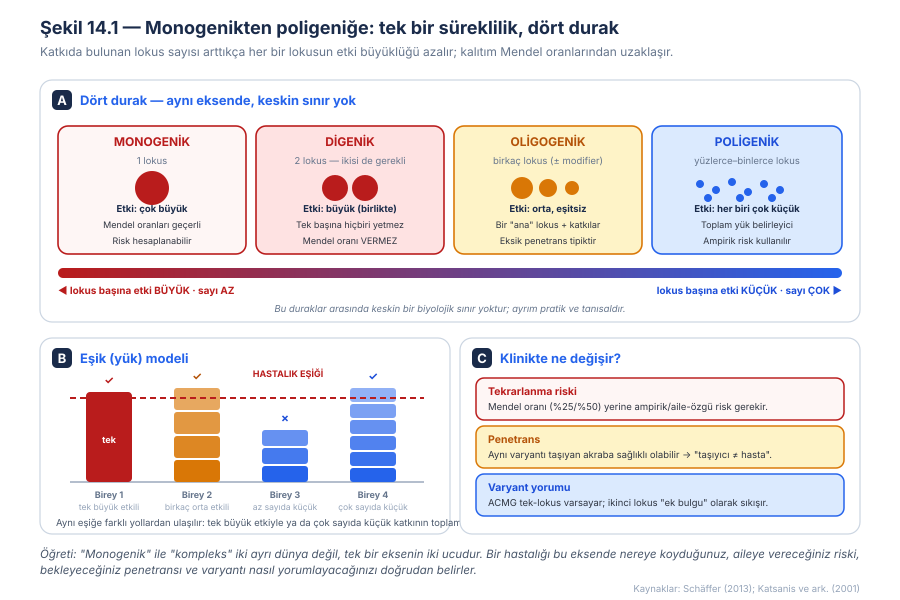
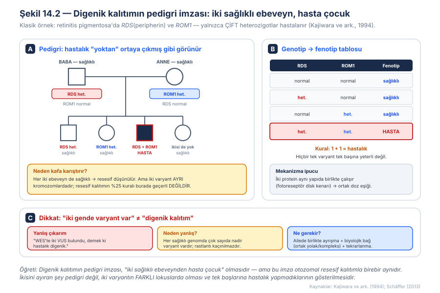
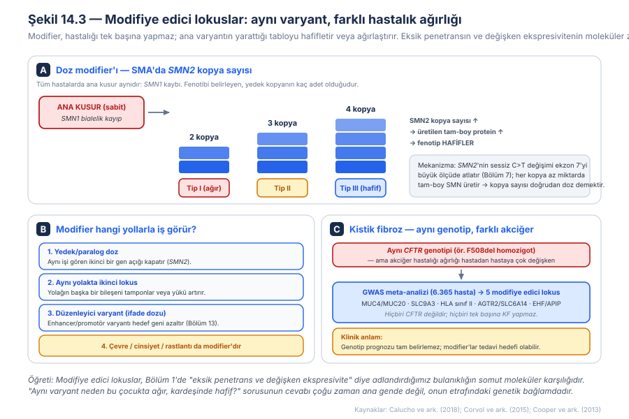
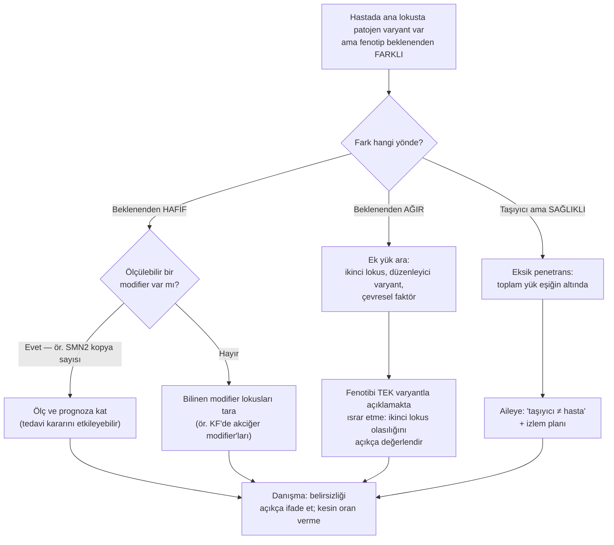
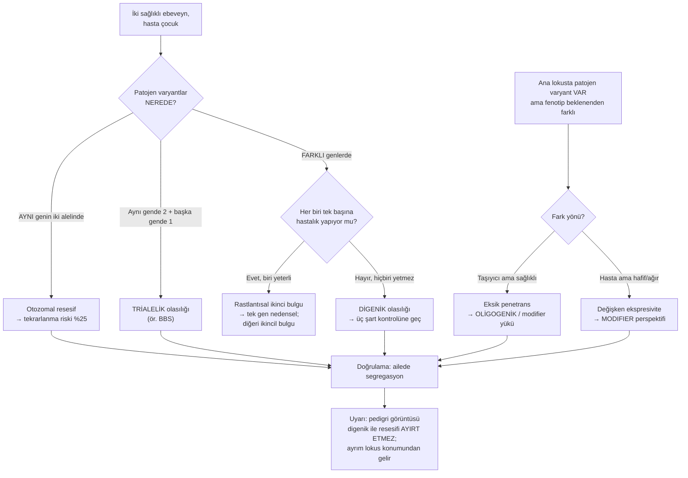
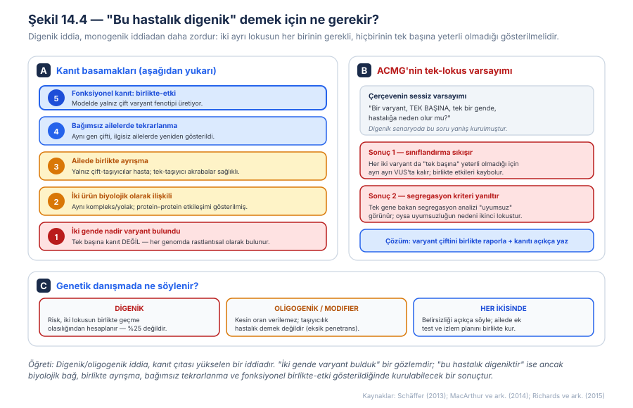
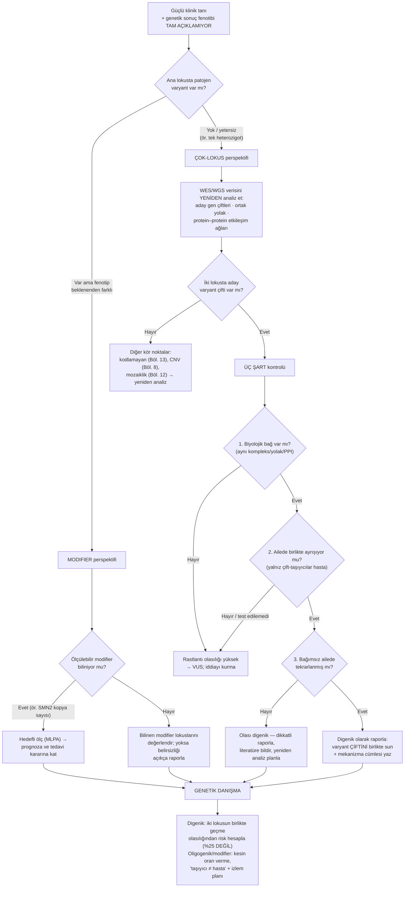

# Bölüm 14 — Digenik, Oligogenik Kalıtım ve Modifiye Edici Lokuslar

> **Bölümün çekirdek tezi:** Bu kitabın önceki on üç bölümü, örtük olarak tek bir varsayım üzerine kuruluydu: *bir hastalığın bir nedeni vardır.* Bu bölüm o varsayımı gevşetir. **Monogenik ve kompleks kalıtım iki ayrı dünya değil, tek bir eksenin iki ucudur**; arada digenik (iki lokusun ikisi de gerekli), oligogenik (birkaç lokusun eşitsiz katkısı) ve modifiye edici (ana varyantın etkisini hafifleten ya da ağırlaştıran ikinci lokus) senaryoları vardır. Bu eksende bir hastalığı nereye koyduğunuz üç şeyi birden belirler: aileye vereceğiniz **tekrarlanma riskini**, bekleyeceğiniz **penetransı** ve varyantı nasıl **yorumlayacağınızı**. Bölümün ikinci ve klinik olarak daha keskin tezi ise bir uyarıdır: **"iki gende varyant bulmak" ile "hastalık digeniktir" demek aynı şey değildir.** Her sağlıklı genom çok sayıda nadir varyant taşır; digenik iddia, monogenik iddiadan daha yüksek bir kanıt çıtası gerektirir. Bu bölüm ayrıca Bölüm 1'de "eksik penetrans ve değişken ekspresivite" diye adlandırdığımız bulanıklığa somut bir moleküler zemin verir: o bulanıklığın önemli bir kısmı, ana genin etrafındaki **genetik bağlamdır**.

> **Bu bölüm nasıl okunmalı?** Tıp öğrencileri için doğrusal okuma önerilir; süreklilik ve eşik modeli (Şekil 14.1) kurulmadan sonraki tartışmalar havada kalır. Klinisyenler ve genetik danışmanlar için 4. ve 8. başlıklar ile Şekil 14.4'ün C paneli doğrudan kullanılabilir; bu bölümün danışma pratiğine en çok dokunan kısmı orasıdır. Varyant yorumlayanlar için 6. başlık, ACMG çerçevesinin tek-lokus varsayımının nerede kırıldığını ele alır.

> 🖼️ **Görseller hakkında not:** Şekil 14.1–14.4 `assets/` klasöründe SVG olarak bulunur. Mermaid diyagramları metin içine gömülüdür.

---

## Öğrenme hedefleri

Bu bölümü tamamlayan okuyucu:
1. Monogenik–digenik–oligogenik–poligenik sürekliliğini tanımlar ve lokus sayısı ile etki büyüklüğü arasındaki ters ilişkiyi açıklar.
2. Digenik kalıtımı tanımlar, klasik örneğini (*RDS*/*ROM1*) açıklar ve otozomal resesif kalıtımdan neye bakarak ayırt edileceğini bilir.
3. Trialelik kalıtım kavramını açıklar ve Bardet-Biedl sendromu örneğinde kalıtım modelinin nasıl sorgulandığını yorumlar.
4. Modifiye edici lokusun tanımını verir ve dört ana mekanizmasını (yedek/paralog doz, aynı yolakta ikinci lokus, düzenleyici varyant, çevre/cinsiyet) sıralar.
5. *SMN2* kopya sayısının SMA fenotipini nasıl belirlediğini açıklar ve bunu doz–eşik mantığıyla ilişkilendirir.
6. Kistik fibrozda aynı *CFTR* genotipinin neden farklı akciğer hastalığı ağırlığı ürettiğini modifiye edici lokuslarla açıklar.
7. Eşik (yük) modelini açıklar ve aynı fenotipe farklı genetik mimarilerle ulaşılabileceğini gerekçelendirir.
8. Digenik/oligogenik bir iddiayı desteklemek için gereken kanıt basamaklarını sıralar ve "iki nadir varyant" gözleminin neden yetersiz olduğunu açıklar.
9. ACMG/AMP çerçevesinin tek-lokus varsayımının digenik senaryoda nasıl kırıldığını açıklar ve raporlama/danışma sonuçlarını yorumlar.

---

## 1. Kavramsal tanım

Mendel genetiğinin gücü, sadeliğinden gelir: bir gen, bir hastalık, hesaplanabilir bir risk. Bu kitabın buraya kadarki bölümleri de bu sadeliği korudu — mekanizmalar değişti (kayıp, kazanım, dominant-negatif, imprinting, mozaiklik), ama sorumlu lokus hep bir taneydi. Klinik pratikte ise sık sık bu modele oturmayan durumlarla karşılaşırız: patojen varyantı taşıdığı hâlde sağlıklı akrabalar, aynı varyantı taşıyan iki kardeşte çok farklı ağırlıkta hastalık, ya da tek bir gende bulunan varyantın fenotipi tam olarak açıklayamaması. Bu bölüm, bu boşluğun genetik mimariyle ilgili kısmını ele alır.

Kavramları netleştirerek başlayalım. **Digenik kalıtımda** hastalık, iki *farklı* lokustaki varyantların birlikte bulunmasını gerektirir; her iki varyant da gereklidir, hiçbiri tek başına yeterli değildir. Bu, otozomal resesif kalıtımdan kritik biçimde farklıdır: resesifte iki varyant **aynı** genin iki alelindedir; digenikte ise **farklı genlerde**, çoğu zaman farklı kromozomlardadır. **Oligogenik kalıtımda** katkıda bulunan lokus sayısı ikiden fazladır (tipik olarak birkaç tane) ve katkılar eşit değildir: genellikle bir "ana" lokus ile ona eşlik eden daha küçük etkili lokuslar bulunur. **Poligenik** uçta ise yüzlerce–binlerce lokus vardır, her birinin etkisi tek başına çok küçüktür ve hastalık toplam yükle belirlenir.

**Modifiye edici lokus (modifier)** ise bu spektrumun içinde ama ayrı bir kavramdır: modifier, hastalığı **tek başına yapmaz**; ana varyantın yarattığı tabloyu hafifletir veya ağırlaştırır. Yani modifier'ın işlevi hastalığı *başlatmak* değil, *renklendirmektir*. Bu ayrım klinik olarak önemlidir, çünkü modifier bir lokusta bulunan varyant tek başına raporlanacak bir "neden" değildir; ama prognozu ve bazen tedaviyi etkileyebilir.

Şekil 14.1'de gösterildiği gibi bu dört durak arasında keskin bir biyolojik sınır yoktur; ayrım pratik ve tanısaldır. Eksende sağa doğru gidildikçe lokus sayısı artar, lokus başına etki büyüklüğü azalır ve kalıtım Mendel oranlarından uzaklaşır.

Bu sürekliliği anlamanın en yararlı aracı **eşik (yük) modelidir**. Model şunu varsayar: hastalık, bireyin taşıdığı genetik (ve çevresel) yükün belli bir eşiği aşmasıyla ortaya çıkar. Bu bakış, aynı fenotipe **farklı genetik mimarilerle** ulaşılabileceğini doğal biçimde açıklar: bir birey tek büyük etkili bir varyantla eşiği aşarken, bir başkası çok sayıda küçük katkının toplamıyla aşabilir. Aynı model, neden bazı taşıyıcıların hasta olmadığını da açıklar — o birey eşiğin altında kalmıştır. Bu, Bölüm 3'te doz–eşik, Bölüm 11'de heteroplazmi–eşik olarak gördüğümüz mantığın **lokuslar arası** karşılığıdır.

| Kavram | Tanım | Klinik anlamı |
|---|---|---|
| Monogenik | Tek lokus; büyük etki | Mendel oranları geçerli; risk hesaplanabilir |
| **Digenik** | İki farklı lokus; **ikisi de gerekli**, biri yetmez | Mendel oranı vermez; iki lokusun birlikte geçme olasılığı hesaplanır |
| **Trialelik** | Bir lokusta iki + ikinci lokusta bir varyant | "Resesif" tablo aslında üçüncü alele bağımlı olabilir |
| **Oligogenik** | Birkaç lokus; eşitsiz katkı (± ana lokus) | Eksik penetrans tipiktir; kesin oran verilemez |
| Poligenik | Yüzlerce–binlerce lokus; her biri çok küçük | Ampirik risk; toplam yük belirleyici |
| **Modifier** | Hastalığı yapmaz; ağırlığını değiştirir | Prognoz ve bazen tedavi hedefi; tek başına "neden" değildir |
| Eşik (yük) modeli | Hastalık, toplam yük eşiği aşınca ortaya çıkar | Aynı fenotipe farklı mimarilerle ulaşılabilir |
| Epistazi | Bir lokusun etkisinin başka lokusa bağlı olması | Digenik/modifier etkilerin ortak istatistiksel adı |

---

## 2. Moleküler mekanizma

### 2.1 Digenik kalıtım: 1 + 1 = hastalık

Digenik kalıtımın ders kitabı örneği, tıbbi genetikte bu kavramın ilk net gösterimidir. Kajiwara, Berson ve Dryja, retinitis pigmentosalı üç ailede, birbiriyle bağlantısız iki fotoreseptör geninde — *peripherin/RDS* ve *ROM1* — varyantlar saptadılar ve kritik gözlemi yaptılar: **yalnızca her iki varyantı birden taşıyan (çift heterozigot) bireyler hastalanıyordu**; tek bir varyant taşıyan akrabalar sağlıklıydı (Kajiwara ve ark., 1994).

Şekil 14.2, bu örüntünün pedigrideki görünümünü ve neden kafa karıştırıcı olduğunu gösterir. Ailede iki sağlıklı ebeveynden hasta bir çocuk doğmuştur — bu, otozomal resesif kalıtımın klasik imzasıdır. Ancak burada iki varyant aynı genin iki alelinde değil, **iki ayrı gendedir**; dolayısıyla resesif kalıtımın %25 kuralı geçerli değildir. Riskin hesabı, iki bağımsız lokusun birlikte aktarılma olasılığından gider.

Mekanizma açısından bu örnek özellikle öğreticidir, çünkü rastgele iki gen değildir: peripherin/RDS ve ROM1, fotoreseptör dış segment disklerinin kenar yapısında **birlikte** görev alan proteinlerdir. Yani iki lokus aynı yapısal komplekste buluşur ve o kompleksin toplam işlevi için ortak bir doz eşiği vardır. Her iki alelin de yarı yarıya azalması, tek birinin azalmasının yapamadığı şeyi yapar: kompleksi eşiğin altına düşürür. **Digenik kalıtımın mekanik özü budur — iki lokus, ortak bir işlevsel havuzda toplanır.**

Bu gözlem, bir sonraki bölümde tekrar karşımıza çıkacak bir kanıt ölçütünü de doğurur: iki gen arasında gösterilebilir bir **biyolojik bağ** (aynı kompleks, aynı yolak, protein–protein etkileşimi) yoksa, digenik iddia zayıftır.

### 2.2 Trialelik kalıtım: kalıtım modelinin kendisi sorgulanınca

Digenik kavramının bir adım ötesi, Bardet-Biedl sendromunda (BBS) ortaya çıktı. BBS — pigmenter retina distrofisi, polidaktili, obezite, gelişim geriliği ve böbrek anomalileriyle giden bir siliyopati — klasik olarak otozomal resesif kabul ediliyordu. Katsanis ve arkadaşları 163 BBS ailesini *BBS2* ve *BBS6* için tarayınca beklenmedik bir tablo buldular: dört ailede etkilenmiş bireyler **üç mutant alel** taşıyordu; buna karşılık iki ailede *BBS2*'de iki mutant alel taşıyan ancak *BBS6* varyantı olmayan bireyler **etkilenmemişti**. Yazarlar buradan, BBS'nin tek-gen resesif bir hastalık olmayabileceğini ve en azından bazı ailelerde fenotibin ortaya çıkması için **üç mutant alel** gerekebileceğini öne sürdüler (Katsanis ve ark., 2001).

Bu bulgunun kavramsal ağırlığı, tek bir hastalığın ötesindedir. Burada sorgulanan şey bir genin patojenitesi değil, **kalıtım modelinin kendisidir**: aynı lokusta iki patojen alel taşıyan bir bireyin sağlıklı kalabilmesi, "resesif" etiketinin her zaman yeterli olmadığını gösterir. ⚠️ Trialelik kalıtımın BBS'deki kapsamı ve genelleştirilebilirliği literatürde tartışılmıştır; bu modelin her ailede geçerli olduğu varsayılmamalı, ancak kalıtım modelinin sorgulanabilir olduğu ilkesi korunmalıdır.

### 2.3 Modifiye edici lokuslar: aynı varyant, farklı ağırlık

Klinik pratikte en sık karşılaşılan durum ne saf digenik ne saf oligogeniktir; **ana bir varyant vardır ve fenotibin ağırlığı beklenenden farklıdır.** Bu farkın önemli bir kısmını modifiye edici lokuslar açıklar. Şekil 14.3, modifier'ın dört ana çalışma yolunu ve iki ders kitabı örneğini bir arada gösterir.

**Birinci yol, yedek/paralog doz.** Ana genin işini kısmen görebilen ikinci bir gen varsa, o genin kopya sayısı veya etkinliği fenotibi doğrudan belirler. Bunun en temiz örneği spinal musküler atrofidir (SMA) ve aşağıda ayrıntılandırılacaktır.

**İkinci yol, aynı yolakta ikinci bir lokus.** Ana kusurun bulunduğu biyolojik yolağın başka bir bileşenindeki varyasyon, sistemi tamponlayabilir ya da yükü artırabilir. Bu, digenik kalıtımla süreklidir; fark, ikinci lokusun *gerekli* olması ile yalnızca *etkileyici* olması arasındadır.

**Üçüncü yol, düzenleyici varyantlardır** ve Bölüm 13 ile doğrudan köprü kurar. Bir enhancer veya promotör varyantı, hedef genin ifade dozunu azaltarak ya da artırarak modifier gibi davranır. Bunun en iyi belgelenmiş örneği Hirschsprung hastalığındaki *RET* lokusudur: Emison ve arkadaşları, *RET*'in **intron 1'inde**, korunmuş bir enhancer-benzeri dizideki yaygın bir kodlamayan varyantın hastalık yatkınlığıyla anlamlı biçimde ilişkili olduğunu ve riske katkısının nadir kodlayan alellerinkinden **20 kat daha büyük** olduğunu gösterdiler. Bu varyant *in vitro* enhancer aktivitesini belirgin biçimde azaltıyor, düşük penetrans gösteriyor ve erkeklerle kadınlarda farklı genetik etkiler yaratıyordu — yani Hirschsprung'un karmaşık kalıtım örüntüsünün birkaç özelliğini birden açıklıyordu (Emison ve ark., 2005).

**Dördüncü yol genetik değildir ama unutulmamalıdır:** çevre, cinsiyet ve rastlantısal (stokastik) gelişimsel olaylar da modifier'dır. Emison çalışmasındaki cinsiyete bağlı etki farkı bunun somut bir örneğidir.

> **🔬 Deep-dive — *SMN2* kopya sayısı: modifier'ın en ölçülebilir hâli.** Spinal musküler atrofinin ana kusuru bütün hastalarda aynıdır: *SMN1*'in biallelik kaybı. Buna rağmen klinik tablo, doğumda solunum yetmezliğiyle giden Tip I'den, yürüyebilen ve erişkinliğe ulaşan Tip III'e kadar geniş bir aralıkta değişir. Bu değişkenliğin ana açıklayıcısı, insan genomunda *SMN1*'in neredeyse özdeş bir kopyası olarak bulunan **SMN2**'dir. *SMN2*, Bölüm 7'de ayrıntılandırdığımız sessiz bir C>T değişimi nedeniyle ekzon 7'yi büyük ölçüde atlar ve çoğunlukla kısa, işlevsiz bir protein üretir; ancak transkriptlerin küçük bir bölümü tam-boy SMN'e dönüşür. Dolayısıyla **her *SMN2* kopyası, hastaya az miktarda çalışan protein katar** — ve kopya sayısı arttıkça toplam doz eşiğe yaklaşır, fenotip hafifler. Calucho ve arkadaşları 625 ilişkisiz İspanyol hastayı analiz edip 1999'dan itibaren yayımlanmış çalışmalardaki 2.834 olguyu derleyerek toplam 3.459 hastalık bir veri seti oluşturdular ve *SMN2* kopya sayısı ile SMA tipi arasındaki ilişkiyi daha evrensel prognostik kurallar hâlinde ortaya koydular (Calucho ve ark., 2018). Bu örnek üç açıdan öğreticidir: **(1)** modifier burada bir dizi varyantı değil, bir **kopya sayısıdır** — yani Bölüm 8'deki doz mantığı modifier olarak iş görmektedir; **(2)** mekanizma splicing üzerinden çalışır (Bölüm 7), yani modifier etkiler kitabın önceki mekanizmalarını kullanır; **(3)** kopya sayısı bugün yalnızca prognoz için değil, **klinik çalışmalara hasta katmanlandırması ve yenidoğan taraması sonrası tedavi kararları** için de kullanılmaktadır — modifier bilgisinin doğrudan klinik karar değiştirdiği ender ve net bir örnektir.

### 2.4 Modifier'lar tek gende kalmaz: kistik fibroz

Kistik fibroz, "aynı genotip, farklı fenotip" sorusunun en iyi çalışılmış zeminidir. Bölüm 2'de gördüğümüz gibi *CFTR* genotipi, pankreas yetmezliği gibi bazı özellikleri iyi öngörür (Sosnay ve ark., 2013). Ancak hastalığın başlıca mortalite nedeni olan **akciğer hastalığının ağırlığı**, aynı *CFTR* genotipini taşıyan hastalar arasında bile çarpıcı biçimde değişkendir.

Corvol ve arkadaşları, 6.365 KF hastasını kapsayan bir genom çapında ilişkilendirme meta-analiziyle akciğer hastalığı değişkenliğiyle anlamlı biçimde ilişkili **beş lokus** tanımladılar: 3q29 (*MUC4/MUC20*), 5p15.3 (*SLC9A3*), 6p21.3 (HLA sınıf II), Xq22-q23 (*AGTR2/SLC6A14*) ve daha önce de bildirilmiş olan 11p12-p13 (*EHF/APIP*) (Corvol ve ark., 2015). Bu lokusların hiçbiri *CFTR* değildir ve hiçbiri tek başına kistik fibroz yapmaz; yaptıkları şey, var olan hastalığın seyrini değiştirmektir.

Buradan iki klinik sonuç çıkar. Birincisi, **genotip prognozu tam belirlemez** — aynı mutasyonu taşıyan iki hastaya aynı seyri vaat etmek yanlıştır. İkincisi ve daha umut verici olanı, modifiye edici lokusların **tedavi hedefi** olabilmesidir; hastalığın kendisini değil ama ağırlığını değiştiren yolaklar, farmakolojik müdahale için mantıklı adaylardır.

---

## 3. Varyant tipleri

Bu bölümde "varyant tipi" sorusu farklı sorulur: önemli olan varyantın moleküler sınıfı değil, **kalıtım mimarisindeki rolüdür**. Aşağıdaki tablo bu rolleri ve her birinin kanıt gereksinimini toplar.

| Rol | Tanım | Tek başına hastalık yapar mı? | Kanıt gereksinimi | Örnek |
|---|---|---|---|---|
| Tek nedensel varyant (monogenik) | Fenotibi tek başına açıklar | Evet | Standart ACMG | Kitabın Bölüm 2–13'ü |
| **Digenik çift** | İki lokus; ikisi de gerekli | Hayır (hiçbiri) | Biyolojik bağ + birlikte ayrışma + tekrarlanma | *RDS* + *ROM1* (Kajiwara 1994) |
| **Üçüncü alel (trialelik)** | Resesif çifte eklenen üçüncü varyant | Hayır | Aynı lokusta iki alelli sağlıklı bireylerin gösterilmesi | *BBS2* + *BBS6* (Katsanis 2001) |
| **Oligogenik katkı** | Birkaç lokusun eşitsiz katkısı | Hayır | Yük analizi; ana lokus + katkı lokusları | Siliyopatiler, bazı nörogelişimsel tablolar |
| **Modifier — paralog doz** | Yedek genin kopya sayısı/etkinliği | Hayır | Doz–fenotip korelasyonu (büyük seri) | *SMN2* kopya sayısı (Calucho 2018) |
| **Modifier — yolak lokusu** | Aynı yolakta tamponlayan/ağırlaştıran lokus | Hayır | GWAS veya aile-temelli ilişkilendirme | KF akciğer modifier'ları (Corvol 2015) |
| **Modifier — düzenleyici varyant** | İfade dozunu değiştiren kodlamayan varyant | Hayır (düşük penetrans) | Fonksiyonel (enhancer aktivitesi) + ilişkilendirme | *RET* intron 1 (Emison 2005) |
| **Poligenik yük** | Çok sayıda küçük etkili varyant toplamı | Hayır (tek tek) | Poligenik skor; ampirik risk | Kompleks hastalıklar |

Tablonun okunma biçimi şudur: yukarıdan aşağı inildikçe her bir varyantın tek başına taşıdığı bilgi azalır, buna karşılık iddiayı kurmak için gereken **popülasyon düzeyinde kanıt** artar. İkinci ve üçüncü satırlar için aile-temelli kanıt (birlikte ayrışma) belirleyiciyken, alt satırlar için büyük kohortlar ve istatistiksel ilişkilendirme gerekir. Klinik laboratuvar pratiğinde ilk satır rutin olarak raporlanır; ortadaki satırlar dikkatli bir gerekçeyle raporlanabilir; son satırlar ise tanısal rapordan çok araştırma ve prognoz bağlamına aittir.

---

## 4. Klinik fenotipe dönüşüm

### 4.1 Tekrarlanma riski: Mendel oranının bittiği yer

Bu bölümün genetik danışmaya en doğrudan etkisi, **tekrarlanma riskinin hesaplanma biçimidir**. Monogenik bir hastalıkta risk, kalıtım kalıbından türetilen sabit bir orandır: otozomal resesifte %25, otozomal dominantta %50. Digenik kalıtımda bu oranlar geçerli değildir; risk, **iki bağımsız lokusun birlikte aktarılma olasılığından** gider ve ebeveynlerin genotiplerine göre değişir. Şekil 14.2'deki senaryoda babası *RDS*, annesi *ROM1* heterozigotu olan bir çiftin her çocuğunda iki varyantın birden geçme olasılığı, iki bağımsız yarı olasılığın çarpımıdır — yani resesif kalıtımdaki %25'ten farklı bir hesap kurulmalıdır.

Oligogenik ve modifier'a bağlı tablolarda ise durum daha zordur: **kesin bir oran verilemez.** Bu, danışmada dürüstçe söylenmesi gereken bir belirsizliktir. Böyle durumlarda risk, aile öyküsüne dayalı ampirik verilerle ve mümkünse benzer ailelerden derlenmiş serilerle ifade edilir.

### 4.2 Penetrans: taşıyıcı olmak hasta olmak değildir

Oligogenik mimarinin en tipik klinik yansıması **eksik penetranstır**. Ana lokusta patojen varyantı taşıyan bir birey, ek katkılar eşiğe ulaşmadığı için sağlıklı kalabilir. Bölüm 1'de bu olguyu tanımlamış ve Cooper ve arkadaşlarının derlemesine dayanmıştık (Cooper ve ark., 2013); bu bölüm o tanımın altına mekanizma koyar — penetransın bir kısmı, ana genin dışındaki genetik bağlamdır.

Aynı olgu monogenik diyabet tablolarında da iyi belgelenmiştir. Monogenik diyabet formlarında eksik penetrans ve değişken ekspresivite yaygın olarak görülür; bu, hem tanıyı hem hastalık yönetimini zorlaştırır. Ancak bu değişkenliği yaratan modifiye edici varyantların tanımlanması yalnızca bir sorun değil, aynı zamanda bir fırsattır: **koruyucu** genetik varyantların belirlenmesi, daha yaygın diyabet formlarının mekanizmalarını aydınlatabilir ve yeni tedavi stratejilerine işaret edebilir (Li ve ark., 2023).

### 4.3 Ekspresivite: "aynı varyant, neden kardeşimde daha hafif?"

Klinikte en sık sorulan sorulardan biridir ve ailelerin en çok zorlandığı belirsizliktir. Cevabın bir kısmı Bölüm 12'de gördüğümüz mozaikliktir, bir kısmı Bölüm 11'deki heteroplazmidir; ama nükleer, konstitüsyonel bir varyantın söz konusu olduğu durumlarda cevap çoğu zaman **modifiye edici genetik bağlamdır**. SMA'da bu bağlam ölçülebilir bir sayıya (*SMN2* kopya sayısı) indirgenebildiği için istisnai biçimde nettir; çoğu hastalıkta ise henüz böyle bir "sayaç" yoktur.

### 4.4 Ne zaman digenik/oligogenik düşünmeli?

Şüpheyi tetikleyen örüntüler şunlardır: klinik olarak güçlü bir tanıda tek gende bulunan varyantın **fenotibi tam açıklayamaması**; ailede kalıtım kalıbının hiçbir Mendel modeline oturmaması; aynı varyantı taşıyan akrabalar arasında **açıklanamayan penetrans farkı**; bilinen bir resesif hastalıkta iki patojen alel taşıyan sağlıklı bireylerin gösterilmesi; ve fenotibin bilinen tabloya göre olağandışı biçimde ağır olması. Bu örüntüler tek başlarına tanı koydurmaz, ancak analiz stratejisini genişletmeyi gerektirir.

Aşağıdaki akış, eldeki gözlemlerden hangi mimarinin düşünülmesi gerektiğini ayırt etmeye yarar. Dikkat edilmesi gereken nokta, ilk dallanmanın **varyantların aynı gende mi farklı genlerde mi olduğu** sorusu olmasıdır; pedigri görüntüsü tek başına ayırt edici değildir.

---

## 5. Tanısal testlerle ilişkisi

Bu bölümde testin kendisinden çok **analiz stratejisi** belirleyicidir: aynı WES/WGS verisi, tek-gen varsayımıyla analiz edildiğinde negatif, çift-lokus/yük perspektifiyle analiz edildiğinde bilgilendirici olabilir. Ayrıca aile örneklerinin (trio veya genişletilmiş aile) değeri bu bölümde diğer bütün bölümlerden daha yüksektir.

| Test | Bu mekanizmayı yakalar mı? | Sınırlılığı |
|------|----------------------------|-------------|
| **WES** | Kısmen — iki farklı gendeki kodlayan varyantları aynı anda görebilir; digenik keşiflerin çoğu bu yolla yapılmıştır | Analiz tek-gen filtreleriyle yapılırsa çift-lokus örüntüsü gözden kaçar; kodlamayan modifier'ları göremez |
| **Short-read WGS** | Evet — kodlayan + kodlamayan modifier'ları (ör. *RET* intron 1) kapsar | Yorum sorunu büyür: her genomda çok sayıda nadir varyant vardır; seçicilik şart |
| **Long-read WGS** | Evet; ayrıca kopya sayısı/paralog ayrımını (ör. *SMN1* vs *SMN2*) daha güvenilir çözer | Maliyet ve erişim |
| **Array-CGH / SNP array** | Kısmen — modifier olarak iş gören CNV'leri ve kopya sayısı farklarını yakalar | Tek nükleotid düzeyindeki modifier'ları göremez |
| **MLPA** | **Evet — hedefliyse çok değerli.** *SMN2* kopya sayısı tayininde standart yaklaşımdır | Yalnız tasarlanan lokus; genom geneli bilgi vermez |
| **RNA-seq** | Dolaylı — modifier'ın ifade üzerindeki etkisini ve alel dengesizliğini gösterebilir | Doğru doku gerekir (Bölüm 13); nedensellik kurmaz |
| **Methylation array** | Genellikle hayır | Bu mekanizmalar için yerleşik tanısal rolü yoktur |
| **Karyotip** | Hayır | Çözünürlük yetersiz |
| **(mimariye özgü) Aile analizi ± hedefli doz testi** | **Evet — belirleyici.** Genişletilmiş aile segregasyonu digenik iddianın omurgasıdır; *SMN2* gibi doz modifier'ları hedefli ölçülür | Aile üyelerine erişim gerekir; tek olgu (singleton) analizinde en zayıf nokta budur |

> **Bu mekanizmayı hangi test yakalar? (özet):** Digenik/oligogenik şüphesinde belirleyici olan yeni bir cihaz değil, **veriye bakış biçimi ve aile örnekleridir**. Pratik sıra: WES/WGS verisini tek-gen filtresinin ötesinde (aday gen çiftleri, ortak yolak, yük analizi) yeniden değerlendir; **genişletilmiş aileden örnek** al ve birlikte ayrışmayı test et; ölçülebilir bir doz modifier'ı varsa (ör. *SMN2*) hedefli olarak ölç.

> **🟦 Klinikte dikkat — Aile örneği burada lükse değil, zorunluluğa yakındır:** Digenik bir iddianın en güçlü klinik kanıtı, **yalnızca çift-taşıyıcıların hasta, tek-taşıyıcı akrabaların sağlıklı olduğunun gösterilmesidir**. Tek bir hastadan (singleton) elde edilen veriyle bu gösterilemez. Bu nedenle çift-lokus şüphesi doğduğunda, mümkün olan en geniş aile örneklemesi hedeflenmelidir.

---

## 6. Varyant yorumlama açısından önemi (ACMG/ClinGen)

ACMG/AMP çerçevesinin (Richards ve ark., 2015) bu bölümle ilgili en önemli özelliği, hiçbir kriterde açıkça yazılmayan ama her kriterin altında yatan bir varsayımdır: **değerlendirilen soru "bu varyant, tek başına, tek bir gende hastalığa neden olur mu?"dur.** Digenik bir senaryoda bu soru yanlış kurulmuştur ve çerçeve iki noktadan sıkışır (Şekil 14.4).

**Birinci sıkışma sınıflandırmadadır.** Digenik bir çiftte hiçbir varyant tek başına yeterli olmadığı için, her biri ayrı ayrı değerlendirildiğinde çoğu zaman VUS'ta kalır. İki varyantın **birlikte** taşıdığı bilgi, tek tek değerlendirmede kaybolur. Pratik çözüm, varyantları ayrı ayrı sınıflandırıp raporda **çift olarak, gerekçesiyle birlikte** sunmaktır; rapor metni "bu iki varyant birlikte değerlendirildiğinde..." biçiminde açık bir mekanizma cümlesi içermelidir.

**İkinci sıkışma segregasyon kriterindedir.** Tek gene odaklanan bir segregasyon analizi, digenik bir ailede "uyumsuz" sonuç verir: varyantı taşıyan ama hasta olmayan akrabalar görülür ve bu, varyant aleyhine kanıt gibi yorumlanır. Oysa uyumsuzluğun nedeni varyantın masumiyeti değil, **ikinci lokusun hesaba katılmamasıdır**. Bu, digenik ailelerde gerçek nedensel varyantların yanlışlıkla dışlanmasına yol açabilecek sistematik bir hatadır.

Bu zorluklar karşısında dayanılacak ilke, gen–hastalık ilişkisinin geçerliliğini değerlendirmek için geliştirilen genel standartlardan gelir: bir nedensellik iddiası, kanıtın türü ve gücüne göre derecelendirilmeli, tek bir gözleme dayandırılmamalıdır (MacArthur ve ark., 2014). Digenik iddia için bu, Şekil 14.4A'daki basamaklar hâlinde somutlaşır — ve kritik nokta, **birinci basamağın tek başına kanıt olmamasıdır**.

> **🟦 Klinikte dikkat — "İki gende varyant bulduk" bir gözlemdir, sonuç değildir:** Her sağlıklı bireyin genomunda çok sayıda nadir varyant bulunur; herhangi iki aday gende birer nadir varyantın rastlantısal olarak bir arada bulunması kaçınılmazdır. Digenik iddiayı kurmak için en az şu üçü gerekir: **(1)** iki ürün arasında gösterilebilir **biyolojik bağ** (aynı kompleks/yolak; protein–protein etkileşimi), **(2)** ailede **birlikte ayrışma** — yalnız çift-taşıyıcılar hasta, **(3)** **bağımsız ailelerde tekrarlanma**. Bunlara fonksiyonel birlikte-etki gösterimi eklenirse iddia güçlenir. Schäffer'in derlemesi, yayımlanmış insan digenik kalıtım örneklerinde en çok işe yarayan iki bilgi kaynağının **aday gen bilgisi** ve **protein–protein etkileşim bilgisi** olduğunu; buna karşılık pozisyonel bağlantı analizinin bu alanda büyük ölçüde başarısız kaldığını göstermiştir (Schäffer, 2013).

> **🔬 Deep-dive — Yüksek verimli dizileme neden digenik keşfi otomatik olarak kolaylaştırmadı?** Sezgisel beklenti şuydu: bir örnekte aynı anda iki gendeki varyantları görebilen bir teknoloji, digenik kalıtımın kanıtlanmasını da kolaylaştırmalıydı. Schäffer, 2012 sonuna kadarki literatürü tarayarak bu beklentinin gerçekleşmediğini gösterdi: dar bir tanım kullanıldığında insan digenik kalıtımı için kanıt taşıyan fenotip sayısı, monogenik hastalıklardaki binlerce bildirimin yanında yalnızca birkaç düzineyle sınırlıydı; üstelik yüksek verimli dizilemenin kullanıldığı örnek sayısı son derece azdı (Schäffer, 2013). Nedeni istatistikseldir: monogenik bir keşifte aranan şey "bir gende beklenenden fazla varyant birikimi"dir; digenik keşifte ise **gen çiftleri** aranır ve olası çift sayısı gen sayısının karesiyle büyür. Bu, çoklu karşılaştırma yükünü ve rastlantısal birlikteliği dramatik biçimde artırır. Bu yüzden alanın ilerlemesi ham dizileme gücünden çok, **arama uzayını daraltan önsel bilgiden** (bilinen etkileşim ağları, ortak yolaklar, aday gen listeleri) gelmektedir. Klinik karşılığı nettir: bir digenik hipotezi, önce biyolojiyle daraltılmalı, sonra veriyle sınanmalıdır — tersi değil.

---

## 7. Pediatrik genetikten klinik örnekler

**Digenik retinitis pigmentosa — kavramın doğduğu yer.** Üç ilgisiz ailede, birbirine bağlantısız *peripherin/RDS* ve *ROM1* genlerinde varyantlar saptanmış; yalnızca her iki varyantı birden taşıyan çift heterozigotlar retinitis pigmentosa geliştirmiştir (Kajiwara ve ark., 1994). **Öğreti:** iki proteinin aynı yapısal komplekste buluşması, digenik iddiayı mekanik olarak anlaşılır kılan şeydir; biyolojik bağ olmadan digenik iddia zayıftır.

**Bardet-Biedl sendromu — kalıtım modelinin sorgulanması.** 163 aileden oluşan bir kohortta dört ailede etkilenmiş bireylerin *BBS2* ve *BBS6*'da toplam üç mutant alel taşıdığı; buna karşılık iki ailede *BBS2*'de iki mutant alel taşıyan bireylerin **etkilenmemiş** olduğu gösterilmiştir (Katsanis ve ark., 2001). **Öğreti:** "iki patojen alel = hasta" denklemi her resesif hastalıkta otomatik geçerli değildir; sağlıklı iki-alelli bireylerin varlığı, ek bir lokusun aranması gerektiğinin en güçlü işaretidir.

**Spinal musküler atrofi — ölçülebilir modifier.** Ana kusur bütün hastalarda *SMN1* kaybıdır; klinik tipi belirleyen esas değişken *SMN2* kopya sayısıdır. 625 İspanyol hastanın analizi ve 2.834 bildirilmiş olgunun derlenmesiyle oluşturulan 3.459 hastalık veri seti, kopya sayısı ile SMA tipi arasındaki ilişkiyi prognostik kurallar hâlinde ortaya koymuştur (Calucho ve ark., 2018). **Öğreti:** modifier her zaman soyut bir "genetik bağlam" değildir; bazen doğrudan ölçülebilen ve klinik kararı değiştiren bir sayıdır. SMA'da kopya sayısı tayini, yenidoğan taraması sonrası tedavi kararlarında ve klinik çalışma katmanlandırmasında kullanılmaktadır.

**Kistik fibroz — aynı genotip, farklı akciğer.** 6.365 hastalık GWAS meta-analizinde akciğer hastalığı ağırlığıyla ilişkili beş lokus tanımlanmıştır: *MUC4/MUC20*, *SLC9A3*, HLA sınıf II, *AGTR2/SLC6A14* ve *EHF/APIP* (Corvol ve ark., 2015). **Öğreti:** hastalığı **başlatan** gen ile hastalığın **seyrini belirleyen** genler farklıdır; bu ayrım hem prognoz konuşmasını hem tedavi hedefi arayışını değiştirir.

**Hirschsprung hastalığı — kodlamayan modifier ve düşük penetrans.** *RET*'in intron 1'indeki korunmuş enhancer-benzeri dizide yer alan yaygın bir kodlamayan varyant, hastalık yatkınlığıyla anlamlı biçimde ilişkilidir ve riske katkısı nadir kodlayan alellerden yaklaşık 20 kat büyüktür; varyant *in vitro* enhancer aktivitesini azaltır, düşük penetrans gösterir ve cinsiyete göre farklı etki yaratır (Emison ve ark., 2005). **Öğreti:** bu örnek Bölüm 4 (RET'in iki yüzü), Bölüm 13 (kodlamayan/enhancer) ve bu bölümü (modifier/düşük penetrans) tek bir lokusta birleştirir — ve yaygın, düşük penetranslı varyantların hem sık hem nadir hastalıkların temelinde yatabileceğini gösterir.

**Monogenik diyabet — modifiye edici varyantlar fırsat olarak.** Monogenik diyabet formlarında eksik penetrans ve değişken ekspresivite yaygındır; bunları belirleyen genetik modifiye edicilerin tanımlanması hem tanı zorluğunu açıklar hem de **koruyucu** varyantların keşfi yoluyla yeni tedavi hedeflerine işaret edebilir (Li ve ark., 2023). **Öğreti:** modifier araştırması yalnızca "neden bu hasta farklı?" sorusunu yanıtlamaz; koruyucu yönü bulmak, doğanın kendi tedavi denemesini okumaktır.

---

## 8. Sık yapılan hatalar ve klinikte dikkat

> **🔴 Sık yapılan hata kutusu**
> 1. **"İki gende VUS bulundu, hastalık digeniktir."** Bu bir gözlemdir, sonuç değil. Her genomda çok sayıda nadir varyant vardır; biyolojik bağ, birlikte ayrışma ve tekrarlanma gösterilmeden digenik denemez.
> 2. **"Ebeveynler sağlıklı, o hâlde otozomal resesif."** Digenik kalıtımın pedigri imzası resesifle **birebir aynıdır**. Ayrım pedigriden değil, varyantların farklı lokuslarda olmasından ve tek başlarına hastalık yapmadıklarının gösterilmesinden gelir.
> 3. **"Varyantı taşıyan sağlıklı akraba var, demek ki varyant patojen değil."** Eksik penetrans oligogenik mimarilerde kuraldır. Segregasyon uyumsuzluğu, ikinci bir lokusun varlığına işaret ediyor olabilir.
> 4. **"Digenik hastalıkta risk %25'tir."** Değildir. Risk, iki bağımsız lokusun birlikte aktarılma olasılığından hesaplanır ve ebeveyn genotiplerine bağlıdır.
> 5. **"Modifier bulundu, bu hastalığın nedeni."** Modifier hastalığı **yapmaz**; ağırlığını değiştirir. Tanısal raporda "neden" olarak sunulması yanlıştır.
> 6. **"Aynı *CFTR* genotipi, aynı seyir."** Akciğer hastalığı ağırlığı modifiye edici lokuslarla belirgin biçimde değişir; genotipten kesin prognoz vaat edilmemelidir.
> 7. **"SMA tanısı kondu, *SMN2* kopya sayısına gerek yok."** Kopya sayısı prognozu ve tedavi kararlarını doğrudan etkiler; SMA'da modifier ölçümü tanının ayrılmaz parçasıdır.
> 8. **"Tek hastadan digenik kalıtım kanıtlanabilir."** Kanıtlanamaz. Birlikte ayrışmayı göstermek için aile örnekleri, iddiayı sağlamlaştırmak için bağımsız aileler gerekir.

> **🟦 Klinikte dikkat kutusu**
> - Klinik tanı güçlü ama tek gendeki varyant fenotibi tam açıklamıyorsa, veriyi **tek-gen filtresinin ötesinde** yeniden değerlendirin (aday gen çiftleri, ortak yolak, yük perspektifi).
> - Çift-lokus şüphesinde **genişletilmiş aile örneklemesi** planlayın; singleton veriyle bu iddia kurulamaz.
> - SMA'da *SMN2* kopya sayısı, KF'de bilinen modifiye edici bilgiler prognoz konuşmasına dâhil edilmelidir.
> - Danışmada belirsizliği açıkça ifade edin: oligogenik/modifier tablolarda **kesin bir tekrarlanma oranı verilemez** ve bunu söylemek, uydurma bir kesinlikten daha iyidir.
> - "Taşıyıcı ≠ hasta" mesajı, eksik penetranslı ailelerde en sık gereken ve en sık atlanan cümledir; izlem planıyla birlikte verilmelidir.
> - Modifiye edici bulgular tanısal rapordan ayrı, **prognoz/araştırma** başlığı altında sunulmalı; ailenin bunu "ikinci bir hastalık" olarak algılamaması sağlanmalıdır.

---

## 9. Klinik pratikte karar algoritması

---

## 10. Kaynaklar

> **Atıf / doğrulama notu:** Bu bölümün bibliyografik verileri PubMed üzerinden doğrulanmıştır; her kaynağın PMID ve DOI'si tek tek teyit edilmiştir. (Metin içinde yazar-yıl, kaynakçada DOI-link kullanılır.)

1. **Schäffer AA (2013).** Digenic inheritance in medical genetics. *Journal of Medical Genetics* 50(10):641–652. **PMID: 23785127** · DOI: [10.1136/jmedgenet-2013-101713](https://doi.org/10.1136/jmedgenet-2013-101713) — *Kullanım amacı: Bölümün ana çerçeve kaynağı; digenik kalıtımın tanımı, kanıt türleri, aday gen ve protein–protein etkileşim bilgisinin rolü, HTS'nin beklenen katkıyı neden sağlamadığı.*

2. **Kajiwara K, Berson EL, Dryja TP (1994).** Digenic retinitis pigmentosa due to mutations at the unlinked peripherin/RDS and ROM1 loci. *Science* 264(5165):1604–1608. **PMID: 8202715** · DOI: [10.1126/science.8202715](https://doi.org/10.1126/science.8202715) — *Kullanım amacı: Landmark — insan digenik kalıtımının ilk net gösterimi; yalnızca çift heterozigotların etkilenmesi.*

3. **Katsanis N, Ansley SJ, Badano JL, ve ark. (2001).** Triallelic inheritance in Bardet-Biedl syndrome, a Mendelian recessive disorder. *Science* 293(5538):2256–2259. **PMID: 11567139** · DOI: [10.1126/science.1063525](https://doi.org/10.1126/science.1063525) — *Kullanım amacı: Landmark — trialelik kalıtım; iki patojen alel taşıyan sağlıklı bireylerin gösterilmesi ve kalıtım modelinin sorgulanması.*

4. **Calucho M, Bernal S, Alías L, ve ark. (2018).** Correlation between SMA type and SMN2 copy number revisited: An analysis of 625 unrelated Spanish patients and a compilation of 2834 reported cases. *Neuromuscular Disorders* 28(3):208–215. **PMID: 29433793** · DOI: [10.1016/j.nmd.2018.01.003](https://doi.org/10.1016/j.nmd.2018.01.003) — *Kullanım amacı: Klinik/modifier — *SMN2* kopya sayısının SMA tipini belirlemesi; 3.459 hastalık derleme; prognostik ve tedavi kararına etkisi.*

5. **Corvol H, Blackman SM, Boëlle PY, ve ark. (2015).** Genome-wide association meta-analysis identifies five modifier loci of lung disease severity in cystic fibrosis. *Nature Communications* 6:8382. **PMID: 26417704** · DOI: [10.1038/ncomms9382](https://doi.org/10.1038/ncomms9382) — *Kullanım amacı: Klinik/modifier — 6.365 hastada beş modifiye edici lokus; aynı *CFTR* genotipinde değişken akciğer hastalığı.*

6. **Emison ES, McCallion AS, Kashuk CS, ve ark. (2005).** A common sex-dependent mutation in a RET enhancer underlies Hirschsprung disease risk. *Nature* 434(7035):857–863. **PMID: 15829955** · DOI: [10.1038/nature03467](https://doi.org/10.1038/nature03467) — *Kullanım amacı: Mekanizma/klinik — kodlamayan modifier; düşük penetrans; cinsiyete bağlı etki; nadir alellere göre ~20 kat büyük risk katkısı (Bölüm 13 köprüsü).*

7. **Li M, Popovic N, Wang Y, Chen C, Polychronakos C (2023).** Incomplete penetrance and variable expressivity in monogenic diabetes; a challenge but also an opportunity. *Reviews in Endocrine and Metabolic Disorders* 24(4):673–684. **PMID: 37165203** · DOI: [10.1007/s11154-023-09809-1](https://doi.org/10.1007/s11154-023-09809-1) — *Kullanım amacı: Klinik/kavramsal — monogenik hastalıkta eksik penetrans ve değişken ekspresivitenin modifiye edicilerle ilişkisi; koruyucu varyant fırsatı.*

8. **Cooper DN, Krawczak M, Polychronakos C, Tyler-Smith C, Kehrer-Sawatzki H (2013).** Where genotype is not predictive of phenotype: towards an understanding of the molecular basis of reduced penetrance in human inherited disease. *Human Genetics* 132(10):1077–1130. **PMID: 23820649** · DOI: [10.1007/s00439-013-1331-2](https://doi.org/10.1007/s00439-013-1331-2) — *Kullanım amacı: Kavramsal — eksik penetrans ve değişken ekspresivitenin moleküler temelleri. Kaynak kütüğünden yeniden kullanılmıştır (Bölüm 1 köprüsü).*

9. **MacArthur DG, Manolio TA, Dimmock DP, ve ark. (2014).** Guidelines for investigating causality of sequence variants in human disease. *Nature* 508(7497):469–476. **PMID: 24759409** · DOI: [10.1038/nature13127](https://doi.org/10.1038/nature13127) — *Kullanım amacı: Metodoloji — nedensellik iddiasının kanıt gücüne göre derecelendirilmesi; digenik iddiada kanıt çıtası. Kaynak kütüğünden yeniden kullanılmıştır.*

10. **Richards S, Aziz N, Bale S, ve ark. (2015).** Standards and guidelines for the interpretation of sequence variants: a joint consensus recommendation of the American College of Medical Genetics and Genomics and the Association for Molecular Pathology. *Genetics in Medicine* 17(5):405–424. **PMID: 25741868** · DOI: [10.1038/gim.2015.30](https://doi.org/10.1038/gim.2015.30) — *Kullanım amacı: Guideline — tek-lokus varsayımı ve segregasyon kriterinin digenik senaryoda kırılması. Kaynak kütüğünden yeniden kullanılmıştır.*

11. **Sosnay PR, Siklosi KR, Van Goor F, ve ark. (2013).** Defining the disease liability of variants in the cystic fibrosis transmembrane conductance regulator gene. *Nature Genetics* 45(10):1160–1167. **PMID: 23974870** · DOI: [10.1038/ng.2745](https://doi.org/10.1038/ng.2745) — *Kullanım amacı: Klinik örnek — *CFTR* genotip–fenotip ilişkisinin sınırları. Kaynak kütüğünden yeniden kullanılmıştır (Bölüm 2 köprüsü).*

> **İkincil/destekleyici kaynak notu:** OMIM, ClinVar, gnomAD ve DIDA benzeri digenik varyant veri tabanları bu bölümde yalnızca destekleyici/başvuru kaynağı olarak anılmıştır; hiçbiri ana mekanizma kaynağı olarak kullanılmamıştır.

---

## ✅ Bölüm öz-denetim tablosu

| Kriter | Durum | Not |
|--------|-------|-----|
| Mekanizma doğru anlatıldı mı? | ✅ | Süreklilik → eşik/yük modeli → digenik (ortak işlevsel havuz) → trialelik → modifier'ın dört yolu zinciri kuruldu |
| Klinik bağlantı kuruldu mu? | ✅ | Tekrarlanma riski, penetrans ve ekspresivite üzerinden; "taşıyıcı ≠ hasta" mesajı |
| Varyant tipi ile mekanizma ilişkilendirildi mi? | ✅ | 8 satırlık **rol** tablosu (nedensel/digenik/trialelik/oligogenik/3 tip modifier/poligenik) + kanıt gereksinimi |
| Pediatrik örnek verildi mi? | ✅ | Digenik RP, BBS, SMA (*SMN2*), KF modifier'ları, Hirschsprung (*RET*), monogenik diyabet — hepsi kaynaklı |
| Test seçimi açıklandı mı? | ✅ | Standart 8 satırlık tablo + aile analizi/hedefli doz satırı; "belirleyici olan analiz stratejisi ve aile örneği" vurgusu |
| ACMG/ClinGen bağlantısı doğru mu? | ✅ | Tek-lokus varsayımı; sınıflandırma sıkışması ve segregasyon kriterinin yanıltması (Richards 2015; MacArthur 2014; Schäffer 2013) |
| Kaynaklar PMID/DOI ile verildi mi? | ✅ | 11/11 kaynak PMID + DOI-link + kullanım amacı ile (7 yeni doğrulama + 4 kütükten yeniden kullanım) |
| Spekülatif iddialar işaretlendi mi? | ✅ | Trialelik kalıtımın BBS'deki kapsamı/genelleştirilebilirliği ⚠️ ile işaretlendi |
| Kaynak uydurma riski var mı? | ✅ Yok | 7 yeni PMID/DOI bu oturumda PubMed MCP ile tek tek doğrulandı; 4'ü daha önce doğrulanmış kütük kaydı |
| Görsel/şema/algoritma desteği yeterli mi? (≥3 SVG, ≥2 Mermaid) | ✅ | **4 SVG + 3 Mermaid**; tüm SVG'ler PNG'ye render edilip gözle denetlendi (eşik paneli yeniden tasarlandı) |

---

### 🔎 Bölüm sonu kaynak doğrulama komutu (zorunlu)
> "Bu bölümdeki tüm kaynakların PMID/DOI bilgisini kontrol et. PMID veya DOI veremediğin kaynağı çıkar. Kaynağı olmayan iddiayı 'kaynak doğrulaması gerekli' olarak işaretle."
>
> **Bu bölüm için durum:** **11/11 kaynak PMID+DOI doğrulandı** (7'si bu oturumda PubMed MCP ile; 4'ü — Cooper 2013, MacArthur 2014, Richards 2015, Sosnay 2013 — Bölüm_00 kaynak kütüğünden yeniden kullanıldı).
>
> **İşaretlenen iddialar:** (1) Trialelik kalıtımın Bardet-Biedl sendromundaki kapsamı ve genelleştirilebilirliği ⚠️ tartışmalıdır; modelin her ailede geçerli olduğu varsayılmamalıdır. (2) Monogenik–digenik–oligogenik–poligenik ayrımının "keskin biyolojik sınırı olmadığı" kavramsal bir çerçevedir. (3) Digenik kalıtımda tekrarlanma riskinin ebeveyn genotiplerine göre hesaplanması ilkesel olarak verilmiştir; aileye özgü hesap her olguda ayrıca yapılmalıdır.
