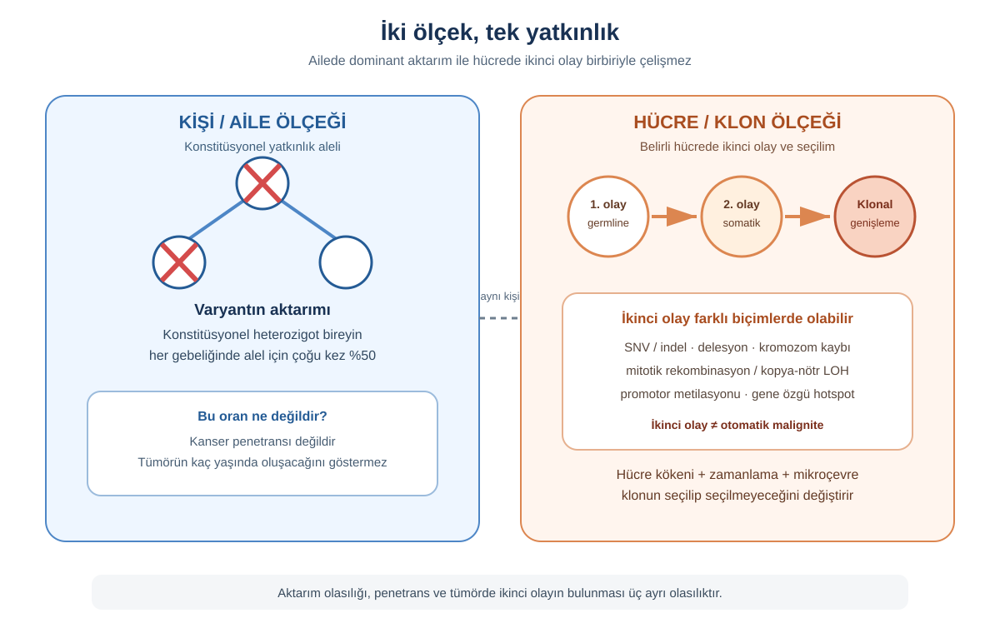
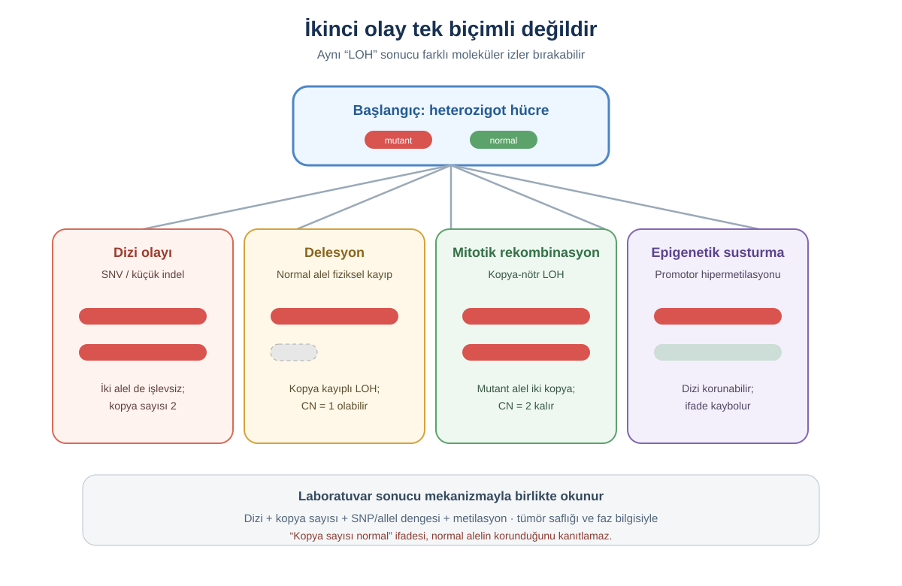
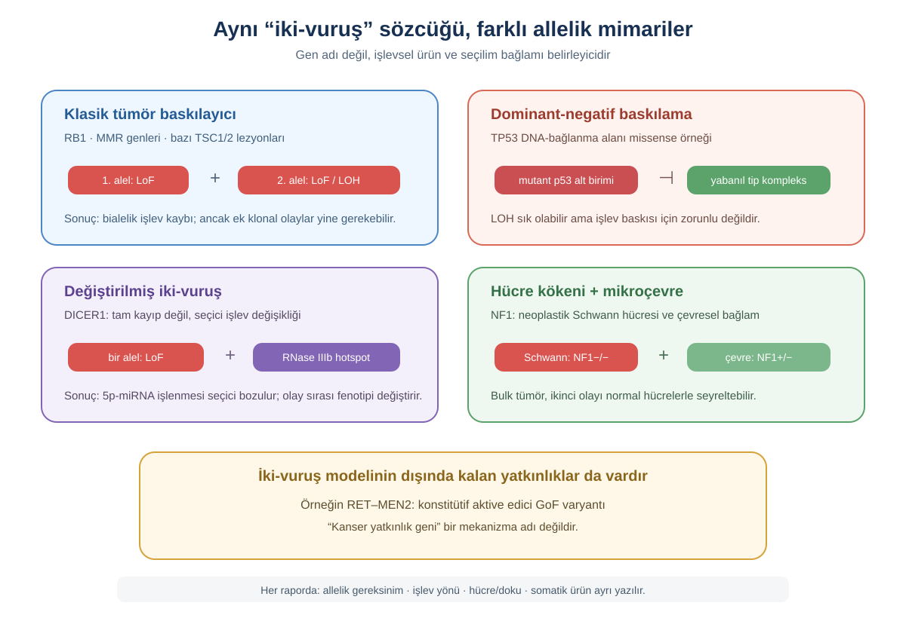
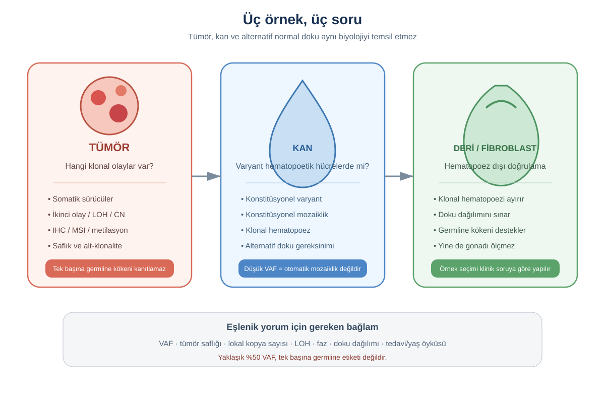
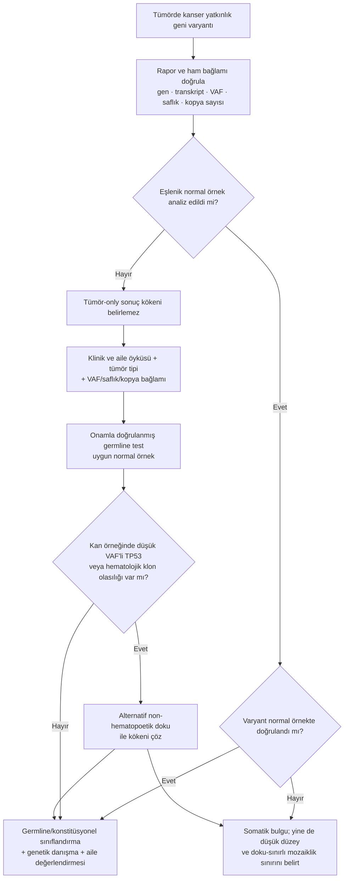
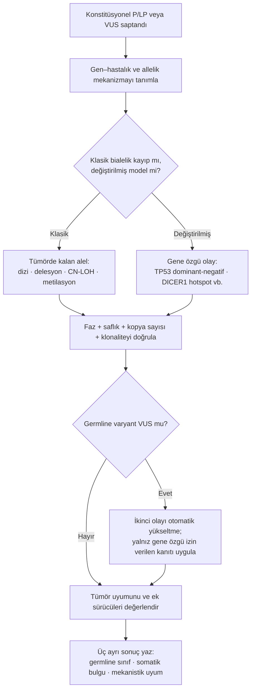
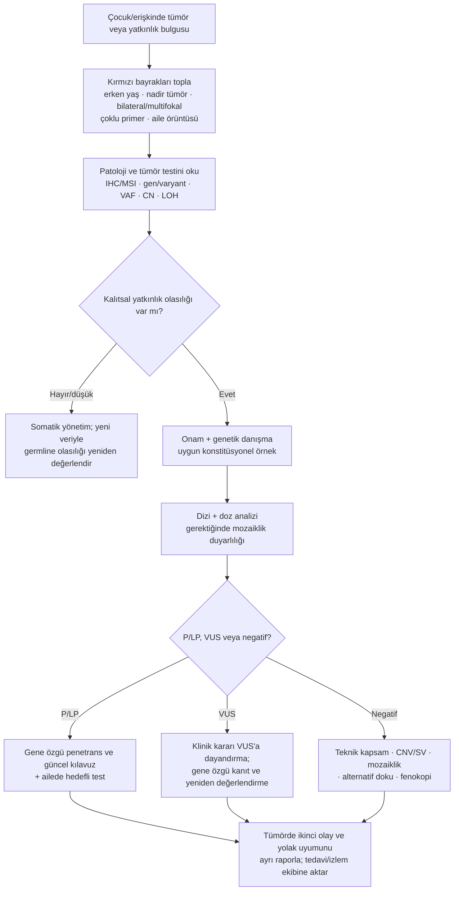

# Bölüm 16 — Kalıtsal Kanser Yatkınlığı ve İkinci Vuruş: Germline Zeminden Somatik Tümöre

> **Bölümün çekirdek tezi:** Kalıtsal kanser yatkınlığında çocuk, çoğu zaman tümörle değil **tümöre giden yolun bir basamağı önceden aşılmış olarak** doğar. Konstitüsyonel varyant ailede otozomal dominant aktarılabilir; fakat klasik tümör baskılayıcı modelinde tek bir hücrenin tümöre yönelmesi, kalan işlevsel aleli etkileyen somatik bir olay ve çoğu kez ek klonal değişimler gerektirir. Bu nedenle doğru okuma, “hangi gen?” sorusunun ötesine geçip **ilk olay nerede, ikinci olay hangi hücrede, hangi mekanizmayla ve hangi örnekte gösterildi?** sorularını birlikte yanıtlamalıdır (Knudson, 1971; Li ve ark., 2017).

> **📘 Okuma katmanları.** Bu kitabın birincil hedefi **yandal asistanı ve klinik genomik çalışan hekimdir**; genel pediatrist ve tıp öğrencisi ikincil hedef kitledir. Bölümü kendi katmanınızdan okuyabilirsiniz:
> · **① Temel — tıp öğrencisi:** §1–2 ve Şekil 16.1–16.2; aile düzeyindeki dominant aktarım ile hücre düzeyindeki iki olayın neden çelişmediğini kavrayın.
> · **② Klinik — pediatrist ve klinisyen:** §4–5, §7 ve Şekil 16.4; erken yaş, çoklu primer, bilateral/multifokal tümör ve tümör raporundaki olası germline bulgunun nasıl ele alınacağını izleyin.
> · **③ İleri düzey — yandal asistanı, laboratuvar, varyant yorumlayan:** §2.3, §5–6 ve Tablo 16.3–16.5; LOH'nin moleküler biçimlerini, *TP53* ve *DICER1* istisnalarını, tümör–normal eşlenik analizi ve kan örneğindeki klonal hematopoez tuzağını çözümleyin.

> **Bu bölüm nasıl okunmalı?** Bölüm bir kanser tarama protokolü değildir. Yaşa ve gene özgü izlem aralıkları hızla güncellendiği ve sağlık sistemi bağlamına göre değiştiği için burada sabit programlar verilmez; amaç, germline yatkınlıktan somatik ürüne uzanan mekanizmayı, doğru örnek seçimini ve rapor mantığını öğretmektir (Monahan ve ark., 2020; Schultz ve ark., 2018).

> 🖼️ **Görseller hakkında not:** Şekil 16.1–16.4 `assets/` klasöründe SVG olarak bulunur. Mermaid diyagramları metin içine gömülüdür.

---

## Öğrenme hedefleri

Bu bölümü tamamlayan okuyucu:

1. Aile düzeyindeki otozomal dominant yatkınlık ile hücre düzeyindeki bialelik işlev kaybını birbirinden ayırabilir.
2. Germline “ilk olay” ile somatik “ikinci olay”ın kalıtsal ve sporadik tümörlerdeki sırasını açıklayabilir.
3. Heterozigotluk kaybını kopya kaybı ile eş anlamlı kullanmadan delesyon, kromozom kaybı, mitotik rekombinasyon/kopya-nötr LOH, nokta varyantı ve epigenetik susturmayı ayırt edebilir.
4. Klasik iki-vuruş modelinin *TP53*, *DICER1*, *APC*, *TSC1/2* ve *NF1* bağlamlarında neden değiştirilmesi gerektiğini açıklayabilir.
5. Tümör dokusu, kan ve alternatif normal dokunun yanıtladığı farklı soruları; VAF, tümör saflığı ve kopya sayısının yorum üzerindeki etkisini ilişkilendirebilir.
6. Tümör-only bir bulgunun germline kabul edilemeyeceğini ve kandaki düşük VAF'li *TP53* bulgusunun konstitüsyonel mozaiklik dışında klonal hematopoezi de gösterebileceğini fark edebilir.
7. *RB1, APC*, MMR genleri, *TP53, DICER1, TSC1/2* ve *NF1* örneklerini mekanizma–fenotip–test–danışma zinciriyle çözümleyebilir.
8. Germline varyant sınıflandırması, somatik varyantın klinik anlamı ve tümörde ikinci olayın gösterilmesini birbirine karıştırmadan raporlayabilir.

---

## 1. Kavramsal tanım

Kalıtsal kanser yatkınlığında temel ayrım **kişinin genotipi** ile **tümör klonunun genotipi** arasındadır. Konstitüsyonel patojenik varyant, kişinin çok sayıda dokusunda bulunur ve aile içinde aktarılabilir; tümör ise bu zemin üzerinde belirli bir hücrede biriken somatik değişimlerin ürünüdür. Knudson'ın 48 retinoblastoma olgusu ve yayımlanmış serilerden geliştirdiği istatistiksel modelde kalıtsal biçimde ilk olay germline, ikinci olay somatik; kalıtsal olmayan biçimde ise iki olay da aynı somatik hücre soyunda gerçekleşiyordu (Knudson, 1971).

Bu model, “hastalık otozomal dominant mı, resesif mi?” sorusunun neden tek ölçekli yanıtı olmadığını gösterir. **Yatkınlık**, konstitüsyonel patojenik varyantı taşıyan kişi ve ailesi düzeyinde dominant aktarılabilir; klasik tümör baskılayıcı modelinde **klonal tümör başlangıcı** ise ilgili hücrede iki alelin işlevinin ortadan kalkmasını gerektirebilir. Bir taşıyıcının bütün hücreleri tümör değildir: hücrelerin çoğu hâlâ ikinci olayı taşımadığı için gen ürününün bir bölümünü korur. Germline ilk olayın etkisi, çok sayıda hedef hücreyi tek bir ek olayla kritik eşiği aşabilecek duruma getirmesidir (Knudson, 1971; Lohmann ve ark., 2011).

**Tablo 16.1 — Kalıtsal kanser mekanizmasının temel kavramları**

| Kavram | Mekanistik tanım | Klinik/rapor anlamı |
|---|---|---|
| Germline/konstitüsyonel olay | Döllenmede bulunan veya erken postzigotik dönemde birden çok dokuya yayılan varyant | Kişinin diğer dokularında ve germ hücrelerinde bulunabilir; aile açısından aktarım sorusu doğurur |
| Somatik olay | Döllenmeden sonra sınırlı bir hücre soyunda oluşan değişim | Tümör dokusuna sınırlı olabilir; tek başına kalıtsal risk kanıtı değildir |
| Birinci olay | Yatkınlık zeminini oluşturan ilk patojenik değişim | Kalıtsal olguda çoğunlukla germline; sporadik olguda somatik olabilir |
| İkinci olay | Aynı yolakta veya kalan alelde klonal avantaj sağlayan ek olay | SNV/indel, delesyon, kromozom kaybı, kopya-nötr LOH, promotor metilasyonu veya gene özgü başka bir olay olabilir |
| LOH | Başlangıçta heterozigot olan lokusta iki farklı alelin ayırt edilebilirliğinin kaybolması | Kopya kaybıyla **veya kopya sayısı değişmeden** oluşabilir; SNP ve kopya sayısı birlikte okunur |
| Penetrans | Varyant taşıyan bireylerin belirli yaş/koşulda fenotip geliştirme olasılığı | %50 aktarım olasılığıyla aynı şey değildir; gen, varyant, cinsiyet, yaş ve tümör tipine göre değişebilir |
| Doku seçiciliği | Konstitüsyonel olay her yerdeyken lezyonların belirli hücre/dokularda oluşması | İkinci olayın zamanlaması, hücre kökeni, yolak gereksinimi ve mikroçevre birlikte değerlendirilir |

*Tablo dayanağı:* Knudson (1971), Lohmann ve ark. (2011), Li ve ark. (2017), Garcia-Linares ve ark. (2011) ve Yang ve ark. (2008).

> **🔬 Deep-dive — LOH bir sonuçtur, tek bir olay değildir.** “LOH saptandı” ifadesi, bir alelin mutlaka fiziksel olarak silindiğini söylemez. Kalan normal aleli içeren bölgenin delesyonu kopya kayıplı LOH yapabilir; mitotik rekombinasyon ise germline mutant alelin iki kopyada kaldığı **kopya-nötr LOH** oluşturabilir. *NF1* ilişkili dermal nörofibromlarda ayrıntılı SNP-array çalışması, LOH olaylarının yaklaşık %38'ini delesyonların, %62'sini mitotik rekombinasyonun oluşturduğunu göstermiştir; dolayısıyla yalnız kopya sayısına bakan bir test ikinci grubu kaçırabilir (Garcia-Linares ve ark., 2011).

---

## 2. Moleküler mekanizma

### 2.1. Germline ilk olay neden tümörü erkene ve çoğulluğa iter?

Sporadik bir retinoblastoma hücresinin aynı soyda iki uygun olayı ardışık olarak edinmesi gerekir. Germline *RB1* patojenik varyantı taşıyan çocukta ise retinal hücrelerin büyük bölümü ilk olayı zaten taşır; her hedef hücre için yalnız ek somatik olay gerekir. Bu olasılık farkı, kalıtsal retinoblastomada daha erken başlangıç, bilateralite ve bir göz içinde birden çok bağımsız odağın neden birlikte görülebildiğini açıklayan klasik modeldir (Knudson, 1971; Lohmann ve ark., 2011).

Bu anlatım “ikinci olay olur olmaz malign tümör oluşur” anlamına gelmez. İki olay bazı gen–doku çiftlerinde başlangıç için güçlü bir dar boğazdır; fakat klonal genişleme, mikroçevre, epigenetik durum ve ek sürücü olaylar lezyonun ortaya çıkışını, ilerlemesini ve malign davranışını değiştirebilir. *APC* ilişkili poliplerde germline varyantın konumu, kalan β-katenin düzenleme kapasitesini optimize eden farklı somatik ikinci ve hatta üçüncü olayların seçilmesiyle ilişkilidir; dolayısıyla “iki vuruş” sayısal bir sayaçtan çok **seçilmiş bir işlev düzeyi** olarak okunmalıdır (Sieber ve ark., 2006).

### 2.2. İkinci olayın moleküler yolları

Kalan alelin işlevi birçok yoldan kaybedilebilir. Küçük dizi varyantı veya indel doğrudan proteini bozabilir; intragenik ya da daha büyük delesyon aleli kaldırabilir; bütün kromozomun kaybı ve kalan kromozomun yeniden kopyalanması kopya-nötr homozigotluk oluşturabilir; mitotik rekombinasyon mutant aleli distal segment boyunca homozigotlaştırabilir; promotor hipermetilasyonu diziyi değiştirmeden transkripsiyonu susturabilir. Retinoblastoma için tümör analizinde dizi, MLPA/kopya sayısı, LOH ve metilasyon yöntemlerinin birlikte önerilmesi, bu mekanistik çeşitliliğin doğrudan tanısal karşılığıdır (Lohmann ve ark., 2011).

**Tablo 16.2 — İkinci olayın biçimi ile beklenen laboratuvar izi**

| İkinci olay | Tümörde beklenen iz | Öncelikli yöntem | Kritik sınır |
|---|---|---|---|
| SNV/küçük indel | Aynı gende ikinci patojenik dizi varyantı | Derin tümör dizileme + faz/allelik inceleme | İki varyantın aynı alelde (*cis*) olması bialelik kayıp göstermez |
| Ekzon/gen delesyonu | Kopya sayısı kaybı ve sıklıkla allelik dengesizlik | NGS-CNV, MLPA, array, WGS | Tümör saflığı düşükse kopya kaybı seyrelir |
| Kromozom kaybı + yeniden kopyalanma | Kopya sayısı 2 iken geniş homozigotluk | SNP-array veya allel-özgü tümör analizi | Array-CGH tek başına kopya-nötr LOH'yi göstermez |
| Mitotik rekombinasyon | Krossover noktasından telomere uzanan kopya-nötr LOH | SNP-array/WGS allel dengesi | “Normal kopya sayısı” normal allel yapısı demek değildir |
| Promotor hipermetilasyonu | Dizi korunurken ifade kaybı | Lokus-özgü metilasyon testi; bağlama göre IHC | Germline metilasyon ile tümöre özgü metilasyon ayrılmalıdır |
| Kromozomal yeniden düzenlenme | Gen kesintisi, kopya kaybı veya karmaşık allelik yapı | WGS, gerektiğinde FISH/karyotip | Kırılma noktasının ve fazın gösterilmesi gerekir |
| Gene özgü işlev-değiştirici ikinci olay | Örn. *DICER1* RNase IIIb hotspot missense | Tümör dizileme + gene özgü işlevsel/uzman-panel çerçevesi | Tam işlev kaybı varsayımı yanlış olabilir |

*Tablo dayanağı:* Lohmann ve ark. (2011), Garcia-Linares ve ark. (2011), Brenneman ve ark. (2015), Hatton ve ark. (2023) ve Li ve ark. (2017).

### 2.3. Klasik modelin değiştirildiği mimariler

*TP53*, “tümör baskılayıcıysa iki alel de mutlaka silinir” kestirmesinin neden güvenli olmadığını gösterir. DNA-bağlanma bölgesindeki birçok missense p53 proteini, yabanıl tip alt birimlerin işlevini dominant-negatif biçimde baskılayabilir; dolayısıyla heterozigot hücre, basit haploinsufficiency'den daha ağır bir işlev kaybı yaşayabilir. İzogenik insan lösemi hücreleri, doygun mutagenez ve fare modellerini birleştiren çalışma, DNA-bağlanma bölgesi missense varyantlarında dominant-negatif seçilimi gösterirken LOH'nin sık fakat zorunlu olmadığını da vurgulamıştır (Boettcher ve ark., 2019). Bu nedenle germline *TP53* varyantı, güncel gene özgü uzman-panel ölçütleriyle sınıflandırılmalıdır; yalnız “tümör baskılayıcı + kesici/missense” etiketi yeterli değildir (Fortuno ve ark., 2021).

*DICER1* daha farklı bir değiştirilmiş iki-vuruş modelidir. Tipik mimaride alellerden birinde işlev kaybı, diğerinde RNase IIIb alanındaki belirli hotspot kodonlardan birini etkileyen missense olay bulunur; ikinci olay proteini tümüyle yok etmek yerine 5p-miRNA işlenmesini seçici olarak bozar. Pleuropulmoner blastoma/DICER1 sendromu çalışmaları, bialelik tam işlev kaybının tipik olmadığını ve hotspot olayın gelişimsel zamanlamasının fenotipi değiştirdiğini göstermiştir (Brenneman ve ark., 2015). ClinGen DICER1 VCEP de germline varyant yorumunda bu tümör-özgü “işlev kaybı + RNase IIIb hotspot” birleşimini ayrı kanıt mimarisi olarak tanımlar (Hatton ve ark., 2023).

*TSC1/2* ve *NF1* ise “ikinci olay var mı?” sorusunun doku ve hücre kökeninden ayrı sorulamayacağını gösterir. On altı renal anjiyomiyolipomun genomik analizinde tümörlerin çoğunda *TSC2* ikinci olayları veya kopya-nötr LOH saptanmış, aynı bireydeki farklı lezyonların bağımsız klonal kökenleri gösterilmiştir (Giannikou ve ark., 2016). Bağımsız bir dokuz anjiyomiyolipom serisinde de örneklerin çoğunda *TSC2* varyantı ve sıklıkla *TSC2* bölgesinde LOH bulunmuş, taranan diğer yaygın genomik olaylar saptanmamıştır (Qin ve ark., 2011). *NF1*'de bialelik kayıp nörofibromun neoplastik Schwann hücresi bileşeninde bulunabilir; fakat fizyolojik fare modelinde Schwann hücresi LOH'si tek başına yeterli olmamış, heterozigot kemik iliği kökenli hücrelerin oluşturduğu mikroçevre tümör ilerlemesi için gerekli bulunmuştur (Yang ve ark., 2008). Böylece doku seçiciliği yalnız “ikinci olay hangi organda oldu?” ile değil, **hangi hücrede ve hangi çevrede seçildi?** sorusuyla açıklanır.

> **🏷️ Pedagojik sentez — “ilk olay → ikinci olay → seçilim bağlamı” üçlüsü.** Bu üçlü, literatürde bu adla yerleşik bir kanser sınıflandırması değildir. İlk/ikinci olay kavramı Knudson modelinden, allelik ve dokuya özgü örnekler ise *RB1, APC, TP53, DICER1, TSC1/2* ve *NF1* çalışmalarından gelir; bunların tek okuma şemasında gruplanması kitabın editöryal sentezidir.

---

## 3. Varyant tipleri

Kalıtsal kanser geninde varyant tipini görmek, mekanizmayı tek başına çözmez. Bir nonsense veya frameshift varyant, işlev kaybının hastalık mekanizması olduğu uygun gen/transkriptte germline yatkınlık oluşturabilir; fakat NMD'den kaçan ürün, dominant-negatif etki veya gene özgü hotspot mekanizması olasılığı ayrıca değerlendirilir. *TP53* ve *DICER1* uzman-panel spesifikasyonlarının genel ACMG/AMP kurallarını gene göre değiştirmesi bunun pratik sonucudur (Fortuno ve ark., 2021; Hatton ve ark., 2023).

| Varyant/olay tipi | Olası germline anlamı | Tümörde sorulacak ek soru | Örnek |
|---|---|---|---|
| Kesici SNV/indel | İşlev kaybı mekanizmasında yatkınlık aleli olabilir | Kalan alel kayıp mı; NMD bekleniyor mu? | *RB1, APC, TSC1/2, NF1, DICER1* |
| Missense | LoF, dominant-negatif, GoF veya nötr olabilir | Domain/hotspot, LOH ve işlevsel yön ne? | *TP53* DNA-bağlanma alanı; *DICER1* RNase IIIb |
| Ekzon/gen delesyonu | Germline ilk olay olabilir | Tümörde ikinci kopya olayı ve faz nedir? | *RB1, NF1, TSC2* |
| Promotor/düzenleyici olay | İfade kaybı yapabilir | Konstitüsyonel mi tümöre özgü mü? | MMR yolunda *MLH1* metilasyon ayrımı |
| Kopya-nötr LOH | Genellikle somatik ikinci olay | Hangi alel iki kopyaya çıktı? | *NF1, TSC2* |
| GoF hotspot | İki-vuruş modeli gerektirmeyebilir | Aynı alel yönü germline hastalık mekanizması mı? | *RET*–MEN2 sınır örneği |
| Düşük VAF'li kan bulgusu | Konstitüsyonel mozaiklik olabilir; klonal hematopoez de olabilir | Alternatif normal dokuda var mı? | Özellikle *TP53* |

Bu son satır önemlidir: kan, her zaman “germline'ın kusursuz temsilcisi” değildir. Germline testinde düşük allel fraksiyonuyla saptanan *TP53* varyantlarının bir bölümü yaşa veya tedaviye bağlı klonal hematopoezden kaynaklanabilir; Weitzel ve arkadaşlarının serisinde çoklu dokuların karşılaştırılması, somatik kökenli sonuçların kalıtsal Li-Fraumeni sonucu gibi yanlış yorumlanabildiğini göstermiştir (Weitzel ve ark., 2018). Dolayısıyla düşük VAF'li kan bulgusunda yanak sürüntüsü de hematopoetik hücre içerebildiğinden, klinik bağlama göre kültüre deri fibroblastı veya başka uygun non-hematopoetik doku gerekebilir.

---

## 4. Klinik fenotipe dönüşüm

### 4.1. Aile öyküsü neden bazen güçlü, bazen sessizdir?

Konstitüsyonel yatkınlık varyantı ailede aktarılabilir; ancak tümörü oluşturacak somatik olayın olasılığı, gerçekleştiği hücre, yaş ve ek seçilim bağlamı kişiden kişiye değişir. Bu nedenle aynı varyantı taşıyan akrabalarda farklı tümör tipleri, farklı başlangıç yaşları veya hiç tümör gelişmemesi mümkündür. *DICER1* yatkınlığında düşük penetrans ve geniş fenotip; *TP53* ilişkili yatkınlıkta geniş tümör spektrumu, “ailede aynı kanser yoksa varyant önemsizdir” çıkarımını geçersiz kılar (Schultz ve ark., 2018; Fortuno ve ark., 2021).

Kalıtsal yatkınlığı düşündüren klinik işaretler — çok erken başlangıç, aynı kişide çoklu primerler, bilateral/multifokal tümör, nadir tümör, aynı aile tarafında uyumlu örüntü — bir **test seçme sinyali** olabilir; fakat tek başına germline patojenik varyant kanıtı değildir. Benzer biçimde aile öyküsünün olmaması, de novo olay, küçük aile, düşük/yaşa bağlı penetrans, ebeveyn mozaikliği veya eksik bilgi nedeniyle kalıtsal zemini dışlamaz (Lohmann ve ark., 2011; Schultz ve ark., 2018).

### 4.2. Doku seçiciliği: varyant her yerdeyse tümör neden her yerde değildir?

Konstitüsyonel varyantın çok sayıda dokuda bulunması, bütün dokuların aynı biyolojik eşiğe sahip olduğu anlamına gelmez. Retinal gelişim penceresi *RB1* kaybına, periferik sinir Schwann hücre soyu *NF1* kaybına, böbrek/perivasküler epiteloid hücre bağlamı *TSC1/2* kaybına farklı biçimde yanıt verir. *NF1* modelindeki Schwann hücresi–heterozigot mikroçevre etkileşimi ve *TSC2* ilişkili farklı anjiyomiyolipomların bağımsız ikinci olayları, doku seçiciliğinin yalnız gen adıyla açıklanamayacağını gösterir (Yang ve ark., 2008; Giannikou ve ark., 2016).

### 4.3. İkinci olay fenotipi nasıl dallandırır?

Aynı germline zemin üzerinde ikinci olayın türü ve zamanlaması, lezyon sayısını ve dağılımını değiştirebilir. *DICER1*'de germline işlev kaybı üzerine nadir bir RNase IIIb hotspot olayının eklenmesi ile erken embriyoda hotspot mozaikliği üzerine daha geniş hedefli bir işlev kaybı olayının eklenmesi aynı olasılığa sahip değildir; hotspot mozaikliği daha erken ve çok odaklı hastalıkla ilişkilendirilmiştir (Brenneman ve ark., 2015; Schultz ve ark., 2018). Bu, “mozaiklik daha hafiftir” genellemesinin kanser yatkınlığında da güvenli olmadığını gösterir.

---

## 5. Tanısal testlerle ilişkisi

Kalıtsal kanser değerlendirmesinde örnek, sorunun parçasıdır. Konstitüsyonel örnek “varyant kişinin normal dokularında var mı?” sorusunu; tümör “hangi somatik olaylar klonu oluşturdu?” sorusunu; eşlenik analiz ise “hangi bulgu germline, hangisi somatik ve allelik yapı nasıl?” sorusunu yanıtlar. Tümör-only dizileme, bu ayrımı tek başına kesin yapamaz; yaklaşık %50 VAF germline olasılığını düşündürebilir ama tümör saflığı, lokal kopya sayısı ve LOH aynı görünümü somatik bir olayla da üretebilir (Li ve ark., 2017; Mandelker ve ark., 2019).

**Tablo 16.3 — Standart testlerin kalıtsal kanser mekanizmasında yanıtladığı soru**

| Test | Bu mekanizmayı yakalar mı? | Sınırlılığı |
|---|---|---|
| **WES** | Germline ve tümörde kodlayan SNV/küçük indelleri; uygun hatla bazı CNV'leri yakalar | Derin intronik/düzenleyici olaylar, dengeli SV ve düşük VAF sınırlı; tümör-only ise kökeni ayırmaz |
| **Short-read WGS** | SNV/indel, CNV, birçok SV ve allel dengesini birlikte inceleyebilir | Tümör saflığı/heterojenliği ve tekrar bölgeleri yorumu zorlaştırır; germline eşlenik olmadan köken kesinleşmez |
| **Long-read WGS** | Karmaşık SV, faz, tekrar/GC bakımından zor bölgeler ve bazı metilasyon değişikliklerinde allelik yapıyı çözebilir | Yüksek maliyet, biyoinformatik gereksinim ve SNV performansı nedeniyle rutin klinik kullanımı henüz sınırlıdır |
| **Array-CGH / SNP array** | Kopya kaybı/kazancı; SNP-array ayrıca geniş kopya-nötr LOH'yi gösterebilir | Küçük dizi varyantını yakalamaz; düşük tümör saflığı duyarlılığı azaltır; array-CGH tek başına CN-LOH'yi göstermez |
| **MLPA** | Hedef gende ekzon/gen düzeyi delesyon-duplikasyonu yakalar | Hedef dışını ve kopya-nötr LOH'yi göstermez; allelik faz sınırlıdır |
| **RNA-seq** | Splice bozukluğu, allel-özgü ifade ve bazı füzyonları gösterebilir | Uygun doku/ifade gerekir; ikinci olayın DNA kökenini tek başına belirlemez |
| **Methylation array** | Genom çapında metilasyon örüntülerini, episignature ve bazı epivaryantları inceleyebilir | Dokuya özgü/tümöre özgü metilasyon, hücre karışımı ve lokus-özgü doğrulama ayrıca değerlendirilmelidir; DNA'daki nedeni tek başına göstermez |
| **Karyotip** | Büyük kromozom kayıp/kazançları ve yeniden düzenlenmeleri gösterebilir | Küçük/intragenik olayları ve kopya-nötr LOH'yi kaçırır; çözünürlüğü düşüktür |
| **Tümör IHC / MSI** | MMR protein kaybı veya mikrosatellit instabilitesiyle yolak düzeyinde tarama sağlar | Hangi germline varyantın bulunduğunu göstermez; sporadik *MLH1* metilasyonu gibi nedenler ayrıştırılmalıdır |
| **Eşlenik tümör–normal dizileme** | Germline/somatik ayrımı, ikinci olay ve allelik yapıyı en doğrudan biçimde birleştirir | Uygun onam, doğrulanmış germline raporlama hattı ve “normal” örneğin biyolojisine dikkat gerekir |

*Tablo dayanağı:* Lohmann ve ark. (2011), Li ve ark. (2017), Mandelker ve ark. (2019), Monahan ve ark. (2020), Weitzel ve ark. (2018), Aref-Eshghi ve ark. (2019) ve Olivucci ve ark. (2024).

> **Bu mekanizmayı hangi test yakalar? (özet):** Tek bir test değil, **eşlenmiş sorular** gerekir: germline dizi + doz analizi yatkınlık alelini; tümör dizileme + allel-özgü kopya/LOH analizi ikinci olayı; gerektiğinde metilasyon, IHC/MSI veya alternatif normal doku kökeni ve yolak sonucunu açıklar (Li ve ark., 2017; Lohmann ve ark., 2011).

**Algoritma 16.1 — Tümör raporundaki yatkınlık geni bulgusundan germline sorusuna**

> **🟦 Klinikte dikkat — tümör raporu kalıtsal tanı raporu değildir.** Tümörde patojenik görünen bir *TP53, APC* veya MMR geni varyantı somatik olabilir. Tersine, tümör raporunda “somatik” başlığı altında yer alması da germline olasılığını otomatik dışlamaz. Kesin ayrım, uygun onam ve klinik doğrulama hattında normal dokunun test edilmesini gerektirir (Li ve ark., 2017; Mandelker ve ark., 2019).

---

## 6. Varyant yorumlama açısından önemi (ACMG/ClinGen)

Kalıtsal kanser olgusunda üç farklı iddia sınıflandırılır ve bunlar tek puanda birleştirilmez: **(1)** germline varyantın hastalık oluşturma olasılığı, **(2)** tümördeki somatik varyantın tanısal/prognostik/tedaviye ilişkin anlamı ve **(3)** tümörün germline yatkınlıkla nedensel uyumu. Germline sınıflandırma ACMG/AMP ve varsa gene özgü VCEP kurallarıyla; somatik yorum ise tümör tipine ve klinik etki düzeyine özgü çerçeveyle yapılır (Li ve ark., 2017; Fortuno ve ark., 2021; Hatton ve ark., 2023).

“Tümörde ikinci olay bulundu” güçlü bir mekanizma ipucudur, fakat her germline VUS'u otomatik olarak patojen yapmaz. Önce iki olayın gerçekten aynı geni/allelik yapıyı etkilediği, ikinci olayın klonal ve tümöre özgü olduğu, tümör tipinin ilgili yatkınlıkla uyumlu olduğu ve alternatif sürücülerin değerlendirilip değerlendirilmediği sorulur. *DICER1* VCEP, tümör-özgü hotspot ikinci olayı germline varyantın yorumuna ancak tanımlı koşullarda PP4 olarak dahil eder; bu gene özgü kural diğer tümör baskılayıcılara kopyalanamaz (Hatton ve ark., 2023).

Benzer biçimde *TP53* missense varyantlarında PVS1 mantığı uygulanamaz; dominant-negatif işlev, hotspot/domain kanıtı, fenotip ve valide fonksiyonel veriler gene özgü biçimde tartılır. ClinGen TP53 VCEP'nin 20 ACMG/AMP ölçütünü özelleştirip bazı ölçütleri uygulanamaz sayması, mekanizmanın kriter seçiminden önce geldiğinin doğrudan örneğidir (Fortuno ve ark., 2021).

**Tablo 16.4 — Raporda birbirinden ayrı tutulacak dört soru**

| Soru | Doğru kanıt | Yanlış kestirme |
|---|---|---|
| Germline varyant patojen mi? | ACMG/AMP + gene özgü VCEP + konstitüsyonel veri | “Tümörde de var, o hâlde patojen” |
| Bulgu somatik mi germline mı? | Eşlenik normal doku veya doğrulayıcı germline test | “VAF yaklaşık %50, o hâlde germline” |
| İkinci olay gerçekten var mı? | Faz, LOH/kopya sayısı, ikinci varyant, metilasyon ve tümör saflığı birlikte | “Kopya sayısı normal, ikinci olay yok” |
| Tümör yatkınlık sendromuyla uyumlu mu? | Tümör spektrumu, yaş, çoklu primer, moleküler imza ve bağımsız kaynak | “Gen kanser geni, bütün tümörler ilişkilidir” |

*Tablo dayanağı:* Li ve ark. (2017), Mandelker ve ark. (2019), Fortuno ve ark. (2021) ve Hatton ve ark. (2023).

**Algoritma 16.2 — Germline varyant ile tümör ikinci olayını birlikte yorumlama**

---

## 7. Pediatrik genetikten klinik örnekler

### 7.1. *RB1* — olasılık modelinden eşlenik teste

Retinoblastoma, kalıtsal ve kalıtsal olmayan tümörün aynı iki-olay mantığıyla açıklanabildiği kurucu örnektir. Bilateral/multifokal veya ailesel olguda germline ilk olay olasılığı yüksektir; unilateral sporadik olguda iki olay tümöre sınırlı olabilir, ancak düşük düzey mozaiklik yine mümkündür. Tümör varsa iki *RB1* olayını tanımlayıp ardından bunları konstitüsyonel DNA'da aramak; tümör yoksa kan üzerinden dizi + doz analizi yapmak önerilen temel laboratuvar ayrımıdır (Knudson, 1971; Lohmann ve ark., 2011). **Öğreti:** tümör ve kan aynı soruyu yanıtlamaz; negatif kan sonucu düşük düzey mozaikliği mutlak dışlamaz.

### 7.2. *APC* ve MMR — “iki olay”ın iki farklı kolorektal yolu

FAP'ta germline *APC* olayı, kolonik epitelde seçilen somatik *APC* olaylarıyla birleşir; fakat tümör seçilimi yalnız “sıfır APC” hedeflemeyebilir. Germline varyantın konumuna göre kalan β-katenin düzenleme kapasitesini belirli bir aralıkta bırakan ikinci/üçüncü olayların seçilmesi, genotip–fenotip ve polip yükünün basit bir iki-sayaç modelinden daha karmaşık olduğunu gösterir (Sieber ve ark., 2006).

Lynch sendromunda ise germline *MLH1, MSH2, MSH6* veya *PMS2* bozukluğu üzerine kalan MMR işlevinin kaybı, replikasyon hatalarının özellikle mikrosatellitlerde birikmesine ve MSI fenotipine yol açar. Tümör IHC/MSI yolak kusurunu tarar; *MLH1* kaybında promotor metilasyonu gibi sporadik açıklamalar ayrıştırılmadan doğrudan Lynch sonucu çıkarılamaz. Güncel kalıtsal kolorektal kanser kılavuzları bu nedenle tümör taraması, germline analiz ve sporadik nedenlerin dışlanmasını ardışık bir yol olarak ele alır (Boland ve Goel, 2010; Monahan ve ark., 2020). **Öğreti:** yolak imzası, germline genotipin kendisi değildir.

### 7.3. *TP53* — ikinci alel kaybından önce dominant-negatif etki

Li-Fraumeni/kalıtsal *TP53* ilişkili kanser yatkınlığında missense varyantların önemli bir bölümü tetramer içindeki yabanıl tip alt birimlerin transkripsiyon işlevini baskılayabilir. Bu nedenle LOH sık olsa da tümör gelişiminin tek açıklaması değildir; varyant tipi ve domain, mekanizma yönünü değiştirir (Boettcher ve ark., 2019). Germline *TP53* yorumunun uzman-panel ölçütleriyle yapılması ve kandaki düşük VAF'li bulgunun alternatif dokuyla doğrulanması, yanlış bir kalıtsal kanser tanısını önlemek için kritik iki basamaktır (Fortuno ve ark., 2021; Weitzel ve ark., 2018). **Öğreti:** aynı gen için tümör biyolojisi, germline sınıflandırma ve örnek biyolojisi birlikte okunur.

### 7.4. *DICER1* — tam kayıp değil, yön değiştiren ikinci olay

Pleuropulmoner blastoma ve ilişkili DICER1 tümörlerinde tipik birleşim, bir işlev kaybı aleli ile RNase IIIb alanında belirli bir hotspot missense alelidir. Bu birleşim miRNA işlenmesini tümüyle durdurmaz; 5p kolunun işlenmesini seçici bozar. Hotspot olayın erken mozaik olması, farklı dokularda ikinci işlev kaybı olaylarının daha kolay oluşmasına ve çok odaklı/erken fenotipe yol açabilir (Brenneman ve ark., 2015; Schultz ve ark., 2018). **Öğreti:** “ikinci vuruş = ikinci LoF” genellemesi yanlıştır; gene özgü allelik ürün tanımlanmalıdır.

### 7.5. *TSC1/2* ve *NF1* — hamartom, benign tümör ve mikroçevre köprüsü

Tüberoz skleroz kompleksinde konstitüsyonel *TSC1/2* kaybı üzerine renal anjiyomiyolipomlarda bağımsız somatik ikinci olaylar ve kopya-nötr LOH, mTORC1 denetiminin klon düzeyinde kalktığını gösterir. Aynı bireydeki farklı lezyonların farklı ikinci olaylar taşıması, multifokalitenin tek bir metastatik klondan değil bağımsız başlangıçlardan doğabileceğini gösterir; bağımsız anjiyomiyolipom serisi de *TSC2* varyantı/LOH ekseninin tekrarlanabilirliğini destekler (Giannikou ve ark., 2016; Qin ve ark., 2011).

*NF1*'de dermal nörofibromların yalnız neoplastik Schwann hücresi alt kümesi bialelik kaybı taşıyabilir; tümörün geri kalan hücreleri bu allelik yapıyı göstermeyebilir. Bu karışım, bulk tümör örneğinde ikinci olayın VAF'ını ve kopya sayısı sinyalini seyreltir. Ayrıca fare modelinde heterozigot mikroçevrenin gerekliliği, “iki alel kayboldu, tümör tamamlandı” cümlesinin hücreler arası bağlamı atladığını gösterir (Garcia-Linares ve ark., 2011; Yang ve ark., 2008). **Öğreti:** negatif veya düşük VAF'li tümör sonucu, yanlış hücre oranı ve örnek saflığı nedeniyle mekanizmayı kaçırabilir.

### 7.6. *RET* — iki-vuruş modelinin kapsam sınırı

Kalıtsal kanser yatkınlıklarının tümü tümör baskılayıcı iki-vuruş modeliyle açıklanmaz. *RET*'te belirli konstitütif aktive edici germline varyantlar MEN2 yatkınlığı oluşturur; aynı genin işlev kaybı varyantları Hirschsprung hastalığına yol açar (Edery ve ark., 1997). **Öğreti:** “kanser yatkınlık geni” bir mekanizma adı değildir; önce LoF, dominant-negatif, GoF veya değiştirilmiş allelik model tanımlanır.

---

## 8. Sık yapılan hatalar

> **🔴 Sık yapılan hata kutusu**
> 1. **“Otozomal dominant” ile “tek olay tümör yapar”ı eşitlemek.** Aktarım ölçeği ile hücre ölçeğini ayırın (Knudson, 1971).
> 2. **LOH'yi delesyon sanmak.** Kopya-nötr LOH, kopya sayısı 2 iken mutant aleli homozigotlaştırabilir (Garcia-Linares ve ark., 2011).
> 3. **Tümör VAF'ını germline testi yerine kullanmak.** Saflık, anöploidi ve LOH yaklaşık %50 VAF'ı birçok yoldan üretebilir (Li ve ark., 2017).
> 4. **Kanı kusursuz normal doku saymak.** Özellikle *TP53*'te klonal hematopoeze ait somatik bir klon, germline sonucu taklit edebilir (Weitzel ve ark., 2018).
> 5. **İkinci olayı germline VUS için otomatik patojenlik kanıtı saymak.** Yalnız gene özgü, doğrulanmış ölçüt uygulanır (Hatton ve ark., 2023).
> 6. **Bütün tümör baskılayıcılarda tam bialelik LoF beklemek.** *TP53* dominant-negatif, *DICER1* seçici RNase IIIb işlev değişikliği gösterebilir (Boettcher ve ark., 2019; Brenneman ve ark., 2015).
> 7. **Tümörde iki olay bulunmadıysa yatkınlığı dışlamak.** Düşük saflık, alt-klonal olay, teknik kör nokta veya yanlış doku ikinci olayı gizleyebilir (Li ve ark., 2017; Garcia-Linares ve ark., 2011).
> 8. **İki olay bulunduysa tümör evriminin tamamlandığını varsaymak.** *APC* ve *NF1* örneklerinde ek allelik seçilim ve mikroçevre ilerlemeyi değiştirir (Sieber ve ark., 2006; Yang ve ark., 2008).

> **🟦 Klinikte dikkat — danışmada üç ayrı olasılık dili kullanın.** “Varyantın çocuğa aktarılma olasılığı”, “varyantı taşıyan kişinin belirli bir tümörü geliştirme olasılığı” ve “mevcut tümörde ikinci olayın bulunma olasılığı” farklı niceliklerdir. Konstitüsyonel heterozigot varyant için aktarım bazı durumlarda %50 olabilir; bu oran penetrans veya tümörün ortaya çıkma olasılığı değildir. Mozaiklikte aktarım, kan VAF'ından doğrudan hesaplanamaz (Schultz ve ark., 2018; Lohmann ve ark., 2011).

---

## 9. Klinik pratikte karar algoritması

Klinik yaklaşımın başlangıç noktası yalnız “ailede kanser var mı?” değildir. Hastanın yaşı, tümör tipi, bilateralite/multifokalite, çoklu primerler, patoloji ve tümör moleküler bulguları birlikte germline değerlendirme eşiğini belirler. Sonuç, tümör ve normal örneklerin biyolojisi ayrıldıktan sonra aileye çevrilir (Mandelker ve ark., 2019; Monahan ve ark., 2020; Schultz ve ark., 2018).

**Algoritma 16.3 — Hastadan mekanizmaya, mekanizmadan aileye**

> **Karar algoritmasının sınırı:** Bu akış bir tarama veya tedavi kılavuzu değildir. Hangi bireyde hangi yaşta hangi görüntüleme/cerrahi yaklaşımın uygulanacağı, güncel gene özgü kılavuz ve multidisipliner ekip kararıyla belirlenir (Monahan ve ark., 2020; Schultz ve ark., 2018).

---

## 10. Kaynaklar

> **Atıf / doğrulama notu:** Bu bölümdeki hakemli kaynakların bibliyografik verileri PubMed/NCBI üzerinden doğrulanmış, mekanizma ve yöntem iddiaları PMC'deki ana metinler veya kurumsal tam metinler üzerinden cümle düzeyinde karşılaştırılmıştır. Metin içinde yazar–yıl, kaynakçada DOI bağlantısı kullanılmıştır.

1. **Knudson AG Jr (1971).** Mutation and cancer: statistical study of retinoblastoma. *Proceedings of the National Academy of Sciences of the United States of America* 68(4):820–823. **PMID: 5279523** · DOI: [10.1073/pnas.68.4.820](https://doi.org/10.1073/pnas.68.4.820) — *Kullanım amacı (§1–2, §7–8): Retinoblastomada germline + somatik ve iki somatik olay modellerini kuran 48 olguluk istatistiksel çalışma.*

2. **Lohmann D, Gallie B, Dommering C, Gauthier-Villars M (2011).** Clinical utility gene card for: retinoblastoma. *European Journal of Human Genetics* 19(3). **PMID: 21150892** · DOI: [10.1038/ejhg.2010.200](https://doi.org/10.1038/ejhg.2010.200) — *Kullanım amacı (§1–2, §5, §7): Tümör ve kan örneklerinin sırası; RB1 dizi, doz, LOH, metilasyon ve mozaiklik duyarlılığı.*

3. **Boland CR, Goel A (2010).** Microsatellite instability in colorectal cancer. *Gastroenterology* 138(6):2073–2087.e3. **PMID: 20420947** · DOI: [10.1053/j.gastro.2009.12.064](https://doi.org/10.1053/j.gastro.2009.12.064) — *Kullanım amacı (§5, §7): MMR kaybından MSI fenotipine mekanizma; sporadik ve kalıtsal yolların ayrımı.*

4. **Monahan KJ, Bradshaw N, Dolwani S, ve ark. (2020).** Guidelines for the management of hereditary colorectal cancer from the British Society of Gastroenterology (BSG)/Association of Coloproctology of Great Britain and Ireland (ACPGBI)/United Kingdom Cancer Genetics Group (UKCGG). *Gut* 69(3):411–444. **PMID: 31780574** · DOI: [10.1136/gutjnl-2019-319915](https://doi.org/10.1136/gutjnl-2019-319915) — *Kullanım amacı (§4–5, §7, §9): Kalıtsal kolorektal kanserde tümör taraması, sporadik nedenlerin ayrımı, germline analiz ve gene özgü yönetim sınırı.*

5. **Sieber OM, Segditsas S, Knudsen AL, ve ark. (2006).** Disease severity and genetic pathways in attenuated familial adenomatous polyposis vary greatly but depend on the site of the germline mutation. *Gut* 55(10):1440–1448. **PMID: 16461775** · DOI: [10.1136/gut.2005.087106](https://doi.org/10.1136/gut.2005.087106) — *Kullanım amacı (§2, §7–8): APC germline konumuna göre somatik ikinci/üçüncü olay seçilimi ve “optimal” artık işlev modeli.*

6. **Giannikou K, Malinowska IA, Pugh TJ, ve ark. (2016).** Whole Exome Sequencing Identifies TSC1/TSC2 Biallelic Loss as the Primary and Sufficient Driver Event for Renal Angiomyolipoma Development. *PLoS Genetics* 12(8):e1006242. **PMID: 27494029** · DOI: [10.1371/journal.pgen.1006242](https://doi.org/10.1371/journal.pgen.1006242) — *Kullanım amacı (§2, §4, §7): TSC ilişkili anjiyomiyolipomlarda bialelik kayıp, kopya-nötr LOH ve bağımsız klonal ikinci olaylar.*

7. **Garcia-Linares C, Fernández-Rodríguez J, Terribas E, ve ark. (2011).** Dissecting loss of heterozygosity (LOH) in neurofibromatosis type 1-associated neurofibromas: Importance of copy neutral LOH. *Human Mutation* 32(1):78–90. **PMID: 21031597** · DOI: [10.1002/humu.21387](https://doi.org/10.1002/humu.21387) — *Kullanım amacı (§1–3, §5, §7–8): NF1 nörofibromlarında delesyon ve mitotik rekombinasyon kaynaklı kopya-nötr LOH; bulk tümör saflığı sınırı.*

8. **Yang FC, Ingram DA, Chen S, ve ark. (2008).** Nf1-dependent tumors require a microenvironment containing Nf1+/−- and c-kit-dependent bone marrow. *Cell* 135(3):437–448. **PMID: 18984156** · DOI: [10.1016/j.cell.2008.08.041](https://doi.org/10.1016/j.cell.2008.08.041) — *Kullanım amacı (§2, §4, §7–8): Schwann hücresinde bialelik Nf1 kaybı ile heterozigot mikroçevrenin deneysel ayrımı.*

9. **Boettcher S, Miller PG, Sharma R, ve ark. (2019).** A dominant-negative effect drives selection of TP53 missense mutations in myeloid malignancies. *Science* 365(6453):599–604. **PMID: 31395785** · DOI: [10.1126/science.aax3649](https://doi.org/10.1126/science.aax3649) — *Kullanım amacı (§2–3, §7–8): İzogenik hücre, doygun mutagenez ve fare modellerinde TP53 DNA-bağlanma alanı missense varyantlarının dominant-negatif etkisi; LOH'nin zorunlu olmaması.*

10. **Fortuno C, Lee K, Olivier M, ve ark. (2021).** Specifications of the ACMG/AMP variant interpretation guidelines for germline TP53 variants. *Human Mutation* 42(3):223–236. **PMID: 33300245** · DOI: [10.1002/humu.24152](https://doi.org/10.1002/humu.24152) — *Kullanım amacı (§2–4, §6–7): ClinGen TP53 VCEP'nin germline varyantlar için gene özgü ACMG/AMP spesifikasyonu.*

11. **Weitzel JN, Chao EC, Nehoray B, ve ark. (2018).** Somatic TP53 variants frequently confound germ-line testing results. *Genetics in Medicine* 20(8):809–816. **PMID: 29189820** · DOI: [10.1038/gim.2017.196](https://doi.org/10.1038/gim.2017.196) — *Kullanım amacı (§3, §5, §7–8): Kanda düşük VAF'li TP53 bulgusunda klonal hematopoez/hematolojik somatik olay ile konstitüsyonel mozaikliğin alternatif dokuyla ayrımı.*

12. **Brenneman M, Field A, Yang J, ve ark. (2015).** Temporal order of RNase IIIb and loss-of-function mutations during development determines phenotype in pleuropulmonary blastoma / DICER1 syndrome: a unique variant of the two-hit tumor suppression model. *F1000Research* 4:214. **PMID: 26925222** · DOI: [10.12688/f1000research.6746.2](https://doi.org/10.12688/f1000research.6746.2) — *Kullanım amacı (§2, §4, §7–8): DICER1'de işlev kaybı + RNase IIIb hotspot birleşimi, bialelik tam kaybın tipik olmaması ve olay sırasının fenotipe etkisi.*

13. **Schultz KAP, Williams GM, Kamihara J, ve ark. (2018).** DICER1 and Associated Conditions: Identification of At-risk Individuals and Recommended Surveillance Strategies. *Clinical Cancer Research* 24(10):2251–2261. **PMID: 29343557** · DOI: [10.1158/1078-0432.CCR-17-3089](https://doi.org/10.1158/1078-0432.CCR-17-3089) — *Kullanım amacı (§4–5, §7, §9): DICER1 tümör spektrumu, düşük penetrans, mozaiklik, germline–tümör eşlenik test ve yönetim sınırı.*

14. **Hatton JN, Frone MN, Cox HC, ve ark. (2023).** Specifications of the ACMG/AMP Variant Classification Guidelines for Germline DICER1 Variant Curation. *Human Mutation* 2023:9537832. **PMID: 38084291** · DOI: [10.1155/2023/9537832](https://doi.org/10.1155/2023/9537832) — *Kullanım amacı (§2–3, §6): ClinGen DICER1 VCEP; hotspot/domain ve tümörde ikinci olayın germline yorumuna hangi koşullarda katılabileceği.*

15. **Li MM, Datto M, Duncavage EJ, ve ark. (2017).** Standards and Guidelines for the Interpretation and Reporting of Sequence Variants in Cancer: A Joint Consensus Recommendation of the Association for Molecular Pathology, American Society of Clinical Oncology, and College of American Pathologists. *Journal of Molecular Diagnostics* 19(1):4–23. **PMID: 27993330** · DOI: [10.1016/j.jmoldx.2016.10.002](https://doi.org/10.1016/j.jmoldx.2016.10.002) — *Kullanım amacı (§1–6, §8): Somatik ve germline raporlamanın ayrımı; tümör-only VAF sınırı ve eşlenik normal örnekle doğrulama.*

16. **Mandelker D, Donoghue M, Talukdar S, ve ark. (2019).** Germline-focussed analysis of tumour-only sequencing: recommendations from the ESMO Precision Medicine Working Group. *Annals of Oncology* 30(8):1221–1231. **PMID: 31050713** · DOI: [10.1093/annonc/mdz136](https://doi.org/10.1093/annonc/mdz136) — *Kullanım amacı (§4–6, §9): Tümör-only yatkınlık geni bulgularında germline doğrulama, onam ve uzman genetik hizmetine yönlendirme.*

17. **Edery P, Eng C, Munnich A, Lyonnet S (1997).** RET in human development and oncogenesis. *BioEssays* 19(5):389–395. **PMID: 9174404** · DOI: [10.1002/bies.950190506](https://doi.org/10.1002/bies.950190506) — *Kullanım amacı (§3, §7): İki-vuruş kapsam sınırı; RET GoF–MEN2 ve LoF–Hirschsprung karşıtlığı. Kaynak kütüğünden yeniden kullanım.*

18. **Aref-Eshghi E, Bend EG, Colaiacovo S, ve ark. (2019).** Diagnostic Utility of Genome-wide DNA Methylation Testing in Genetically Unsolved Individuals with Suspected Hereditary Conditions. *American Journal of Human Genetics* 104(4):685–700. **PMID: 30929737** · DOI: [10.1016/j.ajhg.2019.03.008](https://doi.org/10.1016/j.ajhg.2019.03.008) — *Kullanım amacı (§5): Genom çapında metilasyon analizi, episignature/epivaryant, kan-doku sınırı ve ortogonal doğrulama gereği.*

19. **Olivucci G, Iovino E, Innella G, ve ark. (2024).** Long read sequencing on its way to the routine diagnostics of genetic diseases. *Frontiers in Genetics* 15:1374860. **PMID: 38510277** · DOI: [10.3389/fgene.2024.1374860](https://doi.org/10.3389/fgene.2024.1374860) — *Kullanım amacı (§5): Long-read dizilemenin SV, faz, zor genomik bölgeler ve metilasyon için yetenekleri; maliyet, biyoinformatik ve rutin klinik uygulama sınırları.*

20. **Qin W, Bajaj V, Malinowska I, ve ark. (2011).** Angiomyolipoma have common mutations in TSC2 but no other common genetic events. *PLoS ONE* 6(9):e24919. **PMID: 21949787** · DOI: [10.1371/journal.pone.0024919](https://doi.org/10.1371/journal.pone.0024919) — *Kullanım amacı (§2, §4, §7): Bağımsız anjiyomiyolipom serisinde TSC2 varyantları, LOH ve taranan diğer yaygın genomik olayların yokluğu.*

> **İkincil/destekleyici kaynak notu:** Thompson & Thompson, *Genetics and Genomics in Medicine* (2023) s.368 ve Strachan & Read, *Human Molecular Genetics* 5. baskı s.621–622; klasik iki-vuruş, *RB1* ve LOH anlatısında T4 çapraz kontrolü için kullanıldı. Telifli metin kitaba kopyalanmadı. GeneReviews, OMIM ve ClinVar ana mekanizma kaynağı olarak kullanılmadı.

---

## ✅ Bölüm öz-denetim tablosu

**Tablo 16.5 — Bölüm 16 öz-denetim tablosu**

| Kriter | Durum | Not |
|---|---|---|
| Mekanizma doğru anlatıldı mı? | ✅ | Aile/kişi düzeyi dominant yatkınlık ile hücre düzeyi bialelik/değiştirilmiş olay ayrıldı |
| Klinik bağlantı kuruldu mu? | ✅ | Erken başlangıç, bilateralite/multifokalite, çoklu primer, doku seçiciliği ve aile danışması bağlandı |
| Varyant tipi ile mekanizma ilişkilendirildi mi? | ✅ | SNV/indel, delesyon, CN-LOH, metilasyon, TP53 DN ve DICER1 hotspot mimarisi karşılaştırıldı |
| Pediatrik örnek verildi mi? | ✅ | RB1, DICER1, TSC1/2, NF1; ayrıca APC/MMR ve TP53 geçiş örnekleri kaynaklı işlendi |
| Test seçimi açıklandı mı? | ✅ | Standart sekiz test + IHC/MSI + eşlenik tümör–normal analizi; kan/alternatif normal doku ayrımı |
| ACMG/ClinGen bağlantısı doğru mu? | ✅ | Germline–somatik sınıflandırma ayrıldı; TP53 ve DICER1 VCEP kuralları gene özgü olarak sınırlandı |
| Kaynaklar kalıcı kimlikle verildi mi? | ✅ | 20/20 hakemli kaynak PMID + DOI; T4 textbook sayfaları ayrıca kayıtlı |
| Spekülatif iddialar işaretlendi mi? | ✅ | “İlk olay → ikinci olay → seçilim bağlamı” üçlüsü 🏷️ pedagojik sentez olarak etiketlendi |
| Kaynak uydurma riski var mı? | ✅ Yok | Tüm PMID/DOI alanları NCBI XML ile, iddialar indirilen ana metinlerle doğrulandı |
| Görsel/şema/algoritma desteği yeterli mi? | ✅ | 4 SVG + 3 Mermaid; dört tablo + öz-denetim tablosu |

---

### 🔎 Bölüm sonu kaynak doğrulama komutu (zorunlu)

> “Bu bölümdeki her kaynağın **türüne uygun kalıcı kimliğini** kontrol et: hakemli makalede PMID + DOI; kılavuz/uzman panel spesifikasyonunda kurum + sürüm + tarih + kalıcı bağlantı; veri tabanında veri sürümü + sorgu tarihi. Kimliği doğrulanamayan kaynağı çıkar. Kaynağı olmayan spesifik iddiayı ‘kaynak doğrulaması gerekli’ olarak işaretle. Kitabın kendi pedagojik çerçevesini doğrulamaya çalışma — 🏷️ ile etiketle.”
>
> **Bibliyografik:** 20/20 hakemli kaynağın PMID ve DOI künyesi NCBI PubMed XML üzerinden doğrulandı; 19 kaynak bu bölüm için yeni, Edery 1997 doğrulanmış kütükten yeniden kullanıldı. ClinGen TP53 ve DICER1 VCEP makaleleri uzman-panel kaynağı olarak ayrıca tanımlandı.
>
> **İddia düzeyi:** 04.08.2026 turunda Knudson 1971 dahil 19 PMC ana metni, ClinGen DICER1 V1 resmî PDF'si ve iki textbook'un ilgili sayfaları incelendi. ⚠️ Sınırlar: iki-vuruş bütün yatkınlık genlerine uygulanmaz; LOH kopya kaybı demek değildir; tümör VAF'ı germline kökeni kanıtlamaz; kan negatifliği düşük düzey/doku-sınırlı mozaikliği dışlamaz; ikinci olay germline VUS'u otomatik yükseltmez; bölüm gene özgü tarama/tedavi programı sunmaz. 🏷️ “İlk olay → ikinci olay → seçilim bağlamı” üçlüsü editöryal sentezdir.
